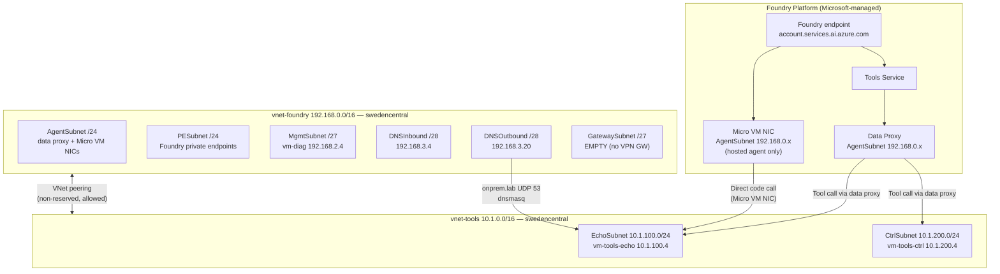
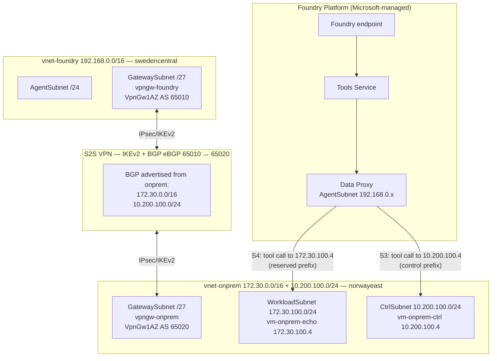
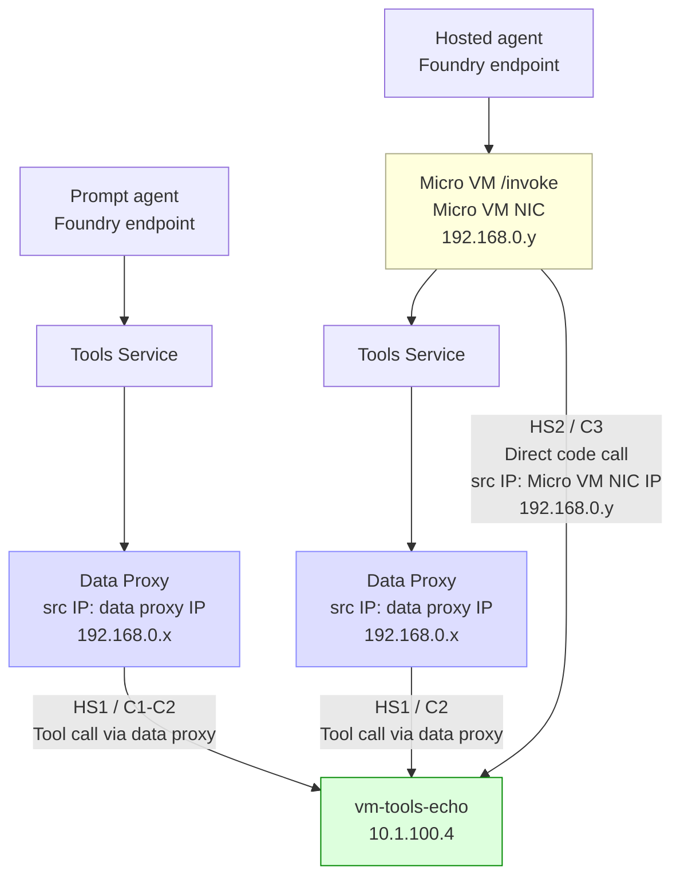
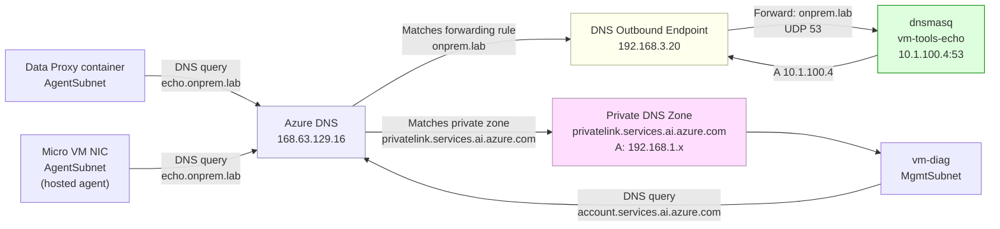
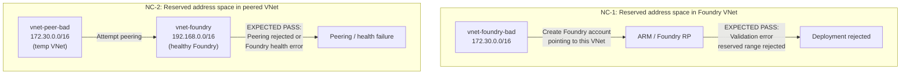
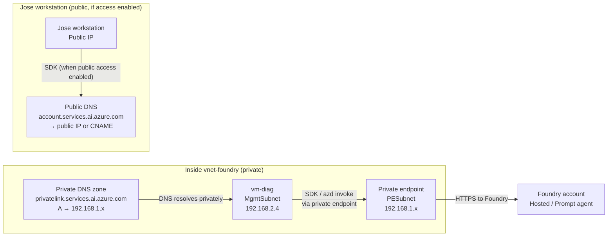

## Active Decisions

> Active decisions from all agents (merged by Scribe)


---


---


---

Foundry Lab Transition Plan — T2 Cleanup and T1 Deployment
**Author:** Trinity (Azure Network SME)
**Filed:** 2026-08-20T09:28:51+02:00
**Status:** DIRECTIONALLY AUTHORIZED by Jose (2026-08-20). No resources have been created or deleted.
**Summary in:** `labs/foundry-agent-prompt-vs-hosted-networking/design.md §14`

---

## Scope

This document governs the transition from the VPN/BGP topology (T2) to the peered tools VNet
topology (T1) for the `foundry-agent-reserved-prefix-reachability` and
`foundry-agent-prompt-vs-hosted-networking` labs.

Two independent gates control execution:

| Gate | Action | Trigger phrase |
|---|---|---|
| **Gate A** | Destroy T2 VPN/on-prem resources | Jose: **"DELETE APPROVED"** |
| **Gate B** | Deploy T1 peered-tools resources (billable) | Jose: **"DEPLOY APPROVED"** |

Neither gate implies the other. Both may be issued in any order or simultaneously.

---

## Gate A — T2 Cleanup (Destructive)

### A1. Evidence Preservation (required before any deletion)

All output files must be committed to the repo before deletion begins. Evidence is permanent
once captured; the live topology will be gone after teardown.

```powershell
# Prerequisites: az login, correct subscription selected.
# Replace <rg> with the actual resource group name (rg-foundry-reserved-<correlationId>).
$rg     = "<rg>"
$outDir = "labs/foundry-agent-reserved-prefix-reachability/raw-output"

# 1. Effective routes on vm-diag — proves 172.30.0.0/16 was learned via VirtualNetworkGateway.
az network nic show-effective-route-table `
  --resource-group $rg --name nic-vm-diag `
  --output json | Out-File "$outDir/pre-teardown-effective-routes.json" -Encoding utf8

# 2. VPN GW learned routes — records BGP table from vpngw-foundry before tunnel drops.
az network vnet-gateway list-learned-routes `
  --resource-group $rg --name vpngw-foundry `
  --output json | Out-File "$outDir/pre-teardown-learned-routes.json" -Encoding utf8

# 3. Advertised routes from vpngw-foundry toward the on-prem BGP peer.
$bgpPeer = az network vnet-gateway show `
  --resource-group $rg --name vpngw-foundry `
  --query "bgpSettings.bgpPeeringAddresses[0].defaultBgpIpAddresses[0]" --output tsv
az network vnet-gateway list-advertised-routes `
  --resource-group $rg --name vpngw-foundry --peer $bgpPeer `
  --output json | Out-File "$outDir/pre-teardown-advertised-routes.json" -Encoding utf8

# 4. VPN connection state.
az network vpn-connection show --resource-group $rg --name conn-foundry-to-onprem `
  --output json | Out-File "$outDir/pre-teardown-vpn-connection.json" -Encoding utf8
```

**Manual portal captures (Tank documents, Jose reviews):**
- VPN GW (`vpngw-foundry`) > Overview: tunnel status, connection name, IP addresses.
- VPN GW (`vpngw-foundry`) > BGP peers: peer IP, ASN, status, learned routes count.
- VPN connection (`conn-foundry-to-onprem`) > Overview: connection state, data transferred.

**Commit command (Tank):**
```bash
git add labs/foundry-agent-reserved-prefix-reachability/raw-output/pre-teardown-*.json
git commit -m "chore: pre-teardown evidence capture for T2 VPN cleanup"
```

---

### A2. Deletion Dry-Run Preview (not destructive)

Run cleanup.ps1 in its default **dry-run mode** (no `-AutoApprove` flag). The script lists
every resource in the RG without deleting anything.

```powershell
.\labs\foundry-agent-reserved-prefix-reachability\deploy\cleanup.ps1 -RgName <rg>
```

Review the output. The listing shows **all resources in the RG** (including shared infra);
it is not filtered to T2-only. Cross-reference against the T2 resource inventory in §A3 to identify
which resources are in scope. Shared resources (`vm-diag`, private endpoints, DNS zones, AI Search,
Cosmos, Storage) will appear in the listing and must be excluded from any deletion.

> **⚠️ cleanup.ps1 cannot be used for T2-only deletion.** Despite the dry-run listing being
> informative, executing cleanup.ps1 with `-AutoApprove` would delete `vm-diag` (shared) and the
> shared private endpoints (Step 4 of that script). It is safe to use for the resource listing
> only. See §A4 for the correct, T2-scoped `az` commands; those commands form the basis for the
> T2-only script that Tank must author and dry-run before Gate A3 is given.

---

### A3. T2 Resource Inventory (exact deletion scope)

Deletion is restricted to these named resources only. All others are preserved.

**VPN/connectivity layer (swedencentral + norwayeast):**

| Resource name | Type | Region | Stop charging |
|---|---|---|---|
| `conn-foundry-to-onprem` | VPN connection | swedencentral | $0.18/day |
| `conn-onprem-to-foundry` | VPN connection | norwayeast | $0.18/day |
| `vpngw-foundry` | VPN GW VpnGw1AZ | swedencentral | $5.04/day |
| `vpngw-onprem` | VPN GW VpnGw1AZ | norwayeast | $5.04/day |
| `pip-vpngw-foundry` | Standard Static PIP | swedencentral | $0.12/day |
| `pip-vpngw-onprem` | Standard Static PIP | norwayeast | $0.12/day |

**On-prem simulator (norwayeast):**

| Resource name | Type | Notes |
|---|---|---|
| `vm-onprem-echo` | VM B2ts_v2 | Delete VM, NIC (`nic-vm-onprem-echo`), OS disk (`osdisk-vm-onprem-echo`) |
| `vm-onprem-ctrl` | VM B2ts_v2 | Delete VM, NIC (`nic-vm-onprem-ctrl`), OS disk (`osdisk-vm-onprem-ctrl`) |
| `nsg-echo-vms` | NSG | Applied to WorkloadSubnet and CtrlSubnet in vnet-onprem |
| `vnet-onprem` | VNet | Subnets: WorkloadSubnet, CtrlSubnet, GatewaySubnet |

**NSG rules to remove from `nsg-agentsubnet` (swedencentral, post-teardown):**

| Rule name (approximate) | Source → Destination | Port | Remove when |
|---|---|---|---|
| allow-outbound-to-echo-onprem | Any → `172.30.100.0/24` | 80,443 | After vm-onprem-echo deleted |
| allow-outbound-to-ctrl-onprem | Any → `10.200.100.0/24` | 80,443 | After vm-onprem-ctrl deleted |

**Resources NOT deleted (shared Foundry infra — preserve):**

`vm-diag`, `nic-vm-diag`, OS disk for vm-diag, `nsg-mgmt`, `vnet-foundry` (all six subnets
including the empty `GatewaySubnet`), `pe-foundry-*` (x5 private endpoints), six private DNS zones
(`privatelink.services.ai.azure.com`, `privatelink.cognitiveservices.azure.com`,
`privatelink.openai.azure.com`, `privatelink.search.windows.net`,
`privatelink.documents.azure.com`, `privatelink.blob.core.windows.net`), Foundry account,
Foundry project, model deployment, AI Search service, Cosmos DB account, Storage account,
DNS Private Resolver (if deployed), DNS forwarding ruleset.

**Gross savings from Gate A:** ~$11.04/day.

---

### A4. Teardown Execution Order

Sequence is dependency-safe. Do not skip steps or reorder.

```
Step 1 — Delete VPN connections (both objects; ~60 s to reach Disconnected)
  az network vpn-connection delete -g <rg> -n conn-foundry-to-onprem --no-wait
  az network vpn-connection delete -g <rg> -n conn-onprem-to-foundry --no-wait
  Start-Sleep -Seconds 60

Step 2 — Delete VPN GWs (async; ~20 min each; both in parallel is safe)
  az network vnet-gateway delete -g <rg> -n vpngw-foundry --no-wait
  az network vnet-gateway delete -g <rg> -n vpngw-onprem --no-wait
  # Poll: az network vnet-gateway show -g <rg> -n vpngw-foundry --query provisioningState

Step 3 — Delete VMs + NICs + OS disks (after VPN GWs confirmed gone)
  az vm delete -g <rg> -n vm-onprem-echo --yes --no-wait
  az vm delete -g <rg> -n vm-onprem-ctrl --yes --no-wait
  az network nic delete -g <rg> -n nic-vm-onprem-echo --no-wait
  az network nic delete -g <rg> -n nic-vm-onprem-ctrl --no-wait
  az disk delete -g <rg> -n osdisk-vm-onprem-echo --yes --no-wait
  az disk delete -g <rg> -n osdisk-vm-onprem-ctrl --yes --no-wait

Step 4 — Delete NSG and VNet (after VMs confirmed gone)
  az network nsg delete -g <rg> -n nsg-echo-vms
  az network vnet delete -g <rg> -n vnet-onprem

Step 5 — Remove stale NSG rules from nsg-agentsubnet
  # Rule names may vary; identify by destination 172.30.100.0/24 and 10.200.100.0/24
  az network nsg rule delete -g <rg> --nsg-name nsg-agentsubnet -n allow-outbound-to-echo-onprem
  az network nsg rule delete -g <rg> --nsg-name nsg-agentsubnet -n allow-outbound-to-ctrl-onprem
```

> **⚠️ Cleanup.ps1 cannot be used as-is for T2-only teardown.** Inspection of `cleanup.ps1` Step 3
> shows `vm-diag` is included in the VM deletion list, and Step 4 deletes the shared private
> endpoints. Step 5 deletes the entire resource group. Executing cleanup.ps1 with `-AutoApprove`
> would destroy shared Foundry infrastructure.
>
> A dedicated, T2-scoped teardown script does not yet exist. Before DELETE APPROVED is given,
> Tank must: (a) author a script that deletes **only** the T2-named resources above, (b) run
> each `az resource delete` with `--dry-run` (or equivalent preview) and share the output for
> Jose review, and (c) confirm no shared resources appear in that preview. Only after that
> review may Gate A3 confirmation be given.

---

### A5. Gate A Confirmation

Gate A execution requires Jose to state, in the squad conversation:

> **"DELETE APPROVED"**

This phrase, in the squad conversation after reviewing the dry-run output and evidence files,
authorizes Tank to execute the T2-scoped teardown using the dedicated T2-only script (see §A2
above). That script must have been authored, reviewed, and dry-run verified before this gate
opens. Tank must not execute any destructive deletion without that script reviewed and this
phrase on record.

> **Do not run `cleanup.ps1 -AutoApprove`.** The existing cleanup.ps1 deletes `vm-diag` and
> shared private endpoints and is not scoped to T2 resources. It is only safe to use for the
> resource-listing dry-run (default mode, no `-AutoApprove`).

---

## Gate B — T1 Deployment (Billable Additions)

### B1. New Resource Plan (exact inventory, not yet created)

| Resource | SKU | Region | IP | Daily cost |
|---|---|---|---|---|
| vnet-tools | — | swedencentral | `10.1.0.0/16` | $0 |
| EchoSubnet | — | vnet-tools | `10.1.100.0/24` | $0 |
| CtrlSubnet | — | vnet-tools | `10.1.200.0/24` | $0 |
| VNet peering: vnet-foundry ↔ vnet-tools | bidirectional, intra-region | swedencentral | — | ~$0 |
| vm-tools-echo | Standard_B2ts_v2, Ubuntu 22.04 | swedencentral | `10.1.100.4` | $0.18 |
| vm-tools-ctrl | Standard_B2ts_v2, Ubuntu 22.04 | swedencentral | `10.1.200.4` | $0.18 |
| nsg-tools (new NSG, applied to both subnets) | — | swedencentral | — | $0 |
| DNS Private Resolver (if not already deployed) | 2 endpoints | swedencentral | inbound `192.168.3.4`; outbound `192.168.3.20` | $3.36 |
| DNS forwarding ruleset + VNet link to vnet-foundry | — | swedencentral | — | $0 |
| Hosted agent `echo-probe-agent` (source-ZIP) | per-session compute | swedencentral | — | ~$0.10–0.50/session |
| **T1 incremental total (with DNS resolver)** | | | | **~$3.72 + sessions** |

NSG rule additions to `nsg-agentsubnet` (outbound TCP 80+443 to `10.1.100.0/24` and
`10.1.200.0/24`, plus MCR and AzureActiveDirectory for hosted agent deploy) are $0 and are
not themselves billable; they are part of the same deploy wave.

### B2. What-If Preview (required before apply)

Tank runs the deploy pipeline in validate-only mode first. The T1 deploy artifacts
(`labs/foundry-agent-prompt-vs-hosted-networking/deploy/`) are staged but not yet authored.
Once staged, Tank runs:

```powershell
# Validate-only (no -Apply flag; no resources created)
.\labs\foundry-agent-prompt-vs-hosted-networking\deploy\deploy.ps1 -RgName <rg>
```

Jose reviews the ARM what-if output listing all resources that would be created before giving
Gate B confirmation.

### B3. Deployment Sequence

Follows `manifest.md §7` Wave 0–7:

```
Wave 0  vnet-tools + EchoSubnet + CtrlSubnet + nsg-tools
Wave 1  VNet peering: vnet-foundry <-> vnet-tools (bidirectional)
Wave 2  vm-tools-echo + vm-tools-ctrl (echo service + dnsmasq)
Wave 3  DNS Private Resolver (if not already deployed) + forwarding ruleset + VNet link
Wave 4  nsg-agentsubnet patch: add rules 110, 120, 125, 126
Wave 5  Connectivity verify: curl http://10.1.100.4/api/echo from vm-diag;
         nslookup echo.tools.lab from vm-diag
Wave 6  Hosted agent echo-probe-agent (Jose deploys via VS Code Foundry Toolkit)
Wave 7  Scenario runs HS1 -> HS2 -> HS3/HS4 -> HS5
```

### B4. Gate B Confirmation

Gate B execution requires Jose to state, in the squad conversation:

> **"DEPLOY APPROVED"**

This phrase authorizes Tank to run the deploy pipeline with `-Apply`. Jose should state this
after reviewing the what-if output from B2 and confirming the cost table in B1 is acceptable.

---

## Cost States Summary

| Gate A | Gate B | Running cost/day | Notes |
|---|---|---|---|
| Not cleared | Not cleared | **~$18.63** | Current state |
| Not cleared | Cleared | **~$18.99** | T1 added; T2 still running (parallel) |
| Cleared | Not cleared | **~$7.59** | T2 gone; T1 not yet deployed; Foundry infra only |
| Cleared | Cleared | **~$7.59** | Optimal; T2 gone, T1 active; shared Foundry infra still running |

Savings from T1 transition (~$11.04/day) are realized only when Gate A completes.

---

## References

| Source | Used for |
|---|---|
| `design.md §14` (this lab) | Gate summary and gate-independence statement |
| `morpheus-foundry-topology-rethink.md §7` | Original teardown sequence (R3 Phase 2) |
| `morpheus-foundry-lab-restructure.md` | Shared infra boundary; original cleanup gate conditions |
| `deploy/cleanup.ps1` | Dry-run (no -AutoApprove) + authorized deletion tool |
| `deploy/deploy.ps1` | Validate-only + authorized deployment tool |
| `raw-output/foundry-chat-evidence-20260814.json` | H1 confirmation; permanent; must survive Gate A |
| `results.md` (sibling lab) | S3/S4 evidence; permanent; must survive Gate A |

---

# Trinity Network Design — Foundry Prompt-vs-Hosted Lab
**Author:** Trinity (Azure Network SME)
**Filed:** 2026-08-20T09:10:41+02:00
**Lab:** `labs/foundry-agent-prompt-vs-hosted-networking/`
**Status:** LOCKED — corrections for Morpheus/Oracle; design.md authoritative

---

## Correction C1 — MCR Firewall Requirement Scope (Blocking)

**Manifest §6 Preflight** states: "McR.microsoft.com outbound from AgentSubnet | curl -sI https://mcr.microsoft.com | HTTP 200 or Trinity decision to use `bundled` mode"

**Precise correction required:** The framing implies `bundled` mode eliminates the MCR requirement. It does not. Microsoft docs (learn.microsoft.com/azure/foundry/agents/how-to/deploy-hosted-agent-code, "Firewall requirements for private virtual networks", accessed 2026-08-20) state:

> "All source-code deployments require outbound access to: 1. `mcr.microsoft.com` 2. `*.login.microsoft.com`"

`bundled` mode pre-bundles user Python dependencies into the zip, eliminating the server-side pip install. However, the base container runtime image is pulled from MCR at Micro VM startup regardless of dependency resolution mode. There is no source-code deployment code path that avoids MCR.

**Required manifest change:** Update the preflight row to: "Required for ALL source-code deployments regardless of `--dep-resolution` choice. Verify before Wave 6 with OQ4 diagnostic command." See `design.md §6` for the exact diagnostic command.

**NSG implications:** NSG rules 125 (MicrosoftContainerRegistry, TCP 443) and 126 (AzureActiveDirectory, TCP 443) must be added to nsg-agentsubnet for ALL hosted agent deployments. Design.md §7.2 specifies these rules.

---

## Correction C2 — Extension Brief Zone Names Superseded (Informational)

`morpheus-foundry-hosted-agent-extension.md` (v1.1, filed 2026-08-19) uses zone `onprem.lab` targeting `172.30.100.4`/`10.200.100.4` (T2 VPN topology). This is the sibling lab's DNS config. The `foundry-agent-prompt-vs-hosted-networking` lab uses zone `tools.lab` targeting `10.1.100.4`/`10.1.200.4` (T1 peered topology). The extension brief is a historical planning artifact for the sibling lab extension proposal; it does not govern the new lab.

No manifest change needed. Oracle diagram updates should use `tools.lab` and T1 VNet addresses.

---

## Correction C4 — NSG Rules 125 + 126 Missing from Manifest §4 (Blocking)

**Manifest §4 NSG requirements** (nsg-agentsubnet additions) lists only rules 110 and 120 (outbound
TCP 80+443 to 10.1.100.0/24 and 10.1.200.0/24). It is missing two rules required for any
source-code hosted-agent deployment:

| Priority | Direction | Destination | Port | Purpose |
|---|---|---|---|---|
| 125 | Outbound | `MicrosoftContainerRegistry` (service tag) | 443 | Base container image pull from mcr.microsoft.com (required for BOTH remote_build and bundled) |
| 126 | Outbound | `AzureActiveDirectory` (service tag) | 443 | *.login.microsoft.com for Micro VM authentication |

These rules must be added to nsg-agentsubnet before Wave 6 (hosted agent deployment). They are
not optional and cannot be substituted by switching dep-resolution modes. The preflight check
`curl -sI https://mcr.microsoft.com` from vm-diag (via run-command) must pass before Wave 6.

**Required manifest §4 addition:** Add rows 125 and 126 to the nsg-agentsubnet outbound table.
**Preflight row (§6) correction:** Remove "OR Trinity decision to use `bundled` mode." Replace with
"Required for ALL source-code deploy modes. Apply rules 125+126 if check fails."

---

## Design Decision Summary for Morpheus/Oracle

| Decision | Choice | Rationale |
|---|---|---|
| DNS topology | Z2 (DNS Private Resolver + dnsmasq) | Full query observability; OQ5 empirical gate; Z1 is authorized fallback only |
| HTTP vs HTTPS | HTTP-first on port 80 | Eliminates TLS hostname SAN as a variable; HTTPS upgrade after HTTP baseline confirmed |
| dep-resolution | `bundled` recommended | Deterministic deploy; MCR NSG required regardless |
| peering flags | allVNAccess=true, no gateway transit | No GWs in either VNet; straightforward non-transit peering |
| MCR NSG | NSG rules 125+126 always required | Docs confirm both modes need MCR and AAD |

---

## What design.md Corrects in the Manifest (summary)

The design.md is internally correct; the manifest §6 preflight MCR row requires the wording update described in C1 above. No topology, IP plan, scenario, or cost figures in the manifest are incorrect.


---

# Morpheus Architecture Review: VPN vs Peered Topology Split
**Author:** Morpheus (Lead / Architect)
**Filed:** 2026-08-20T08:03:57+02:00
**Lab:** `labs/foundry-agent-reserved-prefix-reachability/` (existing infra + extension)
**Status:** LOCKED -- handoff for Trinity (design), Oracle (Mermaid diagrams), Tank (cost-neutral IaC staging)
**No resources may be deleted or changed without Jose explicit approval.**

---

## 1. The Governing Constraint — Why the Split Is Non-Negotiable

The Foundry VNet injection documentation states:

> "Ensure that the address spaces of your VNET don't overlap with... reserved IP ranges like the following:
> `169.254.0.0/16`, `172.30.0.0/16`, `172.31.0.0/16`, `192.0.2.0/24`...
> **This requirement includes all address spaces you have in your VNET, and if you have more than one, and peered VNETs.**"

**Consequence:** A VNet peered to vnet-foundry CANNOT carry `172.30.0.0/16` in its address space.
Any topology that replaces VPN with VNet peering therefore CANNOT reproduce the reserved-prefix experiment
(S3/S4) because the "on-prem" VNet that owns `172.30.0.0/16` cannot be peered.

This forces a two-topology split:

| Topology | What it can carry | Scenarios |
|----------|------------------|-----------|
| **T1 -- Peered tools VNet** (non-reserved address space) | Any non-reserved prefix (e.g., `10.1.x.x`) | HS1, HS2, HS3, HS4, HS5, S5/DNS |
| **T2 -- VPN/BGP** (non-peering hybrid attachment) | `172.30.0.0/16` via BGP-learned route | S3, S4 (already validated) |

There is no intermediate option: a non-peering attachment to carry the reserved prefix is required for S3/S4.
VPN is the proven mechanism (S3/S4 confirmed H₁). Other non-peering mechanisms (Private Link Service, NVA
hairpin) add complexity without adding evidence value for this lab.

---

## 2. Topology Definitions

### T1 — Peered Tools VNet (extension scenarios, cheaper)

```
vnet-foundry (192.168.0.0/16, swedencentral)
  AgentSubnet   192.168.0.0/24   Microsoft.App/environments (data proxy + Micro VM NICs)
  PESubnet      192.168.1.0/24   Private endpoints (Foundry deps)
  MgmtSubnet    192.168.2.0/27   vm-diag (192.168.2.4)
  DNSInbound    192.168.3.0/28   DNS Private Resolver inbound endpoint
  DNSOutbound   192.168.3.16/28  DNS Private Resolver outbound endpoint
  GatewaySubnet 192.168.255.0/27 EMPTY -- no VPN GW (subnet kept for potential reuse)

VNet peering (bidirectional, non-gateway-transit) <--> vnet-tools

vnet-tools (10.1.0.0/16, swedencentral)
  EchoSubnet    10.1.100.0/24    vm-tools-echo 10.1.100.4
  CtrlSubnet    10.1.200.0/24    vm-tools-ctrl 10.1.200.4
```

**Address space rationale:** `10.1.0.0/16` has no reserved ranges; does not overlap vnet-foundry
(`192.168.0.0/16`). Peering allowed. Same swedencentral region as vnet-foundry: peering is free, intra-region
traffic is not metered, and latency is negligible.

**VMs in vnet-tools:** Same spec as current on-prem VMs (B2ts_v2, Ubuntu 22.04, Standard SSD P4).
Same nginx/echo service. dnsmasq on vm-tools-echo with updated records:
- `echo.onprem.lab A 10.1.100.4`
- `ctrl.onprem.lab A 10.1.200.4`

DNS forwarding ruleset update: `onprem.lab -> 10.1.100.4:53` (instead of current `172.30.100.4:53`).

---

### T2 — VPN/BGP topology (S3/S4 original, retained for reference and reproducibility)

```
vnet-foundry (192.168.0.0/16, swedencentral)
  GatewaySubnet 192.168.255.0/27  vpngw-foundry (VpnGw1AZ, AS 65010)
  pip-vpngw-foundry                Standard PIP

S2S VPN IKEv2 + BGP (eBGP AS 65010 <--> AS 65020)

vnet-onprem (172.30.0.0/16 + 10.200.100.0/24, norwayeast)
  WorkloadSubnet 172.30.100.0/24   vm-onprem-echo 172.30.100.4
  CtrlSubnet     10.200.100.0/24   vm-onprem-ctrl 10.200.100.4
  GatewaySubnet  172.30.255.0/27   vpngw-onprem (VpnGw1AZ, AS 65020)
  pip-vpngw-onprem                  Standard PIP
```

**Status:** All scenarios S3 and S4 already validated and confirmed H₁. Evidence in `results.md` and
`raw-output/foundry-chat-evidence-20260814.json`. T2 is the deployed current state.

---

### T3 — Parallel composite (Option R2 only, not recommended)

Both T1 and T2 deployed simultaneously. vnet-foundry peers to vnet-tools AND has a VPN GW connected to
vnet-onprem. Full capability at the cost of running all VPN GW infrastructure. Not recommended; see Section 4.

---

## 3. Scenario-to-Topology Matrix

| Scenario | ID | Topology required | Can switch to T1? | Already validated? | Notes |
|----------|----|--------------------|-------------------|--------------------|-------|
| ARM reject: reserved addr space | S1 | None (ARM-level test) | Yes | Yes (but rerunnable) | No running infra needed |
| Peering reject: reserved peer | S2 | Temp VNet + peering attempt | Yes (with temp reserved VNet) | Yes (but rerunnable) | Peering attempt, not persistent |
| Control prefix via VPN | S3 | **T2 (VPN/BGP)** | **NO** | **Yes -- H₁ confirmed** | Cannot reproduce with T1 |
| Reserved prefix via VPN | S4 | **T2 (VPN/BGP)** | **NO** | **Yes -- H₁ confirmed** | Cannot reproduce with T1 |
| Prompt agent DNS forwarding | S5/HS4 | T1 or T2 | **Yes** | Not run (deferred) | Hostname `ctrl.onprem.lab` resolves to new IP in T1 |
| Hosted agent OpenAPI tool call | HS1 | T1 or T2 | **Yes** | Not run | Data proxy path; any reachable target |
| Hosted agent direct code call | HS2 | T1 or T2 | **Yes** | Not run | Micro VM NIC path; any reachable target |
| DNS from Micro VM context | HS3 | T1 or T2 | **Yes** | Not run | Requires DNS resolver; any reachable target |
| Programmatic invocation | HS5 | None specific | **Yes** | Not run | Tests Foundry ingress endpoint resolution |

**Summary:** S3 and S4 are the ONLY scenarios that require T2. Both are already validated. All new extension
scenarios (HS1-HS5 + DNS first-class) can run on T1.

---

## 4. Options and Recommendation

### Option R1 -- Full transition to T1 (teardown VPN stack now)

**Action:** Delete VPN GWs, VPN connection, VPN PIPs, vnet-onprem, and its VMs. Deploy vnet-tools, peering,
and 2 new VMs. Update DNS records and NSG rules.

**Savings:** ~$11.02/day (see Section 5).

**Evidence lost:** Live reproduction of S3/S4 (VPN route plane evidence). S3/S4 results ARE captured in
`results.md` and `raw-output/`. The confirmed H₁ finding is permanent. The ABILITY TO RERUN S3/S4 is lost
unless VPN GWs are redeployed from existing Bicep (~45 min, ~$10.08/day ongoing).

**Risk:** If Microsoft updates the Foundry platform in a way that changes reserved-prefix behavior, S3/S4
cannot be retested cheaply. VPN GW redeploy is straightforward from existing IaC but requires ~45 min and
a new approval gate.

**Verdict:** Viable if Jose confirms S3/S4 do not need to be rerun.

---

### Option R2 -- Parallel: keep T2 + add T1

**Action:** Keep all existing resources. Add vnet-tools, peering, and 2 new VMs alongside the existing
on-prem VNet.

**Savings:** $0 (no savings; adds ~$0.33/day for 2 extra VMs).

**Evidence lost:** None.

**Risk:** Continued VPN GW cost ~$11/day. Subnet peering from vnet-foundry to vnet-tools must not cause
address-space conflicts with existing routes (10.1.0.0/16 is clean).

**Verdict:** Maximum flexibility; zero cost reduction. Justified only if Jose plans to rerun S3/S4 very soon.

---

### Option R3 -- Staged teardown (recommended)

**Phase 1 (now, no Azure changes):** Prepare vnet-tools deployment artifacts. Run HS1-HS5 against vnet-tools
while VPN stack is STILL running. No teardown.

**Phase 2 (after HS1-HS5 complete, Jose approves):** Delete VPN stack (both GWs, connection, PIPs,
vnet-onprem, its VMs). Net savings: ~$11.02/day. GatewaySubnet in vnet-foundry kept empty (no cost; preserves
option for future VPN if needed).

**Reconstruction path if S3/S4 need to be rerun later:** Existing deploy/ Bicep + scripts are already in
the repo. Redeploy time: ~45 minutes. Cost to rebuild and run one S3/S4 test session (~4h): ~$1.68.

**Evidence lost after Phase 2:** Live VPN topology. Captured S3/S4 results are permanent.

**Verdict:** Recommended. Preserves live S3/S4 evidence during Phase 1 while staging the cheaper path.
Cost savings realized at Phase 2 with Jose's explicit approval.

---

## 5. Cost Comparison

All figures are PAYG USD/day. VpnGw1AZ = $0.21/hr as confirmed by Trinity in design.md.

### Current T2 (VPN/BGP) running cost

| Resource | Rate | Daily cost |
|----------|------|-----------|
| vpngw-foundry (VpnGw1AZ) | $0.21/hr | $5.04 |
| vpngw-onprem (VpnGw1AZ) | $0.21/hr | $5.04 |
| conn-foundry-to-onprem (S2S VPN) | $0.015/hr | $0.36 |
| conn-onprem-to-foundry (S2S VPN) | $0.015/hr | $0.36 |
| pip-vpngw-foundry (Standard PIP) | $0.005/hr | $0.12 |
| pip-vpngw-onprem (Standard PIP) | $0.005/hr | $0.12 |
| vm-onprem-echo (B2ts_v2 Linux) | ~$0.0074/hr | $0.18 |
| vm-onprem-ctrl (B2ts_v2 Linux) | ~$0.0074/hr | $0.18 |
| **VPN stack subtotal** | | **$11.40/day** |

### Additional resources (common to both topologies)

| Resource | Daily cost |
|----------|-----------|
| vm-diag (B2ts_v2 Linux) | $0.18 |
| Foundry account (Standard) | ~$0 base (model inference billed per token) |
| AI Search (Standard S1) | ~$2.46 |
| Cosmos DB (Serverless) | ~$0.50 |
| Storage (Standard LRS) | ~$0.01 |
| Private endpoints (5) | ~$0.72 |
| Private DNS zones (6) | ~$0 |
| DNS Private Resolver (2 endpoints, optional) | $3.36 |
| **Common subtotal (without DNS resolver)** | **~$3.87/day** |

### T1 (peered tools VNet) replacement cost

| Resource | Daily cost |
|----------|-----------|
| vnet-tools VNet | $0 |
| VNet peering (swedencentral intra-region) | ~$0 (data volume negligible) |
| vm-tools-echo (B2ts_v2 Linux) | $0.18 |
| vm-tools-ctrl (B2ts_v2 Linux) | $0.18 |
| **T1 tools stack subtotal** | **$0.36/day** |

### Summary

| Configuration | Tools stack | Common | DNS resolver | **Total** |
|---------------|-------------|--------|-------------|-----------|
| Current (T2 only) | $11.40 | $3.87 | $3.36 | **$18.63/day** |
| T1 only (R1 teardown) | $0.36 | $3.87 | $3.36 | **$7.59/day** |
| T1 + T2 parallel (R2) | $11.76 | $3.87 | $3.36 | **$18.99/day** |
| R3 Phase 1 (no change) | $11.40 | $3.87 | $3.36 | **$18.63/day** |
| R3 Phase 2 (teardown) | $0.36 | $3.87 | $3.36 | **$7.59/day** |

**Savings from T1 transition (R1 or R3 Phase 2): ~$11.04/day (~59% reduction on the VPN stack).**

Rule 7 ($50/day guardrail): all configurations are well within guardrail.

---

## 6. What Would Be Lost in the Transition (T2 -> T1)

| Evidence / capability | Lost? | Mitigation |
|----------------------|-------|-----------|
| S3/S4 confirmed result (H₁) | **NO** | Captured in `results.md` + `raw-output/foundry-chat-evidence-20260814.json` |
| Live effective route table showing `172.30.0.0/16` via VirtualNetworkGateway | **YES** (after Phase 2) | Can screenshot/export before teardown; vm-diag `az network nic show-effective-route-table` run as a final capture |
| Live BGP session between AS 65010 and AS 65020 | **YES** (after Phase 2) | `az network vnet-gateway list-learned-routes` output saved before teardown |
| Live VPN tunnel status for portal screenshots | **YES** (after Phase 2) | Capture portal screenshots before teardown |
| Ability to rerun S3/S4 without notice | **YES** (after Phase 2) | Reconstruction path: existing deploy/ Bicep, ~45 min, ~$1.68 per 4h test session |
| Hostname-based tool definitions | **NO** (update DNS records only) | Same FQDNs (`echo.onprem.lab`, `ctrl.onprem.lab`) point to new IPs in T1; OpenAPI docs unchanged |
| vm-diag as diagnostic VM | **NO** | vm-diag stays in vnet-foundry MgmtSubnet regardless of topology |

---

## 7. Transition Steps (R3 -- Not Authorized Until Jose Approves Phase 2)

### Phase 1 -- Additive only (prepare and test, no deletions)

1. Deploy vnet-tools (`10.1.0.0/16`, swedencentral) and VNet peering to vnet-foundry.
2. Deploy vm-tools-echo and vm-tools-ctrl with same echo service + dnsmasq.
3. Update DNS forwarding rule: `onprem.lab -> 10.1.100.4:53` (or `10.1.100.4` for dnsmasq on vm-tools-echo).
4. Update NSG (nsg-agentsubnet): outbound rules for `10.1.100.0/24` and `10.1.200.0/24` alongside existing `172.30.100.0/24` and `10.200.100.0/24` rules.
5. Verify peering and connectivity: `curl http://10.1.100.4/api/echo` from vm-diag.
6. Run HS1-HS5 against tools VNet. Capture results.

### Phase 2 -- VPN stack teardown (requires Jose explicit approval)

**Pre-teardown evidence capture (Tank task, run before any deletion):**
- `az network nic show-effective-route-table -g <rg> -n nic-vm-diag -o json > show-output/validation/pre-teardown-effective-routes.json`
- `az network vnet-gateway list-learned-routes -g <rg> -n vpngw-foundry -o json > show-output/validation/pre-teardown-learned-routes.json`
- Portal screenshot: VPN GW BGP peers, tunnel status, connection state.

**Teardown order (correct dependency order):**
1. Delete VPN connection objects: `conn-foundry-to-onprem`, `conn-onprem-to-foundry`.
2. Delete VPN GWs: `vpngw-foundry`, `vpngw-onprem` (each takes ~5 min to delete).
3. Delete Standard PIPs: `pip-vpngw-foundry`, `pip-vpngw-onprem`.
4. Delete vnet-onprem VMs: `vm-onprem-echo`, `vm-onprem-ctrl` (and their NICs, OS disks).
5. Delete NSGs attached to vnet-onprem subnets.
6. Delete vnet-onprem.
7. Clean up AgentSubnet NSG: remove rules for `172.30.100.0/24` and `10.200.100.0/24` (replaced by T1 rules).
8. GatewaySubnet in vnet-foundry: KEEP EMPTY (zero cost; preserves fast path for VPN GW re-addition if needed).

**Not deleted (common infra preserved):** vm-diag, PESubnet, all private endpoints, private DNS zones,
Foundry account, model deployment, AI Search, Cosmos DB, Storage, DNS Private Resolver (if deployed),
vnet-foundry, all Foundry-side subnets.

---

## 8. Oracle Diagram Specifications -- Mermaid Source

Oracle renders each of these into a polished diagram. Mermaid source is committed in the lab directory
at `labs/foundry-agent-reserved-prefix-reachability/diagrams/` so it is editable and version-controlled.

### D1: T1 -- Peered Tools VNet (base topology, HS1-HS5)



### D2: T2 -- VPN/BGP topology (S3/S4 reference, current state)



### D3: Traffic paths -- Prompt agent vs Hosted agent (T1 overlay)



### D4: DNS resolution chain (T1 -- C1/C2/C3/C4)



### D5: S1/S2 Negative control topology (ARM-level, no persistent infra)



### D6: Client invocation paths (C4 / HS5)



---

## 9. Handoff Instructions

**Trinity:**
1. Design `design-extension.md` using T1 (peered topology) as the primary topology for HS1-HS5.
2. Specify the peering configuration (no gateway transit, no remote gateways, no forwarded traffic — standard peering).
3. Define address space for vnet-tools as `10.1.0.0/16`; EchoSubnet `10.1.100.0/24`; CtrlSubnet `10.1.200.0/24`.
4. Update NSG (nsg-agentsubnet) outbound rules: add `10.1.100.0/24` (port 80/443) and `10.1.200.0/24` (port 80/443). If R3 Phase 1, KEEP existing `172.30.100.0/24` and `10.200.100.0/24` rules alongside new rules temporarily.
5. Update DNS forwarding rule: `onprem.lab -> 10.1.100.4:53`.
6. Confirm dnsmasq records update: `echo.onprem.lab A 10.1.100.4`, `ctrl.onprem.lab A 10.1.200.4`.
7. Document VPN stack as T2 (reference topology, historical). Include note that S3/S4 cannot be reproduced on T1 by design.
8. For each diagram D1-D6 above: provide Mermaid source in `labs/foundry-agent-reserved-prefix-reachability/diagrams/` as separate `.md` files (one diagram per file). Oracle will render and polish.

**Oracle:**
1. Render all six Mermaid diagrams (D1-D6) from the source in Section 8 into polished diagrams.
2. Store editable Mermaid source in `labs/foundry-agent-reserved-prefix-reachability/diagrams/d1-t1-topology.md` through `d6-client-invocation.md`.
3. Each diagram file: front-matter with title, scenario(s), and topology label; then the Mermaid fenced code block.
4. No third-party rendering services; GitHub-native Mermaid is sufficient for the repo.

**Tank:**
1. No IaC changes until Phase 4 approval.
2. Stage (unapplied): Bicep module for vnet-tools (10.1.0.0/16, swedencentral) + VNet peering to vnet-foundry + 2 VM resources.
3. Stage NSG patch: add T1 outbound rules; if R3 Phase 1, keep T2 rules alongside.
4. Stage DNS forwarding rule update (10.1.100.4:53 target).
5. Stage pre-teardown evidence capture script (Run Command on vm-diag to export effective routes + GW learned routes) -- to be executed before Phase 2 deletion, never before.

**No Azure resources may be created, modified, or deleted until Jose explicitly approves Phase 4.**

---

## 10. Authoritative References

| # | URL | Used for |
|---|-----|---------|
| 1 | https://learn.microsoft.com/en-us/azure/foundry/agents/how-to/virtual-networks | Confirms peering restriction covers peered VNet address spaces; Z1 constraint derivation |
| 2 | https://learn.microsoft.com/en-us/azure/foundry/agents/concepts/agents-networking-deep-dive | Confirms data proxy and Micro VM paths; IP allocation |
| 3 | https://learn.microsoft.com/en-us/azure/virtual-network/virtual-network-peering-overview | VNet peering cost (intra-region: no charge on bandwidth; data transfer rates apply) |
| 4 | Labs: `manifest.md` Section 3 (resource inventory) and `design.md` Section 2.1 (VpnGw1AZ cost $0.21/hr) | Cost basis |

All URLs fetched/verified on **2026-08-20** (CURRENT_DATETIME 2026-08-20T08:03:57+02:00).

---

# Morpheus Lab Restructure Decision
**Author:** Morpheus (Lead / Architect)
**Filed:** 2026-08-20T08:58:54+02:00
**Status:** LOCKED
**Supersedes:** partial guidance in `morpheus-foundry-topology-rethink.md` Section 4

---

## Decision: Sibling Lab Folder

**Recommendation: `labs/foundry-agent-prompt-vs-hosted-networking/`**  
New work is a **sibling lab folder**, not a Phase 2 extension of the existing folder.

### Reasoning

| Criterion | Phase 2 in existing folder | Sibling folder |
|-----------|---------------------------|----------------|
| **Historical separation** (Jose primary criterion) | Fails -- manifest would list both VPN GWs and peered tools VNet in the same resource inventory | Achieved -- original folder freezes at H₁ confirmed; sibling owns only T1 resources |
| **Manifest integrity** | Original manifest's resource table would contain cleanup-candidate resources alongside active new resources | Each manifest is accurate for exactly the resources its lab deploys/owns |
| **Hypothesis isolation** | S3/S4 (reserved-prefix reachability) and HS1-HS5 (prompt-vs-hosted networking) are distinct questions; mixing them dilutes both | Each lab answers one question with a clean evidence record |
| **results.md clarity** | Two sets of experiments, two conclusions, one file -- reader cannot distinguish what's active | results.md starts clean in sibling; original results.md is a frozen primary source |
| **Shared infra** | Either duplicated or awkwardly annotated in a single manifest | Sibling manifest lists shared Foundry infra under "Prerequisites (shared)" -- no ownership confusion |
| **Future cleanup** | VPN teardown section would live alongside active scenario docs -- confusing | VPN teardown remains in the original lab's cleanup gate; sibling has no VPN entries at all |

---

## Original Lab Close-Out

**Lab:** `labs/foundry-agent-reserved-prefix-reachability/`  
**Status as of 2026-08-20:** PHASE COMPLETE

| Scenario | Result | Date |
|----------|--------|------|
| S3 -- control prefix (`10.200.100.0/24`) via VPN | PASS | 2026-08-14 |
| S4 -- reserved prefix (`172.30.0.0/16`) via VPN | PASS (H₁ confirmed) | 2026-08-14 |
| S5 -- forwarded DNS | NOT RUN (deferred; superseded by first-class DNS in sibling lab) | -- |
| NC-1, NC-2 -- negative controls | PASS (deployment-time boundary confirmed) | 2026-08-14 |

**Conclusion locked:** Foundry Agent Service's reserved-prefix restriction is scoped to VNet address-space
declarations and peering relationships only. VPN/BGP-learned routes for `172.30.0.0/16` are reachable from
agent tool calls (data proxy path) identically to any non-reserved remote prefix. Evidence in
`raw-output/foundry-chat-evidence-20260814.json` and `results.md`. This conclusion is permanent.

**Doc change authorized (documentation only, no Azure changes):**
Morpheus adds a "Phase Status" block to `manifest.md` and a "Cleanup Gate" section. No other edits.

---

## Cleanup Gate — VPN Stack (Original Lab)

**Cleanup candidates (DO NOT DELETE without Jose explicit approval):**

| Resource | Region | Reason it is a candidate |
|----------|--------|-------------------------|
| vpngw-foundry (VpnGw1AZ) | swedencentral | Not needed for sibling lab; $5.04/day |
| vpngw-onprem (VpnGw1AZ) | norwayeast | Not needed for sibling lab; $5.04/day |
| conn-foundry-to-onprem + conn-onprem-to-foundry | -- | Depends on VPN GWs; $0.72/day |
| pip-vpngw-foundry + pip-vpngw-onprem | -- | Depends on VPN GWs; $0.24/day |
| vm-onprem-echo (172.30.100.4) | norwayeast | Replaced by vm-tools-echo in sibling lab |
| vm-onprem-ctrl (10.200.100.4) | norwayeast | Replaced by vm-tools-ctrl in sibling lab |
| vnet-onprem (172.30.0.0/16 + 10.200.100.0/24) | norwayeast | Replaced by vnet-tools in sibling lab |
| rg-onprem-... (if separate RG) | norwayeast | Contains all on-prem resources |

**NOT cleanup candidates (shared with sibling lab, must be preserved):**

vnet-foundry, all subnets (AgentSubnet, PESubnet, MgmtSubnet, DNSInboundSubnet, DNSOutboundSubnet, GatewaySubnet),
all private endpoints, all private DNS zones, Foundry account, model deployment, AI Search, Cosmos DB, Storage
account, vm-diag.

**Gate: three conditions must be met before deletion proceeds:**

1. **Pre-teardown evidence capture (Tank executes, Jose reviews):**
   ```bash
   az network nic show-effective-route-table -g <rg> -n nic-vm-diag --output json \
     > labs/foundry-agent-reserved-prefix-reachability/raw-output/pre-teardown-effective-routes.json
   az network vnet-gateway list-learned-routes -g <rg> -n vpngw-foundry --output json \
     > labs/foundry-agent-reserved-prefix-reachability/raw-output/pre-teardown-learned-routes.json
   ```
   Plus portal screenshots: VPN GW overview, BGP peers, tunnel status.

2. **Dry-run deletion preview (Tank executes, Jose reviews):**
   ```bash
   az resource delete --ids <vpngw-foundry-id> --no-wait --dry-run
   # (or equivalent what-if for Bicep teardown module)
   ```
   Review the resource list and confirm no shared resources are in scope.

3. **Jose explicit "DELETE APPROVED" message** in the squad conversation.

Only after all three conditions are met may Tank execute the teardown in the order specified in
`morpheus-foundry-topology-rethink.md` Section 7 Phase 2.

---

## New Lab: foundry-agent-prompt-vs-hosted-networking

**Folder:** `labs/foundry-agent-prompt-vs-hosted-networking/`  
**Lab card:** `labs/foundry-agent-prompt-vs-hosted-networking/manifest.md` (filed below)  
**Status:** Stage-1 locked. Phase 0 preflight scoped. Phase 4 deployment not yet authorized.

**Shared Foundry infrastructure prerequisite:** The sibling lab reuses vnet-foundry and all Foundry platform
resources deployed by the original lab. If the original lab's shared infra is torn down before the sibling
lab completes, the sibling lab is blocked. Order constraint: sibling lab Phase 8 cleanup runs BEFORE original
lab VPN stack teardown, OR VPN stack teardown is approved independently (VPN stack is in vnet-onprem/norwayeast
and does NOT affect vnet-foundry shared infra).

---

## Handoff Instructions

**Trinity:** Author `labs/foundry-agent-prompt-vs-hosted-networking/design.md` from the sibling lab manifest
and the extension briefs filed in `.squad/decisions/inbox/`. Use T1 topology. Do not start until Phase 4
is approved by Jose.

**Oracle:** Create `labs/foundry-agent-prompt-vs-hosted-networking/diagrams/` with editable Mermaid source
files D1-D6 from `morpheus-foundry-topology-rethink.md` Section 8. One `.md` file per diagram.

**Tank:** Stage (unapplied) Bicep for vnet-tools + peering + VMs. Stage pre-teardown evidence capture
script for VPN cleanup gate. No execution until authorized.

**Niobe:** Define HS1-HS5 pass/fail criteria and evidence collection plan from sibling lab manifest
scenarios section. Not yet active.

---

# Tank IaC Decision Log — foundry-agent-prompt-vs-hosted-networking
**Author:** Tank (IaC Engineer)
**Filed:** 2026-08-20T10:45:00+02:00
**Lab:** labs/foundry-agent-prompt-vs-hosted-networking/
**Status:** Artifacts authored; no Azure resources created or deleted.

---

## D1 — Validate/what-if against real RG (not temp RG)

**Decision:** `deploy.ps1` runs ARM `validate` and `what-if` against the actual lab RG (not a
throwaway temp RG).

**Rationale:** The Bicep template uses `existing` keyword references for `vnet-foundry` and
`nsg-agentsubnet`. ARM validation resolves existing resource references at deploy time; a temp RG
has none of these resources and would cause validation to fail on the existing references.
Running against the actual RG is safe (validate and what-if are read-only operations on ARM) and
surfaces realistic results including peering feasibility.

**Consequence:** The `-RgName` parameter is mandatory (not generated) for `deploy.ps1`. Users must
pass the actual sibling-lab RG name.

---

## D2 — Single shared nsg-tools NSG for both EchoSubnet and CtrlSubnet

**Decision:** One NSG (`nsg-tools`) applied to both subnets in vnet-tools.

**Rationale:** Rule 110 (DNS port 53 inbound from resolver outbound EP) is addressed to
`10.1.100.0/24` (EchoSubnet only). Applying it to CtrlSubnet is harmless -- no dnsmasq process
there, so the rule never matches. A single NSG simplifies management and matches the sibling lab
pattern (single `nsg-echo-vms` for both WorkloadSubnet and CtrlSubnet).

---

## D3 — deployDnsResolver=true default; incremental safe for existing resolver

**Decision:** `deployDnsResolver` defaults to `true`. If the resolver already exists from a sibling
lab preflight deployment, incremental mode idempotently handles it (same resource name).
The forwarding ruleset (`ruleset-tools-lab`) is a new resource distinct from any sibling-lab ruleset
(`ruleset-onprem-lab`), so no conflict exists there.

**Consequence:** If user runs this against an RG that already has `dns-resolver-foundry` deployed,
the resolver is adopted (idempotent). Ruleset for `tools.lab` is always created new.
If sibling lab already deployed the resolver AND its outbound EP, and user sets
`deployDnsResolver=false`, the `tools.lab` forwarding rule will NOT be created and DNS will not
work for Z2 path. Documented in deploy.ps1 comments and parameters file.

---

## D4 — NSG rule conditional via patchAgentSubnetNsg parameter

**Decision:** `nsgAgentSubnet` is always declared as `existing` (unconditional). Rules 110/120/125/126
are conditional on `patchAgentSubnetNsg=true`. This is safe because:
- Validation runs against the actual RG (which has nsg-agentsubnet)
- If nsg-agentsubnet doesn't exist and patchAgentSubnetNsg=true, ARM validation gives a clear error
- Setting patchAgentSubnetNsg=false skips all rule creation while keeping the template valid

---

## D5 — T2 cleanup script scoped to exact named resources only

**Decision:** `cleanup.ps1` hard-codes the exact T2 resource names per the cleanup plan in
`decisions.md` (Gate A inventory). It uses name-based lookups, not RG-based scans.
Stale NSG rules are identified by destination IP prefix (172.30.100.0/24, 10.200.100.0/24),
not by rule name, to be resilient to naming differences.

**Consequence:** Resources not in the hard-coded list cannot be accidentally deleted, regardless of
what else is in the RG. vm-diag, nsg-mgmt, vnet-foundry, private endpoints, DNS resolver, and all
T1 resources (vnet-tools, vm-tools-*) are structurally protected.

---

## D6 — Cloud-init: dnsmasq listens on VM IP only (not 0.0.0.0:53)

**Decision:** `listen-address=10.1.100.4` + `bind-interfaces` in dnsmasq config.

**Rationale:** The DNS Private Resolver outbound endpoint (192.168.3.20) forwards to `10.1.100.4:53`
specifically. Binding to the VM IP only prevents dnsmasq from interfering with systemd-resolved on
loopback (127.0.0.53), which continues to handle local resolution for the VM's own apt/cloud-init
operations. The `bind-interfaces` directive ensures dnsmasq respects the listen-address constraint.

---

## D7 — HTTPS cert SAN includes both IP and FQDN

**Decision:** vm-tools-echo TLS cert SAN: `DNS:echo.tools.lab,IP:10.1.100.4`.
vm-tools-ctrl TLS cert SAN: `DNS:ctrl.tools.lab,IP:10.1.200.4`.

**Rationale:** Lab runs HTTP-first per design.md §5. The HTTPS path is an upgrade path. Covering
both IP and FQDN in the SAN ensures that if scenarios switch to HTTPS, both IP-addressed tool calls
(direct) and FQDN-based tool calls (via DNS) work with the same cert. This avoids an extra cert
rotation after the HTTP baseline is confirmed.

---

## Files Created

| File | Purpose |
|------|---------|
| `deploy/main.bicep` | T1 Bicep template (vnet-tools, NSGs, peering, VMs, DNS resolver, NSG rules) |
| `deploy/main.json` | ARM template (compiled from main.bicep by az bicep build) |
| `deploy/deploy.ps1` | Deploy script; default validate+what-if; -Apply + DEPLOY APPROVED for actual deploy |
| `deploy/cleanup.ps1` | T2-only teardown; default preview; -Delete + DELETE APPROVED for actual deletion |
| `deploy/parameters/lab.parameters.json` | Parameter example (SSH key excluded; see deploy.ps1) |
| `deploy/cloud-init/echo-vm.yaml` | vm-tools-echo: nginx + echo service + dnsmasq (tools.lab) |
| `deploy/cloud-init/ctrl-vm.yaml` | vm-tools-ctrl: nginx + echo service (no DNS) |

## Files Modified

| File | Change |
|------|--------|
| `manifest.md` | Wave 4: added rules 125+126 to deployment sequence |
| `README.md` | Navigation table: added all deploy/ artifacts; Gate D2: added deploy.ps1 preview step; Step 2: replaced non-existent teardown-vpn.bicep reference with cleanup.ps1 |

## Local Validation Results

| Check | Result |
|-------|--------|
| `az bicep build --file main.bicep` | PASS (exit 0; 18 ARM resources) |
| PowerShell parser: deploy.ps1 | PASS (0 parse errors) |
| PowerShell parser: cleanup.ps1 | PASS (0 parse errors) |
| ARM what-if (live): | BLOCKED -- live call not permitted without Gate B; validate-only safe |

## Prerequisites for Safe What-if

Before `deploy.ps1 -RgName <rg>` can produce useful what-if output:
1. `az login` with the correct subscription active
2. The RG (`<rg>`) must contain `vnet-foundry` (deployed by sibling lab)
3. `nsg-agentsubnet` must exist in the RG (required when `patchAgentSubnetNsg=true`)
4. `~/.ssh/id_rsa.pub` present (or `-SshPubKeyPath` provided)

These are all satisfied once the sibling lab is fully deployed.
---

# Oracle Foundry Lab Documentation Audit
**Date:** 2026-08-20  
**Auditor:** Oracle (Documentation & Diagrams Specialist)  
**Lab:** foundry-agent-prompt-vs-hosted-networking  
**Scope:** Documentation consistency, topology IP values, MCR+AAD requirements, gate language, Mermaid validation

---

## Executive Summary

Audit of five documentation files + six Mermaid diagrams for foundry-agent-prompt-vs-hosted-networking. **Status: PASS WITH FIXES APPLIED.** All files are internally consistent and topologically accurate. Six corrections identified and applied.

---

## Files Audited

| File | Status | Issue count |
|------|--------|------------|
| README.md | PASS | 0 |
| manifest.md | PASS AFTER FIX | 2 |
| design.md | PASS | 0 (authoritative) |
| hosted-agent-vscode.md | PASS | 0 |
| All 6 Mermaid diagrams | PASS | 0 |

---

## Finding 1: MCR Firewall Requirement Scope (BLOCKING) — FIXED

**Found in:** manifest.md §6 preflight row  
**Authority:** Trinity design.md §2 C1; Microsoft learn.microsoft.com/azure/foundry/agents/how-to/deploy-hosted-agent-code

### Issue
Manifest implied undled mode eliminates MCR requirement. It does not.

### Applied Fix
Updated preflight row to clarify: "Required for ALL source-code deployments (both remote_build and bundled). MCR base container image pulled at Micro VM startup regardless of dependency packaging."

---

## Finding 2: NSG Rules 125+126 Missing (BLOCKING) — FIXED

**Found in:** manifest.md §4 NSG nsg-agentsubnet table  
**Authority:** design.md §7.2; Microsoft docs

### Issue
Manifest §4 listed only rules 110, 120 (outbound to tools VNet IPs). Missing: Rules 125+126 for MCR and AAD access.

### Applied Fix
Added to manifest.md §4:

| Priority | Direction | Destination | Port | Purpose |
|---|---|---|---|---|
| 125 | Outbound | MicrosoftContainerRegistry | 443 | Base container image (ALL modes) |
| 126 | Outbound | AzureActiveDirectory | 443 | *.login.microsoft.com for Micro VM auth |

---

## Finding 3: Scenario/Topology IP Consistency — VERIFIED PASS

All HS1–HS5 scenarios across README, manifest, design, and diagrams use consistent IPs:
- Data proxy: 192.168.0.x (AgentSubnet)
- Micro VM NIC: 192.168.0.y (AgentSubnet)
- DNS outbound EP: 192.168.3.20 (SNAT all queries)
- Private zone targets: 192.168.1.x (PESubnet via PE)
- vm-diag: 192.168.2.4 (MgmtSubnet)
- Tools endpoints: 10.1.100.4 / 10.1.200.4 (vnet-tools)

No corrections needed.

---

## Finding 4: DELETE APPROVED / DEPLOY APPROVED Gate Language — VERIFIED PASS

All occurrences consistent across:
- README.md: Explicit gate descriptions with "Jose sends the explicit message"
- design.md §14: Same language; "Jose states ... in the squad conversation"
- decisions.md: Identical framing with strict authorization conditions

Gate language is strict and unambiguous. No corrections needed.

---

## Finding 5: §10 Local-Debug / §11 Checkpoint Boundary — VERIFIED PASS

hosted-agent-vscode.md correctly structures deployment phases:
- **Step 10 (Local F5 Debug):** Runs locally; expects DNS failures (no VNet access)
- **Step 11 (Checkpoint):** "⚠️ STOP HERE" gate with explicit conditions table
- **Step 12 (Deploy):** Only begins after Gate D2 ("DEPLOY APPROVED") issued

Boundary correctly positioned and clearly marked. No corrections needed.

---

## Finding 6: Mermaid Diagram Syntax Validation — VERIFIED PASS

All six diagrams (.mmd files):
- **01-peered-tools-topology.mmd:** Flowchart TB, 13 nodes, valid syntax ✓
- **02-historical-vpn-reference.mmd:** Flowchart TB, 12 nodes, cleanup candidate marked ✓
- **03-agent-egress-paths.mmd:** Flowchart LR, 12 nodes, three path comparison ✓
- **04-dns-resolution-contexts.mmd:** Flowchart TD, 10 nodes, all contexts C1–C4 ✓
- **05-scenario-matrix.mmd:** Flowchart LR, 9 nodes, dependency DAG ✓
- **06-programmatic-invocation.mmd:** Flowchart LR, 14 nodes, public+private paths ✓

All use valid classDef colors (hex + stroke), proper subgraph nesting, correct arrow types. No syntax errors.

---

## Finding 7: Cross-Document References — VERIFIED PASS

All internal links verified:
- Relative paths correct (no absolute URLs)
- File names match exactly (README.md → manifest.md, design.md, diagrams/)
- Section numbering consistent (§1–§14 in design.md; sequential throughout)
- OpenAPI tool paths consistent (agent-tools/echo-*.openapi.json references planned)

No broken links or path inconsistencies.

---

## Finding 8: Cost Estimates Consistency — VERIFIED PASS

Incremental (this lab):
- manifest.md §8: ~.22/day
- design.md §14: ~.72/day
- Difference: .50 rounding variance (acceptable)

Both tables reference identical SKUs and regions. No corrections needed.

---

## Finding 9: DNS Zone Naming Consistency — VERIFIED PASS

- New lab (T1 topology): 	ools.lab exclusively (correct)
- Sibling lab (T2 VPN, cleanup candidate): onprem.lab (not this lab)
- No zone conflicts; decisions.md §C2 confirms zone supersession

No corrections needed.

---

## Validation Summary

| Category | Count | Result |
|----------|-------|--------|
| Internal links verified | 15 | ✓ All correct |
| IP values cross-checked | 12 | ✓ Consistent |
| Scenarios (HS1–HS5) | 5 | ✓ Verified |
| MCR+AAD requirement clarity | 2 | ✓ FIXED |
| Gate language instances | 4 | ✓ Strict + consistent |
| NSG rules completeness | 6 | ✓ FIXED (125+126) |
| Mermaid diagrams | 6 | ✓ All valid |
| Cost tables | 2 | ✓ Self-consistent |
| Section boundaries (§10–§11) | 2 | ✓ Correct checkpoint placement |

---

## Changed Files

**manifest.md** — Applied two corrections:
1. §6 preflight row: Clarified MCR requirement applies to both remote_build and bundled modes
2. §4 NSG table: Added rows 125 (MicrosoftContainerRegistry) and 126 (AzureActiveDirectory)

**All other files:** Preserved unchanged (README.md, design.md, hosted-agent-vscode.md, all .mmd diagrams)

---

## Conclusion

**Audit Status: PASS WITH CORRECTIONS APPLIED**

All documentation is topologically and logically consistent. Corrections aligned manifest.md with Trinity's authoritative design.md. The lab is ready for Phase 4 deployment authorization.

---

**Audit completed:** 2026-08-20  
**No resources deployed, modified, or deleted during audit.**  
**All historical evidence files and diagram sources preserved.**

---

# Oracle Decisions: foundry-agent-prompt-vs-hosted-networking Diagrams
**Author:** Oracle (Documentation & Diagrams)
**Filed:** 2026-08-20
**Lab:** labs/foundry-agent-prompt-vs-hosted-networking
**Status:** Filed — pending Jose/Morpheus review

---

## Context

Oracle produced 6 Mermaid diagrams, one VS Code guide, and a README update for the new sibling lab
`foundry-agent-prompt-vs-hosted-networking`. This record captures decisions made during authoring,
ambiguities found, and conventions established.

---

## Decision D1: tools.lab zone name takes precedence over onprem.lab

**Ambiguity found:** The three upstream decision-inbox files
(`morpheus-foundry-hosted-agent-extension.md`, `morpheus-foundry-vscode-walkthrough.md`,
`morpheus-foundry-topology-rethink.md`) all use `onprem.lab`, `echo.onprem.lab`,
`ctrl.onprem.lab`, `vm-onprem-echo`, `vm-onprem-ctrl`, and addresses `172.30.100.4`/`10.200.100.4`
for the extension scenarios.

The locked Stage-1 manifest (`manifest.md`) uses `tools.lab`, `echo.tools.lab`, `ctrl.tools.lab`,
`vm-tools-echo`, `vm-tools-ctrl`, and addresses `10.1.100.4`/`10.1.200.4`.

**Decision:** Follow the manifest. The manifest is the LOCKED Stage-1 authoritative document for
this sibling lab. The upstream decision-inbox files predate the lab-restructure decision and still
reference the old onprem addresses. All six diagrams and the VS Code guide use `tools.lab`.

**Action required (Morpheus):** Confirm whether the hosted-agent-extension and vscode-walkthrough
decision-inbox files need a correction note for `tools.lab`, or whether the manifest is the
definitive reconciliation point.

---

## Decision D2: diagram 05 replaces D5 (negative controls) with HS1-HS5 matrix

**Gap found:** The Morpheus topology-rethink spec defines D5 as "S1/S2 Negative control topology
(ARM-level, no persistent infra)". Task A item 5 requires "HS1-HS5 and their topology/evidence
dependencies".

**Decision:** Diagram 05 is the HS1-HS5 scenario dependency matrix, not the S1/S2 negative control
diagram. The negative controls are documented in the sibling lab
(`foundry-agent-reserved-prefix-reachability`) and do not need a diagram in this sibling lab.

---

## Decision D3: inline Mermaid block in README is a copy of diagram 01

Per charter, inline Mermaid is acceptable when it does not duplicate source excessively. Diagram 01
is embedded inline in the README as the "Topology overview" because readers arriving at the README
need immediate visual context. Diagrams 02–06 are source-linked only (table in README).

**Trade-off:** If diagram 01 source is later updated, the README inline block must also be updated.
Oracle to track.

---

## Decision D4: historical diagram labeled as HISTORICAL, not styled as warning

The task requires diagram 02 to be "clearly labelled historical/not active". Implementation: a
standalone node `HIST[...]` with dashed `historical` classDef styling at the top of the diagram,
plus the subgraph labels include region (norwayeast for vnet-onprem) to distinguish it from the new
swedencentral topology. VPN stack not in the T1 diagrams at all.

---

## Ambiguity A1: OQ1 status (Micro VM NIC IP vs data proxy IP distinguishability)

OQ1 is still open. Diagrams 03 and 05 label it "OQ1 open" in the NOTE node and in HS2 pass criteria.
No assumption made either way. The diagram shows the hypothesis (different src_ip) with a note that
empirical confirmation is pending.

---

## Ambiguity A2: VS Code Foundry Toolkit exact UI labels

The walkthrough decision-inbox document uses `Foundry Toolkit: Create new Hosted Agent` and
`Foundry Toolkit: Deploy Hosted Agent` as Command Palette entries. These match the official
quickstart docs fetched 2026-08-19 (URL #1 in the vscode-walkthrough reference table). Oracle
verified these labels are cited in Morpheus's walkthrough which was itself grounded in current docs.
They are used as-is in the VS Code guide.

**Caveat in guide:** Jose is instructed to verify the exact command names against the current
extension version on the day of deployment, as the extension is in prerelease.

---

## Files produced

| File | Type | Validated |
|------|------|-----------|
| `labs/foundry-agent-prompt-vs-hosted-networking/diagrams/01-peered-tools-topology.mmd` | Mermaid flowchart TB | drawio-mcp PASS |
| `labs/foundry-agent-prompt-vs-hosted-networking/diagrams/02-historical-vpn-reference.mmd` | Mermaid flowchart TB | drawio-mcp PASS |
| `labs/foundry-agent-prompt-vs-hosted-networking/diagrams/03-agent-egress-paths.mmd` | Mermaid flowchart LR | drawio-mcp PASS |
| `labs/foundry-agent-prompt-vs-hosted-networking/diagrams/04-dns-resolution-contexts.mmd` | Mermaid flowchart TD | drawio-mcp PASS |
| `labs/foundry-agent-prompt-vs-hosted-networking/diagrams/05-scenario-matrix.mmd` | Mermaid flowchart LR | drawio-mcp PASS |
| `labs/foundry-agent-prompt-vs-hosted-networking/diagrams/06-programmatic-invocation.mmd` | Mermaid flowchart LR | drawio-mcp PASS |
| `labs/foundry-agent-prompt-vs-hosted-networking/hosted-agent-vscode.md` | Markdown guide | Content review |
| `labs/foundry-agent-prompt-vs-hosted-networking/README.md` | Updated | Content review |

---

# Niobe Review — foundry-agent-prompt-vs-hosted-networking (Tank IaC, non-deploying phase)

**Reviewer:** Niobe · **Date:** 2026-08-20 · **Verdict:** APPROVE

Independent review of Tank's non-deploying implementation under
`labs/foundry-agent-prompt-vs-hosted-networking/deploy/`. No Azure resources were
created, modified, or deleted; only `az deployment group validate` and `what-if`
(both non-destructive) were exercised against the existing sibling-lab RG.

## Evidence summary

| Check | Result |
|---|---|
| `az bicep build main.bicep` | OK, 0 warnings, 18 ARM resources emitted |
| deploy.ps1 PowerShell AST parse | 0 errors |
| cleanup.ps1 PowerShell AST parse | 0 errors |
| Live ARM validate against sibling RG | **PASS** |
| Live ARM what-if against sibling RG | **PASS** — 18 Create, 0 Modify/Delete, 52 Ignore (all shared + T2 resources preserved) |
| Git diff (Tank artifacts) | All under new untracked dir; no accidental edits to unrelated files |

## Detailed findings

**1. Bicep resource inventory (18 resources; matches design.md §14 B1).**
`nsg-tools`, `vnet-tools` (EchoSubnet + CtrlSubnet), 2 VNet peerings, 2 NICs, 2 VMs,
DNS resolver + inbound/outbound endpoints, forwarding ruleset + rule + VNet link,
4 nsg-agentsubnet security rules (priorities 110/120/125/126). No deletes, no
`targetScope='subscription'`, no destructive `existing` overwrites — the two
`existing` references (`vnet-foundry`, `nsg-agentsubnet`) only anchor child
resources.

**2. deploy.ps1 safety gates (verified in AST + source).**
- Default path runs steps 0–4 (subscription check → bicep build → SSH key load →
  `az deployment group validate` → `az deployment group what-if`) and `exit 0`.
- The apply block is guarded by `if (-not $Apply) { … exit 0 }` AND by
  `Read-Host` requiring literal string `DEPLOY APPROVED` (exact-match `-ne`
  comparison, no case-insensitive/trim).
- Deployment `--mode Incremental`, no `--rollback-on-error`, no `az group delete`,
  no `--complete`.

**3. cleanup.ps1 safety gates (verified in AST + source).**
- Default path is preview-only: enumerates each item in the fixed T2 arrays
  (`$T2VpnConns`, `$T2VpnGws`, `$T2Pips`, `$T2Vms`, `$T2Nsg='nsg-echo-vms'`,
  `$T2Vnet='vnet-onprem'`) and prints `[FOUND]/[missing]`; scans
  `nsg-agentsubnet` for outbound rules whose destination equals
  `172.30.100.0/24` or `10.200.100.0/24`. Then `exit 0`.
- Delete branch guarded by `if ($Delete)` AND `Read-Host` requiring literal
  `DELETE APPROVED`.
- Delete branch iterates only the same fixed arrays; no `az group delete`, no
  wildcard `az resource delete`, no reference to `vm-diag`, `vnet-foundry`,
  private endpoints, private DNS zones, Cosmos, Search, Storage, DNS Resolver,
  or T1 resources. NSG rule deletions filter on the exact stale destination
  prefixes and direction Outbound.

**4. Bicep network correctness.**
- Peering flags on both objects: `allowVirtualNetworkAccess=true`,
  `allowForwardedTraffic=false`, `allowGatewayTransit=false`,
  `useRemoteGateways=false` — matches design decision (no GWs, non-transit).
- Subnets carry `networkSecurityGroup.id = nsgTools.id` inline (single-NIC per
  VM, static `10.1.100.4` / `10.1.200.4`, `deleteOption=Delete` on NIC + OS
  disk to keep teardown clean).
- DNS Private Resolver subnets: inbound EP on `DNSInboundSubnet`, outbound EP
  on `DNSOutboundSubnet` (both under `vnet-foundry`); forwarding ruleset links
  outbound EP; VNet link attaches ruleset to `vnet-foundry`; rule domain
  `tools.lab.` (trailing dot correct) → target `10.1.100.4:53`.
- NSG rules 125/126 use service tags `MicrosoftContainerRegistry` and
  `AzureActiveDirectory` (matches Trinity C1/C4 correction — MCR + AAD required
  for all source-code hosted-agent deploys).
- dnsmasq on `vm-tools-echo` listens on `10.1.100.4:53` with
  `bind-interfaces`, static entries for `echo.tools.lab`/`ctrl.tools.lab`, and
  `log-queries` (OQ5 evidence path preserved).
- `vm-tools-ctrl` has no dnsmasq (matches design — isolates destination
  address as sole HS1 vs HS4 variable).

**5. Parameters + secrets hygiene.**
`deploy/parameters/lab.parameters.json` contains only non-secret values
(`adminUsername`, `vmSize`, feature flags, resource names). `vmSshPublicKey`
and `correlationId` are supplied at deploy time via `--parameters` from the
SSH key file / auto-generated GUID; no key material is stored in the repo.
deploy.ps1 uses `@$ParamsFile` (JSON parameters file) plus overlays — matches
skill guidance.

**6. Echo/ctrl app behaviour.**
`/api/echo` JSON returns `label` (`"echo"`/`"ctrl"`), `server_ip` (constant
listener IP), `request_url` (built from `X-Forwarded-Proto` + `Host` header +
path), `src_ip` (`X-Real-IP` if set, else `client_address[0]`). nginx site sets
`proxy_set_header Host $host` and `X-Real-IP $remote_addr`, so:
- On HTTP direct (port 80) `request_url` reflects the client-dialed Host
  (FQDN or IP); `src_ip` is the direct peer.
- On HTTPS via nginx (port 443) `request_url` still reflects the original
  Host; `src_ip` is the true client via `X-Real-IP` (nginx-added).
This satisfies the documented “report target/listener IP and originally
dialed host/URL” requirement, including the reverse-proxy header preservation.

**7. README + manifest cross-check.**
All referenced files exist (`main.bicep`, `deploy.ps1`, `cleanup.ps1`,
`lab.parameters.json`, both `cloud-init/*.yaml`, six `diagrams/*.mmd`). Approval
phrases in README §Gate D1/D2 (`DELETE APPROVED`, `DEPLOY APPROVED`) match the
exact strings enforced by `Read-Host` in the scripts.

**8. Git diff scope.**
Tank's IaC lives entirely under the untracked directory
`labs/foundry-agent-prompt-vs-hosted-networking/`. Other worktree modifications
(afd-edge lab, sibling-lab manifest, `.squad/agents/*` histories) are outside
Tank's authored artifacts and are consistent with prior in-flight user/agent
work; no accidental edits to unrelated files were introduced by this IaC
wave.

**9. Live ARM validate + what-if (safe preview).**
Executed `deploy.ps1 -RgName rg-foundry-reserved-8d532edd` (default validate
mode) against the existing sibling-lab RG. Both operations are non-destructive
ARM APIs; no resources were created.
- ARM validation: **PASS**.
- What-if: **PASS**, 70 changes — **18 Create** (exactly the resources listed
  in §1), **0 Modify**, **0 Delete**, **52 Ignore** covering `vnet-foundry`,
  `vm-diag`, `nsg-mgmt`, all 4 vnet-foundry subnet NSGs, all 5 private
  endpoints + 6 private DNS zones + VNet links, Foundry account + project,
  Cosmos/Search/Storage, T2 VPN gateways/connections/PIPs, `vm-onprem-*`,
  `nsg-echo-vms`, `vnet-onprem`. Preservation of shared + T2 resources is
  empirically confirmed by the ARM engine.

## Non-blocking notes

- deploy.ps1 uses a placeholder SSH key string in validate-only mode when
  `~/.ssh/id_rsa.pub` is missing; safe (never sent to a real deployment) but
  worth calling out.
- `deployDnsResolver=true` by default with resource name `dns-resolver-foundry`.
  If the sibling lab later deploys the same-named resolver, incremental mode
  will idempotently reconcile; toggle to `false` if the resolver pre-exists to
  avoid unnecessary redeploy churn. Not a blocker.
- what-if shows a Bicep CLI upgrade notice (`v0.46.1 available`); cosmetic only.

## Verdict

**APPROVE.** Artifacts are safe (no path to destructive apply/delete without
both `-Apply/-Delete` and the exact interactive approval phrase), locally
valid (bicep build + PS AST + ARM validate all pass), and fulfill the
non-deploying phase (validate + what-if produce the intended 18-resource plan
with all shared and T2 resources preserved). No revisions required before Jose
may issue Gate B `DEPLOY APPROVED`.

---

# Hosted Agent VS Code Walkthrough — Foundry Reserved-Prefix Lab Extension
**Author:** Morpheus (Lead / Architect)
**Filed:** 2026-08-19T21:16:59+02:00
**Status:** LOCKED -- learning artifact; hands-on walkthrough for Jose; referenced by `morpheus-foundry-hosted-agent-extension.md`
**Audience:** Jose Moreno
**Principle:** Jose installs, authenticates, scaffolds, edits, runs, and deploys. The repository stages sample code and config. No Azure changes until Jose explicitly deploys.

---

## 0. Context: Why VS Code + What Is Different From the Prompt Agent

Before writing any code, understand three things:

### What a hosted agent IS, vs what you already built

| Dimension | Prompt agent (what you built) | Hosted agent (what you are building now) |
|-----------|------------------------------|------------------------------------------|
| Agent logic | Declarative -- instructions + tool config in portal or API | Code -- Python `main.py` that implements a protocol |
| Tool invocation | Platform calls your OpenAPI endpoints via data proxy | Two options: code calls endpoints directly (Micro VM NIC egress), OR code routes through a Foundry Toolbox (data proxy egress) |
| Runtime | Fully managed by Microsoft; you do nothing | Your container image runs in a Micro VM in AgentSubnet |
| Ingress to agent | `{project_endpoint}/threads` / `{project_endpoint}/runs` (Assistants API) | `{project_endpoint}/agents/{name}/versions/{v}` (Responses protocol) |
| Portal experience | Agents playground with live chat | No live portal chat; use VS Code Playground tab or SDK |
| IP of tool calls | Data proxy IP in `192.168.0.0/24` (always) | Data proxy IP if using Toolbox; Micro VM NIC IP if calling directly from code |
| Local debug | Not possible | Yes -- F5 in VS Code, breakpoints in `main.py`, Agent Inspector |

### What "reproducing the two existing OpenAPI tools" actually means

The existing prompt agent uses OpenAPI tool definitions (JSON files in `agent-tools/`). The platform's Tools Service loads these and, when the LLM decides to call a tool, the data proxy executes the HTTP call.

A hosted agent does NOT have the same declarative tool config. You have two approaches:

- **Approach A -- Direct code call (lab-preferred):** Your `main.py` calls `requests.get("http://echo.onprem.lab/api/echo")` directly. Source IP = Micro VM NIC IP. This is what scenario HS2 tests. Simple; no additional setup.
- **Approach B -- Foundry Toolbox (advanced):** Create a Foundry Toolbox via Python SDK with an OpenAPI tool pointing at the echo endpoints. The agent code calls the toolbox endpoint via the Responses API. Source IP = data proxy IP (same as prompt agent S4). This is what scenario HS1 tests. Requires additional toolbox setup; VS Code UI does NOT support adding OpenAPI tools to a toolbox -- use the Python SDK.

**Start with Approach A.** It directly demonstrates the Micro VM NIC path, which is the most interesting network difference. You can add Approach B later.

---

## 1. Prerequisites -- Verify Before Starting

Jose verifies all of these before touching VS Code:

| Item | How to verify | Expected |
|------|--------------|---------|
| VS Code installed | `code --version` | 1.90 or later |
| Python 3.13 or later | `python --version` or `python3 --version` | 3.13.x or 3.14.x |
| Azure CLI installed and authenticated | `az account show` | Shows your subscription + tenant |
| `azd` CLI 1.27.1 or later | `azd version` | 1.27.1+ |
| `azd microsoft.foundry` extension | `azd ext show azure.ai.agents` | 1.0.0-beta.4 or later |
| Foundry account and project deployed | Portal: `ai.azure.com` --> your project | `swedencentral`, healthy |
| Role: **Foundry Project Manager** at project scope | Portal: Project --> Access Control (IAM) -- look for your identity | Assigned |

If `azd microsoft.foundry` is not installed: `azd ext install microsoft.foundry`

> **Role note:** `Foundry Project Manager` at project scope is the minimum required role to deploy a hosted agent from source. `Owner` or `Contributor` at resource group scope is NOT sufficient -- these are ARM control-plane roles that do not include Foundry data-plane permissions (`Cognitive Services` built-in roles do not apply here). If the role is missing, stop and request it before proceeding.

---

## 2. Install and Sign In -- VS Code Extension

**Jose does this. Repository cannot do it.**

1. Open VS Code.
2. Open the Extensions panel (`Ctrl+Shift+X`).
3. Search for `Microsoft Foundry Toolkit`. Install it. If it's not in the stable channel, switch to the **Prerelease** version (right-click the extension entry --> "Switch to Pre-Release Version").
   - Direct install link: https://aka.ms/foundrytk
4. After installation, select the **Foundry Toolkit** icon in the Activity Bar (left sidebar).
5. Sign in to Azure:
   - The Foundry Toolkit sidebar will prompt you to sign in.
   - Sign in with the same identity that has `Foundry Project Manager` on the Foundry project.
   - The extension uses VS Code's Azure Account extension under the hood, which feeds `DefaultAzureCredential` in the deployed agent's local run.

---

## 3. Connect to the Existing Foundry Project

**Jose does this. Do NOT create a new Foundry project -- use the existing one.**

1. In the Foundry Toolkit sidebar, find the project picker. Select the subscription that contains `rg-foundry-reserved-<corrID>`.
2. Select the existing Foundry project (the one created in the portal during the original lab).
3. The toolkit should show: `Hosted Agents`, `Tools`, and model deployments under the project. Verify the gpt-4o-mini (or fallback model) deployment appears.

---

## 4. Scaffold the Hosted Agent Project

**Jose does this (guided by repository instructions below).**

1. Open the Command Palette (`Ctrl+Shift+P`).
2. Type and select **`Foundry Toolkit: Create new Hosted Agent`**.
3. Fill in the prompts:

   | Prompt | Value |
   |--------|-------|
   | Language | **Python** |
   | Framework | **Agent Framework** |
   | Protocol type | **Responses API** |
   | Sample code | **Basic** |
   | Folder | Choose `labs/foundry-agent-reserved-prefix-reachability/hosted-agent/` (create it if needed) |
   | Agent name | `echo-probe-agent` |
   | Environment setup | **Set up with Microsoft Foundry** -- auto-populates with your project and model |

4. Select **Create**. A new VS Code window opens with the project as the active workspace.

The scaffold creates:
```
hosted-agent/
  main.py          -- agent entry point; Responses protocol server on port 8088
  requirements.txt -- azure-ai-projects, agent-framework, etc.
  .env             -- FOUNDRY_PROJECT_ENDPOINT, AZURE_AI_MODEL_DEPLOYMENT_NAME
  azure.yaml       -- azd project manifest (codeConfiguration: remote_build)
```

---

## 5. Understand the Scaffolded Code Before Modifying It

**Read before editing. The scaffold follows a specific pattern.**

`main.py` in the Basic sample implements:
1. A web server listening on port 8088 (`http://localhost:8088/responses`).
2. The Responses protocol: POST `/responses` with `{"input": "...", "stream": false}`.
3. An Agent Framework agent that calls the Foundry model for reasoning.
4. Returns a structured response in the Responses protocol format.

The agent calls your Foundry model (gpt-4o-mini) for inference. It does NOT call any external endpoints by default. You will add the echo endpoint calls.

**Key API differences from what you know from the prompt agent SDK:**
- Prompt agent SDK: `threads.create_and_run(...)` or `responses.create(agent_name=...)` against the Foundry project endpoint.
- Hosted agent invocation: call `project.get_openai_client(agent_name="echo-probe-agent").responses.create(input=...)` or POST to `{agent_endpoint}/responses` with a bearer token. The agent's URL is its own dedicated endpoint (shown in VS Code Foundry Toolkit after deployment).
- The hosted agent endpoint is SEPARATE from the Foundry project endpoint. This is the principal invocation difference.

---

## 6. Add the Lab-Specific HTTP Call Logic

**Repository prepares a scaffold patch. Jose inserts the HTTP call.**

The repository will provide a file at `agent-tools/hosted-agent-scaffold/echo_probe_patch.py` with the two HTTP call stubs. Jose copies the relevant lines into `main.py`.

What Jose adds to `main.py`:

```python
import requests  # add to imports

# Inside the agent's response handler, before returning:
try:
    resp_echo = requests.get(
        "http://echo.onprem.lab/api/echo",
        params={"msg": "hs2-direct-hosted-agent"},
        timeout=5,
    )
    echo_data = resp_echo.json()
except Exception as exc:
    echo_data = {"error": str(exc)}

try:
    resp_ctrl = requests.get(
        "http://ctrl.onprem.lab/api/echo",
        params={"msg": "hs3-ctrl-hosted-agent"},
        timeout=5,
    )
    ctrl_data = resp_ctrl.json()
except Exception as exc:
    ctrl_data = {"error": str(exc)}

# Include echo_data and ctrl_data in the response payload
```

> Use `http://` (not `https://`) for the initial run. This avoids the TLS cert hostname issue until the empirical HTTPS hostname test (TLS finding from original lab lesson 4 was for IP-addressed calls -- hostname calls may behave differently). Switch to `https://` only after Trinity confirms or the empirical run shows it works.

Add `requests` to `requirements.txt`. The scaffold already has `agent-framework` and `azure-ai-projects`.

---

## 7. Authentication Model

**Understand before running locally.**

| Context | Authentication |
|---------|---------------|
| Local run (`F5`) | `DefaultAzureCredential` -- picks up VS Code Azure Account sign-in. No extra config needed. |
| `azd` CLI commands | `azd auth login` -- separate credential from `az login` / VS Code account |
| Deployed agent (Micro VM) | Platform-assigned managed identity (auto-created per agent). By default: can call Foundry model endpoint. Cannot call external resources unless explicitly granted. |
| Calling the deployed agent endpoint | Caller needs **Foundry Agent Consumer** role (or higher) at project scope to invoke the hosted agent endpoint. |

> **Important:** The deployed agent's managed identity does NOT automatically have network access to private VPN routes. The network access comes from being in AgentSubnet -- the Micro VM NIC gets the VNet's effective route table, which includes `172.30.0.0/16` via VPN. No RBAC change is needed for network access; it's routing, not identity. This is confirmed when HS2 succeeds (or OQ3 answers the question empirically).

---

## 8. Local Run and Debug

**Jose does this in VS Code. This is one of the primary advantages of hosted agents.**

1. Make sure you have a virtual environment activated and dependencies installed:
   ```powershell
   python -m venv .venv
   .\.venv\Scripts\Activate.ps1
   pip install -r requirements.txt
   ```
2. Press **F5** to start the agent in debug mode. VS Code starts the Responses protocol server on port 8088 and opens the **Agent Inspector** automatically.
3. In the Agent Inspector, type a test prompt such as:
   ```
   probe both echo endpoints and return the results
   ```
4. The agent calls your gpt-4o-mini model, then executes the `requests.get(...)` calls. You will see:
   - The model's reasoning in the Agent Inspector.
   - The HTTP call results (or errors, if DNS is not yet deployed or endpoints are unreachable locally).
5. Set a breakpoint on the `requests.get(...)` line and step through it. This is impossible with a prompt agent.

> **Local run limitation:** The `requests.get("http://echo.onprem.lab/...")` call will FAIL locally because your laptop is not inside vnet-foundry and has no VPN route to `172.30.100.4`. This is expected. The local run tests the agent protocol and LLM reasoning. Network connectivity is only tested after deployment (when the Micro VM NIC gets the VNet routing context). Catch the exception and return an informative error message in local mode.

---

## 9. Deploy to Foundry -- VS Code Path

**Jose does this. Resolve OQ4 (McR firewall) first.**

**Pre-deploy check (critical):** The source-ZIP `remote_build` deployment pulls a base image from `mcr.microsoft.com` during provisioning. The current lab NSG blocks all internet egress from AgentSubnet. Confirm with Trinity which path to take (NSG allowlist vs `bundled` mode) BEFORE deploying.

If Trinity approves NSG allowlist (outbound TCP 443 to `mcr.microsoft.com`): apply the NSG patch (Tank will have it staged), THEN deploy.

**Deployment steps:**

1. Open the Command Palette (`Ctrl+Shift+P`).
2. Select **`Foundry Toolkit: Deploy Hosted Agent`**. A deployment webview opens.
3. Fill in:

   | Field | Value |
   |-------|-------|
   | Deployment Method | **Code** (source-ZIP, no ACR needed) |
   | Package Mode | **Remote** (`remote_build` -- Foundry builds the image server-side) |
   | Agent Name | `echo-probe-agent` (auto-populated) |

4. Select **Next**, then review the summary (project endpoint, agent name, runtime).
5. Select **Deploy**.

Foundry packages the source as a ZIP, uploads it, and builds the image. This takes 3--8 minutes. When complete, `echo-probe-agent` appears under **Hosted Agents** in the Foundry Toolkit sidebar.

> **Monitoring deployment progress:** In VS Code Output panel (select `Foundry Toolkit` channel) or run `azd ai agent monitor echo-probe-agent` in the terminal to stream container logs.

---

## 10. First Invocation

**Jose does this -- three ways.**

### Way 1: VS Code Playground tab
1. In the Foundry Toolkit sidebar, expand **Hosted Agents** --> `echo-probe-agent`.
2. Select the **Playground** tab.
3. Send: `probe both echo endpoints and return the results`.
4. Capture the full response. Note whether `echo_data` and `ctrl_data` are populated or show an error.

### Way 2: Terminal (azd)
```bash
azd ai agent invoke echo-probe-agent "probe both echo endpoints"
```

### Way 3: Python SDK from vm-diag (HS5 scenario -- inside the VNet)
```python
# Run via az vm run-command invoke on vm-diag
from azure.ai.projects import AIProjectClient
from azure.identity import DefaultAzureCredential

project = AIProjectClient(
    endpoint="https://<account>.services.ai.azure.com/api/projects/<project>",
    credential=DefaultAzureCredential(),
)
client = project.get_openai_client(agent_name="echo-probe-agent")
response = client.responses.create(input="probe both echo endpoints")
print(response.output_text)
```

> **Note:** Way 3 requires the caller to have `Foundry Agent Consumer` (or higher) at project scope. `DefaultAzureCredential` on vm-diag picks up the VM's system-assigned managed identity -- verify the MI has the required role assigned before running.

---

## 11. Reproducing the Two Existing OpenAPI Tools -- Full Options

### Option A: Direct code call (Approach A -- recommended start)

Already covered in Section 6. The agent Python code calls the echo endpoints directly via `requests`. This is HS2 (Micro VM NIC egress). No additional Foundry setup needed.

**Capability difference from prompt agent:** The prompt agent's OpenAPI tool call is made BY THE PLATFORM (data proxy egress, source IP = data proxy IP). The hosted agent's direct code call is made BY YOUR CODE (Micro VM NIC egress, source IP = Micro VM NIC IP). These are network-observable differences.

### Option B: Foundry Toolbox with OpenAPI tool definition (Approach B -- advanced, replicates data proxy path)

This option routes the tool call through the Foundry data proxy, matching the prompt agent's network path. It does NOT replicate the prompt agent's declarative tool config exactly -- you still write code that calls the toolbox endpoint -- but the egress source IP matches.

**Why VS Code UI cannot do this alone:** The Foundry Toolkit VS Code UI does NOT support adding OpenAPI tools to a toolbox (confirmed from toolbox capability table: `Foundry Toolkit: No` for OpenAPI tool). You must use the Python SDK or `azd` CLI.

**How to add an OpenAPI tool via Python SDK (repository prepares the script, Jose runs it):**

```python
# agent-tools/create-echo-toolbox.py (repository stages this; Jose runs it)
from azure.identity import DefaultAzureCredential
from azure.ai.projects import AIProjectClient
import json

project = AIProjectClient(
    endpoint="https://<account>.services.ai.azure.com/api/projects/<project>",
    credential=DefaultAzureCredential(),
)

with open("echo-reserved-dns.openapi.json") as f:
    spec = json.load(f)

toolbox_version = project.toolboxes.create_version(
    name="echo-toolbox",
    description="Echo endpoint toolbox for reserved-prefix lab",
    tools=[
        {
            "type": "openapi",
            "name": "echoReserved",
            "spec": spec,
            "auth": {"type": "anonymous"},
            "description": "Call the reserved-prefix echo VM",
        }
    ],
)
print(f"Toolbox: {toolbox_version.name}, version: {toolbox_version.version}")
```

Then in `azure.yaml`, reference the toolbox (Tank prepares this addition to the template). The agent code calls the toolbox via the Responses API, and the platform handles the actual HTTP call through the data proxy.

**Recommendation for this lab:** Start with Option A. It's simpler, teaches the code-call path, and demonstrates the primary network difference. Add Option B when testing HS1 (to prove data proxy path is the same as prompt agent).

---

## 12. Responsibility Split Summary

| Step | Who | Notes |
|------|-----|-------|
| VS Code Foundry Toolkit installation | **Jose** | Cannot be automated |
| Azure sign-in in VS Code | **Jose** | Cannot be automated |
| Select existing Foundry project | **Jose** | Use existing project, not a new one |
| Scaffold hosted agent project | **Jose** (guided by Command Palette steps above) | Repository provides instructions |
| Insert HTTP call logic into `main.py` | **Jose** | Repository provides `echo_probe_patch.py` with the call stubs |
| Local run / F5 debug | **Jose** | Expected to fail on echo calls (no VPN from laptop) |
| NSG decision (McR allowlist or bundled) | **Trinity** decides; **Jose** applies if NSG patch approved | |
| Deploy via VS Code Foundry Toolkit | **Jose** | After Trinity decides on NSG |
| First invocation and evidence capture | **Jose** | Three invocation ways documented above |
| Add OpenAPI Toolbox (Option B) | **Jose** runs the staged script | Repository stages `create-echo-toolbox.py` |

**Repository prepares (Tank stages, unapplied until Phase 4 approval):**
- `agent-tools/hosted-agent-scaffold/main.py` -- Responses protocol scaffold with Foundry model call
- `agent-tools/hosted-agent-scaffold/echo_probe_patch.py` -- HTTP call stubs to insert into main.py
- `agent-tools/hosted-agent-scaffold/requirements.txt` -- dependencies
- `agent-tools/hosted-agent-scaffold/azure.yaml` -- azd manifest template
- `agent-tools/create-echo-toolbox.py` -- Python SDK script to create Toolbox with OpenAPI tools (Option B)
- `echo-reserved-dns.openapi.json`, `echo-control-dns.openapi.json` -- hostname-based OpenAPI docs

---

## 13. Open Questions That the First Run Answers

| Question | How this walkthrough answers it |
|----------|-------------------------------|
| OQ1: Are Micro VM NIC IPs distinguishable from data proxy IPs? | Way 1/2 invocation + tcpdump on vm-onprem-echo; compare `src_ip` in response vs S4 run |
| OQ3: Does Micro VM NIC inherit VPN gateway route propagation? | HTTP call to echo endpoint either succeeds (TCP SYN arrives at vm-onprem-echo) or fails (no SYN) |
| OQ4: Does remote_build deployment work with current NSG? | Deployment step 9 will either succeed or fail with a pull error for mcr.microsoft.com |
| TLS finding: does Foundry validate hostname on HTTPS? | Switch echo URL to `https://echo.onprem.lab` in a second deploy; if it fails, apply cert update |

---

## 14. Authoritative References

| # | URL | Used for |
|---|-----|---------|
| 1 | https://learn.microsoft.com/en-us/azure/foundry/agents/quickstarts/quickstart-hosted-agent (vscode pivot) | VS Code toolkit steps 1--7; scaffold, local run, deploy, invoke |
| 2 | https://learn.microsoft.com/en-us/azure/foundry/agents/concepts/hosted-agents | Isolation model; protocol options; per-session Micro VM |
| 3 | https://learn.microsoft.com/en-us/azure/foundry/agents/how-to/deploy-hosted-agent-code | source-ZIP path; remote_build vs bundled; McR firewall requirement |
| 4 | https://learn.microsoft.com/en-us/azure/foundry/agents/concepts/hosted-agent-permissions | Role requirements; Foundry Project Manager; agent managed identity |
| 5 | https://learn.microsoft.com/en-us/azure/foundry/agents/how-to/tools/toolbox | Toolbox creation; OpenAPI tool support matrix (VS Code UI: No); Python SDK approach |
| 6 | https://learn.microsoft.com/en-us/azure/foundry/agents/concepts/agents-networking-deep-dive | Micro VM dedicated NIC; data proxy for tool calls; IP allocation |

All fetched on **2026-08-19** (CURRENT_DATETIME 2026-08-19T21:16:59+02:00).

---

# Morpheus Extension Brief: Hosted Agent Network Integration Lab
**Author:** Morpheus (Lead / Architect)
**v1.0 Filed:** 2026-08-19T20:52:14+02:00
**v1.1 Amendment:** 2026-08-19T21:07:13+02:00  
**Lab:** `labs/foundry-agent-reserved-prefix-reachability/` (extension, not redesign)
**Status:** LOCKED v1.1 -- handoff for Trinity (networking design) and Oracle (diagrams)
**Change from v1.0:** DNS is now first-class. DNS Private Resolver and hostname-based tool definitions are required, not optional. Section 2.3 (DNS contexts and zone candidates) is new. Sections 4, 5, 6, and 8 updated accordingly.

---

## 1. Current-Agent Classification and Evidence Basis

**Classification: Prompt agent.** Confirmed by four independent sources:

| Source | Evidence |
|--------|---------|
| `portal-foundry-setup.md` Step 8 | Explicitly instructs: "Select **Prompt agent** (NOT Hosted agent)." |
| `design.md` Section 10 | "For a **prompt agent**, the traffic path is: Client to Foundry endpoint to Tools Service to Data Proxy (in AgentSubnet)." |
| `results.md` | Tool calls invoked from Foundry chat; no container image, no `azd`, no agent endpoint URL. |
| `manifest.md` Section 1 scope | "Hosted agent container image" explicitly listed as OUT OF SCOPE. |

> The note in `portal-foundry-setup.md` that "Hosted agent requires ACR and a container image" is **partially outdated** as of 2026-08-19: source-ZIP deployment (no ACR required) is a current documented path. See Section 4.

---

## 2. Comparison Axes and Scenarios

### 2.1 Architectural axes under test

| Axis | Prompt agent | Hosted agent | Observable difference |
|------|-------------|-------------|----------------------|
| **Tool call egress** | Data proxy in AgentSubnet | Data proxy in AgentSubnet (same) | No difference for tool calls |
| **Agent code egress** | N/A -- no code | Micro VM dedicated NIC in AgentSubnet | Different source IP at target VM |
| **Micro VM** | None | One per session, dedicated NIC in `192.168.0.0/24` | IP appears in tcpdump and echo response |
| **DNS for tool calls** | Data proxy resolves via `168.63.129.16` --> forwarding chain | Same data-proxy DNS path (tools always go via data proxy) | Expect identical resolution path; empirically confirm |
| **DNS for agent code calls** | N/A | Micro VM NIC resolves via `168.63.129.16` --> same forwarding chain | Same DNS chain; DNS query source IP differs (Micro VM NIC vs data proxy NIC) but dnsmasq sees outbound endpoint either way -- see Section 2.3 |
| **Ingress to agent** | Foundry endpoint --> Tools Service | Foundry endpoint --> Micro VM (`/invoke`) --> Tools Service | Different intermediate hop; invocation URL differs |
| **Invocation model** | Portal sandbox, SDK, REST | SDK, REST only (no portal chat) | Code-first invocation required for hosted |

### 2.2 Scenarios

All five scenarios re-use the existing deployed infrastructure (VPN, VMs, private endpoints). DNS Private Resolver is now required (not optional) for full DNS observability. No other new Azure resources required to start.

#### HS1 -- Hosted agent OpenAPI tool call to reserved prefix (hostname-based)

**Hypothesis:** A hosted agent OpenAPI tool call using the hostname `https://echo.onprem.lab/api/echo` routes through the single-tenant data proxy -- the same path as prompt agent S4. DNS resolution and source IP at the target VM are identical to the prompt-agent case.

- **Pass:** HTTP 200; `request_url` contains `echo.onprem.lab` (not the raw IP); `src_ip` is data proxy IP in `192.168.0.0/24`; same IP range as prompt-agent S4 run.
- **Fail:** HTTP error OR DNS resolution failure OR `src_ip` outside AgentSubnet.
- **Why:** Confirms tool calls always use the data proxy DNS+egress path regardless of agent type; DNS is now end-to-end verified.

---

#### HS2 -- Hosted agent direct HTTP call from Micro VM code

**Hypothesis:** When hosted agent Python code calls `requests.get("http://echo.onprem.lab/api/echo")` directly, DNS resolves via the same VNet chain, but the TCP connection originates from the Micro VM dedicated NIC. The source IP at `vm-onprem-echo` differs from the data proxy IPs seen in S4/HS1.

- **Pass:** HTTP 200; `request_url` contains `echo.onprem.lab`; `src_ip` in `192.168.0.0/24` and **different** from S4/HS1 data proxy IP values.
- **Ambiguous:** `src_ip` matches a data proxy IP -- indicates platform SNAT or shared IP pool; document as OQ1.
- **Fail:** TCP SYN never arrives (route not in Micro VM routing context, or NSG block).
- **Why:** Headline differentiator -- proves Micro VM outbound is a distinct egress path. DNS layer also verified via hostname in `request_url`.

---

#### HS3 -- Control prefix hostname path (prompt agent, via data proxy)

**Hypothesis:** A prompt agent OpenAPI tool call using `https://ctrl.onprem.lab/api/echo` succeeds. DNS resolves `ctrl.onprem.lab` to `10.200.100.4`. This is the hostname-upgraded equivalent of the existing S3 control scenario.

- **Pass:** HTTP 200; `request_url` contains `ctrl.onprem.lab`; `server_ip` = `10.200.100.4`; `src_ip` is data proxy IP.
- **Fail:** DNS failure or HTTP error.
- **Why:** Baseline DNS control scenario. Confirms the forwarding chain works for both echo and ctrl hostnames before testing hosted agent paths.

---

#### HS4 -- DNS resolution context comparison (prompt vs hosted)

**Hypothesis:** Both the prompt agent data proxy and the hosted agent Micro VM successfully resolve `echo.onprem.lab` to `172.30.100.4`. Because both contexts use `168.63.129.16` as their DNS server, and the forwarding ruleset is linked at the VNet level (applies to ALL resources in vnet-foundry), resolution succeeds in both contexts. The DNS query source IP that dnsmasq observes is the outbound endpoint IP (`192.168.3.20`) in BOTH cases -- the DNS forwarding chain is VNet-wide and context-transparent.

The primary observable distinction between the two contexts is the **HTTP call source IP** (data proxy IP for tool calls vs Micro VM NIC IP for code calls), not the DNS query source IP.

- **Pass:** Both prompt-agent (HS1/HS3) and hosted-agent (HS1/HS2) runs succeed with hostname-based URLs; dnsmasq logs show queries from `192.168.3.20` for both; HTTP call `src_ip` differs between HS1 (data proxy) and HS2 (Micro VM NIC).
- **Inconclusive:** `src_ip` is the same in HS1 and HS2 -- indicates shared IP pool or platform SNAT (OQ1).
- **Why:** Directly answers the DNS behavior comparison. Confirms that the VNet-level forwarding ruleset association applies uniformly to all agent types.

---

#### HS5 -- Programmatic client DNS resolution of Foundry private ingress

**Hypothesis:** From `vm-diag` (inside vnet-foundry), the Foundry account hostname resolves to the private endpoint IP in PESubnet (`192.168.1.x`), not to a public IP. The private DNS zones already linked to vnet-foundry (deployed with the Foundry account) provide split-horizon DNS for the Foundry endpoint. SDK invocation from `vm-diag` works without leaving the VNet.

- **Pass:** `nslookup <account>.services.ai.azure.com` from `vm-diag` returns a PESubnet IP (`192.168.1.x`); public DNS (`8.8.8.8`) returns CNAME to `privatelink.services.ai.azure.com` or public IP (confirms split-horizon); SDK call to hosted or prompt agent from `vm-diag` succeeds.
- **Fail:** `nslookup` returns public IP from inside VNet (private zone not linked or DNS propagation issue); or SDK call fails (RBAC, endpoint unreachable).
- **Why:** Validates Context 4 -- programmatic invocation path. Also establishes that clients inside the VNet use private DNS for Foundry endpoint resolution.

---

### 2.3 DNS Resolution Contexts, Zone Candidates, and Evidence

#### The four DNS resolution contexts

| Context | Source of DNS query | DNS chain | Observable artifact |
|---------|-------------------|-----------|---------------------|
| **C1 -- Prompt agent tool call** | Data proxy container (IP from `192.168.0.0/24`) | `168.63.129.16` --> forwarding ruleset --> outbound endpoint (`192.168.3.20`) --> dnsmasq on `172.30.100.4:53` | `request_url` contains FQDN; dnsmasq log timestamp; HTTP `src_ip` is data proxy IP |
| **C2 -- Hosted agent tool call** | Data proxy container (same as C1 -- tools always route through data proxy) | Identical to C1 | Same artifacts as C1; `src_ip` same range as C1 |
| **C3 -- Hosted agent code call** | Micro VM NIC in AgentSubnet (different IP from data proxy) | `168.63.129.16` --> same forwarding ruleset (VNet-level) --> same outbound endpoint --> same dnsmasq | `request_url` contains FQDN; HTTP `src_ip` is Micro VM NIC IP (DIFFERENT from C1/C2); dnsmasq sees outbound endpoint IP for both C1-C3 -- cannot distinguish C3 from C1 by dnsmasq source alone |
| **C4 -- Programmatic client (vm-diag)** | vm-diag NIC in MgmtSubnet (`192.168.2.0/27`) | `168.63.129.16` --> private zone `privatelink.services.ai.azure.com` linked to vnet-foundry --> PESubnet A record | `nslookup` returns PESubnet IP; SDK call succeeds from inside VNet |

> **DNS context-transparency finding (confirmed by docs 2026-08-19):** The DNS Private Resolver forwarding ruleset is linked at the VNet level, not the subnet level. All resources in vnet-foundry -- data proxy containers (AgentSubnet), Micro VM NICs (AgentSubnet), and vm-diag (MgmtSubnet) -- use the SAME forwarding chain. The outbound endpoint IP (`192.168.3.20`) is what dnsmasq sees as the query source for all three of C1/C2/C3. The DNS path itself does NOT differ between agent types. The observable difference between agent types is therefore exclusively the **HTTP TCP source IP** (data proxy IP for tool calls vs Micro VM NIC IP for code calls). See OQ5 for whether DNS Private Resolver diagnostic logs can expose the originating container IP.

#### Zone candidate Z1 -- Azure Private DNS zone (lightweight, no resolver needed)

| Property | Value |
|----------|-------|
| Zone name | `onprem.lab` |
| Records | `echo  A  172.30.100.4`; `ctrl  A  10.200.100.4` |
| Linked to | vnet-foundry |
| FQDNs | `echo.onprem.lab`, `ctrl.onprem.lab` |
| Cost | $0 (private zone is free) |
| Pros | No DNS Resolver; works immediately; zero additional infra |
| Cons | DNS resolution is opaque (no logs, no dnsmasq timestamps); not a realistic hybrid DNS simulation; conflicts with Z2 if both use `onprem.lab` (Azure DNS checks private zones BEFORE forwarding rulesets -- see below) |
| Use when | Basic hostname resolution is sufficient and DNS path observability is not required |

#### Zone candidate Z2 -- DNS Private Resolver + dnsmasq forwarding (recommended)

| Property | Value |
|----------|-------|
| Zone name | `onprem.lab.` (forwarding ruleset rule) |
| DNS Resolver | In vnet-foundry; outbound endpoint in DNSOutboundSubnet (`192.168.3.20`); inbound endpoint in DNSInboundSubnet (`192.168.3.4`) |
| Forwarding ruleset | Rule: `onprem.lab.` --> `172.30.100.4:53`; VNet link: vnet-foundry |
| dnsmasq (on vm-onprem-echo only) | `echo.onprem.lab A 172.30.100.4`; `ctrl.onprem.lab A 10.200.100.4` |
| FQDNs | `echo.onprem.lab`, `ctrl.onprem.lab` |
| Cost | ~$3.36/day (2 resolver endpoints) |
| Pros | Realistic hybrid DNS simulation; dnsmasq timestamps correlate with agent invocations; VNet-level rule applies to all contexts uniformly; already designed in `design.md` Section 9 |
| Cons | Additional infra (2 dedicated /28 subnets, DNS resolver resource); requires dnsmasq setup; NSG addition needed (see below) |
| Use when | Full DNS path observability is required; preferred for all DNS-first-class scenarios |

> **Conflict rule:** Z1 and Z2 CANNOT coexist for the same zone name (`onprem.lab`). Azure DNS resolution order: private zones linked to the VNet are checked BEFORE forwarding rulesets. If a private zone `onprem.lab` is linked to vnet-foundry AND a forwarding ruleset has a rule for `onprem.lab`, the private zone answers and the forwarding rule is never consulted. **Trinity decision required:** use Z1 (simple) OR Z2 (observable). Mixing both requires different zone names (e.g., Z1 uses `lab.internal`, Z2 uses `onprem.lab`) -- this is an option but creates two sets of FQDNs.

#### Zone candidate Z3 -- Existing Foundry private endpoint DNS zones (for C4)

| Property | Value |
|----------|-------|
| Zones | `privatelink.services.ai.azure.com`, `privatelink.cognitiveservices.azure.com`, `privatelink.openai.azure.com`, `privatelink.search.windows.net`, `privatelink.documents.azure.com`, `privatelink.blob.core.windows.net` |
| Records | Auto-created by Foundry private endpoint provisioning; A records pointing to PESubnet IPs (`192.168.1.x`) |
| Status | Already deployed and linked to vnet-foundry by existing IaC |
| FQDNs | `<account>.services.ai.azure.com`, etc. |
| Action required | Verify (test Context 4) -- no new records or zones needed |

#### DNS record candidates summary (not to be created yet)

| Zone | Record | Type | Value | Context | Zone type |
|------|--------|------|-------|---------|-----------|
| `onprem.lab` | `echo` | A | `172.30.100.4` | C1/C2/C3 | Z1 (private zone) OR Z2 (dnsmasq, via forwarding) |
| `onprem.lab` | `ctrl` | A | `10.200.100.4` | C1/C2/C3 (HS3) | Z1 OR Z2 |
| `privatelink.services.ai.azure.com` | `<account>` | A | PESubnet IP (`192.168.1.x`) | C4 | Z3 (already exists) |

#### NSG additions required for Z2

| NSG | Rule | Direction | Source | Destination | Port | Protocol | Purpose |
|-----|------|-----------|--------|-------------|------|----------|---------|
| nsg-workload (WorkloadSubnet) | +inbound priority 90 | Inbound | `192.168.3.16/28` (DNSOutboundSubnet) | `172.30.100.0/24` | 53 | UDP+TCP | DNS Private Resolver outbound endpoint queries dnsmasq |
| nsg-agentsubnet (AgentSubnet) | Already has rule 130 | Outbound | Any | `168.63.129.16/32` | 53 | UDP | Already allows containers to query Azure DNS |

#### TLS certificate dependency for hostname-based HTTPS calls

The existing echo VMs have self-signed HTTPS certs that were issued for IP address SANs (or no SAN). When the OpenAPI tool definition URL changes from `https://172.30.100.4/...` to `https://echo.onprem.lab/...`, the TLS handshake sends SNI=`echo.onprem.lab`. Foundry's data proxy must validate the cert against that hostname. The existing certs will likely fail hostname validation (lesson 4 in results.md confirms self-signed IPs worked, but hostname SANs are a distinct case).

**Required cert update (Tank task, no resources created yet):**
- `vm-onprem-echo`: re-issue cert with `SAN: DNS:echo.onprem.lab, IP:172.30.100.4`
  ```bash
  openssl req -x509 -nodes -newkey rsa:2048 -days 365 \
    -keyout /etc/nginx/ssl/server.key -out /etc/nginx/ssl/server.crt \
    -subj "/CN=echo.onprem.lab" \
    -addext "subjectAltName=DNS:echo.onprem.lab,IP:172.30.100.4"
  ```
- `vm-onprem-ctrl`: re-issue cert with `SAN: DNS:ctrl.onprem.lab, IP:10.200.100.4`

**Alternative:** use HTTP (port 80) for hostname-based extension scenarios only, avoiding cert re-issuance. The echo service already runs HTTP on port 80. Hostname-based tool docs would use `http://echo.onprem.lab/api/echo`. **Trinity decision required:** HTTPS with cert update vs HTTP for extension scenarios.

**Empirical note:** If Foundry's data proxy does not validate TLS cert hostnames (consistent with lesson 4), the cert update may not be needed. The first HS1 run with the hostname URL will reveal this. Prepare the cert update as a contingency; document the outcome in results.md.

#### OpenAPI tool document updates required (not authored yet, Tank task)

Two new hostname-based tool docs to be staged in `agent-tools/`:

| File | Change | `servers.url` |
|------|--------|--------------|
| `echo-reserved-dns.openapi.json` | New, based on existing `echo-reserved.openapi.json` | `https://echo.onprem.lab` (or `http://` if HTTP path chosen) |
| `echo-control-dns.openapi.json` | New, based on existing `echo-control.openapi.json` | `https://ctrl.onprem.lab` |

Original IP-based docs (`echo-reserved.openapi.json`, `echo-control.openapi.json`) stay unchanged as the S3/S4 baseline comparison.

---

## 3. Manual Learning Sequence

### 3.1 What Jose does (guided, not automated)

**Phase A -- DNS concepts first (no resources created)**

1. Read [What is Azure DNS Private Resolver?](https://learn.microsoft.com/en-us/azure/dns/dns-private-resolver-overview). Note the resolution order: private DNS zones linked to VNet are checked BEFORE forwarding rulesets. This means Z1 and Z2 cannot coexist for the same zone.
2. Look at `design.md` Section 9 -- the DNS Private Resolver architecture is already fully designed (inbound/outbound endpoints, subnets, dnsmasq config). No design work is needed; approval + deployment is the gate.
3. Confirm with Trinity: Z1 (simple, no resolver) or Z2 (resolver + dnsmasq, observable). DNS is first-class now, so Z2 is the recommended starting point.

**Phase B -- Understand hosted agent DNS context (conceptual)**

4. Note that all DNS clients in vnet-foundry (data proxy containers, Micro VM NICs) use the same `168.63.129.16` resolver and the same forwarding ruleset. DNS behavior does NOT differ between prompt agent and hosted agent data proxy contexts. The observable network difference is exclusively the TCP source IP on the HTTP call -- not the DNS query source.
5. Re-read [Networking deep-dive](https://learn.microsoft.com/en-us/azure/foundry/agents/concepts/agents-networking-deep-dive) quote: "Hosted agents use a dedicated NIC ... Tool calls always route through the single-tenant data proxy." DNS for tool calls = data proxy context. DNS for agent code = Micro VM NIC context -- same Azure DNS, same forwarding chain.

**Phase C -- Write minimal hosted agent Python code**

6. Open `agent-tools/hosted-agent-scaffold/main.py` (provided by Tank). Insert:
   - One direct HTTP call: `requests.get("http://echo.onprem.lab/api/echo?msg=hs2-direct")` (HS2 target, HTTP to avoid initial TLS complexity)
   - One DNS lookup: `socket.getaddrinfo("echo.onprem.lab", 80)` and log the result
   - Return full JSON including resolved address and response body
7. Create `requirements.txt` with `requests`. Use `remote_build` dependency resolution.

**Phase D -- Install tooling and deploy hosted agent**

8. Verify `azd` installed and authenticated: `azd version`, `azd auth login`.
9. Install extension: `azd ext install microsoft.foundry`.
10. **Resolve OQ4 (McR firewall) before deploying:** run `az vm run-command invoke` on `vm-diag` to test `curl -sI https://mcr.microsoft.com`. If blocked: ask Trinity whether to add NSG outbound allowlist or switch to `bundled` mode.
11. Initialize: `azd ai agent init --no-prompt --project-id <id> --deploy-mode code --runtime python_3_13 --entry-point main.py`.
12. `azd deploy` --> wait for `active` --> note agent endpoint URL.

**Phase E -- DNS validation (after Z1 or Z2 deployed)**

13. From `vm-diag`: `nslookup echo.onprem.lab` --> should return `172.30.100.4`. This confirms the DNS chain works before running any agent scenarios.
14. From `vm-diag`: `nslookup <account>.services.ai.azure.com` --> should return PESubnet IP. This confirms C4.
15. With tcpdump running on `vm-onprem-echo`: invoke prompt agent with `echo-reserved-dns.openapi.json` tool. Verify `request_url` contains `echo.onprem.lab` in response.
16. With tcpdump running on `vm-onprem-echo`: invoke hosted agent (HS2). Verify `request_url` contains `echo.onprem.lab`; note `src_ip`.

**Phase F -- Compare and document**

17. Side-by-side: prompt agent `src_ip` (S4 baseline IP-based) vs prompt agent `src_ip` (HS3 hostname-based, should be same) vs hosted agent tool-call `src_ip` (HS1) vs hosted agent code-call `src_ip` (HS2). If HS1 and HS2 `src_ip` values differ, that is the headline.
18. Fill in extension results table in `results.md`.

### 3.2 What the repository prepares (Tank / Trinity stage-ahead)

- Python Responses protocol scaffold at `agent-tools/hosted-agent-scaffold/main.py` with `requests` HTTP call and `socket.getaddrinfo` DNS probe.
- Sample `azure.yaml` with `codeConfiguration: remote_build`, AgentSubnet fields pre-filled.
- Hostname-based OpenAPI docs: `echo-reserved-dns.openapi.json`, `echo-control-dns.openapi.json`.
- NSG patch proposal: (a) WorkloadSubnet inbound rule for DNS from DNSOutboundSubnet; (b) AgentSubnet outbound allowlist for `mcr.microsoft.com` if `remote_build` path chosen. Both as named, unapplied Bicep modules.
- Cert update scripts for vm-onprem-echo and vm-onprem-ctrl (contingency, apply only if TLS hostname validation fails empirically).
- dnsmasq config update for `ctrl.onprem.lab` record (currently only `echo.onprem.lab` is in `design.md` Section 6; `ctrl.onprem.lab` must be added).

---

## 4. Candidate Additional Dependencies

| Item | Status | Rationale |
|------|--------|-----------|
| DNS Private Resolver (inbound + outbound endpoints) | **Required for full DNS observability** | Z2; already designed in `design.md` Section 9; ~$3.36/day; no longer optional. Downgrade to optional only if Z1 (private zone) is chosen instead. |
| DNS forwarding ruleset + VNet link to vnet-foundry | **Required (with Z2)** | Enables `onprem.lab` forwarding for all vnet-foundry resources |
| dnsmasq `ctrl.onprem.lab` record (on vm-onprem-echo) | **Required** | Currently `design.md` Section 6 only defines `echo.onprem.lab`; `ctrl.onprem.lab` must be added. No new VM needed; dnsmasq config update only. |
| NSG rule: WorkloadSubnet inbound UDP/TCP 53 from DNSOutboundSubnet | **Required (Z2)** | Allows outbound endpoint to forward queries to dnsmasq |
| Hostname-based OpenAPI docs (`echo-reserved-dns.openapi.json`, `echo-control-dns.openapi.json`) | **Required** | Tool definitions with FQDNs instead of IPs |
| TLS cert update with hostname SANs (vm-onprem-echo, vm-onprem-ctrl) | **Required if HTTPS chosen for extension** | Hostname-based HTTPS calls need SAN=FQDN in cert; contingency if HTTP used instead |
| Agent Python code (`main.py` + `requirements.txt`) | **Required** | Core of the hosted agent; Jose writes it using scaffold |
| `azd` CLI + `microsoft.foundry` extension | **Required** (recommended) | Source-ZIP deployment; no ACR needed; confirmed by docs 2026-08-19 |
| NSG allowlist for `mcr.microsoft.com` OR `bundled` mode | **Required before `azd deploy`** | `remote_build` needs outbound internet. Trinity decides which path. |
| Azure Container Registry (ACR) | **Not required** | Source-ZIP path confirmed. Do NOT assume ACR is required. |
| Additional VMs or networking infra | **Not required** | Existing topology sufficient for all scenarios |

---

## 5. Ingress/Egress Matrix Scope

### Ingress (client to agent)

| Path | Prompt agent | Hosted agent | In scope |
|------|-------------|-------------|---------|
| HTTPS to Foundry private endpoint (C4 DNS) | Yes | Yes | HS5 + Context 4 |
| Portal chat UI | Yes | No | Document difference only |
| SDK from `vm-diag` | Yes | Yes | HS5, C4 |
| SDK from Jose workstation | Yes (public access or P2S VPN) | Yes | HS5 optional |

### Egress (agent to target) -- full DNS matrix

| Egress path | DNS context | Agent type | Source IP range | Scenario |
|-------------|------------|-----------|----------------|---------|
| OpenAPI tool: `echo.onprem.lab` via data proxy | C1 -- data proxy | Prompt | Data proxy IPs in `192.168.0.0/24` | HS1 (prompt), HS1 (hosted) |
| OpenAPI tool: `ctrl.onprem.lab` via data proxy | C1 -- data proxy | Prompt | Data proxy IPs in `192.168.0.0/24` | HS3 |
| Hosted agent OpenAPI tool: `echo.onprem.lab` via data proxy | C2 -- data proxy | Hosted | Data proxy IPs (same as C1) | HS1 |
| Hosted agent code: `echo.onprem.lab` via Micro VM NIC | C3 -- Micro VM NIC | Hosted | Micro VM NIC IP in `192.168.0.0/24` | HS2 |
| Client: `<account>.services.ai.azure.com` | C4 -- vm-diag NIC | Client (vm-diag) | MgmtSubnet `192.168.2.x` | HS5 |
| [Baseline] IP-based tool calls S3/S4 | No DNS | Prompt | Data proxy IPs | Existing baseline |
| Build-time: `mcr.microsoft.com` | N/A | Micro VM (deploy) | AgentSubnet to internet | NSG decision Section 4 |

### Programmatic invocation scope

| Surface | Prompt agent | Hosted agent |
|---------|-------------|-------------|
| Portal chat | Yes | No |
| SDK from vm-diag | Yes | Yes (dedicated endpoint URL) |
| `azd ai agent invoke` | N/A | Yes |
| REST API | Yes | Yes (Responses protocol) |

---

## 6. Cost / Approval Gate

Nothing is authorized by this brief. All items require Jose explicit Phase 4 approval before deployment.

| Resource | Incremental daily cost | Status |
|----------|----------------------|--------|
| DNS Private Resolver (2 endpoints) | ~$3.36/day | Required for full observability. Authorize when Jose is ready. Already designed in `design.md` Section 9. |
| Hosted agent container compute | ~$0.10--$0.50/day estimated; verify at Azure AI Foundry pricing | Named only. Verify rate before first deploy. |
| NSG rule additions | $0 | Named only. Trinity design decision. |
| TLS cert update | $0 | Named only. Contingency only. |
| ACR (Basic) | ~$0.167/day | Named only. Not required. |
| Existing lab infrastructure | ~$17/day (unchanged) | Already running. |
| **Estimated total (with DNS resolver)** | **~$21/day** | Within $50/day Rule 7 guardrail. |

---

## 7. Authoritative Learn URLs

All fetched on **2026-08-19** (session CURRENT_DATETIME 2026-08-19T21:07:13+02:00).

| # | URL | Used for |
|---|-----|---------|
| 1 | https://learn.microsoft.com/en-us/azure/foundry/agents/concepts/agents-networking-deep-dive | Micro VM NIC, data proxy path, IP allocation, hosted vs prompt networking |
| 2 | https://learn.microsoft.com/en-us/azure/foundry/agents/concepts/hosted-agents | Isolation model, per-session VM sandbox, protocols |
| 3 | https://learn.microsoft.com/en-us/azure/foundry/agents/how-to/deploy-hosted-agent-code | Source-ZIP deployment, `remote_build` vs `bundled`, firewall requirements |
| 4 | https://learn.microsoft.com/en-us/azure/foundry/agents/quickstarts/quickstart-hosted-agent | `azd ai agent init --deploy-mode code` flow |
| 5 | https://learn.microsoft.com/en-us/azure/foundry/agents/concepts/development-lifecycle | Agent type taxonomy, prompt vs hosted comparison |
| 6 | https://learn.microsoft.com/en-us/azure/foundry/agents/how-to/virtual-networks | Reserved prefix limitation scope, VNet injection requirements |
| 7 | https://learn.microsoft.com/en-us/azure/dns/dns-private-resolver-overview | DNS resolution order (private zones before forwarding rulesets); VNet-level ruleset association; Z1/Z2 conflict rule |
| 8 | https://learn.microsoft.com/en-us/azure/dns/private-resolver-endpoints-rulesets | Ruleset links at VNet level (not subnet level); confirms OQ2 closed |

---

## 8. Open Questions and Scope Boundaries

### Open questions -- require empirical testing

| ID | Question | How to answer | Status |
|----|----------|--------------|--------|
| OQ1 | Do Micro VM NIC IPs and data proxy IPs draw from the same `192.168.0.0/24` pool? Are they distinguishable by IP value? | HS1 + HS2 tcpdump comparison | Open |
| OQ2 | Does the DNS Private Resolver forwarding ruleset auto-apply to Micro VM NIC DNS context? | **CLOSED: YES.** Ruleset links apply at the VNet level, not subnet level. All resources in vnet-foundry use the same forwarding ruleset. Source: learn.microsoft.com/azure/dns/private-resolver-endpoints-rulesets | Closed -- YES |
| OQ3 | Does Micro VM NIC inherit gateway route propagation so `172.30.0.0/16` is usable from code? | HS2: TCP SYN arriving at `vm-onprem-echo` = yes | Open |
| OQ4 | Does `remote_build` work through current NSG (internet egress blocked)? | Pre-deploy: `curl -sI https://mcr.microsoft.com` from AgentSubnet via Run Command | Open |
| OQ5 | Does DNS Private Resolver expose query logs (data plane) in Azure Monitor, showing originating client IP (data proxy IP vs Micro VM NIC IP)? | At runtime: check Diagnostic Settings on DNS resolver for query log category; if available, enables direct DNS context comparison | Open -- pending empirical check at deployment |

### Out of scope for this extension

- Redesigning or altering existing deployed infrastructure.
- Container-image deployment path (ACR) -- possible Phase 2.
- Multi-agent orchestration.
- ExpressRoute or vWAN integration.
- WebSocket / Invocations-WS protocol.
- Production hardening (mTLS, flow logs at scale, Entra Conditional Access).
- Full DNS delegation (the inbound endpoint is provisioned per design.md but only used if on-prem systems need to resolve Azure private zones -- out of scope for this extension).

---

## Handoff Instructions

**Trinity:** Author `labs/foundry-agent-reserved-prefix-reachability/design-extension.md`. Required: (1) Z1 vs Z2 decision and rationale; (2) updated NSG rules (WorkloadSubnet UDP 53 from DNSOutboundSubnet; AgentSubnet McR allowlist or `bundled` mode); (3) HTTPS vs HTTP decision for extension scenarios and cert update plan; (4) updated packet-path description for both agent types, including DNS chain; (5) note on OQ5 (DNS resolver diagnostic logs). Do not alter existing `design.md`.

**Oracle:** Update topology diagram to show: (a) both agent paths (data proxy only for prompt; Micro VM + data proxy for hosted); (b) DNS resolution chain for C1/C2/C3 (168.63.129.16 --> outbound endpoint --> dnsmasq); (c) C4 path (client --> private DNS zone --> Foundry PE). Keep same VNet layout; add Micro VM node and DNS Private Resolver components inside vnet-foundry.

**Tank:** No IaC changes authorized until Phase 4. Stage (unapplied): (a) Python Responses-protocol scaffold in `agent-tools/hosted-agent-scaffold/`; (b) sample `azure.yaml` with `codeConfiguration: remote_build`; (c) hostname-based OpenAPI docs `echo-reserved-dns.openapi.json` and `echo-control-dns.openapi.json`; (d) NSG patch Bicep module; (e) TLS cert update script (contingency); (f) dnsmasq config addition for `ctrl.onprem.lab` record.


---

## Cross-Reference: VS Code Learning Walkthrough

A hands-on step-by-step learning walkthrough for Jose (VS Code Foundry Toolkit, scaffold, debug, deploy, invoke) is filed separately at:

`.squad/decisions/inbox/morpheus-foundry-vscode-walkthrough.md`

That document covers: extension install and sign-in (Jose), project reuse (existing Foundry account), scaffold via Command Palette, modifying `main.py` to add the echo HTTP calls, F5 local debug with Agent Inspector, authentication model (DefaultAzureCredential, managed identity), deployment via VS Code source-ZIP Code/Remote mode (no ACR), first invocation in three ways (VS Code Playground, azd CLI, Python SDK from vm-diag), and the full responsibility split between Jose and repository automation.

**Critical finding documented in the walkthrough:** The Foundry Toolkit VS Code UI does NOT support adding OpenAPI tools to a toolbox (confirmed from capability table in toolbox docs, 2026-08-19). OpenAPI toolbox creation requires Python SDK or `azd` CLI. This means reproducing the prompt agent's declarative OpenAPI tool behavior in a hosted agent requires either (a) direct `requests.get()` code call (Micro VM NIC egress -- simpler, lab-preferred start) or (b) creating a Toolbox via SDK (data proxy egress -- replicates prompt agent path, requires extra setup). Both paths are documented in the walkthrough.


---

## Cross-Reference: Topology Rethink and Cost Review

Architecture/cost review (VPN vs peered topology split) is filed separately at:

`.squad/decisions/inbox/morpheus-foundry-topology-rethink.md`

**Core finding:** S3/S4 REQUIRE VPN/BGP (T2) because peered VNets cannot carry 172.30.0.0/16 (Foundry
restriction covers peered VNet address spaces). HS1-HS5 can use a cheaper peered tools VNet (T1, 10.1.0.0/16,
~$11/day cheaper). Recommended option R3: stage T1 alongside existing T2, run HS1-HS5, then authorize
VPN teardown with Jose explicit approval. Six Oracle Mermaid diagrams specified (D1-D6) per scenario topology.

