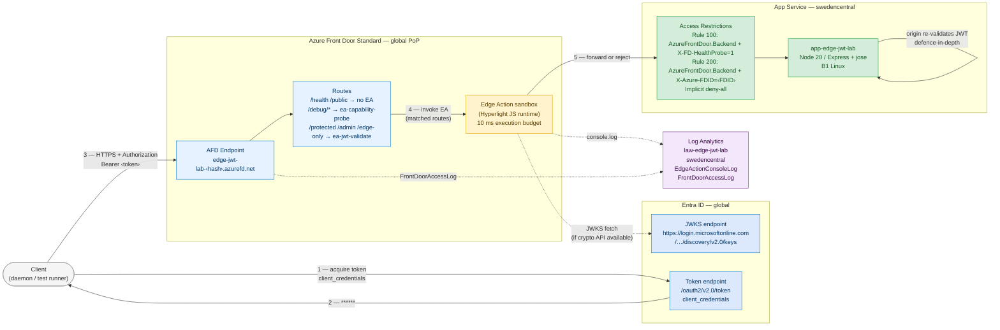
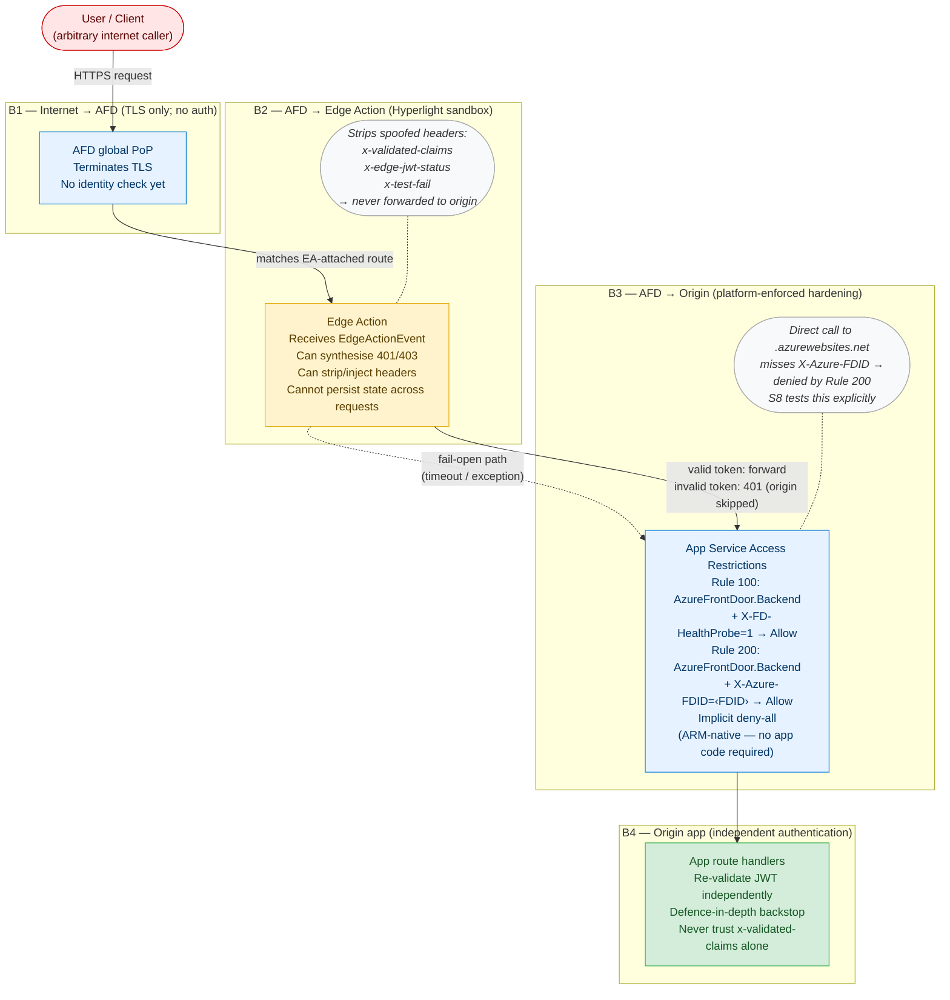
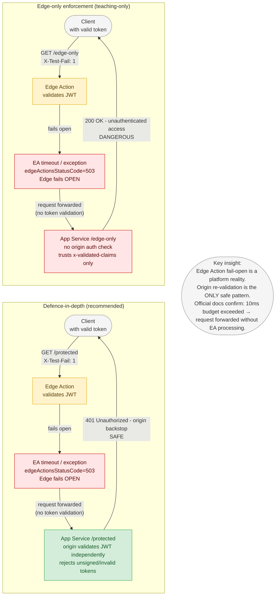
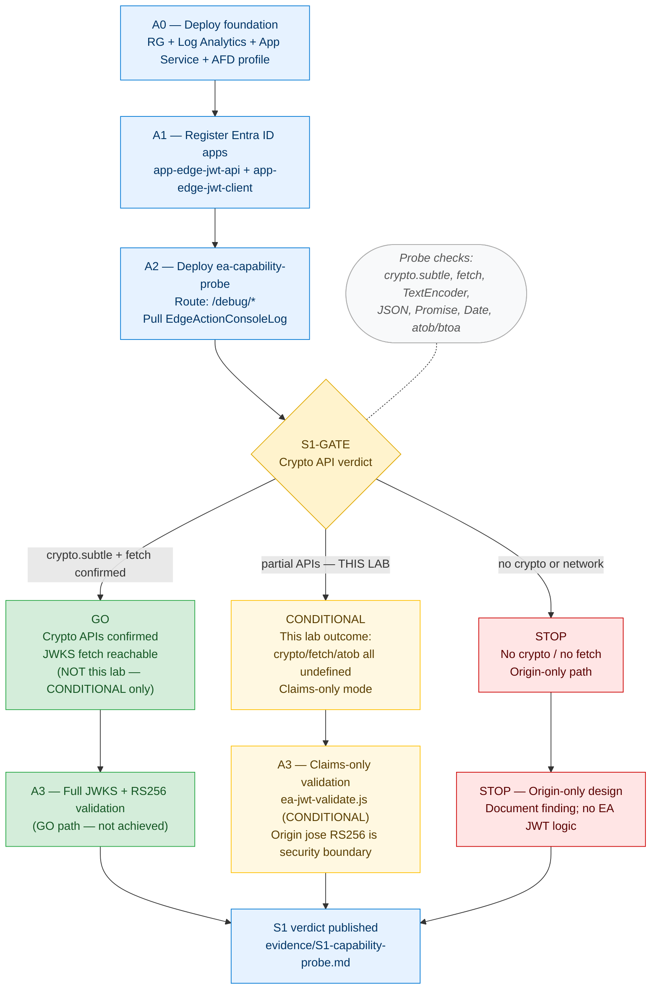
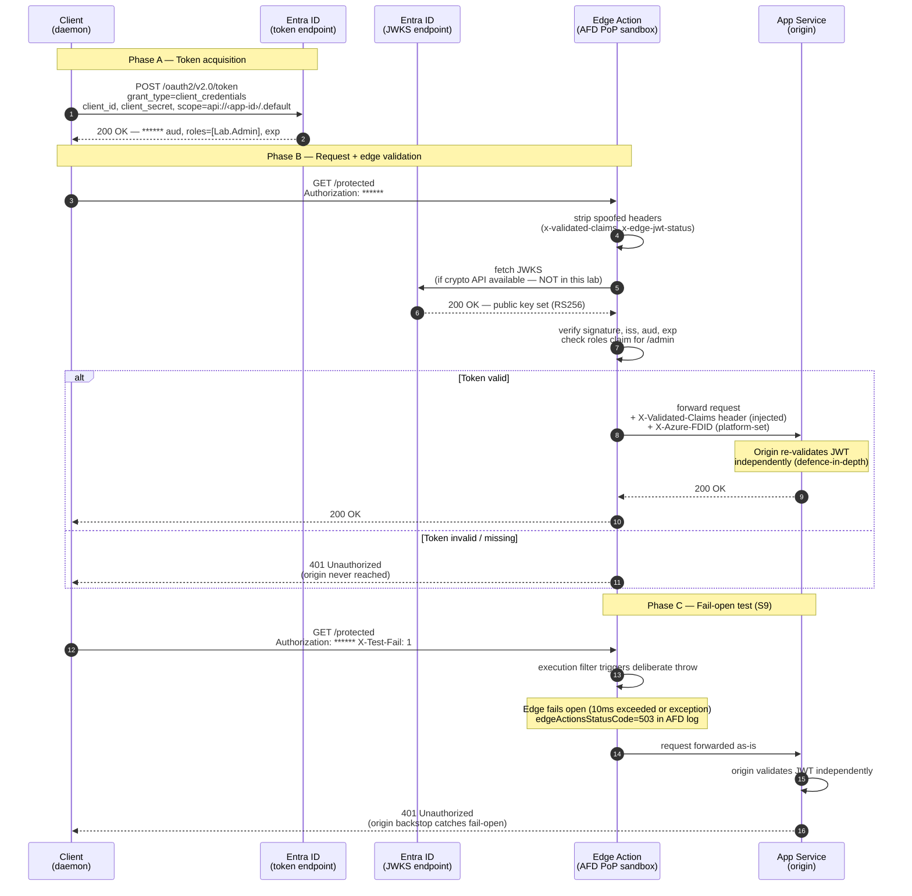

# Azure Front Door Edge Actions v1 — JWT Validation at the Edge

> **Blog:** [Azure Front Door Edge Actions v1 — JWT Validation at the Edge](https://blog.azinsider.net/) *(link updated after publish)*
>
> This lab is the evidence base for that post. Every claim in the blog is traceable to a file in this directory.

---

## Designs studied

> **New here? Read this orientation first.** This lab tests whether a **JWT** (JSON Web Token — the
> bearer token an app sends to prove who the caller is) can be validated at **Azure Front Door's**
> edge, *before* the request reaches the backend app. These terms are used throughout the document:
>
> | Term | What it means in this lab |
> |------|---------------------------|
> | **EA — Edge Action** | A small JavaScript function that runs *inside* Azure Front Door at the network edge (full explanation in [Part 1](#part-1--what-are-azure-front-door-edge-actions)). It can inspect/reject a request before it reaches your app. |
> | **Origin / backend** | The App Service web app *behind* Front Door that actually serves the API (`app-edge-jwt-lab.azurewebsites.net`). |
> | **`jose`** | An npm **library** (JavaScript Object Signing and Encryption) — **not a person**. The origin uses it to cryptographically verify JWT signatures (RS256 + JWKS). |
> | **Claims-only vs. signature validation** | *Claims-only* checks the token's contents (expiry, audience, issuer, roles) but **not** its cryptographic signature; *signature validation* additionally proves the token is authentic and untampered. |
> | **Teaching-only** | A design included **purely to demonstrate a risk** — explicitly never for production. |
> | **Defence in depth** | Validating in two independent layers (edge *and* origin) so a failure in one is caught by the other. |
> | **S1–S9 (the "S#" scenarios)** | The numbered test cases run by this lab (see the results table below and [validation.md](validation.md)). The ones referenced here: **S1** = capability probe, **S8** = direct-origin-bypass test, **S9** = fail-open test. |
> | **S1-GATE** | The go/no-go decision driven by scenario **S1**: does the edge runtime expose the crypto APIs needed to verify signatures? **GO** = full signature validation at the edge · **CONDITIONAL** = claims-only at the edge (what this lab landed on) · **STOP** = the edge can't validate at all → fall back to origin-only. See [Part 9](#part-9--capability-gate-s1-gate-decision-tree). |
> | **B1 / B3 (the "B#" blockers)** | External blockers hit during the lab: **B1** = Entra ID admin consent still pending; **B3** = Edge Actions private-preview access expired. |

The lab compared three ways to enforce JWT authentication with Front Door:

| Design | Verdict | When it applies |
|--------|---------|----------------|
| **Edge pre-validation + origin revalidation (defence in depth)** | ✅ **Recommended** | Always. The Edge Action performs claims-only (or, where possible, signature) validation, and the origin independently re-validates the signature with the `jose` library. |
| **Teaching-only: Edge Action as the *sole* enforcement** | 📖 Teaching only — never production | Included only to demonstrate the fail-open risk (scenario **S9**) and the direct-origin-bypass gap (scenario **S8**). |
| **Control: Origin-only, or an unauthenticated public route** | 🔬 Control / S1-GATE **STOP** fallback | Baseline (no auth) and the fallback used when the edge cannot validate JWTs at all. |

### Why the teaching-only design is dangerous

Two independent mechanisms break it even when the Edge Action is working correctly:

1. **Direct origin bypass (scenario S8 — PASS):** the origin `app-edge-jwt-lab.azurewebsites.net` is directly reachable *without* going through Front Door, so an attacker could skip the Edge Action entirely. The lab confirms the origin returns HTTP 403 to direct hits thanks to App Service access restrictions — **so the hardening works** — but without those restrictions the Edge Action would be trivially bypassed.

2. **Fail-open (scenario S9 — NOT EXECUTED, blocked by B3):** when an Edge Action exceeds its 10 ms execution budget or throws an exception, Front Door terminates the Edge Action and forwards the request **without validation**. An independent origin-only check is the only safe backstop.

---

## Quick results (2026-08-18, live)

| Scenario | Result | Verdict |
|----------|--------|---------|
| S1 — Capability probe | CONDITIONAL (`crypto`/`fetch`/`atob` = `undefined`) | ✅ |
| S2 — Missing token → 401 | PASS | ✅ |
| S3 — Malformed token → 401 | PASS | ✅ |
| S3 — Open routes (/health, /public) → 200 | PASS | ✅ |
| S4 — Expired token → 401 | PASS | ✅ |
| S5 — Wrong audience → 401 | PASS | ✅ |
| S5 — Wrong issuer → 401 | PASS | ✅ |
| S6 — Tampered sig (CONDITIONAL) → EA passes, origin 401 | PASS | ✅ |
| S7 — Missing role → 403 | PASS | ✅ |
| S8 — Direct origin bypass → 403 | PASS | ✅ |
| S7/S9 — Real Entra token | PENDING B1 (admin consent) | ⏸ |
| S9 — Fail-open | NOT EXECUTED (B3) | ⏸ |

---

## Part 1 — What are Azure Front Door Edge Actions?

### 1.1 The short answer

Edge Actions are **small JavaScript functions** that run inside Azure Front Door's points of presence (PoPs), in a secure sandboxed runtime called **Hyperlight**, before (or after) a request reaches your origin. They let you inspect and modify requests and responses — or synthesise a response entirely — without writing origin code.

They are conceptually similar to Cloudflare Workers or Lambda@Edge but with a much narrower API surface and a strict 10 ms execution budget (as of the lab date).

> **Preview status (2026-08-17):** Azure Front Door Edge Actions are in **public preview** (Standard and Premium SKU). The `edge-actions` REST API uses the `2025-09-01-preview` API version. Private preview feature flags (`EdgeActionsPrivatePreview`) may also be required for some subscriptions; this lab's subscription discovered that private preview access had expired (blocker B3).

### 1.2 Where Edge Actions run in the AFD request pipeline

```
Internet client
  │  HTTPS request arrives at AFD PoP
  ▼
TLS termination (AFD terminates TLS; the client certificate, if any, is inspected here)
  │
  ▼
Rules Engine evaluation (route matching, redirect rules, WAF if Premium)
  │  If route has an EA attached:
  ▼
Edge Action sandbox (Hyperlight, Node.js-like JS runtime)
  │  EA can:
  │    • Read/modify request headers, URI, method
  │    • Synthesise a 200/401/403 response (no other status codes)
  │    • Write console.log() → EdgeActionConsoleLog in Log Analytics
  │  EA budget: 10 ms per invocation
  │
  ▼ (if EA returns 200 or does not reject)
AFD adds platform headers (X-Azure-FDID, X-Forwarded-*, X-Azure-Ref)
  │
  ▼
Origin (App Service, VM, Storage, etc.)
  │  Origin access restrictions enforce:
  │    • AzureFrontDoor.Backend service tag (IP range)
  │    • X-Azure-FDID header value match
  │
  ▼
Response flows back through AFD → client
  │  AFD logs: FrontDoorAccessLog (with edgeActionsStatusCode_s, edgeActionsAgentType_s)
```

**Key positioning facts:**
- EA runs **after** TLS termination and **after** route matching, but **before** the request is forwarded to the origin.
- EA runs **in the PoP closest to the client**, not in the origin region.
- EA has **no persistent state** between requests — each invocation is isolated.
- EA is **not WAF.** WAF (available on Premium SKU) runs as a separate policy and is evaluated before EA in the pipeline.

### 1.3 Relationship to WAF, Rules Engine, Routes, and Origins

| Component | What it does | When it runs |
|-----------|-------------|--------------|
| WAF (Premium only) | Blocks OWASP top-10 attacks, DDoS, custom rules | Before EA |
| Rules Engine | Redirects, rewrites, header manipulation, A/B routing | Determines which EA (if any) to invoke |
| Edge Action | Custom JS code — your logic | After route match, before origin forward |
| Origin | Your backend (App Service, AKS, VM, Storage, etc.) | After EA passes the request |

An EA is **attached to a route** via a Rules Engine rule set. The same AFD profile can have multiple rule sets, each targeting different routes. A route can have at most one EA attached at a time (one active version per EA resource).

### 1.4 Terminology

| Term | Meaning |
|------|---------|
| **Edge Action resource** | `Microsoft.Cdn/EdgeActions` — a named, resource-group-scoped resource that holds code versions |
| **Version** | A specific code upload. Each EA resource can have up to **3 versions**. One version is the default. |
| **Default version** | The version that AFD activates when the EA is attached to a route. |
| **Attachment** | Associating an EA resource (via its default version) to an AFD route through a Rules Engine rule. |
| **Execution filter** | A non-default version designed to trigger deliberately (e.g., via a request header) for testing fail-open behaviour. |
| **`validationStatus`** | Server-side state that must reach `Succeeded` before a version can be attached. As of 2026-08-17, validation is **not triggered by REST API calls** — only by the Azure Portal or VS Code extension. |
| **`deployVersionCode`** | REST action `POST .../versions/{v}/deployVersionCode` — uploads code as a base64-encoded zip and triggers validation. Takes ~17 minutes before `addAttachment` accepts the version. |
| **`swapDefault`** | REST action to change which version is the default. Currently broken — always returns 400 regardless of version state. |
| **`edgeActionsStatusCode`** | Field in `FrontDoorAccessLog`: `200` = EA ran without timeout/exception; `503` = EA timed out or threw. |
| **`edgeActionsAgentType`** | Field in `FrontDoorAccessLog`: `node` = EA active on this route; `unknown` = no EA on this route. |

---

## Part 2 — Edge Action capabilities and limits

### 2.1 What the sandbox can do (documented + lab-confirmed)

| Capability | Source | Lab status |
|-----------|--------|-----------|
| Read `event.request.headers` (all keys lowercase) | EdgeActionsSamples API | ✅ Confirmed |
| Write/delete `event.request.headers` | EdgeActionsSamples API | ✅ Confirmed |
| Read `event.request.uri` and `event.request.method` | EdgeActionsSamples API | ✅ Confirmed |
| Set `event.response.response_code` to 200, 401, or 403 | EdgeActionsSamples + official docs | ✅ Confirmed |
| `console.log()` → `EdgeActionConsoleLog` in LAW | Official docs | ✅ Confirmed |
| `JSON` parse/stringify | S1 probe | ✅ `typeof JSON = object` |
| `Date.now()` | S1 probe | ✅ `typeof Date = function` |
| `Promise` | S1 probe | ✅ `typeof Promise = function` |
| `Uint8Array` | S1 probe | ✅ `typeof Uint8Array = function` |
| Read `event.context` (AFD server variables: `now`, `country`, `deviceType`, etc.) | Official docs + S1 probe | ✅ Confirmed |

### 2.2 What the sandbox CANNOT do (lab-confirmed gaps)

| Capability | `typeof` result | Impact |
|-----------|----------------|--------|
| `crypto` / `crypto.subtle` | `undefined` | ❌ No RS256/JWKS signature verification |
| `fetch` | `undefined` | ❌ No outbound HTTP calls (no JWKS fetch) |
| `atob` / `btoa` | `undefined` | ❌ No browser base64 API (use pure-JS decode) |
| `TextEncoder` | `undefined` | ❌ No string-to-bytes conversion |
| Persistent state across requests | N/A | ❌ Each Hyperlight sandbox is fresh |
| Arbitrary response status codes | N/A | ❌ Only 200, 401, 403 |

> **⚠️ No JWT sample exists in [Azure/EdgeActionsSamples](https://github.com/Azure/EdgeActionsSamples) as of 2026-08-17.** The official samples cover A/B testing, header manipulation, URL rewrites, and redirects. The capability probe (S1) is the only authoritative source of truth for crypto API availability. Every API used in `ea-jwt-validate.js` was probed before use.

### 2.3 Hard limits (documented)

| Limit | Value | Source |
|-------|-------|--------|
| Maximum code size | **16 KB** per version | Official docs §Limits |
| Maximum versions per EA resource | **3** | Official docs §Limits |
| Execution time budget | **10 ms** | Official docs §Limits |
| Language | **JavaScript only** | Official docs |
| Response codes | **200, 401, 403** only | EdgeActionsSamples README |
| Persistent JWKS cache | **None** — fresh sandbox per request | Lab finding |

### 2.4 Documented fail-open behaviour

> **Official docs quote:** "If the code execution exceeds the time limit of 10 ms, the service terminates the code execution and **sends the request without Edge Action processing**."

> "If the Edge Action throws an exception, the service sends the request without Edge Action processing."

When either condition occurs:
- `edgeActionsStatusCode_s = 503` appears in `FrontDoorAccessLog`
- The request is forwarded to the origin as-is (no EA header modifications applied)
- **No authentication is performed at the edge**

This is the central reason origin re-validation is mandatory in all production deployments.

### 2.5 Synchronous handler and EdgeActionEvent contract

Edge Action code must export a synchronous function named `handler` that takes an `event` object and returns it:

```javascript
function handler(event) {
  // event.request.headers  — {[key: string]: string}, all keys lowercase
  // event.request.uri      — string, e.g. "/protected"
  // event.request.method   — string, e.g. "GET"
  // event.response.response_code — set to 200 (pass), 401 (reject), or 403 (forbidden)
  // event.context          — {[key: string]: string} AFD server variables
  event.response.response_code = 200;
  return event; // MUST return the event object
}
```

Key behaviours:
- **All header keys are lowercase.** Use `event.request.headers['authorization']`, not `'Authorization'`.
- **Header modifications are forwarded** to the origin if the EA returns 200.
- **Unreturned event = undefined behaviour** — always return event.
- **Async/await** — `Promise` is available; whether the platform actually awaits returned promises is undocumented. The lab uses synchronous-only code to avoid this ambiguity.

---

## Part 3 — Why JWT parsing ≠ JWT validation

This distinction is the central security lesson of this lab.

### 3.1 What parsing does

A JWT has three base64url-encoded parts separated by dots: `header.payload.signature`.

Parsing means:
1. Split on `.`
2. base64url-decode the payload (middle part)
3. JSON-parse the decoded bytes
4. Read claims: `iss`, `aud`, `exp`, `nbf`, `roles`, etc.

This tells you **what the token claims**, not **whether those claims are trustworthy.**

### 3.2 What cryptographic validation does

Signature verification means:
1. Fetch the issuer's public key set (JWKS endpoint: `https://login.microsoftonline.com/<tenant>/discovery/v2.0/keys`)
2. Find the key whose `kid` matches the token header's `kid`
3. Verify that `RSASSA-PKCS1-v1_5-SHA256(header_b64 + "." + payload_b64)` equals the decoded signature
4. Only if this succeeds: trust the claims

**An attacker who can construct a JWT-shaped string** (three base64url parts, valid JSON in the middle) with any claims they want **defeats claim-only parsing** because no step 3 occurs. The token looks valid to the parser but was not issued by the real identity provider.

### 3.3 The Edge Action in this lab: CONDITIONAL mode

Because `crypto.subtle` and `fetch` are both `undefined` in the Hyperlight sandbox (S1 verdict), `ea-jwt-validate.js` operates in **CONDITIONAL mode** — claims-only:

```
Claim checks performed by EA:         Cryptographic check NOT performed:
  ✅ token structural validity         ❌ RS256 signature verification
  ✅ exp (expiry) against Date.now()   ❌ JWKS fetch from Entra ID
  ✅ nbf (not-before)                  ❌ key matching by kid
  ✅ aud == "api://<APP_ID>"
  ✅ iss contains <TENANT_ID>
  ✅ roles[] contains Lab.Admin (for /admin)
```

A structurally correct, claims-valid JWT with a **fake signature** passes the EA. The origin catches it.

### 3.4 The origin in this lab: full RS256 validation

`app/server.js` uses the [`jose` library](https://github.com/panva/jose):

```javascript
const { createRemoteJWKSet, jwtVerify } = require('jose');
const JWKS = createRemoteJWKSet(new URL(JWKS_URL));

const { payload } = await jwtVerify(token, JWKS, {
  issuer:   EXPECTED_ISS,
  audience: EXPECTED_AUD,
  algorithms: ['RS256', 'ES256'],
});
```

`jose` automatically:
- Fetches the JWKS endpoint and caches keys
- Rotates keys when Entra ID rolls them (~every 6 weeks)
- Verifies the RS256 signature
- Validates `iss`, `aud`, `exp`, `nbf`

The origin is the **only cryptographic security boundary in this lab.**

---

## Part 4 — Entra ID two-app model

### 4.1 Why two registrations?

A common mistake is using a single app registration for both the API (resource) and the client (caller). The correct model uses two:

| Role | App registration | Purpose |
|------|-----------------|---------|
| **Resource / API** | `app-edge-jwt-api` | Defines what the API exposes (audience = `api://<app-id>`, app roles) |
| **Client / daemon** | `app-edge-jwt-client` | Calls the API using its own identity (client credentials, no user) |

### 4.2 Token shape

The client-credentials flow produces a token with:

```json
{
  "iss": "https://login.microsoftonline.com/<tenant-id>/v2.0",
  "aud": "api://<api-app-id>",
  "roles": ["Lab.Admin"],
  "exp": <unix timestamp>,
  "nbf": <unix timestamp>
}
```

The `roles` claim is populated because `app-edge-jwt-client` has been assigned the `Lab.Admin` **application permission** on `app-edge-jwt-api`, and an admin has granted consent.

### 4.3 Token acquisition

```bash
curl -sX POST \
  "https://login.microsoftonline.com/${TENANT_ID}/oauth2/v2.0/token" \
  -d "grant_type=client_credentials" \
  -d "client_id=${CLIENT_ID}" \
  -d "client_secret=${CLIENT_SECRET}" \
  -d "scope=api://${API_APP_ID}/.default"
```

The `.default` scope delivers all admin-consented application permissions — `Lab.Admin` in this case.

### 4.4 Admin consent requirement

Application permissions (not delegated) require an Entra admin to explicitly grant consent. Until consent is granted, `token_acquisition fails with `Authorization_RequestDenied`. This is blocker B1 in this lab.

To unblock: `az ad app permission admin-consent --id 6f86ab2c-1823-4db6-8e54-6338b8472b6a`
(or: Azure portal → `app-edge-jwt-client` → API permissions → Grant admin consent for tenant)

### 4.5 JWKS endpoint

`https://login.microsoftonline.com/<tenant-id>/discovery/v2.0/keys`

This endpoint returns all current signing keys for the tenant. Entra ID rotates keys approximately every 6 weeks. The `jose` library fetches and caches automatically — never pin a specific key ID.

---

## Part 5 — Origin hardening: two-rule pattern

### 5.1 Why two rules (not one)

AFD health probes and normal AFD traffic behave differently:

| Request type | Has `AzureFrontDoor.Backend` IP? | Has `X-Azure-FDID`? | Has `X-FD-HealthProbe: 1`? |
|-------------|----------------------------------|---------------------|---------------------------|
| AFD health probe | ✅ Yes | ❌ **No** | ✅ Yes |
| Normal AFD request | ✅ Yes | ✅ Yes | ❌ No |
| Direct caller | ❌ No | ❌ No | ❌ No |

If you use a single rule requiring both `AzureFrontDoor.Backend` AND `X-Azure-FDID`, AFD health probes are blocked → AFD marks the origin unhealthy → AFD stops routing traffic. This is design correction C2 (Trinity, 2026-08-17).

### 5.2 The correct pattern

```
Priority 100 — afd-healthprobe
  Condition: source IP in AzureFrontDoor.Backend
         AND header x-fd-healthprobe = 1
  Action: Allow

Priority 200 — afd-fdid
  Condition: source IP in AzureFrontDoor.Backend
         AND header x-azure-fdid = <FDID>
  Action: Allow

(implicit deny-all)
```

**This is ARM-native.** No application code required. The App Service front-end enforces these rules before the request reaches your Node.js/Python process.

### 5.3 Deploy CLI (ARM REST — az CLI blocks duplicate ServiceTag)

```bash
# Retrieve FDID
FDID=$(az afd profile show -g rg-afd-edge-jwt-lab \
       --profile-name afd-edge-jwt-lab --query frontDoorId -o tsv)

# Rule 100: health probe path
az webapp config access-restriction add -g rg-afd-edge-jwt-lab \
  -n app-edge-jwt-lab --rule-name afd-healthprobe --action Allow \
  --priority 100 --service-tag AzureFrontDoor.Backend \
  --http-header x-fd-healthprobe=1

# Rule 200: FDID path (ARM REST required — CLI blocks second ServiceTag rule)
az rest --method PATCH \
  --uri "https://management.azure.com/subscriptions/.../resourceGroups/rg-afd-edge-jwt-lab/providers/Microsoft.Web/sites/app-edge-jwt-lab/config/web?api-version=2023-12-01" \
  --body '{"properties":{"ipSecurityRestrictions":[...]}}'
```

Lab finding (D8): `az webapp config access-restriction add` blocks a second rule with the same `ServiceTag`, even with different HTTP header conditions. ARM REST PATCH is required to add both rules.

---

## Part 6 — Topology



---

## Part 7 — Trust boundaries



---

## Part 8 — Fail-open comparison



---

## Part 9 — Capability gate (S1-GATE decision tree)



---

## Part 10 — Token request flow (sequence)



---

## Part 11 — Resource deployment walkthrough

### 11.1 Prerequisites

- `az` CLI ≥ 2.60, authenticated (`az login`)
- PowerShell ≥ 7.2
- `Application Administrator` role in Entra tenant (for A1)
- `Contributor` on the subscription

### 11.2 A0 — Foundation resources

```
Resource Group:  rg-afd-edge-jwt-lab (swedencentral)
Log Analytics:   law-edge-jwt-lab (swedencentral, 30-day retention)
App Service:     app-edge-jwt-lab (B1 Linux, Node 20, swedencentral)
AFD Profile:     afd-edge-jwt-lab (Standard_AzureFrontDoor, global)
AFD Endpoint:    edge-jwt-lab-hgbdgdh9ccaja2hv.b02.azurefd.net
AFD Origin:      app-edge-jwt-lab.azurewebsites.net (HTTPS, port 443)
AFD Route:       rt-api — /*
Diagnostics:     AFD FrontDoorAccessLog → law-edge-jwt-lab
```

Deployed via `deploy/main.bicep` + `deploy/Deploy-Lab.ps1`.

### 11.3 A1 — Entra ID registrations

Two registrations created:

**`app-edge-jwt-api`** (API / resource app)
- Application ID URI: `api://<app-id>`
- App role: `Lab.Admin` (Application type, value `Lab.Admin`)
- Access token version: 2

**`app-edge-jwt-client`** (daemon client)
- API permission: `app-edge-jwt-api / Lab.Admin` (Application permission)
- Admin consent: required before token acquisition — resolved in Session 5 via Graph `appRoleAssignments` API (see LL-015)
- Client secret: held in `$env:CLIENT_SECRET` only; never written to any file

### 11.4 A2 — Edge Actions deployment

Edge Actions are **not a CLI subcommand** (`az afd edge-action` does not exist). All operations use `az rest` against the preview API:

```
Resource type: Microsoft.Cdn/EdgeActions
Location:      global (NOT swedencentral — this is a global resource)
SKU:           Standard / Standard (NOT Standard_AzureFrontDoor)
Name:          alphanumeric only, max 50 chars (no hyphens)
```

Lab findings (deviations from initial design assumptions):

| Finding | Design assumed | Actual |
|---------|---------------|--------|
| D1 | `az afd edge-action` CLI | No such subcommand; use `az rest` |
| D2 | Subscription-level resource | RG-level resource |
| D3 | Location = swedencentral | Location must be `global` |
| D4 | SKU = Standard_AzureFrontDoor | SKU = `Standard/Standard` |
| D5 | Name = ea-capability-probe | Alphanumeric only → `eaprobe2`, `eajwtvalidate` |
| D7 | `validationStatus` triggered by REST | Only triggered by Portal/VS Code extension |
| D8 | `az webapp config access-restriction add` for both rules | CLI blocks duplicate ServiceTag; ARM REST PATCH required |
| D9 | AFD rule action = `InvokeEdgeAction` | Correct name = `EdgeAction`, typeName = `DeliveryRuleEdgeActionParameters` |
| D10 | `invocationPoint` optional | Required property; omitting causes BadRequest |

### 11.5 REST API: `deployVersionCode` + `addAttachment` lifecycle

The full EA deployment lifecycle via REST:

```
1. PUT  /edgeActions/{name}?api=2025-09-01-preview
   → Create EA resource (sku, location=global)

2. PUT  /edgeActions/{name}/versions/{v}?api=2025-09-01-preview
   Body: { properties: { code: base64(zip), deploymentType: "zip", isDefaultVersion: true } }
   → Upload code (does NOT trigger validation)

3. POST /edgeActions/{name}/versions/{v}/deployVersionCode?api=2025-09-01-preview
   Body: { name: "v1", content: base64(zip) }
   → Triggers async validation (LRO)
   → Poll GET versions/{v} for validationStatus
   → validationStatus appears Succeeded quickly (~15s) but addAttachment requires ~17 min

4. ⚠️ swapDefault — BROKEN as of 2026-08-17
   POST .../swapDefault always returns 400 regardless of version state.
   Workaround: set isDefaultVersion=true on desired version at upload time.

5. PUT  AFD rule with EdgeAction action
   → Triggers addAttachment automatically (attaches default version to route)
   → If validationStatus not yet Succeeded: 400 "default version not in successful state"
   → Wait ~17 min after deployVersionCode before attempting rule PUT

⚠️ addAttachment called directly creates dangling null attachments.
   Always use AFD rule PUT to trigger attachment.
```

### 11.6 Active resources (2026-08-18, corrected 17:12 UTC+2)

> **EA replacement note:** `eajwtvalidate3` replaced `eajwtvalidate` in Session 5 due to broken `swapDefault` API. EA diagnostic settings **do not transfer** when a resource is replaced — `diag-eajwtvalidate` remained attached to the orphaned old EA only. A new diagnostic setting on `eajwtvalidate3` was manually applied at 2026-08-18T17:12:36 UTC+2. `EdgeActionConsoleLog` entries from `eajwtvalidate3` are pending ingestion; log evidence in `show-output/001-EdgeActionConsoleLog-30min.txt` originates from the prior `eajwtvalidate` sessions.

| Resource | Name | State |
|----------|------|-------|
| Edge Action (JWT, **active**) | `eajwtvalidate3` | provisioningState=Succeeded |
| EA version (JWT, **active**) | `eajwtvalidate3/v1` | isDefaultVersion=True, validationStatus=Succeeded |
| EA diagnostics (active EA) | manually applied 2026-08-18T17:12:36 | UserLog + ServiceLog → law-edge-jwt-lab (**pending ingestion**) |
| Edge Action (JWT, orphaned) | `eajwtvalidate` | orphaned — dangling attachment, portal/Support needed |
| EA diagnostics (orphaned) | `diag-eajwtvalidate` | On orphaned `eajwtvalidate` only |
| Rule set (JWT) | `rsedgejwt` | provisioningState=Succeeded |
| Rule (JWT) | `ruleprotected` | Succeeded; matchValues=["/protected", "/admin"]; references `eajwtvalidate3` |
| Edge Action (probe) | `eaprobe2` | Active (probe route `/debug/*`) |
| EA orphaned | `eacapabilityprobe` | dangling null attachment, circular delete |

---

## Part 12 — Code walkthrough

### 12.1 `edge-actions/ea-capability-probe.js`

Probes all JavaScript globals available in the Hyperlight sandbox using `typeof` (never throws on undefined). Logs `PROBE <name>=<typeof>` for each. Includes a timed JWKS fetch sub-probe (skipped if `fetch` unavailable). Routes: `/debug/*`.

**S1 verdict:** Based on this probe output captured in `EdgeActionConsoleLog`.

### 12.2 `edge-actions/ea-jwt-validate.js`

The JWT validation Edge Action, operating in CONDITIONAL mode:

```javascript
// Config (substituted at deploy time)
const CONFIG = {
  EXPECTED_AUD: 'api://%%API_APP_ID%%',
  EXPECTED_ISS_TENANT: '%%TENANT_ID%%',
  ADMIN_ROLE: 'Lab.Admin',
};

function handler(event) {
  // Step 1: Strip spoofed inbound headers
  delete event.request.headers['x-validated-claims'];
  delete event.request.headers['x-edge-jwt-status'];
  delete event.request.headers['x-test-fail'];

  // Step 2: Check Authorization header
  var authHeader = event.request.headers['authorization'] || '';
  if (authHeader.indexOf('Bearer ') !== 0)
    return reject(event, 401, 'MISSING_TOKEN');

  // Step 3: Parse JWT (pure-JS base64url — atob unavailable)
  var hdr = parseJwtPart(token, 0);      // null → MALFORMED_HEADER
  var payload = parseJwtPart(token, 1);   // null → MALFORMED_PAYLOAD

  // Step 4: Validate claims
  if (payload.exp < now)          reject(401, 'EXPIRED')
  if (payload.nbf > now + 60)     reject(401, 'NOT_YET_VALID')
  if (aud !== CONFIG.EXPECTED_AUD) reject(401, 'AUD_FAIL')
  if (!iss.includes(TENANT_ID))    reject(401, 'ISS_FAIL')

  // ⚠️ NO SIGNATURE VERIFICATION — crypto.subtle unavailable (S1 CONDITIONAL)

  // Step 5: Role check for /admin
  if (path starts with '/admin' && !roles.includes('Lab.Admin'))
    reject(403, 'ROLE_FAIL')

  // Step 6: Inject validated claims header and pass through
  event.request.headers['x-validated-claims'] = JSON.stringify({...});
  event.request.headers['x-edge-jwt-status'] = 'VALIDATED';
  event.response.response_code = 200;
  return event;
}
```

Routes: `/protected`, `/admin` (via `rsedgejwt/ruleprotected` rule set).

**Pure-JS base64url decode** (lines 30–40 in the file): replaces missing `atob` with a lookup-table decoder compatible with `Uint8Array` and `String.fromCharCode`. Confirmed working in the Hyperlight sandbox.

### 12.3 `app/server.js`

Express application with six routes:

| Route | Auth | Purpose |
|-------|------|---------|
| `GET /health` | None | AFD health probe — always 200 |
| `GET /public` | None | Baseline; no token needed |
| `GET /edge-only` | None | Teaching route — no origin auth, trusts EA header |
| `GET /protected` | `requireJwt` middleware | Defence-in-depth; origin validates JWT with `jose` |
| `GET /admin` | `requireJwt` + `requireAdminRole` | Same + Lab.Admin role required |
| `GET /debug/request` | None | Echo headers (FDID-restricted via access rules) |

The `requireJwt` middleware calls `jose.jwtVerify()` with the Entra JWKS URL. It catches `ERR_JWKS_MULTIPLE_MATCHING_KEYS` and all other `jose` errors, returning 401 with the error code in the response body (not the token itself).

**Never logs raw Authorization header.** The echo at `/debug/request` redacts the value: `<redacted length=N>`.

### 12.4 `deploy/Deploy-Lab.ps1`

Full A0→A1→A2 deployment script. Relevant EA deployment section:

```powershell
# 1. Create EA resource
az rest --method PUT --uri ".../edgeActions/eajwtvalidate?api-version=2025-09-01-preview" ...

# 2. Upload version code
az rest --method PUT --uri ".../versions/v1?api-version=2025-09-01-preview" `
  --body @{ properties = @{ code = $base64zip; deploymentType = "zip"; isDefaultVersion = $true } }

# 3. Trigger validation (deployVersionCode)
az rest --method POST --uri ".../versions/v1/deployVersionCode?api-version=2025-09-01-preview" ...

# 4. Wait ~17 min, poll validationStatus
# 5. Create AFD rule set + rule (triggers addAttachment automatically)
```

---

## Part 13 — Scenario procedures and results

### S1 — Capability Probe

**Procedure:** `GET https://edge-jwt-lab-hgbdgdh9ccaja2hv.b02.azurefd.net/debug/request`

Then query LAW:
```kql
EdgeActionConsoleLog
| where TimeGenerated >= ago(20m)
| project TimeGenerated, TrackingReference, LogMessage
| order by TimeGenerated desc
```

**Result:** CONDITIONAL. Full evidence: `evidence/S1-capability-probe.md`.

---

### S2 — Missing Token

**Procedure:** `GET /protected` with no Authorization header.

**Result:** HTTP 401, `EA_REJECT reason=MISSING_TOKEN`. Origin not reached.
**Evidence:** `evidence/S2-missing-token.md`, X-Azure-Ref: `20260818T102616Z-…037gr`.

---

### S3 — Valid Token / Open Routes

**Procedure:**
- `GET /health` → 200 (no EA)
- `GET /public` → 200 (no EA)
- `GET /protected` with valid Entra v2 Lab.Admin token → 200, `edge_jwt_status=VALIDATED` (Run 4)
- `GET /protected` with malformed token → 401 (MALFORMED_HEADER)

**Result:** Open routes PASS. Malformed token PASS. Valid token PASS (Run 4, 2026-08-18T13:39 UTC+2).

> **AUD format (Run 4):** Active EA `eajwtvalidate3/v1` expects bare GUID audience (Entra v2 `accessTokenAcceptedVersion=2`). See LL-014, LL-016.

**Evidence:** `evidence/S3-valid-routes.md`.

---

### S4 — Expired Token

**Procedure:** Construct JWT with `exp = now - 3600`. `GET /protected` with this token.

**Result:** HTTP 401, `EA_REJECT reason=EXPIRED exp=<timestamp>`.
**Evidence:** `evidence/S4-expired-token.md`, X-Azure-Ref: `20260818T102541Z-…1r55`.

---

### S5 — Wrong Audience / Wrong Issuer

**Procedure:**
- `GET /protected` with `aud = "api://wrong-audience-00000000"` → 401, AUD_FAIL
- `GET /protected` with `iss = "...wrong-tenant-id..."` → 401, ISS_FAIL
- **Note (Run 3 vs Run 4):** In Run 3, the EA expected `api://<app-id>` and bare-GUID tokens produced AUD_FAIL. After `accessTokenAcceptedVersion=2` was applied (Run 4), bare GUID is the **correct** aud; `api://` tokens would now fail. The exact-match check is verified to fire correctly in both configurations. See LL-014.

**Result:** All 401. **Evidence:** `evidence/S5-wrong-claims.md`.

---

### S6 — Tampered Signature (CONDITIONAL path)

**Procedure (Tank Run 3):** Construct JWT with correct `iss`, `aud`, `exp`, `roles` but cryptographically invalid signature. `GET /protected`.

**EA result:** `EA_MODE=CLAIMS_ONLY` + `EA_ACCEPT` (EA cannot verify signature — passes).
**Origin result:** HTTP 401, `ERR_JWKS_MULTIPLE_MATCHING_KEYS` (jose RS256 rejects fake sig).
**Verdict:** PASS — defence-in-depth enforced at origin.

**Critical security note:** On the `/edge-only` teaching route (no origin auth), a tampered token with correct claims would return HTTP 200. This is intentional and demonstrates why `/edge-only` must never be used in production.

**Evidence:** `evidence/S6-tampered-sig.md`.

---

### S7 — Role-Based Authorization

**Procedure:** Token with `roles = ["Lab.User"]` (no Lab.Admin). `GET /admin`.

**EA result:** `EA_REJECT code=403 reason=ROLE_FAIL required=Lab.Admin`.
**Same token on `/protected`:** EA passes (Lab.Admin not required there).

Real Entra token test (Run 4): `/protected` and `/admin` with Lab.Admin → **200** (edge_jwt_status=VALIDATED). Full E2E confirmed.
**Evidence:** `evidence/S7-rbac.md`.

---

### S8 — Direct Origin Bypass

**Procedure:** `GET https://app-edge-jwt-lab.azurewebsites.net/protected` (direct, no AFD).

**Result:** HTTP 403, "Ip Forbidden". App Service access restriction blocks direct callers.
**No critical finding NIOBE-CRIT-002.** Origin hardening is effective.

**Also tested:** `GET .../health` direct → also 403 (health probe rule requires x-fd-healthprobe header which direct callers cannot send).

**Evidence:** `evidence/S8-direct-bypass.md`.

---

### S9 — Lab.Admin on /admin (re-scoped); Fail-Open (teaching gap)

**Status:** PASS (re-scoped) — 2026-08-18T13:39 UTC+2.

**Re-scope:** Original S9 tested fail-open via `ea-execution-filter` (A4). A4 was not deployed because `EdgeActionsPrivatePreview = NotRegistered` (B3). S9 was re-scoped to the real Lab.Admin token on `/admin` — confirming the full happy-path E2E for the role-gated route.

**Result (Run 4):** `GET /admin` with real Entra v2 Lab.Admin token → HTTP 200, `edge_jwt_status=VALIDATED`, `{"route":"admin","roles":["Lab.Admin"]}`.

**Fail-open documented behaviour (not lab-confirmed):** If EA times out or throws, `edgeActionsStatusCode_s = 503`; request forwarded to origin. On `/edge-only` (no origin auth) this would return 200 — the dangerous case. On `/protected` the origin backstop fires (401). Soft form demonstrated by S3a: `/edge-only` already returns 200 with no token.

**Evidence:** `evidence/S9-fail-open.md`.

---

## Part 14 — Logging, KQL, and X-Azure-Ref correlation

### 14.1 Log tables

| Table | Content | Collection |
|-------|---------|-----------|
| `EdgeActionConsoleLog` | `console.log()` from EA code | EA resource → **per-EA** diagnostic settings → LAW |
| `AzureDiagnostics` (Category=FrontDoorAccessLog) | Every request processed by AFD | AFD profile → diagnostic settings → LAW |
| `AppServiceHTTPLogs` | HTTP access log from App Service | App Service → diagnostic settings → LAW |
| `EdgeActionServiceLog` | Platform-level EA service events | EA resource → **per-EA** diagnostic settings → LAW |

> **Note:** `EdgeActionConsoleLog` is a **top-level table**, not a Category in `AzureDiagnostics`. Query as `EdgeActionConsoleLog | ...`, not `AzureDiagnostics | where Category == "EdgeActionConsoleLog"`.

> **Critical:** EA diagnostic settings (`UserLog`, `ServiceLog`) are **per-EA-resource** and **do not transfer** when an EA resource is replaced. If you create a new EA (e.g., due to broken `swapDefault`), you must re-apply diagnostic settings to the new resource before any log evidence can be collected. The AFD profile `FrontDoorAccessLog` diagnostic setting is **separate** from EA resource settings and persists independently. Both must be present for full observability. See LL-020.

### 14.2 Key columns

**EdgeActionConsoleLog:**
```
TimeGenerated, TrackingReference, LogMessage, EdgeActionVersion
```
`TrackingReference` = the `X-Azure-Ref` value from the client-facing response header.

**FrontDoorAccessLog (AzureDiagnostics):**
```
TimeGenerated, trackingReference_s, requestUri_s,
httpStatusCode_d, edgeActionsStatusCode_s, edgeActionsAgentType_s
```
- `edgeActionsStatusCode_s = "200"` → EA ran without timeout/exception
- `edgeActionsStatusCode_s = "503"` → EA timed out or threw (fail-open)
- `edgeActionsAgentType_s = "node"` → route has an active EA; `"unknown"` → no EA
- `httpStatusCode_d = None` when EA rejects before origin (lab finding LF-003 — origin HTTP status is not separately logged when EA handles the response)

### 14.3 KQL templates

**All EA log messages (last 20 min):**
```kql
EdgeActionConsoleLog
| where TimeGenerated >= ago(20m)
| project TimeGenerated, TrackingReference, LogMessage, EdgeActionVersion
| order by TimeGenerated desc
```

**Correlate a specific request across EA log and access log:**
```kql
let ref = "20260818T102616Z-167b84b5744znbmthC1MRS8qqw0000000vp00000000037gr";
union EdgeActionConsoleLog, AzureDiagnostics
| where TrackingReference == ref or trackingReference_s == ref
| project TimeGenerated, Type, LogMessage, requestUri_s, httpStatusCode_d, edgeActionsStatusCode_s
| order by TimeGenerated asc
```

**S9 fail-open detection:**
```kql
AzureDiagnostics
| where edgeActionsStatusCode_s == "503"
| project TimeGenerated, trackingReference_s, requestUri_s, httpStatusCode_d
| order by TimeGenerated desc
```

**App Service logs (confirm origin reach or absence):**
```kql
AppServiceHTTPLogs
| where TimeGenerated >= ago(20m)
| project TimeGenerated, CsUriStem, ScStatus, CsHeaders
| order by TimeGenerated desc
```

### 14.4 Log ingestion delay

- `EdgeActionConsoleLog`: 3–10 minutes after request
- `FrontDoorAccessLog`: 3–10 minutes
- `AppServiceHTTPLogs`: 1–5 minutes

Always wait at least 10 minutes before querying. Use `| where TimeGenerated >= ago(20m)` with a wide window.

### 14.5 X-Azure-Ref in practice

Every AFD response carries `X-Azure-Ref` in the response headers. Capture it from your curl output:

```bash
curl -v https://edge-jwt-lab-hgbdgdh9ccaja2hv.b02.azurefd.net/protected 2>&1 | grep -i "x-azure-ref"
```

This value is the primary join key between the EA console log and the AFD access log. It uniquely identifies a single request across all log tables.

---

## Part 15 — Troubleshooting matrix

| Symptom | Likely cause | Resolution |
|---------|-------------|------------|
| App Service returns 403 on `/health` via AFD | Access restriction rule 100 wrong or missing | Verify `x-fd-healthprobe=1` condition on rule 100; health probes do NOT carry `X-Azure-FDID` |
| `EdgeActionConsoleLog` empty after 15 min | EA not attached to route | Check rule set is attached to rt-api; verify `edgeActionsAgentType_s = node` in access log |
| `edgeActionsStatusCode_s = 503` | EA timed out or threw | Check `EdgeActionConsoleLog` for errors; EA budget is 10 ms |
| EA attachment fails: "default version not in successful state" | `deployVersionCode` not waited long enough (~17 min) | Wait; poll `validationStatus` field on version; use portal if REST API does not trigger validation |
| `swapDefault` returns 400 | Known bug (2026-08-17) | Set `isDefaultVersion=true` during version upload instead |
| Admin consent fails `Authorization_RequestDenied` | Caller not Application Administrator | Jose or tenant admin must run `az ad app permission admin-consent` |
| Token `AUD_FAIL got=<bare-GUID>` | Client requesting wrong scope | Scope must be `api://<api-app-id>/.default` (not bare GUID) |
| `ERR_JWKS_MULTIPLE_MATCHING_KEYS` from origin | Tampered or fake signature | Expected: origin `jose` library correctly rejects; this is CONDITIONAL path S6 expected outcome |
| EA returns 401 HTML (not JSON) | EA synthesises response body — AFD provides default HTML | EA code only sets `response_code`; custom body not yet documented; HTML is expected |
| `httpStatusCode_d = None` in FrontDoorAccessLog | EA handled the response (no origin call) | Confirmed lab finding; client HTTP status is synthesised by EA and not separately logged in FrontDoorAccessLog when EA intercepts |
| `EdgeActionsPrivatePreview = NotRegistered` | Private preview access expired | Re-register subscription for Edge Actions private preview |
| No `az afd edge-action` CLI subcommand | CLI does not have EA subcommand | Use `az rest` with `2025-09-01-preview` API version |

---

## Part 16 — Security guidance

### 16.1 Rules for using Edge Actions for JWT validation

1. **Always re-validate at the origin.** Edge Actions can fail open. Never trust the Edge Action as the sole security enforcement. `app/server.js` always validates JWT independently with `jose`.

2. **Never trust `x-validated-claims` alone.** The EA injects this header as a convenience for the origin. An attacker who can bypass the EA (direct origin call, fail-open) can inject arbitrary header values. The origin must always verify the JWT directly.

3. **Strip spoofed headers on every request.** `ea-jwt-validate.js` deletes `x-validated-claims`, `x-edge-jwt-status`, and `x-test-fail` from the request before any other processing. A client sending these headers cannot impersonate EA validation.

4. **Claims-only mode is not authentication.** In CONDITIONAL mode (this lab), a structurally valid JWT with correct claims but a fake signature passes the EA. The origin's RS256 check is the only real barrier. Do not deploy claims-only EA validation in production without origin-side signature verification.

5. **Never put secrets in Edge Action code.** EA code is embedded in a public API endpoint. Any value in the `CONFIG` object is visible to anyone who can read the EA resource. Tenant IDs and app IDs (non-secret) are acceptable; client secrets are not.

6. **Never log raw Authorization header values.** `ea-jwt-validate.js` only logs reason codes and partial claim values. `app/server.js` logs `<redacted>` for Authorization headers.

7. **Test S9 before production.** The fail-open scenario must be verified. If your origin does not independently validate JWTs, S9 is an unauthenticated access vector.

### 16.2 CONDITIONAL path security model summary

```
Client presents token
  │
  ▼
Edge Action (CONDITIONAL — no signature verify)
  Claims checked: iss, aud, exp, nbf, roles
  Rejects: missing token, expired, wrong aud/iss, wrong role for /admin
  Passes: any structurally valid token with correct claims (including fake-signed)
  │
  ▼ (if claims valid)
App Service Access Restriction (ARM-native)
  Checks: source IP in AzureFrontDoor.Backend AND x-azure-fdid matches
  Blocks: all direct callers
  │
  ▼
Origin (jose library — full RS256/JWKS)
  Checks: signature, iss, aud, exp, nbf
  Rejects: fake signatures, wrong tenant, wrong audience
  This is the ONLY cryptographic security boundary
```

---

## Part 17 — Cleanup (NOT authorised)

> **Cleanup is separately gated. Do not execute without Jose's explicit approval.**

```powershell
# Preview only (no deletion)
.\deploy\Cleanup-Lab.ps1

# With Jose's explicit approval:
.\deploy\Cleanup-Lab.ps1 -Confirmed
```

Cleanup sequence:
1. Delete EA rule references from AFD route
2. Delete AFD rule set `rsedgejwt` and `rsedgeprobe`
3. Delete AFD profile (cascade-deletes endpoint, origin group, route)
4. Delete Edge Action resources `eajwtvalidate`, `eaprobe2`
5. Delete App Service + plan
6. Delete Log Analytics workspace
7. Delete Entra app registrations
8. Delete resource group

Estimated teardown time: 10–15 minutes.
Cost stops accruing within minutes of `az group delete`.

---

## Part 18 — References

### Official Microsoft documentation

| Reference | URL | Notes |
|-----------|-----|-------|
| Azure Front Door Edge Actions (Preview) | https://learn.microsoft.com/azure/frontdoor/edge-actions | Primary EA reference. Confirmed: 10ms limit, fail-open, EdgeActionConsoleLog, 200/401/403 only |
| AFD Edge Actions — Limits section | Same page, §Limits | 16 KB code, 3 versions, 10 ms |
| AFD Edge Actions — Fail-open | Same page, §Important considerations | "service terminates the code execution and sends the request without Edge Action processing" |
| AFD server variables | https://learn.microsoft.com/azure/frontdoor/rule-set-server-variables | `event.context` keys |
| AFD diagnostic logs | https://learn.microsoft.com/azure/frontdoor/front-door-diagnostics | FrontDoorAccessLog, EdgeActionConsoleLog schemas |
| Secure traffic to origins | https://learn.microsoft.com/azure/frontdoor/origin-security | IP filtering + FDID; App Service tab |
| App Service access restrictions | https://learn.microsoft.com/azure/app-service/app-service-ip-restrictions | Service tag + HTTP header filter |
| App Service restrict to specific AFD | https://learn.microsoft.com/azure/app-service/app-service-ip-restrictions#restrict-access-to-a-specific-azure-front-door-instance | Two-rule pattern |
| Entra ID client credentials | https://learn.microsoft.com/azure/active-directory/develop/v2-oauth2-client-creds-grant-flow | .default scope, app roles |
| AFD billing — Edge Actions | https://learn.microsoft.com/azure/frontdoor/billing#example-7-edge-actions | Pricing model |

### GitHub samples

| Resource | URL | Notes |
|----------|-----|-------|
| Azure/EdgeActionsSamples | https://github.com/Azure/EdgeActionsSamples | Community samples |
| EdgeActionEvent API reference | https://github.com/Azure/EdgeActionsSamples/tree/main/src/edgeactions-js | `request`, `response`, `context`, `origin_data`, `hook_point` |
| Sample JS files | https://github.com/Azure/EdgeActionsSamples/tree/main/src/edgeactions-js | A/B, header manipulation, origin selection, URL redirect/rewrite, request rejection |

> **⚠️ No JWT sample exists in Azure/EdgeActionsSamples as of 2026-08-17.** The Edge Actions page lists "JWT token validation" as a supported scenario, but no sample code has been published. `ea-capability-probe.js` and `ea-jwt-validate.js` in this repo are the first documented implementations.

### Lab files

| File | Purpose |
|------|---------|
| `lab-card.md` | Objective, hypothesis, activation units, cost |
| `manifest.md` | Resource inventory, scenarios, evidence plan |
| `design.md` | JWT validation design, trust boundaries, KQL templates, API learnings |
| `validation.md` | Assertion table, scenario verdicts, blocking dependencies |
| `lessons-learned.md` | Reusable findings for future labs |
| `deploy/main.bicep` | Bicep IaC for foundation resources |
| `deploy/Deploy-Lab.ps1` | Full deployment script |
| `deploy/Cleanup-Lab.ps1` | Cleanup script (preview-safe by default) |
| `deploy/deployment-output.json` | Non-secret deployment outputs |
| `edge-actions/ea-capability-probe.js` | S1 probe implementation |
| `edge-actions/ea-jwt-validate.js` | Claims-only JWT EA (CONDITIONAL path) |
| `app/server.js` | Origin application (Express + jose RS256) |
| `evidence/` | One .md file per scenario (S1–S9) |
| `show-output/` | Raw CLI/KQL output, one file per command |
| `tests/Invoke-Validation.ps1` | PowerShell validation harness |
| `tests/Confirm-Sanitization.ps1` | Pre-commit sanitization checker |

---

*Lab authors: Morpheus (design), Trinity (implementation), Tank (deployment), Niobe (validation), Oracle (diagrams)*
*Lab date: 2026-08-17/18 · Phase 4 · No cleanup authorised*
