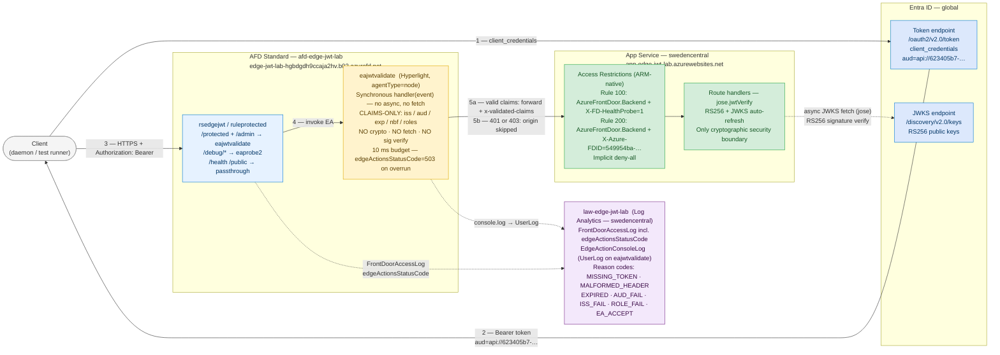
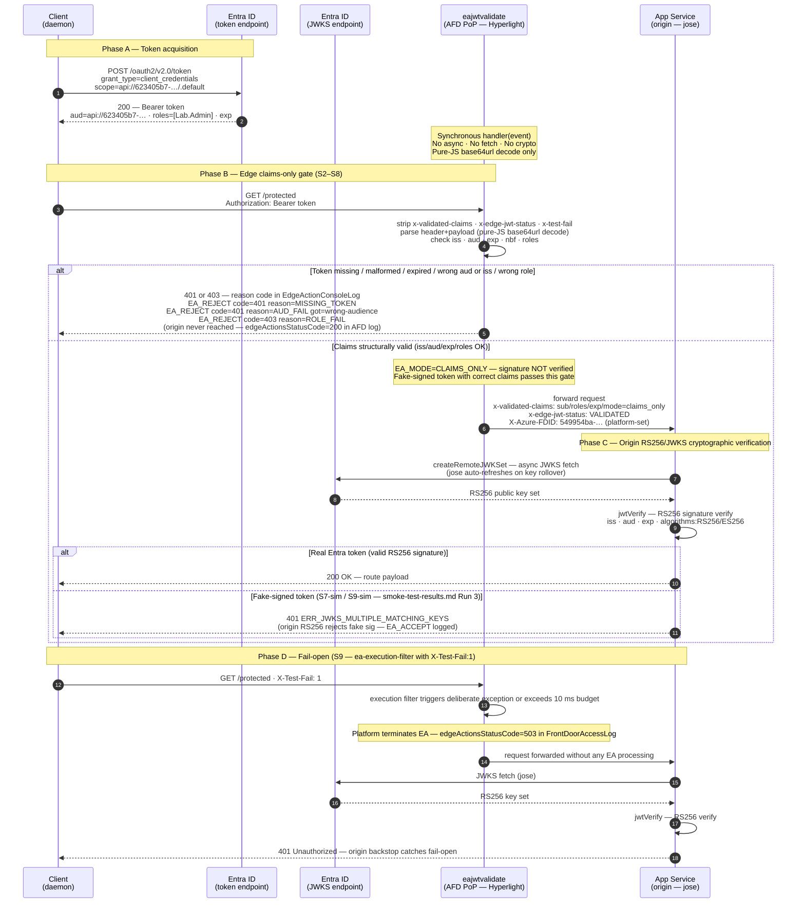
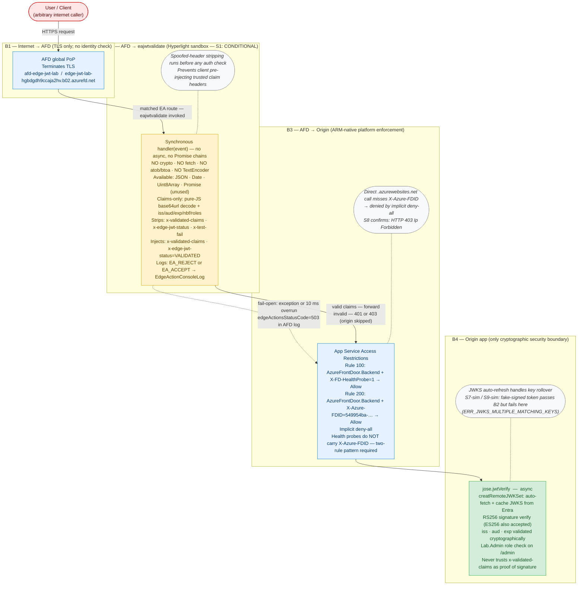
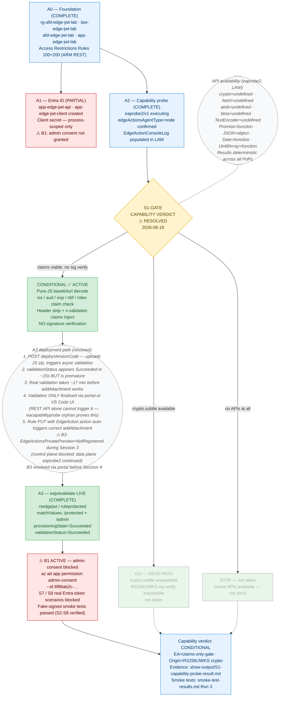

# Diagrams — afd-edge-actions-jwt-validation

> **Owner:** Oracle (Documentation & Diagrams)
> **Updated:** 2026-08-18 — live deployment values integrated; S1 verdict CONDITIONAL
> **Format:** Mermaid source (`.mmd`); GitHub renders natively in fenced ` ```mermaid ``` ` blocks.
> **Render status:** No local PNG renderer available without new tooling. All five diagrams
> validated by: diagram-type declaration present; subgraph opens/ends balanced; `alt…end` in
> sequenceDiagram correct. GitHub native rendering is the delivery mechanism.
> See [Niobe embed handoff](#niobe-embed-handoff) for exact inline blocks.

---

## Live Deployment Reference (2026-08-18)

| Role | Sanitised value |
|------|-----------------|
| AFD endpoint | `edge-jwt-lab-hgbdgdh9ccaja2hv.b02.azurefd.net` |
| AFD profile | `afd-edge-jwt-lab` |
| JWT Edge Action | `eajwtvalidate` (v1 live, rsedgejwt/ruleprotected) |
| Probe Edge Action | `eaprobe2` (rsedgeprobe/ruleprovedebug) |
| Origin | `app-edge-jwt-lab.azurewebsites.net` |
| Log Analytics | `law-edge-jwt-lab` |
| FDID (sanitised) | `549954ba-…` |
| Entra API app-id (sanitised) | `623405b7-…` |
| Entra client app-id (sanitised) | `6f86ab2c-…` |
| S1-GATE verdict | **CONDITIONAL** — `crypto/fetch/atob/btoa/TextEncoder = undefined` |
| B1 (active blocker) | Admin consent not granted → S7/S9 real-token scenarios blocked |

> Full FDID, tenant ID, subscription ID, and client secret are **never committed** per charter.

---

## Official References

| Resource | URL | Notes |
|----------|-----|-------|
| Azure Front Door Edge Actions (official docs) | https://learn.microsoft.com/azure/frontdoor/edge-actions | Preview as of 2026-08-18. Confirms: JWT validation listed as supported scenario; Hyperlight sandbox; 10 ms execution budget; `edgeActionsStatusCode` (200/503) in AFD logs; `EdgeActionConsoleLog` schema. |
| AFD Edge Actions — samples repo | https://github.com/Azure/EdgeActionsSamples | Community samples. **⚠ No JWT / JWKS / cryptographic validation sample exists as of 2026-08-18.** Samples cover A/B testing, header manipulation, redirects, URL rewrites. The capability probe (S1) is the only authoritative source for cryptographic API availability. |
| EdgeActionsSamples — JS API reference | https://github.com/Azure/EdgeActionsSamples/tree/main/src/edgeactions-js | JS runtime interface docs. Referenced in `ea-jwt-validate.js` header. |
| AFD diagnostic logs | https://learn.microsoft.com/azure/frontdoor/front-door-diagnostics | `FrontDoorAccessLog` (incl. `edgeActionsStatusCode`); `EdgeActionConsoleLog` schemas. |
| Entra ID client credentials flow | https://learn.microsoft.com/azure/active-directory/develop/v2-oauth2-client-creds-grant-flow | Two-app-registration model; `roles` claim; JWKS endpoint. |
| App Service access restrictions — HTTP header filter | https://learn.microsoft.com/azure/app-service/app-service-ip-restrictions#filter-by-http-header | ARM-native `X-Azure-FDID` + service tag. Design correction C1. |
| AFD origin hardening with X-Azure-FDID | https://learn.microsoft.com/azure/frontdoor/origin-security | Two-rule pattern (Rule 100 health probe, Rule 200 FDID). |

> **No JWT sample in EdgeActionsSamples:** The official Azure/EdgeActionsSamples repository
> contains samples for header manipulation, A/B testing, URL rewrite, and redirect scenarios.
> As of 2026-08-18 there is **no sample demonstrating JWKS fetch, RS256/ES256 signature
> verification, or JWT claim validation** inside an Edge Action. This absence is expected and
> is exactly the motivation for the S1 capability probe. The S1 result (CONDITIONAL — see
> `show-output/S1-capability-probe-result.md`) is the authoritative and only evidence source
> for sandbox API availability. The `ea-jwt-validate.js` implementation was written from first
> principles after the probe, with no official JWT sample reference.

---

## S1 Capability Verdict — Key Facts for Diagrams

| Fact | Detail |
|------|--------|
| Sandbox runtime | `agentType=node` (Hyperlight, Node-like) |
| `crypto` | `undefined` — NO Web Crypto API |
| `fetch` | `undefined` — NO HTTP calls from EA |
| `atob / btoa` | `undefined` — NO browser base64 |
| `TextEncoder` | `undefined` |
| `Promise` | `function` ✅ — async supported but no async I/O available |
| `JSON / Date / Uint8Array` | available ✅ |
| **EA security model** | **Claims-only (CONDITIONAL): pure-JS base64url decode + iss/aud/exp/nbf/roles check. NO signature verification.** |
| **Origin security model** | **RS256/JWKS via `jose.jwtVerify` + `createRemoteJWKSet` — only cryptographic boundary.** |
| `handler` function | Synchronous `function handler(event)` — no async/await, no Promise chains in practice |
| Fail-open trigger | Exception OR >10 ms budget → platform terminates EA, forwards request; `edgeActionsStatusCode=503` in AFD log |

---

## deployVersionCode and Portal/VS Code Attachment Caveat

> **Critical operational finding (deploy-log.md Session 2, S1-capability-probe-blocked.md):**
>
> 1. `POST .../versions/{v}/deployVersionCode` uploads the JS zip and triggers async backend validation.
> 2. `GET validationStatus` reports `Succeeded` after **~15 seconds** — this is **premature and unreliable**.
> 3. Real validation completes in **~17 minutes**. The `addAttachment` (via AFD rule PUT) fails with
>    `"Validation failed: The edge action's default version is not in a successful state"` until this window elapses.
> 4. Code validation is **only finalised via the Azure portal or VS Code extension UI** — REST API calls
>    alone cannot trigger it. The `eacapabilityprobe` orphan (dangling null attachment) was caused by
>    attempting REST-only attach before portal validation.
> 5. The correct deploy sequence is: `deployVersionCode` → wait ≥17 min (or portal confirmation) →
>    AFD rule PUT with `EdgeAction` action (auto-triggers `addAttachment` correctly).
>
> `eajwtvalidate/v1` was successfully deployed and validated via this sequence. `eaprobe2` continues
> as the active capability-probe EA.

---

## Diagram Inventory

| # | File | Type | Description | Evidence source | Status |
|---|------|------|-------------|----------------|--------|
| 01 | [`01-topology.mmd`](01-topology.mmd) | `flowchart LR` | Full resource topology with live names: Client → Entra → AFD PoP (eajwtvalidate) → App Service + LAW | deployment-output.json, design.md §1 | ✅ live values |
| 02 | [`02-token-request-flow.mmd`](02-token-request-flow.mmd) | `sequenceDiagram` | Token acquisition → synchronous claims-only edge gate → origin RS256/JWKS verify + S9 fail-open | smoke-test-results.md Run 3, S1-probe-result.md | ✅ live values |
| 03 | [`03-trust-boundaries.mmd`](03-trust-boundaries.mmd) | `flowchart TD` | Four trust boundaries B1–B4: synchronous EA sandbox limitations; ARM-native FDID hardening; origin as only crypto boundary | design.md §1.1, S1-probe-result.md, server.js | ✅ live values |
| 04 | [`04-fail-open-comparison.mmd`](04-fail-open-comparison.mmd) | `flowchart LR` | Side-by-side: edge-only (dangerous — /edge-only) vs defence-in-depth (safe — /protected) when EA hits 10 ms limit or throws | smoke-test-results.md S9, deploy-log.md | ✅ live values |
| 05 | [`05-capability-gate.mmd`](05-capability-gate.mmd) | `flowchart TD` | S1-GATE RESOLVED=CONDITIONAL decision tree; deployVersionCode/portal caveat; B1/B3 blocker history; eajwtvalidate live | deploy-log.md Sessions 2–4, deployment-output.json | ✅ live values |

---

## Diagram Captions and Notes

### 01 — Topology (live)

Shows all resource roles with live sanitised names. Key update from the pre-deployment placeholder:
- `eajwtvalidate` (not `ea-jwt-validate`) is the active JWT EA; `eaprobe2` is the capability probe.
- EA is labelled as **synchronous `handler(event)` — no async, no fetch, no crypto** — the JWKS fetch
  arrow has been moved to the **origin** (jose library, `createRemoteJWKSet`).
- FDID: `549954ba-…` (sanitised; not a secret but not committed in full per charter).
- `EdgeActionConsoleLog` is emitted via the **UserLog diagnostic category** on the EA resource (not
  on the AFD profile). This distinction matters for Log Analytics query scoping.
- The LAW node lists all confirmed reason codes from smoke-test-results.md Run 3.

### 02 — Token Request Flow (live, S1 CONDITIONAL)

Three phases showing the actual production security model:
- **Phase A:** Client credentials token acquisition (aud must be `api://623405b7-…`, not bare GUID).
- **Phase B:** Synchronous claims-only gate — no JWKS fetch step (sandbox limitation). EA rejects
  S2–S6 and S8 with observed reason codes from `EdgeActionConsoleLog`. For S7-sim/S9-sim with
  fake-signed tokens carrying correct claims, EA passes (EA_ACCEPT logged) and origin rejects with
  `ERR_JWKS_MULTIPLE_MATCHING_KEYS` — proving origin RS256/JWKS is the real gate.
- **Phase D (S9 fail-open):** `X-Test-Fail: 1` + execution filter → EA terminates → `edgeActionsStatusCode=503`
  in AFD log → request forwarded without any claim check → origin RS256/JWKS still rejects.

### 03 — Trust Boundaries (live, S1 CONDITIONAL)

Updated from the placeholder to reflect actual sandbox capabilities:
- **B2 node:** explicit list of unavailable APIs (`crypto / fetch / atob / btoa / TextEncoder`) and
  available APIs (`JSON / Date / Uint8Array`). The handler is synchronous — no async/await or Promise
  chains in practice. Header stripping runs before any auth logic.
- **B4 node:** `jose.jwtVerify` + `createRemoteJWKSet` — async JWKS fetch with auto-refresh on key
  rollover. S7-sim/S9-sim evidence confirms B4 rejects fake-signed tokens even when B2 passed them.
- Annotation confirms S8 evidence: direct `.azurewebsites.net` returns 403 (`Ip Forbidden`).

### 04 — Fail-Open Comparison (live, CONDITIONAL mode)

Updated to reflect CONDITIONAL mode reality: EA fail-open in CONDITIONAL mode means **ALL claim
checking is bypassed** (not just signature verification). The handler never runs. This is more
dangerous than the original placeholder implied (which assumed the EA could at least check claims
even if sig verify was unavailable). `edgeActionsStatusCode=503` is now explicitly labelled.
Evidence: smoke-test-results.md Run 3 S9-sim.

### 05 — Capability Gate (live — S1-GATE RESOLVED)

Major rewrite from the pre-deployment decision-tree version:
- S1-GATE is now **resolved = CONDITIONAL** (2026-08-18).
- GO path and STOP path are shown as **dead / greyed** (not taken).
- The CONDITIONAL active path shows: A3 deployed (`eajwtvalidate` live), with the `deployVersionCode`
  + ~17 min validation + portal/VS Code attachment sequence as an annotation node.
- B3 (`EdgeActionsPrivatePreview=NotRegistered`) is documented as a temporary blocker encountered
  in Session 3 and resolved before Session 4.
- B1 (admin consent) is shown as **still active** — blocks real Entra token scenarios S7/S9.
- The verdict node references the authoritative evidence files.

---

## Visual Conventions

| Element | Meaning |
|---------|---------|
| `-->` solid arrow | Primary request / data flow |
| `-.->` dashed arrow | Control-plane, async, or fail-open path |
| `~~~` invisible edge | Layout separator between subgraphs (no semantic meaning) |
| `-.-` dotted, no arrow | Annotation / note attachment to a node |
| 🟡 yellow fill | Edge Action sandbox — synchronous, capability-limited zone |
| 🔵 blue fill | Azure platform resource (AFD, App Service access restrictions) |
| 🟢 green fill | Origin application or confirmed-safe outcome |
| 🔴 red fill | Untrusted zone or dangerous outcome |
| Grey fill | Dead / not-taken path (greyed classDef) |
| Italic node | Annotation / explanation — not a network hop |

---

## Rendering Notes

**GitHub native rendering:** Copy the contents of any `.mmd` file into a fenced ` ```mermaid ``` `
block in a Markdown file. GitHub renders Mermaid natively without plugins.

**Local rendering (if mmdc already available):**
```
npx mmdc -i 01-topology.mmd -o 01-topology.png -b white
```
Do not install `mmdc` solely for this lab.

---

## Niobe — Embed Handoff

Insert the following block verbatim into the `## Diagrams` section of
`labs/afd-edge-actions-jwt-validation/README.md`. Do not edit the `.mmd` source files
during embed — they are the canonical source. Omit the leading `%%` comment lines if
desired (they are metadata only).

**Do not touch the root README while this handoff is pending — coordinate with Niobe.**

---

````markdown
## Diagrams

> Source: `diagrams/*.mmd` — Oracle, 2026-08-18 (live deployment values).
> All diagrams render natively on GitHub. S1-Gate verdict: **CONDITIONAL**.
> No JWT sample exists in https://github.com/Azure/EdgeActionsSamples as of 2026-08-18.

### 01 — Topology



### 02 — Token Request Flow



### 03 — Trust Boundaries



### 04 — Fail-Open Comparison

```mermaid
%% diagram-id: afd-edge-jwt-04-fail-open-comparison
%% Source: smoke-test-results.md Run 3 (S9), deploy-log.md Session 4, S1-capability-probe-result.md
%% CONDITIONAL mode: fail-open bypasses ALL claim checking (not just sig verify)
%% Render: GitHub native Mermaid (fenced ```mermaid block)
flowchart LR
    classDef good    fill:#d4edda,stroke:#28a745,color:#155724
    classDef bad     fill:#ffe5e5,stroke:#cc0000,color:#5a0000
    classDef neutral fill:#f5f5f5,stroke:#999,color:#333
    classDef edge    fill:#fff3cd,stroke:#e0a800,color:#5a3e00
    classDef origin  fill:#d4edda,stroke:#28a745,color:#155724

    subgraph LEFT["❌ Edge-only enforcement  (teaching-only — /edge-only route)"]
        direction TB
        C1(["Client\n(any token or none)"]):::neutral
        EA1["eajwtvalidate\nSynchronous handler — 10 ms budget\nClaims-only (NO sig verify)"]:::edge
        FAIL1["⚠ EA exception or 10 ms overrun\nedgeActionsStatusCode=503 in FrontDoorAccessLog\nPlatform terminates EA, forwards request unchanged"]:::bad
        APP1["/edge-only route\nNo origin auth check\nTrusts x-validated-claims header only"]:::bad
        C1 -->|"GET /edge-only\nX-Test-Fail: 1"| EA1
        EA1 -->|"EA fails open"| FAIL1
        FAIL1 -->|"request forwarded\nno claim check · no sig check"| APP1
        APP1 -->|"200 OK — unauthenticated access granted\n⚠ DANGEROUS: proven by S9 smoke test"]:::bad
    end

    subgraph RIGHT["✅ Defence-in-depth  (production-safe — /protected + /admin routes)"]
        direction TB
        C2(["Client\n(any token or none)"]):::neutral
        EA2["eajwtvalidate\nSynchronous handler — 10 ms budget\nClaims-only (NO sig verify)"]:::edge
        FAIL2["⚠ EA exception or 10 ms overrun\nedgeActionsStatusCode=503 in FrontDoorAccessLog\nPlatform terminates EA, forwards request unchanged"]:::bad
        APP2["/protected · /admin routes\njose.jwtVerify — RS256 + JWKS\nOrigin is only crypto boundary — validates independently"]:::good
        C2 -->|"GET /protected\nX-Test-Fail: 1"| EA2
        EA2 -->|"EA fails open"| FAIL2
        FAIL2 -->|"request forwarded\nno claim check · no sig check"| APP2
        APP2 -->|"401 Unauthorized — origin RS256/JWKS rejects\n✅ SAFE: origin backstop works regardless of EA state"]:::good
    end

    NOTE(["Key insight (S1 CONDITIONAL + S9 evidence):\nEA fail-open in CONDITIONAL mode means ALL claim checking is skipped\n(not just sig verify — the handler never runs at all).\nOrigin RS256/JWKS is the ONLY enforcement that survives EA failure.\nEA cannot be the sole auth layer in any production scenario."]):::neutral
    LEFT ~~~ NOTE
    RIGHT ~~~ NOTE
```

### 05 — Capability Gate (S1-GATE RESOLVED)



> **Niobe note:** Do not edit the `.mmd` source files. If live values change after cleanup or
> B1 resolution, request a refresh from Oracle before re-embedding. The root README is yours to
> own; Oracle provides these embed blocks only.
````
