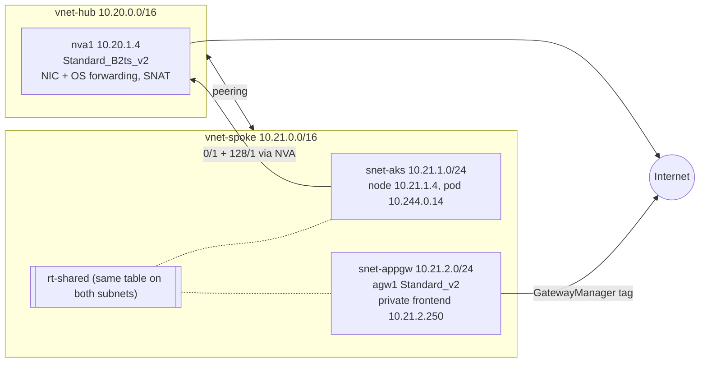

# AKS kubenet + legacy Application Gateway v2 sharing one UDR

**Question:** can a `GatewayManager → Internet` route let a legacy (non-network-isolated) Application Gateway v2, sharing a route table with a kubenet AKS subnet, survive a forced-tunnel default route to a hub NVA?

**Short answer (observed, one bounded run, `swedencentral`, 2026-10-09):** a literal `0.0.0.0/0 → NVA` is rejected by Azure. Two `/1` routes via the NVA are accepted and pod egress then goes through the NVA, but Application Gateway backend health becomes `Unknown` until a `GatewayManager → Internet` route is added; backend health then returned `Healthy`. This is an **unsupported workaround that was observed, not a production recommendation**, and only backend health was checked, not full control-plane functionality. Microsoft documents that a non-isolated v2 gateway does not support a `0.0.0.0/0` NVA route.

## Topology



Official Azure icons/geometry are intentionally omitted.

## Actual setup

- AKS Free tier, Kubernetes 1.35, kubenet, one `Standard_D2as_v5` node, AGIC add-on, sample pod `10.244.0.14` behind `agw1`.
- Application Gateway `Standard_v2` with a public frontend and a private frontend `10.21.2.250`. Feature `EnableApplicationGatewayNetworkIsolation` stayed `NotRegistered` (legacy mode); the private frontend is not private deployment/network isolation.
- NVA `Standard_B2ts_v2` at `10.20.1.4` with NIC IP forwarding, OS `ip_forward` and SNAT.
- One route table, `rt-shared`, attached to both spoke subnets: default `0.0.0.0/0 → Internet` plus the AKS-managed pod route.
- The temporary probe VM/subnet in the original design was not deployed.

## Observed results

| Step | Result |
|---|---|
| Baseline (12:28 UTC) | `agw1` Succeeded/Running, backend Healthy (HTTP 200). See [baseline-verdict.md](baseline-verdict.md). |
| Literal `0.0.0.0/0 → NVA` | Rejected: `ApplicationGatewaySubnetUserDefinedRouteNotAllowed`; no change. [verdict.json](show-output/forced-control-mutation-20261009T1241Z/verdict.json) |
| Split default `0.0.0.0/1` + `128.0.0.0/1 → NVA` | Accepted 12:53:35 UTC. Pod egress reported NVA public IP `20.91.222.168`. Backend-health query exited 0 but returned `Unknown` in 7 of 7 observations over more than 10 minutes (detail: ports 65503-65534; an API-reported status, not a CLI failure). [verdict](show-output/split-default-validation-20261009T1254Z/split-default-control-verdict.md) |
| Add `GatewayManager → Internet` | Admitted 13:08:39 UTC. First `Healthy` at 13:13:31 UTC (4m52s, an upper bound on first observation, not exact convergence); second `Healthy` at 13:15:02 UTC. Pod egress still via NVA. [verdict](show-output/gatewaymanager-validation-20261009T1309Z/treatment-verdict.md) |

Current `rt-shared` routes: `0.0.0.0/0 → Internet`; `0.0.0.0/1` and `128.0.0.0/1 → 10.20.1.4`; pod `10.244.0.0/24 → 10.21.1.4`; `GatewayManager → Internet`.

## Retained state

The user chose to retain the treatment. Nothing was restored or deleted; resource group `rg-aks-agic-shared-udr` is still deployed and incurs cost. Remove it with `deploy\deploy.ps1 -Action Cleanup -ConfirmDelete rg-aks-agic-shared-udr` when no longer needed.

## Reproduction

Uses the current `az` subscription; review scripts before running (they were authored for a lease-based run and not re-executed for publication):

```powershell
cd deploy
.\deploy.ps1 -Action Preflight; .\deploy.ps1 -Action Group
.\deploy.ps1 -Action Base; .\deploy.ps1 -Action Aks; .\deploy.ps1 -Action App
python .\forced-control-mutation.py      # literal 0/0 -> NVA (rejected)
python .\split-default-admission.py      # 0/1 + 128/1 -> NVA
python ..\show-output\gatewaymanager-mutation-20261009T1306Z\mutation.py   # GatewayManager -> Internet
```

Validate with `az network application-gateway show-backend-health -g rg-aks-agic-shared-udr -n agw1 -o json`, a pod-originated request to `api.ipify.org` (e.g. Python `urllib` via `kubectl exec`) and `az network route-table route list`. Exact commands, timestamps, exit codes and timeouts are in each evidence directory's `*.metadata.json` / `commands.json`.

## Limitations

- Single run, one region, one node, one backend; timings are first-observation bounds.
- Only backend health and pod egress were tested, not gateway updates, logs, metrics, scaling or certificates.
- Unsupported by Microsoft; behavior may change without notice.
- Some early captures contain CLI help/error output from launcher argument-forwarding problems (retained, not counted as probes). `forced-control-mutation-20261009T1241Z/commands.json` and baseline files `30`-`33` include such unrelated text.

## Evidence

[`show-output/`](show-output/): `baseline-20261009T1228Z`, `forced-control-mutation-20261009T1241Z`, `split-default-mutation-20261009T1251Z`, `split-default-validation-20261009T1254Z`, `gatewaymanager-mutation-20261009T1306Z`, `gatewaymanager-validation-20261009T1309Z`. Planning documents: [lab-card.md](lab-card.md), [design.md](design.md) (historical).

**Sanitization:** the subscription GUID in backend-health JSON was replaced with `00000000-0000-0000-0000-000000000000`, and a local user-profile path with `<user>`; other IDs were already `<GUID>`/`<redacted-id>` in the captures. Evidence is otherwise as captured, not verbatim-unsanitized. Runtime control files, logs and kubeconfigs are gitignored and not published. The NVA public IP is an ordinary lab address.