# Azure Route Server Route Maps — Topology-Independent User-Story Design Guide

**Owner:** Morpheus (Lead / Architect) · **Version:** 5.1 · **Date:** 2026-08-05 · **Stories:** 12
· **v5.1 US12 revision author:** Trinity (Azure Network SME)

Each story is an independent architecture problem with its own generic reference topology, chosen to
demonstrate that story rather than to match any deployed lab. The `dual-hub-hubless-region-ars` lab
appears only in each story's **Current lab** line and in §2 — except US10 and US12, whose lab deltas
are large enough to need their own clearly separated `Current lab expansion` / `Current lab analogue`
subsections.

**v5.1 change summary (US12 revision — scope-limited).** Corrections applied to **US12 only**, its
front-matter index/summary/matrix/recommended-order cells, and the **US11 test-1 probe reference**
that shared US12's incorrect endpoint claim. (1) **Global Reach is confined to side S-D and outcome
B1** — every claim that it contributes to full outcome C or to local-ER-side failover is removed; it
never carries a prefix across S-B and therefore never restores `hub-1` workload reachability through
`hub-2`. (2) Global Reach's **shared failure domain** is now stated wherever S-D alternatives and
residual risks are discussed: it rides both ER private peerings, so it survives gateway-and-above
faults but is lost when the local circuit or private peering *is* the failure. (3) The **no-overlay
B2 probe is re-anchored** on the existing `vm-nva1` 10.10.1.4 ↔ `vm-nva2` 10.20.1.4 — no VM exists in
either hub's `snet-endpoint`, and `vm-hub1-ep`/`vm-hub2-ep` are spoke-resident — with NSG
prerequisites, BIRD read-only safety and a costed fallback if reuse is ever judged unsuitable.
(4) The same-gateway ARS ER↔ER citation is **scope-limited**, and the square's case is anchored on
MSEE AS 12076 and the no-transit-router rule. (5) ER circuit-to-circuit through a Route Server is
reclassified `Platform-blocked — retained`. (6) US12's route-map cells carry the *eligible but
unassociated; gateway-connection attachment unverified* caveat. (7) The normal-state diagram no
longer ticks B2 unconditionally. (8) Diagram specs are rewritten for **Mermaid** — four quadrant
subgraphs, explicit side labels, absent diagonals as annotations rather than geometry. Nothing was
deleted; no other story body was modified.

**v5 change summary.** A **story index** is new and sits immediately below, before any detailed
story: one row per story with its user outcome, design disposition, route-map role, current-lab fit,
key delta or blocker, and diagram IDs. **US12** is new — *square hybrid connectivity*: two data
centres, each attached only to its own regional hub, with the four sides DC1↔Hub1, Hub1↔Hub2,
Hub2↔DC2 and DC2↔DC1 and **no diagonal hybrid links**. US10 is preserved unchanged apart from two
cross-references to US12. Nothing was deleted.

**v4 change summary.** §0.1 is new: precise overlay terminology, a shared overlay decision table, and
the operational burden an encapsulated overlay adds. US01 and US10 keep their technical content but
now state, explicitly, which mechanism their inter-region requirement actually needs and what the
simpler non-overlay alternative is. US11 is new and is the topology-independent hub-to-hub story
*without* an NVA-to-NVA overlay. Nothing was deleted.

---

## Story index — start here

This is the navigation entry point for US01–US12, not a second copy of the guide. Every cell is a
pointer; the reasoning lives in the story it links to.

**Disposition terms — read before the table.** *Disposition* describes the **design and platform**
standing of a story. It never describes a reviewer's opinion of draft wording.

| Term | Means |
|---|---|
| **Accepted candidate** | The design is sound and its mechanism is either documented as supported by Microsoft Learn or already demonstrated in this lab. It is a candidate for execution under the normal change, cost and evidence gates. |
| **Conditional** | Accepted **only** under a named condition — a mechanism choice, a prerequisite experiment, a cost approval, or a limit that must hold. The condition is stated in the *Key delta / blocker* column and developed in the story. |
| **Rejected as implementation — retained** | A specific *implementation* the story evaluated was rejected on its merits (cost, complexity, shared failure domain, or an unmet requirement). The story is retained: the problem statement and the reasoning are the deliverable. No story currently carries this at whole-story level; it is used *inside* US10 (Learn's UDR-only alternative, rejected because a static route cannot withdraw itself) and inside US12 for **the diagonal fifth link only** — a funding, contracting and policy-sync choice the operator is free to make differently. |
| **Platform-blocked — retained** | The platform does not offer the attachment point or behaviour the story's route-map framing needs. Retained, with the blocking reason, the residual value, and the non-route-map alternative. Used at whole-story level by US06, and *inside* US12 for **ExpressRoute circuit-to-circuit transit through a Route Server**: that is a platform property, not an implementation the story evaluated and declined, so wherever the classification is specifically about platform support it reads `Platform-blocked — retained` and never `Rejected as implementation`. |
| **Pending validation** | Feasibility here is untested. No claim is made in either direction until the named experiment produces evidence. |

**Not a disposition.** A reviewer rejecting how a scenario is *worded* — for example, calling an
association "proven" when only eligibility was demonstrated — is a wording correction. It is never
grounds to drop a scenario, and it never appears in this column. See §2, *Scenario-retention policy*.

**Current-lab fit** uses the five applicability classes: `as-is` · `additive` · `disruptive
activation` · `isolated alternate bed` · `blocked`.

| ID / title | User outcome | Disposition | Route-map role | Current-lab fit | Key delta / blocker | Diagram IDs |
|---|---|---|---|---|---|---|
| **US01** Selective inter-hub prefix exchange | Each region learns only the named remote prefixes its workloads depend on | Conditional | Supporting | additive | Start at US11; the encapsulation is justified only when remote prefixes are redistributed into ARS (§0.1) | [`US01-inter-hub-selective-exchange`](#US01-inter-hub-selective-exchange) |
| **US02** Primary/backup hybrid egress + return path | One predictable primary path, bounded automatic failover, matching return path | Accepted candidate | Primary | as-is | Outcome already demonstrated via NVA-side prepend (Δ2); the *map* variant still needs the US10 E-1 association gate | [`US02-hybrid-egress-preference`](#US02-hybrid-egress-preference) |
| **US03** Dynamic default-route injection | Workloads lose the default when the inspection NVA stops being healthy, instead of blackholing behind a static UDR | Conditional | Supporting | additive | The default is map-modifiable only when it originates from on-premises or an NVA | [`US03-dynamic-default-injection`](#US03-dynamic-default-injection) |
| **US04** Inbound on-prem prefix admission | Only approved on-premises prefixes ever enter Azure routing | Accepted candidate | Primary | as-is | Inbound runs before best-path, so it genuinely decides the installed route | [`US04-inbound-prefix-admission`](#US04-inbound-prefix-admission) |
| **US05** Outbound workload-prefix hygiene | On-premises learns only the Azure prefixes it is meant to see | Accepted candidate | Primary | as-is | The VNet address space ARS advertises natively is not filterable by any map | [`US05-outbound-prefix-hygiene`](#US05-outbound-prefix-hygiene) |
| **US06** Per-tenant / per-spoke-group policy | Different routing policy per tenant group on one shared hub | Platform-blocked — retained | none | blocked | No attachment object exists for a VNet peering; UDRs (AVNM-managed) carry the differentiation | [`US06-per-group-policy-segmentation`](#US06-per-group-policy-segmentation) |
| **US07** Route aggregation for scale | The hybrid edge stays inside route limits as the spoke estate grows | Conditional | Primary | isolated alternate bed | Summarization strips AS-PATH and community, which would destroy the Δ2 hub-preference evidence on the exact path it lives on | [`US07-route-aggregation-scale`](#US07-route-aggregation-scale) |
| **US08** BGP community tagging | Downstream policy and diagnostics can classify routes by origin without inferring it | Accepted candidate | Primary | as-is | Attributes change; reachability does not. Azure communities must not be removed | [`US08-community-tagging-policy`](#US08-community-tagging-policy) |
| **US09** NVA-side vs ARS-side policy placement | Policy lives in one known, version-controlled place, and migrations are auditable | Accepted candidate | Supporting | as-is | Eligibility decides placement — the peer-locality rule (EMP-001 / D2) is the deciding test | [`US09-policy-placement-migration`](#US09-policy-placement-migration) |
| **US10** Bow-tie regional affinity with cross-region backup | Regional affinity **plus** automatic recovery when a site's own attachment fails | Conditional | Supporting — eligible but unassociated on ARS↔NVA peerings; gateway-connection attachment unverified | disruptive activation | Requires the encapsulated NVA-to-NVA overlay, a fresh cost approval, and the E-1/E-2 pre-activation gate; the overlay is a shared failure domain for cross-region traffic *and* for the backup | [`US10-bow-tie-generic-er`](#US10-bow-tie-generic-er), [`US10-bow-tie-lab-vpn-analogue`](#US10-bow-tie-lab-vpn-analogue) |
| **US11** Cross-region reachability without an NVA overlay | The named cross-region flows work, with nothing new for the platform team to operate | Accepted candidate (variants A, B) · Pending validation (variant C) | limited / supporting — no role in any variant's mechanism | additive | A and B are GA; C is Learn-documented as the no-overlay alternative but is unproven in this subscription | [`US11-no-overlay-native-peering`](#US11-no-overlay-native-peering), [`US11-no-overlay-direct-workloads`](#US11-no-overlay-direct-workloads), [`US11-no-overlay-static-nva-transit`](#US11-no-overlay-static-nva-transit) |
| **US12** Square hybrid connectivity (no diagonals) | Each DC attaches only to its own region, cross-region still works, and failover expectations are explicitly bounded rather than assumed | Conditional | Supporting — admission, tagging, preference and backup de-preference only; **eligible but unassociated** on the ARS↔NVA peerings, **gateway-connection attachment unverified** | disruptive activation (the Hub1↔Hub2 side alone is additive) | Four physical sides do **not** imply failover. ER circuit-to-circuit transit through a Route Server is `Platform-blocked — retained`, so outcome C needs a *dynamic* Azure inter-hub path (NVA-to-NVA BGP, or vWAN). **Global Reach does not deliver outcome C** — it is an S-D/B1 site-interconnect mechanism and carries no prefix across S-B | [`US12-square-hybrid-normal`](#US12-square-hybrid-normal), [`US12-square-hybrid-failover`](#US12-square-hybrid-failover), [`US12-square-hybrid-lab-analogue`](#US12-square-hybrid-lab-analogue) |

**Counts (12 stories).** Disposition — Accepted candidate 6 (US02, US04, US05, US08, US09, US11) ·
Conditional 5 (US01, US03, US07, US10, US12) · Platform-blocked — retained 1 (US06) at whole-story
level, and used *inside* US12 for ER circuit-to-circuit transit through a Route Server ·
Rejected as implementation — retained 0 at whole-story level (used inside US10, and inside US12 for
the diagonal fifth link only) · Pending validation 0 at whole-story level (US11 variant C only).
Current-lab fit — as-is 5 · additive 3 · disruptive activation 2 · isolated alternate bed 1 ·
blocked 1.

---

## 0. Mechanism reference

| Lever | Controls | Instrument |
|---|---|---|
| **A** Route visibility | which prefixes exist in a BGP RIB, with which attributes | ARS route maps, NVA BGP policy (BIRD/FRR), GW route filters |
| **B** Next-hop selection | which next hop a subnet actually uses | UDR (wins over BGP), BGP best-path, ECMP |
| **C** Authorization | whether a permitted path may carry a flow | NSG, Azure Firewall / NVA policy |
| **D** Reachability | whether a forwarding path exists at all | VNet peering (native), AVNM connected group, IPsec/ER connection, vWAN, encapsulated NVA overlay |

**Capability facts** used below — Microsoft Learn (*About route maps for Azure Route Server*; *Route
Server FAQ*, retrieved 2026-08-05) plus this lab's empirical evidence:

- Maps act on **existing BGP routes** on ARS connections: ARS↔NVA BGP peerings, the ARS↔ExpressRoute
  gateway connection, and the ARS↔VPN gateway connection, **in the Route Server's own VNet**. One map
  per direction per connection.
- **Inbound** maps run as routes are learned — before best-path selection, so they can change which
  path wins. **Outbound** maps run after best-path selection and shape advertisements only.
- Actions: drop, prefix replace/aggregate, AS-PATH add/replace, community add/replace/remove. Match
  on prefix (`Equals`/`Contains`), community, AS-PATH.
- Not available: modifying or filtering the **VNet address space** ARS advertises natively; creating
  more-specific routes; attaching to a **VNet peering** (no per-spoke object); maps on the MSEE side
  of an ExpressRoute circuit; prefix modification combined with NAT; 4-byte ASNs.
- Do not prepend private or Azure-reserved ASNs (8074, 8075, 12076, 65515, 65517–65520); do not
  remove Azure BGP communities. Documentation ASNs 64496–64511 are a safe lab choice.
- **Summarization strips AS-PATH and community** from the aggregate, inbound and outbound.
- ARS drops a route whose AS-PATH already contains its own ASN 65515; this check runs **before**
  inbound policy, so an upstream device must strip 65515 first.
- The default route is modifiable only when it originates from on-premises or an NVA.
- **Observed, not in Learn as of 2026-08-05:** association is rejected when the BGP peer IP falls
  outside the Route Server's VNet address space — multi-hop peers in remote VNets return
  `HubBgpConnectionFromSpokeVnetCannotReferenceRouteMap`.
- Public preview. The first map on a Route Server triggers a one-time ~30-min upgrade and a
  persistent surcharge that deleting the map does not remove.

---

## 0.1 Overlay terminology, decision table, and operational burden

Written once here and referenced by US01, US10 and US11 rather than repeated. "Overlay" is used
loosely in most network conversations; this document does not use it loosely.

### Four things that are routinely conflated

| Term used in this document | What it actually is | What it does **not** do |
|---|---|---|
| **Azure-native underlay** | Global VNet peering, or an AVNM connected group, between two hub VNets. Packets are forwarded by the Azure fabric on the Microsoft backbone; no BGP session, no encapsulation, no header added. | Does not carry BGP. Is not transitive: it does not give either side the *other* side's peered spokes, gateway-learned prefixes, or Route Server-learned prefixes. |
| **NVA-to-NVA BGP adjacency** | A multi-hop eBGP session between the two NVAs, carried as ordinary TCP/179 traffic **over** the underlay above. Pure control plane: it exchanges prefixes and attributes. | Is **not** an encapsulation overlay. It adds no header, no MTU cost and no tunnel interface. Calling a bare BGP session "an overlay" is the specific imprecision this section exists to remove. |
| **Encapsulated overlay** | An IPsec, GRE or VXLAN tunnel between the two NVAs, riding the same underlay, with its own tunnel interface and its own IP forwarding table. `azure/route-server/multiregion` names IPsec and VXLAN explicitly. | Is not required to *reach* the far hub — the underlay already does that. It exists to separate underlay reachability from overlay forwarding. |
| **Forwarded data path** | The ordered list of devices a packet actually touches. | Never includes a Route Server: *"Azure Route Server only exchanges BGP routes with your network virtual appliance (NVA). The data traffic goes directly from the NVA to the destination virtual machine (VM) and directly from the VM to the NVA"* (Route Server FAQ). |

### The one Azure limitation that actually necessitates encapsulation

It is **not** reachability, and it is **not** the BGP session. It is a next-hop programming
consequence, documented in `azure/route-server/multiregion`:

> "Without overlay tunnels, routing loops can occur when an NVA in Region 1 learns prefixes from
> Region 2 and advertises them to the local Route Server. The Route Server then programs these routes
> in all Region 1 subnets with the NVA as the next hop. When the NVA attempts to send traffic to
> Region 2, its own subnet routes point back to itself, creating a routing loop."

Route Server programs *all* subnets in its VNet — including the NVA's own subnet. So the moment
remote-region prefixes are redistributed into the local Route Server, the local NVA's Azure route
table sends those packets back to the local NVA. Encapsulation breaks the recursion because the
tunnel's outer destination is the remote NVA's underlay address, which is covered by the peering
system route rather than by the injected prefix.

The same Learn article documents the non-encapsulated escape hatch: **disable BGP route propagation
on the NVA subnets and program the cross-region prefixes as explicit UDRs**, accepting "the
operational overhead of manually maintaining these static routes as your network topology changes."
That escape hatch is the mechanism behind US11 variant C.

### Compact overlay decision table

| Requirement | Simplest mechanism that meets it | Overlay needed? | Why |
|---|---|---|---|
| Hub-address-space / shared-services reachability between two regions | Global VNet peering `hub-1`↔`hub-2` | **No** | Native system routes cover each hub's own address space in both directions. US11-A. |
| Workload-to-workload reachability across regions | Direct spoke↔spoke global peering, or AVNM mesh / hub-and-spoke with direct connectivity + global mesh | **No** | Removes the hub hop entirely; no routing fabric to operate. US11-B. |
| Cross-region transit **through** the hub NVAs, small and stable prefix set | Explicit UDRs on the NVA subnets (+ `disableBgpRoutePropagation`), remote NVA IP as next hop | **No**, conditionally | Learn's documented UDR-based alternative to overlay tunnels. Static; must be proven, not assumed. US11-C. |
| Cross-region transit with **dynamic** prefix learning and automatic withdrawal | NVA-to-NVA eBGP adjacency over the peering underlay | **BGP yes, encapsulation only if remote prefixes are redistributed into the local Route Server** | The adjacency gives the policy point; encapsulation only becomes mandatory once ARS programs the remote prefixes with the local NVA as next hop. |
| Cross-region transit where remote prefixes are redistributed into ARS and reach spokes automatically | NVA-to-NVA eBGP **over an IPsec/VXLAN tunnel** | **Yes** | The self-next-hop loop above. This is the `azure/route-server/multiregion` reference pattern. US01 at scale, US10. |
| Prefix-level allow-list, AS-PATH/community policy, per-region tagging on the cross-region path | NVA BGP policy on the adjacency (ARS maps as a second, auditable point) | **BGP yes, encapsulation no** | The allow-list lives in BGP policy. Encapsulation contributes nothing to it. |
| Overlapping / duplicated address space across regions | Encapsulated overlay with NAT on the NVAs, or separate routing domains | **Yes** | The native fabric cannot forward duplicate prefixes; only an encapsulated, NAT-capable device can. |
| Cross-region access to a *service*, not a network | Private endpoint / Private Link, or an application-layer gateway | **No** | *"The private-link resource can be deployed in a different region than the one for the virtual network and private endpoint"* (`azure/private-link/private-endpoint-overview`). No routing fabric at all. |
| Managed inter-hub routing without owning NVAs | Virtual WAN with routing intent | **No** | Replaces the Route Server construct rather than extending it. |
| Hub-to-hub transit through ExpressRoute / a second Route Server | — | **N/A — not available** | *"Do NVA-advertised routes get propagated from one Route Server to another Route Server via ExpressRoute MSEE? No"* and *"Can I peer two Azure Route Servers in two peered virtual networks…? No, Azure Route Server doesn't forward data traffic"* (Route Server FAQ). |

### Operational burden an encapsulated overlay adds

Stated once, applies wherever this document retains one. An overlay must buy off *all* of this:

- **NVA HA and lifecycle** — the NVAs become a production routing platform: image/OS patching,
  certificate or PSK rotation, config drift, capacity sizing for cross-region throughput, and an HA
  pair per region (Route Server FAQ: peer *each* NVA instance with *both* Route Server instances, and
  peer at least two NVA instances). A single-NVA overlay is a single point of failure for every
  cross-region flow.
- **Two more things to monitor** — tunnel state *and* BGP session state, independently, in both
  regions, with alerting. A tunnel that is up while BGP is down is silent black-holing.
- **Prefix filters on both ends** — import and export policy must be authored, version-controlled and
  reviewed on both NVAs. A missing filter leaks; an over-tight filter silently withdraws.
- **Next-hop handling** — 65515 must be stripped on export or the far Route Server discards the route
  *before* any inbound policy runs, so the failure presents as absence, not as an error. Route maps
  cannot perform the strip.
- **MTU and fragmentation** — only when encapsulated. IPsec/GRE/VXLAN headers reduce the usable path
  MTU; TCP MSS clamping on the NVAs is not optional, and PMTUD black holes are a classic
  intermittent-failure source that looks like an application bug.
- **Convergence dependencies** — cross-region recovery is now bounded by BGP timers (Route Server:
  60 s keepalive, 180 s hold) plus the tunnel's own dead-peer detection, not by fabric behaviour.
- **Asymmetric-path troubleshooting** — two policy points per direction means four places a
  preference can disagree. Any stateful device on the path turns asymmetry into an outage, and proof
  requires simultaneous captures/counters at both NVAs rather than traceroute.
- **Failure-domain coupling** — every service that rides the overlay fails together with it. US10's
  residual-dependency table is the worked example: the tunnel is a shared dependency of cross-region
  traffic *and* of the ExpressRoute-failure backup, so one failure takes both.

**Rule of thumb used throughout this document:** an overlay must solve a stated requirement from the
decision table above. "Because the reference architecture has one" is not a requirement.

---

## 1. User stories

**How to read each story's Intent.** Every story below carries an **Intent** block with three fixed
fields, kept separate from the mechanism discussion that follows in **Maps solve** / **Maps do not
solve**: **Why this need exists** — the concrete application, organizational, or operational context
that creates the requirement; **Desired user outcome** — what the platform owner or application team
actually experiences, stated without leading with route-map mechanics; **When this story does not
apply** — the condition under which the proposed restriction or optimization would be artificial or
counterproductive, so an unsupported or rejected story still states its user-centric reason to exist.
Route filtering changes what a device can see, never what it may do — no Intent field implies that a
route map substitutes for NSG, firewall, or application-level authorization.

### US01 — Selective regional prefix exchange between two hubs

**Story.** As a platform network owner running two regional hubs whose application estates are
built, changed, and operated independently, I want each hub to learn only the specific set of the
other region's prefixes that its own workloads actually depend on — not the other region's full
address space by default — so that a change, incident, or uncontrolled route-table growth in one
region cannot silently spread into the other, while the shared services, DR, and management flows
each region does depend on stay reachable.

**Intent.**
- **Why this need exists** — Regional application estates are frequently intentionally autonomous:
  different teams, different change windows, sometimes overlapping or tenant-owned address space that
  must not become mutually visible. Only a small, named set of flows — shared services, DR
  replication, centralized management, or specific approved inter-region application dependencies —
  is meant to cross between them. Drivers for restricting the rest include organizational fault-domain
  separation, change isolation between regions, keeping route-table scale bounded as each hub's spoke
  count grows, and regulatory or data-residency constraints that require Azure to not even offer a
  path to certain prefixes.
- **Desired user outcome** — Application and platform teams in one region keep operating, changing,
  and scaling their own estate without a routing change, growth event, or misconfiguration in the
  other region reaching them uninvited, while the specific cross-region dependencies they rely on keep
  working without extra effort.
- **When this story does not apply** — If every application in both regions legitimately needs full
  cross-region reachability and the resulting prefix count is within Azure's and on-premises' route
  limits, imposing a selective allow-list only adds operational overhead for no corresponding benefit.
  Security can be one motivation for limiting reachability, but route filtering is not authorization:
  NSGs, Azure Firewall, and application-level controls still decide what a permitted path may actually
  carry.

**Topology.** `hub-a` R1 10.1.0.0/16 with `ars-a` + `nva-a` 10.1.1.4 AS 64496 · `hub-b` R2
10.2.0.0/16 with `ars-b` + `nva-b` 10.2.1.4 AS 64497 · spokes `spoke-a1/a2` 10.1.16.0/24, 10.1.17.0/24
and `spoke-b1/b2` 10.2.16.0/24, 10.2.17.0/24 peered to their hub · `svc-shared` 10.1.240.0/24, the
only R1 prefix R2 may learn · `vnet-hub-a`↔`vnet-hub-b` global VNet peering as the **underlay** ·
`nva-a`↔`nva-b` eBGP 64496↔64497 carried over that underlay as the **control-plane adjacency** ·
each ARS peers its local NVA. The adjacency is *optionally* carried inside an IPsec/VXLAN
encapsulation — see **Overlay: required or not** below; it is not required by default.

**Figure — `US01-inter-hub-selective-exchange`: selective inter-hub prefix exchange (generic bed).**
*What to look for:* the thick edge is the native peering **underlay** that already creates the path, so
the allow-list is carried by the BGP adjacency plus the ARS outbound map — encapsulation hangs off to
one side as a conditional variant and the approved set is just `svc-shared`.

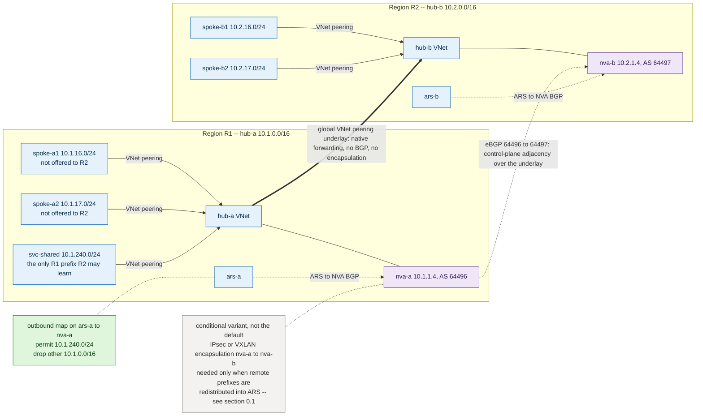

*Current-lab note (not drawn):* the additive form of this figure is a `vnet-hub1`-to-`vnet-hub2`
global peering pair; the generic bed above is what the story is designed on.

**Objective.** `hub-b` learns 10.1.240.0/24 only; `hub-a` learns 10.2.240.0/24 only.

**Maps solve.** Outbound map on `ars-a`→`nva-a` permits the shared prefix and drops other R1
prefixes; inbound map on the same peering drops anything from R2 outside the list — an ARM-auditable
allow-list at the hub edge.

**Maps do not solve.** Creating the hub-a↔hub-b path (lever D); ARS VNet address space, advertised
natively and unfilterable; a UDR-pinned next hop (levers B/C).

**Alternatives.** NVA BGP filters (portable, no preview, works for non-local peers) · direct global
peering + UDRs (no prefix-level policy — see **US11**, which develops this into a full story) · vWAN
custom route tables or AVNM connectivity configurations · address-plan segregation
with a shared-services supernet.

**Recommended.** Use the smallest mechanism that carries the approved set. If the approved set is a
handful of stable shared-services prefixes — which is US01's own premise — start at **US11** (native
global hub peering, or direct spoke peerings / AVNM for named workload pairs) and stop there. If the
approved set must be *dynamic* and auditable at prefix level, establish reachability with the global
peering underlay, add the `nva-a`↔`nva-b` eBGP adjacency as the policy point, keep the authoritative
allow-list in NVA BGP policy, and add ARS outbound maps as a second auditable enforcement point.
Route map when the peer is ARS-local and portal visibility matters; NVA-only when non-local peers or
cross-cloud portability dominate. Add encapsulation **only** under the condition stated immediately
below.

**Overlay: required or not.**

- *What the story actually needs.* An auditable, prefix-level allow-list on the cross-region path.
  That is a BGP policy requirement, satisfied by the `nva-a`↔`nva-b` **BGP adjacency**. Encapsulation
  contributes nothing to it.
- *Why the added complexity is justified — when it is.* The moment the approved remote prefixes are
  redistributed into the local Route Server so spokes learn them automatically, ARS programs them
  into **every** subnet in the hub — including `nva-a`'s own subnet — and `nva-a`'s route to R2 points
  back at `nva-a` (`azure/route-server/multiregion`). Encapsulation is the documented fix: the tunnel's
  outer destination is `nva-b`'s underlay address, which the peering system route still resolves.
  Justified when the approved set churns often enough that maintaining it as static routes is worse
  than operating a tunnel, when AS-PATH/community attributes must survive end to end, or when the two
  regions have overlapping address space that needs NAT.
- *Simpler non-overlay alternative — the default.* Keep the BGP adjacency, but **do not** redistribute
  remote prefixes into the local Route Server's NVA subnet: set `disableBgpRoutePropagation` on the
  NVA subnets and program the approved remote prefixes as explicit UDRs with the remote NVA as next
  hop. This is Learn's own "alternative design without overlay networks". Cost: the approved set is
  now static, which is acceptable precisely because US01 defines it as small and approved. Simpler
  still, when the approved set does not need to pass through an NVA at all: US11 variants A and B.
- *Operational burden if retained.* See §0.1 — NVA HA/lifecycle, tunnel **and** BGP monitoring,
  two-sided prefix filters, 65515 stripping, MSS clamping, BGP-timer-bound convergence, two-ended
  capture for asymmetry, and one shared failure domain for every cross-region flow.

**Evidence.** PASS — `ars-b` learned routes contain the shared prefix and no other R1 prefix;
`spoke-b1` reaches `svc-shared`, not `spoke-a1`. FAIL — any unapproved prefix appears, or the
approved one disappears.

**Rollback.** Detach maps (non-destructive); restore prior NVA config from version control; diff
against the pre-change learned-route capture.

**Current lab — `testable with additive expansion`.** No `vnet-hub1`↔`vnet-hub2` path exists. Add a
global peering pair `vnet-hub1`↔`vnet-hub2` (AllowForwardedTraffic, no gateway transit) — this alone
is the underlay and is the **only** step needed for the US11-A form of the test. Add the
`vm-nva1`↔`vm-nva2` eBGP adjacency over it when the dynamic allow-list is the point; add IPsec/VXLAN
encapsulation on top **only** if remote prefixes are redistributed into the hub Route Servers.
Attach `ars-hub1` outbound on `peer-nva1` and `ars-hub2` outbound on `peer-nva2`. Reuse both NVAs,
both hub Route Servers (already map-capable), existing spokes. Disruption **medium** — new prefixes
enter NVA RIBs and can perturb proven Δ1/Δ2/Δ3 evidence; note also that creating the peering triggers
a BGP soft (or hard) reset toward peered NVAs (Route Server FAQ). Cost **low**.

**Diagram `US01-inter-hub-selective-exchange`.** Nodes `hub-a`, `hub-b`, `ars-a`, `ars-b`, `nva-a`,
`nva-b`, `spoke-a1`, `spoke-a2`, `svc-shared`, `spoke-b1`, `spoke-b2`; groups R1 / R2 region boxes;
edges thick solid = data plane over VNet peering (including the `hub-a`↔`hub-b` **underlay**), thin
solid = `nva-a`↔`nva-b` eBGP adjacency labelled `eBGP 64496↔64497 — control plane, no encapsulation`,
thin dotted = ARS↔NVA BGP. Draw the IPsec/VXLAN encapsulation as a **greyed dashed** edge labelled
`conditional variant — only when remote prefixes are redistributed into ARS (see §0.1)`, so the
reader can see that the allow-list does not depend on it. Highlight outbound map on `ars-a`→`nva-a`:
`permit 10.1.240.0/24 · drop other 10.1.0.0/16`. Before — all R1 prefixes crossing to R2. After —
one green line carrying the shared prefix, others terminated at the map symbol.

---

### US02 — Primary/backup hybrid egress with a matching return path

**Story.** As a hybrid connectivity owner with two gateways to the same on-premises network, I want
traffic to prefer one designated path, fail over to the other automatically when the primary is down,
and have on-premises return traffic over that same path, so a stateful device on the route never sees
only half of a flow and drops it, and so failover behaves the way it was designed to the first time it
is needed for real — not only in a test.

**Intent.**
- **Why this need exists** — Hybrid paths commonly cross stateful devices — firewalls, NAT, load
  balancers — that must see both directions of a flow to keep it open. Left to ECMP or independent
  best-path selection, the two gateways can send a flow's request and response through different
  devices, breaking the session. Operators also want failover behaviour that is known and rehearsed,
  not discovered for the first time during an actual outage.
- **Desired user outcome** — Applications and operators experience one predictable primary path in
  steady state, an automatic failover within a bounded time when that path fails, and automatic
  failback afterward — without anyone needing to diagnose asymmetric routing mid-incident.
- **When this story does not apply** — If nothing stateful sits on the path and pure ECMP across both
  gateways is acceptable, forcing a primary/backup preference only gives up usable capacity for no
  benefit.

**Topology.** `hub-p` 10.1.0.0/16 with `gw-p`, `ars-p`, `nva-p` 10.1.1.4 AS 64496 · `hub-s`
10.2.0.0/16 with `gw-s`, `ars-s`, `nva-s` 10.2.1.4 AS 64497 · `edge-onprem` 10.9.0.0/16 AS 64500
terminating one tunnel per hub · workload prefix 10.1.16.0/24 advertised via both hubs · each ARS
peers its local NVA and local gateway connection.

**Figure — `US02-hybrid-egress-preference`: one designated primary, a losing standby, matching return.**
*What to look for:* both tunnels exist, but only the shorter AS-PATH is installed on-premises — the
standby is a labelled conditional edge, and the prepend that creates the preference is a policy node
on `ars-s`, not a hop.

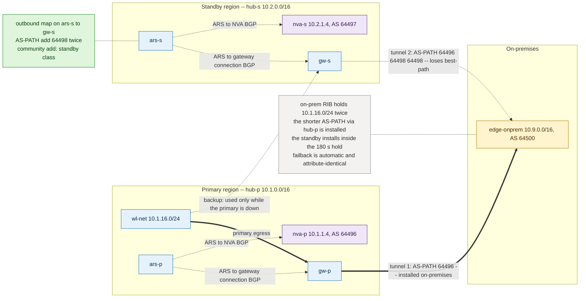

**Objective.** On-prem installs the workload prefix via `hub-p`; the `hub-s` path exists but loses;
failover inside the BGP hold window; automatic failback.

**Maps solve.** Outbound map on `ars-s`→`gw-s` prepends 64498 ×2 to the workload prefix, so on-prem
prefers the primary. A community `Add` on the same map lets on-prem policy classify the standby path
explicitly rather than inferring it from path length.

**Maps do not solve.** The Azure-side egress next hop for the workload subnet (lever B). Outbound
maps run after best-path selection, so they cannot change which path the local ARS itself prefers.
Private and Azure-reserved ASNs cannot be prepended.

**Alternatives.** NVA export prepend (identical result, works for non-local peers, no preview) ·
on-prem inbound LOCAL_PREF (most robust where the edge is yours) · VPN connection weight (coarse) ·
asymmetric UDR with stateless inspection (avoids rather than solves).

**Recommended.** Set Azure-side preference with an AS-PATH prepend and pin it with on-prem LOCAL_PREF
where the edge is yours. Route map when ARS and gateway share a VNet; NVA prepend otherwise. Both
directions must target the same prefix set or the return path will not match.

**Evidence.** PASS — on-prem RIB shows the prefix twice with a shorter AS-PATH via `hub-p`; primary
installed; after a primary-side BGP shutdown the standby installs within 180 s with a bidirectional
probe succeeding; post-recovery table matches the pre-fault capture. FAIL — equal AS-PATH lengths,
ECMP install, no convergence in the hold window, or a changed post-recovery table.

**Rollback.** Remove the prepend rule or detach the map; re-read on-prem learned routes against
baseline.

**Current lab — `testable as-is`.** Behaviour already exists via NVA-side prepend (Δ2: hub1
`65515-65001` versus hub2 `65515-65002-65002-65002` at `vpngw-onprem`); the map variant reproduces it
natively. Add nothing. Attach `ars-hub2` outbound on the `vpngw-hub2` connection, match 10.31.0.0/24
+ 10.32.0.0/24, AS-PATH add `64496` ×2. Remove the NVA2 BIRD prepend first or both stack. Reuse all
gateways, connections, NVAs; `ars-hub2` already map-capable. Disruption **low**, reversible, brief
set-C reconvergence. Cost **zero incremental** — hub ARS surcharge already sunk.

**Diagram `US02-hybrid-egress-preference`.** Nodes `wl-net`, `hub-p` (`ars-p`, `nva-p`, `gw-p`),
`hub-s` (`ars-s`, `nva-s`, `gw-s`), `edge-onprem`; groups primary region / standby region /
on-premises; edges two tunnels to `edge-onprem`, each labelled with its advertised AS-PATH. Highlight
outbound map on `ars-s`→`gw-s`: `AS-PATH add 64498 ×2`. Before — equal-weight tunnels, ECMP arrow.
After — bold arrow via `hub-p`, greyed dashed via `hub-s`, plus a failover inset with the primary
struck through and the standby arrow bold.

---

### US03 — Dynamic default-route injection into workload networks

**Story.** As a workload platform owner centralizing egress inspection behind NVAs, I want workload
subnets to receive `0.0.0.0/0` toward a healthy inspection appliance and to lose that default the
moment the appliance stops being healthy, so an appliance failure is a visible, fail-closed loss of
default route rather than a static UDR silently continuing to blackhole every workload behind it.

**Intent.**
- **Why this need exists** — A static UDR to an inspection appliance keeps forwarding to it even after
  it fails, so every workload subnet behind that UDR blackholes until an operator notices and edits
  the route by hand. As the workload estate grows, maintaining a per-subnet UDR for every new spoke
  also becomes its own operational burden.
- **Desired user outcome** — Application teams keep working through appliance failures and recoveries
  without operator intervention: traffic automatically follows a healthy appliance, and if none are
  healthy, workloads clearly lose the default (fail closed) instead of continuing to send packets into
  a dead device.
- **When this story does not apply** — If the estate is small and stable enough that a static UDR to a
  monitored appliance (or a load-balanced VIP in front of several) is operationally acceptable, dynamic
  default injection adds BGP and route-map complexity without a proportionate reduction in operator
  toil.

**Topology.** `svc-vnet` 10.1.0.0/16 hosts `ars-x` plus inspection NVAs `nva-1` 10.1.1.4 AS 64496 and
`nva-2` 10.1.1.5 AS 64497, both originating `0.0.0.0/0` into `ars-x` · workload VNets `wl-1`
10.1.16.0/24 and `wl-2` 10.1.17.0/24 peer to `svc-vnet` and receive the default as a
`VirtualNetworkGateway`-sourced route.

**Figure — `US03-dynamic-default-injection`: an ECMP default resolved into a deterministic primary.**
*What to look for:* both NVAs originate `0.0.0.0/0`, the inbound map lengthens only the secondary's
AS-PATH, and the Route Server *programs* the winning next hop on a dotted edge — it never carries the
egress packet itself.

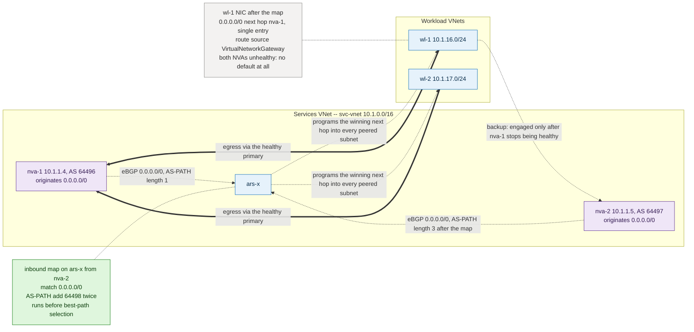

**Objective.** Workload NICs show `0.0.0.0/0` via `nva-1` while healthy, via `nva-2` when not, and no
default when neither is healthy.

**Maps solve.** The NVAs originate; the map arbitrates. Inbound map on `ars-x`←`nva-2` matching
`0.0.0.0/0` with `AS-PATH add 64498 ×2` breaks the ECMP tie before best-path selection, making
`nva-1` the deterministic primary. This is the documented case where the default is modifiable,
because it originates from an NVA.

**Maps do not solve.** Origination itself; injection into an individual spoke (no per-peering
attachment object); anything where a UDR already carries `0.0.0.0/0`, since the UDR wins. An outbound
map cannot break the tie because best-path already ran.

**Alternatives.** Static UDR to a load-balancer VIP fronting both NVAs (deterministic but static) ·
NVA export prepend (same effect; required for non-local NVAs) · Azure Firewall in a vWAN hub with
default propagation · AVNM-managed UDR lifecycle.

**Recommended.** Originate from the NVAs, distribute via ARS, break ties with inbound policy — on the
ARS when the NVA is ARS-local, on the NVA otherwise. Keep an emergency UDR documented but unapplied,
since applying it overrides the behaviour under test.

**Evidence.** PASS — workload NIC shows `0.0.0.0/0` with a single next hop equal to the primary NVA,
source `VirtualNetworkGateway`; ARS learned routes show AS-PATH length 1 from the primary and 3 from
the secondary; stopping the primary BGP daemon moves the next hop within 180 s; stopping both removes
the default. FAIL — persistent ECMP, a static route source, or a default surviving loss of both NVAs.

**Rollback.** Detach the inbound map; ECMP returns; confirm with a fresh effective-route capture.

**Current lab — `testable with additive expansion`.** Set-C spokes already receive an ARS-injected
default with NVA1 preferred, but that policy lives in BIRD because `ars-poland` has no BGP peer
inside `vnet-poland-ars`. Add `vnet-spoke-a2` (e.g. 10.12.0.0/24) + one B-series VM, peered to
`vnet-hub1` with gateway transit / `UseRemoteGateways` and **no** UDR; have `vm-nva1` originate
`0.0.0.0/0` toward `ars-hub1`. Attach `ars-hub1` inbound on `peer-nva1` — peer IP 10.10.1.4 is inside
`vnet-hub1` 10.10.0.0/16, satisfying locality. Reuse `ars-hub1`, `vm-nva1`, `vnet-hub1`; existing
route tables untouched. Disruption **low** — new spoke isolated, `rt-spoke-a` and set-C unchanged.
Cost **low** (~1 small VM/day). The same test on `ars-poland` is rejected by peer locality and would
need an isolated bed with a local NVA.

**Diagram `US03-dynamic-default-injection`.** Nodes `svc-vnet`, `ars-x`, `nva-1`, `nva-2`, `wl-1`,
`wl-2`; group one region box with a services-VNet sub-box holding ARS + both NVAs; edges NVA→ARS BGP
labelled `0.0.0.0/0`, ARS-VNet→workload peerings labelled `default propagated`. Highlight inbound map
on `ars-x`←`nva-2`: `match 0.0.0.0/0 · AS-PATH add 64498 ×2`. Before — equal-weight NVA lines, NIC
panel `0/0 → [nva-1, nva-2] ECMP`. After — `nva-1` bold, `nva-2` dashed, NIC panel `0/0 → nva-1`.

---

### US04 — Admission control for prefixes learned from on-premises

**Story.** As a cloud network security owner who does not fully control the on-premises WAN's own
change process, I want Azure to accept only an approved list of on-premises prefixes, so a WAN
misconfiguration, a leaked default route, or an unexpected network merge cannot pull Azure traffic
toward on-premises without an explicit decision on the Azure side.

**Intent.**
- **Why this need exists** — The on-premises WAN is often operated by a different team, or a
  different organization entirely, and its BGP configuration can change without Azure visibility. A
  fat-fingered summary, a leaked default route, or a merged/acquired network can suddenly advertise far
  more than Azure should ever route toward.
- **Desired user outcome** — A mistake or unexpected change on the on-premises side is contained at
  the Azure edge: the platform keeps forwarding correctly to on-premises for what is actually approved,
  and does not silently start routing broad or unexpected traffic toward a WAN that made a mistake.
- **When this story does not apply** — If Azure fully trusts and directly controls the on-premises
  edge (single team, tightly change-managed) and the prefix set is small and stable, an allow-list adds
  a control point without much reduced risk. Regardless, this filter is not an authorization boundary:
  accepting a route only makes a path exist — NSGs and firewall/application policy still decide what
  may use it.

**Topology.** `hub` 10.1.0.0/16 hosts `ars`, `gw` (VPN or ER), `nva` · `edge-onprem` AS 64500
advertises 10.9.0.0/16 (approved) plus 172.16.0.0/12 and `0.0.0.0/0` (not approved) · `wl-1`
10.1.16.0/24 workload spoke.

**Figure — `US04-inbound-prefix-admission`: an allow-list at gateway ingress, before propagation.**
*What to look for:* three prefixes are offered and only one survives — the map runs on the ARS-to-gateway
connection *before* best-path, so the unapproved pair never reaches the spoke NIC at all.

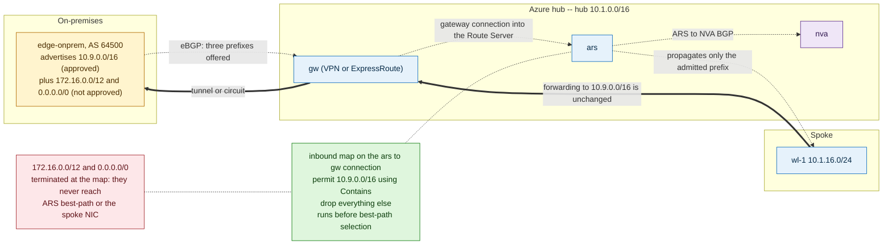

**Objective.** ARS and every downstream VNet learn 10.9.0.0/16 only.

**Maps solve.** The strongest fit in this guide. An inbound map on the ARS↔gateway connection — an
explicit permit for the approved supernet followed by a drop-all rule — enforces admission at the
point of entry, before best-path selection and before propagation to spokes. Prefix `Contains`
matching covers a supernet and its more-specifics in one rule.

**Maps do not solve.** The on-prem advertisement itself; anything on the MSEE side of an ExpressRoute
circuit; data-plane authorization (a dropped route removes reachability, not intent — NSG and
firewall policy still apply); a subnet whose UDR points at the gateway regardless of the RIB.

**Alternatives.** ExpressRoute route filters (Microsoft peering scope only, not private peering) ·
NVA import filters where the hybrid link terminates on an NVA · on-prem export policy (correct in
principle, rarely under your control) · alerting on unexpected prefixes (detective only).

**Recommended.** Inbound route map on the gateway connection as the enforcing control, paired with an
alert on learned-route count so a wrongly dropped legitimate prefix is noticed. Use an NVA import
filter instead only when ARS and gateway do not share a VNet, or when preview status is unacceptable.

**Evidence.** PASS — ARS learned routes on the gateway connection contain the approved supernet and
none of the test-injection prefixes; the workload NIC loses the unapproved entries; connectivity to
the approved prefix is unaffected. FAIL — an unapproved prefix survives, or an approved prefix is
collaterally removed.

**Rollback.** Detach the inbound map and compare learned routes to the pre-change capture — one API
call plus one reconvergence.

**Current lab — `testable as-is`.** Add nothing; optionally advertise two or three extra loopback
prefixes from the on-prem side as harmless deny targets. Attach `ars-hub1` inbound on the `vpngw-hub1`
connection, and/or `ars-hub2` on `vpngw-hub2`. Reuse existing hub Route Servers, VPN gateways,
connections, on-prem simulator. Disruption **low** — begin by denying a synthetic prefix, not
10.40.0.0/16. Cost **zero incremental**.

**Diagram `US04-inbound-prefix-admission`.** Nodes `edge-onprem`, `gw`, `ars`, `nva`, `wl-1`; groups
on-premises / Azure hub / spoke; edges tunnel `edge-onprem`→`gw` labelled with three advertised
prefixes, `gw`→`ars` connection, `ars`→`wl-1` propagation. Highlight inbound map on `gw`→`ars`:
`permit 10.9.0.0/16 (Contains) · drop *`. Before — three prefixes reaching the spoke NIC table.
After — one prefix at the spoke, two terminated at the map symbol.

---

### US05 — Outbound workload-prefix hygiene toward on-premises

**Story.** As a cloud network owner, I want on-premises to learn only the Azure prefixes it is meant
to reach, so platform and management ranges are never offered as a destination on-premises has no
reason to use, and the on-prem route table stays as small as the on-prem operators need it to be.

**Intent.**
- **Why this need exists** — Platform and management address ranges — Route Server hosts, NVA
  management interfaces, jump boxes, shared infrastructure — are not meant to be a destination for
  on-premises users or devices at all. Every prefix on-premises does not need is also one more line in
  a router someone else operates and must keep in sync.
- **Desired user outcome** — On-premises network operators see a small, meaningful route table
  limited to what their users and applications actually need to reach, without needing Azure-side
  context to judge which entries are safe to rely on.
- **When this story does not apply** — If on-premises route-table capacity is not a constraint and
  there is an accepted reason for on-premises to see the full Azure address space (for example, a
  small, fully trusted lab with one combined operations team), pruning the export adds maintenance
  burden for no gain — and it is only possible for eBGP-learned prefixes in the first place, since
  native VNet address space cannot be suppressed this way regardless of intent.

**Topology.** `hub` 10.1.0.0/16 (platform range, not advertised) hosts `ars`, `gw`, `nva` · `wl-prod`
10.1.16.0/24 advertised · `wl-mgmt` 10.1.240.0/24 not advertised · `edge-onprem` 10.9.0.0/16 AS
64500. Workload prefixes reach the ARS RIB either as peered-VNet advertisements or as NVA-learned
eBGP routes — which of the two decides whether a map can act.

**Figure — `US05-outbound-prefix-hygiene`: eBGP-learned prefixes are filterable, VNet-native ones are not.**
*What to look for:* the map drops the management prefix on the way out, while the annotation marks the
one class of prefix no outbound map can ever suppress — that classification, not the rule syntax,
decides feasibility.

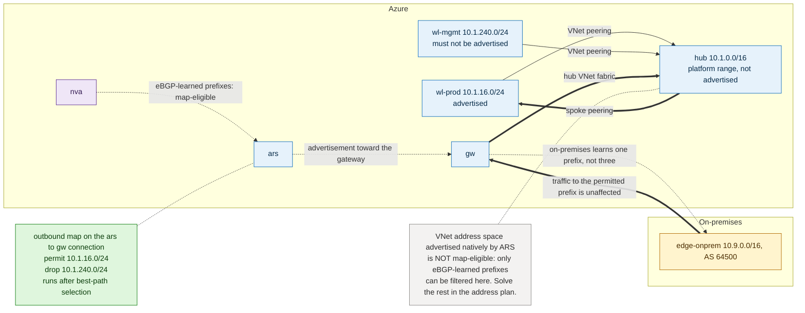

**Objective.** On-premises learns 10.1.16.0/24 and nothing else from Azure.

**Maps solve.** An outbound map on the ARS↔gateway connection drops management and platform prefixes
and permits the workload prefix, controlling exactly what leaves Azure; it can also tag the permitted
prefix with a community for on-prem classification.

**Maps do not solve.** The decisive limitation here: the **VNet address space** ARS advertises
natively is not map-modifiable, so a peered VNet's own prefix cannot be suppressed this way — only
eBGP-learned routes can. Outbound maps also cannot influence which Azure path wins.

**Alternatives.** Address-plan separation — put anything on-prem must not learn into a supernet that
is never advertised (the durable fix) · NVA export filter where the NVA originates the routes · vWAN
custom route advertisement · disabling gateway transit or route propagation on the peerings whose
prefixes should not leave.

**Recommended.** Solve it in the address plan first; use an outbound map for residual eBGP-learned
prefixes and as a guardrail against future additions. Classify each target prefix as VNet-native or
eBGP-learned before designing the rule — that classification decides feasibility.

**Evidence.** PASS — on-prem learned routes contain exactly the permitted set; probes to the
permitted prefix succeed, probes from on-prem to a suppressed prefix fail while intra-Azure
reachability is retained. FAIL — a permitted prefix vanishes. A suppressed VNet-native prefix that
persists is expected evidence of the native-advertisement rule, not a defect.

**Rollback.** Detach the outbound map; re-read on-prem learned routes against baseline.

**Current lab — `testable as-is`.** Add nothing. Attach `ars-hub1` outbound on the `vpngw-hub1`
connection. Built-in contrast: 10.31.0.0/24 arrives at hub1 as an eBGP route from NVA1 and **is**
map-eligible, while 10.11.0.0/24 (spoke-a) is VNet-native and is **not** — one experiment
demonstrates both halves of the rule. Reuse existing hub Route Servers, gateways, connections,
on-prem simulator. Disruption **low-medium** — suppressing a set-C prefix temporarily removes an
on-prem path; change one hub at a time. Cost **zero incremental**.

**Diagram `US05-outbound-prefix-hygiene`.** Nodes `wl-prod`, `wl-mgmt`, `hub`, `ars`, `nva`, `gw`,
`edge-onprem`; groups Azure box (hub + two spokes) / on-premises; edges spoke peerings into `hub`,
`ars`→`gw`, `gw`→`edge-onprem`. Highlight outbound map on `ars`→`gw`: `permit 10.1.16.0/24 · drop
10.1.240.0/24`, plus an annotation on the VNet-native prefix reading `not map-eligible`. Before —
three prefixes in the on-prem RIB. After — one permitted, one dropped at the map, one annotated
native and unchanged.

---

### US06 — Per-tenant / per-spoke-group routing policy

**Story.** As a shared-platform owner serving tenants with genuinely different requirements, I want
different spoke groups to receive different routing policy — tenant A egresses via a firewall, tenant
B egresses directly, tenant C receives no default — so each tenant gets the posture its own workload
needs without every tenant paying for a separate hub.

**Intent.**
- **Why this need exists** — A shared hub often hosts tenants or business units with different
  requirements: one may be regulated and required to inspect all egress, another may run low-risk
  workloads that do not need inspection overhead, a third may be intentionally isolated with no
  default route at all. Building one hub per posture would multiply infrastructure and operating cost
  for a difference that is really about policy, not topology.
- **Desired user outcome** — Each tenant experiences the routing behaviour its own requirements call
  for — inspected egress, direct egress, or none — without needing to know, or be affected by, how the
  other tenants on the same shared hub are configured.
- **When this story does not apply** — If all tenants on the hub share the same egress and
  default-route posture, per-group differentiation is unneeded complexity. Where it is needed, it is
  delivered by UDRs, AVNM, or vWAN custom route tables rather than by route maps, since Azure Route
  Server has no per-spoke attachment point to express it.

**Topology.** `hub` 10.1.0.0/16 hosts `ars`, `fw-nva` 10.1.1.4, `gw` · `tenant-a` spokes 10.1.16.0/22
take `0.0.0.0/0` → `fw-nva` · `tenant-b` spokes 10.1.32.0/22 egress directly · `tenant-c` spokes
10.1.48.0/22 learn on-prem prefixes only, no default.

**Figure — `US06-per-group-policy-segmentation`: the desired attachment, and the boundary that blocks it.**
*What to look for:* the per-tenant route map the story wants is drawn deliberately, in the blocked
class, against the Azure attachment boundary that refuses it — a VNet peering is not a route-map
object, so the differentiation lands on the route tables instead.

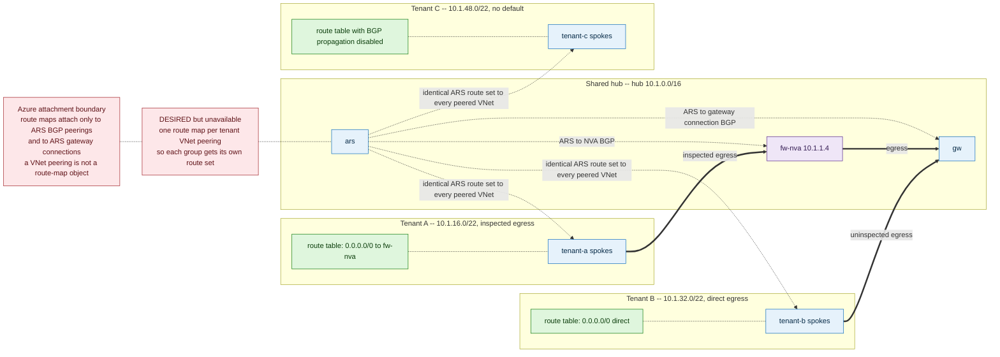

**Objective.** Three distinct route tables for three spoke groups behind one Route Server.

**Maps solve.** Nothing directly. ARS distributes its post-best-path RIB uniformly to every peered
VNet, and maps attach to ARS BGP peerings and gateway connections — not to VNet peerings. With no
per-group attachment object, one Route Server cannot produce three different outcomes.

**Maps do not solve.** Per-destination differentiation; suppressing propagation to a subset of peered
VNets; any per-subnet override.

**Alternatives.** UDRs per spoke subnet with `disableBgpRoutePropagation` where a group must not
receive ARS routes — direct, deterministic, and UDR wins over BGP by design · AVNM for UDR and
connectivity configuration at group scale · vWAN custom route tables and labels, the managed control
plane built for this shape · separate Route Servers per policy class, at the cost of another ARS per
group · NSG/firewall policy where the difference is authorization rather than routing.

**Recommended.** UDR per spoke group, lifecycle-managed by AVNM at scale; escalate to vWAN custom
route tables when group or hub count makes UDR management the bottleneck. Route maps are not part of
this solution — using them here produces policy that leaks across groups.

**Evidence.** PASS — one NIC per group shows the intended distinct default behaviour and on-prem
prefix visibility; changing one group leaves the other two byte-identical. FAIL — a change to one
group alters another, or BGP propagation reintroduces a route a group should not have.

**Rollback.** Dissociate the route table from the subnet, or re-enable BGP propagation; both take
effect immediately.

**Current lab — `blocked by platform limitation`** for the route-map framing: no attachment point
exists, since VNet peering is not a route-map object — record that as a negative result. The UDR/AVNM
alternative is testable with additive expansion: add `vnet-spoke-c3` (e.g. 10.33.0.0/24) peered to
`vnet-poland-ars` with a route table that has BGP propagation disabled, and contrast its effective
routes with `vnet-spoke-c1`. Reuse `ars-poland`, the existing set-C peering pattern, both NVAs.
Disruption **none** to existing spokes. Cost **low** (~1 small VM/day, or zero prefix-only).

**Diagram `US06-per-group-policy-segmentation`.** Nodes `hub`, `ars`, `fw-nva`, `gw`, three tenant
spoke groups; groups one hub box + three tenant swimlanes; edges peerings hub→each group, all
labelled with the identical ARS-propagated route set. Highlight a crossed-out route-map symbol on the
peerings annotated `no per-peering attachment point`, plus three route-table symbols on the tenant
subnets carrying the differentiation. Before — three identical tables. After — three distinct tables,
the differentiator drawn on the UDR rather than on the ARS.

---

### US07 — Route aggregation for spoke-scale growth

**Story.** As a network owner approaching a route-count limit on the hybrid edge, I want Azure to
advertise one summary prefix instead of dozens of spoke prefixes, so adding the next spoke never risks
breaching an on-premises or ExpressRoute route-count ceiling and forcing an unplanned outage.

**Intent.**
- **Why this need exists** — As a platform scales out with more spokes and more regions, the number
  of distinct prefixes crossing the hybrid edge grows with it. On-premises routers and ExpressRoute
  both enforce hard route-count ceilings, and reaching one is an outage, not a warning.
- **Desired user outcome** — Operators keep adding spokes inside a planned address block without
  touching on-premises configuration for each addition, and without the estate's growth ever
  threatening a hard route-limit breach.
- **When this story does not apply** — If spoke count and its growth trajectory stay comfortably
  under the route-count ceiling, aggregating pre-emptively only costs the attribute information
  (AS-PATH, community) it strips. It is also not a fix for a non-contiguous address plan: aggregating
  unrelated prefixes just overexposes address space and can blackhole traffic to ranges that do not
  exist.

**Topology.** `hub` 10.1.0.0/16 hosts `ars`, `nva`, `gw` · sixteen spokes `spoke-01`…`spoke-16`
allocated contiguously from 10.4.0.0/20 (10.4.0.0/24 … 10.4.15.0/24) · `edge-onprem` AS 64500 should
learn 10.4.0.0/20 only.

**Figure — `US07-route-aggregation-scale`: sixteen /24s become one /20, and the attributes go with them.**
*What to look for:* the aggregate leaves on the outbound map while reachability to every component
prefix is untouched — the cost is the stripped AS-PATH and community, which a second rule has to put
back.

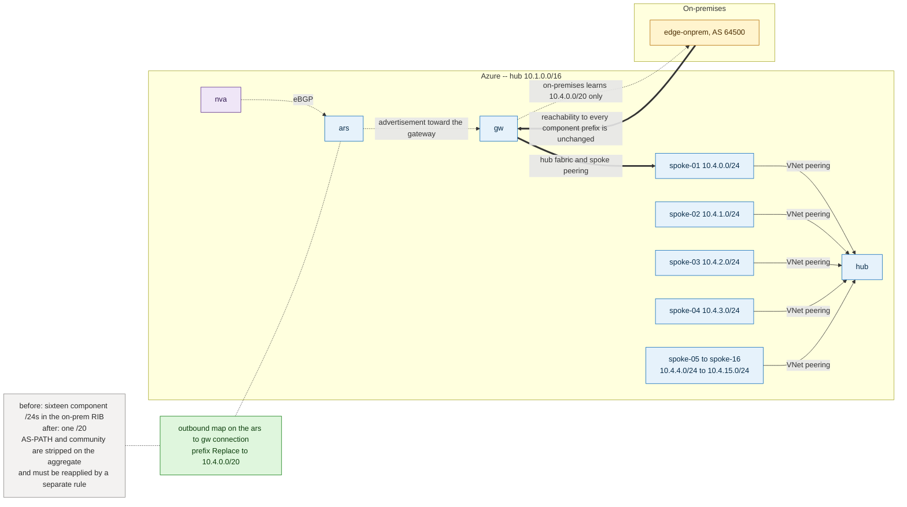

**Objective.** One on-prem route for sixteen spokes; adding `spoke-17` inside the supernet requires no
on-prem change.

**Maps solve.** An outbound map on the ARS↔gateway connection with a prefix `Replace` action rewrites
the matched set into the aggregate — the documented summarization capability.

**Maps do not solve.** Summarization **strips AS-PATH and community** from the aggregate, so any
path-preference or tagging policy that relied on them is lost and must be reapplied by a separate
rule on the aggregate. Maps cannot create more-specific routes, so a summary cannot be selectively
de-aggregated later. Aggregation cannot repair a non-contiguous address plan: unrelated prefixes
share only very large supernets, and advertising one overexposes address space and can blackhole
traffic to prefixes that do not exist.

**Alternatives.** Address-plan redesign onto contiguous per-region or per-group supernets (a
prerequisite more than an alternative) · NVA aggregation in BIRD/FRR, which keeps control of the
aggregate's attributes · vWAN hub route aggregation · on-prem inbound summarization where the edge is
yours.

**Recommended.** Fix the address plan first, aggregate at the Azure edge with an outbound map, and add
an explicit rule that re-attaches AS-PATH and community policy to the aggregate. Never aggregate
across a boundary containing prefixes you do not own.

**Evidence.** PASS — on-prem RIB shows the aggregate and none of the components; connectivity to a
component prefix still works; adding a new in-supernet spoke produces no on-prem RIB change; the
aggregate carries the re-applied AS-PATH. FAIL — components still present, an aggregate broader than
the allocation, broken connectivity to a covered prefix, or uncompensated attribute loss.

**Rollback.** Remove the `Replace` rule; components reappear on the next advertisement. Capture the
on-prem RIB before and after.

**Current lab — `requires isolated alternate test bed`.** Two independent reasons: 10.31.0.0/24 and
10.32.0.0/24 are not contiguous, so their smallest common aggregate is 10.0.0.0/10 — far too broad to
advertise; and summarization strips the AS-PATH carrying the Δ2 hub-preference evidence on exactly
the `vpngw-onprem` path where that evidence lives. Preferred: a separate resource group with one hub
VNet (ARS + VPN gateway + NVA), one on-prem simulator, four spokes from a single /20. If additive
instead: add prefix-only `vnet-spoke-c3` 10.34.0.0/24 and `vnet-spoke-c4` 10.34.1.0/24 peered to
`vnet-poland-ars`, aggregate only 10.34.0.0/23 outbound on `ars-hub1`→`vpngw-hub1`, and never match
existing set-C prefixes. Reuse existing hub Route Servers, gateways, on-prem simulator; NVAs need an
export entry for the new prefixes. Disruption **medium** — a mis-scoped match rule can suppress the
proven set-C advertisements. Cost **low** additively, **medium** for a standalone bed (second VPN
gateway + Route Server).

**Diagram `US07-route-aggregation-scale`.** Nodes `hub`, `ars`, `nva`, `gw`, `spoke-01`…`spoke-04`
plus an ellipsis node, `edge-onprem`; groups Azure / on-premises; edges spoke peerings into hub,
`ars`→`gw`, `gw`→`edge-onprem`. Highlight outbound map on `ars`→`gw`: `Replace → 10.4.0.0/20`, with a
secondary annotation `AS-PATH and community stripped — reapply on aggregate`. Before — on-prem RIB
panel listing sixteen /24s. After — on-prem RIB panel listing one /20.

---

### US08 — BGP community tagging for downstream policy and diagnostics

**Story.** As a network operations owner maintaining downstream routing policy across a growing
estate, I want every route to carry a tag identifying its origin and class, so downstream devices can
apply policy by what a route is rather than by an ever-longer prefix list, and so an operator
troubleshooting an incident can see a route's provenance at a glance instead of reverse-engineering it.

**Intent.**
- **Why this need exists** — As an estate grows, prefix lists used for downstream policy — which
  paths to prefer, what to admit, what to log — become long, stale, and easy to get subtly wrong.
  Operators troubleshooting a routing problem also need to know where a route came from without
  reconstructing it from the prefix itself.
- **Desired user outcome** — Operators write policy once, in terms of what a route is, instead of
  re-deriving and re-listing which prefixes currently match that description every time the estate
  changes; during an incident, a route's origin is visible directly rather than requiring
  investigation.
- **When this story does not apply** — At small, stable scale where a short prefix list is easy to
  keep correct, introducing a tagging scheme is process overhead without proportionate benefit. Once a
  route is summarized (US07), its tags are stripped, so tagging and aggregation cannot both be relied
  on for the same prefix.

**Topology.** `hub-a` 10.1.0.0/16 (`ars-a`, `nva-a` AS 64496) tags its routes `64496:100` · `hub-b`
10.2.0.0/16 (`ars-b`, `nva-b` AS 64497) tags `64497:100` · gateway connections tag anything learned
from on-prem `64496:200` · `edge-onprem` 10.9.0.0/16 AS 64500 consumes tags in its own policy.

**Figure — `US08-community-tagging-policy`: attributes change, reachability does not.**
*What to look for:* every edge that changes is a dashed control-plane edge carrying a community value;
the thick data-plane edge is annotated as unchanged, which is the whole claim of the story.

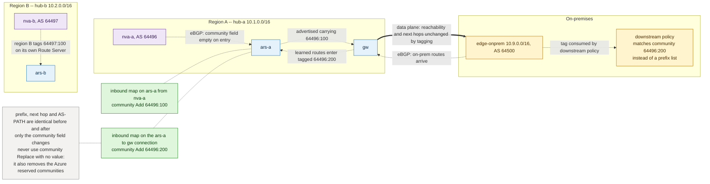

**Objective.** Every route carries exactly one origin tag; downstream policy matches the tag; no
reachability change at all.

**Maps solve.** A textbook fit. An inbound map on the ARS↔NVA peering or the ARS↔gateway connection
with a community `Add` action tags routes on entry with no reachability side effects. Later rules —
on the same or another Route Server — match on community rather than prefix, which is what makes the
pattern scale. Tagging is the lowest-risk route-map experiment available and the natural first
activation on any Route Server.

**Maps do not solve.** Tagging routes ARS advertises from VNet address space, which is not
map-modifiable. Tags are lost on summarized routes (US07). Azure's reserved communities must not be
removed. Tagging changes nothing in the data plane unless a downstream device consumes the tag.

**Alternatives.** NVA community assignment in BIRD/FRR (equivalent, portable, required for non-local
peers) · prefix-list policy without communities (fine at small scale, unmaintainable as spokes
multiply) · ExpressRoute's built-in regional communities for Microsoft-originated routes · naming and
address-plan conventions as a documentation-only substitute.

**Recommended.** Tag at the ingress point closest to the origin — ARS inbound map where the peer is
ARS-local, NVA policy elsewhere. Define the community scheme before the first tag is applied;
retrofitting a scheme across an estate is far more expensive than choosing one. Reserve a distinct tag
for on-prem-learned routes so US04-style admission policy can be expressed by tag.

**Evidence.** PASS — ARS learned routes for the tagged prefix show the expected community; every other
attribute including AS-PATH and next hop is unchanged; untagged prefixes untouched; a downstream rule
matching the community selects exactly the tagged set. FAIL — the tag is absent, applied to unintended
prefixes, or accompanied by a reachability change.

**Rollback.** Detach the map, or add a community `Remove` rule for the specific value. Do not use
community `Replace` with no value on a production connection — that also removes Azure's reserved
communities.

**Current lab — `testable as-is`.** Add nothing. Attach `ars-hub1` inbound on `peer-nva1`, match
10.31.0.0/24, action community `Add 64496:100`. Second phase: `ars-hub1` inbound on the `vpngw-hub1`
connection tagging on-prem routes `64496:200`, then a rule matching that community instead of
10.40.0.0/16. Reuse everything; both hub Route Servers already map-capable. Disruption **minimal** —
additive attribute only, no reachability change expected. Cost **zero incremental**.

**Diagram `US08-community-tagging-policy`.** Nodes `hub-a` (`ars-a`, `nva-a`), `hub-b` (`ars-b`,
`nva-b`), `gw`, `edge-onprem`, one downstream policy consumer; groups region A / region B /
on-premises; edges NVA→ARS BGP lines and the ARS→gateway connection, each carrying a small route
badge. Highlight inbound map symbols `community Add 64496:100` and `community Add 64496:200`. Before —
route badges with an empty community field. After — identical prefixes and next hops with populated
community fields, and a downstream policy box matching `64496:200` instead of a prefix list.

---

### US09 — Choosing and migrating between NVA-side and ARS-side policy

**Story.** As an architect who already has BGP policy on NVAs and is now adding Azure Route Server
maps to the same network, I want a clear rule for which policy belongs on the appliance and which on
the Route Server, plus a safe migration procedure, so the same rule is never silently duplicated, left
stacked, or dropped from both places at once.

**Intent.**
- **Why this need exists** — Once both an NVA and a Route Server can enforce BGP policy, changing one
  of them can silently duplicate a rule (for example, an AS-PATH prepend applied on both, stacking the
  effect) or remove it from only one side while an operator assumes it is gone from both. This kind of
  drift is usually discovered during an incident, not in a design review.
- **Desired user outcome** — An architect or operator can look at any policy requirement and know
  unambiguously where it must live, and can move a rule from one enforcement point to the other with a
  documented before/after check, confident the network behaves identically throughout and afterward.
- **When this story does not apply** — If the network already has a single enforcement point — all
  policy on NVAs, or a platform such as vWAN routing intent that removes the choice entirely — a
  placement rule and migration procedure have nothing to adjudicate between.

**Topology.** `hub` 10.1.0.0/16 hosts `ars`, `gw`, and `nva-local` 10.1.1.4 AS 64496 (map-eligible) ·
`remote-svc` 10.3.0.0/24 hosts a second Route Server whose only peer, `nva-remote` 10.2.1.4 AS 64497,
is multi-hop and in another VNet (not map-eligible) · `edge-onprem` AS 64500 is the hybrid peer.

**Figure — `US09-policy-placement-migration`: same intent, two control points, eligibility decides.**
*What to look for:* the deciding test is on the control-plane edges — the ARS-local peer is
map-eligible, the multi-hop cross-VNet peer is not — while the thick data-plane edge is annotated as
unchanged through the whole stacked-then-cut migration.

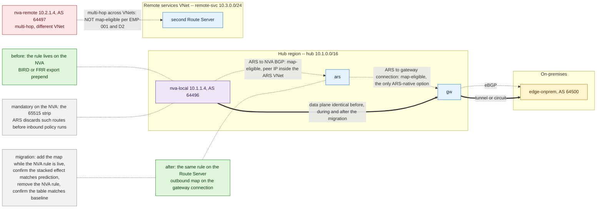

**Objective.** One authoritative location per rule, with a documented reason, and a migration that
never leaves both copies active.

**Maps solve.** They are the only ARS-native lever for gateway-connection filtering, they surface
policy in ARM and the portal where it is auditable, and they apply to gateway connections where no
appliance exists to host a filter.

**Maps do not solve.** Attachment to a peer whose IP lies outside the Route Server's VNet, which
excludes every multi-hop cross-VNet peer. Preview status, the one-time ~30-min first-use upgrade, and
a surcharge that persists after deletion are all part of the decision. They also cannot express
anything that must happen before ARS ingress — the 65515 strip must be done upstream, since ARS
discards such routes before inbound policy runs.

**Alternatives.** All policy on the NVA (one place to look, portable, no preview exposure; no portal
visibility, no gateway-connection coverage) · split by eligibility (the practical middle ground) ·
move the pattern to vWAN routing intent where a managed abstraction is acceptable.

**Recommended placement rule.**

| Policy target | Place it on |
|---|---|
| Cross-VNet / multi-hop BGP peer | NVA (BIRD/FRR) — no eligible attachment point exists |
| Hub-local NVA peer | Either; prefer the route map when portal auditability matters |
| VPN or ExpressRoute gateway connection | Route map — the only ARS-native option |
| Anything that must run before ARS ingress (65515 strip) | NVA — mandatory |
| Per-spoke or per-subnet next hop | UDR |

**Migration procedure.** Capture baseline learned routes → add the map while the NVA rule is still
active and confirm the stacked effect matches prediction (two prepends become four) → remove the NVA
rule → confirm the table matches the original baseline → keep the removed NVA rule in version control
with a dated comment.

**Evidence.** PASS — after migration the learned-route table is attribute-identical to the
pre-migration baseline and only one rule exists in either location. FAIL — attributes differ after
cutover, both rules remain active, or rollback cannot restore the baseline.

**Rollback.** Restore the NVA rule from version control and detach the map; the two operations are
independent, so either can be reverted alone.

**Current lab — `testable as-is`.** The lab holds evidence for both sides: the Poland Route Server's
multi-hop peers were rejected for association, while both hub Route Servers accept maps on their local
NVA peers. Add nothing. Migration candidate: Δ2 — move the NVA2 export prepend on 10.31.0.0/24 and
10.32.0.0/24 from BIRD to an `ars-hub2` outbound map on the `vpngw-hub2` connection (same change as
US02, run as a controlled cutover). Attach `ars-hub2` outbound on the `vpngw-hub2` connection. Reuse
everything; pre/post comparison uses the existing `vpngw-onprem` learned-route captures. Disruption
**low**, with a brief stacked-prepend window that is itself the intermediate evidence. Cost **zero
incremental**.

**Diagram `US09-policy-placement-migration`.** Nodes `hub` (`ars`, `gw`, `nva-local`), `remote-svc`
(second ARS), `nva-remote`, `edge-onprem`; groups hub region / remote services VNet / on-premises;
edges `nva-local`↔`ars` marked `map-eligible`, multi-hop `nva-remote`↔remote ARS marked `not
map-eligible`, `ars`→`gw` marked `map-eligible`. Highlight a two-panel decision panel — "policy on
NVA" and "policy on Route Server" — with the migration arrow annotated `stacked window → verify →
remove NVA rule`. Before — rule drawn on the NVA. After — rule drawn on the ARS connection, NVA
position greyed out.

---

### US10 — Bow-tie dual-site regional affinity with cross-region backup

**Stable ID.** `US10-bow-tie-dual-site-regional-affinity`

**Related.** **US12** (`US12-square-hybrid-connectivity`) is the separate *square* story: the same
four-corner picture, but with the square itself as the unit of design, the inter-hub mechanism left
open and justified separately, and failover stated as a bounded contract rather than required. See
*US10 versus US12* at the end of US12 for the full comparison. US10 is not superseded by it.

**Story.** As a hybrid connectivity owner with two data centres, each paired with its own Azure region
for latency and fault-domain reasons, I want each data centre to attach only to its own regional hub
in steady state, so each region keeps a short, predictable primary path and a failure or change
confined to one data centre or region does not require, or default to, four fully meshed circuits —
while a cross-region backup still exists for the loss of either attachment.

**Intent.**
- **Why this need exists** — Pairing one data centre with one Azure region keeps everyday latency low
  and keeps a data-centre or region failure from taking out both pairs at once; it is a fault-domain
  choice, not an artifact of the routing mechanism. Dual-homing every DC to every region would remove
  that separation and add the cost and operational complexity of four circuits that, most days, add no
  benefit.
- **Desired user outcome** — In normal operation each site experiences a short, low-latency path to
  its own region. If either a data centre's own attachment or its paired region fails, connectivity
  recovers automatically through the surviving on-premises and Azure-side paths, without operators
  needing to pre-provision or maintain a full mesh "just in case."
- **When this story does not apply** — If a data centre genuinely needs steady-state reachability to
  both regions — not merely as a backup, for example because it hosts workloads served equally from
  both — the diagonal, backup-only attachment matrix is the wrong design; that calls for actual
  dual-homing (see `azure/route-server/about-dual-homed-network`) rather than a diagonal topology with
  an indirect backup.

**Plane convention used throughout this story.** Two planes are kept strictly apart, in the prose,
in the tables and in both diagram specifications.

| Plane | Carries | Devices that appear in a path |
|---|---|---|
| **Data plane** (thick edges) | packets | CPE, ER/VPN gateway, NVA, VNet fabric / peering, spoke NIC |
| **Control plane** (thin edges) | BGP updates only | Route Server, ARS↔NVA peerings, ARS↔gateway connections |

Azure Route Server is a control-plane device only: *"Azure Route Server only exchanges BGP routes
with your network virtual appliance (NVA). The data traffic goes directly from the NVA to the
destination virtual machine (VM) and directly from the VM to the NVA"* (Route Server FAQ). It also
programs next hops into VNet route tables — it never receives, forwards or returns a packet.
**No path table, failure narrative or diagram edge in this story lists a Route Server as a
forwarding hop.** Where a Route Server matters, it is named as the device that *selected or
programmed* the next hop, not as a hop.

**Topology.** Region R1 — `hub-1` 10.1.0.0/16 with `ergw-1`, `ars-1`, `nva-1` 10.1.1.4 AS 64496;
spokes `spoke-1a` 10.1.16.0/24, `spoke-1b` 10.1.17.0/24. Region R2 — `hub-2` 10.2.0.0/16 with
`ergw-2`, `ars-2`, `nva-2` 10.2.1.4 AS 64497; spokes `spoke-2a` 10.2.16.0/24, `spoke-2b`
10.2.17.0/24. Sites — `dc-1` 10.8.0.0/16 behind `cpe-1` AS 64500, `dc-2` 10.9.0.0/16 behind `cpe-2`
AS 64501. Circuits — `er-1` at the R1 peering location carries private peering to `ergw-1` only;
`er-2` at the R2 peering location carries private peering to `ergw-2` only. Microsoft's side of both
private peerings is AS 12076. **No cross-connections:** `cpe-1` has no session toward `er-2`, `cpe-2`
none toward `er-1`, and neither ER gateway is attached to the other region's circuit. On-prem DCI —
`cpe-1`↔`cpe-2` over the corporate WAN, eBGP 64500↔64501. Azure inter-region — an `nva-1`↔`nva-2`
tunnel (IPsec or VXLAN) riding a global VNet peering `hub-1`↔`hub-2` (`AllowForwardedTraffic`, no
gateway transit), carrying eBGP 64496↔64497. Control plane only: each Route Server peers its local
NVA and its local ER gateway connection, with branch-to-branch enabled on both.

**The generic bed uses real public ASNs.** 64496/64497/64500/64501 above are placeholders *for the
document*. In a real build every ASN that can reach an ExpressRoute circuit must be an ASN the
enterprise actually holds — see *Maps solve*, item 2, and the ASN rule below.

**Figure — `US10-bow-tie-generic-er` (1 of 2): normal state on the generic ExpressRoute bed.**
*What to look for:* the underlay and the encapsulation are two separate edges between the same NVAs,
and both Route Servers sit beside their hub on dashed edges only — no Route Server touches a thick
forwarding path.

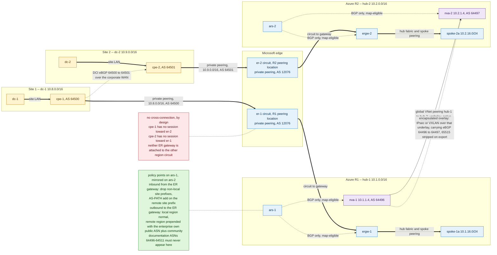

**Figure — `US10-bow-tie-generic-er` (2 of 2): failure states F1 and F4.**
*What to look for:* in F1 the recovery chain runs site, DCI, far circuit, far hub, overlay, home spoke
— and contains no Route Server; F4 shows why the same overlay is a shared dependency of both the
cross-region traffic and the backup.

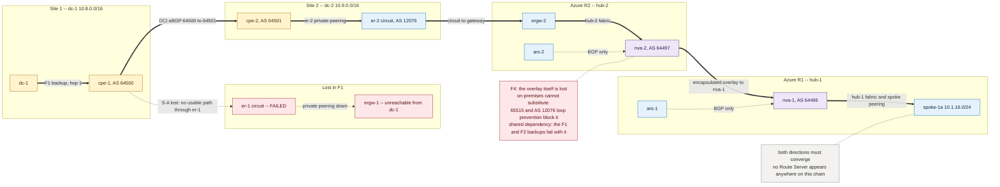

**Why this inter-region mechanism.** Four candidates were evaluated.

- **Global VNet peering alone** creates reachability but carries no BGP session, so there is no
  attribute to shape and no automatic withdrawal — next-hop selection collapses onto UDRs.
- **ExpressRoute Global Reach** links the two circuits and is a genuine second `dc-1`↔`dc-2` path.
  It remains a **valid and recommended alternative for the on-prem DCI** (F3), including as the DCI
  itself where the corporate WAN is thin. It joins the *on-premises sides* of the two circuits; it
  does not connect the hub VNets and cannot provide `hub-1`↔`hub-2` transit. Across geopolitical
  regions it requires Premium circuits.
- **vWAN inter-hub** solves the problem natively but replaces the Route Server construct this guide
  is about, so it belongs in the alternatives, not in the reference.
- **NVA tunnel over global peering** is chosen because it is the only option that both creates the
  path and gives a BGP policy point on each side — which is exactly where the AS-path hygiene this
  story depends on has to live. Learn's multi-region Route Server guidance specifies this shape
  directly: hub-per-region with Route Server plus NVAs, hubs joined by global VNet peering, NVAs
  joined by IPsec or VXLAN tunnels, and the NVAs removing ASN 65515 from the AS path on
  advertisement (`azure/route-server/multiregion`). The same article explains why the tunnel and not
  bare peering: without an overlay the NVA's own subnet routes point back at itself for the remote
  region's prefixes, producing a forwarding loop.

**Overlay: required or not — US10 retains it.**

- *Which layer does what.* The `hub-1`↔`hub-2` **global VNet peering is the underlay** and by itself
  already gives hub-address-space reachability. The `nva-1`↔`nva-2` **eBGP adjacency** is the control
  plane and is where every attribute this story depends on is set. The **IPsec/VXLAN encapsulation**
  is a third, separate thing, and is the only part whose necessity has to be argued.
- *Why the added complexity is justified.* Four requirements converge, and no non-overlay mechanism
  satisfies all four. (1) Remote-region prefixes must reach every spoke automatically, which means
  redistributing them into the local Route Server — which is exactly the condition that creates the
  NVA self-next-hop loop (`azure/route-server/multiregion`). (2) The F1/F2 backups must engage and
  withdraw **automatically** on circuit failure; a static UDR set cannot withdraw. (3) Affinity is
  defended by AS-PATH length and communities, which only exist on a BGP path. (4) The prefix set is
  not small or stable: it is every spoke in both regions plus two on-premises estates, and it changes
  whenever a spoke is added. Requirement (1) alone makes the encapsulation mandatory rather than
  optional; requirements (2)–(4) are why the BGP adjacency cannot be replaced by static routing at
  all.
- *Simpler non-overlay alternative, and why it is rejected here.* Learn's UDR-based alternative
  (`disableBgpRoutePropagation` on the NVA subnets plus explicit cross-region UDRs) is real and is
  developed as **US11 variant C**. It fails US10 on requirement (2): a static route cannot withdraw
  itself when `er-1` fails, so the ER-failure backup would need external automation to rewrite UDRs —
  Learn's own trade-off table calls this "manual route management, limited scalability". Native
  hub-to-hub peering alone (US11-A) covers hub address space only and never the spokes or the
  gateway-learned on-premises prefixes. Direct spoke-to-spoke peering / AVNM (US11-B) gives
  Azure-to-Azure workload reachability without any NVA — and if cross-region **workload** traffic were
  the *only* requirement, that would be the right answer and this overlay would not be justified. It
  is not the only requirement: the ExpressRoute-failure backup is.
- *What it costs — accepted, not hidden.* The full §0.1 operational burden applies, and US10's
  residual-dependency table below is its concrete instance: the encapsulated overlay is a shared
  dependency of cross-region Azure traffic **and** of the F1/F2 circuit backups, so a single overlay
  failure removes both. This is the strongest argument for building it redundantly, and the reason
  the on-premises DCI must never be documented as its backup.

**What is and is not proven about Azure-to-Azure transit here.** Two facts are frequently conflated;
this story separates them.

1. **Two VNets on two *separate* circuits.** In this design there is no Azure-side transit between
   `hub-1` and `hub-2` through the Microsoft edge, because each circuit terminates on one ER gateway
   only and Global Reach joins the sites rather than the VNets
   (`azure/expressroute/expressroute-global-reach`). This is a property of the diagonal attachment
   matrix, not a quotable platform prohibition — it is an assumption to verify in any build, and it
   is why the Azure-native inter-region path is built explicitly.
2. **Two Route Servers reachable through the same MSEE.** The Route Server FAQ's bow-tie diagram
   describes a *different* shape — one on-premises network reached over ExpressRoute, with a second
   Route Server on the same circuit domain — and states that NVA-advertised routes are dropped by the
   second Route Server. That statement is cited here only for what it is: the reason a shared-MSEE
   hairpin is not a substitute for the inter-region tunnel. **It is not evidence for the diagonal
   design's separate-circuit behaviour.**

**Where `as-override` belongs.** Both Route Servers use ASN 65515, so any route that has passed one
Route Server's AS domain is dropped by the other. Learn sanctions two mitigations, both on a device
the operator owns: `as-override` on the NVA when a single NVA peers two Route Servers that share
65515 in the dual-homed pattern (`azure/route-server/about-dual-homed-network`), and 65515 AS-path
rewrite / removal on the NVA in the multi-region overlay pattern (`azure/route-server/multiregion`).
Those are mitigations for their own patterns. They are **not** proof that a bow-tie carries
Azure-to-Azure traffic, and neither can be performed by a route map: the Route Server discards a
route carrying its own ASN *before* inbound policy runs (Route Server FAQ).

**Objective.** Steady state: `spoke-1a` reaches `dc-1` over `er-1` and `dc-2` over the inter-region
tunnel into R2 and then `er-2`; the mirror holds for R2. Failure of either circuit: the affected site
keeps full Azure reachability through the DCI, the peer site's circuit and the Azure tunnel. Failure
of the DCI: both regions stay whole. Failback is automatic and returns the exact steady-state tables.

**Normal-path analysis — local affinity.** Forwarding hops only; the *why* column names the
control-plane reason.

| Flow | Data-plane path (packets) | Why it wins (control plane) |
|---|---|---|
| `spoke-1a` → `dc-1` | `spoke-1a` → VNet peering → `ergw-1` → `er-1` → `cpe-1` → `dc-1` | Only copy of 10.8.0.0/16 with AS-PATH `64500`; the DCI-leaked copy reaches R1 as `64497 64501 64500` |
| `dc-1` → `spoke-1a` | `dc-1` → `cpe-1` → `er-1` → `ergw-1` → VNet peering → `spoke-1a` | `cpe-1` LOCAL_PREF pins its own circuit; `ars-1`→`ergw-1` outbound map prepends R2 prefixes only |
| `spoke-2a` ↔ `dc-2` | Mirror of the two rows above through `ergw-2` / `er-2` / `cpe-2` | Mirror |
| `dc-1` ↔ `dc-2` | `cpe-1` → DCI → `cpe-2` | Azure carries no substitute: separate circuits, no hub-to-hub ER transit; Global Reach is the sanctioned second site-to-site path |
| `spoke-1a` ↔ `spoke-2a` | `spoke-1a` → `nva-1` → tunnel over global peering → `nva-2` → `spoke-2a` | Only Azure-internal path; `ars-1`/`ars-2` program the NVA as next hop but forward nothing |

**Cross-region path detail.** `spoke-1a` → `dc-2` is `spoke-1a` → `nva-1` → tunnel → `nva-2` →
`ergw-2` → `er-2` → `cpe-2` → `dc-2`. It crosses two policy points (`nva-1` export, `nva-2` import)
and one gateway. The return is `dc-2` → `cpe-2` → `er-2` → `ergw-2` → `nva-2` → tunnel → `nva-1` →
`spoke-1a`, and it is symmetric **only** if `cpe-2`'s policy and R2's UDRs are configured to match.

Regional affinity in steady state is therefore not created by policy — it is created by the diagonal
attachment matrix and by AS-PATH length. Policy exists to make it *robust*: the failure mode to
prevent is a DCI-leaked copy of the remote site prefix arriving over the local circuit with a path
length that ties or beats the direct one, which produces cross-region hairpins through the corporate
WAN that no one intended.

**Failure-path analysis.**

- **F1 — `er-1` circuit or `ergw-1` failure.** `dc-1` loses direct Azure attachment.
  *Site-to-Azure:* `cpe-1` advertises 10.8.0.0/16 across the DCI; `cpe-2` re-advertises it into
  `er-2` as `64501 64500`; `ergw-2` accepts it, `ars-2` installs it, `nva-2` carries it across the
  tunnel into R1. Forwarding: `dc-1` → `cpe-1` → DCI → `cpe-2` → `er-2` → `ergw-2` → `nva-2` →
  tunnel → `nva-1` → `spoke-1a`. *Azure-to-site:* R1 prefixes must leave through `er-2`, which
  requires branch-to-branch on `ars-2` so tunnel-learned prefixes reach `ergw-2`, and requires those
  prefixes to be free of 65515 — the NVA strip is load-bearing, not optional. On-prem then sees them
  with AS 12076, because the MSEE removes private ASNs on advertisement to on-premises (Route Server
  FAQ; `azure/expressroute/expressroute-routing`). `cpe-1` must not re-advertise anything learned
  this way back toward `er-1` when the circuit returns.
- **F2 — `er-2` or `ergw-2` failure.** Symmetric; the same two requirements apply on the R1 side.
- **F3 — DCI failure.** Each region keeps its own site and its own circuit; nothing regional is lost.
  What is lost is `dc-1`↔`dc-2`, and Azure cannot substitute for it. **Global Reach is the correct
  second site-to-site path** precisely because it bypasses the VNets.
- **F3b — whole-site failure.** With `dc-1` down, R1 keeps its spokes and reaches `dc-2` the
  cross-region way (tunnel → R2 → `er-2`). `er-1` stays up but has nothing behind it.
- **F4 — Azure inter-region tunnel failure.** Regional primaries are unaffected. Cross-region
  Azure-to-Azure traffic fails and — importantly — so do the F1 and F2 backups, because they depend
  on the same tunnel. The on-prem DCI cannot substitute: a route that has already passed through an
  Azure gateway or Route Server carries 65515, and re-entering the other region trips loop
  prevention before any inbound policy runs. **The tunnel is a shared dependency of two nominally
  independent failure responses.** Build it redundantly (two NVA pairs, ECMP or active/standby in
  distinct fault domains, and — where the peering itself is the concern — a second peering path); do
  not document the DCI as its backup.
- **F5 — restoration and failback.** The backup advertisement is always at least one ASN longer than
  the direct one, so withdrawal of the local path and its later return both resolve on AS-PATH length
  without operator action, provided nothing along the backup shortened the path. Failback must be
  measured per direction: convergence of site-to-Azure and Azure-to-site are separate events with
  separate timers. ExpressRoute states *"There are no requirements around data transfer symmetry"*
  (`azure/expressroute/expressroute-routing`), so the fabric will forward asymmetrically without
  complaint; only matching site-side policy in the reverse direction makes both halves of a flow take
  the same path. Stateful inspection anywhere on the path turns asymmetry into an outage.

**Residual shared dependencies** (present in steady state and after every failback, and therefore
part of the design's honest risk statement):

| Dependency | Shared by | Consequence if lost |
|---|---|---|
| `nva-1`↔`nva-2` tunnel | cross-region Azure traffic **and** the F1/F2 backups | Both fail together (F4); DCI cannot substitute |
| Global VNet peering `hub-1`↔`hub-2` | the tunnel's underlay | Same blast radius as F4; changes to it also perturb ARS BGP (see the reset caution) |
| ASN 65515 on both Route Servers and both gateways | every Azure-side path | No re-entry of Azure-originated prefixes; no route map can repair it |
| NVA 65515-strip / `as-override` policy | every cross-region prefix | Silent loss of all remote-region routes; symptom is absence, not error |
| `cpe-1`/`cpe-2` LOCAL_PREF policy | affinity in both directions | Affinity degrades to AS-PATH-only and can tie |

**Maps solve.** Three concrete jobs, all on connections local to a Route Server's own VNet, and all
control-plane only:

1. **Inbound on `ars-1`←`ergw-1`** — admission control on what circuit 1 may inject. Drop prefixes
   outside the `dc-1` allow-list; for the remote-site prefix 10.9.0.0/16, either drop it (strict
   affinity) or accept it with an AS-PATH `Add` so it can never beat the tunnel path from R2.
   Inbound maps run **before** best-path selection, so this genuinely decides which copy `ars-1`
   installs and therefore which next hop is programmed — the one place in this story where a route
   map influences forwarding rather than advertisement.
2. **Outbound on `ars-1`→`ergw-1`** — control what Azure offers to circuit 1: advertise R1 prefixes
   normally, and advertise R2 prefixes only as a de-preferred backup, tagged with a community so the
   site can classify them, and prepended so the site prefers its own regional circuit.
   **ASN rule for this prepend — mandatory.** The prepended ASN must be a **public ASN the
   enterprise actually owns and has registered**. Three separate constraints converge here:
   private ASNs are forbidden for AS prepending by route maps and are in any case removed by the
   MSEE, so a private prepend is invisible on-premises and silently ineffective
   (`azure/route-server/route-maps-about`; Route Server FAQ); Azure-reserved ASNs 8074, 8075, 12076,
   65515, 65517–65520 are forbidden; and the documentation range **64496–64511 is IANA-reserved
   and must never appear on an AS_PATH advertised to an ExpressRoute circuit** — the Route Server FAQ
   lists 23456, 64496–64511 and 65535–65551 among ASNs that cannot be used. **ASN 64496 is
   documentation-only and is not a valid prepend value in this generic ExpressRoute bed.** Its use is
   confined to the closed lab analogue below, where no MSEE and no public routing are involved.
   This outbound map is also where the ER route-count budget is defended: with branch-to-branch
   enabled, the total advertised from VNet address space plus Route Server toward the circuit must
   not exceed 1,000 routes (Route Server limits note; ExpressRoute route advertisement limits).
3. **Inbound and outbound on `ars-*`↔`nva-*`** — bound what crosses the tunnel to the agreed regional
   aggregates and tag it by origin region, so a leak at either end is visible in ARM rather than only
   in a BIRD table.

**Maps do not solve.**

- **Topology.** They cannot create the DCI, the tunnel, the peering or Global Reach. Every path in
  this story is lever D and must exist before any map is meaningful.
- **Forwarding.** A Route Server forwards nothing, so a map can never move a packet. It can change
  which next hop is *programmed* (inbound only); it cannot override a UDR, a system route, or an NVA
  forwarding decision.
- **Native VNet advertisement.** `hub-1`'s own address space is advertised by ARS and cannot be
  modified or filtered by a map, so "stop advertising my hub prefix into circuit 1" is not
  expressible; only eBGP-learned prefixes are shapeable.
- **Own-ASN removal.** A map cannot strip 65515 and cannot rescue a route already discarded. Both the
  gateway and the Route Server apply loop prevention *before* inbound policy runs, so the strip must
  happen upstream on a device you control — an NVA or a CPE. The MSEE side is not attachable at all.
- **Outbound-after-best-path.** Outbound maps shape advertisements only. They cannot change which
  path the local Route Server installed, so they cannot fix a wrong regional best path.
- **Symmetry.** A map influences one direction of one connection. Nothing about it constrains the
  return path, which is chosen by the site's policy and by UDRs. Symmetry is an outcome of two
  mirrored policies, never of one map.
- **Granularity.** No attachment object exists for a VNet peering, so per-spoke differentiation
  inside a region is not expressible; 2-byte ASNs only; prefix modification and NAT are mutually
  exclusive; summarization strips AS-PATH and community from the aggregate.
- **Change safety.** Creating or associating a map is an ARM write against a live Route Server. It is
  not documented as non-disruptive, and Learn documents BGP soft/hard resets for other ARS-affecting
  topology operations. Treat association as a change window, not a no-op — see the pre-activation
  gate below.

**Alternatives.** **CPE BGP policy** is the strongest lever in this story: LOCAL_PREF at each site
decides which circuit that site uses and is immune to everything Azure does to AS-PATH — where the
edge is yours, put the authoritative site-side preference here. **NVA BGP policy** owns the 65515
strip / `as-override`, tunnel filtering and re-origination, and works for peers a route map cannot
attach to. **ExpressRoute connection routing weight** gives a coarse Azure-side preference between
connections without touching BGP. **ExpressRoute BGP communities** let the site classify
Azure-originated routes by region without any Azure-side tagging. **Global Reach** adds a
site-to-site path and is the right answer for F3, but never for hub-to-hub. **UDRs** remain the only
way to force a next hop and override system routes; **AVNM routing configuration** keeps those UDRs
consistent across many spokes as the estate grows. **NSGs and Azure Firewall / NVA policy** decide
whether a permitted path may carry a flow — relevant here because a backup path that only works in
one direction is often better closed than left half-open. **vWAN** replaces the whole construct with
managed inter-hub routing plus routing intent, and is the honest recommendation when the operator
does not want to own NVA lifecycle. **US11** is the no-overlay counterpart of this story and should
be read first: if the reader's requirement set is narrower than the four listed under *Overlay:
required or not*, US11 is the correct destination and US10's overlay is unjustified complexity.
**US12** is the square counterpart: same four corners, but the inter-hub mechanism is an open choice
and failover is a written contract rather than a requirement — read it when the question is what
shape the hybrid attachment should be, rather than how a stranded site keeps working automatically.

**Recommended.** Keep the diagonal attachment matrix and site-side LOCAL_PREF as the authoritative
affinity mechanism. Build one Azure-native inter-region tunnel with a BGP policy point on each side,
and treat it as a first-class redundancy target rather than a convenience. Put the 65515 strip on the
NVAs. Add the ARS inbound map on each ER gateway connection to de-prefer DCI-leaked remote-site
prefixes, and the ARS outbound map to shape and tag what each region offers its own circuit —
**contingent on the attachment being demonstrated in the target subscription first** (the lab has
proven route-map *eligibility* on the hub ARS↔NVA peerings, per the D2 locality rule and the
upgraded hub Route Servers — no association has been executed anywhere, and E-1 is the test that
would prove it; gateway-connection attachment is separately unverified). Document
explicitly that on-premises is not a transit path for Azure-to-Azure traffic in this topology, and
size the tunnel accordingly.

**Evidence.** Symmetry and path claims are proven with forwarding-plane forensics, not with
traceroute.

| # | Instrument | What it proves |
|---|---|---|
| E1 | `az network vnet-gateway list-learned-routes -g <rg> -n <gw>` and `az network vnet-gateway list-advertised-routes -g <rg> -n <gw> --peer <bgp-peer-ip>` — **`--peer` is a required parameter**; enumerate peers first with `az network vnet-gateway list-bgp-peer-status -g <rg> -n <gw>` and repeat the advertised-route call once per peer IP (active-active gateways have two instances, so both instance peers must be collected) | Gateway RIB and per-peer advertisement set, with AS-PATH |
| E2 | `az network routeserver peering list-learned-routes` and `list-advertised-routes` per Route Server per peering name; generic bed adds `az network express-route list-route-table` per circuit and peering | Route Server RIB in and out; map effect visible pre/post |
| E3 | **NVA packet capture** at both NVAs simultaneously — `tcpdump -nni <tunnel-if>` and `-nni <lan-if>` filtered on the probe 5-tuple / ICMP id, with `-tttt` timestamps — correlated by identical packet identity at both ends | **Primary symmetry proof**: which interface carried the forward packet and which carried the reply, at both NVAs |
| E4 | **Interface and firewall counters** at both NVAs before/after each probe run: `ip -s link show <if>`, `nft list ruleset` / `iptables -vnL` counters, and conntrack entries where stateful | Corroborates E3 without relying on capture timing; detects one-directional flow as a counter asymmetry |
| E5 | `birdc show protocols all <session>` (uptime, capabilities, last error) and `birdc show route all <prefix>` on both NVAs; `ip route` for the kernel FIB | Session continuity, applied filters, installed best path |
| E6 | `az network nic show-effective-route-table` on every endpoint NIC | Programmed next hop per subnet; unintended ECMP |
| E7 | Ping matrix, both directions, all endpoints | Reachability and loss |
| E8 | Traceroute — **secondary and indicative only** | Never a symmetry proof: it observes one direction from one end, Azure gateways and fabric hops do not reliably return TTL-exceeded, and a missing hop is not evidence of a missing path |
| E9 | Timestamped polls at 30 / 60 / 120 / 180 s, per direction | Convergence and failback timing against the 180 s BGP hold / 60 s keepalive |

PASS — steady state: each site's RIB shows its own regional prefixes with the shortest AS-PATH via
its own circuit and the remote region's prefixes at least one ASN longer; each spoke NIC's effective
route table points at its regional next hop; E3/E4 show forward and reply on the same NVA interface
pair. F1/F2: the affected site converges onto the DCI-plus-peer-circuit path within the hold window,
in **both** directions independently measured. F3: regional flows unaffected. F4: regional flows
unaffected and the loss of the cross-region backup observed and recorded rather than assumed. F5:
post-recovery tables attribute-identical to the steady-state capture. FAIL — any AS-PATH tie
producing an unintended cross-region hairpin, a backup that converges in one direction only, a route
silently absent because it carried 65515 or 12076, a post-failback table that differs from baseline,
or asymmetry across a stateful device.

**Rollback.** Detach maps first — non-destructive and independently reversible. Restore NVA and CPE
BGP configuration from version control. Remove added connections before removing added gateways.
Restore any deleted connection last, and verify against the pre-change captures at every layer
before declaring the rollback complete.

#### Current lab expansion — VPN analogue

**Classification: `requires disruptive topology change` — additive staging, disruptive activation.**
Every new resource can be staged while the lab keeps running, but the regional-affinity pattern
itself cannot be reached without deleting the existing `vnet-onprem`↔`vnet-hub2` connection pair.
That deletion removes the direct adjacency on which the Δ2 prepend evidence and the S2/S3 failover
timings were measured, so the activation step is not additive however it is sequenced. This is a
fifth applicability class, distinct from the four already used in this document; it is recorded as
such in §2 rather than being rounded down to `testable with additive expansion`.

**Figure — `US10-bow-tie-lab-vpn-analogue`: the deployed topology after activation, with the delta marked.**
*What to look for:* the one connection pair that has to be deleted at S3, the new underlay drawn
separately from the new IPsec tunnel, and the `65515`-drop annotation on `vpngw-hub2` that stops
on-premises being used as an Azure-to-Azure transit.

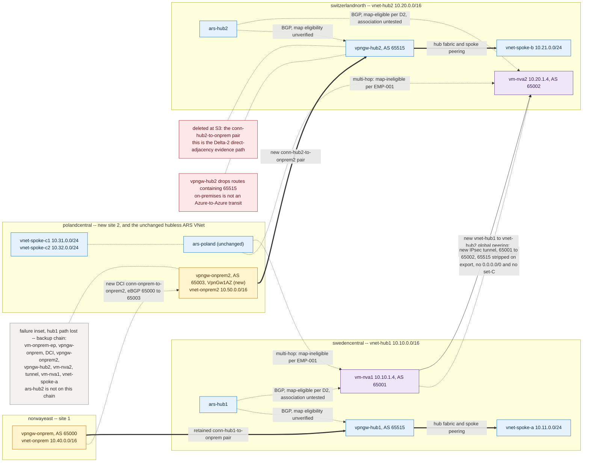

**Stage split — precise.**

| Stage | Content | Reversible? | Gate |
|---|---|---|---|
| **S0 Preflight** | Region/SKU/zone probes, cost approval, baseline archive | n/a — read-only plus two disposable PIPs | Must fully pass before S1 |
| **S1 Additive staging** | New VNet, gateway, VM, DCI pair, hub↔hub peering, tunnel, new affinity pair | Yes — delete in reverse order | Fresh cost approval |
| **S2 Route-map pre-activation experiment** | Inert-map association tests only, no topology change | Yes — detach | **Explicit user approval; may reset BGP** |
| **S3 Disruptive activation** | Delete `conn-hub2-to-onprem` / `conn-onprem-to-hub2` | Only by recreation with a fresh PSK pair | Explicit approval + complete S0 baseline |

S1 alone never reaches the bow-tie: while the hub2↔onprem1 pair still exists, onprem1 is dual-homed
and the attachment matrix is a square, not a diagonal. S2 is independent of S1 and can run first.

**Role mapping.** `vnet-onprem` (norwayeast, 10.40.0.0/16, `vpngw-onprem` AS 65000, `vm-onprem-ep`)
is retained unchanged as **onprem1 / site 1**, affiliated to hub1 (`swedencentral`). A new
**onprem2 / site 2** is affiliated to hub2 (`switzerlandnorth`).

**S0 — Poland Central gateway SKU and zone preflight gate (mandatory).** This lab has already been
bitten twice by create-time gateway failures that template validation did not catch (`deploy-log.md`
§7): `NonAzSkusNotAllowedForVPNGateway` (VpnGw1 rejected, replaced with **VpnGw1AZ**) and
`VmssVpnGatewayPublicIpsMustHaveZonesConfigured` (gateway public IPs had to be recreated with
**zones 1,2,3**). **`az deployment group validate` and `what-if` do not catch either — both fail
only at resource-create time.** The gate is therefore executed against live Azure, in this order,
and every step must pass before `vpngw-onprem2` is attempted:

1. `az account list-locations --query "[?name=='polandcentral'].availabilityZoneMappings"` — confirm
   the region reports availability zones 1, 2 and 3.
2. Create the two Standard public IPs for real, ahead of the gateway:
   `az network public-ip create -g <rg> -n pip-vpngw-onprem2-1 --sku Standard --allocation-method Static --zone 1 2 3 -l polandcentral` and the same for `-2`. A zone-related rejection surfaces here,
   cheaply and reversibly, instead of 45 minutes into a gateway create. Both PIPs are prerequisites
   anyway, so nothing is wasted.
3. Confirm parity with the three deployed gateways: `az network vnet-gateway list -g <rg> --query "[].{n:name,sku:sku.name,aa:activeActive,asn:bgpSettings.asn}"` must show `VpnGw1AZ` for all three;
   `vpngw-onprem2` uses the same SKU.
4. Only then create `vpngw-onprem2` with `--sku VpnGw1AZ`, `--gateway-type Vpn`, `--vpn-type
   RouteBased`, active-active with both zoned PIPs, `--asn 65003`. For any `*AZ` SKU the zones on the
   public IP determine where the gateway instances are placed, so the PIPs must carry 1,2,3 before
   the gateway references them (`azure/vpn-gateway/create-zone-redundant-vnet-gateway`).
5. If any step fails, stop. Do not substitute a non-AZ SKU and do not create zone-less PIPs.

**S1 — additive stage, new resources.**

| Resource | Value | Notes |
|---|---|---|
| `vnet-onprem2` | `polandcentral`, 10.50.0.0/16 | GatewaySubnet 10.50.0.0/27, snet-endpoint 10.50.1.0/27. **Must not** be peered to `vnet-poland-ars` or the set-C spokes — that would create an unintended Azure-side leak and invalidate the analogue |
| `pip-vpngw-onprem2-1/2` | Standard, Static, **zones 1,2,3** | Zone-redundant; created and validated in S0 before the gateway |
| `vpngw-onprem2` | **`VpnGw1AZ`**, active-active, BGP, **ASN 65003** | AZ SKU is mandatory (non-AZ SKUs rejected in this subscription); active-active for parity with the other three gateways |
| `vm-onprem2-ep` | `Standard_B2ts_v2`, 10.50.1.x | Site-2 endpoint for the probe matrix |
| DCI pair | `conn-onprem-to-onprem2` / `conn-onprem2-to-onprem` | V2V, BGP on, new PSK generated at deploy time |
| Hub interconnect | global VNet peering `vnet-hub1`↔`vnet-hub2` | `AllowForwardedTraffic` both sides, **no** gateway transit. Creating it perturbs ARS BGP — see the reset caution |
| Inter-region tunnel | IPsec `vm-nva1`↔`vm-nva2` over the new peering, BIRD multi-hop eBGP 65001↔65002 | Learn's multi-region pattern specifies a tunnel rather than bare peering to avoid the NVA self-next-hop loop (`azure/route-server/multiregion`) |
| Tunnel AS-path policy | `bgp_path.delete(65515)` on both NVAs toward the peer NVA | Extension of the proven Δ1 filter; without it the far Route Server drops the routes |
| New affinity pair | `conn-hub2-to-onprem2` / `conn-onprem2-to-hub2` | Same PSK model as the existing pairs |

**Exact resource ledger.**

- **Reused, unchanged:** `ars-hub1`, `ars-hub2`, `ars-poland` (all three already past the first-use
  route-map upgrade); `vpngw-hub1`, `vpngw-hub2`, `vpngw-onprem`; `vm-nva1`, `vm-nva2` (BIRD config
  extended, VMs untouched); `vnet-hub1`, `vnet-hub2`, `vnet-poland-ars`, `vnet-onprem`,
  `vnet-spoke-a`, `vnet-spoke-b`, `vnet-spoke-c1`, `vnet-spoke-c2`; `vm-hub1-ep`, `vm-hub2-ep`,
  `vm-c1-ep`, `vm-onprem-ep`; both set-A/set-B route tables; all 10 existing peerings;
  `conn-hub1-to-onprem` / `conn-onprem-to-hub1`.
- **Added:** 1 VNet, 2 subnets, 2 zoned Standard PIPs, 1 `VpnGw1AZ` gateway, 1 VM (+NIC, +disk),
  4 connection objects (DCI pair + affinity pair), 1 global peering pair, 1 IPsec tunnel between
  NVAs, BIRD policy blocks on both NVAs. PIP total rises from 9 to 11.
- **Removed at S3:** `conn-hub2-to-onprem`, `conn-onprem-to-hub2`. Nothing else.

**Tunnel import/export prefix policy — explicit, and deliberately narrow.** The tunnel must not
become a second path for anything the lab already proves. Default action is **deny**; only the rows
below are permitted. Applied on the `nva1`↔`nva2` session in both directions.

| Direction | Permit | Attributes | Deny explicitly |
|---|---|---|---|
| `nva1` → `nva2` export | 10.10.0.0/16, 10.11.0.0/24 | `bgp_path.delete(65515)` | `0.0.0.0/0`; 10.31.0.0/24; 10.32.0.0/24; 10.20.0.0/16; 10.21.0.0/24; 10.50.0.0/16 |
| `nva1` → `nva2` export (backup role) | 10.40.0.0/16 | `bgp_path.delete(65515)` + prepend 65001 ×2 | — |
| `nva2` → `nva1` export | 10.20.0.0/16, 10.21.0.0/24 | `bgp_path.delete(65515)` | `0.0.0.0/0`; 10.31.0.0/24; 10.32.0.0/24; 10.10.0.0/16; 10.11.0.0/24; 10.40.0.0/16 |
| `nva2` → `nva1` export (backup role) | 10.50.0.0/16 | `bgp_path.delete(65515)` + prepend 65002 ×2 | — |
| Both import filters | Mirror of the peer's permitted list only | unchanged | Everything else, including `0.0.0.0/0` |

Rationale — **`0.0.0.0/0` is excluded from the tunnel in both directions, unconditionally.**
`ars-poland` today learns exactly two default routes: from `peer-nva1` with AS-PATH `65001` and from
`peer-nva2` with `65002-65002-65002` (Δ3 BIRD prepend), which is what makes `vm-c1-ep` prefer NVA1
and what resolved DEF-001. If the tunnel carried `0/0`, each NVA would hold a second copy of the
default with a different AS-PATH, could re-advertise it to `ars-poland`, and the set-C default-route
experiment would gain extra copies — invalidating Δ3, the DEF-001 resolution and the S2/S3
convergence measurements. Set-C prefixes (10.31.0.0/24, 10.32.0.0/24) are excluded for the same
reason in the opposite direction: they must not re-enter `ars-poland` through the far NVA. Backup
site prefixes are permitted but prepended, so they can never tie with the direct path.

**Global-peering BGP reset caution — maintenance window required.** Creating (and later deleting) the
`vnet-hub1`↔`vnet-hub2` global peering changes the peering set of both Route Server VNets. Learn is
explicit: *"If a virtual network peering is created between your hub virtual network and spoke
virtual network, Azure Route Server performs a BGP soft reset by sending route refresh requests to
all its peered NVAs. If the NVAs don't support BGP route refresh, then Azure Route Server performs a
BGP hard reset with the peered NVAs, which might cause connectivity disruption for traffic traversing
the NVAs"* (Route Server FAQ). Both hub Route Servers and — because NVA1 and NVA2 also hold multi-hop
sessions to it — `ars-poland` are in scope. Therefore:

- Schedule a maintenance window for the peering create and for the peering delete in rollback.
- Confirm route-refresh capability per session rather than assuming it:
  `birdc show protocols all ars_hub1_0` etc., and record the negotiated capabilities.
- Capture **before**, **immediately after**, and **at +5 min**: `birdc show protocols all` on both
  NVAs (session uptime is the reset tell-tale), all Route Server learned/advertised route sets,
  `vm-c1-ep` effective routes, and a continuous ping from `vm-c1-ep` to `vm-onprem-ep` running across
  the operation so that any hard-reset traffic loss is measured rather than inferred.
- A session uptime reset on any NVA↔ARS session is a recordable event, not a failure of the design —
  but it must be observed, timed, and reported.

**Route-map candidate attachments in this lab — named.** Eligibility follows the empirically proven
locality rule (EMP-001; `.squad/decisions.md` D2): the BGP peer IP must lie inside the Route Server's
own VNet.

| Ref | Route Server | Attachment object | Eligibility status |
|---|---|---|---|
| **RM-A** | `ars-hub1` | BGP peering `peer-nva1`, peerIp 10.10.1.4 ∈ 10.10.0.0/16 | **Eligible, unassociated:** peerIp in-VNet per D2, ARS route-map tier active (upgraded 2026-08-05), inert map `rm-hub1-activate` provisioned; association never executed |
| **RM-B** | `ars-hub2` | BGP peering `peer-nva2`, peerIp 10.20.1.4 ∈ 10.20.0.0/16 | **Eligible, unassociated:** peerIp in-VNet per D2, ARS route-map tier active, inert map `rm-hub2-activate` provisioned; association never executed |
| **RM-C** | `ars-hub1` | VPN gateway connection on `vpngw-hub1` (in-VNet) | **Unverified.** Learn lists VPN gateway connections as an attachment point; this lab has never performed the association. No claim is made |
| **RM-D** | `ars-hub2` | VPN gateway connection on `vpngw-hub2` (in-VNet) | **Unverified**, as RM-C |
| **RM-X** | `ars-poland` | `peer-nva1` / `peer-nva2` | **Proven ineligible** — `HubBgpConnectionFromSpokeVnetCannotReferenceRouteMap` (EMP-001) |

**Candidate maps and explicit PASS/FAIL assertions.** None of these is created until the gate below
is cleared.

| Map | Ref | Direction | Rule | PASS | FAIL |
|---|---|---|---|---|---|
| `rm-hub1-in-nva1-backup-deprefer` | RM-A | inbound | match Route-prefix **Equals** 10.50.0.0/16 → AS-Path **Add** [64496, 64496] → Terminate | `ars-hub1 list-learned-routes --name peer-nva1` shows 10.50.0.0/16 with exactly two additional leading 64496 entries; every other prefix byte-identical to the pre-association capture; `vm-hub1-ep` effective routes unchanged; `vm-onprem-ep` still reaches `vm-c1-ep` | Any non-matching prefix altered; map `provisioningState != Succeeded`; peering state not `Succeeded`; any BIRD session uptime reset; any ping loss |
| `rm-hub2-in-nva2-backup-deprefer` | RM-B | inbound | match Equals 10.40.0.0/16 → AS-Path Add [64496, 64496] → Terminate | Mirror of the row above on `ars-hub2` / `peer-nva2`; Δ2 evidence at `ars-hub2` (10.31/10.32 as `65002-65002-65002`) unchanged | Mirror; **plus** any change to the Δ2 AS-PATHs is an immediate FAIL and rollback |
| `rm-hub1-out-vpngw1-affinity` | RM-C | outbound | match Route-prefix **Contains** 10.50.0.0/16 → **Drop** → Terminate (site 2's prefix is not offered back to site 1 over site 1's own tunnel; the DCI already carries it) | `vpngw-onprem list-learned-routes` loses 10.50.0.0/16 via hub1 only, retains it via the DCI; all four VPN connections stay `Connected` | Association rejected by the API (record exact error code and treat RM-C as unsupported); any other prefix withdrawn; any connection state change |
| `rm-hub2-in-vpngw2-admission` | RM-D | inbound | match Contains 10.50.0.0/16 → Modify (no attribute change) → Terminate; second rule: no match condition → Drop | `ars-hub2 list-learned-routes` on the gateway connection contains 10.50.0.0/16 and nothing else from that connection; set-C and spoke-b prefixes unaffected | Association rejected (record error, treat RM-D as unsupported); any prefix from a *different* connection affected; any gateway BGP peer flap |

**Mandatory pre-activation experiment stage (S2) — requires explicit user approval before it is
run.** Association is an ARM write against a live Route Server and a live BGP connection.
**Association may reset BGP**: Learn documents soft and possibly hard BGP resets for other
ARS-affecting topology operations, and no Learn statement guarantees that applying a route map is
session-preserving. This stage is therefore **not** described as zero-disruption, and it is **not
executed now**. It is the gate that decides whether US10's Azure-side route-map story is real.

- **E-1 — inert map on `ars-hub1`↔`peer-nva1` (RM-A).** Associate the **existing inert**
  `rm-hub1-activate` (match `192.0.2.0/24` Equals — RFC 5737 TEST-NET-1, which no lab prefix can
  match) inbound on `peer-nva1`, using the field path proven during the Δ3 attempt:
  `routingConfiguration.inboundRouteMap` on the ARS `bgpConnections/peer-nva1` child object,
  API version `2024-10-01`, body supplied via `az rest --body "@<file>.json"` (inline bodies fail on
  Windows PowerShell — see Tank history 2026-08-05). Capture before / immediately after / +5 min:
  ARS learned and advertised routes for both peerings, `birdc show protocols all` on NVA1 (uptime and
  last error), `az network vnet-gateway list-bgp-peer-status -n vpngw-hub1`, effective routes on
  `vm-hub1-ep` and `vm-c1-ep`, and a continuous ping across the operation.
  **PASS:** association reaches `Succeeded`; no BIRD session uptime reset; learned-route sets
  attribute-identical; zero ping loss. **PASS-with-note:** association succeeds but a session resets
  and recovers — record the outage duration; the story survives, the change class becomes
  "requires maintenance window". **FAIL:** association rejected, or routing changes despite the map
  being inert. **Rollback:** PATCH `inboundRouteMap` back to null, re-verify against the baseline.
- **E-2 — VPN gateway connection association (RM-C / RM-D).** Run only after E-1 passes, and only
  with separate approval. First establish the **actual resource/API semantics** rather than assuming
  them: enumerate what the platform itself offers as an attachable connection — the portal's
  *route maps → Apply route maps* list, and the Az.Network ≥ 8.0.0 `New-AzRouteMap` /
  `Update-AzRouteMap` `-InboundConnection` / `-OutboundConnection` parameters, which take a
  **connection resource ID** — and determine empirically which ID form is accepted for a VPN gateway
  connection (the `Microsoft.Network/connections/conn-hub1-to-onprem` resource, or an ARS-side child
  object). The Δ3 attempt proved that `associatedInboundConnections` on the route map is a read-only
  composite property and is not the write path. Associate the same inert TEST-NET map, capture the
  same before/after set plus all four VPN connection states.
  **PASS:** association `Succeeded`, inert map has zero routing effect, all four connections stay
  `Connected`. **FAIL:** the API rejects it — record the exact error code verbatim, as EMP-001 was
  recorded.
- **If RM-C/RM-D are unsupported.** **US10 is retained.** Its Azure-side route-map value is then
  reclassified from *supporting* to *supporting on ARS↔NVA peerings only — no gateway-connection
  attachment*, and the on-prem-facing admission/hygiene function moves to **NVA and CPE policy**:
  BIRD import/export filters on `vm-nva1`/`vm-nva2` in the lab, and CPE BGP policy in the generic
  bed. No route-map claim is made for that function, and §2 is updated accordingly.
- **Funding and activation gate.** **No expansion funding, no S1 resource creation and no S3
  activation proceeds until E-1 (and, for gateway-connection claims, E-2) has produced evidence.**
  Nothing in this story asserts that an unexecuted association works.

**New prefixes and ASNs.** 10.50.0.0/16 (site 2) · ASN 65003 (`vpngw-onprem2`). Unchanged: 65000
(`vpngw-onprem`), 65001 (NVA1), 65002 (NVA2), 65515 (all three hub-side gateways and all three Route
Servers). Prepend actions inside the lab use **64496**, as already established by the Δ3 activation
contract — this is a closed lab with no ExpressRoute circuit, no MSEE and no public routing, which is
the only context in which a documentation-range ASN is acceptable. It must never be carried into the
generic ExpressRoute bed. Private ASNs (65001, 65002, 65003, 65515) are never valid prepend values in
a route map.

**Active-active and public IP requirements.** `vpngw-onprem2` must be active-active with BGP, adding
2 zone-redundant Standard public IPs and bringing the lab total to 11. The hub gateways must remain
ASN 65515 and active-active: Route Server coexistence requires exactly that, so their ASN is not a
free variable (`azure/route-server/configure-route-server`; Route Server FAQ).

**Cost — current run-rate and target.** The current run-rate is approximately **$84/day**:
≈ $65.86/day deployed baseline, plus **three** route-map surcharges of ≈ $6/day — `ars-poland`
(upgraded during the failed Δ3 association) and `ars-hub1` + `ars-hub2` (upgraded 2026-08-05). All
three surcharges are irreversible without recreating the Route Server. The previously recorded
"$72/day" describes the state before the two hub upgrades and is stale.

The US10 expansion adds one `VpnGw1AZ` active-active gateway, two zone-redundant Standard public IPs,
one `Standard_B2ts_v2` VM, four connection objects and inter-region peering egress, taking the lab to
approximately **$95+/day**. This figure is a **floor, not an estimate**: the gateway line still
carries the VpnGw1 price used in the original manifest, and **the current VpnGw1AZ retail price for
`polandcentral` has not been looked up**. AZ SKUs are expected to price above their non-AZ
predecessors, so the true figure is likely higher. A current retail-price lookup for `VpnGw1AZ` in
`polandcentral` (plus the connection-object and PIP lines) must be completed and recorded before
approval; no exactness is claimed here.

Both the current $84/day and the ~$95+/day target breach the ~$50/day guardrail. The existing
$72/day waiver covers neither. **A fresh, explicit cost approval from Jose is required before any
resource is created**, and that approval must quote the looked-up VpnGw1AZ price rather than this
placeholder.

**Deployment time.** ~60–75 min for S1, dominated by the `vpngw-onprem2` long pole (30–45 min); VNet,
VM and peering under 5 min; connections ~5 min; BIRD configuration ~10 min; BGP convergence ~10 min.
S0 adds ~10 min. S2 adds ~20 min per experiment plus captures. S3 adds ~15 min of deletion plus
reconvergence, and evidence capture across all layers adds ~30 min.

**Disruption risk: high, and specific.** Deleting the hub2↔onprem1 pair removes the *direct
adjacency* on which Δ2 was measured. Set-A and set-B are unaffected. Δ1 and Δ3 are unaffected in
mechanism, but the DEF-001 return-path behaviour must be re-verified because the reachable set
changes. Capture a complete baseline at every layer before S3; that baseline is the only rollback
reference.

**Set-C behaviour after activation — corrected.** The hub2 copy of the set-C prefixes does **not**
disappear from `vpngw-onprem`. It takes a longer route: `ars-hub2` → `vpngw-hub2` →
`conn-hub2-to-onprem2` → `vpngw-onprem2` → DCI → `vpngw-onprem`. 65515 is not a loop for
`vpngw-onprem2` (65003) or `vpngw-onprem` (65000), so nothing is dropped on that path.

| Prefix / path | AS-PATH at `vpngw-onprem` today | AS-PATH at `vpngw-onprem` after S3 |
|---|---|---|
| 10.31.0.0/24 via hub1 (direct) | `65515-65001` | `65515-65001` — unchanged |
| 10.31.0.0/24 via hub2 | `65515-65002-65002-65002` (direct adjacency) | `65003-65515-65002-65002-65002` (via `vpngw-onprem2` and the DCI) |
| 10.32.0.0/24 | identical to 10.31.0.0/24 | identical to 10.31.0.0/24 |

The Δ2 comparison therefore **changes rather than disappears**: 2 ASNs versus 4 becomes 2 ASNs
versus 5. The hub1 preference is preserved and its margin widens by exactly the DCI hop (65003). The
original 4-ASN form survives one hop upstream and is captured at `vpngw-onprem2`, where the prefix
arrives as `65515-65002-65002-65002` — identical to today's hub2 form at onprem1. What is genuinely
lost is the *direct-adjacency* form of the evidence, not the evidence itself.

This is an assertion to measure, not an assumption. It depends on `vpngw-onprem2` re-advertising
routes learned on one BGP-enabled connection to its other BGP-enabled connection. The lab cannot
currently confirm that behaviour, because the reciprocal case is masked: Azure prefixes relayed
between the two hubs via onprem1 carry 65515 and are dropped at the far hub regardless. Assertions:
**PASS** — `vpngw-onprem list-learned-routes` shows both rows above, and
`vpngw-onprem2 list-learned-routes` shows the 4-ASN form. **ALT/FAIL** — no hub2 copy appears at
`vpngw-onprem`; in that case Δ2 evidence is preserved only at `vpngw-onprem2` and `ars-hub2`, and the
loss of the direct comparison is recorded explicitly rather than being discovered later.

**The same-AS constraint — the load-bearing finding.** All three hub-side Azure gateways and all
three Route Servers use ASN 65515, and route maps cannot remove it. Two consequences, in opposite
directions:

- **Works.** Site prefixes crossing the DCI stay clean. 10.40.0.0/16 originates at `vpngw-onprem`
  with AS-PATH `65000`; across the DCI it becomes `65003 65000`; `vpngw-hub2` accepts it because
  65515 is absent. Azure-to-site over the backup is equally fine: `vpngw-hub2` advertises with 65515
  in the path, `vpngw-onprem2` (65003) accepts it, and `vpngw-onprem` (65000) accepts it across the
  DCI. Both directions of the site-1 backup therefore converge. This works precisely because the
  on-prem gateways were given distinct ASNs at design time.
- **Does not work.** Azure prefixes cannot make a second Azure entry. `vpngw-onprem` learns hub1
  prefixes with 65515 in the path; re-advertised across the DCI they arrive at `vpngw-hub2` still
  carrying 65515, and `vpngw-hub2` drops them as its own ASN. The same happens at `ars-hub2`. The
  on-prem DCI therefore cannot back up the Azure inter-hub path, and no route map can change this:
  the drop occurs in loop prevention, before any inbound policy runs, and the prohibition on
  modifying reserved ASNs applies regardless.

**Recommended mitigation.** Three options, ranked:

1. **NVA-side 65515 strip on the inter-region tunnel, plus an explicit scope statement — additive,
   recommended.** Extend the proven Δ1 filter to the NVA1↔NVA2 session so the Azure inter-region path
   works, and state in the design that the on-prem DCI is a backup for *site* prefixes only, never a
   transit for Azure-to-Azure traffic. This is the same mechanism Learn prescribes for the
   multi-region Route Server pattern, where the NVA removes 65515 on advertisement
   (`azure/route-server/multiregion`), and is the sibling of the `as-override` guidance for the
   dual-homed pattern (`azure/route-server/about-dual-homed-network`). Cost of the honesty: the
   tunnel must be built redundantly, because nothing backs it up.
2. **Controlled re-origination on an on-prem-side NVA — disruptive.** A BIRD or FRR appliance
   terminating the DCI and re-originating Azure-learned prefixes with 65515 stripped would restore
   full multi-hop backup, but there is no BGP policy point between two Azure VPN gateways: reaching
   one means either adding a fourth Route Server in an on-prem VNet with branch-to-branch, or
   replacing the on-prem gateways with NVA-terminated IPsec — the design previously rejected for this
   lab. Both rebuild the on-prem side and invalidate the current S2/S3 evidence entirely.
3. **Distinct gateway ASNs — not available where it matters.** The on-prem gateways already have
   distinct ASNs, which is why option 1 works at all. The hub gateways cannot be changed: Route
   Server coexistence requires 65515. Recording this as "choose distinct ASNs at design time" is only
   actionable for gateways that do not coexist with a Route Server.

**Evidence layers and pass/fail.**

| Layer | Instrument | Steady-state PASS | Failure-case PASS |
|---|---|---|---|
| L1 gateway | `az network vnet-gateway list-learned-routes -n <gw>` on `vpngw-hub1`, `vpngw-hub2`, `vpngw-onprem`, `vpngw-onprem2`; advertised routes with `az network vnet-gateway list-advertised-routes -n <gw> --peer <peer-ip>` — **`--peer` is required**; enumerate peer IPs first with `list-bgp-peer-status` and repeat per peer, including both active-active instance peers (generic bed: `az network express-route list-route-table` per circuit and peering) | Site 1 sees Azure via hub1 with the shortest path; site 2 via hub2; no 65515-bearing route accepted at either hub gateway | Affected site's prefixes present at the peer hub gateway with the expected longer AS-PATH; withdrawal observed at the failed gateway |
| L2 Route Server | `az network routeserver peering list-learned-routes` / `list-advertised-routes` on `ars-hub1`, `ars-hub2`, `ars-poland`, per peering name | Remote-region prefixes present with the tunnel AS-PATH and no 65515; `ars-poland` still holds exactly two `0/0` copies (`65001`, `65002-65002-65002`) | Backup copies appear and are correctly de-preferred or dropped per the inbound map |
| L3 NVA RIB | `birdc show protocols all`, `birdc show route all` on `vm-nva1`, `vm-nva2`; `ip route` for the kernel FIB | Sessions Established with unbroken uptime; tunnel filters applied; 65515 strip visible; no `0/0` on the tunnel session | Route withdrawn from the failed side; tunnel copy installed |
| L4 VM effective routes | `az network nic show-effective-route-table` on `vm-hub1-ep`, `vm-hub2-ep`, `vm-c1-ep`, `vm-onprem-ep`, `vm-onprem2-ep` | Regional next hop per region; `vm-c1-ep` `0/0` still 10.10.1.4 only; no unintended ECMP | Next hop moves to the backup and returns on failback |
| L5 data-plane forensics | Simultaneous `tcpdump -nni <tunnel-if>` and `-nni <lan-if>` on **both** NVAs, filtered on the probe identity, plus `ip -s link` and `nft`/`iptables` counters before and after each run | Forward and reply observed on the matching interface pair at both NVAs; counters increment symmetrically | Backup path visible in captures at both NVAs; one-sided counter growth is a FAIL |
| L6 reachability | `az vm run-command` ping matrix, all five endpoints, both directions | Full mesh where intended | Reachability restored within the window |
| L7 traceroute | Same matrix — **secondary, indicative only** | Consistent with L5 | Never used alone to assert symmetry or path |
| L8 timing | Timestamped polls at 30 / 60 / 120 / 180 s | — | Failover ≤180 s (BGP hold), failback ≤90 s, each direction measured independently |

Every layer must be captured **before** S3. A failure observed in only one direction is a FAIL, not a
partial PASS — one-directional convergence is the characteristic defect of this topology and the
whole point of measuring it.

**Rollback sequencing.** 1) Detach any route maps (`inboundRouteMap` / `outboundRouteMap` → null) —
non-destructive and independently reversible; note that the ARS route-map tier and its surcharge do
not revert. 2) Restore both NVAs' BIRD configuration from version control, remove the tunnel policy
blocks, and confirm session state and uptime. 3) Delete `conn-hub2-to-onprem2` and
`conn-onprem2-to-hub2`. 4) Recreate `conn-hub2-to-onprem` and `conn-onprem-to-hub2` with a fresh
matching PSK set on both halves — the archived PSK is preferable, but a fresh matching pair is
functionally equivalent and is the proven recovery path when the key vault is unreachable (DEV-001).
5) Confirm Δ2 evidence has returned at `vpngw-onprem` in its original direct-adjacency form
(`65515-65001` versus `65515-65002-65002-65002`). 6) Delete the DCI pair. 7) Tear down the IPsec
tunnel, then remove the `vnet-hub1`↔`vnet-hub2` global peering **inside a maintenance window**, with
the same before/after ARS and BIRD captures as the create, because the delete can trigger the same
BGP soft or hard reset. 8) Delete `vpngw-onprem2`, then `vm-onprem2-ep`, then `vnet-onprem2`, then
the two zoned public IPs. 9) Re-run the full L1–L6 capture and diff against the pre-change baseline.
Steps 1–5 restore service; 6–8 restore cost; step 9 closes the change.

**Diagram specification.** Two diagrams — one topology carrying both the generic bed and the lab
analogue would be unreadable at the density this story requires. **Edge-weight convention, mandatory
in both:** *thick solid* = data plane (packets); *thin* = BGP control plane; *dashed* = tunnel or
overlay carried over an underlay; *thin dotted* = ARS control-plane sessions. **No Route Server may
appear on a thick edge, in any state or inset.**

**Diagram `US10-bow-tie-generic-er`.** Nodes — `dc-1`, `cpe-1`, `er-1`, `ergw-1`, `hub-1`, `ars-1`,
`nva-1`, `spoke-1a`, `spoke-1b`; `dc-2`, `cpe-2`, `er-2`, `ergw-2`, `hub-2`, `ars-2`, `nva-2`,
`spoke-2a`, `spoke-2b`. Groups — three columns: on-premises (two site boxes), ExpressRoute /
Microsoft edge (two circuit boxes labelled `AS 12076`), Azure (two region boxes R1 and R2).
**Thick data-plane edges** — `dc-1`↔`cpe-1`↔`er-1`↔`ergw-1`↔`hub-1` labelled `private peering · site
10.8.0.0/16 · AS 64500`; the mirror `dc-2`↔`cpe-2`↔`er-2`↔`ergw-2`↔`hub-2` labelled `site
10.9.0.0/16 · AS 64501`; `spoke-1a`/`spoke-1b`↔`hub-1` and `spoke-2a`/`spoke-2b`↔`hub-2` VNet
peerings; `hub-1`↔`nva-1` and `hub-2`↔`nva-2`. **Thick dashed** — `nva-1`↔`nva-2` tunnel labelled
`IPsec/VXLAN over global peering · eBGP 64496↔64497 · 65515 stripped on export`; `cpe-1`↔`cpe-2`
labelled `DCI eBGP 64500↔64501`. **Thin control-plane edges** — `ars-1`↔`nva-1`, `ars-2`↔`nva-2`,
`ars-1`↔`ergw-1`, `ars-2`↔`ergw-2`, each labelled `BGP only · map-eligible`; `ars-1` and `ars-2` must
be drawn *beside* their hub, never in-line between two forwarding nodes, with a caption `control
plane only — forwards no packets`. Two ghosted red-crossed edges show what the design excludes:
`cpe-1`⇢`er-2` and `cpe-2`⇢`er-1`, annotated `no cross-connection`. Highlighted policy points —
inbound map on `ars-1`←`ergw-1`: `drop non-DC1 prefixes · AS-PATH add on 10.9.0.0/16`; outbound map
on `ars-1`→`ergw-1`: `R1 normal · R2 prepended with the enterprise's own public ASN + community`,
with a footnote `documentation ASNs 64496–64511 must never appear here`; mirrored pair on `ars-2`.
States — **Before / normal:** bold in-region thick arrows, greyed cross-region ones, one bold
`dc-1`↔`dc-2` DCI arrow. **Failure inset F1:** `er-1` struck through; the bold thick path is
`dc-1`→`cpe-1`→DCI→`cpe-2`→`er-2`→`ergw-2`→`nva-2`→tunnel→`nva-1`→`spoke-1a` — no Route Server on
this chain — with a callout `both directions must converge`. **Failure inset F4:** the tunnel struck
through, with a red annotation `on-prem cannot substitute — 65515 / 12076 loop prevention` and a
second annotation `shared dependency: F1/F2 backups fail with it`.

**Diagram `US10-bow-tie-lab-vpn-analogue`.** Nodes — `vnet-onprem` (`vpngw-onprem` AS 65000,
`vm-onprem-ep`, 10.40.0.0/16); `vnet-onprem2` (`vpngw-onprem2` AS 65003 `VpnGw1AZ`, `vm-onprem2-ep`,
10.50.0.0/16); `vnet-hub1` (`vpngw-hub1` 65515, `ars-hub1`, `vm-nva1` 65001, 10.10.0.0/16);
`vnet-hub2` (`vpngw-hub2` 65515, `ars-hub2`, `vm-nva2` 65002, 10.20.0.0/16); `vnet-spoke-a`
10.11.0.0/24; `vnet-spoke-b` 10.21.0.0/24; `vnet-poland-ars` (`ars-poland`) with `vnet-spoke-c1`
10.31.0.0/24 and `vnet-spoke-c2` 10.32.0.0/24. Groups — four region boxes: `norwayeast` (site 1),
`polandcentral` (site 2 **and**, visually separated, the hubless ARS VNet with its spokes),
`swedencentral` (hub1), `switzerlandnorth` (hub2). **Thick data-plane edges** — retained
`conn-hub1-to-onprem` pair; **new** `conn-hub2-to-onprem2` pair in green; spoke-to-hub and
set-C-to-hub VNet peerings; gateway↔NVA links inside each hub. **Thick dashed** — **new** DCI
`conn-onprem-to-onprem2` pair, green, labelled `eBGP 65000↔65003`; **new** `vm-nva1`↔`vm-nva2` IPsec
tunnel riding the **new** `vnet-hub1`↔`vnet-hub2` global peering, green, labelled `65001↔65002 ·
bgp_path.delete(65515) · no 0.0.0.0/0, no set-C`. **Thin control-plane edges** — `ars-hub1`↔`vm-nva1`
and `ars-hub2`↔`vm-nva2` labelled `BGP · map-eligible (D2) · association untested`; `ars-hub1`↔`vpngw-hub1` and
`ars-hub2`↔`vpngw-hub2` labelled `BGP · map eligibility unverified`; the existing multi-hop
`vm-nva1`/`vm-nva2`↔`ars-poland` sessions thin dotted, labelled `BGP · map-ineligible (EMP-001)`.
**Removed** — `conn-hub2-to-onprem` pair drawn in red strike-through, labelled `deleted at S3 — Δ2
direct-adjacency evidence path`. Annotations — a red box on `vpngw-hub2` reading `drops routes
containing 65515 · on-prem is not an Azure-to-Azure transit`, with an arrow from the DCI; a note on
each Route Server reading `control plane only — forwards no packets`; a note on the new global
peering reading `create/delete triggers ARS BGP soft reset (hard reset if no route refresh) —
maintenance window`. States — **Before:** current topology, both hubs connected to the single
on-prem, Δ2 prepend labelled on the hub2 path as `65515-65002-65002-65002`. **After:** diagonal
attachment, new site 2, tunnel and DCI present, red-struck hub2↔onprem1 edges, and the relabelled
set-C path at `vpngw-onprem` reading `65003-65515-65002-65002-65002 (via onprem2 + DCI)` beside the
unchanged `65515-65001`. **Failure inset (hub1 path lost):** bold thick backup
`vm-onprem-ep`→`vpngw-onprem`→DCI→`vpngw-onprem2`→`vpngw-hub2`→`vm-nva2`→tunnel→`vm-nva1`→
`vnet-spoke-a` — `ars-hub2` is **not** on this chain and must not be drawn on it.

---

### US11 — Cross-region reachability without an NVA-to-NVA overlay

**Stable ID.** `US11-hub-to-hub-without-nva-overlay`

**Story.** As a platform owner who already runs two regional hubs, I want a small, named set of
cross-region flows to just work — using the connectivity Azure gives me natively — without standing
up, securing, monitoring and being paged for a second routing fabric that exists only to carry those
flows, so that the effort I spend on the network stays proportional to what the applications
actually need.

**Intent.**
- **Why this need exists** — Most real cross-region requirements are far narrower than the
  architecture diagrams that get drawn for them: a shared-services estate (AD, DNS, patching,
  monitoring, a CI runner) that both regions consume; a DR replication pair; one analytics job
  reading one database in the other region. The prefix set is small, it is known by name, and it
  changes on a change-request cadence, not continuously. An encapsulated NVA-to-NVA overlay answers
  that need by adding an HA NVA pair per region, tunnel and BGP monitoring, prefix filters, AS-path
  hygiene, MTU/MSS management and a new shared failure domain — permanently, and usually with a
  smaller on-call team than the one that built it. Teams also inherit overlays from reference
  architectures without ever checking whether their own requirement is the one the reference was
  solving.
- **Desired user outcome** — The application teams that need cross-region reachability get it, with
  the same operational model as any other VNet-to-VNet connectivity, and the platform team has
  nothing new to run. When something breaks, the diagnosis is "is the peering there and does the
  effective route table say what I expect", not "which of the tunnel, the BGP session, the prefix
  filter, the AS-path rewrite or the MSS clamp is wrong today".
- **When this story does not apply** — When the cross-region requirement genuinely needs dynamic
  behaviour: prefixes that churn, automatic withdrawal on failure (US10's ExpressRoute backup is the
  canonical example), BGP attributes or communities carried end to end, overlapping address space
  needing NAT, multi-tenant routing-domain isolation, or so many workload pairs that direct peerings
  become an N² management problem. The decision threshold below makes those conditions testable
  rather than rhetorical. This story is also not a security control: choosing native peering over an
  overlay says nothing about who may talk to whom — NSGs, Azure Firewall and application controls
  still decide that.

**Topology.** Generic and deliberately minimal. Region R1 — `hub-1` 10.1.0.0/16 with `ars-1` and
`nva-1` 10.1.1.4; spokes `spoke-1a` 10.1.16.0/24, `spoke-1b` 10.1.17.0/24; shared services
`svc-1` 10.1.240.0/24 inside `hub-1`. Region R2 — `hub-2` 10.2.0.0/16 with `ars-2` and `nva-2`
10.2.1.4; spokes `spoke-2a` 10.2.16.0/24, `spoke-2b` 10.2.17.0/24. Each region already has whatever
hybrid attachment it needs; that attachment is out of scope here. **No `nva-1`↔`nva-2` tunnel and no
`nva-1`↔`nva-2` BGP session exists in any variant of this story.**

**Objective.** The named cross-region flows work, are visible in effective route tables, and are
provably *not* accompanied by any change to either Route Server's BGP state.

**Figure — `US11-no-overlay-native-peering` (variant A): one hub-to-hub peering, hub address space only.**
*What to look for:* one native edge carries hub address space, and the three annotations name exactly
what does **not** cross it — there is no tunnel and no NVA-to-NVA BGP session anywhere in the figure.

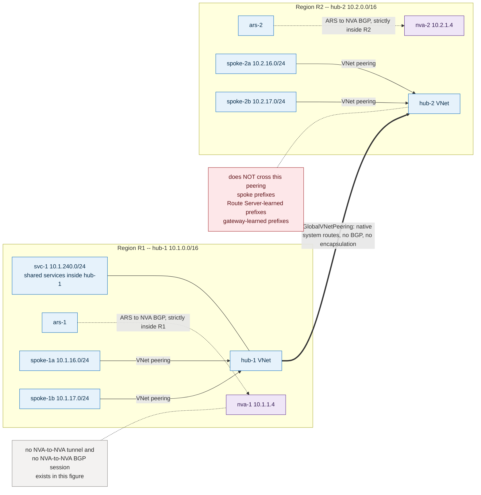

*Current-lab note (not drawn):* the additive form is `vnet-hub1`↔`vnet-hub2`.

**Figure — `US11-no-overlay-direct-workloads` (variant B): the hub hop removed entirely.**
*What to look for:* the cross-region edge deliberately bypasses both hub boxes, and the route panel
shows the more specific prefix beating the `0.0.0.0/0` UDR — this flow is intentionally uninspected.

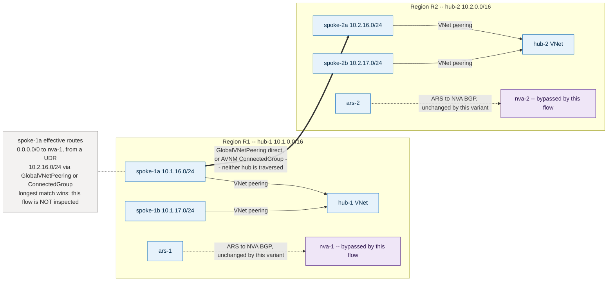

*Current-lab note (not drawn):* the additive form is `vnet-spoke-a`↔`vnet-spoke-b`.

**Figure — `US11-no-overlay-static-nva-transit` (variant C — to be demonstrated, not supported-by-claim).**
*What to look for:* a five-hop native chain with no encapsulation anywhere; the only new objects are
two UDR badges on the NVA subnets, and a spoke UDR may never point at the remote NVA because peering
is not transitive.

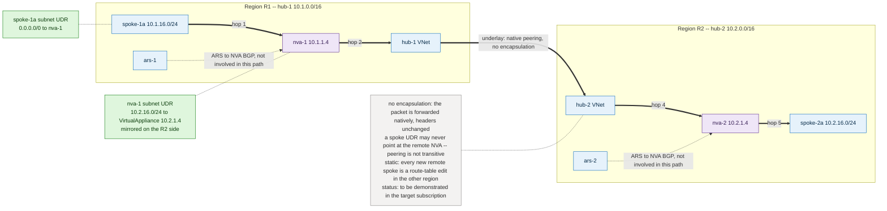

*Current-lab note (not drawn):* the NVA subnets are `snet-nva` 10.10.1.0/27 and 10.20.1.0/27.

#### The three variants — related, not interchangeable

| | A — native hub peering | B — direct workload connectivity | C — bounded static NVA transit |
|---|---|---|---|
| **What is connected** | `hub-1` ↔ `hub-2` address spaces only | Named spoke VNets in R1 ↔ named spoke VNets in R2 | Named remote prefixes, forwarded through both hub NVAs |
| **Mechanism** | One global VNet peering pair | Direct spoke↔spoke global peerings, **or** AVNM connectivity configuration (mesh with global mesh, or hub-and-spoke with *direct connectivity* + *enable mesh connectivity across regions*) | Global hub peering as underlay + explicit UDRs with next hop **Virtual appliance** = the *remote* NVA's IP, on each NVA subnet |
| **Routing** | Native system routes, next-hop type `GlobalVNetPeering` | Next-hop type `GlobalVNetPeering` (direct peering) or `ConnectedGroup` (AVNM mesh) | UDR overrides; no BGP involvement at all |
| **Traffic inspected by an NVA?** | No | No — this is the point; it removes the hub hop | Yes, by both NVAs |
| **Scales by** | Nothing to scale — one object | Number of workload pairs (N² if every pair must talk) | Number of remote prefixes, maintained by hand or by AVNM UDR management |
| **Use when** | The cross-region need is shared services that live *in* the hub | Two named workload estates must talk and inspection is not required | Inspection, logging or policy on the cross-region path is required, and the prefix set is small and stable |
| **Status** | Supported, GA | Direct peering GA; AVNM connectivity configurations GA (vWAN-hub-as-hub and high-scale connected groups are separately gated) | Documented by Learn as the alternative to overlay tunnels; **must be proven in the target subscription before being relied on** |

**Variant A — hub-address-space / shared-services reachability.** One global VNet peering pair between
`hub-1` and `hub-2`. Both hubs immediately learn each other's *own* address space as system routes and
resources in `svc-1` and in `hub-2`'s subnets can talk. Set `AllowForwardedTraffic` if anything on
either side will forward on behalf of another IP; leave `AllowGatewayTransit` and `UseRemoteGateways`
**false** on both sides — neither hub can use the other's gateway, because a VNet using a remote
gateway may not have its own, and both hubs have one.

**Variant B — workload-to-workload without hub transit.** Peer the specific spoke VNets that must
talk, or put them in an AVNM network group and apply a connectivity configuration. Learn is explicit
about why this exists: direct connectivity "improves performance by removing the extra hop through
the hub virtual network", and a mesh/direct-connectivity group is regional by default with global
mesh as an opt-in. Note two AVNM behaviours that matter: mesh members appear as next-hop type
`ConnectedGroup` rather than as peerings, and overlapping address space in a mesh is silently removed
from the mesh rather than rejected. Where a spoke subnet already carries a `0.0.0.0/0` → local-NVA
UDR, the new, more specific cross-region prefix wins by longest-prefix match, which is exactly the
intended "bypass the hub for this one pair" outcome — and is also the thing to check before assuming
egress inspection still covers the flow.

**Variant C — bounded static NVA transit.** Keep variant A's peering as the **underlay**. Then, on
each hub's NVA subnet, program explicit UDRs for the *remote region's spoke prefixes* with next hop
type **Virtual appliance** and the **remote** NVA's private IP as the next-hop address. Learn permits
this shape — "virtual network peering enables the next hop in a UDR to be the IP address of a virtual
machine in the peered virtual network" — subject to the hard rule that "a next hop private IP address
must have direct connectivity without having to route through an Azure ExpressRoute gateway or
through Azure Virtual WAN". Six constraints, stated rather than assumed:

1. **Direct connectivity is not transitive.** A spoke's UDR may only point at its *local* hub's NVA;
   it may not point at the remote NVA, because spoke↔remote-hub connectivity does not exist. The
   remote NVA is only a legal next hop *from the local NVA's subnet*, which is directly peered.
2. **Cover the remote spoke prefixes, not the remote hub supernet.** A UDR whose destination contains
   the next-hop address itself (e.g. 10.2.0.0/16 → 10.2.1.4) is a recursion the platform is not
   documented to resolve. Use the remote spoke prefixes and let the peering system route carry
   hub-to-hub traffic.
3. **BGP propagation on the NVA subnets.** Learn's UDR-based alternative says to disable it. In a
   brownfield hub that also carries ExpressRoute/VPN-learned routes, disabling propagation on the NVA
   subnet removes those too — prefer *targeted* UDRs (which already win over BGP) and treat blanket
   `disableBgpRoutePropagation` as a separate, deliberately assessed change.
4. **Next hop type `VirtualNetworkGateway` is unavailable in a Route Server hub.** Learn: that
   next-hop type is supported "only when the Virtual Network's gateway is a VPN gateway (and not
   ExpressRoute, RouteServer or Virtual WAN hub router)", and "if RouteServer is deployed in a virtual
   network, RouteServer is set as the Virtual Network's gateway". Variant C must therefore use
   `VirtualAppliance` with an explicit IP.
5. **NVA HA changes the next-hop address.** If the NVAs sit behind an internal load balancer, the
   next hop is the ILB frontend — and a **Basic** internal load balancer frontend is unreachable
   across global peering. Standard SKU only.
6. **It is static.** Every new remote spoke is a route-table change in the other region. AVNM UDR
   management is the supported way to keep that consistent at scale, and it lists
   "cross-hub and spoke network via network virtual appliances in each hub" as a target scenario.

**Why global hub peering alone is not transit.** This is the single most common misreading and it
causes all three of the following to be expected when none of them happen:

- **Attached spoke prefixes do not cross.** "Virtual network peering or connected groups are
  nontransitive relationships between virtual networks" (`azure/architecture` hub-spoke guidance).
  `hub-1`↔`hub-2` gives each hub the other hub's *own* address space and nothing that is peered
  behind it. `spoke-1a` does not learn `spoke-2a`, and `hub-1` does not learn `spoke-2a` either.
- **Route Server-learned prefixes do not cross.** Route Server is a VNet-local control plane. It
  advertises into peered VNets only where the peer enabled *Use the remote virtual network's gateway
  or Route Server* — which a hub with its own gateway and Route Server cannot enable. The FAQ answers
  the hub-to-hub case directly: *"Can I peer two Azure Route Servers in two peered virtual networks
  and enable the NVAs connected to the Route Servers to talk to each other? No, Azure Route Server
  doesn't forward data traffic. To enable transit connectivity through the NVA, set up a direct
  connection (for example, an IPsec tunnel) between the NVAs and use the Route Servers for dynamic
  route propagation."* That sentence is simultaneously the reason US11 exists (the Route Server is
  not the missing piece) and the reason US10 keeps its overlay (dynamic NVA transit needs one).
- **Gateway-learned on-premises prefixes do not cross.** Nothing an ER or VPN gateway learned in R1
  is offered to R2 over a plain hub peering. Cross-region hybrid reachability is a different problem
  and is not in this story's scope.
- **Route Server is never a data-plane hop.** *"The data traffic goes directly from the NVA to the
  destination virtual machine and directly from the VM to the NVA"* (Route Server FAQ). No variant of
  US11 puts a Route Server on a forwarding path, and neither should any diagram.

**Decision threshold — when to leave US11 for a dynamic NVA BGP/tunnel design.** Move only when one
of these is true and *stated as a requirement*, with the trigger written down:

| Trigger | Concrete threshold | Why US11 stops working |
|---|---|---|
| Route churn / scale | Remote prefix set changes more often than your change process can absorb, or exceeds roughly a few dozen entries per route table | Variant C's UDRs must be edited in the *other* region every time; drift becomes the failure mode |
| Automatic convergence | A failure must be withdrawn and re-advertised without human or automation intervention | A static route cannot withdraw itself; a peering has no liveness signal to react to |
| Policy attributes | AS-PATH length, communities or LOCAL_PREF must survive across the regional boundary | Native peering carries no attributes at all; there is nothing to shape |
| Overlapping address space | The two regions cannot be made unique | The fabric cannot forward duplicate prefixes; only an encapsulated NAT-capable device can |
| Multi-tenant isolation | Separate routing domains, per-tenant RIBs, or per-tenant policy on the cross-region path | One flat VNet fabric cannot express more than one routing domain |
| N² peering avoidance | The number of workload pairs makes direct peering unmanageable, and AVNM connected groups do not cover the shape | Variant B's management cost grows with pairs; a routed core grows with sites |

An overlay must solve one of the rows above. Being present in a reference architecture is not a row.

**Maps solve.** Very little, and that is the honest answer. Where a hub Route Server already has
eligible local connections — an ARS↔NVA BGP peering or an ARS↔ER/VPN gateway connection in its own
VNet — maps can still govern *those* routes: an inbound map can stop an unwanted copy of a remote
region's prefix being installed and programmed, and an outbound map on `ars-1`→`gw-1` can stop the
remote region's prefixes being offered to on-premises. That is route hygiene around US11, not US11's
mechanism.

**Maps do not solve.** Everything that makes this story work. Maps cannot create a peering or a
connected group (lever D). They cannot cause any route to cross a global VNet peering — there is no
BGP session there and no attachment object for a VNet peering. They cannot modify or filter the VNet
address space a Route Server advertises natively, which is precisely the advertisement variant A
relies on. They cannot influence a UDR, so they have **no role at all** in variant C's forwarding
decision, and no role at all in variants A and B, which contain no BGP. And no map can make a Route
Server forward a packet.

**Alternatives.** **Direct global VNet peering** — the baseline, GA, no additional resource.
**AVNM connectivity configurations** — mesh (regional by default, global mesh opt-in) and
hub-and-spoke with direct connectivity, both GA; note that the vWAN-hub-as-hub option is in preview
and high-scale connected groups require preview-feature registration, so do not assume either.
**AVNM routing configurations (UDR management)** — the supported way to keep variant C's static
routes consistent across many subnets, including `UseExisting` mode against your own route tables
(API 2025-01-01 or later). **Virtual WAN** — managed inter-hub routing and routing intent; the right
answer when inter-region transit *with* inspection is a standing requirement and nobody wants to own
NVA lifecycle, at the cost of replacing the Route Server construct. **Static UDRs alone** — variant
C. **Application-layer and Private Link patterns** — when the requirement is access to a *service*
rather than reachability to a *network*: "the private-link resource can be deployed in a different
region than the one for the virtual network and private endpoint", so a private endpoint in R1 can
front a service in R2 with no inter-region VNet connectivity at all; an application gateway, API
front door or message broker does the same for custom services. This is frequently the correct answer
and is almost never the one proposed.

**Current lab applicability — `testable with additive expansion`.** Three prospective tests, ordered
smallest-first. **Nothing below is deployed; this is a proposal.**

*Test 1 — native hub peering (recommended first experiment for the whole catalogue).*
Create the global peering pair `vnet-hub1` (10.10.0.0/16, swedencentral) ↔ `vnet-hub2`
(10.20.0.0/16, switzerlandnorth): `AllowVirtualNetworkAccess=true` both directions,
`AllowForwardedTraffic=true` both directions, `AllowGatewayTransit=false` and
`UseRemoteGateways=false` **both directions** (neither hub may use the other's gateway; both already
have one). No route, UDR, NSG or BIRD change. **Probe endpoints — corrected 2026-08-05.** There is
**no VM in either hub's `snet-endpoint`** (10.10.2.0/27 and 10.20.2.0/27 exist but are empty; the
deployed `vm-hub1-ep` 10.11.0.x and `vm-hub2-ep` 10.21.0.x live in `vnet-spoke-a` / `vnet-spoke-b`
`snet-workload`, and a spoke prefix does **not** cross a plain hub↔hub peering, so those two VMs
cannot prove this test). Anchor the hub-address-space probe on the two existing hub-resident VMs
instead: **`vm-nva1` 10.10.1.4 ↔ `vm-nva2` 10.20.1.4**, both inside their hub's own address space and
therefore exactly the prefixes a global hub peering carries. Prerequisites and safety are listed in
US12's *Side S-B — variant N* subsection (NSG allowances, ICMP/TCP-22 only, read-only BIRD handling)
and apply here unchanged.
*Expected BGP non-effects, which are the actual point of the test:* `ars-hub1` and `ars-hub2` learned
and advertised route sets unchanged; 10.20.0.0/16 must **not** appear in `vpngw-hub1`'s advertised
routes toward on-premises, and the mirror; `ars-poland`'s two `0/0` copies (`65001`,
`65002-65002-65002`) unchanged; set-C spoke effective route tables unchanged.
*Maintenance / reset caveat:* creating a VNet peering on a VNet that hosts a Route Server makes that
Route Server issue a route refresh to all peered NVAs — a soft reset if the NVA supports RFC 2918
route refresh, otherwise a **hard** reset with traffic disruption through the NVA (Route Server FAQ).
Confirm BIRD's route-refresh capability in `birdc show protocols all` *before* the change, and treat
this as a change window on both hubs, not a no-op.
*Cost delta:* no hourly charge for a peering; inter-region peering data transfer is billed per GB in
both directions — negligible at probe volumes, but confirm current
swedencentral↔switzerlandnorth rates before any sustained test. *Deployment:* under 5 minutes for
both directions. *Rollback:* delete both peering objects — same reset caveat applies again, so roll
back in a window too.

*Test 2 — direct workload connectivity, smallest defensible form.* Peer `vnet-spoke-a`
(10.11.0.0/24, swedencentral) ↔ `vnet-spoke-b` (10.21.0.0/24, switzerlandnorth) directly, all four
transit flags false. This is the smallest possible variant-B proof: two VNets, no new resource type,
no manager instance. Expected effect: each workload subnet gains a `GlobalVNetPeering` route for the
other /24 which, being more specific, wins over the existing `0.0.0.0/0`→NVA UDR — so the flow
bypasses both NVAs by design, and that bypass must be acknowledged before the test rather than
discovered after it. Expected BGP non-effects: none of the three Route Servers changes at all, and
BGP propagation is already off on both workload subnets. AVNM is the scale alternative but is a
larger first step — a Network Manager instance, a network group, a connectivity configuration and a
deployment — so it belongs after test 2 succeeds, not instead of it. *Cost:* inter-region data
transfer only. *Deployment:* under 5 minutes. *Rollback:* delete the peering pair; the pre-existing
`0/0`→NVA UDR resumes carrying the flow.

*Test 3 — bounded static NVA transit (optional, conditional on test 1, explicitly reversible).*
Only after test 1 exists and test 2 has been rolled back (otherwise the direct peering wins by
longest match and there is nothing to observe). Add one route table per NVA subnet:
on `snet-nva` in `vnet-hub1` (10.10.1.0/27) → `10.21.0.0/24` next hop **Virtual appliance**
`10.20.1.4`; on `snet-nva` in `vnet-hub2` (10.20.1.0/27) → `10.11.0.0/24` next hop **Virtual
appliance** `10.10.1.4`. Do **not** disable BGP route propagation on either NVA subnet — those
subnets carry ARS-injected on-premises routes that existing proven flows depend on, and targeted UDRs
already win over BGP. `vnet-spoke-a` and `vnet-spoke-b` need no change: their existing `0/0`→local-NVA
UDR already delivers the packet to the local NVA. This is the one variant whose exact next-hop shape
is **not** claimed to work — global peering plus `VirtualAppliance` next hop plus a two-NVA hairpin is
a combination to demonstrate, and the deliverable of test 3 is the demonstration, not the assertion.
*Cost:* route tables are free; data transfer only. *Deployment:* ~5 minutes. *Rollback:* dissociate
and delete the two route tables; nothing else is touched.

**Evidence.** Traceroute is not accepted as proof in any of the three tests.

| # | Instrument | What it proves |
|---|---|---|
| E1 | `az network vnet peering list` / `show` — `peeringState`, `peeringSyncLevel`, and the four transit flags on **both** sides | The peering exists, is `Connected`, is `FullyInSync`, and is not silently granting gateway transit |
| E2 | `az network nic show-effective-route-table` on every endpoint NIC in scope, captured **before and after** | The exact next-hop type appears (`GlobalVNetPeering`, `ConnectedGroup`, or `VirtualAppliance` with the expected IP) and nothing else changed |
| E3 | Network Watcher **next hop** (`az network watcher show-next-hop`) source→destination for each tested pair, both directions | Platform-authoritative forwarding decision per direction; the primary proof for variant C's legality — an unsupported next hop surfaces here, not as a silent drop |
| E4 | Network Watcher **connectivity check** (`az network watcher test-connectivity`) plus a bidirectional ping/TCP matrix | Reachability with per-hop status, both directions |
| E5 | `az network routeserver peering list-learned-routes` and `list-advertised-routes` on `ars-hub1`, `ars-hub2`, `ars-poland`, per peering name, **before and after** and diffed | The required **non**-effect: no route crossed the peering, no BGP state changed, no route was gained or lost |
| E6 | `az network vnet-gateway list-learned-routes` and `list-advertised-routes --peer <ip>` per gateway instance | The remote hub's address space did **not** leak into on-premises advertisements |
| E7 | Variant C only — NVA interface and firewall counters at **both** NVAs (`ip -s link`, `nft list ruleset` / `iptables -vnL`) before and after, plus `tcpdump` on the LAN interface filtered on the probe identity | Both NVAs actually forwarded the packet and the reply; one-sided counter growth is a FAIL |
| E8 | `birdc show protocols all` on both NVAs, before and after | BGP sessions kept their uptime — i.e. the peering creation caused a soft refresh, not a hard reset |

PASS — the named flow works in both directions; E2/E3 show the expected next hop and only the
expected next hop; E5/E6/E8 are byte-comparable to the pre-change capture except for the additions
the test intended; variant C shows matching forward and reverse counters at both NVAs. FAIL — any
Route Server route set changes, any gateway advertisement changes, a BGP session resets hard, a
variant-C UDR is reported invalid or produces an unexpected next hop, traffic is delivered in one
direction only, or an existing lab flow (Δ1/Δ2/Δ3 evidence, set-C `0/0` selection) is perturbed.

**Rollback.** Every test is a delete of the objects it created, in reverse order: route tables first
(test 3), then the spoke peering pair (test 2), then the hub peering pair (test 1). Re-capture E2,
E5, E6 and E8 after each removal and diff against the pre-change baseline; the peering deletions
carry the same Route Server refresh caveat as their creation.

**Diagram `US11-no-overlay-native-peering`.** Nodes `hub-1` (`ars-1`, `nva-1`, `svc-1`), `spoke-1a`,
`spoke-1b`, `hub-2` (`ars-2`, `nva-2`), `spoke-2a`, `spoke-2b`; groups R1 / R2 region boxes. **Thick
solid** = data plane: hub↔spoke peerings in each region, and `hub-1`↔`hub-2` global peering labelled
`GlobalVNetPeering — native system routes, no BGP, no encapsulation`. **Thin dotted** = ARS↔NVA
control plane, each strictly inside its own region box. Highlight: a green check on the
`svc-1`↔`hub-2` flow, and three red ✗ annotations on the hub↔hub edge reading `spoke prefixes do not
cross`, `Route Server-learned prefixes do not cross`, `gateway-learned prefixes do not cross`. A
callout states `no NVA-to-NVA tunnel and no NVA-to-NVA BGP session exists in this diagram`. Before —
two isolated region boxes. After — one hub↔hub edge, with the three ✗ annotations unchanged.
*Caption note:* current-lab form is `vnet-hub1`↔`vnet-hub2`; do not draw the lab in the figure.

**Diagram `US11-no-overlay-direct-workloads`.** Same node set. **Thick solid** = data plane;
draw `spoke-1a`↔`spoke-2a` as a direct cross-region edge labelled `GlobalVNetPeering (direct) or
AVNM ConnectedGroup`, deliberately **not** passing through either hub box, with the hub NVAs greyed
to show they are bypassed. Add a small route-table panel on `spoke-1a` showing `0.0.0.0/0 → nva-1
(UDR)` above `10.2.16.0/24 → GlobalVNetPeering`, annotated `longest match wins — this flow is not
inspected`. Before — cross-region traffic hairpinning to `nva-1` and dying. After — the direct edge
with the greyed NVAs and the route-table panel. *Caption note:* current-lab form is
`vnet-spoke-a`↔`vnet-spoke-b`.

**Diagram `US11-no-overlay-static-nva-transit`** *(conditional — variant C; publish marked
"to be demonstrated", not "supported")*. Same node set. **Thick solid** data-plane path drawn as an
explicit five-hop chain `spoke-1a → nva-1 → hub-1↔hub-2 global peering → nva-2 → spoke-2a`, with the
hub↔hub edge labelled `underlay — native peering, no encapsulation`. Two UDR badges: on `spoke-1a`
`0.0.0.0/0 → nva-1`, and on `nva-1`'s subnet `10.2.16.0/24 → VirtualAppliance 10.2.1.4`, mirrored on
the R2 side. **Thin dotted** ARS↔NVA edges stay inside their region boxes and must not touch the
data-plane chain. Callouts: `no encapsulation — the packet is forwarded natively, headers unchanged`;
`a spoke UDR may never point at the remote NVA — peering is not transitive`; `static: every new
remote spoke is a route-table edit in the other region`. Before — the underlay present but the NVA
subnet holding no route to the remote spoke. After — the two UDR badges and the completed chain.
*Caption note:* current-lab form uses `snet-nva` 10.10.1.0/27 and 10.20.1.0/27.

---

### US12 — Square hybrid connectivity: regional DC-to-hub attachment with no diagonals

**Stable ID.** `US12-square-hybrid-connectivity`

**Story.** As a hybrid connectivity owner with two data centres and two Azure regions, I want the
hybrid attachment matrix to be a **square** — each data centre connected only to its own regional
Azure hub, the two data centres connected to each other, and the two Azure hubs connected to each
other — so that I buy and operate two hybrid circuits instead of four, each region and its paired
data centre remain an independent operating domain, and cross-region connectivity is delivered by the
two sides that already exist rather than by a diagonal I would otherwise have to fund, contract and
keep in policy sync.

**Intent.**
- **Why this need exists** — Four separate drivers converge on the same shape, and they are worth
  naming separately because a design that satisfies only some of them is a different design.
  **Regional affinity:** each data centre's applications talk mostly to their own region, and the
  short path is the everyday path. **No duplicate cross-region hybrid circuits:** a diagonal
  `dc-1`→`er-2` attachment is a second circuit, a second contract, a second set of prefix filters and
  a second thing to renew — for a path that carries no traffic on a normal day. **Independent
  regional operating domains:** each DC-plus-region pair has its own change window, its own on-call
  rota, sometimes its own network vendor, and a fault or a maintenance in one pair should not need
  the other pair's approval. **Cross-region connectivity is still required:** the estate is one
  business, so DC↔DC, hub↔hub and — sometimes — DC↔remote-hub flows exist and have owners.
  **Bounded failover expectations:** the operator wants to know, in writing and before the incident,
  exactly which flows survive which failure — not a claim that "the square is redundant".
- **Desired user outcome** — On a normal day, every site and every region uses its own short path
  and nobody thinks about the topology. The named cross-region flows work. When a hybrid side fails,
  the operator already knows from the design document which flows keep working, which degrade, and
  which stop — and that statement matches what the instruments show, because the prerequisites for
  each outcome were listed and tested individually rather than inferred from the picture.
- **When this story does not apply** — If a data centre genuinely needs steady-state reachability to
  *both* regions, the square is the wrong shape and actual dual-homing is the right one
  (`azure/route-server/about-dual-homed-network`). If cross-region hybrid failover must be automatic,
  unconditional and equal to the primary path, the square alone does not deliver it — either add the
  diagonal, or accept a *dynamic* Azure inter-hub side (US10's NVA-to-NVA path and its overlay, or
  vWAN). **ExpressRoute Global Reach is not on that list:** it interconnects the *on-premises* sides
  of two circuits and therefore improves S-D, not S-B; it never carries a prefix between `hub-1` and
  `hub-2` and so cannot restore `hub-1` workload reachability through `hub-2` (see *Outcome C* and
  *DCI mechanisms for side S-D*). And if the requirement is access to a *service* rather than
  reachability to a *network*, a private endpoint or an application-layer front end removes the
  question entirely (`azure/private-link/private-endpoint-overview`). As always, this is not a
  security control: NSGs, Azure Firewall and application authorization still decide what a permitted
  path may carry.

**Plane convention.** As US10: *thick* edges are the data plane (packets); *thin* edges are BGP
control plane; a Route Server never appears on a thick edge, in prose, table or diagram, because
*"the data traffic goes directly from the NVA to the destination virtual machine and directly from
the VM to the NVA"* (Route Server FAQ).

**Topology — the four sides, stated precisely.** Region R1 — `hub-1` 10.1.0.0/16 with `ergw-1`,
`ars-1`, `nva-1` 10.1.1.4 AS 64496; spokes `spoke-1a` 10.1.16.0/24, `spoke-1b` 10.1.17.0/24.
Region R2 — `hub-2` 10.2.0.0/16 with `ergw-2`, `ars-2`, `nva-2` 10.2.1.4 AS 64497; spokes `spoke-2a`
10.2.16.0/24, `spoke-2b` 10.2.17.0/24. Sites — `dc-1` 10.8.0.0/16 behind `cpe-1` AS 64500, `dc-2`
10.9.0.0/16 behind `cpe-2` AS 64501. As in US10, 64496/64497/64500/64501 are documentation
placeholders; a real build uses ASNs the enterprise owns, and IANA documentation ASNs 64496–64511
must never appear on an AS_PATH advertised to an ExpressRoute circuit.

| Side | Endpoints | What it is | What it is not |
|---|---|---|---|
| **S-A** | `dc-1`/`cpe-1` ↔ `er-1` ↔ `ergw-1` ↔ `hub-1` | ExpressRoute private peering, one circuit at the R1 peering location, terminating on **one** ER gateway. Microsoft's side is AS 12076 | Not attached to `hub-2`; carries no R2-only prefix by default |
| **S-B** | `hub-1` ↔ `hub-2` | The Azure-side inter-region path. **Mechanism deliberately unresolved here** — four candidates are analysed below and the choice is the story's main decision | Not created by any route map; not created by the circuits |
| **S-C** | `hub-2` ↔ `ergw-2` ↔ `er-2` ↔ `cpe-2`/`dc-2` | Mirror of S-A at the R2 peering location | Mirror of S-A's exclusions |
| **S-D** | `dc-1`/`cpe-1` ↔ `dc-2`/`cpe-2` | The **DCI** — data-centre interconnect between the two sites. Three distinct mechanisms, analysed below | Not an Azure resource in two of its three forms |

**Absent by design — the diagonals.** `cpe-1` has no session toward `er-2`; `cpe-2` has none toward
`er-1`; neither ER gateway is attached to the other region's circuit; and there is **no `dc-1`↔`hub-2`
and no `dc-2`↔`hub-1` hybrid link of any kind**. Every cross-region hybrid flow therefore has to
traverse two of the four sides. That is the whole design, and it is also the whole constraint.

**Why "square" and not "bow-tie".** US10's diagonal attachment matrix produces the same *physical*
four-corner picture, but US10's defining requirement is a cross-region hybrid **backup** that engages
automatically, which forces a dynamic Azure inter-region path and an encapsulation. US12 treats the
square itself as the design object: the four sides are the deliverable, the inter-hub mechanism is an
open and separately justified choice, and failover is a *bounded, stated* outcome rather than a
requirement the topology must be bent to satisfy. The two stories are kept apart deliberately — see
**US10 versus US12**, at the end of this story.

**Figure — `US12-square-hybrid-normal`: the four sides, read from four quadrants.**
*What to look for:* every side carries its letter, the diagonals appear only as a `NOT PRESENT — by
design` annotation rather than as edges, and the outcome callout refuses to tick B2 unconditionally.

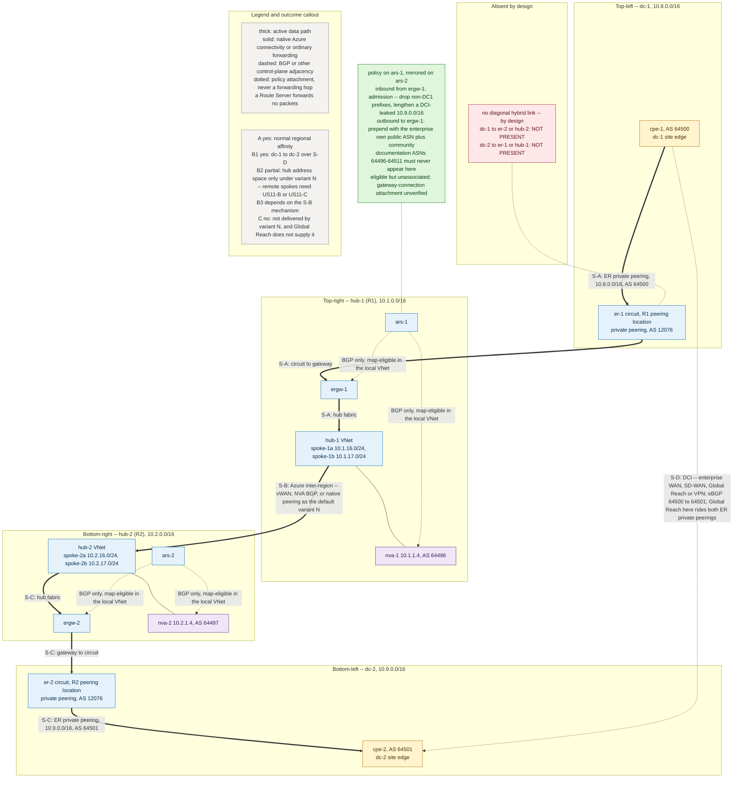

**Figure — `US12-square-hybrid-failover` (1 of 2): S-A lost — recovery goes around the square.**
*What to look for:* the recovery chain uses three surviving sides and no Route Server; the
prerequisites panel leaves unchecked exactly what a native-peering S-B does not deliver, which is why
full outcome C needs dynamic prefix carriage and withdrawal.

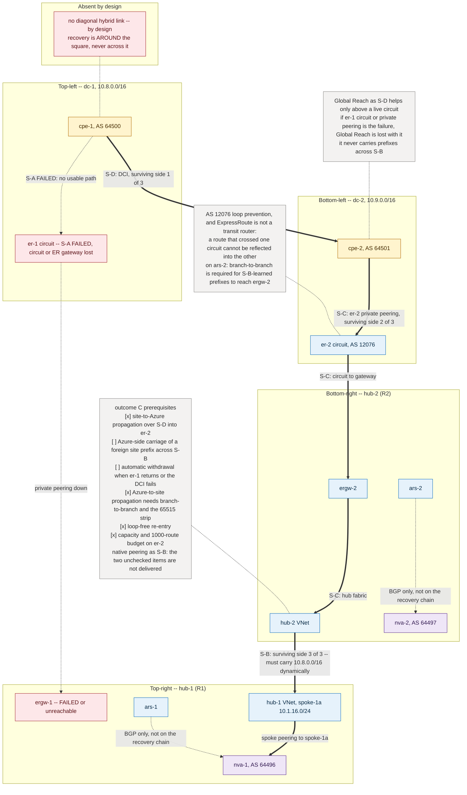

**Figure — `US12-square-hybrid-failover` (2 of 2): S-D lost instead — Azure cannot substitute.**
*What to look for:* both regions are whole and both circuits are up, yet `dc-1`↔`dc-2` is gone —
S-B carries no site prefix, so the Azure side has nothing to offer this failure.

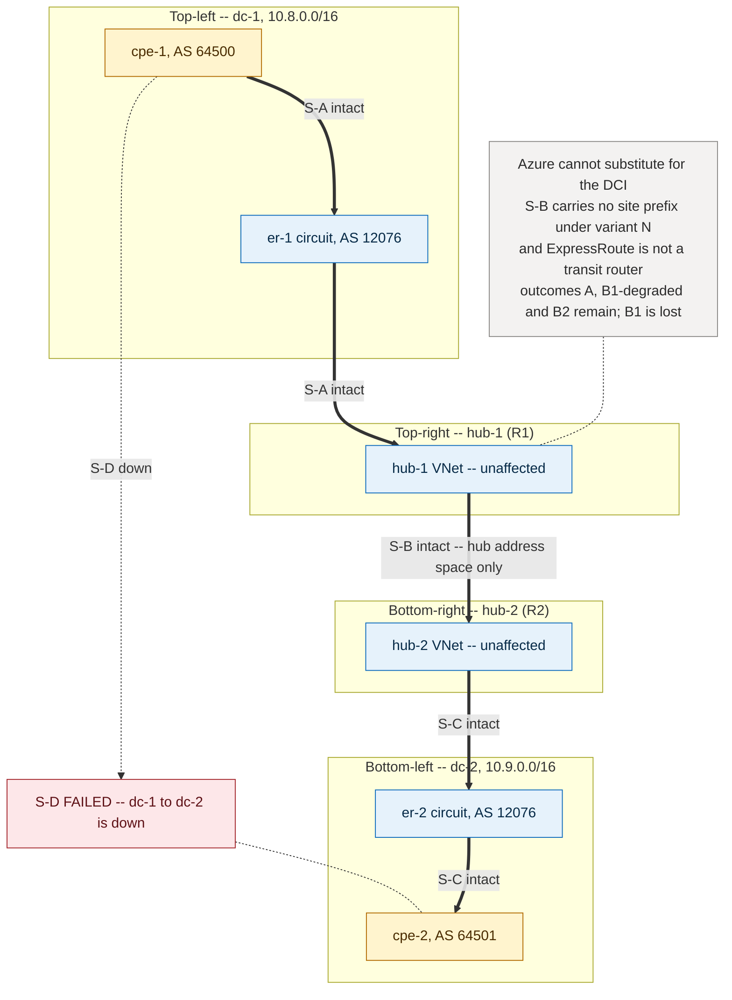

#### Outcomes A–D — each with its own prerequisites

The single most common error in this shape is to read the four sides as four *capabilities*.
They are not. Each outcome below lists exactly what must be true in the route-propagation plane and
in the forwarding plane before it can be claimed. **Do not promise full failover merely because all
four physical sides exist.**

**Outcome A — normal regional affinity.** `dc-1`↔`hub-1` over S-A and `dc-2`↔`hub-2` over S-C, in
both directions, as the shortest path.

*Route propagation prerequisites:* each site advertises its own prefixes on its own circuit; each
hub advertises its own VNet address space plus its ARS-learned spoke prefixes on its own circuit,
inside the ExpressRoute route-count budget (with branch-to-branch enabled, VNet address space plus
Route Server advertisements toward the circuit share the 1,000-route limit). If the DCI (S-D)
re-advertises the peer site's prefixes, they must arrive strictly *longer* than the direct copy —
otherwise a DCI-leaked copy can tie or win and produce a cross-region hairpin through the corporate
WAN that nobody designed. *Forwarding prerequisites:* the site side pins its own circuit with
LOCAL_PREF; no UDR in either hub sends regionally-destined traffic anywhere else.
*Requires from S-B:* **nothing.** Outcome A is complete with S-B absent.

**Outcome B — cross-region reachability.** Three genuinely different sub-outcomes that are routinely
merged and should not be.

| | B1 `dc-1`↔`dc-2` | B2 `hub-1`↔`hub-2` | B3 `dc-1`↔`hub-2` (DC to *remote* hub) |
|---|---|---|---|
| **Sides used** | S-D only | S-B only | S-A + S-B, **or** S-D + S-C |
| **Route propagation prerequisite** | eBGP `cpe-1`↔`cpe-2` (or static equivalent) carrying both site prefix sets | Whatever S-B's mechanism propagates — **native peering propagates nothing**: it creates system routes for each hub's *own* address space and no BGP session exists | Via Azure: `hub-2`'s prefixes must reach `ergw-1` and be advertised into `er-1` (needs S-B to actually *carry* them and needs branch-to-branch on `ars-1`), and `dc-1`'s prefixes must reach `hub-2`. Via on-prem: `cpe-2` must re-advertise `dc-1`'s prefixes into `er-2`, and `hub-2`'s prefixes must cross the DCI to `dc-1` |
| **Forwarding prerequisite** | DCI capacity and site-side policy on both ends | The mechanism's own next hop (`GlobalVNetPeering`, `ConnectedGroup`, `VirtualAppliance` UDR, or vWAN hub router) | Consistent policy on **both** directions across two different administrative domains; any stateful device on the path makes asymmetry an outage |
| **Does not happen automatically** | — | Spoke prefixes, Route Server-learned prefixes and gateway-learned on-premises prefixes **do not** cross a plain global VNet peering (US11, *Why global hub peering alone is not transit*) | Nothing about B3 is implied by B1 + B2. It is a separate design decision with its own loop-prevention constraints (below) |

B2 deserves one more sentence because it is where "the square is connected" quietly becomes false:
if S-B is a native global VNet peering, `hub-1` and `hub-2` reach each other's **own address space**
and nothing else. Spokes need direct peering or AVNM (US11-B), or a routed S-B.

**Outcome C — failover after the local ER side fails.** `er-1` or `ergw-1` is lost; `dc-1` must
regain Azure reachability, and `hub-1`'s workloads must regain on-premises reachability, through
`dc-1` → S-D → `dc-2` → S-C → `hub-2` → S-B → `hub-1`. Note that the two named failures are not
equivalent for S-D: an `ergw-1` loss leaves the `er-1` circuit and its private peering up, whereas an
`er-1` circuit or private-peering loss also takes down any Global Reach interconnect built on it —
see *Global Reach's shared failure domain*, below.

This is the outcome that is **not** delivered by the square's geometry. It requires, all of them:

1. **Site-to-Azure propagation.** `cpe-1` advertises 10.8.0.0/16 across the DCI; `cpe-2`
   re-advertises it into `er-2` as `64501 64500`; `ergw-2` accepts it and `ars-2` installs it.
2. **Azure-side carriage of a *foreign* site prefix across S-B.** `hub-2` must hand 10.8.0.0/16 to
   `hub-1`. A native peering cannot: it carries no BGP. A static UDR set can carry the packets but
   **cannot withdraw itself** when `er-1` returns or when the DCI fails. Only a dynamic S-B — an
   NVA-to-NVA BGP adjacency, or a vWAN inter-hub fabric — satisfies this without external automation.
3. **Azure-to-site propagation in the reverse direction.** R1's prefixes must leave through `er-2`,
   which requires branch-to-branch on `ars-2` so that S-B-learned prefixes reach `ergw-2`, and
   requires those prefixes to be free of ASN 65515 before they reach `ars-2` — the NVA-side strip is
   load-bearing, not cosmetic. On-premises then sees them with AS 12076 in the path, because the MSEE
   advertises with its own ASN and removes private ASNs.
4. **Loop-free re-entry.** `cpe-1` must not re-advertise anything learned this way back toward `er-1`
   when the circuit returns; `cpe-2` must not send Azure-learned prefixes back into `er-2`.
5. **Capacity and route budget.** `er-2` now carries two sites' traffic and two sites' prefix sets.
   Both the circuit bandwidth and the 1,000-route advertisement budget must have been sized for it.
6. **Convergence within a stated window.** BGP hold/keepalive on every hop in the chain — Route
   Server's own 180 s hold / 60 s keepalive is only one of them.

**Bounded-failover contract — the honest statement.** With S-B as a *native peering only*, outcome C
is **not** achieved: `dc-1` regains nothing beyond what the DCI already gave it, and R1 workloads do
not regain on-premises reachability. What the square delivers in that configuration is
`dc-1`↔`dc-2` (unaffected), `hub-2`↔`dc-2` (unaffected), and `hub-1`↔`hub-2` hub-address-space
reachability (unaffected) — a *graceful partial degradation*, which is a legitimate and often
sufficient design position, provided it is written down before the incident rather than discovered
during it. **State the contract in the design document, per flow, per failure.**

**Global Reach and outcome C — the boundary, stated once and enforced everywhere below.** Global
Reach on S-D changes **none** of the six prerequisites above. It links the on-premises sides of the
two circuits — *"With ExpressRoute Global Reach, you can link ExpressRoute circuits to create a
private network between your on-premises networks"* (`azure/expressroute/expressroute-global-reach`)
— so it can be an excellent B1 (`dc-1`↔`dc-2`) mechanism and a fast, high-capacity S-D. It is **not**
an Azure inter-hub path: it carries no prefix across S-B, it does not put 10.8.0.0/16 into `hub-1`
via `hub-2`, and it therefore does not restore `hub-1` workload reachability to on-premises. Step 2
above remains unsatisfied with or without it. Its only contribution to a *partial* C-shaped recovery
is on the site side, and even that is conditional — see the shared-failure-domain limit in *DCI
mechanisms for side S-D*.

**Outcome D — restoration and failback.** *Prerequisites:* the backup advertisement must be at least
one ASN longer than the direct one on every hop, so that the direct path's return automatically wins
without operator action; no aggregation anywhere on the backup path may shorten it (summarization
strips AS-PATH — US07); nothing may have been pinned with a UDR during the incident and left pinned.
*Acceptance:* post-restoration route tables are **attribute-identical** to the pre-fault baseline at
every layer, per direction, and each direction's convergence is timed separately — site-to-Azure and
Azure-to-site are different events with different timers.

#### Azure inter-hub mechanisms for side S-B — analysed independently

Each of the four is a genuine answer to a different requirement. Pick the smallest one that delivers
the outcomes the design actually claims.

| Mechanism | Delivers | Does not deliver | Choose when |
|---|---|---|---|
| **Virtual WAN inter-hub** — native routing fabric | B2 and B3 and, with the hybrid attachments moved into the vWAN hubs, outcome C natively. *"When multiple hubs are enabled in a single virtual WAN, the hubs are automatically interconnected via hub-to-hub links"* (`azure/virtual-wan/virtual-wan-global-transit-network-architecture`), and routing intent adds branch-to-branch secure transit across hubs without custom route tables | Coexistence with the Route Server construct this guide is about — vWAN **replaces** it, along with the NVA lifecycle | Inter-region transit, with or without inspection, is a standing requirement and the operator does not want to own NVAs. This is the honest default for a greenfield square |
| **NVA-to-NVA BGP over a global-peering underlay** — dynamic classic-VNet variant | Dynamic propagation with automatic withdrawal, AS-PATH/community policy on both sides, and therefore outcome C | Simplicity. Adds an HA NVA pair per region and every burden in §0.1 | Outcome C is a hard requirement and vWAN is not acceptable. Add **encapsulation only** when remote prefixes are redistributed into the local Route Server — the self-next-hop loop of `azure/route-server/multiregion` — not by default |
| **US11 no-overlay variants (A / B / C)** — bounded prefixes, no new fabric | A: hub address space (B2). B: named workload pairs, hub hop removed. C: bounded static transit through both NVAs, Learn's documented alternative to overlay tunnels | Automatic withdrawal, attributes, and therefore outcome C | The cross-region prefix set is small, named and stable, and the design does **not** claim outcome C. **This is US12's default** |
| **Application / private-endpoint alternatives** | Access to a *service* across regions with no inter-region network at all — *"the private-link resource can be deployed in a different region than the one for the virtual network and private endpoint"* | Network-level reachability, and anything failover-related at the routing layer | The requirement, once written down, turns out to name applications rather than networks. Frequently correct, almost never proposed |

**Default and justification rule.** Choose **no overlay** unless the design claims outcome C or one
of §0.1's decision-table rows. An encapsulated tunnel on side S-B must be justified by a stated
requirement — automatic withdrawal, attribute survival, redistribution into ARS, or overlapping
address space — not by resemblance to a reference architecture. If outcome C is dropped from the
requirement set, side S-B should be a native peering and the story becomes materially cheaper.

#### DCI mechanisms for side S-D — analysed independently

| Mechanism | What it is | Notes and constraints |
|---|---|---|
| **Enterprise WAN / MPLS** | The corporate backbone joining the two sites, with eBGP `cpe-1`↔`cpe-2` | Fully outside Azure. Capacity, latency and change control are the enterprise's own. Usually the assumed default and frequently the least documented |
| **SD-WAN overlay between the CPEs** | Tunnels between site edges over any transport, with the SD-WAN controller owning path selection | Path selection may be policy-driven rather than BGP-driven, so the "AS-PATH is one ASN longer" reasoning used elsewhere in this story does **not** automatically hold. State how the SD-WAN expresses backup preference, and prove it |
| **ExpressRoute Global Reach** | A circuit-to-circuit interconnect: *"With ExpressRoute Global Reach, you can link ExpressRoute circuits to create a private network between your on-premises networks"* (`azure/expressroute/expressroute-global-reach`) | **Connects sites/circuits, not hub VNets.** It can be enabled *"between the private peering of any two ExpressRoute circuits, as long as they're located in supported countries/regions and were created at different peering locations"*; Premium is required across geopolitical regions. Scope is **S-D and B1 only**: it is a valid, often excellent DCI, it can never be side S-B, and it contributes **nothing** to outcome C's Azure-side carriage. Two further consequences to size for: it **rides both ER private peerings**, so it is not an independent DCI (see below), and the routes it carries count against the circuit's own budget — *"the number of routes you receive from Microsoft on Azure private peering is the sum of the routes of your Azure virtual networks and the routes from your other on-premises networks connected through ExpressRoute Global Reach"* (ExpressRoute FAQ) |
| **VPN between the sites** | Site-to-site IPsec; the form used in this lab's analogue | Cheapest to build and to tear down; bandwidth and MTU are the trade-off |

**Global Reach is S-D, never S-B.** This is the single most valuable sentence in this section. Global
Reach joins the *on-premises sides* of two circuits; it does not connect `hub-1` to `hub-2` and
cannot provide Azure-to-Azure transit. A design that draws Global Reach as the Azure inter-region
side is drawing a link that does not exist. Its scope in this story is exactly two things: **side S-D
(site/circuit interconnect)** and **outcome B1 (`dc-1`↔`dc-2`)**. It is never a contributor to
outcome C, to B2, or to B3-via-Azure.

**Global Reach's shared failure domain — do not overstate its independence.** Global Reach rides the
**private peering of both ExpressRoute circuits**. That makes its availability conditional on the
same components the square is trying to survive:

| Failure that defines the incident | Is Global Reach still usable as S-D? | Why |
|---|---|---|
| `ergw-1` (ER gateway) lost, `er-1` circuit and its private peering healthy | **Yes** | Global Reach terminates on the circuit's private peering, above which the gateway sits; the site-to-site interconnect is unaffected by an Azure-side gateway fault |
| `hub-1` VNet-side fault (ARS, NVA, UDR) | **Yes** | Nothing in the Azure VNet is on the Global Reach path |
| `er-1` circuit down, provider/last-mile failure, or the R1 **private peering** itself down | **No** | Global Reach *is* an interconnect between the two private peerings; lose one and the interconnect for that site is lost with it |
| Peering-location or provider-edge failure serving `er-1` | **No** | Same shared component; a Global Reach "backup" fails together with the primary it was meant to back up |

**Consequence for the design document.** Global Reach may be recorded as a DCI that survives
*gateway-and-above* faults, and must **not** be recorded as a DCI that survives a *circuit or private
peering* fault. If the DCI must be independent of the ExpressRoute estate — which is the usual reason
an operator wants a DCI at all — the enterprise WAN, an SD-WAN overlay or a site-to-site VPN over a
different transport are the mechanisms that actually deliver that independence, and a design may
legitimately carry Global Reach *plus* one of them for exactly this reason.

#### Loop prevention — what actually stops the square from behaving like a mesh

Four independent mechanisms, all documented, all of which surface as *absence of a route* rather than
as an error message. This is the section to read before assuming any cross-region path works.

1. **MSEE ASN 12076 on every ExpressRoute path.** Microsoft uses AS 12076 for private peering
   (`azure/expressroute/expressroute-routing`). Any route that has crossed one circuit carries 12076,
   so re-offering it to a *second* circuit's MSEE trips that MSEE's own-AS loop prevention. The same
   article states plainly: *"You can't configure ExpressRoute as transit routers. You need to rely on
   your connectivity provider for transit routing services."*
2. **Circuit-to-circuit reflection is not available — classified `Platform-blocked — retained`.**
   *Citation scope first, because the obvious quote is narrower than it looks.* The Route Server
   article states: *"ExpressRoute circuit-to-circuit connectivity isn't supported through Azure Route
   Server. Routes from one ExpressRoute circuit aren't advertised to another ExpressRoute circuit
   connected to the **same virtual network gateway**. For ExpressRoute-to-ExpressRoute connectivity,
   consider using ExpressRoute Global Reach"* (`azure/route-server/expressroute-vpn-support`). That
   sentence is about **two circuits on one gateway in one Route Server VNet**. The square has
   `er-1` on `ergw-1` in R1 and `er-2` on `ergw-2` in R2 — different gateways, different VNets,
   different Route Servers — so this citation must **not** be used as the proof for the square. It is
   quoted here only for the same-gateway case, and for its pointer to Global Reach as the sanctioned
   ER↔ER answer (which, per *DCI mechanisms*, is a site interconnect and not an Azure inter-hub path).
   *The facts that do govern the square are route-propagation facts:* Microsoft uses **AS 12076** for
   Azure private peering and reserves 65515–65520 for internal use
   (`azure/expressroute/expressroute-routing`, *Autonomous System numbers*), so any route that has
   crossed one circuit carries 12076 and re-offering it to a second circuit's MSEE trips that MSEE's
   own-AS loop prevention; private ASNs added for prepending are stripped on the ExpressRoute path
   (*"If you're using ExpressRoute, the gateway strips private ASNs"*,
   `azure/virtual-wan/route-maps-prepend-routes`), so AS-PATH engineering cannot be used to dodge it;
   and the same routing article states plainly *"You can't configure ExpressRoute as transit routers.
   You need to rely on your connectivity provider for transit routing services"*
   (`azure/expressroute/expressroute-routing`, *Transit routing and cross-region routing*).
   Consequently a route learned from `er-1` **cannot be reflected into `er-2`** — in the same-gateway
   case by the explicit Route Server statement, and in the square's separate-gateway case by MSEE
   loop prevention plus the no-transit-router rule. Branch-to-branch route exchange on a Route Server
   covers NVA↔gateway and gateway↔gateway (ER↔VPN) exchange — **not** ER↔ER. Either way it is a
   **platform property, not a design choice**, which is why it is classified `Platform-blocked —
   retained` and never `Rejected as implementation`.
   *Where a documented workaround exists, it is instructive rather than convenient:* Microsoft's own
   two-circuit transit pattern requires a Route Server plus BGP-capable NVAs, and states that
   **supernets** rather than the exact prefixes must be originated, *"because the exact prefixes are
   already announced in the opposite direction"*, and that *"the BGP-capable NVAs must remove the AS
   paths to prevent routes from being dropped by BGP loop detection"*
   (`azure/cloud-adoption-framework/scenarios/azure-vmware/on-premises-connectivity`, *Transit over
   ExpressRoute private peering*). That is the shape of the effort ER↔ER transit actually costs.
3. **Own-AS 65515 on the Azure side.** All ER/VPN gateways that coexist with a Route Server, and all
   Route Servers, use ASN 65515. *"If an NVA advertises a route to Azure Route Server that already
   contains 65515 in the BGP AS_PATH attribute, Azure Route Server identifies its own ASN in the AS
   path and rejects the route as part of standard BGP loop prevention behavior"* (Route Server FAQ) —
   and this check runs **before** inbound route-map policy. In the lab analogue the same wall appears
   at the VPN gateways: an Azure-originated prefix that leaves Azure, crosses the DCI and tries to
   re-enter Azure still carries 65515 and is dropped on arrival. Distinct ASNs on the *on-premises*
   gateways (65000, 65003 in this lab) are what keep the site-prefix direction clean; the hub-side
   gateways cannot be changed, because Route Server coexistence pins them to 65515
   (`azure/route-server/configure-route-server`). Note the sibling constraint for the ER↔VPN
   coexistence case: transit routing there requires the VPN gateway's ASN to be 65515 as well.
4. **When re-origination, `as-override` or NVA policy becomes necessary.** Two sanctioned mitigations,
   both on a device the operator owns: `as-override` on an NVA that peers two Route Servers sharing
   65515 (`azure/route-server/about-dual-homed-network`), and 65515 AS-path removal on the NVA in the
   multi-region pattern (`azure/route-server/multiregion`). Re-origination on a CPE or an on-prem NVA
   is the equivalent move on the site side. **What no route map can do:** remove its Route Server's
   own ASN; rescue a route already dropped by loop prevention; attach to the MSEE side of a circuit;
   or make ER↔ER transit exist. Every one of those must happen upstream, on a device you own, or not
   at all.

**Maps solve — eligible attachment points, named, and what each is actually good for.** In the
generic bed the eligible local attachment points are, per region: the **ARS↔ER-gateway connection**
(`ars-1`↔`ergw-1`, mirrored), the **ARS↔NVA BGP peering** (`ars-1`↔`nva-1`, mirrored), and — where a
VPN gateway is present instead of or alongside ER — the **ARS↔VPN-gateway connection**. All must be
in the Route Server's own VNet (the empirical peer-locality rule, EMP-001 / D2).

| Job | Where | Direction | Value |
|---|---|---|---|
| **Admission** | `ars-1`←`ergw-1` | inbound | Drop prefixes outside the `dc-1` allow-list, and drop or lengthen a DCI-leaked copy of 10.9.0.0/16. Inbound runs **before** best-path selection, so this is the one place a map influences which next hop is programmed |
| **Tagging** | `ars-1`↔`ergw-1`, `ars-1`↔`nva-1` | either | Community `Add` marking origin region and backup role, so the site and the far region can classify a path instead of inferring it from length |
| **Preference** | `ars-1`→`ergw-1` | outbound | AS-PATH `Add` on the remote region's prefixes so the site prefers its own circuit. **The prepended ASN must be a public ASN the enterprise owns:** private and Azure-reserved ASNs are forbidden and are in any case stripped by the MSEE, and 64496–64511 are IANA documentation ASNs that must never reach a circuit |
| **Backup-path de-preference** | `ars-1`←`nva-1` (S-B side) | inbound | Lengthen S-B-learned copies of the *remote* site's prefixes so they can never tie with the direct circuit copy |

**Maps do not solve.** *Topology* — no map creates S-A, S-B, S-C or S-D; every side is lever D and
must exist first. *Outbound-after-best-path* — outbound maps shape advertisements only, so they can
never repair a wrong local best path. *Native VNet advertisement* — the hub's own address space is
advertised by ARS and is not modifiable or filterable, so "stop offering my hub prefix to circuit 1"
is inexpressible. *Own-AS removal* — 65515 cannot be stripped by a map and a route already dropped
cannot be rescued. *Symmetry* — a map affects one direction of one connection; symmetry is an outcome
of two mirrored policies. *Granularity* — no attachment object for a VNet peering; 2-byte ASNs only;
summarization strips AS-PATH and community; prefix modification and NAT are mutually exclusive.
*Change safety* — association is an ARM write against a live Route Server and is not documented as
session-preserving; treat it as a change window (US10's E-1/E-2 gate is the test).

#### Current lab analogue — VPN square

**Classification: `requires disruptive topology change` — additive staging, disruptive activation.**
Side S-B alone (the `vnet-hub1`↔`vnet-hub2` peering, US11 test 1) is purely additive; the *square*
is not reachable without deleting the existing `vnet-onprem`↔`vnet-hub2` connection pair, which is
the same S3 deletion US10 requires and carries the same evidence loss.

**Figure — `US12-square-hybrid-lab-analogue`: the deployed four corners and the S-B decision.**
*What to look for:* S-B is drawn as two mutually exclusive lanes in one corridor — pick one, never
both — and the B2 probe is anchored on the two NVA addresses, because no VM exists in either
`snet-endpoint`.

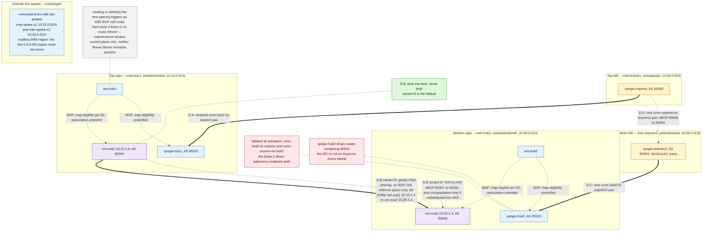

**Reuse by reference, not by duplication.** The staging, preflight, ledger, cost and rollback
material for site 2 is identical to US10's `Current lab expansion` and is **not** repeated here.
Specifically, US12 reuses unchanged: the **S0 Poland Central gateway SKU and zone preflight gate**
(`VpnGw1AZ` mandatory, two Standard PIPs with zones 1,2,3 created and validated *before* the
gateway, parity check against the three deployed gateways, stop-on-failure rule); the **S1 resource
table** for `vnet-onprem2` / `pip-vpngw-onprem2-1,2` / `vpngw-onprem2` / `vm-onprem2-ep`; the
**global-peering BGP reset caution**; the **cost basis** (~$84/day current, ~$95+/day target as a
floor pending a `VpnGw1AZ` retail lookup for `polandcentral`); the **deployment-time estimates**; and
the **rollback sequencing**. Read US10's subsection for all of those before executing anything here.

**The four sides in lab form.**

| Side | Lab realisation | Class |
|---|---|---|
| **S-A** `dc-1`↔`hub-1` | Existing `conn-hub1-to-onprem` / `conn-onprem-to-hub1` between `vpngw-onprem` (AS 65000, `vnet-onprem` 10.40.0.0/16, norwayeast) and `vpngw-hub1` (65515, `vnet-hub1` 10.10.0.0/16, swedencentral). **`vnet-onprem` is reused as DC1, unchanged** | reused |
| **S-C** `dc-2`↔`hub-2` | **New** `conn-hub2-to-onprem2` / `conn-onprem2-to-hub2` between `vpngw-onprem2` (AS **65003**, `vnet-onprem2` 10.50.0.0/16, polandcentral, `VpnGw1AZ` active-active) and `vpngw-hub2` (65515, `vnet-hub2` 10.20.0.0/16, switzerlandnorth) | added |
| **S-D** `dc-1`↔`dc-2` (DCI) | **New** `conn-onprem-to-onprem2` / `conn-onprem2-to-onprem` V2V pair with BGP on — the two on-premises VPN gateways connected directly to each other. This is the lab analogue of the corporate WAN or of a Global Reach interconnect (the lab has no ExpressRoute circuit, so Global Reach itself cannot be exercised here) | added |
| **S-B** `hub-1`↔`hub-2` | **Two clearly separated variants — see below.** Never both at once | added |

**Side S-B — variant N (no-overlay, bounded) — the default.** Create the global VNet peering pair
`vnet-hub1`↔`vnet-hub2` exactly as US11 test 1: `AllowVirtualNetworkAccess` true,
`AllowForwardedTraffic` true, `AllowGatewayTransit` and `UseRemoteGateways` **false** on both sides
(neither hub may use the other's gateway; both have one). Optionally add US11 variant C's bounded
static transit — a route table on each `snet-nva` with the *remote* spoke prefix via the remote NVA's
IP — but only as a separately-gated demonstration, and without disabling BGP propagation on those
subnets. **What variant N delivers:** outcome A in full, B1 in full, B2 **for hub address space only**
(and, with US11-C, for the two named spoke prefixes). **What it does not deliver:** B2 for spokes
without that extra mechanism, B3 via Azure, and outcome C. Its failover contract is exactly the
*graceful partial degradation* stated above, and that is the point of running it first.

**B2 reachability probe — corrected endpoints (blocking correction, 2026-08-05).** The earlier draft
proposed proving hub-address-space reachability between "hub endpoint VMs in `snet-endpoint`". That
probe does not exist and cannot be run:

| Claim in the rejected draft | Evidence | Status |
|---|---|---|
| VMs exist in `snet-endpoint` 10.10.2.0/27 / 10.20.2.0/27 | `deploy/templates/main.bicep` creates both subnets but places **no VM** in either; the six deployed VMs are `vm-nva1`, `vm-nva2`, `vm-hub1-ep`, `vm-hub2-ep`, `vm-c1-ep`, `vm-onprem-ep` (`manifest.md` §1, `deploy-log.md` §1) | **False — no such endpoint** |
| `vm-hub1-ep` / `vm-hub2-ep` can stand in for them | Both are deployed into `vnet-spoke-a` / `vnet-spoke-b` `snet-workload` (10.11.0.x / 10.21.0.x), i.e. **spoke** address space; spoke prefixes do not cross a plain hub↔hub peering (US11, *Why global hub peering alone is not transit*) | **Would test the wrong thing and is expected to fail** |

**Corrected probe — reuse `vm-nva1` 10.10.1.4 ↔ `vm-nva2` 10.20.1.4.** Both VMs sit in
`snet-nva` inside their own hub's address space (10.10.0.0/16 and 10.20.0.0/16), which is precisely
what a global VNet peering carries, so they are the correct and sufficient B2 instrument. Reuse is
preferred here and is defensible: it adds no resource, no cost and no new failure surface, and the
NVAs are already the layer where the route state is inspected.

*Prerequisites, verified against the deployed NSGs (`main.bicep`, `nsg-nva-hub1` / `nsg-nva-hub2`):*

| # | Prerequisite | Detail |
|---|---|---|
| N1 | ICMP is already permitted | `allow-icmp-inbound` (priority 110) permits ICMP from **10.0.0.0/8** on both NVA NSGs, which covers 10.10.1.4 and 10.20.1.4. **No NSG change is required for a ping probe** |
| N2 | SSH is already permitted | `allow-ssh-inbound` (priority 120) permits TCP/22 from 10.0.0.0/8, so a TCP-22 connect is the second legal probe |
| N3 | Nothing else is permitted | `deny-other-inbound` at priority 4000 denies every other inbound protocol/port. **Do not** design the probe around an arbitrary TCP port, and **never** probe TCP/179 — that port carries the live BGP sessions |
| N4 | Outbound needs no change | The default `AllowVnetOutBound` rule covers peered VNet address space; peering makes 10.20.0.0/16 part of the `VirtualNetwork` tag on the hub1 side and vice versa |
| N5 | BIRD must not be touched | The probe is **read-only** with respect to routing. Do not stop, start or reload BIRD, and do not edit filters — Δ1/Δ2 and the `ars-poland` `0/0` copies are live evidence. Capture `birdc show protocols all` and `birdc show route` **before and after** purely as evidence |
| N6 | Route-refresh capability must be checked first | Creating (or deleting) the peering makes both hub Route Servers issue a route refresh to their peered NVAs — soft if BIRD negotiated RFC 2918, **hard, with data-plane disruption through the NVA**, if not (Route Server FAQ). Confirm in `birdc show protocols all` *before* the change; treat create *and* rollback as change windows |
| N7 | Forwarding state is unchanged by the probe | Packets sourced by and destined to the NVAs themselves are host-terminated, not forwarded, so the probe does **not** depend on `AllowForwardedTraffic` and does **not** exercise transit. That is intentional: B2 is a hub-address-space claim, not a transit claim |
| N8 | Kernel FIB sanity | `ip route get 10.20.1.4` on `vm-nva1` (and the mirror) before and after. The operational BIRD kernel/static config carries a `0.0.0.0/0` via the VNet fabric next hop, so the packet is handed to Azure and resolved by the subnet's effective routes — confirm with `az network nic show-effective-route-table -n nic-nva1`, expecting 10.20.0.0/16 with next-hop type `GlobalVNetPeering` |

*Probe evidence set:* effective route tables on `nic-nva1`/`nic-nva2` before and after (next-hop type
`GlobalVNetPeering`, no ECMP surprise); `az network watcher show-next-hop` in **both** directions;
bidirectional ICMP plus a TCP/22 connect; `tcpdump` at both ends correlated on the probe 5-tuple
(V7); interface counters at both ends (V8); and the full set of expected **non**-effects from US11
test 1 (both hub Route Servers' learned/advertised sets, `vpngw-hub1`/`vpngw-hub2` advertisements
toward on-premises, `ars-poland`'s two `0/0` copies, set-C effective routes).

*Fallback, only if reuse is later judged technically unsuitable* — for example if a probe must run
from a non-forwarding host, or if NVA CPU/state must not be perturbed at all. Deploy two dedicated
hub endpoint VMs, `vm-hub1-core-ep` in `vnet-hub1/snet-endpoint` 10.10.2.0/27 and `vm-hub2-core-ep`
in `vnet-hub2/snet-endpoint` 10.20.2.0/27. **Ledger delta if taken:** +2 `Standard_B2ts_v2` VMs
(+2 NICs, +2 Standard SSD 30 GB disks, no public IPs), VM count 6 → 8; both subnets already exist and
already carry an endpoint NSG (`nsg-ep-general` on hub1, `nsg-ep-hub2` on hub2 — ICMP + SSH from
RFC1918), so **no NSG work is needed**; cost impact is two
more B-series VMs on top of the ~$95+/day US12 floor, and it must be added to the same fresh cost
approval rather than treated as incidental. This fallback is **not** recommended: it buys a cleaner
source host at the price of two resources the reused probe does not need.

**Side S-B — variant D (dynamic).** Keep variant N's peering as the underlay, add the multi-hop eBGP
adjacency `vm-nva1`↔`vm-nva2` (65001↔65002) with `bgp_path.delete(65515)` on export, and add
IPsec/VXLAN encapsulation **only if** remote prefixes are redistributed into `ars-hub1`/`ars-hub2`
(the self-next-hop loop). This is US10's mechanism, imported here unchanged including its
deliberately narrow tunnel prefix policy — in particular **no `0.0.0.0/0` and no set-C prefixes in
either direction**, because `ars-poland` currently holds exactly two default copies (`65001` and
`65002-65002-65002`) and that is what resolved DEF-001. **What variant D adds:** B3 via Azure and
outcome C — and, with them, every §0.1 operational burden and a shared failure domain.

**Activating diagonal-free affinity.** Today `vnet-onprem` is connected to **both** hubs, so onprem1
is dual-homed and the attachment matrix is not a square in the US12 sense — it has a diagonal. The
activation step replaces `hub2`↔`onprem1` with `hub2`↔`onprem2`: create the S-C pair first, verify
it, then delete `conn-hub2-to-onprem` and `conn-onprem-to-hub2`. Nothing else is removed.

**Exact resource ledger (delta relative to today).**

- **Reused, unchanged:** `ars-hub1`, `ars-hub2`, `ars-poland` (all three already past the first-use
  route-map upgrade); `vpngw-hub1`, `vpngw-hub2`, `vpngw-onprem`; `vm-nva1` 10.10.1.4, `vm-nva2`
  10.20.1.4 (VMs untouched — they are also the corrected B2 probe endpoints; BIRD config extended
  only in variant D); `vnet-hub1`, `vnet-hub2`, `vnet-poland-ars`,
  `vnet-onprem`, `vnet-spoke-a`, `vnet-spoke-b`, `vnet-spoke-c1`, `vnet-spoke-c2`; `vm-hub1-ep`
  (in `vnet-spoke-a`, 10.11.0.x), `vm-hub2-ep` (in `vnet-spoke-b`, 10.21.0.x), `vm-c1-ep`,
  `vm-onprem-ep` — **note that no VM exists in either hub's `snet-endpoint`**, so none of these four
  can serve as a hub-address-space probe; set-A/set-B route tables; all 10 existing peering pairs
  (20 objects); `conn-hub1-to-onprem` / `conn-onprem-to-hub1`.
- **Added — variant N square:** 1 VNet (`vnet-onprem2`) + 2 subnets, 2 zoned Standard PIPs, 1
  `VpnGw1AZ` active-active gateway (ASN 65003), 1 `Standard_B2ts_v2` VM (+NIC, +disk), 4 connection
  objects (S-C pair + S-D pair), 1 global VNet peering pair (S-B). PIP total 9 → 11.
- **Added — variant D increment only:** BIRD multi-hop eBGP policy blocks on both NVAs and, if
  redistribution into ARS is in scope, one IPsec tunnel between `vm-nva1` and `vm-nva2`.
- **Removed at activation:** `conn-hub2-to-onprem`, `conn-onprem-to-hub2`. Nothing else.

**Preflight, ASNs, cost, time, risk.** *Preflight:* US10's S0 gate applies verbatim and must fully
pass before `vpngw-onprem2` is attempted — `az deployment group validate` and `what-if` catch neither
`NonAzSkusNotAllowedForVPNGateway` nor `VmssVpnGatewayPublicIpsMustHaveZonesConfigured`, both of
which have already bitten this lab. *Distinct ASNs:* 65000 `vpngw-onprem`, **65003** `vpngw-onprem2`,
65001 `vm-nva1`, 65002 `vm-nva2`, 65515 all three hub-side gateways and all three Route Servers. The
distinct on-premises ASNs are what make S-D usable at all; 65515 is not a free variable on the hub
side. Prepend actions *inside the lab* use 64496, as established by the Δ3 activation contract — a
closed lab with no MSEE and no public routing is the only context in which a documentation-range ASN
is acceptable. *Cost floor:* identical to US10 — approximately **$95+/day** against a current
~$84/day run-rate, a floor rather than an estimate until the `VpnGw1AZ` retail price for
`polandcentral` is looked up. Both figures breach the ~$50/day guardrail and the existing $72/day
waiver covers neither; **a fresh explicit approval is required before any resource is created**.
Variant N versus variant D is not a cost difference of substance — the gateway dominates — so the
choice should be made on operational burden, not on price. *Deployment time:* ~60–75 min for the
additive stage (the `vpngw-onprem2` create is the 30–45 min long pole), ~10 min preflight, ~15 min
activation plus reconvergence, ~30 min evidence capture. *BGP-reset and disruption risks:* creating
**or deleting** the `vnet-hub1`↔`vnet-hub2` peering makes both hub Route Servers issue a route
refresh to all peered NVAs — soft if BIRD supports RFC 2918, **hard, with traffic disruption through
the NVAs, if not** (Route Server FAQ); confirm the negotiated capability with `birdc show protocols
all` first and treat create *and* rollback as change windows. Deleting the hub2↔onprem1 pair removes
the direct adjacency on which the Δ2 prepend evidence and the S2/S3 failover timings were measured;
US10 records the corrected post-activation expectation (`65003-65515-65002-65002-65002` at
`vpngw-onprem` via `vpngw-onprem2` and the DCI) and that expectation applies here identically. It is
now additionally supported by Learn rather than only by inference: *"Does Azure VPN Gateway support
BGP transit routing? Yes. BGP transit routing is supported, with the exception that VPN gateways
don't advertise default routes to other BGP peers"* (VPN Gateway FAQ) — it still must be measured,
because the reciprocal Azure-to-Azure case remains masked by the 65515 drop. *Rollback:* US10's
9-step sequencing, unchanged — detach maps, restore BIRD, delete the new connection pairs, recreate
`conn-hub2-to-onprem` / `conn-onprem-to-hub2` with a fresh matching PSK pair (DEV-001), confirm Δ2
has returned in its direct-adjacency form, then remove the DCI, the tunnel, the peering (in a
window), and finally the site-2 resources.

**Honest classification note.** If a build rejects or is blocked on the full-failover variant —
because vWAN is not acceptable, because the overlay's shared failure domain is refused, or because
outcome C simply is not worth its cost — **the story is retained, not deleted.** Its delivered value
becomes outcomes A, B1, B2 and D plus a written bounded-failover contract, which is the majority of
what most operators of this shape actually need. Deleting the story because one outcome was declined
would remove the reasoning that justified declining it.

**Validation and evidence.** Traceroute is **secondary and indicative only** in every row below: it
observes one direction from one end, Azure gateways and fabric hops do not reliably return
TTL-exceeded, and a missing hop is not evidence of a missing path.

| # | Instrument | What it proves |
|---|---|---|
| V1 | `az network vnet-gateway list-learned-routes -g <rg> -n <gw>` on **every** gateway, plus `list-advertised-routes -g <rg> -n <gw> --peer <ip>` — **`--peer` is required**; enumerate with `list-bgp-peer-status` and repeat per peer IP, including **both** active-active instance peers. Generic bed adds `az network express-route list-route-table` per circuit and peering | Per-gateway RIB and per-peer advertisement set with AS-PATH; the 12076/65515 absences are visible here first |
| V2 | `az network routeserver peering list-learned-routes` and `list-advertised-routes` on `ars-hub1`, `ars-hub2`, `ars-poland`, **per peering name**, before and after every step | Route Server RIB in and out; map effect; the required *non*-effects on `ars-poland`'s two `0/0` copies |
| V3 | `birdc show protocols all <session>` and `birdc show route all <prefix>` on both NVAs; `ip route` for the kernel FIB; CPE `show ip bgp` / `show ip bgp neighbors <peer> received-routes advertised-routes` in the generic bed | Session uptime (the reset tell-tale), negotiated route-refresh capability, applied filters, installed best path, and the 65515 strip actually taking effect |
| V4 | `az network nic show-effective-route-table` on every endpoint NIC in scope, before and after | The programmed next hop per subnet, the exact next-hop type (`GlobalVNetPeering`, `VirtualAppliance`, `VirtualNetworkGateway`), and any unintended ECMP |
| V5 | Network Watcher **next hop** (`az network watcher show-next-hop`) per source→destination pair, **both directions** | The platform-authoritative forwarding decision per direction; an unsupported next hop surfaces here rather than as a silent drop |
| V6 | Network Watcher **connectivity check** (`az network watcher test-connectivity`) plus a bidirectional ping/TCP matrix across all endpoints | Reachability with per-hop status, both directions |
| V7 | **Simultaneous** packet capture at both ends of the path under test — `tcpdump -nni <if> -tttt` filtered on the probe 5-tuple / ICMP id at both NVAs (and at both CPEs in the generic bed) — correlated by identical packet identity | **Primary directionality and symmetry proof**: which interface carried the forward packet and which carried the reply, at both ends |
| V8 | Interface and firewall **counters** at both ends before and after each probe run: `ip -s link show <if>`, `nft list ruleset` / `iptables -vnL`, conntrack where stateful | Corroborates V7 without depending on capture timing; one-sided counter growth is a FAIL, not a partial pass |
| V9 | **Timed fault and failback**: timestamped polls at 30 / 60 / 120 / 180 s after the fault and after the repair, **per direction**, against the 180 s BGP hold / 60 s keepalive | Convergence and failback windows, measured separately for site-to-Azure and Azure-to-site |
| V10 | **Route-table equality after restoration**: re-run V1, V2, V3 and V4 and diff against the pre-fault baseline | Attribute-identical restoration. A path that returns with a different AS-PATH, community set or next hop is a FAIL even if it pings |
| V11 | Traceroute across the same matrix — **secondary only** | Consistent-with, never proof-of |

**PASS.** Outcome A: each site's RIB shows its own regional prefixes with the shortest AS-PATH via
its own side, and any DCI-leaked copy is strictly longer; every endpoint NIC points at its regional
next hop; V7/V8 show forward and reply on the matching interface pair at both ends. Outcome B: each
of B1, B2 and B3 tested and reported **separately**. B2 under variant N passes on
**hub address space only**, proven `vm-nva1` 10.10.1.4 ↔ `vm-nva2` 10.20.1.4 with next-hop type
`GlobalVNetPeering` in both directions; remote-spoke reachability is **not** part of that pass and is
reported as *not delivered* unless US11-B or US11-C has been added and separately evidenced. B3 is
explicitly marked *not delivered* when the chosen S-B is variant N. Outcome C: converges within the
stated window in **both** directions, independently measured — or is recorded as *not delivered*
against the written bounded-failover contract; a Global Reach S-D never counts toward it.
Outcome D: V10 shows attribute-identical tables. **FAIL.** Any AS-PATH tie producing an
unintended cross-region hairpin; a path that converges in one direction only; a route silently absent
because it carried 65515 or 12076; asymmetry across a stateful device; a post-restoration table that
differs from baseline; a B2 claim evidenced from a spoke-resident VM (`vm-hub1-ep` / `vm-hub2-ep`) or
from a non-existent `snet-endpoint` host; or any perturbation of the existing Δ1/Δ2/Δ3 and set-C
evidence that was not predicted before the change.

**Alternatives.** **Add the diagonal** — dual-home each site to both regions; the honest answer when
steady-state cross-region hybrid reachability is a real requirement
(`azure/route-server/about-dual-homed-network`). **ExpressRoute Global Reach on S-D** — the strongest
non-Azure-side answer for **B1**, without touching the hubs; it is **not** an outcome-C mechanism (it
carries no prefix across S-B) and it shares a failure domain with both circuits' private peerings, so
it is a DCI that survives gateway-and-above faults only. **Virtual WAN** — makes S-B native and makes
outcome C a configuration rather than a construction. **CPE / site-side BGP policy** — LOCAL_PREF at
each site remains the most robust affinity lever and is
immune to anything Azure does to AS-PATH. **ExpressRoute connection routing weight** — a coarse
Azure-side preference with no BGP change. **ExpressRoute BGP communities** — let each site classify
Azure routes by region with no Azure-side tagging at all. **UDRs, kept consistent by AVNM routing
configurations** — the only way to force a next hop, and the supported way to keep US11-C's static
routes consistent at scale. **Private Link / application-layer patterns** — remove the network
question entirely when the requirement names a service.

**Residual risks.**

| Risk | Why it persists | Mitigation |
|---|---|---|
| Four sides read as four capabilities | The picture is symmetric; the routing is not | The bounded-failover contract, written per flow per failure, and the separate B1/B2/B3 reporting |
| S-B chosen as an overlay by default | Reference-architecture gravity | The default-and-justification rule above; §0.1's decision table |
| Global Reach drawn as S-B | It is an ExpressRoute feature, so it looks Azure-side | The explicit "S-D, never S-B" statement and the diagram's separate lanes |
| Global Reach credited with outcome C | "It's ExpressRoute-to-ExpressRoute, so surely it fails the traffic over" | It links on-premises networks only; it never carries a prefix across S-B, so step 2 of outcome C stays unsatisfied. Record it against B1 and S-D, never against C |
| Global Reach treated as an *independent* DCI | It is contracted separately from the WAN, so it reads as diverse | It rides **both** ER private peerings: usable when the failure is a gateway or above, lost when the failure is the local circuit or private peering itself. Pair it with a genuinely independent transport if DCI independence is required |
| B2 over-claimed as spoke reachability | "The hubs are connected" is read as "the estate is connected" | B2 evidence is hub-address-space only (`vm-nva1`↔`vm-nva2`); spokes require US11-B or US11-C, separately evidenced |
| Asymmetry across two administrative domains | B3 and C cross a boundary where two teams set policy independently | Mirrored policy statements, and V7/V8 two-ended proof rather than traceroute |
| Overlay as a shared failure domain (variant D only) | The same tunnel carries cross-region traffic *and* the backup | US10's residual-dependency table; build S-B redundantly; never document S-D as its backup |
| Route-count growth on the surviving circuit during outcome C | The survivor carries both sites — and, with Global Reach enabled, the peer site's routes already count against the same private-peering budget (ExpressRoute FAQ) | Size against the 1,000-route budget *before* the fault, not after |
| Evidence loss at activation | The Δ2 direct-adjacency form is deleted with the hub2↔onprem1 pair | Complete pre-activation baseline at every layer; US10's corrected post-activation expectation as the acceptance test |

#### US10 versus US12 — what each asks that the other does not

| | US10 asks | US12 asks |
|---|---|---|
| **Unit of design** | The cross-region **backup** — the topology exists to make it work | The **square itself** — four named sides, no diagonals, each with its own stated purpose |
| **Failover** | Automatic cross-region hybrid backup is a **requirement**; the design is judged on it | Failover is a **bounded, written contract**; partial degradation is an acceptable, documented outcome |
| **Inter-hub mechanism** | Decided: dynamic NVA-to-NVA BGP with encapsulation, because four requirements converge and only that meets all four | **Open and separately justified**, with no-overlay as the default and vWAN as a first-class native answer |
| **DCI** | One line: the corporate WAN, with Global Reach named as a valid **DCI** alternative | A **taxonomy** — enterprise WAN, SD-WAN, Global Reach, VPN — with their different preference semantics *and failure domains* distinguished |
| **DC↔remote-hub (B3)** | Implied by the backup narrative | Called out as its **own outcome**, with two mutually exclusive realisations and their separate prerequisites |
| **Route-map role** | Defends affinity against a DCI-leaked copy on a dynamic path | Same levers, but explicitly scoped to admission, tagging, preference and backup de-preference on named local attachment points |
| **Cost of being right** | Accepts the overlay's operational burden and shared failure domain | Prefers to reduce the claim rather than add the fabric |

Neither supersedes the other. Read US12 when the question is *"what shape should the hybrid
attachment be, and what does it actually give me?"*; read US10 when the question is *"how do I make a
stranded site keep working automatically?"*

**Diagram specification.** Generic, **not** the live lab, for the first two. Edge-weight convention
as US10 and mandatory in all three: *thick solid* = data plane (packets); *thin solid* = BGP control
plane; *dashed* = tunnel/encapsulation carried over an underlay; *thin dotted* = ARS control-plane
sessions. **No Route Server may appear on a thick edge, in any state or inset.**

**Rendering format — Mermaid is required, and the spec is written to what Mermaid can actually do.**
Jose has asked for Mermaid diagrams, so Mermaid is the canonical, readable, in-repo form of all three
figures. Mermaid cannot be relied upon for exact geometry (it has no true "place this node at the
top-left corner" primitive), for red-crossed edges, or for genuinely absent edges that still need to
be *seen*. The specification therefore adapts rather than fights the tool:

- Use `flowchart TB` with **four quadrant `subgraph` blocks** — `R1_SITE` (dc-1), `R1_AZURE`
  (hub-1), `R2_AZURE` (hub-2), `R2_SITE` (dc-2) — declared in that order so the renderer lays them
  out as a square-ish 2×2. Corner identity comes from the subgraph titles (`Top-left — dc-1`,
  `Top-right — hub-1 (R1)`, `Bottom-right — hub-2 (R2)`, `Bottom-left — dc-2`), not from geometry.
- **Every side carries its letter in the edge label**: `-- "S-A · ER private peering · 10.8.0.0/16 ·
  AS 64500" -->` and so on, so the square reads correctly even if the renderer distorts the shape.
- **Absent diagonals are annotated, never drawn.** Do **not** emit a `dc-1 -.-> hub-2` edge and hope
  a style makes it read as absent. Use a dedicated `NOTE_DIAG` node (or a `subgraph Absent by
  design`) containing `dc-1 ⇢ er-2 / hub-2 — NOT PRESENT` and `dc-2 ⇢ er-1 / hub-1 — NOT PRESENT`,
  plus one line of prose in the caption. If a visual stub is wanted, attach a **dashed edge from the
  corner to that note node** — a dashed link that terminates in an annotation, never in the opposite
  corner.
- **Plane convention in Mermaid terms:** thick data plane = `==>`; BGP control plane = `-->`;
  tunnel/encapsulation = `-.->` with the label naming the encapsulation; ARS sessions = `-.->` with
  the label `BGP only · map-eligible (local VNet)` and the Route Server node styled with a distinct
  `classDef` plus the caption `control plane only — forwards no packets`. Declare the classDefs and
  state the mapping in a `subgraph Legend` so the convention survives being pasted elsewhere.
- **If a pixel-exact square is later required** for publication, render it additionally in
  draw.io or Excalidraw. That render **supplements** the Mermaid source; it never replaces it, and
  the Mermaid version remains the canonical companion in the repo.

**Diagram `US12-square-hybrid-normal`.** Four quadrant subgraphs as above; corner identity in the
subgraph titles: `dc-1` top-left, `hub-1` top-right, `hub-2` bottom-right, `dc-2` bottom-left. Nodes
— `dc-1`, `cpe-1`, `er-1`; `hub-1` containing `ergw-1`, `ars-1`, `nva-1` with
`spoke-1a`/`spoke-1b` hanging outward; `hub-2` containing `ergw-2`, `ars-2`, `nva-2` with
`spoke-2a`/`spoke-2b` hanging outward; `cpe-2`, `er-2`, `dc-2`. Groups — on-premises site boxes,
Microsoft edge (two circuit boxes labelled `AS 12076`), Azure region boxes R1/R2.
**All four sides drawn explicitly as `==>` and labelled with their side letter:**
**S-A** `dc-1`↔`cpe-1`↔`er-1`↔`ergw-1`↔`hub-1`, label `ER private peering · 10.8.0.0/16 ·
AS 64500`; **S-B** `hub-1`↔`hub-2`, label `Azure inter-region — mechanism per §US12:
vWAN | NVA BGP | native peering (default)`; **S-C** mirror of S-A with 10.9.0.0/16 /
AS 64501; **S-D** `cpe-1`↔`cpe-2` drawn `-.->` , label `DCI — enterprise WAN | SD-WAN | Global
Reach | VPN · eBGP 64500↔64501`, with the sub-label `Global Reach here rides both ER private
peerings`. **Diagonals shown as absent** via the `NOTE_DIAG` annotation node described above,
reading `no diagonal hybrid link — by design`; no diagonal edge is emitted between corners.
**Control plane drawn separately:** `-.->` `ars-1`↔`nva-1`, `ars-1`↔`ergw-1`, `ars-2`↔`nva-2`,
`ars-2`↔`ergw-2`, each labelled `BGP only · map-eligible (local VNet)`, with both Route Servers in
their own styled class and captioned `control plane only — forwards no packets`. A `Legend`
subgraph states the plane convention. **Outcome callout node — B2 is not ticked unconditionally:**
`A ✅` · `B1 ✅` · `B2 ⚠ hub address space only (variant N) — remote spokes need US11-B or US11-C` ·
`B3 ❓ depends on S-B mechanism` · `C ❌ not delivered by variant N; Global Reach does not supply it`.
Policy highlights — inbound map on `ars-1`←`ergw-1`: `admission: drop non-DC1 prefixes · lengthen
DCI-leaked 10.9.0.0/16`; outbound map on `ars-1`→`ergw-1`: `prepend with the enterprise's own public
ASN + community`, with the footnote `documentation ASNs 64496–64511 must never appear here`; mirrored
on `ars-2`. Both map annotations carry the standing caveat `eligible but unassociated; gateway-
connection attachment unverified`.

**Diagram `US12-square-hybrid-failover`.** Same four quadrants, same edge-weight convention. State:
**S-A shown failed** — Mermaid cannot strike an edge through, so label the S-A edge
`S-A ❌ FAILED — circuit or ER gateway lost` and apply a `classDef failed` to the `er-1`/`ergw-1`
nodes. Bold thick (`==>`) recovery chain around three sides: `dc-1` → `cpe-1` → **S-D** → `cpe-2` →
`er-2` → `ergw-2` → `hub-2` → **S-B** → `hub-1` → `spoke-1a` — **no Route Server anywhere on this
chain**. Beside it, a **prerequisites panel node** listing the six conditions from *Outcome C* as
`[x]`/`[ ]` text, with the two that the native-peering variant of S-B fails (`Azure-side carriage of
a foreign site prefix` and `automatic withdrawal`) left unchecked and annotated `native peering: not
delivered — see the bounded-failover contract`. A third annotation on the S-D edge: `Global Reach as
S-D helps only above a live circuit — if er-1's circuit or private peering is the failure, Global
Reach is lost with it; it never carries prefixes across S-B`. Two more annotations: on the MSEE
boxes, `AS 12076 loop prevention + ExpressRoute is not a transit router — a route that crossed one
circuit cannot be reflected into the other`; on `ars-2`, `branch-to-branch required for S-B-learned
prefixes to reach ergw-2`. A second, smaller figure (or a clearly separated subgraph, since Mermaid
has no inset primitive) shows **S-D lost instead**: both regions whole, `dc-1`↔`dc-2` down, annotated
`Azure cannot substitute for the DCI`. The absent-diagonal annotation node is present in both states,
so the reader can see the recovery is *around* the square, never across it.

**Diagram `US12-square-hybrid-lab-analogue`** *(optional — publish only if the two generic figures
cannot carry the lab delta readably)*. Deliberately drawn on the deployed topology, like
`US10-bow-tie-lab-vpn-analogue`, and for the same reason: its purpose is the delta. Same four-quadrant
Mermaid treatment. Corners —
`vnet-onprem` (`vpngw-onprem` 65000, 10.40.0.0/16, norwayeast) top-left; `vnet-hub1` (`vpngw-hub1`
65515, `ars-hub1`, `vm-nva1` 65001 **10.10.1.4**, 10.10.0.0/16, swedencentral) top-right; `vnet-hub2`
(`vpngw-hub2` 65515, `ars-hub2`, `vm-nva2` 65002 **10.20.1.4**, 10.20.0.0/16, switzerlandnorth)
bottom-right; `vnet-onprem2` (`vpngw-onprem2` 65003 `VpnGw1AZ`, 10.50.0.0/16, polandcentral)
bottom-left. Sides — S-A the retained
`conn-hub1-to-onprem` pair; S-C the new `conn-hub2-to-onprem2` pair in green; S-D the new
`conn-onprem-to-onprem2` pair in green, dashed, labelled `eBGP 65000↔65003`; S-B drawn as **two
mutually exclusive lanes in the same corridor** — a solid lane `variant N: global VNet peering, no
BGP, hub address space only` and a greyed dashed lane `variant D: NVA↔NVA eBGP (+ encapsulation only
if redistributed into ARS)` — with a note `pick one; never both`. The variant-N lane carries the probe
annotation `B2 probe: vm-nva1 10.10.1.4 ↔ vm-nva2 10.20.1.4 — hub address space only; no VM exists in
either snet-endpoint`. Deleted-at-activation marker on
`conn-hub2-to-onprem` / `conn-onprem-to-hub2` (label `deleted at activation — Δ2 direct-adjacency
evidence path`, `classDef deleted`, since Mermaid has no strike-through). Off to one side and clearly
outside the square, `vnet-poland-ars` with `ars-poland`,
`vnet-spoke-c1` and `vnet-spoke-c2`, annotated `hubless ARS region — unchanged; the two 0/0 copies
must not move`. Annotations — a red-classed box on `vpngw-hub2` reading `drops routes containing
65515 — the DCI is not an Azure-to-Azure transit`; a note on the new peering reading `create/delete
triggers ARS BGP soft reset (hard if no route refresh) — maintenance window`; `control plane only —
forwards no packets` on each Route Server.

---

## 2. Comparison matrix

| ID | Story | Route-map value | Preferred non-route-map control | Current-lab applicability | Cost / disruption | Priority |
|---|---|---|---|---|---|---|
| US01 | Inter-hub selective prefix exchange | supporting | NVA BGP policy over a global-peering underlay; encapsulation only when remote prefixes are redistributed into ARS (§0.1) | testable with additive expansion | Low / Medium | 5 |
| US02 | Primary/backup hybrid egress and return path | primary | NVA export prepend + on-prem LOCAL_PREF | testable as-is | Zero / Low | 2 |
| US03 | Dynamic default-route injection | supporting | NVA origination + UDR fallback | testable with additive expansion | Low / Low | 4 |
| US04 | Inbound on-prem prefix admission | primary | NVA import filter; on-prem export policy | testable as-is | Zero / Low | 1 |
| US05 | Outbound workload-prefix hygiene | primary | Address-plan separation | testable as-is | Zero / Low-Medium | 3 |
| US06 | Per-tenant / per-spoke-group policy | none | UDR per group, managed by AVNM | blocked by platform limitation | Low / None | 7 |
| US07 | Route aggregation for scale | primary | Contiguous address plan; NVA aggregation | requires isolated alternate test bed | Low-Medium / Medium | 8 |
| US08 | BGP community tagging | primary | NVA community assignment | testable as-is | Zero / Minimal | 1 |
| US09 | NVA-side versus ARS-side policy placement | supporting | Documented placement rule + version control | testable as-is | Zero / Low | 6 |
| US10 | Bow-tie dual-site regional affinity with cross-region backup | supporting — eligible (unassociated) on ARS↔NVA peerings; gateway-connection attachment unverified; both pending the US10 pre-activation gate | Site-side / CPE LOCAL_PREF + NVA BGP policy over an Azure-native inter-region tunnel | requires disruptive topology change | Medium-High / High | 9 |
| US11 | Cross-region reachability without an NVA-to-NVA overlay | limited / supporting — maps govern eligible local ARS routes only; no role in variants A, B or C's mechanism | Global VNet peering; AVNM connectivity configurations; bounded static UDRs | testable with additive expansion | Very low / Low | 1 |
| US12 | Square hybrid connectivity — regional DC-to-hub attachment, no diagonals | supporting — admission, tagging, preference and backup de-preference on named local attachment points; **eligible but unassociated** on the ARS↔NVA peerings and **gateway-connection attachment unverified**; same eligibility gate as US10 | Site-side / CPE LOCAL_PREF; the smallest sufficient S-B mechanism (native peering by default, vWAN or NVA BGP only when outcome C is claimed); Global Reach as an **S-D / B1 DCI mechanism only — never S-B and never an outcome-C contributor** | requires disruptive topology change (the Hub1↔Hub2 side alone is additive) | Medium-High / High | 9 |

**Applicability distribution (12 stories):** testable as-is 5 (US02, US04, US05, US08, US09) ·
testable with additive expansion 3 (US01, US03, US11) · requires isolated alternate test bed 1
(US07) · blocked by platform limitation 1 (US06) · requires disruptive topology change 2 (US10,
US12).

**Disposition distribution (12 stories),** as defined in the story index: Accepted candidate 6
(US02, US04, US05, US08, US09, US11) · Conditional 5 (US01, US03, US07, US10, US12) ·
Platform-blocked — retained 1 (US06) at whole-story level, plus the in-story use inside US12 for
ER circuit-to-circuit transit through a Route Server · Rejected as implementation — retained 0 at
whole-story level (used inside US10, and inside US12 for the diagonal fifth link only) ·
Pending validation 0 at whole-story level (US11 variant C only).

**Recommended experiment ordering.** Cheapest and least perturbing first, so that each step's
evidence is still trustworthy when the next one runs:

1. **US11 test 1** — `vnet-hub1`↔`vnet-hub2` global peering. Additive, minutes, no new resource type,
   and it is a prerequisite for US01's inter-hub work and US10's staging. Its Route Server
   before/after diff is also the cleanest available baseline capture. **Probe on `vm-nva1` 10.10.1.4
   ↔ `vm-nva2` 10.20.1.4** — the hub `snet-endpoint` subnets contain no VM, and `vm-hub1-ep` /
   `vm-hub2-ep` are spoke-resident, so neither can evidence hub-address-space reachability.
2. **US04** and **US08** — zero-cost, `testable as-is`, both on already-upgraded hub Route Servers.
3. **US02**, then **US05** — `testable as-is`, low disruption.
4. **US11 test 2** — direct `vnet-spoke-a`↔`vnet-spoke-b` peering; roll it back before US11 test 3.
5. **US09** — placement/migration, zero cost, no topology change.
6. **US11 test 3** *(optional)* — bounded static NVA transit; the only US11 step whose supportability
   is being demonstrated rather than assumed.
7. **US03**, then **US01** — additive expansion; US01 now starts from US11 test 1's peering.
8. **US07** — requires an isolated alternate test bed and an address-plan fix first.
9. **US12 variant N**, then **US10 / US12 variant D** — all require the same disruptive activation, a
   fresh cost approval and the E-1 pre-activation gate. Run US12's no-overlay square first: it shares
   every staged resource with US10 but claims less, so its bounded-failover contract can be measured
   before any tunnel exists. Its B2 evidence is **hub-address-space only** (`vm-nva1`↔`vm-nva2`);
   remote-spoke reachability is a separate, separately-evidenced mechanism. Add US10's dynamic
   inter-region path (US12 variant D) only if outcome C is then judged worth its operational burden.
   Last.
US06 has no experiment: it is retained as `blocked by platform limitation`.

**Fifth applicability class, introduced by US10 and now shared with US12.** `requires disruptive
topology change` covers a story whose resources can all be staged additively but whose target pattern
is only reachable by deleting an existing connection that carries proven evidence. Classifying either
story as `testable with additive expansion` on the strength of its staging phase would be misleading:
the activation step deletes the `vnet-onprem`↔`vnet-hub2` connection pair on which the Δ2 prepend
result and the S2/S3 failover timings were measured in their direct-adjacency form. US10's stage
table splits the two halves precisely — S0/S1 additive and reversible, S2 the route-map
pre-activation experiment, S3 the single disruptive deletion — and US12 reuses that split unchanged.

**Scenario-retention policy.** No scenario in this catalogue is deleted on the strength of an
applicability classification, a reviewer's rejection of draft wording, or a platform limitation.
`blocked by platform limitation` (US06) and `requires disruptive topology change` (US10) are
retained rows, not removed ones. A reviewer rejecting how a scenario's evidence is *worded* — for
example, overclaiming an association as "proven" when only eligibility has been demonstrated — is a
wording correction, never grounds to drop the scenario. Every retained-but-blocked or
retained-but-unverified scenario records, at minimum: the blocking reason (platform limitation,
missing evidence, or gating condition); its residual value (why it stays in the catalogue at all);
the alternatives or conditions that would make it viable; and the evidence needed to revisit the
classification (e.g., US10's E-1 pre-activation experiment). This applies uniformly to US01–US12 and
to any future addition. The **story index** at the top of this document reflects the same policy: a
`Platform-blocked — retained` or `Conditional` row is a listed, linked row, never a removed one, and
a reviewer's rejection of draft wording never appears as a disposition.

**Overlay-retention policy (v4).** No story lost its overlay content either. Where an encapsulated
NVA-to-NVA overlay is not required by the story's own requirements, it is demoted from the
recommended topology to a clearly labelled conditional variant with the condition stated (US01);
where it is required, the requirement is named and the simpler alternative that was rejected is named
with it (US10). The simplest sufficient mechanism is the default in every case, and §0.1 is the
single place the terminology, the decision table and the operational burden are defined.

**Cost note.** All three Route Servers in the current lab have already completed the first-use
route-map upgrade, so every `testable as-is` story carries no additional upgrade wait and no new
surcharge. Those three upgrades put the **current lab run-rate at approximately $84/day**
(≈ $65.86/day baseline plus 3 × ≈ $6/day route-map surcharge), which supersedes the earlier $72/day
figure. US10's expansion targets approximately **$95+/day**, a floor pending a current `VpnGw1AZ`
retail-price lookup for `polandcentral`; both figures breach the ~$50/day guardrail and the existing
$72/day waiver covers neither, so a fresh explicit approval is required before any US10 resource is
created. **US11 is the exception in the other direction:** all three of its prospective tests create
no billable resource — peerings and route tables carry no hourly charge — so the only delta is
inter-region peering data transfer, billed per GB in both directions and negligible at probe volumes.
Confirm current swedencentral↔switzerlandnorth peering rates before any sustained test; no new
approval is needed for the probe volumes described. **US12 shares US10's cost basis exactly** — the
same site-2 gateway, PIPs, VM and connection objects — so its floor is the same ~$95+/day pending the
`VpnGw1AZ` retail lookup, and choosing US12's no-overlay S-B variant over the dynamic one saves
operational burden rather than money.

## 3. Diagram index for Oracle

| ID / slug | Story | Core visual assertion | Status |
|---|---|---|---|
| [`US01-inter-hub-selective-exchange`](#US01-inter-hub-selective-exchange) | US01 | The peering underlay creates the path and the BGP adjacency narrows what crosses it; encapsulation is drawn greyed as a conditional variant | **Embedded and validated** — 1 block |
| [`US02-hybrid-egress-preference`](#US02-hybrid-egress-preference) | US02 | AS-PATH length decides the return path; failover inset | **Embedded and validated** — 1 block |
| [`US03-dynamic-default-injection`](#US03-dynamic-default-injection) | US03 | ECMP default resolved into a deterministic primary | **Embedded and validated** — 1 block |
| [`US04-inbound-prefix-admission`](#US04-inbound-prefix-admission) | US04 | Allow-list at gateway ingress, before propagation | **Embedded and validated** — 1 block |
| [`US05-outbound-prefix-hygiene`](#US05-outbound-prefix-hygiene) | US05 | eBGP-learned prefixes filterable; VNet-native prefixes are not | **Embedded and validated** — 1 block |
| [`US06-per-group-policy-segmentation`](#US06-per-group-policy-segmentation) | US06 | No per-peering attachment; UDR carries the differentiation | **Embedded and validated** — 1 block |
| [`US07-route-aggregation-scale`](#US07-route-aggregation-scale) | US07 | Many /24s become one /20; attributes stripped on the aggregate | **Embedded and validated** — 1 block |
| [`US08-community-tagging-policy`](#US08-community-tagging-policy) | US08 | Attributes change, reachability does not | **Embedded and validated** — 1 block |
| [`US09-policy-placement-migration`](#US09-policy-placement-migration) | US09 | Same intent, two control points; eligibility decides placement | **Embedded and validated** — 1 block |
| [`US10-bow-tie-generic-er`](#US10-bow-tie-generic-er) | US10 | Diagonal attachment plus two indirect backups; thick data-plane edges never touch a Route Server, thin edges carry BGP only; the maps defend affinity, the topology defends reachability | **Embedded and validated** — 2 blocks |
| [`US10-bow-tie-lab-vpn-analogue`](#US10-bow-tie-lab-vpn-analogue) | US10 | The additive stage, the one connection pair deleted at S3, the tunnel's `no 0.0.0.0/0 / no set-C` policy, and where 65515 blocks the on-prem backup — again with data plane and control plane drawn as separate edge weights | **Embedded and validated** — 1 block |
| [`US11-no-overlay-native-peering`](#US11-no-overlay-native-peering) | US11 | One hub↔hub global peering carries hub address space; three explicit ✗ annotations show what does **not** cross — spoke, Route Server-learned and gateway-learned prefixes; no tunnel and no NVA-to-NVA BGP session anywhere in the figure | **Embedded and validated** — 1 block |
| [`US11-no-overlay-direct-workloads`](#US11-no-overlay-direct-workloads) | US11 | Workload-to-workload cross-region edge that bypasses both hubs; longest-match route panel shows the `0/0`→NVA UDR being beaten, so the flow is deliberately uninspected | **Embedded and validated** — 1 block |
| [`US11-no-overlay-static-nva-transit`](#US11-no-overlay-static-nva-transit) | US11 | *Conditional, "to be demonstrated"* — five-hop native chain through both NVAs with UDR badges; no encapsulation; peering non-transitivity forbids a spoke UDR pointing at the remote NVA | **Embedded and validated** — 1 block |
| [`US12-square-hybrid-normal`](#US12-square-hybrid-normal) | US12 | A **square read from four quadrant subgraphs** with every side labelled S-A/S-B/S-C/S-D and both diagonals carried as an *annotation node* (`NOT PRESENT — by design`) rather than as drawn edges; data and control planes as separate Mermaid edge styles, with an outcome callout ticking A and B1, qualifying **B2 as hub address space only under variant N**, flagging B3 as dependent on the S-B mechanism, and marking C as not delivered | **Embedded and validated** — 1 block |
| [`US12-square-hybrid-failover`](#US12-square-hybrid-failover) | US12 | Recovery goes **around** the square, never across it: S-A labelled failed, a bold three-side chain with no Route Server on it, a prerequisites panel whose unchecked boxes show exactly what a native-peering S-B does not deliver, and an S-D annotation stating that Global Reach helps only above a live circuit and never carries prefixes across S-B; a second figure shows S-D lost instead | **Embedded and validated** — 2 blocks |
| [`US12-square-hybrid-lab-analogue`](#US12-square-hybrid-lab-analogue) *(optional)* | US12 | Publish only if the two generic figures cannot carry the delta: the deployed four corners, the deleted hub2↔onprem1 pair, S-B drawn as two mutually exclusive lanes (native peering versus NVA BGP + conditional encapsulation), and the corrected B2 probe `vm-nva1` 10.10.1.4 ↔ `vm-nva2` 10.20.1.4 | **Embedded and validated** — 1 block |

Oracle owns diagram authoring. Each specification lists node set, grouping, labelled edges, the
highlighted policy element, and the required before/after states, and uses that story's generic
reference topology rather than the current lab topology. The two exceptions are
`US10-bow-tie-lab-vpn-analogue` and the optional `US12-square-hybrid-lab-analogue`, both deliberately
drawn on the deployed lab topology because their purpose is to show the exact delta — including the
one connection pair that must be deleted.

## 4. References

- Microsoft Learn — *About route maps for Azure Route Server* (preview), `azure/route-server/route-maps-about`
- Microsoft Learn — *How to configure route maps*, `azure/route-server/route-maps-how-to`
- Microsoft Learn — *Azure Route Server frequently asked questions*, `azure/route-server/route-server-faq`
- Microsoft Learn — *Route Server support for ExpressRoute and VPN gateways* (branch-to-branch route
  exchange between NVAs, ExpressRoute gateways and S2S VPN gateways; **"ExpressRoute circuit-to-circuit
  connectivity isn't supported through Azure Route Server. Routes from one ExpressRoute circuit aren't
  advertised to another ExpressRoute circuit connected to the same virtual network gateway"**).
  **Citation scope:** this statement is about two circuits on the **same** virtual network gateway in
  one Route Server VNet; it is not evidence about circuits on separate gateways in separate regions —
  for that case see the MSEE AS 12076 and transit-router facts in `expressroute-routing`,
  `azure/route-server/expressroute-vpn-support`
- Microsoft Learn — *Azure Route Server in multiple regions* (overlay tunnels recommended and **why**:
  the NVA self-next-hop loop; plus the documented *Alternative design without overlay networks* using
  `disableBgpRoutePropagation` on NVA subnets and static UDRs, with its trade-off table),
  `azure/route-server/multiregion`
- Microsoft Learn — *Azure virtual network peering* (global peering; service chaining — a UDR next hop
  may be a VM in the peered VNet; gateway transit requires the transiting VNet to have no gateway of
  its own; Basic load balancer frontends unreachable across global peering),
  `azure/virtual-network/virtual-network-peering-overview`
- Microsoft Learn — *Azure virtual network traffic routing* (next-hop type **Virtual appliance**
  requires direct connectivity and IP forwarding; next-hop type **Virtual network gateway** is
  unsupported when the VNet's gateway is a Route Server; `Virtual network peering` is not a
  selectable next-hop type), `azure/virtual-network/virtual-networks-udr-overview`
- Microsoft Learn — *Connectivity configurations in Azure Virtual Network Manager* (mesh and
  hub-and-spoke; direct connectivity; global mesh; `ConnectedGroup` next-hop type; overlapping address
  space silently removed from a mesh; vWAN-hub-as-hub is in preview; high-scale connected groups
  require preview registration), `azure/virtual-network-manager/concept-connectivity-configuration`
- Microsoft Learn — *Automate management of user-defined routes with Azure Virtual Network Manager*
  (routing configurations, rule collections, `UseExisting` mode requiring API 2025-01-01+, and
  "cross-hub and spoke network via network virtual appliances in each hub" as a target scenario),
  `azure/virtual-network-manager/concept-user-defined-route`
- Microsoft Learn — *Hub-spoke network topology in Azure* ("virtual network peering or connected
  groups are nontransitive relationships between virtual networks"),
  `azure/architecture/networking/architecture/hub-spoke`
- Microsoft Learn — *What is a private endpoint?* ("the private-link resource can be deployed in a
  different region than the one for the virtual network and private endpoint"),
  `azure/private-link/private-endpoint-overview`
- Microsoft Learn — *About dual-homed network with Azure Route Server* (`as-override` as the
  sanctioned mitigation when two Route Servers share ASN 65515),
  `azure/route-server/about-dual-homed-network`
- Microsoft Learn — *Create a zone-redundant virtual network gateway* (AZ SKUs; public IP zones
  determine gateway instance placement), `azure/vpn-gateway/create-zone-redundant-vnet-gateway`
- Microsoft Learn — Azure CLI reference, `az network vnet-gateway list-advertised-routes`
  (`--peer` is a **required** parameter)
- Microsoft Learn — *Configure and manage Azure Route Server* (branch-to-branch; VPN gateway must be
  active-active with ASN 65515), `azure/route-server/configure-route-server`
- Microsoft Learn — *About ExpressRoute Global Reach* ("With ExpressRoute Global Reach, you can link
  ExpressRoute circuits to create a private network between **your on-premises networks**" — the
  scope statement this document relies on for S-D/B1; Premium SKU required across geopolitical
  regions), `azure/expressroute/expressroute-global-reach`
- Microsoft Learn — *Configure ExpressRoute Global Reach* ("you can enable ExpressRoute Global Reach
  between the private peering of any two ExpressRoute circuits, as long as they're located in
  supported countries/regions and were created at different peering locations"),
  `azure/expressroute/expressroute-howto-set-global-reach`
- Microsoft Learn — *ExpressRoute FAQ*, Global Reach section (Global Reach connects on-premises
  networks to each other — sites, not VNets; and "the number of routes you receive from Microsoft on
  Azure private peering is the sum of the routes of your Azure virtual networks and the routes from
  your other on-premises networks connected through ExpressRoute Global Reach"),
  `azure/expressroute/expressroute-faqs`
- Microsoft Learn — *Design phase 1: Connectivity with on-premises sites* — CAF for Azure VMware
  Solution (the documented two-circuit *Transit over ExpressRoute private peering* pattern: an
  ExpressRoute gateway can't propagate routes between two circuits; Route Server with
  branch-to-branch plus BGP-capable NVAs is required; **supernets** must be originated "because the
  exact prefixes are already announced in the opposite direction"; and "the BGP-capable NVAs must
  remove the AS paths to prevent routes from being dropped by BGP loop detection" — AS 65515 and
  AS 12076), `azure/cloud-adoption-framework/scenarios/azure-vmware/on-premises-connectivity`
- Microsoft Learn — *VPN Gateway FAQ* ("Does Azure VPN Gateway support BGP transit routing? Yes. BGP
  transit routing is supported, with the exception that VPN gateways don't advertise default routes to
  other BGP peers"; routing between an ExpressRoute branch and an S2S VPN branch needs Azure Route
  Server), `azure/vpn-gateway/vpn-gateway-vpn-faq`
- Microsoft Learn — *About BGP and VPN Gateway* (multi-hop transit topologies between on-premises
  networks through Azure VPN gateways), `azure/vpn-gateway/vpn-gateway-bgp-overview`
- Microsoft Learn — *Global transit network architecture and Virtual WAN* ("when multiple hubs are
  enabled in a single virtual WAN, the hubs are automatically interconnected via hub-to-hub links"),
  `azure/virtual-wan/virtual-wan-global-transit-network-architecture`
- Microsoft Learn — *How to configure Virtual WAN Hub routing intent and routing policies*
  (declarative private/internet traffic policies; branch-to-branch secure transit across hubs),
  `azure/virtual-wan/how-to-routing-policies`
- Microsoft Learn — *Configure ExpressRoute and Site-to-Site coexisting connections* (transit routing
  between ExpressRoute and VPN requires the Azure VPN gateway ASN to be 65515),
  `azure/expressroute/how-to-configure-coexisting-gateway-portal`
- Microsoft Learn — *ExpressRoute routing requirements* ("Microsoft uses AS 12076 for Azure public,
  Azure private, and Microsoft peering. Microsoft reserves ASNs from 65,515 to 65,520 for internal
  use"; "You can't configure ExpressRoute as transit routers. You need to rely on your connectivity
  provider for transit routing services"), `azure/expressroute/expressroute-routing`
- Microsoft Learn — *How to configure Route-maps to prepend routes* ("When using Route-maps, don't use
  private ASNs for AS prepending. If you're using ExpressRoute, the gateway strips private ASNs"),
  `azure/virtual-wan/route-maps-prepend-routes`
- Lab evidence — `manifest.md` §1 (VM inventory: no VM in either hub `snet-endpoint`; peering matrix
  = 10 logical pairs / 20 objects) · `deploy/templates/main.bicep` (subnet and VM placement;
  `nsg-nva-hub1`/`nsg-nva-hub2` rule set; 20 `virtualNetworkPeerings` resources) ·
  `deploy-log.md` §1 (6 VMs deployed) ·
  `lessons-learned.md` (peer-locality constraint; Δ1/Δ2/Δ3 results) ·
  `deploy-log.md` (hub Route Server route-map activation, 2026-08-05) ·
  `show-output/route-map-upgrade/` (upgrade timing, post-upgrade smoke checks)
