# Dual-Hub Interconnect and Route Server Route-Map Policy

## Current live state — reconciled 2026-08-10

All eight lab VMs are running. The two hub Route Servers, active-active VPN gateways, VNet
peerings, LNG-backed IPsec connections, and route-map resources remain deployed.

Four Standard NAT gateways now provide explicit outbound access where the effective default route
is `Internet` and no other outbound method existed:

| NAT gateway | Associated subnet |
|---|---|
| `nat-hub1` | `vnet-hub1/snet-nva` |
| `nat-hub2` | `vnet-hub2/snet-nva` |
| `nat-dc1` | `vnet-onprem/snet-endpoint` |
| `nat-dc2` | `vnet-onprem2/snet-endpoint` |

The spoke workload subnets retain their existing `0.0.0.0/0` UDRs to the local NVA, so a NAT
gateway on those subnets would not be selected. The DC router subnets already use instance public
IPs. Gateway, Route Server, and empty subnets were not modified.

Live egress checks returned the matching NAT public IP from both NVAs and both DC endpoint VMs.
The two spoke endpoint checks timed out before reaching their NVAs, consistent with the separate
forwarding issue described below rather than a NAT Gateway association problem.

After the router VMs rebooted, their XFRM interfaces and routes returned through
`xfrm-routes.service`, but StrongSwan had no loaded connections because the deployment had run
`swanctl --load-all` only interactively. Both routers now have an enabled
`lab-swanctl-config.service` that loads `/etc/swanctl/swanctl.conf` after StrongSwan and the XFRM
service. The live post-fix state is:

- both Azure VPN connections report `Connected`;
- both active-active hub SAs are installed on each site router;
- the DC1-DC2 DCI SA is installed on both routers;
- all six BIRD sessions (`hub0`, `hub1`, and `dci` on each router) are `Established`;
- each Azure VPN gateway reports both external BGP peers `Connected` with two received routes.

The 2026-08-08 endpoint reachability certification is not the current endpoint state. On
2026-08-10, both endpoints reached their local router but not remote-site or spoke addresses.
Their effective `10.0.0.0/8` UDRs, router IP forwarding, router OS routes, and tunnel/BGP state are
present, while a DC1 router capture saw no forwarded endpoint packets. The router subnet NSGs have
no explicit transit rule beyond the default `VirtualNetwork` rule. This separate forwarding issue
was recorded but deliberately not changed while the lab was under active manual use.

## 2026-08-08 certification baseline

**Rebuilt 2026-08-08.** The simulated on-premises Azure VPN gateways were removed and replaced by
Ubuntu 24.04 routers following the
[`azure-nvas/ubuntu2404`](https://github.com/erjosito/azure-nvas/tree/main/ubuntu2404) XFRM,
StrongSwan, and BIRD pattern:

```text
DC1 vm-router-dc1 (Norway East, AS 65000)
  ↕ LNG/IPsec+BGP, two active-active hub tunnels
Hub1 vnet-hub1 (Sweden Central, AS 65515)
  ↔ S-B global VNet peering
Hub2 vnet-hub2 (Switzerland North, AS 65515)
  ↕ LNG/IPsec+BGP, two active-active hub tunnels
DC2 vm-router-dc2 (Poland Central, AS 65003)
  ↔ direct XFRM IPsec/eBGP DCI ↔ DC1
```

The former `vpngw-onprem` and `vpngw-onprem2` gateways, their public IPs, and every `Vnet2Vnet`
connection are deleted. `conn-hub1-to-router-dc1` and `conn-hub2-to-router-dc2` are `IPsec`
connections backed by LNGs. Both expose two established IKE SAs and two established eBGP sessions
because the hub gateways are active-active. The Linux routers also have an established DCI IKE SA
and eBGP session.

Both sites learn local and remote hub/spoke prefixes. Every tested normal-state path passes:
DC1↔DC2, spoke A↔spoke B, and each site↔each spoke. Because Azure drops a one-arm router's forwarded
packet before delivery to a local endpoint when the packet retains a non-local source, each site
router applies narrowly scoped SNAT only for traffic entering its own `10.40.0.0/16` or
`10.50.0.0/16`; tunnel and BGP addressing are unchanged.

`conn-hub2-to-router-dc2` now has `rm-hub2-activate` associated as its outbound Route Server map
through `properties.routingConfiguration.outboundRouteMap`. The inert map matched no live prefix;
the connection remained `Connected`, both BGP sessions stayed established, and all tested paths
continued to pass. This confirms that the earlier association failure was specific to
`Vnet2Vnet`, not to VPN connections generally.

Deployment sources are
[`deploy/linux-site-routers.bicep`](./deploy/linux-site-routers.bicep),
[`deploy/cloud-init-linux-site-router.yaml`](./deploy/cloud-init-linux-site-router.yaml), and
[`deploy/deploy-linux-site-routers.ps1`](./deploy/deploy-linux-site-routers.ps1). Historical
gateway-square and fault evidence remains under [`show-output/new/square/`](./show-output/new/square/);
the replacement certification is in [`validation.md`](./validation.md).

**Original Route Server limitation investigation:** see
[`ars-peer-route-map-vpn-investigation.md`](./ars-peer-route-map-vpn-investigation.md). Cross-VNet
NVA peers require the remote VNet to consume the Route Server, route maps reject this lab's
former `Vnet2Vnet` connections, and the former simulated-site gateways exported no Azure routes.

## ⚠️ Shared base with a lab-owned Linux-router delta

> The hubs, Route Servers, NVAs, spokes, and endpoint VMs are inherited from
> [`labs/dual-hub-hubless-region-ars`](../dual-hub-hubless-region-ars/README.md). This lab now adds
> and owns the Linux-site resources listed below, with deployment code under `deploy/`.
>
> **Cost.** The running cost of the bed was ≈ $84/day at this lab's creation (2026-08-05T16:00), including
> three irreversible Azure Route Server route-map-tier surcharges — see the source lab's
> `deploy-log.md` §"Hub ARS Route-Map Upgrade". **Poland Central was retired the same day** (source
> lab's `cleanup-poland-dry-run.md` §10), lowering the shared bed's run-rate to an estimated
> **≈ $66-73/day** (source lab's revised estimate — see its `cleanup-poland-dry-run.md` §7). This
> current delta includes two `Standard_B2ts_v2` VMs, two Standard public IPs, and data transfer.
> The two retired `VpnGw1AZ` site gateways and their four public IPs no longer accrue charges, so
> the replacement is materially cheaper than the Azure-gateway site simulation.
>
> **Cleanup authority.** Teardown of the shared bed is governed **solely** by
> `../dual-hub-hubless-region-ars/manifest.md` §6 (Cleanup Sequence) and Jose's Phase-8 approval gate.
> This lab now owns the two Linux router VMs, NICs, public IPs, NSGs, router subnets, endpoint route
> tables, LNGs, S2S connections, DCI configuration, and the hub2 connection route-map association.
> It must leave the original lab's remaining certified hub/Route Server/NVA/spoke state
> byte-comparable to its pre-change baseline. Ownership transfers to this lab only if a decision
> recorded in `.squad/decisions.md` says so explicitly; until then, the original lab is the single
> source of truth for inventory, cost and cleanup.
>
> **Status: U0, U1 (T1), U1.5 and T2a/U2 executed and PASSED on 2026-08-06** — `vm-nva1`/`vm-nva2` are
> running with retired Poland BIRD state removed, the two hub↔hub global peerings exist, and
> `rm-hub1-tmp-assoc` was tested inbound on `ars-hub1`/`peer-nva1` and later dissociated; see
> `deploy-log.md` §Change log and §Phase-4 approval-unit ledger, and
> `.squad/decisions/inbox/niobe-u15-u2-verification.md` for Niobe's independent live verification.
> T2b–T5 (U3–U5) remain **not run**; no other script under `scripts/` has been executed (all
> remain gated skeletons — see §Deploy below).

## Overview

Two regional hubs (`swedencentral` / `switzerlandnorth`), their Route Servers and NVAs: what native
hub-to-hub peering does and does not carry, whether an ARS route map can actually be **associated**
on a local hub connection, and where routing policy should live — NVA/BIRD or ARS route map.

This is a **test-program composition `TP-HH`** of two retained user stories, **not** a merged or
renumbered story. `US10-bow-tie-dual-site-regional-affinity` and
`US11-hub-to-hub-without-nva-overlay` remain unchanged, with their stable IDs and dispositions
intact, in the canonical catalogue:

- [US10 — Bow-tie dual-site regional affinity with cross-region backup](../dual-hub-hubless-region-ars/route-map-user-stories.md#us10--bow-tie-dual-site-regional-affinity-with-cross-region-backup)
- [US11 — Cross-region reachability without an NVA-to-NVA overlay](../dual-hub-hubless-region-ars/route-map-user-stories.md#us11--cross-region-reachability-without-an-nva-to-nva-overlay)

**Stage 2 (`TP-SQ`)** is the [US12](../dual-hub-hubless-region-ars/route-map-user-stories.md#us12--square-hybrid-connectivity-regional-dc-to-hub-attachment-with-no-diagonals)
square-hybrid feasibility study — same composition principle: US12 stays canonical in the catalogue
and this lab is a consumer of it. See §Two-stage roadmap below.

See [`.squad/decisions/inbox/morpheus-us10-us11-extraction.md`](../../.squad/decisions/inbox/morpheus-us10-us11-extraction.md)
for the full extraction contract this lab implements.

## Regions in scope

- `swedencentral` (hub1) and `switzerlandnorth` (hub2) — **in scope**.
- `norwayeast` (`vnet-onprem`) — DC1, now hosting `vm-router-dc1`.
- `polandcentral` — DC2 uses `vnet-onprem2` and `vm-router-dc2`. The older `ars-poland` and set-C
  spokes `10.31.0.0/24` / `10.32.0.0/24` remain deleted and are not reused. Those resources were
  retired on 2026-08-05 per the approved 29-object list in
  [`../dual-hub-hubless-region-ars/cleanup-poland-dry-run.md`](../dual-hub-hubless-region-ars/cleanup-poland-dry-run.md)
  (§10 records the executed result).

## Quick Links

- [manifest.md](./manifest.md) — reused-resource ledger, delta ledger, TP-HH scenario summary, **Stage-2 gates + verdict ladder**, cost
- [design.md](./design.md) — §1–§8 two-region topology, peering flags, D2/D6 eligibility tables, T3 prefix policy · **§9–§13 Stage-2 activation contract, constraints, complexity scorecard, feasibility-vs-desirability criteria**
- [validation.md](./validation.md) — per-scenario evidence plan; **U0/U1/U1.5/U2 executed and PASSED**, T2b–T5 not run yet + **Stage-2 E0–E6 checkpoints and verdict worksheet**
- [lessons-learned.md](./lessons-learned.md) — inherited findings by reference, **plus TP-HH's own findings (`TANK-001`, `TANK-001a`, `TRIN-001`, `TANK-002`)**, **Stage-2 constraints carried forward**
- [deploy-log.md](./deploy-log.md) — pre-existing bed pointer, **TP-HH change log (U0/U1/U1.5/U2 executed and PASSED)**, **stage gate ledger (G2 CLOSED, G4 CLOSED, G1/G3 OPEN)**
- [diagrams/](./diagrams/) — extracted US11 figures, the `HH-two-region-hub-interconnect` figure, and the **`HH-stage-roadmap`** two-stage roadmap
- [show-output/inherited/](./show-output/inherited/) — copied hub1/hub2 evidence, provenance-headed
- **Source lab (owner of all live resources):** [`../dual-hub-hubless-region-ars/`](../dual-hub-hubless-region-ars/README.md)

## Two-stage roadmap

This lab runs in **two stages, in order**. Stage 2 does not begin until Stage 1 is complete **and
rolled back**.

| | Stage 1 — `TP-HH` | Stage 2 — `TP-SQ` |
|---|---|---|
| **What** | Bow-tie / regional-affinity test program, composed from **US10 + US11** — including the no-overlay baseline (T1) and the dynamic variant (T3) *only where justified* | **US12 square-hybrid feasibility study** — four sides, no diagonals |
| **Status** | Written, gated per scenario, **not yet run** | Written as an **activation contract only**, **not executed, not approved** |
| **Ends with** | Full rollback to the source lab's certified baseline, diffed byte-comparable | An evidence-based verdict on the square, whichever way it falls |
| **Detail** | [manifest.md](./manifest.md) §TP-HH · [design.md](./design.md) §1–§8 · [validation.md](./validation.md) T1–T5 | [manifest.md](./manifest.md) §Stage 2 · [design.md](./design.md) §9–§13 · [validation.md](./validation.md) E0–E6 / Q1–Q6 |

**The square is an evaluation candidate, not a recommendation.** It is studied because the
repository rule is that *every design is documented with an evidence-based verdict, and no design is
deleted because its verdict was unfavourable* (`.squad/routing.md` rule #30). The expectation that
the square will probably not be recommended is **not** a verdict and may not be written as one.

Four possible verdicts, and the evidence that chooses each:

| Verdict | Chosen when | Evidence required |
|---|---|---|
| ✅ **Recommended** | All feasibility criteria F1–F7 pass and no complexity dimension scores 4–5 | Full E0–E6 set; scorecard filled from counted artefacts; bounded-failover contract written *before* the fault and matched by the instruments |
| ⚠️ **Conditionally viable** | F1–F7 pass but a dimension scores 4–5, or the outcome set is sufficient only under stated conditions | The above, plus each condition written as a testable statement traced to its evidence |
| 📚 **Technically feasible but operationally unattractive** | **Every** packet-level criterion passes and the burden still exceeds the benefit | The above, plus an explicit "no feasibility criterion failed" statement and the named complexity dimensions carrying the verdict |
| ⛔ **Platform-blocked** | A required behaviour is not offered by the platform | Verbatim API error or documented platform property **with its exact scope** — a same-gateway limitation may not be generalised to the square |

**Feasibility and desirability are separate verdicts.** F1–F7 (technical reachability · failover ·
failback · symmetry · convergence · route restoration · no collateral damage) decide whether the
packets arrive. The 8-dimension complexity scorecard (resource count · routing domains · policy
locations · failure dependencies · operational procedures · observability points · convergence
behaviour · cost) decides whether it is worth operating. Both are defined in
[design.md §12–§13](./design.md) and are reported separately even when they disagree.

**Stage 2 cannot start until all four gates pass** (manifest §Stage 2, [design.md §11](./design.md)):
**G1** Stage 1 complete and rolled back to the certified baseline · **G2** Poland cleanup status
*known and recorded* — status only, explicitly **not** a dependency (satisfied: Poland Central was
**executed/retired** 2026-08-05, see source lab's `cleanup-poland-dry-run.md` §10) · **G3** a **fresh**
cost / resource / **deletion** approval from Jose, with no prior approval or waiver carrying forward ·
**G4** the exact route-map attachment behaviour from Stage 1 known, as a success body or a verbatim
error code.

Stage 2's topology delta from the Stage-1 restored baseline is exactly four sides — **DC1↔Hub1
(reused) · Hub1↔Hub2 (added) · Hub2↔DC2 (added) · DC1↔DC2 (added)** — with **no diagonals** ever
created, `onprem2` and its VPN gateway added **only when approved**, and **no Poland resource
reused**: `vnet-onprem2` is a new VNet in a new address space, and `ars-poland` / set-C stay out of
scope as control captures that must not move. S-B is **no-overlay bounded (variant N) first**; the
dynamic variant is admissible only if full failover genuinely requires automatic prefix carriage and
withdrawal.

Canonical story, cross-linked rather than copied:
[US12 — Square hybrid connectivity: regional DC-to-hub attachment with no diagonals](../dual-hub-hubless-region-ars/route-map-user-stories.md#us12--square-hybrid-connectivity-regional-dc-to-hub-attachment-with-no-diagonals)
(`US12-square-hybrid-connectivity`). US10, US11 and US12 all remain in the catalogue with their
stable IDs and dispositions unchanged.

**Roadmap** — source: [`diagrams/HH-stage-roadmap.mmd`](./diagrams/HH-stage-roadmap.mmd)
(validated with the cached `@mermaid-js/mermaid-cli`, 2026-08-05).

```mermaid
flowchart TD
  subgraph S1["Stage 1 -- TP-HH: bow-tie / regional affinity -- US10 + US11"]
    direction TB
    T1["T1 no-overlay native global-peering baseline<br/>US11 variant A -- additive"]
    T2["T2a inert route-map association gate<br/>then T2b real AS-Path modification<br/>US10 E-1 / RM-A, RM-B"]
    T4["T4 policy placement<br/>ARS route map vs NVA BIRD"]
    T3["T3 dynamic NVA-to-NVA BGP variant<br/>CONDITIONAL -- non-execution is a valid deliverable"]
    T5["T5 VPN gateway connection attachment<br/>OPTIONAL -- separately approved"]
    RB["Stage-1 rollback to certified baseline<br/>byte-comparable diff vs source lab certification"]
    T1 --> T2 --> T4 --> T3 --> T5 --> RB
  end

  subgraph GATE["Stage-2 activation gates -- ALL must pass, none may be waived"]
    direction TB
    G1["G1 Stage 1 complete and rolled back<br/>baseline re-certified"]
    G2["G2 Poland cleanup status KNOWN and recorded<br/>SATISFIED: executed/retired 2026-08-05<br/>status only -- explicitly NOT a dependency"]
    G3["G3 fresh cost / resource / deletion approval<br/>~95 USD per day floor vs ~66-73 USD per day now (post-Poland-retirement)"]
    G4["G4 exact route-map attachment behaviour known<br/>from T2a and T5 -- succeeded or verbatim error code"]
    G1 --> G2 --> G3 --> G4
  end

  subgraph S2["Stage 2 -- TP-SQ: US12 square-hybrid feasibility study -- EVALUATION CANDIDATE"]
    direction TB
    Q1["Q1 additive build<br/>onprem2 site plus S-C pair plus S-D DCI pair plus S-B peering"]
    Q2["Q2 diagonal removal<br/>delete hub2-to-onprem1 pair -- the disruptive step"]
    Q3["Q3 steady-state square<br/>outcome A, B1, B2 hub address space only"]
    Q4["Q4 bounded failover<br/>S-A loss -- outcome C expected NOT delivered under variant N"]
    Q5["Q5 failback and restoration equality<br/>attribute-identical tables"]
    Q6["Q6 operational complexity scorecard<br/>8 dimensions scored from Q1-Q5 evidence"]
    Q1 --> Q2 --> Q3 --> Q4 --> Q5 --> Q6
  end

  VD{"Evidence-based verdict for the square"}
  V1["Recommended"]
  V2["Conditionally viable"]
  V3["Technically feasible but<br/>operationally unattractive"]
  V4["Platform-blocked"]
  KEEP["Retained either way -- repository rule:<br/>every design is documented with an evidence-based verdict"]

  DVAR["Stage-2 variant D -- dynamic S-B<br/>ONLY if full failover requires automatic<br/>prefix carriage and withdrawal<br/>separate approval, separate cost"]

  RB --> G1
  G4 --> Q1
  Q4 -.->|"outcome C claimed and required"| DVAR
  DVAR -.-> Q5
  Q6 --> VD
  VD --> V1
  VD --> V2
  VD --> V3
  VD --> V4
  V1 --> KEEP
  V2 --> KEEP
  V3 --> KEEP
  V4 --> KEEP

  classDef stage1 fill:#E6F2FB,stroke:#0F6CBD,color:#062A47
  classDef gate fill:#FFF4CE,stroke:#B26B00,color:#4A2C00
  classDef stage2 fill:#EFE6F7,stroke:#5C2D91,color:#331A52
  classDef cond fill:#F3F2F1,stroke:#8A8886,color:#2B2B2B
  classDef verdict fill:#DFF6DD,stroke:#107C10,color:#0B3D0B
  classDef blocked fill:#FDE7E9,stroke:#A4262C,color:#5E1116
  class T1,T2,T4,RB stage1
  class T3,T5,DVAR cond
  class G1,G2,G3,G4 gate
  class Q1,Q2,Q3,Q4,Q5,Q6 stage2
  class VD,V1,V2,V3,KEEP verdict
  class V4 blocked
```



## Phase-4 activation plan — approval units (Stage 1, 2026-08-05)

**U0, U1, U1.5 and U2 executed and PASSED on 2026-08-06** (approved by Jose Moreno; U1.5/U2
independently verified live by Niobe, read-only — see
`.squad/decisions/inbox/niobe-u15-u2-verification.md`) — see `deploy-log.md` §Phase-4
approval-unit ledger and `validation.md` §U0/§T1/§U1.5/§T2a-U2 for full results. U3–U5 remain **not
approved, not executed**. Both NVAs are now `VM running` with retired Poland BIRD state removed,
the two hub peerings exist, and `rm-hub1-tmp-assoc` is associated inbound on `ars-hub1`/`peer-nva1`
— all as the approved live end-state of these units; they have **not** been rolled back.

| Unit | What it does | Cost delta | Timing | Rollback |
|---|---|---|---|---|
| **U0** | `az vm start` on **`vm-nva1` + `vm-nva2` only**; capture the fresh post-cleanup baseline incl. BIRD route-refresh capability | **+$0.58/day** while running | 1–3 min boot each + 10 min settle | `az vm deallocate` ×2, 2–5 min — **EXECUTED 2026-08-06, PASS-with-note, not rolled back (live)** |
| **U1** | Create exactly two peering objects `peer-hub1-to-hub2` / `peer-hub2-to-hub1` (vna=T, fwd=T, gwt=F, urg=F) | $0/hr; ≈$0.00 data | 30–90 s each, ≤2 min to `FullyInSync` | Delete both peerings, 30–60 s each — **EXECUTED 2026-08-06, PASS, not rolled back (live)** |
| **U1.5** | **New prerequisite (`TANK-001`).** Remove retired Poland BIRD state from both NVAs: `route 10.30.0.0/27`, `protocol bgp ars_poland_0/1`, `filter export_to_poland_ars`, and (nva2) the dead `10.31/10.32` prepend clause. Graceful `birdc configure` only — **never `systemctl restart bird`**. No Azure object touched | **$0** | ~25–40 min (`vm-nva1` first, then `vm-nva2`) | `birdc configure undo` or restore `bird.conf.pre-u15.<STAMP>`; version-controlled copies in `nva-config/` — **<2 min per NVA** — **EXECUTED 2026-08-06, PASS on both NVAs, not rolled back (live, no trigger met)** |
| **U2** | Create `rm-hub1-tmp-assoc` (match **`203.0.113.0/24`**) + associate it inbound on **`ars-hub1`/`peer-nva1` only** (`PUT`, not PATCH; body **derived from a fresh GET**, preserving `vnetRoutes`/`staticRoutesConfig`) | $0 | 1–3 min per call, ~20–30 min end to end | PUT the saved pre-U2 GET back without the map, delete the temp map — **EXECUTED 2026-08-06, PASS, association LEFT ACTIVE (not rolled back — required precondition for U3a/U3b)** |
| **U3a** | Inject the RFC 5737 TEST-NET-2 documentation prefix **`198.51.100.0/24`** as a `blackhole` static into `vm-nva1`'s BIRD, so U3b has a real but harmless target | $0 | 5–10 min + 10 min settle | Remove the block, `birdc configure` — <2 min |
| **U3b** | Real map behaviour: `Add asPath [64496,64496]` on **`198.51.100.0/24`** only. *(The former target `10.10.0.64/27` is invalid — ARS silently rejects a route matching its own RouteServerSubnet, so it is never learned.)* | $0 | 1–3 min | Revert the rule, or dissociate; then roll back U3a |
| **U4** | **Step 1 read-only** portal/`Az.Network` probe. Step 2 (write) may be **untestable** — no ARS↔VPN-gateway connection object exists in this model | $0 | minutes | Step 2 only: association back to `None` |
| **U5** | Dynamic NVA↔NVA BGP underlay — **not preapproved, not requested** | — | — | — |

> **U1.5 + U2 tranche — executed 2026-08-06 (approved by Jose Moreno).** Both **$0**, non-overlapping
> blast radii (U1.5 NVA/BIRD-side, U2 ARM/ARS-side), independently reversible in minutes.
> **Window A = U1.5** (`vm-nva1`, verified, then `vm-nva2`) → settled ~20 min → baseline **B1**
> (`show-output/new/u15-u2/b1/`); **Window B = U2** → baseline **B2**
> (`show-output/new/u15-u2/b2/`). Both PASSED; **no rollback trigger was met on either unit** — the
> U2 association is **left active**, which is required for U3a/U3b. Independently verified live by
> Niobe (read-only), 2026-08-06 —
> [`.squad/decisions/inbox/niobe-u15-u2-verification.md`](../../.squad/decisions/inbox/niobe-u15-u2-verification.md).
> **Next approval gate: U3a/U3b.**

> **Recommended first tranche (U0 + U1) — executed 2026-08-06.** Actual: **+$0.58/day**, **~75 min**
> wall clock (dominated by `run-command` latency and deliberate convergence spacing, not the
> resource operations themselves, which each completed in under 3 min), **rollback not exercised**
> (no trigger condition met). One documented note: both NVAs' BIRD config re-originates a stale
> `10.30.0.0/27` (Poland-shaped) prefix into ARS — contained, does not reach on-prem, see
> `validation.md` §U0 and `lessons-learned.md`. This is finding **`TANK-001`**, remediated by
> the U1.5 + U2 tranche above (both PASSED 2026-08-06). **Next approval gate: U3a/U3b.**
> Full plan:
> [`.squad/decisions/inbox/trinity-bowtie-activation-plan.md`](../../.squad/decisions/inbox/trinity-bowtie-activation-plan.md);
> refinement:
> [`.squad/decisions/inbox/trinity-u15-u2-refinement.md`](../../.squad/decisions/inbox/trinity-u15-u2-refinement.md).

**Historical Stage-1 scope note.** Stage 1 originally delivered a single-site proxy. Stage 2 later
added DC2, and the 2026-08-08 replacement converted both sites to Linux routers. The current live
bed therefore has two sites, but its new Linux-router certification must not be confused with the
earlier Stage-1 result.

## Test program TP-HH — scenarios T1–T5 (Stage 1)

Execution order: **U0 → T1 (U1) → U1.5 (BIRD cleanup) → T2a (U2) → U3a → T2b (U3b) → T4 →
(T3/U5 only if required) → (T5/U4 only if approved)**.

| # | Scenario | Derives from | Status |
|---|---|---|---|
| U0 | NVA power-on + fresh post-cleanup baseline | prerequisite | **EXECUTED 2026-08-06 — PASS-with-note** (see `validation.md` §U0) |
| T1 | No-overlay native global-peering baseline | US11 variant A | **EXECUTED 2026-08-06 — PASS** (see `validation.md` §T1) |
| U1.5 | Remove retired Poland BIRD state (prerequisite, `TANK-001`) | prerequisite for T2/U2 | **EXECUTED 2026-08-06 — PASS on both NVAs** (see `validation.md` §U1.5) |
| T2 | Hub-local ARS↔NVA route-map association (T2a inert gate, T2b real change) | US10 E-1 / RM-A, RM-B | **T2a/U2 EXECUTED 2026-08-06 — PASS** (association left active; closes gate G4) — T2b (U3a/U3b) not run (see `validation.md` §T2/U2) |
| T3 | Dynamic inter-hub NVA BGP/tunnel variant | US10 (conditional) | Not run — **conditional; may be "not run" as the deliverable** |
| T4 | Policy placement: ARS route map vs NVA BIRD policy | US09 + US10 | Not run |
| T5 | Local VPN-gateway connection route-map attachment | US10 E-2 / RM-C, RM-D | **EXECUTED 2026-08-08 — PASS on LNG-backed `IPsec`; `Vnet2Vnet` remains unsupported** |

Full scenario detail (user intent, prerequisites, exact pass/fail, evidence files, rollback
ownership) is in [manifest.md](./manifest.md) and [validation.md](./validation.md).

## Designs studied

**Stage 1 — TP-HH**

- [US10 — Bow-tie dual-site regional affinity](../dual-hub-hubless-region-ars/route-map-user-stories.md#us10--bow-tie-dual-site-regional-affinity-with-cross-region-backup) — overlay required-or-not, RM-A…RM-X eligibility table
- [US11 — Cross-region reachability without an NVA-to-NVA overlay](../dual-hub-hubless-region-ars/route-map-user-stories.md#us11--cross-region-reachability-without-an-nva-to-nva-overlay) — variants A/B/C, decision-threshold table
- `.squad/decisions.md` **D2** — ARS route-map eligibility (same-VNet constraint) and **D6** —
  BIRD vs route-map placement rule (reproduced in [design.md](./design.md))
- [Azure Route Server documentation](https://learn.microsoft.com/en-us/azure/route-server/)

**Stage 2 — TP-SQ** *(candidate status only — no verdict may be recorded before evidence exists)*

- [US12 square, S-B **variant N** (no-overlay, bounded)](../dual-hub-hubless-region-ars/route-map-user-stories.md#us12--square-hybrid-connectivity-regional-dc-to-hub-attachment-with-no-diagonals) — **evaluation candidate, default**; verdict pending E0–E6
- US12 square, S-B **variant D** (dynamic NVA↔NVA + conditional encapsulation) — **evaluation candidate, conditional**; admissible only if full failover requires automatic prefix carriage/withdrawal
- US12 square **with the diagonal added** (dual-homed sites) — retained alternative, out of TP-SQ scope; named so the square is not compared against nothing
- **Global Reach as S-B** — ⛔ platform-blocked by definition and untestable in this bed (no ER circuit); retained as a documented error to avoid: Global Reach is an S-D/B1 site interconnect and carries no prefix between hubs

*Retention rule: every design above stays documented whatever its verdict —
`.squad/routing.md` rule #30.*

## Deploy

**This directory contains no deployment code.** The resources under test already exist and are
owned by `labs/dual-hub-hubless-region-ars`. `scripts/apply.ps1` and `scripts/rollback.ps1` are
paired, delta-only, idempotent-by-design skeletons that refuse to execute until the operator
supplies the target resource group, subscription context and confirms the maintenance window.
**Every Azure call in both scripts is commented out** and stays that way until the corresponding
approval unit is granted; the `-Scenario` switch accepts `U0`/`T1`/`T2a`/`T2b`/`T3`/`T5`. See
[design.md](./design.md) §7 for the maintenance-window / BGP-reset protocol these scripts must
honor, and §8a for the corrected association write path (`PUT` on the **bgpConnection**, not a
write to the route map).

## Sanitization

No subscription IDs, tenant IDs, PSKs, SSH keys, or Key Vault secret names/values appear anywhere in
this directory (verified 2026-08-05, see §9 of the extraction contract). Resource names are
genericized to the existing lab's convention (`ars-hub1`, `vpngw-onprem`, etc.).

## Next steps

1. Review [manifest.md](./manifest.md) for the reused-resource ledger and TP-HH scenario summary.
2. Review [design.md](./design.md) §1–§8 for the two-region routing design and the T3 prefix policy.
3. Follow [validation.md](./validation.md) for the per-scenario evidence plan once execution is approved.
4. Any scenario execution (T2 onward) requires an explicit approval gate — see manifest.md §Approval gate.
5. **Stage 2 is not a next step.** It becomes reviewable only after Stage 1 has run *and been rolled
   back*, and only once gates G1–G4 are all closed in [deploy-log.md](./deploy-log.md) §Stage gate
   ledger. Until then, [design.md §9–§13](./design.md) is a contract to be read, not a plan to be
   executed.
