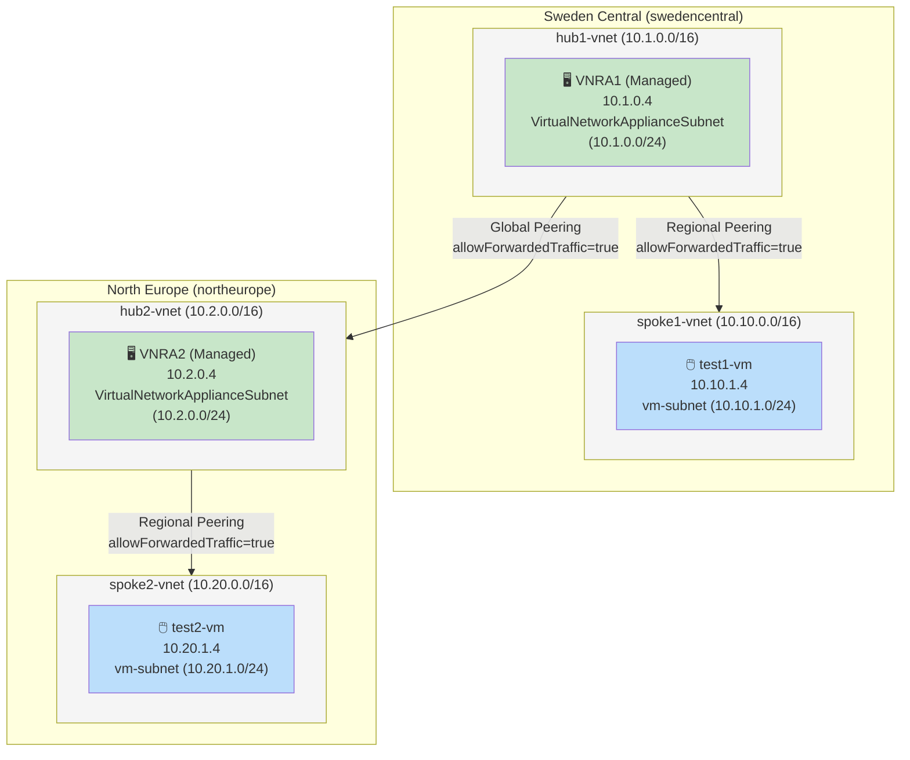

# Topology Overview: dual-hub-vnra-udr-transit

## Mermaid Diagram

## Legend

- **🖥️ VNRA (Green)**: Managed Azure Virtual Network Routing Appliance (Microsoft.Network/virtualNetworkAppliances)
  - No user NIC, no OS disk, no cloud-init configuration
  - Bandwidth tier: 50 Gbps per VNRA
  - Hardware-based forwarding (invisible to TTL/traceroute probes)
  - Private IPs assigned by ARM control plane

- **🖱️ VM (Blue)**: Standard Azure VM with manageable NIC
  - test1-vm: Standard_B2ts_v2, 10.10.1.4, swedencentral
  - test2-vm: Standard_B2ts_v2, 10.20.1.4, northeurope

- **VNet Peerings**: All transit paths require `allowForwardedTraffic=true` on both directions
  - Regional peerings: hub-to-spoke within same region
  - Global peering: hub-to-hub cross-region (swedencentral ↔ northeurope)

