# Forward + Return Data Path: UDR Chaining via VNRA

## Forward: test1-vm (10.10.1.4) → test2-vm (10.20.1.4)

```mermaid
graph LR
    TEST1["🖱️ test1-vm<br/>10.10.1.4<br/>spoke1-vnet"]
    RT1["rt-spoke1<br/>10.20.0.0/16<br/>→ VA 10.1.0.4"]
    VNRA1["🖥️ VNRA1<br/>10.1.0.4<br/>hub1-vnet"]
    RT1H["rt-hub1-vnra<br/>10.20.0.0/16<br/>→ VA 10.2.0.4<br/>(E1 Empirical)"]
    VNRA2["🖥️ VNRA2<br/>10.2.0.4<br/>hub2-vnet"]
    SYS2["System Route<br/>10.20.0.0/16<br/>→ Peering<br/>spoke2-vnet"]
    TEST2["🖱️ test2-vm<br/>10.20.1.4<br/>spoke2-vnet"]

    TEST1 -->|lookup| RT1
    RT1 -->|next-hop| VNRA1
    VNRA1 -->|lookup| RT1H
    RT1H -->|next-hop<br/>via global peering| VNRA2
    VNRA2 -->|lookup| SYS2
    SYS2 -->|via regional peering| TEST2

    style TEST1 fill:#bbdefb
    style TEST2 fill:#bbdefb
    style VNRA1 fill:#c8e6c9
    style VNRA2 fill:#c8e6c9
    style RT1 fill:#fff9c4
    style RT1H fill:#fff9c4,stroke:#ff6f00,stroke-width:3px
    style SYS2 fill:#fff9c4
```

## Return: test2-vm (10.20.1.4) → test1-vm (10.10.1.4)

```mermaid
graph LR
    TEST2["🖱️ test2-vm<br/>10.20.1.4<br/>spoke2-vnet"]
    RT2["rt-spoke2<br/>10.10.0.0/16<br/>→ VA 10.2.0.4"]
    VNRA2["🖥️ VNRA2<br/>10.2.0.4<br/>hub2-vnet"]
    RT2H["rt-hub2-vnra<br/>10.10.0.0/16<br/>→ VA 10.1.0.4<br/>(E1 Empirical)"]
    VNRA1["🖥️ VNRA1<br/>10.1.0.4<br/>hub1-vnet"]
    SYS1["System Route<br/>10.10.0.0/16<br/>→ Peering<br/>spoke1-vnet"]
    TEST1["🖱️ test1-vm<br/>10.10.1.4<br/>spoke1-vnet"]

    TEST2 -->|lookup| RT2
    RT2 -->|next-hop| VNRA2
    VNRA2 -->|lookup| RT2H
    RT2H -->|next-hop<br/>via global peering| VNRA1
    VNRA1 -->|lookup| SYS1
    SYS1 -->|via regional peering| TEST1

    style TEST2 fill:#bbdefb
    style TEST1 fill:#bbdefb
    style VNRA2 fill:#c8e6c9
    style VNRA1 fill:#c8e6c9
    style RT2 fill:#fff9c4
    style RT2H fill:#fff9c4,stroke:#ff6f00,stroke-width:3px
    style SYS1 fill:#fff9c4
```

## UDR Chaining Summary

### Route Tables (Created in manifest)

| Route Table | Subnet | CIDR | Next Hop Type | Next Hop IP | Purpose |
|---|---|---|---|---|---|
| `rt-spoke1` | spoke1-vnet/vm-subnet | 10.20.0.0/16 | VirtualAppliance | 10.1.0.4 | Spoke1 ingress → VNRA1 |
| `rt-hub1-vnra` | hub1-vnet/VirtualNetworkApplianceSubnet | 10.20.0.0/16 | VirtualAppliance | 10.2.0.4 | **[E1]** Cross-hub forward: VNRA1 → VNRA2 via global peering |
| `rt-hub2-vnra` | hub2-vnet/VirtualNetworkApplianceSubnet | 10.10.0.0/16 | VirtualAppliance | 10.1.0.4 | **[E1]** Cross-hub return: VNRA2 → VNRA1 via global peering |
| `rt-spoke2` | spoke2-vnet/vm-subnet | 10.10.0.0/16 | VirtualAppliance | 10.2.0.4 | Spoke2 ingress → VNRA2 |

### Key Constraints Met

1. ✅ **allowForwardedTraffic=true** on all peerings (hub-spoke regional, hub-hub global)
2. ✅ **No NIC ip_forward flag** required (VNRA has no user NIC)
3. ✅ **No cloud-init** required (VNRA is managed hardware)
4. ✅ **VirtualAppliance next-hop** across global peering is valid (VNet peering docs)
5. ✅ **No ILB in front** of VNRA (unsupported per docs)

### Empirical Gates

- **[E1]**: Cross-VNRA UDR chaining (rt-hub1-vnra and rt-hub2-vnra)
  - Unproven at lab creation; expected pass in S2 validation
  - Expected observable: 0% packet loss, no TTL hops at VNRA IPs (hardware forwarding invisible)

