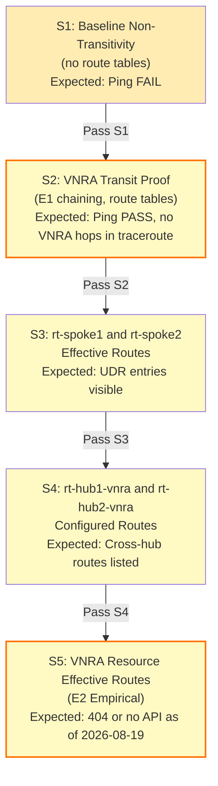

# Observability & Evidence Surfaces

## Validation Probes (S1-S5 from design.md)

## Observable Surfaces by Tool & Scope

### (A) Ping & Traceroute (S2)

| Probe | Command | Expected Result | Observed |
|---|---|---|---|
| **Forward** | `test1-vm: ping 10.20.1.4` | 0% loss | 🖱️ test1 ↔ VNRA1 ↔ VNRA2 ↔ 🖱️ test2 |
| **Return** | `test2-vm: ping 10.10.1.4` | 0% loss | Symmetric reverse path |
| **Traceroute** | `test1-vm: traceroute 10.20.1.4` | No hops at 10.1.0.4 or 10.2.0.4 | Hardware forwarding invisible to TTL |
| **Proof** | Absence of hop ≡ managed VNRA | vs. VM NVA (would appear as hop) | Definitive distinguisher |

### (B) Spoke Subnet Effective Routes (S3)

| API | Scope | Expected Result |
|---|---|---|
| `az network nic show-effective-route-table` | test1-vm NIC (spoke1-vnet/vm-subnet) | Returns rt-spoke1 route: 10.20.0.0/16 → VA 10.1.0.4 |
| `az network nic show-effective-route-table` | test2-vm NIC (spoke2-vnet/vm-subnet) | Returns rt-spoke2 route: 10.10.0.0/16 → VA 10.2.0.4 |
| **Tool** | **Scope** | **Remark** |
| CLI | VM NIC (user-managed) | ✅ Works for test1/test2 |

### (C) Hub Route Tables (S4)

| CLI Command | Scope | Expected Routes | Type |
|---|---|---|---|
| `az network route-table route list --route-table-name rt-spoke1` | rt-spoke1 | 10.20.0.0/16 → VA 10.1.0.4 | Configured |
| `az network route-table route list --route-table-name rt-hub1-vnra` | rt-hub1-vnra | 10.20.0.0/16 → VA 10.2.0.4 | Configured [E1] |
| `az network route-table route list --route-table-name rt-hub2-vnra` | rt-hub2-vnra | 10.10.0.0/16 → VA 10.1.0.4 | Configured [E1] |
| `az network route-table route list --route-table-name rt-spoke2` | rt-spoke2 | 10.10.0.0/16 → VA 10.2.0.4 | Configured |
| **Verdict** | | Route entries always present (creation artifact) | Always observable |

### (D) VNRA Resource State (Probe B in design.md)

| Probe | Method | Scope | Expected Result | API as of 2026-08-19 |
|---|---|---|---|---|
| IP Address & provisioning state | `az rest GET ...virtualNetworkAppliances/vnra1` | VNRA resource | ✅ Returns 10.1.0.4, provisioningState=Succeeded | ✅ Yes |
| Effective routes for VNRA | `az rest GET ...virtualNetworkAppliances/vnra1/effectiveRouteTable` | VNRA subnet | ❓ 404 or no documented endpoint | ❌ No API as of 2026-08-19 [E2] |
| Subnet-scope effective routes | `az rest GET ...virtualNetworks/hub1-vnet/subnets/VirtualNetworkApplianceSubnet/effectiveRouteTable` | Subnet (not NIC) | ❓ 404 expected (may not exist) | Empirical [E2] |
| **Verdict** | | VNRA managed resource | No direct effective-route verification possible | Production gap |

### (E) Network Watcher: Next Hop (S4 verification)

| Hop Check | Source | Destination | Expected | Confidence |
|---|---|---|---|---|
| test1-vm → 10.20.1.4 | 10.10.1.4 | 10.20.1.4 via rt-spoke1 | nextHopType=VirtualAppliance, nextHopIpAddress=10.1.0.4 | High |
| VNRA1 subnet 10.20.0.0/16 | (within hub1) | 10.20.0.0/16 via rt-hub1-vnra | nextHopType=VirtualAppliance, nextHopIpAddress=10.2.0.4 [E1] | High (configured, not yet empirical) |
| **Tool** | **Scope** | **Result** | **Remark** | |
| CLI | Route table configuration | ✅ Deterministic | Always observable |

## Observability Summary

| Surface | Observable | Proof | Gate |
|---|---|---|---|
| Spoke UDR entries | ✅ Yes | CLI + test VM NIC | Baseline |
| Hub UDR entries | ✅ Yes | CLI (route table config) | Baseline |
| VNRA resource state | ✅ Yes | REST API GET | Baseline |
| VNRA effective routes | ❌ No | No documented API | [E2] Empirical gap |
| Subnet effective routes | ❓ Unknown | Empirical probe needed | [E2] Empirical investigation |
| Cross-VNRA chaining | ✅ Inferred | ICMP 0% loss + traceroute absence | [E1] Empirical proof (S2) |
| Hardware forwarding | ✅ Yes | Traceroute shows no VNRA hops | [E1] Definitive proof |

