# Cleanup Boundary & Dependency Chain

## Resource Dependency Graph (Deletion Order)

```mermaid
graph TD
    RG["Resource Group<br/>rg-dual-hub-vnra-udr-transit<br/>(swedencentral)"]
    
    subgraph VNets["VNets & Subnets"]
        H1["hub1-vnet (10.1.0.0/16)<br/>+ VirtualNetworkApplianceSubnet"]
        H2["hub2-vnet (10.2.0.0/16)<br/>+ VirtualNetworkApplianceSubnet"]
        S1["spoke1-vnet (10.10.0.0/16)<br/>+ vm-subnet"]
        S2["spoke2-vnet (10.20.0.0/16)<br/>+ vm-subnet"]
    end

    subgraph Peerings["VNet Peerings<br/>(must exist during UDR validation)"]
        P1["hub1-vnet ↔ spoke1-vnet<br/>(Regional)"]
        P2["hub2-vnet ↔ spoke2-vnet<br/>(Regional)"]
        P3["hub1-vnet ↔ hub2-vnet<br/>(Global)"]
    end

    subgraph VNRA_RES["VNRA Managed Resources"]
        VNRA1["vnra1<br/>(10.1.0.4)<br/>swedencentral"]
        VNRA2["vnra2<br/>(10.2.0.4)<br/>northeurope"]
    end

    subgraph Routes["Route Tables"]
        RT1["rt-spoke1<br/>on spoke1-vnet/vm-subnet"]
        RT2["rt-spoke2<br/>on spoke2-vnet/vm-subnet"]
        RT1H["rt-hub1-vnra<br/>on hub1-vnet/VirtualNetworkApplianceSubnet"]
        RT2H["rt-hub2-vnra<br/>on hub2-vnet/VirtualNetworkApplianceSubnet"]
    end

    subgraph VMs["Test VMs"]
        TEST1["test1-vm<br/>10.10.1.4<br/>+ NIC + OSDisk"]
        TEST2["test2-vm<br/>10.20.1.4<br/>+ NIC + OSDisk"]
    end

    subgraph NSGs["NSGs (Auto-created)"]
        NSG1["spoke1 NSG"]
        NSG2["spoke2 NSG"]
        NSG3["hub1 VNRA NSG"]
        NSG4["hub2 VNRA NSG"]
    end

    RG --> VNets
    RG --> Peerings
    RG --> VNRA_RES
    RG --> Routes
    RG --> VMs
    RG --> NSGs

    H1 --> P1
    H1 --> P3
    S1 --> P1
    H2 --> P2
    H2 --> P3
    S2 --> P2

    H1 --> VNRA1
    H2 --> VNRA2
    
    H1 --> RT1H
    H2 --> RT2H
    S1 --> RT1
    S2 --> RT2

    S1 --> TEST1
    S2 --> TEST2

    S1 --> NSG1
    S2 --> NSG2
    H1 --> NSG3
    H2 --> NSG4

    style RG fill:#ffcdd2,stroke:#c62828,stroke-width:3px
    style VNRA1 fill:#c8e6c9
    style VNRA2 fill:#c8e6c9
    style TEST1 fill:#bbdefb
    style TEST2 fill:#bbdefb
```



## Cleanup Sequence (from deepest dependency to RG delete)

### Phase 1: Deallocate & Delete Compute

1. **Stop & Deallocate VMs**
   ```powershell
   az vm deallocate --ids /subscriptions/.../test1-vm /subscriptions/.../test2-vm
   ```
   - Releases compute capacity; disk stays attached

2. **Delete VMs (cascade removes NICs + OS disks)**
   ```powershell
   az vm delete --ids /subscriptions/.../test1-vm /subscriptions/.../test2-vm
   ```

### Phase 2: Detach Route Tables

3. **Detach Route Tables from Subnets** (association must be removed before deletion)
   ```powershell
   az network vnet subnet update \
     --vnet-name hub1-vnet --name VirtualNetworkApplianceSubnet \
     --resource-group rg-dual-hub-vnra-udr-transit \
     --route-table ""
   ```
   - Repeat for hub2-vnet/VirtualNetworkApplianceSubnet, spoke1-vnet/vm-subnet, spoke2-vnet/vm-subnet

4. **Delete Route Tables**
   ```powershell
   az network route-table delete --name rt-spoke1 -g rg-dual-hub-vnra-udr-transit
   # Repeat for rt-spoke2, rt-hub1-vnra, rt-hub2-vnra
   ```

### Phase 3: Delete VNRA Managed Resources

5. **Delete VNRA Resources** (must occur BEFORE peering deletion; VNet cannot be deleted while VNRA is attached)
   ```powershell
   az rest --method DELETE \
     --url "https://management.azure.com/subscriptions/$(az account show --query id -o tsv)/resourceGroups/rg-dual-hub-vnra-udr-transit/providers/Microsoft.Network/virtualNetworkAppliances/vnra1?api-version=2025-05-01"
   # Repeat for vnra2
   ```
   - OR via PowerShell: `Remove-AzVirtualNetworkAppliance -Name vnra1 ...`

### Phase 4: Remove Peerings

6. **Delete VNet Peerings**
   ```powershell
   az network vnet peering delete \
     --name hub1-to-spoke1 --vnet-name hub1-vnet -g rg-dual-hub-vnra-udr-transit
   # Repeat for all 3 peerings (hub1↔spoke1, hub2↔spoke2, hub1↔hub2)
   ```
   - Each peering is a separate resource; both directions must be deleted

### Phase 5: Delete Network Infrastructure

7. **Delete VNets** (cascade removes all subnets + NSGs)
   ```powershell
   az network vnet delete --name hub1-vnet -g rg-dual-hub-vnra-udr-transit
   # Repeat for hub2-vnet, spoke1-vnet, spoke2-vnet
   ```

### Phase 6: Delete Resource Group

8. **Delete Resource Group** (cascades all remaining resources)
   ```powershell
   az group delete --name rg-dual-hub-vnra-udr-transit --yes --no-wait
   ```

## Cleanup Dependency Matrix

| Resource | Depends On | Delete Before | Critical Path |
|---|---|---|---|
| test1-vm / test2-vm | S1/S2 subnets | Subnet deletion | 🔴 Phase 1 |
| rt-spoke1 / rt-spoke2 | Subnet association | Subnet deletion | 🔴 Phase 2 |
| rt-hub1-vnra / rt-hub2-vnra | VNRA existence (optional) | Subnet deletion | 🔴 Phase 2 |
| vnra1 / vnra2 | VNet & subnet | Peering deletion | 🔴 Phase 3 |
| hub1↔spoke1 peering | Both VNets | VNet deletion | 🟡 Phase 4 |
| hub1↔hub2 peering (global) | Both VNets + VNRA chaining | VNet deletion | 🟡 Phase 4 |
| hub1-vnet / hub2-vnet | All subnets + peerings | RG deletion | 🟡 Phase 5 |
| spoke1-vnet / spoke2-vnet | All subnets + peerings | RG deletion | 🟡 Phase 5 |
| rg-dual-hub-vnra-udr-transit | Entire contents | N/A | 🟢 Phase 6 |

## Cost Optimization (before cleanup)

| Action | Savings | Timing |
|---|---|---|
| Deallocate test VMs (keep disks) | ~$0.015/hr per VM | After S5 validation complete |
| Delete OS disks (if not needed for reference) | ~$0.04/GB-month (32 GB = ~$1.28/month) | Optional; keeper disks save time on re-test |
| Delete NSGs (if created) | ~$0.015/NSG-month each (4 NSGs = ~$0.06/month) | Phase 5 |
| Delete route tables (if re-deployment planned) | No charge (only storage) | Phase 2 |
| VNRA lingering | ~$0.67-3.50/hr per VNRA (pricing unconfirmed) | 🔴 Delete ASAP after S2 validation |

