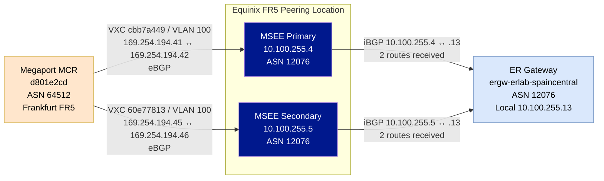
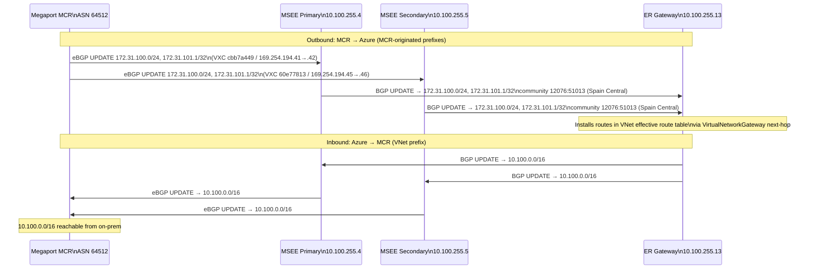
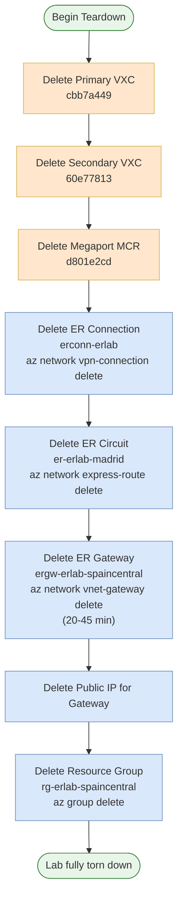

# expressroute-megaport-bgp

ExpressRoute + Megaport MCR validation lab for a Spain Central VNet connected through a provider-based ExpressRoute circuit and two Megaport VXCs.

## Deployed state validated

- Resource group: `rg-erlab-spaincentral`
- ExpressRoute circuit: `er-erlab-madrid`
- ExpressRoute gateway: `ergw-erlab-spaincentral`
- ER connection: `erconn-erlab`
- Validation VM: `vm-erlab-test` / NIC `nic-erlab-vm`
- Megaport MCR: Frankfurt FR5 (`locationId=131`)
- MCR-advertised routes observed in Azure: `172.31.100.0/24`, `172.31.101.1/32`

## Outcomes / validation results

- Provider gate passed: circuit is `Enabled` and `serviceProviderProvisioningState` is `Provisioned`.
- Azure gateway learned the MCR prefixes on both gateway instances, and the VM NIC effective route table points those prefixes to `VirtualNetworkGateway`.
- Megaport MCR and both VXCs are `LIVE`; both VXC resources report VLL `up: 1`.
- VLAN finding: both primary and secondary VXCs are configured with VLAN `100`. This matches Tank's report and differs from the preferred `100/200` plan.
- The ER circuit route-table CLI command returned `Gateway does not have any Bgp sessions` on both primary and secondary paths despite ARP, gateway learned routes, and VM effective routes showing convergence.
- MCR looking-glass/route-community evidence was inconclusive because the documented API path returned no endpoint in this session.
- Late VM ping and effective NSG checks were blocked because the VM deallocated; no start/action was taken.

See `validation.md` for pass/fail detail and `show-output/` for raw sanitized command output.

## Evidence layout

- `show-output/` — one file per command, with the exact command as line 1.
- `validation.md` — checklist derived from `manifest.md` §6 and §9.
- `lessons-learned.md` — live gotchas and anomalies captured during validation.
- `screenshots/` — created for optional screenshots; no screenshots captured in this run.
- `diagrams/` — topology drawio, BGP control plane, route propagation, and cleanup-chain diagrams.

## Diagrams

### Diagram 1 — Physical / logical topology

Three-zone overview: Megaport MCR in Frankfurt FR5, Equinix FR5 peering location with MSEE primary and secondary routers, and the Azure Spain Central VNet with ER gateway and test VM. Shows both VXC connections and the private peering link.

Open in draw.io for the full interactive view: [Source (draw.io)](diagrams/01-topology.drawio)

### Diagram 2 — BGP control plane

BGP session graph showing eBGP sessions between the Megaport MCR (ASN 64512) and the two MSEE peers (ASN 12076), then the iBGP relay to the ER gateway. Includes VXC IDs, VLAN 100, link-local BGP addresses, and the 2-route-received count on both gateway sessions.

[Source (Mermaid)](diagrams/02-bgp-control-plane.mmd)

### Diagram 3 — Route propagation

Sequence diagram tracing prefix flow in both directions: MCR-originated prefixes (`172.31.100.0/24`, `172.31.101.1/32`) propagating into Azure with BGP community `12076:51013`, and the VNet prefix (`10.100.0.0/16`) flowing back to the MCR.

[Source (Mermaid)](diagrams/03-route-propagation.mmd)

### Diagram 4 — Cleanup chain

Ordered teardown sequence from VXC deletion through MCR, ER connection, ER circuit, ER gateway (20–45 min), gateway public IP, and final resource group deletion. Colour-coded: orange = Megaport resources, blue = Azure resources.

[Source (Mermaid)](diagrams/04-cleanup-chain.mmd)
