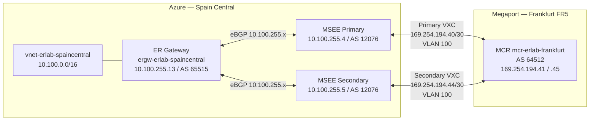

# Your Megaport BGP session is `Connected` — but did your prefixes make it to Azure?

*A three-layer verification guide from a real ExpressRoute lab — including two places where the tooling will actively mislead you.*

---

`az network vnet-gateway list-bgp-peer-status` says `Connected`. Megaport's API shows
your MCR as `LIVE`. Both VXCs report `up: true`. Time to declare success and go home?

Not yet. This post walks through what a complete BGP verification actually looks like for
an ExpressRoute + Megaport MCR deployment, using real command output captured from a
working lab. Along the way we hit two observable failure modes that the happy-path
documentation does not cover: a route-table command that lies for the first 25 minutes,
and a gateway that reports it has learned routes from a prefix you never actually
advertised.

## The lab in 60 seconds

- **Azure side**: An ExpressRoute circuit (`er-erlab-madrid`) with peering location
  **Madrid**, connected via an ER gateway (`ergw-erlab-spaincentral`, Standard SKU) to a
  VNet (`vnet-erlab-spaincentral`, `10.100.0.0/16`) in Spain Central. VNet BGP community
  set to `12076:20031`.
- **Megaport side**: An MCR (`mcr-erlab-frankfurt-b8c748bc`) at **Equinix Frankfurt FR5**
  — not Madrid — plus two VXCs terminating at the Madrid primary and secondary MSEE ports.
- **Objective**: Confirm dual-path BGP sessions, verify that a simulated on-prem prefix
  (`172.31.100.0/24`) propagates from the MCR to Azure, and document VNet community
  visibility end-to-end.

The full infrastructure-as-code plan, per-command evidence files, and pass/fail checklist
are linked in the references.

## The headline finding

> **BGP is `Connected`. The prefix is not there.**

By every top-level health indicator the control plane looked healthy. The gateway showed
two `Connected` MSEE peers. The MCR had `bgpShutdownDefault: false`. Both VXCs were
`LIVE` and `up: true`.

Then `az network vnet-gateway list-learned-routes` told the actual story:

```json
{
  "value": [
    { "network": "10.100.0.0/16",      "origin": "Network", "weight": 32768 },
    { "network": "169.254.194.44/30",  "asPath": "12076-64512", "origin": "EBgp",
      "nextHop": "10.100.255.4" },
    { "network": "169.254.194.44/30",  "asPath": "12076-64512", "origin": "EBgp",
      "nextHop": "10.100.255.5" },
    { "network": "169.254.194.40/30",  "asPath": "12076-64512", "origin": "EBgp",
      "nextHop": "10.100.255.4" },
    { "network": "169.254.194.40/30",  "asPath": "12076-64512", "origin": "EBgp",
      "nextHop": "10.100.255.5" }
  ]
}
```

Every eBGP-learned route carries AS path `12076-64512`. The MSEE (AS `12076`) is
reflecting what it learns from the MCR (AS `64512`) back to the gateway — but what it
learned from the MCR is only the **BGP peering link subnets** (`169.254.194.40/30` and
`169.254.194.44/30`). The simulated on-prem prefix `172.31.100.0/24` is nowhere in
the list.

Meanwhile, the other natural tool to check — `az network express-route list-route-tables`
— returned this for the first 25 minutes after the BGP sessions formed:

```
Gateway does not have any Bgp sessions.
```

It was wrong. We will come back to why.

## BGP control-plane anatomy

Before interpreting any output, it helps to know which router each CLI command talks to.



Key architectural fact: **the ER gateway does not peer directly with the MCR**. The
gateway speaks eBGP with the MSEE pair at `10.100.255.4/.5`. The MSEE peers with the MCR
at the link-local `169.254.194.x` addresses. Routes from the MCR arrive at the MSEE,
which reflects them to the gateway. This is why `list-advertised-routes --peer
169.254.194.42` (the MCR-side link-local) always returns empty from the Azure CLI — the
gateway has no direct BGP session with that IP.

## Layer 1: The ER gateway view — your BGP health baseline

Start here. The gateway's own view of its BGP state is the fastest and most reliable
health signal:

```bash
az network vnet-gateway list-bgp-peer-status \
  -g rg-erlab-spaincentral \
  -n ergw-erlab-spaincentral \
  -o table
```

From the lab:

```
Neighbor       ASN    State      ConnectedDuration    RoutesReceived
10.100.255.4   12076  Connected  00:19:52.0652940     2
10.100.255.5   12076  Connected  00:19:51.9990310     2
```

Two `Connected` neighbors. `RoutesReceived: 2` per MSEE peer — those are the two BGP
peering link subnets being reflected back. **This is the go/no-go signal for the ER
side.** If this shows `Idle` or `Active`, fix the circuit or gateway before going further.

Note the 19-minute uptime. BGP convergence with ExpressRoute routinely takes 15–25
minutes from initial provisioning, depending on MSEE and provider sequencing. The
`list-route-tables` "no BGP sessions" error you will almost certainly hit early is
exactly this window.

Also confirm ARP resolution for the MCR link-local address:

```bash
az network express-route list-arp-tables \
  -g rg-erlab-spaincentral -n er-erlab-madrid \
  --path primary --peering-name AzurePrivatePeering -o json
```

The lab returned `169.254.194.41` with MAC `02cf.2b02.c22b` — Layer 2 resolved, VXC
physically up.

## Layer 2: The MSEE view — what Microsoft's edge sees

Once the gateway is `Connected`, verify the MSEE's route table:

```bash
az network express-route list-route-tables \
  -g rg-erlab-spaincentral -n er-erlab-madrid \
  --path primary --peering-name AzurePrivatePeering -o json
```

**Early capture (first ~25 minutes after BGP session formation):**

```
Gateway does not have any Bgp sessions.
```

**Later capture (after convergence):**

```json
{
  "value": [
    { "network": "10.100.0.0/16", "nextHop": "10.100.255.13",
      "asPath": "65515",              "weight": 0 },
    { "network": "10.100.0.0/16", "nextHop": "10.100.255.13",
      "asPath": "65515 64512 12076 I","weight": 0 },
    { "network": "169.254.194.40/30","nextHop": "169.254.194.41",
      "asPath": "64512 I",            "weight": 0 },
    { "network": "169.254.194.44/30","nextHop": "169.254.194.41",
      "asPath": "64512 I",            "weight": 0 }
  ]
}
```

The MSEE sees the VNet prefix `10.100.0.0/16` (from the gateway, AS 65515) plus the MCR's
link subnets (AS 64512). No `172.31.100.0/24`.

For a BGP session summary with peer uptime and prefix counts:

```bash
az network express-route list-route-tables-summary \
  -g rg-erlab-spaincentral -n er-erlab-madrid \
  --path primary --peering-name AzurePrivatePeering -o json
```

This returned `statePfxRcd: "3"` for the MCR neighbor (`169.254.194.41`, AS 64512) with
uptime `00:58:09`. Three prefixes received from the MCR: the VNet prefix reflected back,
plus the two link subnets. No additional prefixes. **The BGP session is healthy; the
route-injection step was simply never configured.**

**Why `list-route-tables` returns "no BGP sessions" transiently:** This command reads
the MSEE's route table directly. The MSEE updates that table asynchronously after the
underlying BGP sessions converge. The gateway can reach `Connected` while the MSEE is
still refreshing its view — a window of 15–25 minutes is normal. Use the gateway API as
your primary BGP health check; treat the MSEE route table as a secondary verification
that requires stable sessions before it reflects reality.

## Layer 3: The Megaport view — VXC API as route-table substitute

Megaport does not currently expose a public looking-glass for the MCR; the diagnostics
endpoint returned an empty response in this lab. The practical substitute is the VXC
product resource:

```bash
# Use the generic /v2/product endpoint — type-specific VXC/MCR2 endpoints return 404
curl -s "https://api.megaport.com/v2/product/<mcr-uid>" \
  -H "Authorization: Bearer <megaport-token>" | jq '.data'
```

Inside the primary VXC's `resources.csp_connection` block:

```json
{
  "bgp_peers": ["169.254.194.42"],
  "bgp_status": { "169.254.194.42": 1 },
  "interfaces": [
    {
      "bgpConnections": [
        {
          "localAsn": 64512,
          "localIpAddress": "169.254.194.41",
          "peerAsn": 12076,
          "peerIpAddress": "169.254.194.42",
          "peerType": "PRIV_CLOUD",
          "shutdown": false
        }
      ],
      "ipAddresses": ["169.254.194.41/30"],
      "vlan": 100
    }
  ],
  "peers": [
    {
      "peer_asn": 64512,
      "primary_subnet": "169.254.194.40/30",
      "secondary_subnet": "169.254.194.44/30",
      "type": "private",
      "vlan": 100
    }
  ]
}
```

`bgp_status: 1` = session established. `shutdown: false` = the MCR is not suppressing
the session. This is your confirmation that the Megaport side is healthy. However, this
endpoint does not expose advertised prefix lists or route-policy state — you cannot see
from here whether `172.31.100.0/24` was configured for injection. That configuration
lives in the MCR route policy, which is a separate step from provisioning the VXC.

## Five gotchas

**1. MCR geography does not need to match the ER peering location.**

The MCR is in Frankfurt (Equinix FR5, `locationId: 131`, market `DE`). The ER circuit
peering location is **Madrid** (Digital Realty Interxion MAD2, `locationId: 639`).
BGP sessions came up cleanly across that geographic gap. Megaport's fabric handles the
transport from Frankfurt to the Madrid MSEEs. You do not need to order the MCR at the
same facility as your ER peering location — a significant flexibility advantage when
your preferred MCR location is sold out or more expensive at the peering site.

**2. Both VXCs report `vlan: 100` at the BGP interface level.**

The design called for VLAN 100 (primary) and VLAN 200 (secondary). In the deployed lab,
`interfaces[0].vlan` in both VXC resources shows `100`. The physical cross-connect
transport uses different QinQ inner VLANs (2509 for primary, 190 for secondary), so
there is no actual collision and both paths work. But if you audit the `vlan` field in
the MCR logical interface to verify your VLAN plan, you will see 100 for both and
incorrectly conclude something is misconfigured.

**3. `list-route-tables` lies transiently — use `list-bgp-peer-status` first.**

`az network express-route list-route-tables` calls the MSEE directly and reflects a
view that lags gateway-side BGP reality by up to 25 minutes during initial convergence.
During that window it returns "Gateway does not have any Bgp sessions," which is
factually wrong. The gateway-side `list-bgp-peer-status` command is authoritative and
updated in near-real time. Always check Layer 1 before Layer 2.

**4. `show-effective-route-table` requires a running VM.**

`az network nic show-effective-route-table` returns
`NicMustBeAttachedToRunningVmToGetEffectiveRoutes` if the VM is deallocated. If you
pause a lab VM to save cost between sessions, you lose the ability to verify the
data-plane route table from the OS side until the VM is running again. Plan all
effective-route captures before deallocation, or start the VM explicitly before running
them.

**5. Megaport's MCR looking-glass endpoint may not be available.**

`GET /v2/diagnostics/mcr/{uid}/bgpRoutes` returned empty in this lab. The VXC product
resource (`GET /v2/product/{uid}`) is the practical substitute: it exposes BGP peer
state, link-local IPs, VLAN, and whether the session is `shutdown`. It does not expose
advertised prefix lists or route-policy detail, but it is sufficient to confirm session
health at the Megaport layer.

## The missing piece: BGP session ≠ prefix injection

Establishing an MCR BGP session and advertising a custom prefix are two distinct
operations. Once the VXC is provisioned, the MCR router exchanges link-local subnets
and reflects the Azure VNet prefix automatically — this is the infrastructure baseline.
Injecting `172.31.100.0/24` requires a **route policy** configured on the MCR: a
prefix list and a BGP policy map that injects the static prefix into the eBGP
advertisement toward the MSEE.

In the Megaport portal this is configured under the MCR's BGP Policy settings. In
Terraform, the Megaport provider exposes this via route-filter and prefix-list resources
if supported by the provider version. Without that configuration, no Azure-side tool
will help you debug the missing prefix — because the prefix is absent from the BGP
control plane before it even reaches Azure.

The lesson: when `list-learned-routes` shows only `169.254.x.x/30` link subnets, the
problem is not on the Azure side. Look at the MCR route policy.

## Reproduce it yourself

```bash
# 1. Circuit provisioning state
az network express-route show \
  -g rg-erlab-spaincentral -n er-erlab-madrid \
  --query "{state:circuitProvisioningState,provider:serviceProviderProvisioningState}"

# 2. Gateway BGP health (primary verification — use this first)
az network vnet-gateway list-bgp-peer-status \
  -g rg-erlab-spaincentral -n ergw-erlab-spaincentral -o table

# 3. ARP resolution for MCR link-local (Layer 2 confirm)
az network express-route list-arp-tables \
  -g rg-erlab-spaincentral -n er-erlab-madrid \
  --path primary --peering-name AzurePrivatePeering -o json

# 4. MSEE route table — wait ~20 min; may return "no BGP sessions" initially
az network express-route list-route-tables \
  -g rg-erlab-spaincentral -n er-erlab-madrid \
  --path primary --peering-name AzurePrivatePeering -o json

# 5. Gateway learned routes — authoritative prefix inventory
az network vnet-gateway list-learned-routes \
  -g rg-erlab-spaincentral -n ergw-erlab-spaincentral -o json

# 6. VNet BGP community metadata
az network vnet show \
  -g rg-erlab-spaincentral -n vnet-erlab-spaincentral \
  --query bgpCommunities -o json

# 7. MCR and VXC state via Megaport API (PowerShell example)
# Invoke-RestMethod -Method Get \
#   -Uri "https://api.megaport.com/v2/product/<mcr-uid>" \
#   -Headers @{ Authorization = "Bearer <megaport-token>" } |
#   ConvertTo-Json -Depth 20
```

## Lab outcomes summary

| Area | Result | Notes |
|---|---|---|
| ER circuit provisioned | ✅ Pass | `Enabled` / `Provisioned` |
| Dual VXC physical layer | ✅ Pass | Both VLLs `up: 1`; ARP resolved on both paths |
| BGP sessions Connected | ✅ Pass | Two `Connected` MSEE peers; MCR session `bgp_status: 1` |
| VNet BGP community `12076:20031` | ✅ Pass | Both `virtualNetworkCommunity` and `regionalCommunity` present |
| MCR-originated `172.31.100.0/24` in Azure | ❌ Not demonstrated | MCR route policy not configured; prefix absent from all Azure captures |
| MCR looking-glass | ⚠️ Inconclusive | BGP route diagnostics endpoint returned empty |
| VM data-plane verification | ⚠️ Blocked | VM deallocated before effective-route capture |

## References

- Lab manifest and design specification: `labs/expressroute-megaport-bgp/manifest.md`
- Validation results with per-item evidence: `labs/expressroute-megaport-bgp/validation.md`
- Lessons learned (all gotchas, extended form): `labs/expressroute-megaport-bgp/lessons-learned.md`
- All captured command outputs: `labs/expressroute-megaport-bgp/show-output/`
- Lab source code: `<source-lab-repo-tbd>`
- [Azure ExpressRoute — BGP community support](https://learn.microsoft.com/en-us/azure/expressroute/expressroute-routing#bgp-communities)
- [Megaport MCR documentation](https://docs.megaport.com/mcr/)
- [Megaport VXC Azure connectivity](https://docs.megaport.com/cloud/microsoft-azure/)
