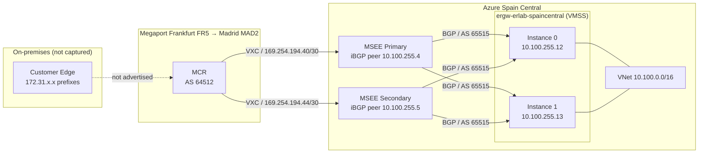

# The route table that didn't lie: diagnosing ExpressRoute BGP with the Azure CLI

ExpressRoute BGP sessions were up. Megaport MCR was live. The circuit was provisioned and showing as `Enabled` in the portal. But the on-premises prefixes that were supposed to reach Azure were missing from every table checked. Most engineers reach for the gateway BGP peer status first. It confirms sessions exist — but it cannot tell you whether the right prefixes arrived. There is a better first command, and this post walks through exactly what it showed, including a configuration gap the data could not hide and the things that were impossible to verify before the lab was torn down.

---

## The headline finding

`az network express-route list-route-tables` queries the MSEE (Microsoft Enterprise Edge) router and returns its BGP routing table directly. This is the most authoritative prefix-level view available from the Azure CLI — it shows what Microsoft's edge actually received, path by path, before any Azure-internal routing decisions.

```bash
az network express-route list-route-tables \
  -g rg-erlab-spaincentral \
  --name er-erlab-madrid \
  --peering-name AzurePrivatePeering \
  --path primary \
  -o json
```

**Primary MSEE route table — 5 entries:**

| Network | Next-Hop | LocPrf | Weight | AS-PATH |
|---|---|---|---|---|
| `10.100.0.0/16` | `10.100.255.13` ★ | 100 | 0 | 65515 |
| `10.100.0.0/16` | `10.100.255.12` | 100 | 0 | 65515 |
| `10.100.0.0/16` | `169.254.194.41` | 100 | 0 | 64512 12076 |
| `169.254.194.40/30` | `169.254.194.41` | 100 | 0 | 64512 |
| `169.254.194.44/30` | `169.254.194.41` | 100 | 0 | 64512 |

★ Active route.

Five routes in total: two equal-cost paths to the Azure VNet (`10.100.0.0/16`) via the two gateway VMSS instances (AS 65515), the same VNet prefix reflected back from the MCR with AS-PATH `64512 12076` (the MCR received it from the MSEE and advertised it back — a BGP reflection artefact), and the two VXC link-local /30 subnets advertised directly by the MCR (AS 64512).

> **Raw JSON detail:** The `path` field in the API response appends a BGP origin code — for example, `"65515 I"`. The `I` means IGP origin. It is not part of the AS-PATH and should be stripped when reading the table.

No `172.31.*` prefixes anywhere. Those were the on-premises address ranges this lab was built to route into Azure. They never arrived at the MSEE.

The companion summary command shows the BGP sessions that produced this table:

```bash
az network express-route list-route-tables-summary \
  -g rg-erlab-spaincentral \
  --name er-erlab-madrid \
  --peering-name AzurePrivatePeering \
  --path primary \
  -o json
```

**Primary MSEE BGP session summary:**

| Neighbor | AS | Prefixes Received | Uptime |
|---|---|---|---|
| `10.100.255.12` | 65515 | 1 | 00:25:24 |
| `10.100.255.13` | 65515 | 1 | 00:25:24 |
| `169.254.194.41` | 64512 | 3 | 00:58:09 |

Three sessions, all established. The MCR (AS 64512) had been peered for 58 minutes and sent exactly three prefixes — which account for all five MSEE table entries (the VNet prefix appeared twice on the MSEE because the MCR reflected it back as a third path). Session health was not the problem. The MCR simply had not advertised the `172.31.*` address space by the time these outputs were captured.

---

## How it works under the hood

The path from on-premises to an Azure VNet via ExpressRoute and Megaport crosses more BGP hops than the product diagrams suggest. The gateway never has a direct BGP session with the MCR. The MSEE is the relay.



### The hidden VMSS behind the gateway

An ExpressRoute gateway appears as a single resource in the portal, but it runs as a VMSS with two instances. The portal does not show the instances. The CLI does, through a path that is not obvious:

```bash
az network vnet show \
  -g rg-erlab-spaincentral \
  -n vnet-erlab-spaincentral \
  --query "subnets[?name=='GatewaySubnet'].ipConfigurations[]" \
  -o json
```

The `GatewaySubnet.ipConfigurations` array lists three IP configuration records. Each VMSS instance appears by path inside the `id` field:

| Resource path in `id` | IP | Notes |
|---|---|---|
| `ERGW/VIRTUALMACHINES/0` | `10.100.255.12` | Instance 0, in managed RG `ARMRG-6CF50055-...` |
| `ERGW/VIRTUALMACHINES/1` | `10.100.255.13` | Instance 1, same managed RG |

Both instances run regardless of whether the gateway is configured for active-active mode. Active-active is an additional feature that lets you use both instance IPs for VPN tunnels; at the ExpressRoute level, both instances always participate in BGP.

### The full BGP session matrix

Six BGP sessions span this topology. No single command returns all six; this table assembles them from three different API calls:

| From | To | Neighbor AS | Prefixes | Uptime | Source API |
|---|---|---|---|---|---|
| MSEE primary | Gateway `10.100.255.12` | 65515 | 1 | 00:25:24 | `list-route-tables-summary --path primary` |
| MSEE primary | Gateway `10.100.255.13` | 65515 | 1 | 00:25:24 | `list-route-tables-summary --path primary` |
| MSEE primary | MCR `169.254.194.41` | 64512 | 3 | 00:58:09 | `list-route-tables-summary --path primary` |
| MSEE secondary | MCR `169.254.194.45` | 64512 | 2 | — | `list-route-tables-summary --path secondary` |
| Gateway `.13` | MSEE primary `.4` | 12076 | 2 rcvd | 00:19:22 | `list-bgp-peer-status` |
| Gateway `.13` | MSEE secondary `.5` | 12076 | 2 rcvd | 00:19:20 | `list-bgp-peer-status` |

`list-route-tables-summary` is the only command that shows sessions to both gateway VMSS instances simultaneously. `list-bgp-peer-status` only returns sessions from whichever instance handles the API call.

### What the gateway has learned

```bash
az network vnet-gateway list-learned-routes \
  -g rg-erlab-spaincentral \
  -n ergw-erlab-spaincentral \
  -o json
```

**Gateway learned routes (from instance `10.100.255.13`):**

| Network | Next-Hop | Source Peer | AS-PATH | Origin |
|---|---|---|---|---|
| `10.100.0.0/16` | — | `10.100.255.13` | (empty) | Network |
| `169.254.194.44/30` | `10.100.255.4` | `10.100.255.4` | `12076-64512` | EBgp |
| `169.254.194.44/30` | `10.100.255.5` | `10.100.255.5` | `12076-64512` | EBgp |
| `169.254.194.40/30` | `10.100.255.4` | `10.100.255.4` | `12076-64512` | EBgp |
| `169.254.194.40/30` | `10.100.255.5` | `10.100.255.5` | `12076-64512` | EBgp |

The AS-PATH `12076-64512` on the VXC link-local prefixes confirms the relay architecture: the gateway's BGP peers are the MSEEs (AS 12076), which relay what they received from the MCR (AS 64512). The gateway has no direct BGP session with the MCR and never sees the MCR's ASN as the immediate peer. No `172.31.*` routes appear here either.

### Primary and secondary MSEEs prefer different gateway instances

Running the same command against `--path secondary` reveals something worth understanding:

```bash
az network express-route list-route-tables \
  -g rg-erlab-spaincentral \
  --name er-erlab-madrid \
  --peering-name AzurePrivatePeering \
  --path secondary \
  -o json
```

**Secondary MSEE route table — 4 entries:**

| Network | Next-Hop | LocPrf | Weight | AS-PATH |
|---|---|---|---|---|
| `10.100.0.0/16` | `10.100.255.12` ★ | 100 | 0 | 65515 |
| `10.100.0.0/16` | `10.100.255.13` | 100 | 0 | 65515 |
| `169.254.194.40/30` | `169.254.194.45` | 100 | 0 | 64512 |
| `169.254.194.44/30` | `169.254.194.45` | 100 | 0 | 64512 |

★ Active route.

Two things stand out. First, the secondary MSEE's active next-hop for the VNet is instance `.12`, while the primary MSEE preferred instance `.13`. This is intentional load distribution across the redundant path pairs — not misconfiguration. Second, the secondary has four routes, not five: the reflected VNet entry (`10.100.0.0/16` via `169.254.194.45`) is absent. The MCR reflected the VNet prefix only on the primary VXC BGP session during the capture window.

### ARP confirms a single MCR underlay

```bash
az network express-route list-arp-tables \
  -g rg-erlab-spaincentral --name er-erlab-madrid \
  --peering-name AzurePrivatePeering --path primary -o json

az network express-route list-arp-tables \
  -g rg-erlab-spaincentral --name er-erlab-madrid \
  --peering-name AzurePrivatePeering --path secondary -o json
```

| Path | Peer IP | MAC | Age (s) |
|---|---|---|---|
| Primary | `169.254.194.41` | `02cf.2b02.c22b` | 1089 |
| Secondary | `169.254.194.45` | `02cf.2b02.c22b` | 986 |

Both VXC peers resolve to the same MAC. A single MCR virtual router handles both ExpressRoute connections. ARP age shows the primary path peer has been reachable 103 seconds longer — consistent with the MCR having had the BGP session to the primary up first.

---

## Gotchas

**`list-bgp-peer-status` only shows sessions from one gateway VMSS instance.** The gateway runs two VMSS instances but this API only returns sessions visible from whichever instance handles the call. In this lab it was always instance `.13`. Instance `.12` was fully peered and appeared in the MSEE route table summary — but was invisible to `list-bgp-peer-status`. If you are checking gateway BGP health, `list-route-tables-summary` is the more complete view.

**`list-advertised-routes` against non-peer IPs returns empty — and that is correct.** Querying `az network vnet-gateway list-advertised-routes` with the VXC link-local IPs (`169.254.194.41`, `169.254.194.45`) as the peer argument returns `{"value": []}`. Those are the MSEE-to-MCR BGP peers, not the gateway's BGP peers. The gateway never has a direct session with them, so returning nothing is the right answer, not an error.

**`show-effective-route-table` requires a running VM.** This command fails with an error if the target VM is deallocated. If an effective-route query fails mid-investigation, start the VM first.

**`enableBgp: false` on the connection object is normal for ExpressRoute.** The `az network express-route-circuit connection show` output (and the VPN connection view) shows `"enableBgp": false`. This field governs BGP for VPN connections. For ExpressRoute, BGP is configured at the circuit and peering level — the connection object's `enableBgp` field has no bearing on whether BGP is working.

**The Megaport MCR looking glass is unreliable near teardown.** The BGP diagnostics endpoint (`/v2/product/mcr2/{uuid}/diagnostics/routes/bgp`) returned an HTTP 200 with an empty body during this investigation. The lab was being torn down at the time. Use the Azure-side `list-route-tables` as the primary diagnostic tool — it queries a Microsoft-controlled endpoint and is not affected by MCR state.

**Megaport type-specific GET endpoints return HTTP 405.** Calling `/v2/product/mcr2/{uuid}` or `/v2/product/vxc/{uuid}` returns `405 Method Not Allowed`. Use the generic product endpoint `/v2/product/{uuid}` for GET requests against any resource type.

**VXC VLANs may use QinQ.** This lab used QinQ encapsulation: outer VLAN 948, inner VLANs 2509 and 190. If VLAN tagging is causing connectivity problems, check the `innerVlans` array in the Megaport API response, not just the top-level VLAN field.

---

## What we could not verify

**Why the `172.31.*` prefixes were absent.** The MCR BGP session to the MSEE primary had 58 minutes of uptime and sent three prefixes — the two VXC link-local /30s and a reflected copy of the Azure VNet. The lab's intended on-premises ranges (`172.31.100.0/24`, `172.31.101.1/32`) were not in the MCR's advertisement at the time of capture. The MCR looking glass returned an empty body, so the MCR-side BGP table could not be confirmed. The most probable explanation is an incomplete or missing BGP prefix advertisement configuration on the MCR side. This was not resolved before teardown.

**BGP community propagation from MSEE to MCR.** The VNet had two BGP communities attached: `12076:50057` (the standard Spain Central regional community) and `12076:20031` (a custom VNet community). Whether the MSEE propagated these to the MCR — and how the MCR's routing policy acted on them — could not be verified because the looking glass was unavailable.

**Data-plane connectivity.** The ExpressRoute connection object showed `"egressBytesTransferred": 0` and `"ingressBytesTransferred": 0` at capture time. BGP control-plane sessions were established and the VNet prefix was reachable in the MSEE table. But without the `172.31.*` prefixes, there was no return path for the on-premises side, and no VM-level test was run before the lab came down.

---

## Reproduce it yourself

The five commands that expose the full BGP picture shown in this post, in the order they are most useful to run:

```bash
# 1. MSEE primary route table — the authoritative view of what Microsoft's edge received
az network express-route list-route-tables \
  -g <resource-group> --name <circuit-name> \
  --peering-name AzurePrivatePeering --path primary -o json

# 2. MSEE BGP session summary — shows both gateway VMSS instances simultaneously
az network express-route list-route-tables-summary \
  -g <resource-group> --name <circuit-name> \
  --peering-name AzurePrivatePeering --path primary -o json

# 3. Gateway BGP peer status — sessions visible from one VMSS instance
az network vnet-gateway list-bgp-peer-status \
  -g <resource-group> -n <gateway-name> -o json

# 4. Gateway learned routes — confirms which prefixes reached the gateway and their AS-PATH
az network vnet-gateway list-learned-routes \
  -g <resource-group> -n <gateway-name> -o json

# 5. MSEE ARP table — confirms L2 adjacency to the MCR or CE
az network express-route list-arp-tables \
  -g <resource-group> --name <circuit-name> \
  --peering-name AzurePrivatePeering --path primary -o json
```

Also run `--path secondary` for commands 1, 2, and 5 to see the full picture across both MSEEs.

The full lab — Terraform, Megaport configuration, and all 30 captured CLI outputs — is at [github.com/erjosito/net-lab-builder](https://github.com/erjosito/net-lab-builder) under `labs/expressroute-megaport-bgp/`.

---

## References

- [Lab source and captured output](https://github.com/erjosito/net-lab-builder/tree/main/labs/expressroute-megaport-bgp)
- [az network express-route CLI reference](https://learn.microsoft.com/cli/azure/network/express-route)
- [az network vnet-gateway CLI reference](https://learn.microsoft.com/cli/azure/network/vnet-gateway)
- [ExpressRoute routing requirements](https://learn.microsoft.com/azure/expressroute/expressroute-routing)
- [ExpressRoute BGP communities](https://learn.microsoft.com/azure/expressroute/expressroute-routing#bgp-communities)
- [Megaport MCR documentation](https://docs.megaport.com/mcr/)
- [Megaport API reference](https://dev.megaport.com/)
