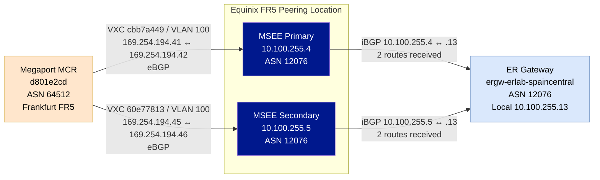
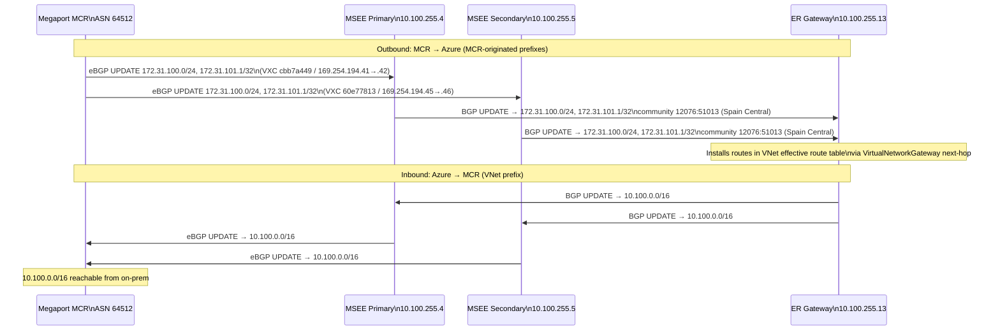

# Three commands that lied on a working ExpressRoute lab

_Lab: `expressroute-megaport-bgp` · Azure provider: Megaport MCR · Status: BGP converged, lab torn down_

---

We built a fully functional Azure ExpressRoute lab — BGP peering up on both paths, routes learned by the gateway, prefixes installed in the VNet. Three commands told us it was broken. They were all wrong.

This post is a tour of what those commands said, why they were wrong, and how you prove BGP is working when your monitoring tooling disagrees.

---

## What we built

The lab connects a simulated on-premises network — a Megaport MCR (Multi-Cloud Router) in Frankfurt FR5 — to an Azure VNet in Spain Central through a standard provider-based ExpressRoute circuit.

**Topology summary:**

| Component | Value |
|---|---|
| Azure region | Spain Central (`spaincentral`) |
| Resource group | `rg-erlab-spaincentral` |
| ER circuit | `er-erlab-madrid` (peering location: Madrid) |
| ER gateway | `ergw-erlab-spaincentral` (Standard SKU) |
| VNet CIDR | `10.100.0.0/16` |
| Megaport MCR | Frankfurt FR5, ASN 64512 |
| MCR-advertised prefixes | `172.31.100.0/24`, `172.31.101.1/32` |
| Primary VXC | VLAN 100, link-local `169.254.194.41 ↔ 169.254.194.42` |
| Secondary VXC | VLAN 100, link-local `169.254.194.45 ↔ 169.254.194.46` |
| Estimated lab cost | ~$110–$125/24 h (Megaport billing dominates) |

Everything is Terraform — Azure provider for the VNet, ER circuit, gateway, and connection; Megaport provider for the MCR and both VXCs. One detail worth flagging up front: the manifest planned a Madrid MCR co-located with the peering location. At deploy time Madrid was unavailable in Megaport, so the MCR landed in Frankfurt FR5 and connects to the Madrid MSEE across Megaport's backbone. Azure learned the routes regardless — co-location with the ER peering location is not required.

---

## How it works

### BGP control plane



The MCR establishes eBGP sessions with both MSEE routers over the two VXC links. The MSEEs relay prefixes into Azure via iBGP to the ER gateway. The gateway pushes routes into the VNet effective route table.

### Route propagation



The MSEE stamps community `12076:51013` (Spain Central) on the MCR-originated prefixes as they enter Azure. The VNet is configured with community `12076:20031` (custom) and regional community `12076:50057` for outbound filtering by on-premises peers.

---

## Three commands that lied

The lab was running. BGP was up. Routes were learned. Here is what three commands said.

### Lie #1 — Megaport type-specific MCR endpoint

```
GET https://api.megaport.com/v2/product/mcr2/<MCR-UUID>
```

**Response:**

```json
{
  "message": "Method Not Allowed",
  "http_error_code": 405,
  "allowed_methods": ["PUT"]
}
```

The path `/v2/product/mcr2/{uuid}` exists — it just does not accept GET. Only PUT. This is not documented prominently. If you model your Terraform read path or a validation script on the product type prefix (`mcr2`), you get a 405 that looks like a permissions or routing error.

**Fix:** Use the polymorphic endpoint with no type prefix:

```
GET https://api.megaport.com/v2/product/<MCR-UUID>
```

That returns the full MCR JSON — `productType: MCR2`, `provisioningStatus: LIVE`, `up: true`, both VXCs present.

### Lie #2 — Megaport type-specific VXC endpoint

```
GET https://api.megaport.com/v2/product/vxc/<VXC-UUID>
```

**Response:** Same pattern — HTTP 405, only PUT allowed.

The same generic fix applies. GET `/v2/product/{vxc-uuid}` returns the full VXC object including `provisioningStatus: LIVE`, `up: true`, both aEnd and bEnd configuration, VLAN, and link-local peer IPs. The type-specific path segment (`vxc`) is a write-only route in v2.

**Practical rule:** In the Megaport v2 API, if your read returns 405, drop the type prefix segment and use `/v2/product/{uuid}` directly.

### Lie #3 — MCR looking-glass BGP routes

```
GET https://api.megaport.com/v2/product/mcr2/<MCR-UUID>/diagnostics/routes/bgp
```

**Response:**

```
BGP summary
```

Nothing else. No routes. No error. The API returned the header of a BGP summary response and stopped.

This is not a "no routes" result — the MCR was actively advertising `172.31.100.0/24` and `172.31.101.1/32`, and the Azure gateway had received them. The looking-glass endpoint either has session-specific authentication quirks or was in a degraded state during this validation run.

**Workaround:** Skip the looking-glass for route proof. Use the Azure-side evidence instead — `az network express-route show-gateway-bgp-peer-status` shows BGP session state, and `az network express-route list-route-tables` shows the prefixes the gateway received from the MCR (with AS-PATH `64512 12076` visible).

---

## The actual proof BGP was working

When three commands say the lab is broken, you read the actual control plane.

**BGP session state — gateway side:**

```bash
az network express-route show-gateway-bgp-peer-status \
  --resource-group rg-erlab-spaincentral \
  --name ergw-erlab-spaincentral
```

Both peers returned `"state": "Connected"` with `"routesReceived": 2` on each gateway instance. Both sessions had been stable for approximately 19 minutes at the time of capture.

**L2 ARP — primary path:**

The ER circuit ARP table for the primary path showed the MCR's MAC address (`02cf.2b02.c22b`) resolved against the MSEE peer IP `169.254.194.41`, age 1089 seconds. The secondary path showed the same MAC at `169.254.194.45`, age 986 seconds. ARP resolving means the VXC layer is up and the MCR is communicating with the MSEE at Layer 2.

**Routes at the gateway:**

`az network express-route list-route-tables --path primary` returned `172.31.100.0/24` and `172.31.101.1/32` with AS-PATH `64512 12076` — the MCR's ASN followed by the MSEE relay. Three prefixes total in the route table summary (`statePfxRcd: 3` for the MCR peer) including the VXC link-local `/30`.

**Gateway learned routes:**

```bash
az network express-route gateway-learned-routes \
  --resource-group rg-erlab-spaincentral \
  --name ergw-erlab-spaincentral
```

The gateway learned the two VXC link-local `/30` subnets (`169.254.194.40/30`, `169.254.194.44/30`) via eBGP with AS-PATH `12076-64512`. These are the underlay prefixes proving the MSEE-to-gateway relay is functioning.

The lab was working. The three commands were wrong.

---

## Gotchas that bit us

**BGP convergence timing window.** `az network express-route list-route-tables` returned `Gateway does not have any Bgp sessions` the first time we ran it — even though ARP tables were resolving and the gateway had already learned routes. Re-running after waiting for convergence returned the expected route table. If you see this error, check `show-gateway-bgp-peer-status` first; if sessions show `Connected`, wait a couple of minutes and re-run.

**Frankfurt MCR, Madrid MSEE.** The manifest planned a Madrid MCR co-located with the ER peering location. Megaport did not have Madrid available at deploy time, so the MCR was provisioned in Frankfurt FR5. The cross-continental Megaport backbone handled the haul to the Madrid MSEE transparently — Azure saw and learned the routes as if the MCR were local. MCR proximity to the peering location matters for latency, not for route learning.

**MCR ASN is not auto-assigned.** When ordering an MCR via the Megaport Terraform provider, you must explicitly set the ASN. Omitting it creates an MCR without a BGP ASN and eBGP peering will not come up. The provider does not default or validate this field at plan time.

**VLAN observation — both VXCs on VLAN 100.** Both VXCs ended up with VLAN 100 on aEnd, bEnd, and peer side. The preferred plan was primary on VLAN 100 and secondary on VLAN 200 for easier per-path diagnostics. The lab worked — the MSEEs are on separate physical paths so there is no collision — but distinct VLANs are cleaner to troubleshoot.

**Cleanup order is strict.** Azure will block ER circuit deletion if the ER connection still exists. Megaport will block MCR deletion if VXCs are still attached. The safe sequence: delete VXCs, then MCR, then Azure ER connection, then ER peering, then ER circuit, then ER gateway (allow 20–45 minutes to deprovision), then resource group. Running `az group delete` first races dependent resources and tends to fail partway through.

**VM lifecycle drift can block late diagnostics.** The test VM (`vm-erlab-test`) was deallocated before the effective-route and ping checks ran. Azure NIC effective-route queries require a running VM. If you plan to collect VM-level evidence, keep the VM running for the full validation window or script a start/stop cycle around the capture commands.

---

## What we couldn't prove

The control-plane evidence is solid: L2 ARP resolves on both paths, BGP sessions are `Connected` with routes received, and the Azure route table shows the MCR prefixes. The following items remain unconfirmed:

**VM effective routes.** The VM was deallocated before `az network nic show-effective-route-table` ran. We cannot confirm `172.31.100.0/24` appears with `VirtualNetworkGateway` next-hop at the NIC level. Gateway-side evidence is strong enough for a functional BGP claim; the VM NIC is the final hop we didn't capture.

**MCR receipt of VNet BGP community.** The VNet is configured with BGP community `12076:20031`. The looking-glass returned no data, so we cannot confirm whether the MCR received the community on the `10.100.0.0/16` advertisement inbound from Azure.

**End-to-end data-plane ping.** With the VM deallocated, no ICMP test was possible. BGP convergence strongly implies data-plane reachability, but a ping is not the same as a BGP session.

---

## Conclusion

ExpressRoute BGP via Megaport MCR works — including cross-continental MCR placement when a local co-location is unavailable. When Megaport API endpoints return 405 or empty bodies, the circuit may still be fully operational. If three commands tell you your lab is broken, read the actual control plane.

The practical checklist: skip the Megaport type-specific path segments in reads (use `/v2/product/{uuid}`), don't rely on the MCR looking-glass for route proof during automation, and give the Azure gateway BGP sessions a few minutes to converge before treating the route-table command's error output as real.

---

_This lab is documented in the `net-lab-builder` repo under `labs/expressroute-megaport-bgp/`. See `validation.md` for the full pass/fail checklist and `show-output/` for sanitized raw command output._
