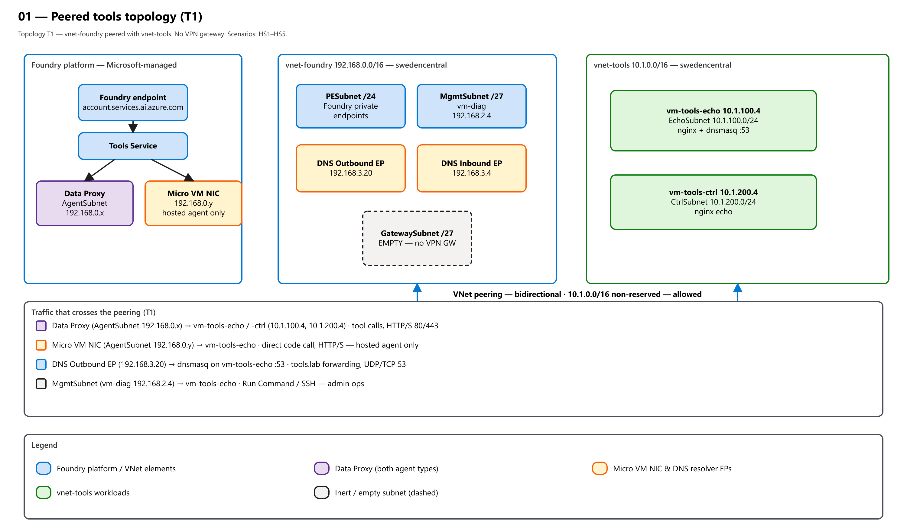
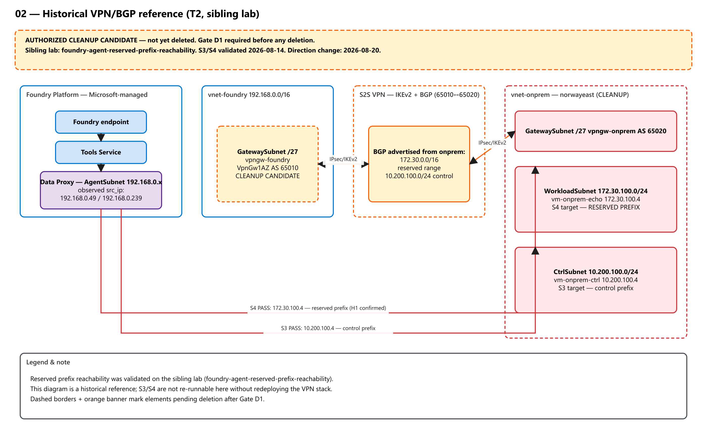
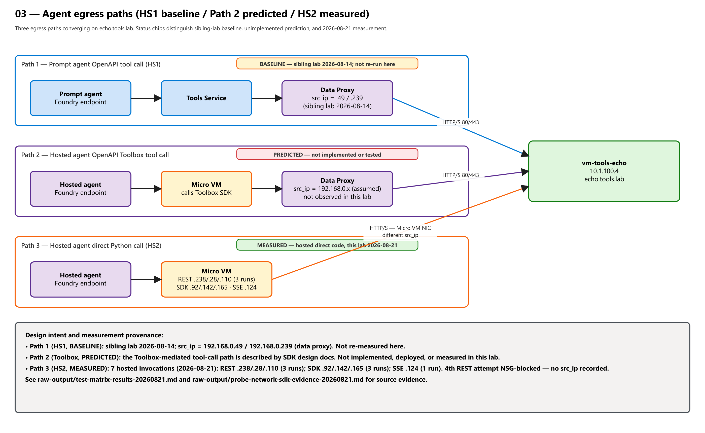
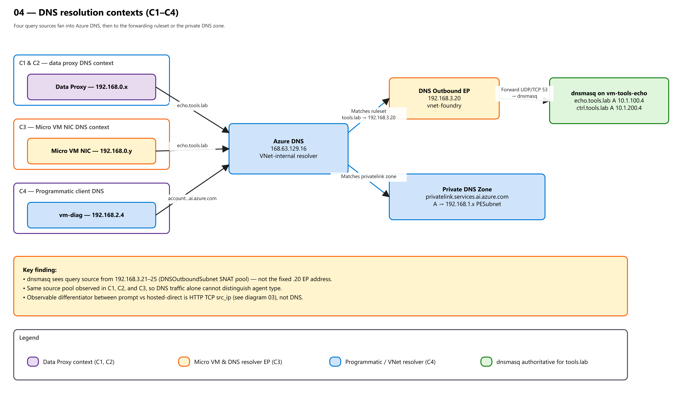
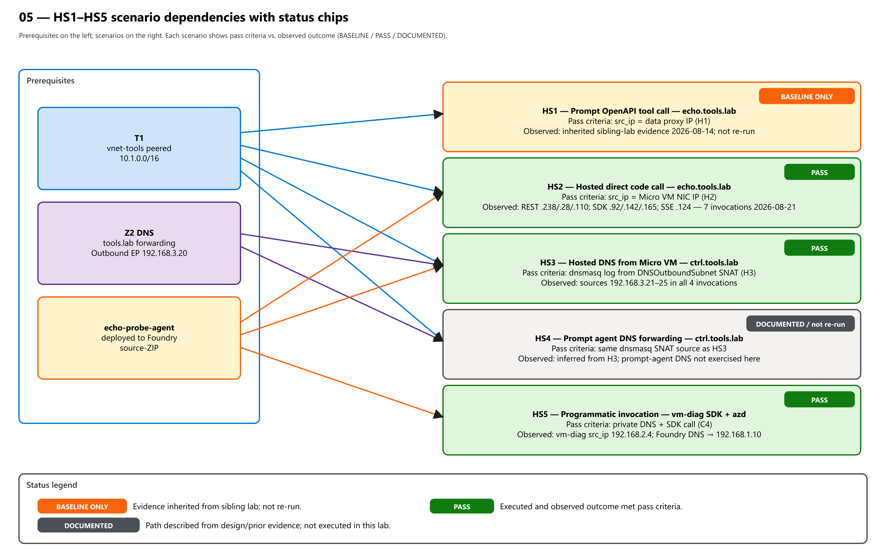
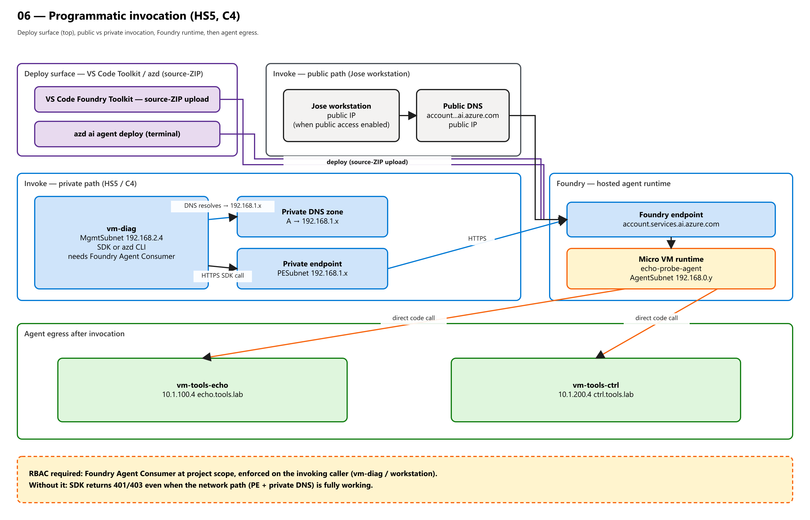

# foundry-agent-prompt-vs-hosted-networking

**Question:** What are the observable network-layer differences between a Foundry prompt agent and a
hosted agent -- specifically: do tool calls originate from the same source IP? Does direct agent code
produce a different egress path? Is DNS resolution context-transparent across agent types?

## Deployment Status

**T1 topology deployed** — 2026-08-20 13:42 UTC+2 (correlation ID `c0476ec1`)

| Resource | IP / State |
|---|---|
| vnet-tools | 10.1.0.0/16 — Succeeded |
| vm-tools-echo | 10.1.100.4 — Running; nginx/echo-http/dnsmasq active |
| vm-tools-ctrl | 10.1.200.4 — Running; nginx/echo-http active |
| dns-resolver-foundry inbound | 192.168.3.4 (DNSInboundSubnet) |
| peering foundry↔tools | Connected / FullyInSync |
| AgentSubnet NSG rules (4) | allow-out-echo/ctrl/mcr/aad — Succeeded |

**Wave 0–4 complete.** Ready for Wave 5 (curl/dig verification) and Wave 6 (hosted-agent runs).

**Hosted agent deployed** — 2026-08-21 07:46 UTC+2

| Resource | State |
|---|---|
| echo-probe-agent:1 | active (azure.ai.agent hosted, python_3_13) |
| azd env `foundry-networking` | bound; all 10 required vars set |

**Lab scenarios complete** — 2026-08-21. See [design.md §15](design.md) and [raw-output/test-matrix-results-20260821.md](raw-output/test-matrix-results-20260821.md).

> **VM billing note:** vm-tools-echo, vm-tools-ctrl, and vm-diag are deallocated after each test session. Start them only when running tests.


**Lab lineage:** Sibling of `../foundry-agent-reserved-prefix-reachability/`, which proved that
VPN-learned reserved prefixes are reachable from agent tool calls (H1 confirmed 2026-08-14). This
lab uses an allowed address space (`10.1.0.0/16`, peered tools VNet) and focuses on comparing agent
types.

**Topology (T1):** Foundry VNet (`192.168.0.0/16`, swedencentral) + peered tools VNet
(`10.1.0.0/16`, swedencentral). No VPN gateways. Private DNS via Azure DNS Private Resolver +
dnsmasq on vm-tools-echo (Z2 recommended).

> **VPN/on-prem cleanup status (2026-08-20):** The sibling lab's VPN stack and vnet-onprem remain
> **active cleanup candidates**; Gate D1 (below) is the authorization gate before any deletion.

---

## Navigation

| Artifact | Path | Status |
|----------|------|--------|
| Lab card (manifest) | [manifest.md](manifest.md) | Locked |
| Network design | [design.md](design.md) | Authored (Trinity) |
| **Foundry Networking Primer** | [README.md#foundry-networking-architecture-primer](#foundry-networking-architecture-primer) | This document |
| Results | [raw-output/test-matrix-results-20260821.md](raw-output/test-matrix-results-20260821.md) | Complete (2026-08-21) |
| VS Code hosted-agent guide | [hosted-agent-vscode.md](hosted-agent-vscode.md) | Documentation |
| Diagrams | [diagrams/](diagrams/) | Six purpose-built static SVG/PNG exports with matching `.excalidraw` sources; legacy `.mmd` kept as supplemental |
| **T1 Bicep template** | [deploy/main.bicep](deploy/main.bicep) | Authored (Tank) |
| **T1 parameters example** | [deploy/parameters/lab.parameters.json](deploy/parameters/lab.parameters.json) | Authored (Tank) |
| **T1 deploy script** | [deploy/deploy.ps1](deploy/deploy.ps1) | Authored (Tank); safe preview by default |
| **T2 cleanup script** | [deploy/cleanup.ps1](deploy/cleanup.ps1) | Authored (Tank); preview by default |
| Cloud-init: echo VM | [deploy/cloud-init/echo-vm.yaml](deploy/cloud-init/echo-vm.yaml) | Authored (Tank) |
| Cloud-init: ctrl VM | [deploy/cloud-init/ctrl-vm.yaml](deploy/cloud-init/ctrl-vm.yaml) | Authored (Tank) |
| Hosted agent source | [hosted-agent/src/echo-probe-agent/main.py](hosted-agent/src/echo-probe-agent/main.py) | Python 3.13; probe_echo + probe_ctrl tools |
| Hosted agent tests | [hosted-agent/tests/](hosted-agent/tests/) | unittest; mock-based; run with pytest |
| Test results | [raw-output/test-matrix-results-20260821.md](raw-output/test-matrix-results-20260821.md) | HS1–HS5 + NSG negative outcomes |
| **SDK invocation scripts** | [tests/probe_network.py](tests/probe_network.py) | Programmatic comparison: hosted SDK + client-side FC + sessions API doc |
| SDK invocation README | [tests/README.md](tests/README.md) | API choices, prerequisites, expected results |
| SDK evidence | [raw-output/probe-network-sdk-evidence-20260821.md](raw-output/probe-network-sdk-evidence-20260821.md) | 7 hosted invocations + 1 client-side DNS-FAIL row; SDK architecture findings |

---

## Diagrams

All six diagrams are purpose-built static SVG exports (opaque white background, black text, explicit dimensions) with matching `.excalidraw` sources for editing on <https://aka.ms/excalidraw>. PNGs are rasterized from the same static SVGs at 2× resolution via a sharp/librsvg pipeline; the browser Excalidraw canvas is not used for export. Legacy `.mmd` Mermaid files are kept as supplemental sources. Every image linked below is click-through to the SVG for full-page zoom.

### 01 — Peered tools topology

T1 base topology: `vnet-foundry` + `vnet-tools` peered, DNS Private Resolver + dnsmasq, no VPN. Prereq for HS1–HS5.

[](diagrams/01-peered-tools-topology.svg)

Sources: [SVG](diagrams/01-peered-tools-topology.svg) · [Excalidraw](diagrams/01-peered-tools-topology.excalidraw) · [Mermaid](diagrams/01-peered-tools-topology.mmd)

### 02 — Historical VPN reference

Historical T2 VPN/BGP topology from the sibling lab; documents S3/S4 evidence and the authorized cleanup candidate. Reference only.

[](diagrams/02-historical-vpn-reference.svg)

Sources: [SVG](diagrams/02-historical-vpn-reference.svg) · [Excalidraw](diagrams/02-historical-vpn-reference.excalidraw) · [Mermaid](diagrams/02-historical-vpn-reference.mmd)

### 03 — Agent egress paths (HS1 baseline / Path 2 predicted / HS2 measured)

Three egress paths converging on `echo.tools.lab`. Status chips distinguish sibling-lab baseline evidence, an unimplemented Toolbox prediction, and the 2026-08-21 hosted-direct-code measurement.

[](diagrams/03-agent-egress-paths.svg)

Sources: [SVG](diagrams/03-agent-egress-paths.svg) · [Excalidraw](diagrams/03-agent-egress-paths.excalidraw) · [Mermaid](diagrams/03-agent-egress-paths.mmd)

### 04 — DNS resolution contexts (C1–C4)

How queries from the data proxy, Micro VM NIC, and vm-diag fan into Azure DNS, then into either the `tools.lab` forwarding ruleset or the Private DNS zone.

[](diagrams/04-dns-resolution-contexts.svg)

Sources: [SVG](diagrams/04-dns-resolution-contexts.svg) · [Excalidraw](diagrams/04-dns-resolution-contexts.excalidraw) · [Mermaid](diagrams/04-dns-resolution-contexts.mmd)

### 05 — HS1–HS5 scenario dependencies with status chips

Dependency graph from prerequisites to scenarios, with explicit status chips (BASELINE ONLY / PASS / DOCUMENTED) and pass-criteria vs. observed-outcome lines for each scenario.

[](diagrams/05-scenario-matrix.svg)

Sources: [SVG](diagrams/05-scenario-matrix.svg) · [Excalidraw](diagrams/05-scenario-matrix.excalidraw) · [Mermaid](diagrams/05-scenario-matrix.mmd)

### 06 — Programmatic invocation (HS5, C4)

Client invocation surfaces (VS Code Toolkit / azd / vm-diag / public workstation), the Foundry hosted-agent runtime, RBAC required to invoke, and downstream agent egress to the tool VMs.

[](diagrams/06-programmatic-invocation.svg)

Sources: [SVG](diagrams/06-programmatic-invocation.svg) · [Excalidraw](diagrams/06-programmatic-invocation.excalidraw) · [Mermaid](diagrams/06-programmatic-invocation.mmd)

---

## Shared infrastructure

This lab reuses the Foundry account, model deployment, private endpoints, private DNS zones,
vnet-foundry, and vm-diag deployed by the sibling lab. It does not redeploy or own those resources.

## Lab-owned resources (DEPLOYED — 2026-08-20/21)

| Resource | Address / SKU | Purpose |
|----------|--------------|---------|
| vnet-tools | `10.1.0.0/16` swedencentral | Tools VNet, peered to vnet-foundry |
| EchoSubnet | `10.1.100.0/24` | vm-tools-echo |
| CtrlSubnet | `10.1.200.0/24` | vm-tools-ctrl |
| nsg-tools | -- | Applied to EchoSubnet and CtrlSubnet |
| VNet peering | bidirectional, no gateway transit | vnet-foundry to vnet-tools |
| vm-tools-echo | Standard_B2ts_v2 Linux `10.1.100.4` | nginx echo + dnsmasq `:53` |
| vm-tools-ctrl | Standard_B2ts_v2 Linux `10.1.200.4` | nginx echo (ctrl label) |
| DNS Private Resolver | inbound EP `192.168.3.4` / outbound EP `192.168.3.20` | Z2 recommended |
| DNS forwarding ruleset | `tools.lab -> 10.1.100.4:53` linked to vnet-foundry | Hostname DNS for all VNet contexts |
| AgentSubnet NSG patch | rules 110/120: outbound to `10.1.100.0/24` and `10.1.200.0/24` | Allow data proxy and Micro VM tool calls |
| `echo-probe-agent` | source-ZIP Foundry hosted agent | Lab scenarios HS2/HS3/HS5 |

---

## Foundry Networking Architecture Primer

*Prerequisite knowledge: Azure VNet, NSG, VNet peering, Private Link/Private Endpoint, Azure Private
DNS zones, DNS Private Resolver. No Foundry-specific knowledge assumed.*

### Key concepts

| Term | What it is | Azure networking analogy |
|------|-----------|--------------------------|
| **Foundry account** | An Azure resource of type `Microsoft.CognitiveServices/accounts` (kind `AIServices`). Exposes a single HTTPS endpoint: `<account>.services.ai.azure.com`. | Similar to an Azure API Management gateway: one DNS name, multiple APIs underneath. |
| **Foundry project** | A logical namespace under the account. Each project has its own endpoint prefix and RBAC scope. | Comparable to an APIM product or a distinct backend pool. |
| **Foundry account endpoint / private endpoint** | When private networking is enabled, a Private Endpoint in your VNet's PESubnet gives VNet-internal resources a private IP for `<account>.services.ai.azure.com`. A Private DNS zone `privatelink.services.ai.azure.com` provides split-horizon resolution (VNet → PE IP; internet → public IP). | Standard Azure Private Link pattern — identical to Storage, Key Vault, etc. |
| **AgentSubnet (network injection)** | A subnet in your VNet delegated to `Microsoft.App/environments`. Foundry injects its managed compute (data proxy, Micro VM NICs) into this subnet so they have IPs in your address space. NSG and UDR rules you apply to AgentSubnet govern egress from that managed compute. | Analogous to App Service VNet Integration, ACI network injection, or Azure Container Apps environment injection into a delegated subnet. |
| **Data proxy** | A Microsoft-managed component that lives inside AgentSubnet with an IP from that subnet (`192.168.0.x` in this lab). When a **prompt agent** is configured with HTTP Connection resources (OpenAPI tool definitions), the platform's Tools Service routes tool HTTP calls through the data proxy to your endpoints. *The data proxy is not a customer-deployed resource; its internal architecture is undocumented.* | Functionally similar to an internal App Service outbound IP or a managed NAT within the subnet — you see the IP at the target but cannot configure the component itself. |
| **Prompt agent** | A Foundry agent configured entirely through declarations (system instructions + OpenAPI tool JSON). No code. The platform handles all tool invocation via the data proxy. Invoked through the Assistants API (threads/runs) at the project endpoint. | Closest Azure analogy: Azure Logic App with managed connectors — behavior is defined, not coded; the platform executes HTTP calls on your behalf. |
| **Hosted agent** | A Foundry agent backed by Python code (`main.py`) that runs inside a **Micro VM** in AgentSubnet. Invoked through the OpenAI Responses API at a dedicated per-agent endpoint. | Closest analogy: Azure Container Apps (your code runs in a managed container with a VNet-injected NIC). |
| **Hosted Micro VM / runtime NIC** | An ephemeral lightweight container spawned by Foundry for each hosted agent invocation (stateless Responses API path). It receives a dedicated NIC in AgentSubnet (`192.168.0.y`). Your Python code's HTTP calls originate from this NIC — not from the data proxy. *Micro VM is an informal term; the official resource is the AgentSubnet-injected compute; internal architecture is undocumented/inferred.* | Analogous to an ACI container or ACA replica: ephemeral, VNet-injected, gone after the call ends. |
| **Private DNS resolver + dnsmasq** | In this lab a customer-deployed Azure DNS Private Resolver (outbound endpoint `192.168.3.20`, SNAT pool `192.168.3.21–25`) forwards `tools.lab` queries to dnsmasq on vm-tools-echo (`10.1.100.4:53`). All VNet resources (data proxy, Micro VM NICs, vm-diag) use the same VNet-level DNS forwarding ruleset — see [docs](https://learn.microsoft.com/azure/dns/dns-private-resolver-overview). | Identical to the Azure-recommended hybrid DNS pattern: outbound resolver EP → on-prem/custom DNS. |
| **Tool target** | A customer-deployed HTTP server that receives the tool call. In this lab: `vm-tools-echo` (`10.1.100.4`) and `vm-tools-ctrl` (`10.1.200.4`) in the peered vnet-tools. The echo response includes `src_ip` — the ground-truth source IP of the caller. | Any Azure VM or PaaS endpoint that your workload needs to reach. NSG on the target subnet is the enforcement point. |
| **Caller / client** | The entity that invokes the agent. In this lab: a workstation (outside VNet) and vm-diag (MgmtSubnet, inside VNet). The caller reaches the Foundry endpoint via the private endpoint (inside VNet) or the public IP (outside VNet). | The same as any Azure client calling a private or public HTTPS endpoint. |
| **Client-side function calling (FC)** | The caller uses a standard OpenAI model endpoint (not an agent endpoint) and executes tool calls locally on the calling machine. No data proxy, no Micro VM. Tool HTTP calls come from the **caller's NIC**, not from AgentSubnet. | Equivalent to running your own HTTP client code — no platform egress involved. |

### Microsoft-managed vs customer-owned resources

| Resource | Owned / managed by | Notes |
|----------|-------------------|-------|
| Foundry platform (Tools Service, model inference) | **Microsoft** | Not visible in your subscription |
| Data proxy (IP in AgentSubnet) | **Microsoft** (injected into customer VNet) | IP from customer subnet; NSG/UDR apply |
| Micro VM NIC (IP in AgentSubnet) | **Microsoft** (injected per invocation) | Ephemeral; IP from customer subnet; NSG/UDR apply |
| AgentSubnet (the subnet itself) | **Customer** | Must be delegated to `Microsoft.App/environments`; customer sets NSG, UDR |
| Private endpoint (PESubnet) | **Customer** | Standard Azure PE; customer deploys and owns |
| Private DNS zone `privatelink.services.ai.azure.com` | **Customer** | Standard Azure Private DNS; linked to customer VNets |
| DNS Private Resolver + forwarding ruleset | **Customer** (optional) | Needed only if custom DNS forwarding is required (e.g. `tools.lab`) |
| vnet-tools, vm-tools-echo, vm-tools-ctrl | **Customer** | Lab-specific tool targets |
| VNet peering (vnet-foundry ↔ vnet-tools) | **Customer** | Required for managed compute to reach vnet-tools |

### Four packet/control paths

The following paths are illustrated in [diagram 03](diagrams/03-agent-egress-paths.png) (egress),
[diagram 06](diagrams/06-programmatic-invocation.png) (invocation ingress), and [diagram 04](diagrams/04-dns-resolution-contexts.png) (DNS).

#### 1. Invocation ingress — Caller → Foundry agent endpoint

```
Caller ──HTTPS──► account.services.ai.azure.com
                  │
                  ├── Public path (workstation outside VNet):
                  │   DNS resolves to public IP; TCP 443 to public Foundry endpoint
                  │
                  └── Private path (vm-diag inside VNet):
                      Private DNS zone resolves to PE IP (192.168.1.x in PESubnet)
                      TCP 443 to private endpoint → Foundry
```

For hosted agents, the URL is `<account>.services.ai.azure.com/api/projects/<project>/agents/<name>/endpoint/protocols/openai/responses`.  
For prompt agents, the URL is the Foundry project Assistants API endpoint (`/openai/v1/threads`, `/runs`).  
RBAC: **Foundry Agent Consumer** role at project scope required for hosted agent invocation. ([Foundry network isolation](https://learn.microsoft.com/azure/foundry/how-to/configure-private-link))

#### 2. Prompt-tool egress — Data proxy → tool target *(H1; BASELINE ONLY — not re-run in this lab)*

```
Foundry Tools Service
  → Data Proxy (AgentSubnet 192.168.0.x, Microsoft-managed)
  → DNS: 168.63.129.16 → DNS Private Resolver outbound EP (192.168.3.21–25 SNAT)
         → dnsmasq (10.1.100.4:53) → A 10.1.100.4
  → TCP 80 via VNet peering → vm-tools-echo 10.1.100.4
  src_ip at target: 192.168.0.x (AgentSubnet)
```

NSG enforcement: nsg-tools on EchoSubnet/CtrlSubnet (customer-owned). The data proxy **cannot** be configured or inspected directly; its existence is inferred from the observed `src_ip`. (Source: sibling lab 2026-08-14; see [raw-output/probe-network-sdk-evidence-20260821.md](raw-output/probe-network-sdk-evidence-20260821.md).)

#### 3. Hosted-tool egress — Micro VM NIC → tool target *(H2; empirically confirmed)*

```
Hosted agent code (main.py, requests.get)
  → Micro VM NIC (AgentSubnet 192.168.0.y, Microsoft-managed, ephemeral)
  → DNS: same VNet forwarding chain → A 10.1.100.4
  → TCP 80 via VNet peering → vm-tools-echo 10.1.100.4
  src_ip at target: 192.168.0.y (AgentSubnet; different value from data proxy per invocation)
```

The Micro VM NIC uses the **same AgentSubnet** and same DNS forwarding chain as the data proxy — both paths appear identical at the NSG and peering level. The only observable difference is the `src_ip` value (which changes per invocation and cannot be pinned). ([Foundry: deploy hosted agent from source code](https://learn.microsoft.com/azure/foundry/agents/how-to/deploy-hosted-agent-code))

#### 4. Client-side function calling — Caller executes tools directly

```
Caller (workstation or vm-diag)
  → LLM call to Foundry project OpenAI endpoint (/openai/v1/)
  → Model returns tool_calls JSON
  → Caller executes HTTP calls locally from its own NIC
  src_ip at target: caller NIC IP (NOT AgentSubnet)

From workstation: DNS fails (tools.lab not resolvable outside VNet) → Connection error
From vm-diag (inside VNet): DNS resolves, src_ip = 192.168.2.4 (MgmtSubnet)
```

This path uses **no Foundry data proxy or Micro VM** — the caller is the tool executor. It proves VNet isolation: private tool targets are only reachable from within the VNet (hosted agent or data proxy), not from callers outside it.

> **Source quality note:** The data proxy internal architecture (path 2 above) is inferred from observed `src_ip` values and [Foundry network isolation documentation](https://learn.microsoft.com/azure/foundry/how-to/configure-private-link). The term "data proxy" and "Micro VM" are used in community and documentation references but their internal implementations are not fully documented. Details marked *inferred/undocumented* above should be treated as best-current-understanding, not guaranteed architecture.

---

## Key Results Summary

Three hypotheses (H1–H3) were in scope. H1 uses 2026-08-14 baseline evidence inherited from the sibling
lab and was **not re-run** in this lab — the prompt-agent data-proxy path cannot be reproduced
programmatically via `azure-ai-projects 2.3.0` (SDK limitation; see design.md §16). H2 and H3
confirmed empirically. Full evidence in [design.md §15–16](design.md) and [raw-output/](raw-output/).

| Hypothesis | Result | Key evidence |
|------------|--------|-------------|
| H1: prompt + hosted tool calls share same src_ip range | **BASELINE ONLY** (sibling lab 2026-08-14; not re-run here — SDK control path is client-side FC, not data-proxy) | Sibling-lab data proxy src_ip: 192.168.0.49, .239 (AgentSubnet 192.168.0.0/24). Hosted Micro VM also uses same /24. Mechanism not re-run; no raw invocation record from data proxy in this lab. |
| H2: hosted agent code egresses via Micro VM NIC (not data proxy) | CONFIRMED | 7 hosted-agent invocations (3 REST direct, 3 SDK, 1 SSE); src_ip changes per call (ephemeral Micro VM). The 8th run is client-side FC — a control that executes on the caller NIC, not via AgentSubnet. |
| H3: DNS resolution is context-transparent | CONFIRMED | All callers use same DNSOutboundSubnet SNAT IPs at dnsmasq |
| Client-FC vs hosted: private VNet isolation | NEW FINDING | tools.lab DNS fails from workstation; hosted agent (inside AgentSubnet) succeeds |

### Invocation summary (8 runs: 7 hosted-agent via AgentSubnet + 1 client-side FC via caller NIC)

| Method | SDK | src_ip observed | Status |
|--------|-----|-----------------|--------|
| REST direct | `requests.post` | .238, .28, .110 | PASS |
| SDK (non-streaming) | `AIProjectClient.get_openai_client(agent_name=...)` | .92, .142, .165 | PASS |
| REST SSE stream | `requests.post stream=True` (213 SSE events) | .124 | PASS |
| Client-side FC | `get_openai_client()` [no agent_name] + client tools | DNS FAIL | EXPECTED (proves VNet isolation) |

---

## Transition and Cleanup Plan

T1 is fully deployed (Gate D2 executed 2026-08-20). VPN/on-prem cleanup (Gate D1) remains pending.

---

### Step 1: Evidence Preservation

**Executed by Tank, reviewed and confirmed by Jose before any deletion is initiated.**

These commands capture the live routing state. Output files are committed to the sibling lab's
`raw-output/` directory before any teardown action.

```bash
# 1a. Effective routes on vm-diag -- shows 172.30.0.0/16 and 10.200.100.0/24 via VirtualNetworkGateway
az network nic show-effective-route-table \
  --resource-group <rg-foundry> \
  --name nic-vm-diag \
  --output json \
  > labs/foundry-agent-reserved-prefix-reachability/raw-output/pre-teardown-effective-routes.json

# 1b. BGP learned routes on vpngw-foundry -- shows AS 65020 peering and advertised prefixes
az network vnet-gateway list-learned-routes \
  --resource-group <rg-foundry> \
  --name vpngw-foundry \
  --output json \
  > labs/foundry-agent-reserved-prefix-reachability/raw-output/pre-teardown-learned-routes.json
```

Also capture three portal screenshots before teardown:
- VPN Gateway overview page (vpngw-foundry): name, SKU, public IP, provisioning state
- BGP peers tab: peer ASN 65020, peer address, connection state
- Tunnel status tab: connection name, status, bytes in/out

---

### Step 2: Deletion Preview

**Executed by Tank, reviewed by Jose. No actual deletion occurs in this step.**

Resources to be deleted, in dependency order. Run `--dry-run` or Bicep `what-if` to preview the
exact resource IDs before Jose approves Gate D1.

| Order | Resource | Region | Estimated savings |
|-------|----------|--------|------------------|
| 1 | `conn-foundry-to-onprem` (VPN connection) | swedencentral | $0.36/day combined |
| 1 | `conn-onprem-to-foundry` (VPN connection) | norwayeast | (above) |
| 2 | `vpngw-foundry` (VpnGw1AZ) | swedencentral | $5.04/day |
| 2 | `vpngw-onprem` (VpnGw1AZ) | norwayeast | $5.04/day |
| 3 | `pip-vpngw-foundry` (Standard PIP) | swedencentral | $0.12/day |
| 3 | `pip-vpngw-onprem` (Standard PIP) | norwayeast | $0.12/day |
| 4 | `vm-onprem-echo` + NIC + OS disk | norwayeast | $0.18/day |
| 4 | `vm-onprem-ctrl` + NIC + OS disk | norwayeast | $0.18/day |
| 5 | NSGs on vnet-onprem subnets | norwayeast | $0 |
| 6 | `vnet-onprem` (`172.30.0.0/16 + 10.200.100.0/24`) | norwayeast | $0 |
| 7 | AgentSubnet NSG rules for `172.30.100.0/24` and `10.200.100.0/24` | swedencentral | $0 |

**Total savings after full teardown: ~$11.04/day (~59% reduction on current VPN stack cost).**

Dry-run preview command — defaults to preview only, no deletion (Tank executes, Jose reviews):
```powershell
# Default mode: PREVIEW ONLY. Lists exact T2 resources and stale NSG rules. No deletion.
.\labs\foundry-agent-prompt-vs-hosted-networking\deploy\cleanup.ps1 -RgName <rg-foundry>
```
Review the output: confirm only T2 VPN/on-prem resources appear, no shared infra (vnet-foundry, vm-diag, PEs, etc.).


**Resources NOT in scope for deletion (must not appear in preview):**
vnet-foundry, all vnet-foundry subnets, all private endpoints, all private DNS zones,
Foundry account, model deployment, AI Search, Cosmos DB, Storage account, vm-diag,
DNS Private Resolver (if deployed), GatewaySubnet (kept empty, zero cost).

---

### Gate D1: Destructive Cleanup — "DELETE APPROVED"

> **This gate must be completed before any deletion action.**

After Jose has reviewed the evidence capture output and the dry-run preview:

1. **Jose reviews** `pre-teardown-effective-routes.json` -- confirms `172.30.0.0/16` route via
   `VirtualNetworkGateway` is present (proving the VPN route was live before teardown).
2. **Jose reviews** the dry-run preview output -- confirms no shared resources are in scope.
3. **Jose sends** the explicit message: **"DELETE APPROVED"** in the squad conversation.

Only after step 3 may Tank execute deletion in the order defined in Step 2 above.
VPN GW deletion takes approximately 5 minutes each. Do not interrupt mid-sequence.

---

---

## Key references

| Source | Used for |
|--------|---------|
| [manifest.md](manifest.md) | Full lab card, hypotheses, scenarios, NSG spec, cost estimate |
| [hosted-agent-vscode.md](hosted-agent-vscode.md) | VS Code Foundry Toolkit walkthrough for Jose |
| [diagrams/](diagrams/) | Six purpose-built static SVG/PNG exports with matching `.excalidraw` sources; legacy `.mmd` kept as supplemental |
| Sibling lab: `../foundry-agent-reserved-prefix-reachability/` | Shared infra baseline; H1 evidence (S3/S4) |
| `.squad/decisions/inbox/morpheus-foundry-lab-restructure.md` | Cleanup gate details (original lab) |
| `.squad/decisions/inbox/morpheus-foundry-topology-rethink.md` | T1 vs T2 split rationale; teardown order |
