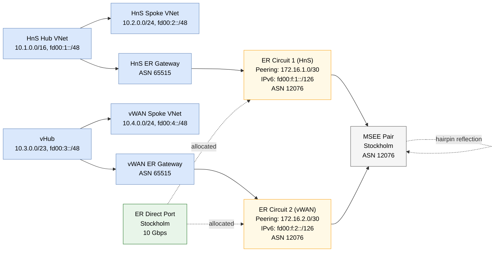
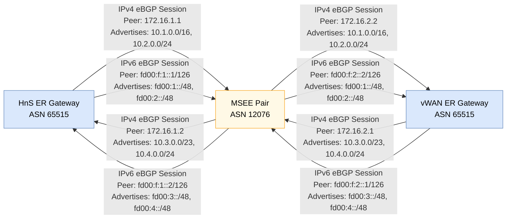

# Lab: MSEE Hairpin (HnS + vWAN) with Dual-Stack IPv6

## Overview

This lab verifies MSEE hairpinning between a self-managed hub-and-spoke ER gateway and a Virtual WAN hub ER gateway, using a **single** ExpressRoute circuit on an ER Direct port in Stockholm, connected to both gateways simultaneously. Dual-stack (IPv4 + IPv6) BGP sessions are configured.

## Key Finding

**IPv4 MSEE hairpin: WORKS.** IPv6 MSEE hairpin: does NOT work on GA Virtual WAN — but the cause is NOT the hairpin. **GA Azure Virtual WAN hubs are IPv4-only**, so the vHub never carries IPv6 (not even from its own spoke), and therefore has no IPv6 to hairpin back to the HnS side. A vWAN IPv6 dual-stack preview is reportedly underway (GA targeted Sept 2026, internal aka.ms/ipv6roadmap); it appears allowlist-gated (no self-service feature flag found), so re-testing requires the subscription to be added to the preview.

## Designs Studied

| # | Design | Status | Verdict |
|---|--------|--------|---------|
| A | ER Direct + single circuit + MSEE hairpin (3 GW toggles) | ✅ IPv4 | **Recommended for IPv4.** Single circuit connected to both HnS ER GW and vWAN ER GW. MSEE reflects routes bidirectionally. Requires three silent-fail toggles. IPv6 routes NOT propagated through MSEE hairpin as of June 2026. |
| B | Megaport MCR as transit between two circuits | 📚 Not tested | Alternative if customer-side BGP were required (it is not). Higher cost (~$35-45/day). |
| C | IPsec VPN between HnS and vWAN | 📚 Not tested | Fallback if ER hairpin fails entirely. Would test IPv6 over IKEv2 with IPv6 traffic selectors. ~$15-20/day. |

### Evidence for Design A verdict

- **BGP learned routes (HnS GW):** `10.3.0.0/23` and `10.4.0.0/24` via AS-path `12076-12076` (MSEE hairpin signature)
- **Effective routes (vWAN spoke NIC):** `10.1.0.0/16` and `10.2.0.0/24` via VirtualNetworkGateway
- **Ping HnS→vWAN (IPv4):** 3/4 success, RTT 9-17ms
- **Ping vWAN→HnS (IPv4):** 4/4 success, RTT 9-11ms
- **Ping (IPv6):** 0/4 both directions. Root cause: the vHub `defaultRouteTable` carries only IPv4 (`10.1.0.0/16`, `10.2.0.0/24`, `10.4.0.0/24`) — no IPv6 at all, not even the vWAN spoke's own `fd00:4::/48`. Azure Virtual WAN hubs are IPv4-only. The HnS side correctly advertises `fd00:1::/48` + `fd00:2::/48` to the MSEE; the vWAN side has nothing IPv6 to reciprocate.
- See `deploy-log.md` for full details.

### Critical design requirement: ONE circuit, not two

MSEE hairpinning works by connecting the **same circuit** to both ER gateways. The MSEE reflects routes between connections on that single circuit. Two separate circuits on the same port do NOT hairpin (each has independent MSEE peering sessions).

### Three silent-fail GW toggles (mandatory)

| Gateway | Property | Purpose |
|---------|----------|---------|
| HnS ER GW | `allowVirtualWanTraffic = true` | Accept MSEE-reflected vWAN routes |
| HnS ER GW | `allowRemoteVnetTraffic = true` | Advertise peered spoke prefixes |
| vHub ER GW | `allowNonVirtualWanTraffic = true` | Accept routes from non-vWAN circuits |

Without these toggles, the hairpin silently fails (no error, just empty route tables).

---

## Diagrams

### 1. Topology Overview

**Key elements:**
- **HnS Hub & Spoke:** Self-managed VNet pair with traditional ER Gateway (ErGw1AZ SKU).
- **vHub & vWAN Spoke:** Virtual WAN hub with native ER Gateway (1 scale unit).
- **ER Direct Port:** Single 10 Gbps port in Stockholm; ONE circuit connected to BOTH gateways.
- **MSEE Hairpin:** Both GW connections on the same circuit peer at the same MSEE pair. The MSEE re-advertises learned prefixes from one connection to the other.

---

### 2. BGP Control Plane

**Four BGP sessions per circuit:**
- **IPv4 + IPv6 on Circuit 1 (HnS ↔ MSEE):** eBGP peer ASN 12076; HnS advertises hub & spoke prefixes.
- **IPv4 + IPv6 on Circuit 2 (vWAN ↔ MSEE):** eBGP peer ASN 12076; vWAN advertises hub & spoke prefixes.
- **Hairpin mechanism:** MSEE receives HnS prefixes on Circuit 1, advertises them back on Circuit 2; vice versa for vWAN prefixes.

---

### 3. Data Plane — Dual-Stack Ping Paths

```mermaid
flowchart LR
    subgraph S1["S1: IPv4 Ping HnS-Spoke → vWAN-Spoke via MSEE Hairpin"]
        s1_vm["HnS-Spoke VM<br/>10.2.0.x"]
        s1_spoke["HnS Spoke VNet<br/>10.2.0.0/24"]
        s1_hub["HnS Hub VNet<br/>10.1.0.0/16"]
        s1_gw["HnS ER Gateway"]
        s1_crc["ER Circuit 1<br/>172.16.1.0/30"]
        s1_msee["MSEE<br/>(hairpin)"]
        s1_crc2["ER Circuit 2<br/>172.16.2.0/30"]
        s1_gwv["vWAN ER Gateway"]
        s1_hub2["vHub<br/>10.3.0.0/23"]
        s1_spoke2["vWAN Spoke VNet<br/>10.4.0.0/24"]
        s1_vm2["vWAN-Spoke VM<br/>10.4.0.x"]
        
        s1_vm -->|Layer 3: 10.2.0.x → 10.4.0.x| s1_spoke
        s1_spoke -->|Routing: match 10.4.0.0/24 via hub| s1_hub
        s1_hub -->|BGP next-hop via ER GW| s1_gw
        s1_gw -->|Encapsulation| s1_crc
        s1_crc -->|Layer 2 tunnel| s1_msee
        s1_msee -->|Layer 2 tunnel| s1_crc2
        s1_crc2 -->|Decapsulation| s1_gwv
        s1_gwv -->|Routing: match 10.4.0.0/24| s1_hub2
        s1_hub2 -->|Routing: match 10.4.0.0/24| s1_spoke2
        s1_spoke2 -->|Layer 3| s1_vm2
    end
    
    subgraph S2["S2: IPv6 Ping HnS-Spoke → vWAN-Spoke via MSEE Hairpin"]
        s2_vm["HnS-Spoke VM<br/>fd00:2::x"]
        s2_spoke["HnS Spoke VNet<br/>fd00:2::/48"]
        s2_hub["HnS Hub VNet<br/>fd00:1::/48"]
        s2_gw["HnS ER Gateway"]
        s2_crc["ER Circuit 1<br/>fd00:f:1::/126"]
        s2_msee["MSEE<br/>(hairpin)"]
        s2_crc2["ER Circuit 2<br/>fd00:f:2::/126"]
        s2_gwv["vWAN ER Gateway"]
        s2_hub2["vHub<br/>fd00:3::/48"]
        s2_spoke2["vWAN Spoke VNet<br/>fd00:4::/48"]
        s2_vm2["vWAN-Spoke VM<br/>fd00:4::x"]
        
        s2_vm -->|Layer 3: fd00:2::x → fd00:4::x| s2_spoke
        s2_spoke -->|Routing: match fd00:4::/48 via hub| s2_hub
        s2_hub -->|BGP next-hop via ER GW| s2_gw
        s2_gw -->|Encapsulation| s2_crc
        s2_crc -->|Layer 2 tunnel| s2_msee
        s2_msee -->|Layer 2 tunnel| s2_crc2
        s2_crc2 -->|Decapsulation| s2_gwv
        s2_gwv -->|Routing: match fd00:4::/48| s2_hub2
        s2_hub2 -->|Routing: match fd00:4::/48| s2_spoke2
        s2_spoke2 -->|Layer 3| s2_vm2
    end
    
    classDef vm fill:#e8f5e9,stroke:#2e7d32,color:#000
    classDef vnet fill:#dae8fc,stroke:#6c8ebf,color:#000
    classDef gw fill:#fff9e6,stroke:#f9a825,color:#000
    classDef msee fill:#fce4ec,stroke:#e91e63,color:#000
    
    class s1_vm,s1_vm2,s2_vm,s2_vm2 vm
    class s1_spoke,s1_hub,s1_hub2,s1_spoke2,s2_spoke,s2_hub,s2_hub2,s2_spoke2 vnet
    class s1_gw,s1_gwv,s2_gw,s2_gwv gw
    class s1_msee,s2_msee msee
```

**Scenarios:**
- **S1 (IPv4):** Baseline ping path showing the hairpin tunnel encapsulation across ER circuits.
- **S2 (IPv6):** Primary test case over ULA prefixes; validates dual-stack support and MSEE hairpin at Layer 3.

---

### 4. Cleanup Dependency Chain

```mermaid
flowchart TD
    Start([Begin Teardown]) --> Step1

    Step1["1. Delete ER Connections (HnS &amp; vWAN)<br/>Circuit connections must be removed<br/>before circuit or gateway deletion"] --> Step2

    Step2["2. Delete ER Gateways x2<br/>(HnS ErGw1AZ + vWAN scale unit)<br/>Allow 20-45 min per GW; block on completion<br/>Gateway must be fully deleted before circuit deletion"] --> Step3

    Step3["3. Delete ER Circuits x2<br/>Circuit 1 (HnS) + Circuit 2 (vWAN)<br/>No active peerings allowed; both circuits<br/>sub-allocated from same Stockholm port"] --> Step4

    Step4["4. Delete ER Direct Port<br/>Stockholm 10 Gbps port<br/>All circuits must be deleted first;<br/>port deprovisioning takes ~1 hour at provider"] --> Step5

    Step5["5. Delete vHub<br/>All spoke connections &amp; ER connections removed;<br/>vHub can now be safely deleted"] --> Step6

    Step6["6. Delete vWAN<br/>vHub must be fully deleted first;<br/>vWAN resource is logical container only"] --> Step7

    Step7["7. Delete VNets x4<br/>(HnS Hub, HnS Spoke, vWAN Spoke)<br/>All connections already removed;<br/>VNets are now standalone &amp; safe to delete"] --> Step8

    Step8["8. Delete Resource Group (--no-wait)<br/>Deletes all remaining Azure resources in background;<br/>all explicit resource deletes must complete first"] --> Done

    Done([Lab fully torn down])

    style Start fill:#e8f5e9,stroke:#2e7d32,color:#000
    style Done fill:#e8f5e9,stroke:#2e7d32,color:#000
    style Step1 fill:#dae8fc,stroke:#6c8ebf,color:#000
    style Step2 fill:#dae8fc,stroke:#6c8ebf,color:#000
    style Step3 fill:#fff9e6,stroke:#f9a825,color:#000
    style Step4 fill:#fff9e6,stroke:#f9a825,color:#000
    style Step5 fill:#dae8fc,stroke:#6c8ebf,color:#000
    style Step6 fill:#dae8fc,stroke:#6c8ebf,color:#000
    style Step7 fill:#dae8fc,stroke:#6c8ebf,color:#000
    style Step8 fill:#fce4ec,stroke:#e91e63,color:#000
```

**Critical ordering:**
1. ER connections must be removed before gateways (Azure-side peering references).
2. Gateways must be deleted before circuits (circuit peering validation).
3. Circuits must be deleted before the ER Direct port (Megaport-side provider state).
4. vHub must be deleted before vWAN (container hierarchy).
5. All Azure resources via RG deletion (async, no-wait for speed).

---

## Post-Deploy Placeholder Refresh

The following values are marked `TBD` in the diagrams above and should be refreshed by Tank + Niobe post-deploy:

| Diagram | Placeholder | Source | Refresh by |
|---------|-------------|--------|-----------|
| 01-topology | `ER Direct Port` resource ID, region confirmation | Tank deploy output | Niobe (show-output) |
| 02-bgp-control-plane | Peer IPs (172.16.x.x, fd00:f:x::x primary/secondary) | ER Circuit peering config | Niobe (show-output) |
| 02-bgp-control-plane | MSEE peering location name (Stockholm confirm) | Tank ER Circuit metadata | Niobe (show-output) |
| 03-data-plane | VM IP addresses (10.2.0.x, 10.4.0.x, fd00:2::x, fd00:4::x) | VMs deployed; ping targets | Niobe (validation output) |
| All diagrams | Route prefixes (10.1.x.x, 10.2.x.x, 10.3.x.x, 10.4.x.x) | VNet address spaces | Morpheus (manifest) — already locked |

---

## Related Documentation

- **Lab Card:** `labs/msee-hairpin-hns-vwan-ipv6/lab-card.md` — Topology design, SKUs, cost, test scenarios.
- **Validation:** `labs/msee-hairpin-hns-vwan-ipv6/show-output/` — Post-deploy evidence (BGP peer status, route tables, ping capture).
- **Design Notes:** (Trinity design.md — TBD).

---

*Diagram set generated 2026-06-15. Mermaid syntax; renders natively in GitHub.*
