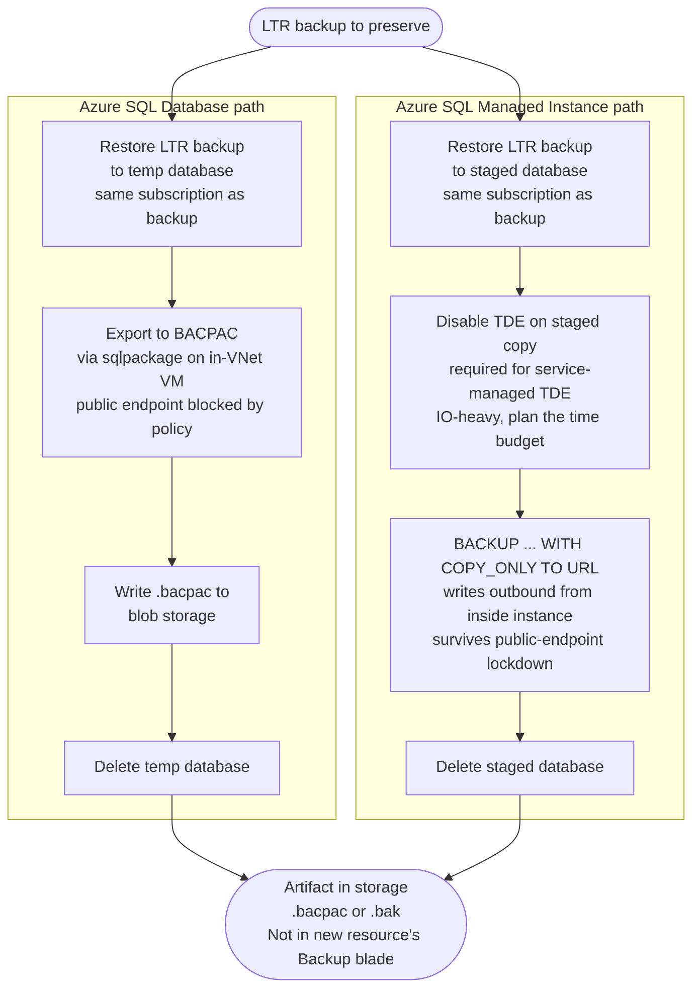

# Preserving SQL long-term retention backups across a subscription deletion

Guidance for anyone who has to keep Azure SQL Database or Azure SQL Managed Instance
long-term retention (LTR) backups when the subscription that owns them is going away.

This document is in two parts.

**Part 1 is the guidance.** Concepts, the questions to ask before you start, a decision
tree, scenario playbooks, caveats, and a recommended process per resource type. Read it to
decide what to do.

**Part 2 is the evidence appendix.** What was measured, on what hardware, in what
governance model, and what was deliberately left unmeasured. Read it to decide whether to
trust Part 1. Figures in Part 1 that carry a number are traceable to Part 2; figures that
are unmeasured say so explicitly rather than being filled in with a plausible guess.

The tooling referenced throughout lives in `src/powershell/sql-ltr-export/`.

---

# Part 1: guidance

## The problem

An Azure SQL Database and an Azure SQL Managed Instance live in a source subscription. New
equivalents are being stood up in a different subscription. The source resources, and
eventually the whole source subscription, will be deleted. Compliance requires that a
subset of the backup history survives that deletion.

The outcome most people want is that the retained backups show up in the **Backup blade of
the new resources**, so a restore is a normal portal operation. The acceptable fallback is
that the backups land as files in a storage account, ideally in the destination
subscription.

### The answer, stated up front

**You cannot move LTR backups.** They are not a movable resource. There is no Azure
Resource Mover path, no export-to-storage path, no cross-subscription attach. The only
operation Azure exposes on an LTR backup is "restore it into a live database", and restore
is subscription-locked: you can only restore an LTR backup into a server or instance in the
**same subscription** that owns the backup.

**You cannot make old backups appear in a new resource's Backup blade.** That blade
reflects the new resource's own PITR and LTR chains, which begin at creation. There is no
import mechanism.

Therefore the only viable route is a **drain**: restore each LTR backup you must keep,
extract a portable artifact from the restored copy, write that artifact to storage, and
delete the restored copy. This drain must run **while the source subscription is still
alive**, because deleting the subscription purges the LTR backups.

**If the source subscription is not actually being deleted, stop here.** LTR backups
survive deletion of the database, the logical server, the managed instance, and the whole
resource group. If you are
only decommissioning resources and the subscription stays (even empty), do nothing: the
backups persist and you pay only LTR storage. The drain exists solely to beat a
subscription-deletion deadline.

**How far the drain is proven.** The Managed Instance half of this chain has been executed
end to end against a real LTR backup: restore, row count and checksum verification,
decrypt, drop the database encryption key, `BACKUP DATABASE ... WITH COPY_ONLY, COMPRESSION`
to URL, `RESTORE VERIFYONLY`, and confirmation of the resulting blob from inside the VNet
against storage with shared-key access and public network access both disabled. On the SQL
Database half the restore mechanism is proven and the BACPAC artifact has been imported
back into a working database with matching row counts and checksums, but the LTR restore
rate was never measured and this lab can no longer produce it. Exact figures, and the list of
what remains unmeasured, are in
[Appendix A](#appendix-a-validation-evidence).

Two behaviours change how you should plan a real drain, and both are covered in the
Caveats:

- **An LTR backup's content can predate the policy that created it.** Enabling LTR does not
  capture the current state of the database; the service retroactively adopts an existing
  PITR full backup. Verify `backupTime` before you delete anything.
- **An LTR-restored database arrives TDE-encrypted**, reflecting the encryption state at
  backup time rather than the current state of the source. The decrypt step therefore
  repeats for every retained backup and never amortises to a one-off.
- **An LTR backup's retention cannot be extended after the backup exists.** A policy change
  applies only to future backups, and there is no CLI path to change the expiry of a backup
  already taken. The policy has to be right *before* the backups are generated, not after
  you discover how long you needed them.


Source: `diagrams/00-solution-overview.mmd`

---

## Concepts and vocabulary

This section is written for a competent engineer who is not a database administrator.

### PITR: point-in-time restore backups

PITR backups are automatic and always on. You cannot disable them and they are not
separately billable beyond the included allowance. Retention is configurable from 1 to 35
days (default 7). Under the hood, Azure takes a weekly full backup, daily differential
backups, and transaction log backups every 5 to 12 minutes. This combination is what lets
you restore a database to any arbitrary second within the retention window.

**Purpose:** operational recovery. "Someone dropped a table an hour ago."

**Critical property:** PITR backups are deleted when the database is deleted. They are the
wrong tool for compliance retention.

### LTR: long-term retention backups

LTR is an opt-in policy. You configure it per database to retain specific weekly, monthly,
or yearly full backups for up to 10 years. LTR is not a continuous chain: if you restore
from an LTR backup you land at the exact instant that backup was taken, nothing in between.

**Purpose:** compliance and regulatory retention.

**Critical property: LTR has its own lifecycle, independent of the resource that produced
it.** An LTR backup survives deletion of the database, deletion of the logical server,
deletion of the managed instance, and deletion of the entire **resource group** that held
them. The binding scope is the **subscription**, and the backup is purged only when the
subscription is deleted. This is why deleting the old database, instance or resource group
is safe, but deleting the old subscription is not. This lab has now tested the persistence
half of that claim for both Azure SQL Database and Managed Instance by deleting the whole
resource group and confirming all four LTR backups were still present and still enumerable
afterwards, with unchanged `backupTime` and unchanged expiry; see
[Appendix A](#appendix-a-validation-evidence).

**Persisting is not the same as having been restored.** What this lab verified is that the
orphaned backups continue to exist and enumerate after their parent resources are destroyed.
Restoring one of those orphaned backups into a fresh server or managed instance was **not**
done here. Microsoft documents that it works within the same subscription, and that
documentation is quoted in appendix A, but treat it as documented rather than as verified by
this lab.

Note which way this cuts. Because the binding scope is the subscription, LTR backups
tolerate almost any destruction below that scope, but they cannot outlive the subscription
itself. That is exactly why a subscription which cannot be moved to another Entra directory
(a common CSP constraint) forces the drain: there is no resource-level escape hatch,
because the backups are not resource-level objects.

**Second critical property: an LTR backup is a copy of a PITR full backup, not a fresh
capture.** Enabling an LTR policy does not snapshot the database at the moment you enable
it. The service adopts an existing full backup from the PITR chain, so the content of the
first LTR backup can predate the policy by up to the full-backup interval. The `backupTime`
field on the backup, not the time you set the policy, is what tells you what the backup
actually contains. This is measured behaviour in this lab; see the Caveats.

**Third critical property: an LTR backup preserves the encryption state as of backup time.**
If the database was TDE-encrypted when the adopted full backup was taken, the restored copy
comes back encrypted even if encryption has since been turned off on the source.

**Fourth critical property: the expiry date on a backup comes from the policy that was in
force when it was taken, and cannot be changed afterwards.** The expiry you see on a backup
is not a platform ceiling and carries no compliance meaning of its own; it is simply your own
retention setting applied to that backup's `backupTime`. LTR supports retention of up to 10
years, so a short expiry is a statement about the policy, not about what LTR can do. The
consequence is unforgiving and is written up as its own caveat below: changing the policy
later does not reach back into backups that already exist.

### What the portal's Backup blade shows

Both PITR and LTR, on separate tabs. PITR backups appear on the "Available backups" tab.
LTR backups appear on the "Long-term retention" tab. After the database is deleted, PITR
backups disappear. LTR backups remain visible as long as the subscription exists, and are
documented as restorable to another server or managed instance in the same subscription.
This lab verified the persistence and the visibility; it did not restore an orphaned
backup, so treat the restore half as documented rather than demonstrated here.
After the subscription is deleted, both are gone permanently.

### BACPAC

A BACPAC is a logical export: schema plus data as rows, compressed into a zip package
(`.bacpac` file). It is portable and version-tolerant, and it can be restored into Azure
SQL Database or SQL Server via an import operation.

**Important:** a BACPAC is only transactionally consistent if you export from a quiesced or
freshly restored database. Exporting from a live, write-active database can produce an
internally inconsistent snapshot. When using the drain pipeline (restore first, then
export), the restored copy receives no writes, so this is not a problem in practice.

BACPAC export can also fail outright on objects that the DacFx tooling does not support,
which is more common on SQL MI than on SQL Database.

### COPY_ONLY native backup

A COPY_ONLY backup is a real SQL Server backup file (`.bak`) that does not disturb the
differential base or the transaction log chain, making it safe to take alongside an
existing backup schedule. It is fast, byte-exact, and transactionally consistent.
Integrity can be verified years later with `RESTORE VERIFYONLY` without actually restoring
the database. `RESTORE VERIFYONLY` is useful, but it is not the same thing as a restore;
the lab now also proves that the `.bak` artifact restores into a working database.

**This is a Managed Instance capability only.** Azure SQL Database has no `BACKUP DATABASE`
statement. See the comparison table and caveats below.

### Comparison table

| | PITR | LTR | BACPAC | COPY_ONLY `.bak` |
|---|---|---|---|---|
| What it is | Continuous chain of automated backups | Retained point-in-time snapshots | Logical schema+data export | Native SQL Server backup |
| Restore granularity | Any second within window | Exact instant of the backup | Exact state at export time | Exact state at backup time |
| Portable (file you can hold) | No | No | Yes (.bacpac) | Yes (.bak) |
| Survives database deletion | No | Yes | Yes (it is a file) | Yes (it is a file) |
| Survives subscription deletion | No | No | Yes | Yes |
| Cross-subscription restore | Not directly | No (subscription-locked) | Yes, import anywhere | Yes, restore to SQL MI or SQL Server |
| Available on Azure SQL DB | Yes | Yes | Yes | No |
| Available on Azure SQL MI | Yes | Yes | Requires sqlpackage + network access | Yes |
| Integrity verifiable without restore | No | No | No | Yes (RESTORE VERIFYONLY) |
| Typical use | Operational recovery | Compliance retention | Portability, cross-platform migration | Compliance archive, high-fidelity MI drain |

---

## Questions to ask before you start

Use this section to scope your own environment before reading the procedure. Each question
identifies a constraint that changes which pipeline steps are available to you. If an answer
rules out an approach, note it before you start, not after a partial drain that has already
created temporary databases.

### Resource and artifact shape

| Question | Why it matters | What it rules in or out |
|---|---|---|
| **1. Is it Azure SQL Database or Managed Instance?** | SQL Database has no `BACKUP DATABASE` statement at all. MI does. | SQL DB: BACPAC is the only portable artifact. MI: COPY_ONLY native `.bak` is the default (supports `RESTORE VERIFYONLY`). BACPAC is also possible on MI but requires `sqlpackage` with network line-of-sight and loses the integrity verification benefit. |
| **2. Are you using TDE? If yes, which flavour: service-managed or customer-managed (BYOK / Key Vault)?** | Service-managed TDE: the key never leaves the platform, so a `.bak` produced with `COPY_ONLY` is unrestorable anywhere. TDE is on by default on MI. | Service-managed: disable TDE on every staged copy, wait until `sys.dm_database_encryption_keys` reports `encryption_state = 1`, then drop the database encryption key before backup. The DEK drop is mandatory; the unencrypted state alone is not enough. Customer-managed: `COPY_ONLY TO URL` works directly and the `.bak` stays encrypted, but the Key Vault key must be preserved for the full retention period in a vault that outlives the source subscription; lose the key and every artifact is permanently unreadable. In both cases the artifact is a `.bak` file supporting `RESTORE VERIFYONLY`. |
| **3. How large is the largest database?** | `BACKUP TO URL` on MI caps at 195 GB per stripe, 64 stripes maximum (roughly 12.5 TB total). | Up to 195 GB: single-stripe backup. Above 195 GB: striping required, use `-GbPerStripe` in the script. Above ~12.5 TB: `COPY_ONLY` is not feasible; BACPAC may be the only option, at the cost of losing `RESTORE VERIFYONLY` support. |
| **4. Does the instance have enough storage headroom for the drain?** | The drain restores each database onto the live instance before extracting the artifact. That consumes instance storage for the restored database, its log growth, and the artifact workflow's working set. | Size the MI for the largest database being drained plus operational headroom. This is a hard planning constraint, independent of throughput measurements. |
| **5. Does the in-VNet VM have a staging disk sized for the largest BACPAC?** | Client-side `sqlpackage` reads and writes local files only. It has no native Azure Blob Storage IO, so SQL Database artifacts must land on VM disk before upload and be downloaded to VM disk before import. | Add a data disk with free space for the largest single artifact, sized against the compression floor, not the expected compression case, provided each local artifact is deleted only after its upload is verified. If artifacts run in parallel or stale files accumulate after failed runs, size for peak concurrent occupancy instead. The MI `.bak` path does not need this disk because the artifact streams directly between the instance and blob storage. |

### Network and access governance

| Question | Why it matters | What it rules in or out |
|---|---|---|
| **6. Is public network access allowed on the logical server or managed instance?** | `az sql db export` is a Microsoft-managed service that connects inbound over the public endpoint. If the endpoint is off, the mechanism is unavailable, not merely unauthorised. A tenant policy can force `publicNetworkAccess` to `Disabled` and silently ignore API requests to enable it, returning success status without changing the value. | Public endpoint allowed: `az sql db export` and the standard drain script work. Public endpoint disabled: client-side `sqlpackage` from in-VNet compute over a private endpoint is the only SQL DB option. The MI path (`BACKUP TO URL`) is unaffected because it writes outbound from inside the instance and never depends on an inbound service. |
| **7. Does the storage account allow shared-key access?** | Shared-key disabled kills account keys and SAS tokens together. The trap: `az storage account keys list` still succeeds and returns a key that then fails on every data-plane operation. The failure is confusingly late and looks like a permissions error. | Shared-key allowed: SAS-based `BACKUP TO URL` works. Shared-key disabled: SAS unavailable. Use a Managed Instance managed identity credential: `CREATE CREDENTIAL ... WITH IDENTITY = 'Managed Identity'`. This is documented for Azure SQL Managed Instance and has been verified under shared-key-disabled storage. |
| **8. Is the storage account's public network access disabled?** | Even if the SQL resource can reach storage internally, a locked-down storage firewall blocks all workstation-based and managed-service writes at the data plane. | Storage public access allowed: writes go directly. Storage public access disabled: all data-plane calls must originate from inside the VNet. Requires in-VNet compute, a private endpoint on the storage account, a private DNS zone, and `Storage Blob Data Contributor` RBAC on the writing identity. A private endpoint bills at $0.01 per hour regardless of traffic; consider whether to create it only for the drain and delete it afterwards. |

### Scope, timing and cost

| Question | Why it matters | What it rules in or out |
|---|---|---|
| **9. When is the source subscription being deleted?** | This is the hard deadline. LTR backups survive database, server, instance and resource group deletion, but are purged permanently when the subscription is deleted. There is no recovery after that point. | Build in time for a full recovery drill (restore at least one artifact end to end) before the subscription is deleted. An untested compliance archive is not a compliance archive. |
| **10. Which subset of LTR backups must you actually retain for compliance?** | Cost scales directly with count and size. Artifact storage dominates the multi-year total by roughly 50x over compute. A wide compliance scope is also a large and costly archive. | Narrowing the scope to the legally required minimum is the single largest cost lever available. Run `src/powershell/sql-ltr-export/Get-LtrExportCostEstimate.ps1` for each candidate scope before committing. |
| **11. Do you have vCore and server quota headroom in the source subscription for the temporary restore targets?** | The drain creates temporary databases in the source subscription. SQL DB logical servers are free, but General Purpose vCores and MI vCores consume regional quota. | Check `az sql server list-usages` and MI vCore quota before starting. Running out of quota mid-drain leaves orphaned temporary databases that keep billing and require manual cleanup. |
| **12. Can the Managed Instance stay running for the entire LTR retention wait (up to 7 days)?** | A stopped MI takes no automated backups at all. A skipped LTR backup is never backfilled. Stopping the instance during the wait destroys the backup you were waiting to produce. | The MI must stay running for the entire wait. The free MI offer defaults to a schedule that stops the instance outside working hours to conserve credits; that schedule is incompatible with a continuous retention wait. |
| **13. How long must each retained backup actually be kept, and is the LTR policy already set to that figure?** | Answer this together with question 10: question 10 fixes *which* backups you keep, this one fixes *how long*. LTR retention is set by policy and applied at the moment a backup is taken. A policy change applies only to future backups, and there is no CLI operation that changes the expiry of a backup that already exists. A short policy chosen for convenience quietly becomes permanent for every backup taken under it. | Policy already matches the compliance figure: proceed. Policy shorter than the compliance figure: fix the policy **first** and wait for backups taken under the corrected policy, because the existing ones cannot be rescued. If you cannot wait, the drain to a customer-controlled storage account is the escape hatch, since artifact lifecycle is yours to set and to change later. |

### Storage tier recommendation

These artifacts exist solely for compliance and will most likely never be read. The tier choice follows directly from a single question: how long can you wait for a file before a restore can begin?

**Default recommendation: Archive.** Rehydration can take up to 15 hours, but Archive is the lowest cost tier by a significant margin. For a file that may sit untouched for years and is accessed only if a regulator or auditor requires a restore, that wait is acceptable.

**Choose Cold instead** when retrieval within minutes is required (for example, your recovery time objective is shorter than 15 hours).

Both Archive and Cold are flat-rate at any volume. Hot is volume-banded and priced for frequent reads; it is the wrong tier for this use case. Redundancy choice (LRS versus GRS) is a separate input: GRS roughly doubles the storage cost but protects against a regional outage. For multi-year compliance archives the cost difference compounds. See `cost-model/` for the full tier and redundancy comparison.

---

## The decision tree

Three inputs determine which pipeline is available to you: the resource type, the TDE
flavour, and whether the public endpoint on the logical server is reachable. Everything
else is a cost or a time-budget question layered on top.

Walk the tree, then go straight to the matching playbook in the next section. You do not
need to read the rest of this document to execute a single branch.

The tree selects the **extraction pipeline**. Three further questions do not change the
pipeline but do change what you have to build around it, so they are handled as overlay
playbooks rather than as branches: whether the database exceeds the stripe limit (playbook
E), whether the artifact storage account is locked down (playbook F), and whether the
artifact storage account lives in a **different Entra tenant** from the source (playbook G).
Answer the tree first, then check each overlay.


Source: `diagrams/04-decision-tree.mmd`

---

## Scenario playbooks

Each playbook below is a complete path for one branch of the decision tree. Find the one
that matches your environment and follow it. They are deliberately self-contained, so they
repeat a little: a reader executing playbook C should not have to reconstruct it from four
other sections.

| Playbook | Situation | Artifact | Integrity verifiable without restore |
|---|---|---|---|
| [0](#playbook-0-the-source-subscription-is-not-being-deleted) | Subscription survives; only resources are being deleted | None needed | n/a |
| [A](#playbook-a-azure-sql-database-public-endpoint-reachable) | Azure SQL Database, public endpoint reachable | `.bacpac` | No |
| [B](#playbook-b-azure-sql-database-public-endpoint-disabled) | Azure SQL Database, public endpoint disabled | `.bacpac` | No |
| [C](#playbook-c-managed-instance-service-managed-tde) | Managed Instance, service-managed TDE (the default) | `.bak` | Yes |
| [D](#playbook-d-managed-instance-customer-managed-tde-or-no-tde) | Managed Instance, customer-managed TDE or no TDE | `.bak` | Yes |
| [E](#playbook-e-any-database-larger-than-195-gb) | Any database larger than 195 GB | `.bak` striped, or `.bacpac` | Yes, if striped `.bak` |
| [F](#playbook-f-the-artifact-storage-account-is-locked-down) | Artifact storage account is locked down | Overlay on C, D or E | Unchanged |
| [G](#playbook-g-the-target-subscription-is-in-a-different-tenant) | Target subscription is in a different Entra tenant | Overlay on A, B, C, D or E | Unchanged |

Playbooks E, F and G are overlays. They modify the lettered playbooks rather than replacing
them, and they can stack.

### Playbook 0: the source subscription is not being deleted

**When this applies.** You are decommissioning the database, the logical server, or the
managed instance, but the subscription itself is being kept, even as an empty shell.

**Which constraints bite.** None. LTR backups are linked to the subscription, not to the
resource that produced them. They survive deletion of the database, the server, the
instance, and the resource group that contained all of them.

**The path.** Delete the resources. Leave the LTR policies and backups alone. Verify once,
**before** the deletion, that the backups enumerate by location alone, then again after the
deletion that they are still there:

```powershell
# Scoped to a server or instance. Only works while that server or instance still exists.
az sql db ltr-backup list -l <region> -s <server> -g <rg> -o table
az sql midb ltr-backup list -l <region> --mi <instance> -g <rg> -o table

# Location only, no --server and no --mi. This is the handle that survives the deletion.
az sql db ltr-backup list -l <region> --database-state All -o table
az sql midb ltr-backup list -l <region> -o table
```

**Location-only enumeration is the only practical way to find backups orphaned by a server
that has already been deleted.** Prove it works in your subscription before you delete
anything, because once the server or instance is gone it is the only handle you have left.
The backups keep referencing a server or instance that no longer exists anywhere in the
portal.

**One link here is documented rather than verified in this lab.** Enumeration of orphaned
backups was tested; **restoring** an orphaned backup into a fresh server or managed instance
was not. Microsoft documents that it is supported within the same subscription (quoted in
appendix A). If your compliance position depends on it, restore one orphaned backup as a
drill while you still can, rather than assuming it on this document's authority.

**What it costs you.** LTR storage only, for the configured retention period. This is by a
wide margin the cheapest outcome. If there is any chance of keeping the subscription, price
that option before committing to a drain.

**The trap.** "The subscription is being deleted eventually" is not the same as "the
subscription is being kept". If the deletion is merely deferred, you still need a drain and
you now have a deadline you have not written down. Establish the deletion date before
choosing this playbook.

**The second trap: deleting the resource group does not stop LTR billing.** If you are
decommissioning rather than retaining, deleting the resource group removes the servers and
instances but leaves every LTR backup in place, billable to its full retention expiry,
attached to resources that no longer appear anywhere in the portal. Deleting them is an
explicit, separate act:

```powershell
az sql db ltr-backup delete -l <region> -s <server> -d <db> -n <backup-name> --yes
az sql midb ltr-backup delete -l <region> --mi <instance> -d <db> -n <backup-name> --yes
```

Take `<backup-name>` from the `name` field of the corresponding `ltr-backup list` output and
pass it verbatim; like the restore identifier, it is a composite value and a hand-assembled
one will not resolve. The Managed Instance command also accepts `--id` with the full backup
resource id instead of the four scoping arguments. `az sql midb ltr-backup delete` still
emits a CLI preview warning; that is expected and is not a failure. See the cleanup caveat in
group 1 for the full shape of this trap.

**If the retained subscription is in a different tenant from the people who now operate it,
use Azure Lighthouse.** This is the common shape after a tenant migration: the old
subscription is kept for compliance, but every operator has moved to the new tenant. Leave the
subscription where it is and delegate its resources to the target directory, so users there
can enumerate and restore the LTR backups without guest accounts or shared credentials.
Reference:
<https://learn.microsoft.com/en-us/azure/role-based-access-control/transfer-subscription>.

Be precise about what this does and does not do. Lighthouse changes **who can reach** the
subscription; it does not move or copy anything. It is not a substitute for a drain when the
subscription really is going to be deleted, because the LTR backups still live in, and die
with, the source subscription. If your subscription is being deleted, you are in
[playbook G](#playbook-g-the-target-subscription-is-in-a-different-tenant), not here.

### Playbook A: Azure SQL Database, public endpoint reachable

**When this applies.** The LTR backups belong to an Azure SQL Database, and
`publicNetworkAccess` on the logical server is `Enabled` and can stay that way for the
duration of the drain.

**Which constraints bite.**

- Azure SQL Database has no `BACKUP DATABASE` statement. BACPAC is the only portable
  artifact available to you, and BACPAC has no equivalent of `RESTORE VERIFYONLY`. You
  cannot cheaply check an archived artifact years later; the only check is a full import.
- `az sql db export` runs as a Microsoft-managed service that connects **inbound** to the
  database over its public endpoint. Availability of that endpoint is the entire premise of
  this playbook. If it is disabled, this is not a permissions problem you can grant away;
  use playbook B.
- Under Entra-only authentication, `az sql db export` additionally requires a server-level
  user-assigned managed identity, which is a preview feature. See the governance caveats.
- A restore that reports `Online` is not evidence that the backup carried data. Verify row
  counts, not status.

**The path.** For each LTR backup you must retain:

1. Read `backupTime` on the backup and confirm it postdates the data you are required to
   keep. Do this before deleting anything.
2. Restore the LTR backup to a temporary database in the **source** subscription, using the
   `id` returned by `az sql db ltr-backup list` verbatim. The `;` separators and the tier
   suffix are significant; a hand-assembled identifier will not resolve.
3. Count rows in the restored database and compare against the source.
4. Export to BACPAC with `az sql db export`, writing to the destination storage account.
5. Verify the uploaded blob exists and has the expected size.
6. Delete the temporary database.

**What it costs you.** The temporary database's compute for the duration of the restore and
export. Logical servers are free; only the database bills. Export throughput measured in
this lab fitted `ExportMin = 0.36 + 0.159 * SizeGb` with R-squared 1.00, but that rate is
environment-specific (same region, private endpoint, 4 vCPU client) and must not be
generalised to a cross-region or public-internet path. Artifact storage dominates the
multi-year total by roughly 50x over compute, so scope reduction is the real cost lever.
Size the archive against the **1.04x compression floor** rather than the 4.0x realistic
case unless you know the entropy of your data.

**What you give up.** No `RESTORE VERIFYONLY`. No byte-exact fidelity: BACPAC is a logical
export, so a restored copy is a rebuilt database rather than a page-for-page reproduction.
A smaller LOG allocation after import is normal and is not data loss.

### Playbook B: Azure SQL Database, public endpoint disabled

**When this applies.** Same as playbook A, except `publicNetworkAccess` on the logical
server is `Disabled`, whether by choice or by a tenant policy you cannot override.

**Which constraints bite.** Everything in playbook A, plus:

- The Microsoft-managed export service cannot reach the database at all. `az sql db export`
  is unavailable, not merely unauthorised.
- `sqlpackage` reads and writes **local files only**. It has no native Azure Blob Storage
  IO. Every byte of every BACPAC therefore physically transits a local disk on the way out,
  and again on the way back in if the artifact is ever restored. This staging hop is
  inherent to the client-side approach, not an implementation shortcut.
- You now own compute, a private endpoint, private DNS, and the `sqlpackage` installation.
- A private endpoint bills at $0.01 per hour regardless of traffic.

**The path.** Steps 1 to 3 are identical to playbook A. Then:

4. From a VM inside the virtual network, connected to the logical server over a private
   endpoint, run `sqlpackage` to export the `.bacpac` to VM local disk.
5. Upload the `.bacpac` to the destination storage account with a parallel-capable tool
   such as `azcopy`.
6. Verify the uploaded blob exists and has the expected size.
7. Delete the local staging copy **only after** the upload is verified. Until then the local
   file is the only copy of that artifact.
8. Delete the temporary database.

To restore later, reverse the movement: download the `.bacpac` to VM local disk, then import
it with `sqlpackage`.

**What it costs you.** Everything in playbook A, plus the VM, its data disk, the private
endpoint at $0.01 per hour, and DNS. Consider creating the private endpoint for the drain
window only and deleting it afterwards.

**Size the staging disk against the 1.04x compression floor, not the 4.0x expected case**,
and size it for peak concurrent occupancy if you parallelise. Running out of disk part way
through an export fails the job outright, potentially under a deletion deadline. The worked
example and the stale-file accumulation risk are in the staging-disk caveat.

**Budget the transfer time twice.** Every artifact crosses the network on export and again
on any later restore.

### Playbook C: Managed Instance, service-managed TDE

**When this applies.** The LTR backups belong to an Azure SQL Managed Instance using
service-managed TDE. This is the default on Managed Instance, so it is the common case. It
is also the path proven end to end in this lab, and the path that survives a locked-down
tenant.

**Which constraints bite.**

- `BACKUP DATABASE ... WITH COPY_ONLY` against a service-managed TDE database **fails with
  Msg 41922**. The platform key never leaves the service, so the resulting `.bak` would be
  unrestorable anywhere.
- Turning encryption off is not sufficient on its own. Once
  `sys.dm_database_encryption_keys` reports `encryption_state = 1`, the backup **still
  fails with Msg 41938** until the database encryption key is dropped. Seeing
  "unencrypted" in the DMV does not mean you are done.
- **Every LTR-sourced restore arrives encrypted**, reflecting the encryption state at backup
  time, even if the source database has since had encryption turned off and its DEK
  dropped. The decrypt cost therefore multiplies by the number of retained backups and never
  amortises.
- Managed Instance **rejects `RESTORE ... WITH STATS`** with Msg 41901. Habitual SQL Server
  examples include it; remove it or the restore fails for a reason that has nothing to do
  with your backup.
- The instance needs storage headroom for the largest restored copy plus log growth during
  the staged operations. This is a capacity requirement, not a timing estimate.
- If the instance is currently stopped, it takes no automated backups and a cold start to
  `Ready` took roughly 20.5 minutes in this lab.

**The path.** Do the Managed Instance half first if you have both resource types, because
restoring into the **already running source instance** makes the compute cost of staging
zero. That is the single largest cost lever in the whole process.

For each LTR backup you must retain:

1. Read `backupTime` and confirm it postdates the data you must keep.
2. Restore the LTR backup to a temporary database on the instance, in the same subscription.
   **Do not add `WITH STATS`.**
3. Count rows in the restored copy and compare against expectation.
4. `ALTER DATABASE ... SET ENCRYPTION OFF`, then poll
   `sys.dm_database_encryption_keys` until `encryption_state = 1`.
5. `DROP DATABASE ENCRYPTION KEY;` inside the database. This step is mandatory.
6. `BACKUP DATABASE ... WITH COPY_ONLY, COMPRESSION TO URL`, writing directly to the
   destination blob storage account. The artifact streams from the instance to storage and
   never touches a VM.
7. `RESTORE VERIFYONLY` against the written artifact.
8. Delete the temporary database immediately.

See `src/powershell/sql-ltr-export/Export-SqlMiLtrBackups.ps1`.

**What it costs you.** If the source instance is still running, the marginal compute cost is
zero and you pay only instance storage for the staged copies and the artifact storage. The
dominant time cost is the decrypt step. Plan it at the two-point calibration slope of
roughly **0.23 min/GiB of ROWS file**, applied **once per retained backup**, not once per
database. Apply that slope on the same basis it was fitted on: ROWS file GiB from
`sys.database_files`. Dividing by total file size including the log can be wrong by nearly
a factor of two.

**What you get.** A plaintext `.bak` that supports `RESTORE VERIFYONLY`, restores into any
Managed Instance or SQL Server, and is byte-exact. Because it is plaintext, protect it with
immutable blob storage and service-side encryption on the storage account.

### Playbook D: Managed Instance, customer-managed TDE or no TDE

**When this applies.** The instance uses customer-managed TDE (BYOK, Azure Key Vault), or
TDE is off entirely.

**Which constraints bite.** The Msg 41922 and Msg 41938 sequence does not apply; you can
back up directly. Msg 41901 (`WITH STATS`), the storage headroom requirement, and the
stopped-instance behaviour all still apply, as does `backupTime` verification.

**The one constraint that replaces the decrypt step is worse.** With customer-managed TDE
the `.bak` stays encrypted, which is good for artifact confidentiality and fatal for
recoverability if you lose the key. You must preserve that Key Vault key for the **full
retention period, in a vault that outlives the subscription being deleted**. Lose the key
and every artifact you drained is permanently unreadable. Treat key custody as a first-class
deliverable of the drain, not an afterthought.

**The path.** Playbook C with steps 4 and 5 removed:

1. Verify `backupTime`.
2. Restore to a temporary database, without `WITH STATS`.
3. Verify row counts.
4. `BACKUP DATABASE ... WITH COPY_ONLY, COMPRESSION TO URL`.
5. `RESTORE VERIFYONLY`.
6. Delete the temporary database.

**What it costs you.** Less time than playbook C, because the decrypt slope disappears from
the budget. More long-term operational risk, because the archive is now only as durable as
your key custody. If you do not already run customer-managed TDE, do not adopt it for the
drain: the toolkit defaults to disabling TDE on the staged copy precisely to avoid
introducing a key that must outlive the old subscription.

### Playbook E: any database larger than 195 GB

**When this applies.** Overlay on playbooks C or D. `BACKUP TO URL` on Managed Instance
caps at **195 GB per stripe, 64 stripes maximum**, which is roughly 12.5 TB in total.

**The path.**

- Up to 195 GB: single-stripe backup, no change.
- Above 195 GB: stripe the backup. The toolkit exposes this as `-GbPerStripe`. The multi-URL
  `BACKUP` and `RESTORE VERIFYONLY` syntax, the stripe-count arithmetic, and the manifest
  `Stripes` field all follow from that one parameter.
- Above roughly 12.5 TB: `COPY_ONLY` is not feasible at all. BACPAC may be the only option,
  at the cost of losing `RESTORE VERIFYONLY` and byte-exact fidelity.

**What it costs you.** Nothing extra in money; a stripe set is the same total bytes. What it
costs is operational care: a striped backup is only restorable if **every** stripe survives.
Record the stripe count in your manifest and verify each blob, because losing one stripe of
a 40-stripe set loses the whole artifact.

**Also check instance storage headroom first.** The restored copy has to fit on the instance
before you can back it up. A database large enough to need striping is large enough to
exhaust an instance sized for steady-state operation.

### Playbook F: the artifact storage account is locked down

**When this applies.** Overlay on playbooks C, D or E. The destination storage account has
`allowSharedKeyAccess` set to false, `publicNetworkAccess` set to `Disabled`, or both. This
is common in governed tenants and is one of the places where the naive path fails late and
confusingly.

**Which constraints bite.**

- **Shared-key disabled kills account keys and SAS tokens together.** The trap is that
  `az storage account keys list` still succeeds and returns a key. That key then fails on
  every data-plane call, and the failure looks like a permissions problem rather than a
  configuration one. SAS-based `BACKUP TO URL` is simply unavailable.
- **Storage public network access disabled** means every data-plane call must originate from
  inside the VNet. That includes your verification steps: a blob listing issued from a
  workstation will fail by design even though the write succeeded.

**The path.**

1. Give the Managed Instance a user-assigned managed identity and grant it
   `Storage Blob Data Contributor` on the artifact storage account.
2. Create the credential with the identity rather than a SAS:
   `CREATE CREDENTIAL ... WITH IDENTITY = 'Managed Identity'`.
3. Put a private endpoint on the storage account with a matching private DNS zone.
4. Run all verification (blob listing, size checks) from compute inside the VNet.
5. Proceed with playbook C, D or E unchanged.

**What it costs you.** A private endpoint at $0.01 per hour, plus the RBAC and DNS setup.
Consider creating the private endpoint for the drain window only.

**Why this overlay only exists for the Managed Instance path.** `BACKUP TO URL` writes
**outbound from inside the instance**, so a locked-down storage account is a solvable
credential and networking problem. The SQL Database managed export service connects inbound
and has no equivalent workaround; on that half, storage lockdown stacks on top of the
endpoint problem that already forced you into playbook B.

### Playbook G: the target subscription is in a different tenant

**When this applies.** Overlay on any lettered playbook. The source subscription is in one
Entra tenant and the destination for the drained artifacts is in another. This is the normal
shape of a Cloud Solution Provider exit, where the old subscription sits in the partner's or
a legacy tenant and the new one is created under the organisation's own tenant.

Everything in playbooks A to F still applies unchanged. The only thing this overlay changes
is **how the source-side identity is authorised against target-tenant storage**.

**Before anything else: ask whether the subscription itself can move.** This is the question
that decides whether you need a drain at all, and it is worth an hour of investigation before
you spend days building one. The drain exists because the **subscription** cannot move, not
because LTR backups are inherently unmovable. If the subscription can be transferred to the
target directory, the subscription is never deleted, so the LTR backups are never purged, and
the entire drain becomes unnecessary. Reference:
<https://learn.microsoft.com/en-us/azure/role-based-access-control/transfer-subscription>.

Three things to establish, in this order:

- **Is it a CSP subscription?** If so, stop: this option does not exist. The page states that
  "For Azure Cloud Solution Providers (CSP) subscriptions, changing the Microsoft Entra
  directory for the subscription isn't supported." That single sentence is what forces the
  drain for CSP customers, and it is the reason a Cloud Solution Provider exit ends in
  re-creating databases in the new tenant rather than moving them.
- **If it is not CSP, what does the transfer destroy?** The option exists but is not free. Per
  the same page: all role assignments and all custom roles are **permanently deleted**;
  system-assigned managed identities must be disabled and re-enabled; user-assigned managed
  identities must be deleted, re-created and re-attached; and Key Vault requires its
  associated tenant ID to be updated, which matters directly if you are using customer-managed
  TDE. The page also warns that transfers can require downtime. In other words, a directory
  transfer destroys precisely the identity plumbing the rest of this playbook depends on, so
  it is a decision to take *instead of* the drain, not alongside it.
- **Would it actually preserve the LTR backups?** Reasoning from documented behaviour rather
  than from a lab result: LTR backups are purged when the **subscription is deleted**, and a
  directory transfer does not delete the subscription, so the purge trigger does not fire.
  **This was not tested here.** If your transfer is viable and the backups matter, verify
  enumeration after the move before you decommission anything.

**A retained subscription in the old tenant is a separate case.** If the subscription is being
kept for compliance but the people who would operate it now work in the target tenant, you do
not need a drain and you do not need a directory transfer either. See the Azure Lighthouse
note in [playbook 0](#playbook-0-the-source-subscription-is-not-being-deleted).

**Which constraints bite.**

- **A managed identity is a single-tenant service principal.** It exists only in its home
  tenant and cannot be granted an RBAC role in another one. The proven managed-identity path
  from playbook F, `CREATE CREDENTIAL ... WITH IDENTITY = 'Managed Identity'` writing to
  blob, therefore stops at the tenant boundary the moment the storage account moves to the
  target tenant. This is product behaviour, not a policy you can ask someone to relax.
- **Shared keys and SAS are not a way around it.** They may be disabled by policy on the
  target account, and relying on them reintroduces exactly the secret-handling the drain was
  supposed to avoid.

**The path.** Use **managed identity as a federated credential**, which is generally
available, not preview:
<https://learn.microsoft.com/en-us/entra/workload-id/workload-identity-federation-config-app-trust-managed-identity>.
The shape is a multi-tenant application registered in the source tenant that trusts the
managed identity, is provisioned into the target tenant, and holds the RBAC there. The
managed identity proves who it is; the application carries that proof across the boundary.

1. **In the source tenant**, create an app registration with
   `--sign-in-audience AzureADMultipleOrgs`.
2. **In the source tenant**, add a federated identity credential on that app: issuer
   `https://login.microsoftonline.com/<SOURCE_TENANT_ID>/v2.0`, subject set to the
   user-assigned managed identity's **`principalId`**, audience `api://AzureADTokenExchange`.
3. **In the target tenant**, provision the application: `az ad sp create --id <APP_ID>`.
4. **In the target tenant**, grant that service principal `Storage Blob Data Contributor` on
   the target storage account.
5. **On the source-side compute**, request an IMDS token with
   `resource=api://AzureADTokenExchange` and the user-assigned managed identity's
   `client_id`.
6. **Exchange it for a target-tenant token** at
   `https://login.microsoftonline.com/<TARGET_TENANT_ID>/oauth2/v2.0/token` with
   `grant_type=client_credentials`,
   `client_assertion_type=urn:ietf:params:oauth:client-assertion-type:jwt-bearer`,
   `client_assertion=<the IMDS token>` and `scope=https://storage.azure.com/.default`.
7. **Use the result as an ordinary bearer token** against the target storage account.

**How to confirm it actually crossed.** Decode the returned token and check that `tid` is the
target tenant and `aud` is `https://storage.azure.com`. Then list and read the written blob
**from target-tenant context**, not from the source side. A source-side read can succeed for
reasons that have nothing to do with the target tenant accepting the identity. Validation of
this path used a target storage account created with `--allow-shared-key-access false`, so it
is confirmed to work on RBAC alone, with no account keys and no SAS.

**Do not do any of this by hand.** Two scripts in `deploy/` cover it.
`New-CrossTenantDrainIdentity.ps1` performs steps 1 to 4 and is idempotent, so it also serves
as the pre-drain check that the configuration is still intact.
`Test-CrossTenantDrainToken.ps1` performs steps 5 to 7 from the source-side compute and
throws when the returned token's `tid` is not the target tenant. Invocation, the inlined token
exchange, and their verification status are in
[automating the drain](#automating-the-drain).

**Check these prerequisites before you plan around this, because they are the usual
blockers.**

- Creating the federated identity credential requires Application Administrator, Application
  Developer, Cloud Application Administrator, or ownership of the application, in the
  **source** tenant.
- Provisioning the application and assigning the storage role requires sufficient rights in
  the **target** tenant. In a CSP exit these are frequently two different people in two
  different organisations, which makes this a scheduling dependency as much as a technical
  one.
- There is a ceiling of **20 federated identity credentials** per application and per
  user-assigned managed identity. That is ample for a drain, but it constrains reuse of one
  application across many identities.

**What it costs you.** No additional Azure spend: an app registration, a federated credential
and a role assignment are free. The cost is administrative rights in both tenants and the
coordination to obtain them. Obtain them early; this is the step most likely to add calendar
days to a drain that has a hard subscription-deletion deadline.

**It does not cost you throughput.** A 1.219 GiB artifact crossed the boundary at
0.1655 min/GiB, within about four percent of the same-tenant `BACKUP TO URL` rate of
0.1725 min/GiB. Size the transfer with your same-tenant rates and add no boundary penalty.
This is a single observation at a single size; see
[appendix A](#cross-tenant-artifact-transfer).

**Two dead ends. Neither is a shortcut, and both cost time to rule out.**

- **Transferring the subscription to the other tenant.** Covered at the top of this playbook,
  and the conclusion is the same from both directions. For a CSP subscription it is
  **unavailable outright**: changing the Entra directory is not supported. For everyone else
  it is available but it **destroys the identity plumbing this drain depends on**, because
  role assignments and custom roles are permanently deleted, system-assigned identities must
  be disabled and re-enabled, and user-assigned identities must be deleted, re-created and
  re-attached. That makes it an alternative to the drain rather than a shortcut within one.
  Decide between them; do not start one and fall back to the other halfway.
- **Cross-Tenant Restore (preview).** It reads as though it solves this and it does not apply
  to Azure SQL PaaS at all. Its supported workloads are Azure VM, Azure Files, **SQL Server in
  Azure VM**, SAP HANA in Azure VM and SAP ASE in Azure VM. Azure SQL Database and Azure SQL
  Managed Instance are absent. **"SQL Server in Azure VM" is not Azure SQL PaaS**, and that is
  precisely the misreading that sends people down this path. The reason is architectural and
  therefore durable: the feature operates on Recovery Services vault recovery points, and
  Azure SQL PaaS LTR backups never live in a vault.

**Cleaning this up is not a resource-group delete.** The app registration, its federated
identity credential, and the target-tenant service principal are **directory objects**. They
live outside every resource group and outside every subscription, so deleting both resource
groups leaves a fully working cross-tenant trust in place. That was observed directly during
this lab's teardown: the resource groups were gone and the trust still worked until the
directory objects were deleted explicitly. Remove them as a deliberate step when the drain is
finished, in both tenants. `deploy/Remove-LtrLab.ps1` covers this (commit `f3c2911`); use the
script rather than reconstructing the delete sequence by hand.

**Not validated: the private-endpoint end state.** This path was validated with the target
storage account reachable over its **public endpoint**, deliberately, in order to isolate the
identity question from the network question. A private-endpoint-only target storage account
additionally needs network line of sight from source-tenant compute, which implies
cross-tenant VNet peering. That was not built and is not proven here. **This is the untested
combination of playbook F and playbook G**: F tells you to put a private endpoint on the
artifact storage account, and G was proven only against a public one. If you need both, treat
the networking as unproven work and budget for it.

---

## Caveats

Each caveat states what breaks, what the symptom looks like, and what to do instead. They
are grouped by the point in the drain at which they bite you, so you can read the ones
relevant to the step you are about to run.

Two kinds of constraint appear below, and they are not interchangeable:

- **Product behaviour** applies to everyone. Azure behaves this way regardless of your
  tenant, and you must plan around it.
- **Governance constraint** is something your organisation may or may not impose. These are
  tagged explicitly. Check whether the policy exists in your tenant before planning around
  it: a tenant without these controls has a materially simpler path, and assuming a
  constraint you do not have will cost you money and time for nothing.

Everything in the first three groups is product behaviour. The fourth group is governance.

### Group 1: caveats that bite while you are still planning

#### An LTR backup's content timestamp is not the time you set the policy

This is the most consequential planning behaviour here, and it is easy to get wrong because
the intuitive reading is the opposite of what happens.

**Enabling an LTR policy does not capture the current state of the database. It
retroactively adopts an existing PITR full backup, whose content can predate the policy by
up to the full-backup interval.**

Observed three ways:

| Observation | Policy set (UTC) | Resulting LTR `backupTime` (UTC) | Gap |
|---|---|---|---|
| SQL Database, five databases | 09:03:35 | 08:06:45 to 08:07:35 | backups are roughly an hour **earlier** than the policy |
| Managed Instance, `mitest` | 11:02:07 | 10:24:10 | backup is about 38 minutes **earlier** than the policy |

The mechanism was confirmed directly on one database by comparing the PITR chain to the LTR
backup: `earliestRestoreDate` was 08:07:44Z and the LTR `backupTime` was 08:07:35Z. The LTR
backup is a copy of the first available full PITR backup, not a new one.

**Why this matters when a subscription is being deleted.** If an operator enables LTR
expecting to capture today's data, walks away, and then deletes the subscription, they may
have archived a backup that is missing the most recent data. Once the subscription is gone
there is no way to find out: the source is destroyed and the LTR backup is immutable.

**The rule:** read `backupTime` on every LTR backup you intend to rely on and confirm it
postdates the data you need, **before** deleting the source database, the server, the
instance, or the subscription. This is a mandatory verification step in the recommended
process, not an optional sanity check. A compliance archive whose content predates the
compliance event it was meant to capture is worse than no archive, because it looks
complete.

Two related traps follow from the same mechanism:

- **Time between enabling the policy and the backup appearing is not the same thing as the
  age of the backup's content.** A backup that appears days later can still contain data
  from the moment the policy was applied, or earlier.
- **A restored LTR backup can be perfectly healthy and completely empty.** Three SQL
  Database LTR restores in this lab reached `Online` with no errors and contained no tables
  at all, because the adopted full backup predated the payload seeding. Only a row count
  detected it. See the standing verification gate in
  [Appendix A](#appendix-a-validation-evidence).

#### LTR retention cannot be extended after the backup has been taken

This is the companion to the `backupTime` caveat above, and together they are the two ways a
compliance archive can be quietly wrong. That one is about *what* the backup contains. This
one is about *how long* it survives.

**A change to the LTR policy applies only to backups taken after the change. It does not
reach back into backups that already exist.** From the LTR documentation, quoted verbatim:

> Changes to the LTR policy apply only to future backups. For example, if you modify the
> weekly backup retention (W), monthly backup retention (M), or yearly backup retention (Y),
> the new retention setting only applies to new backups. The retention of existing backups
> isn't modified.

There is no CLI escape hatch either. The subcommands available on `az sql db ltr-backup` are
`delete`, `list`, `restore`, `show`, `wait`, and the immutability commands
(`lock-time-based-immutability`, `remove-time-based-immutability`, and the preview
`set-legal-hold-immutability` and `remove-legal-hold-immutability`). There is no `update` and
no set-retention subcommand; `az sql db ltr-backup update` is rejected as unrecognised. The
expiry stamped on an existing backup is final.

**Keep immutability and retention apart in your head.** The immutability commands *do* act on
backups that already exist, but immutability prevents a backup being deleted early. It does
not push the expiry date out. Nothing extends the retention period of an existing backup.

**Do not read a short expiry as a platform limit.** This lab's backups carried an expiry of
2026-12-03 against a `backupTime` of 2026-09-10, which is 84 days, exactly the `P12W` weekly
retention set in `deploy/mi-calibrated-parameters.json` with monthly and yearly retention both
at `PT0S`. Twelve weeks was a lab convenience chosen so the lab did not accrue years of
storage; it says nothing whatever about what a compliance retention should be. LTR supports up
to 10 years.

**The trap in a real decommission.** If you drain an estate under a short policy and later
discover the requirement was seven years, the backups taken under the short policy expire on
schedule and cannot be rescued. Combine this with the `backupTime` behaviour above and the
practical rule is a single ordering constraint:

**Get the LTR policy right first, then verify what the backups actually contain.** Both
checks have to happen before the backups you intend to rely on are generated; neither can be
repaired retrospectively.

This is also an argument for the drain rather than merely a consolation for it: see
[what you end up with](#what-you-end-up-with).

#### Managed Instance LTR backups cannot be made immutable

The immutability capability is asymmetric between the two products, and the asymmetry lands
squarely on the compliance case. Azure SQL Database supports immutable LTR backups. Azure SQL
Managed Instance does not. From the documentation, quoted verbatim:

> In Azure SQL Managed Instance, it's not currently possible to configure backups as
> immutable. LTR backups are nonmodifiable, but you can delete them through Azure portal,
> Azure CLI, PowerShell, or REST API. As a workaround in Azure SQL Managed Instance, you can
> take copy-only database backups and retain them in your own Azure Storage account as an
> immutable file.

"Nonmodifiable" is not the same as immutable. Nobody can alter an MI LTR backup, but anyone
with the rights can delete one, and this lab deleted four of them with two CLI calls during
teardown. If your compliance requirement is write-once protection against deletion, MI LTR
alone does not meet it.

Note what the recommended workaround is. Microsoft's own answer for the MI immutability case
is a `COPY_ONLY` backup written to a storage account you control, which is precisely the
artifact this lab's Managed Instance drain produces. That is independent corroboration of the
approach from the vendor, arrived at for a different reason.

#### LTR backups cannot be created on demand, and the first one can take seven days

The timing of individual LTR backups is controlled by Microsoft. From the LTR documentation:

> The timing of individual LTR backups is controlled by Microsoft. You can't manually create
> an LTR backup or control the timing of the backup creation. After you configure an LTR
> policy, it might take up to seven days before the first LTR backup shows up on the list of
> available backups.

There is one documented mitigation: when an LTR policy is enabled **for the first time** on
a database, the most recent existing PITR full backup may be copied into long-term storage.
Do not plan around it. In this lab no LTR backup appeared within 25 minutes of first-time
policy enablement on Azure SQL Database (checked at 2 minutes and again at 25 minutes), and
a Managed Instance policy set with `P12W` weekly retention produced nothing immediately
either. Twenty-five minutes is too short an observation window to rule out a later copy, but
it is long enough to rule out the optimistic reading that a backup appears within minutes.

**Plan for two independent unknowns.** *When* the backup becomes visible is unpredictable and
can take days. *What* the backup contains is fixed at the `backupTime` of the adopted PITR
full backup. Enable policies as early as you possibly can, treat the full seven-day window
as the realistic wait, and check `backupTime` before relying on either property.

If a `backupTime` turns out to be earlier than the data you need, the fix is to **wait for a
later backup, not to re-enable the policy**. Re-enabling does not force a fresh capture.

#### Deleting the resource group does not stop LTR billing

This is the cleanup trap, and it is the mirror image of the survival property that makes LTR
useful. Everything that makes an LTR backup outlive its database also makes it outlive your
teardown.

Measured in this lab on 2026-09-11: deleting the entire lab resource group, including the
logical server, the managed instance, its virtual cluster, the VM, storage, the virtual
network and the private endpoints, removed every one of those resources and left **all four
LTR backups in place**, with unchanged `backupTime` and an unchanged retention expiry of
2026-12-03. They remained billable for the whole of that remaining retention period. Only
`az sql db ltr-backup delete` and `az sql midb ltr-backup delete` removed them. That expiry
is the lab's own `P12W` weekly retention applied to a `backupTime` of 2026-09-10, 84 days,
not a platform cap; see the retention caveat above.

**The symptom is that there is no symptom.** The portal shows no server, no instance and no
resource group, so there is nothing left to click on that would reveal the backups. The only
way to find them is location-only enumeration (see playbook 0), and the only way to stop the
charge is to delete each backup explicitly.

**The rule:** when you decommission an estate by deleting resource groups, enumerate LTR
backups by location first, delete the ones you are not keeping explicitly, and re-enumerate
afterwards to confirm the list is empty. Treat a resource-group delete as a partial teardown
whenever an LTR policy has ever been enabled in that subscription. `az sql midb ltr-backup
delete` still emits a CLI preview warning when it runs; that is expected.

#### Instance storage headroom is a hard planning constraint

The Managed Instance drain restores each LTR backup onto the live instance before it can
disable TDE, drop the DEK, and write the `.bak` artifact. The instance must therefore have
storage headroom for the largest database being drained, including log growth during the
staged operations. This is a capacity requirement, not a timing-model estimate, and it does
not soften with better throughput.

Do not size a production drain from average database size. Size it from the **largest
restored copy that may exist on the instance at one time**, plus operational headroom. In
this lab a 32 GB instance storage ceiling actively constrained which tests could run at all.

#### Client-side BACPAC requires a local staging disk

`sqlpackage` reads and writes local files only. It has no native Azure Blob Storage IO.
Blob-direct import and export exist only through the portal and the REST managed service,
which is the same inbound-connecting service that a disabled public endpoint blocks. The
staging hop is therefore inherent to the client-side SQL Database approach, not an
implementation shortcut.

This is a real architectural difference between the two resource types:

| Path | VM role | Staging disk requirement |
|---|---|---|
| Managed Instance | Control channel only. The VM issues T-SQL, and `BACKUP TO URL` executes server-side from the instance directly to blob storage. The artifact never touches the VM. | None for the `.bak` artifact. |
| Azure SQL Database | Data path. Every byte of every BACPAC physically transits the VM local disk on export, and again on import if the artifact is ever restored. | Required. |

Size the VM data disk for the largest single artifact it will handle, **against the
compression floor rather than the expected case**. Storage cost can be planned on measured
realistic compression of about 4.0x, but the staging disk must survive the worst case,
because running out of disk part way through an export fails the job outright, potentially
under a subscription-deletion deadline. The measured floor is 1.04x.

Worked example: a 500 GB database at 4.0x produces roughly a 125 GB artifact. The same
500 GB database with incompressible contents (encrypted blobs, media, already-compressed
data) produces roughly a 480 GB artifact at the 1.04x floor. A disk sized for 125 GB fails
in the second case.

That "largest single artifact" rule assumes serial processing and successful local cleanup
after every verified upload. If the pipeline is parallelised across databases, size for the
sum of artifacts that can exist on disk at the same time. If failed uploads leave stale files
behind, those files also count against the next run. Stale staging files are a real
accumulation risk on repeated drains and can turn a safe single-artifact disk into a part-way
failure later in the run.

Also budget the transfer time. On the SQL Database path every artifact crosses the network
twice over the archive lifetime, once during export and once during a later restore. Use a
parallel-capable transfer tool such as `azcopy`. On the Managed Instance `.bak` path this
VM-local transfer cost does not exist at all.

#### A stopped Managed Instance takes no automated backups

A General Purpose Managed Instance supports stop and start, which halts compute and licence
billing while storage charges continue. During a multi-day wait for an LTR backup that looks
like an obvious cost lever.

**Do not use it.** A stopped instance takes no automated backups at all, and a skipped LTR
backup is never backfilled. Stopping the instance during the wait destroys the very backup
you were waiting to produce. The instance must stay running for the entire wait, and that
cost has to be in the budget from the start.

Three operational consequences:

- **Cold start is slow.** Going from `Stopped` to `Ready` took roughly 20.5 minutes
  (1233 seconds, polled at 60 to 90 second intervals). If an instance has been stopped,
  budget that before any drain work can begin.
- **Check for automation that stops instances on your behalf.** Cost-control automation that
  stops instances outside working hours will silently break the wait. If your subscription
  has such automation, exclude the instance for the duration rather than assuming a stop
  would be noticed. It would not be: the failure surfaces only when someone goes looking for
  a backup that was never taken.
- **The Managed Instance free offer is unsuitable for this.** It defaults to a weekday
  working-hours schedule specifically to conserve credits, which is exactly the trap above.
  Run always-on instead and a seven-day wait consumes 672 of the 720 monthly vCore hours,
  leaving almost no margin before the instance auto-stops.

#### LTR policies cannot be enabled on serverless databases with auto-pause active

Setting an LTR policy on a serverless database that has auto-pause enabled fails immediately
with error code `LtrConfigPolicyUnsupportedIfAutoPauseEnabled`. Auto-pause must be disabled
first on every affected database:

```
az sql db update -g <rg> -s <server> -n <db> --auto-pause-delay -1
```

The cost consequence is real and easy to miss. Once auto-pause is off, the database runs at
the minimum serverless vCore level throughout the LTR wait even with zero activity. In this
lab, five GP_S_Gen5 serverless databases at minimum vCores cost roughly $0.38 per hour,
adding approximately $64 over a seven-day wait. "Storage cost only during the wait" is not a
safe assumption for serverless.

#### A managed identity cannot be granted a role in another tenant

This bites at planning time because it invalidates the architecture, not just a command. A
managed identity, system-assigned or user-assigned, is a **single-tenant service principal**.
It exists only in its home tenant and cannot hold an RBAC assignment in a different one.

The consequence for this drain: the managed-identity path that survives every governance
control inside one tenant stops dead if the artifact storage account lives in the target
tenant. If your source subscription and your target subscription are in different tenants,
which is the normal shape of a Cloud Solution Provider exit, discover this while you are
drawing the design rather than when the first `BACKUP TO URL` fails.

The supported fix is **managed identity as a federated credential**, which is generally
available: a multi-tenant application registered in the source tenant trusts the managed
identity, is provisioned into the target tenant, and holds the RBAC there. The full sequence,
the verification steps and the prerequisites are in
[playbook G](#playbook-g-the-target-subscription-is-in-a-different-tenant).

Before building any of that, check whether the **subscription itself** can be transferred to
the target directory. If it can, the subscription is never deleted, the LTR backups are never
purged, and no drain is needed. For **CSP subscriptions this is not supported at all**, which
is what forces the drain in a Cloud Solution Provider exit. Where it is supported it is
destructive: role assignments and custom roles are permanently deleted and managed identities
must be re-created, so it is an alternative to the drain rather than a step within one. See
[playbook G](#playbook-g-the-target-subscription-is-in-a-different-tenant) for the detail and
the source.

**Cross-Tenant Restore (preview)** does not cover Azure SQL Database or Managed Instance at
all; see appendix C.

### Group 2: caveats that bite at restore time

#### An LTR-restored database arrives TDE-encrypted

The encryption state of an LTR backup is the state as of backup time, not the current state
of the source database.

Observed directly: an LTR backup of a Managed Instance database was restored into a new
database and the copy came back with service-managed TDE active, `encryption_state = 3`,
`encryptor_type = CERTIFICATE`, even though the source database had since had encryption
turned off and its DEK dropped. Turning encryption off on the source does not reach back
into backups already taken.

Two consequences for a real drain:

- **Every LTR-sourced restore arrives encrypted and must be decrypted before
  `BACKUP DATABASE ... TO URL` will succeed.** Skip it and the backup fails with Msg 41922.
  The DEK must also be dropped, or it fails with Msg 41938. Both steps are covered in the
  TDE caveat in group 3.
- **The decrypt cost multiplies across every retained backup and never amortises to a
  one-off.** At the measured Managed Instance decrypt rate of roughly 0.23 min/GiB of ROWS
  file, a drain of N retained backups pays that cost N times, not once. For a wide compliance
  scope this is a real line item in the time budget. Multiply the rate by the sum of the
  sizes of every backup you intend to drain, not by the size of the database.

One small LTR-sourced drain was measured end to end (64 MiB ROWS, decrypt 15.3 s, DEK drop
0.06 s, `BACKUP TO URL` 1.2 s). It proves the sequence works. It is one observation at one
very small size and does not confirm or refine the 0.23 min/GiB slope; use the slope from the
two-point TDE calibration in [Appendix A](#appendix-a-validation-evidence) for planning.

#### Managed Instance does not support RESTORE WITH STATS

Many SQL Server restore examples include `WITH STATS = 10` so DBAs can watch progress.
Azure SQL Managed Instance rejects that option with Msg 41901:

```text
One or more of the options (stats, stats=) are not supported for this statement in SQL Database Managed Instance.
```

Remove `STATS`. In the artifact consumption proof, the identical `.bak` failed with `STATS`
present and restored successfully once `STATS` was removed. The failure has nothing to do
with the backup itself, which makes it an expensive thing to misdiagnose.

#### A stopped instance reports a misleading "database does not exist"

While a Managed Instance is stopped, `az sql midb ltr-policy show` fails with
`LongTermRetentionPolicyNotSupported` and the text "Database ... does not exist on server".

Nothing has been lost. The same command returned `P12W` once the instance reached `Ready`.
Do not read this error on a stopped instance as evidence that the LTR configuration was
destroyed, and above all do not respond by re-creating policies or re-seeding. Start the
instance, wait out the cold start, and re-query before concluding anything.

### Group 3: caveats that bite at extract time

#### COPY_ONLY backup is Managed Instance only

Azure SQL Database has no `BACKUP DATABASE` statement at all. On SQL Database, BACPAC is the
only portable artifact you can produce, which also means you lose `RESTORE VERIFYONLY` as a
cheap long-term integrity check. This makes the SQL Database drain path simpler in tooling
but weaker in what it can promise about an archive years later.

#### BACKUP TO URL is incompatible with service-managed TDE

A database encrypted with service-managed Transparent Data Encryption cannot be backed up
with `COPY_ONLY` to URL. The service-managed key never leaves the platform, so the resulting
`.bak` file would be unrestorable anywhere. TDE is on by default on Managed Instance, so this
blocks the native backup path unless handled.

Two options:

- **Disable TDE and drop the DEK on the staged copy** (the toolkit's default). Run
  `ALTER DATABASE ... SET ENCRYPTION OFF` on the throwaway restored copy, wait until
  `sys.dm_database_encryption_keys` reports `encryption_state = 1`, then run
  `DROP DATABASE ENCRYPTION KEY;` inside the database before taking the backup. The original
  database is never touched. This produces a plaintext `.bak`, so protect it with immutable
  blob storage and service-side encryption on the storage account.
- **Customer-managed TDE (BYOK, Azure Key Vault).** If the instance already uses CMK TDE, the
  `.bak` stays encrypted, but you must preserve that Key Vault key for the full retention
  period, in a vault that outlives the deleted subscription. Lose the key and every artifact
  is permanently unreadable.

**The exact failure sequence, because the intermediate state is misleading.**
`BACKUP ... WITH COPY_ONLY` against a service-managed TDE database fails with **Msg 41922**.
Turning encryption off succeeds and the DMV reaches `encryption_state = 1`, but the backup
still fails with **Msg 41938** until the database encryption key is dropped. Seeing
"unencrypted" in the DMV is therefore not sufficient evidence that you can proceed.

Disabling TDE on a large restored database is IO-heavy and can take hours. Budget it for
every restored copy, not once per drain. Note also the striping limits: 195 GB per stripe,
64 stripes maximum.

#### BACPAC export requires a reachable public endpoint

`az sql db export` is a Microsoft-managed service that connects **inbound** to the database
over its public endpoint. If public network access is disabled on the logical server, the
export service cannot reach the database, and the failure is not a permissions error that can
be granted away: the mechanism is simply unavailable.

This is product behaviour and applies to everyone. Whether your public endpoint is available
at all may be a governance question; see the next group.

**Workaround:** run `sqlpackage` from compute inside the virtual network, connected over a
private endpoint. This is a client-side export and is not subject to the
Microsoft-managed-service constraint. The compute, private endpoint, DNS, and `sqlpackage`
installation are your responsibility. This is playbook B.

#### CLI asymmetries

- `az sql midb export` does not exist. Exporting from a Managed Instance database requires
  `sqlpackage` with network line-of-sight to the instance.
- `az sql db ltr-backup delete` has no `--id` parameter, unlike its `midb` counterpart. It
  requires `-l -s -d -n` with the backup name in the form `<serverGuid>;<ticks>;<tier>`.

### Group 4: governance constraints your tenant may impose

**These may not apply to you.** They were all present simultaneously in the governed tenant
used for this lab, which is what made the Managed Instance path the only one that survived
intact. In a tenant without these policies, playbook A is available and the drain is
considerably simpler. Check each one against your own environment before planning around it,
and check it by reading the effective configuration rather than by trusting an API that
reported success.

#### Entra-only authentication may be mandatory

A tenant can deny SQL authentication outright by policy. In the environment used here the
governing management group denies any `Microsoft.Sql/servers` whose
`properties.administrators.azureADOnlyAuthentication` is not `True` (policy definition
`AzureSQL_WithoutAzureADOnlyAuthentication_Deny`, display name
`SFI-ID4.2.2 SQL DB - Safe Secrets Standard`). A companion policy,
`AzureSQLMI_WithoutAzureADOnlyAuthentication_Deny`, applies the same rule to Managed
Instances, so the MI half does not escape it.

If this applies to you, every tool in the drain chain must authenticate with an Entra token.
The compliant pattern:

| Concern | SQL auth approach | Entra-only approach |
|---|---|---|
| Server admin | `-u/-p` | `--enable-ad-only-auth` plus an external admin principal |
| Seeding | `Invoke-Sqlcmd -Credential` | `Invoke-Sqlcmd -AccessToken` |
| BACPAC export | `--auth-type SQL` | `--auth-type ManagedIdentity` |
| Storage auth | account key | `--storage-key-type ManagedIdentity` plus RBAC |

Two additional access requirements follow:

- **Contained database users.** Without Directory Readers assigned to the managed identity or
  service principal running the drain, `CREATE USER ... FROM EXTERNAL PROVIDER` fails. An
  Entra privileged admin must instead create the user from an explicit object ID:
  `CREATE USER [name] WITH SID = <object-id-as-bytes>, TYPE = E`. Confirm this is in place
  before starting the drain, not after the first authentication failure.
- **Preview dependency for the managed export path.** `az sql db export` under Entra-only
  auth requires a **server-level user-assigned managed identity**, which is a preview
  feature. A system-assigned identity, a database-scoped identity, or a service principal
  will not do. Client-side `sqlpackage` does not carry this dependency. For a long-lived
  compliance process, depending on a preview feature is a genuine planning risk; prefer
  `sqlpackage` if that risk is unacceptable.

Policies of this kind often expose an escape hatch such as a `SecurityControl=Ignore` tag on
the resource or resource group. **Do not use it.** It suppresses a tenant security control
for convenience, and the compliant path exists.

**Carry this into production planning.** A drain runbook built on SQL authentication will
fail at the first step, and the fallback of "just enable SQL auth temporarily" is exactly
what the policy exists to prevent.

#### Public network access may be forced off, silently

A tenant policy can force `publicNetworkAccess` to `Disabled` on every logical server and
keep it there. The dangerous part is not the restriction, it is that the restriction is
enforced **without an error**. In this lab three independent attempts to enable public
access all reported success and all left the value unchanged: the CLI update, a direct ARM
`PATCH`, and creating a fresh server with the flag set at creation time. Full evidence is in
[Appendix B](#appendix-b-governance-environment-as-tested).

Any script that sets this flag and then assumes it took effect will proceed on a false
premise. **Read the value back** after setting it, and branch on the value you read, not on
the exit code you received.

The consequence is that `az sql db export` cannot work at all in such a tenant, for the
reason given in group 3: the export service connects inbound over that endpoint. This is not
a gap you can grant permissions around. Use playbook B.

The Managed Instance path is unaffected, because `BACKUP TO URL` writes outbound from inside
the instance and never depends on an inbound managed service.

#### Shared-key access may be disabled on storage accounts

A storage account can be configured to refuse shared-key access, which kills account keys and
SAS tokens together. The trap: `az storage account keys list` **still succeeds and returns a
key**, but that key fails on every data-plane call. The failure lands late and looks like a
permissions problem rather than a configuration one. SAS-based `BACKUP TO URL` is therefore
unavailable in this configuration.

The workaround is a managed identity credential on the Managed Instance:
`CREATE CREDENTIAL ... WITH IDENTITY = 'Managed Identity'`. This is documented for Azure SQL
Managed Instance and was verified here: a Managed Instance with a user-assigned managed
identity wrote a native `.bak` to shared-key-disabled, public-network-disabled storage over a
private endpoint, and both `RESTORE HEADERONLY` and `RESTORE VERIFYONLY` succeeded.

#### Storage public network access may be disabled

If the storage account's public network access is disabled, every data-plane call must
originate from inside the VNet. That includes your own verification steps: a blob listing
issued from a workstation fails by design even when the write succeeded, which is easy to
misread as a failed drain.

Requirements: in-VNet compute, a private endpoint on the storage account, a private DNS zone,
and `Storage Blob Data Contributor` on the writing identity. A private endpoint bills at
$0.01 per hour regardless of traffic; consider creating it for the drain window only.

#### The corollary: the Managed Instance path survives lockdown, the SQL Database path does not

Put the governance constraints together and the two resource types diverge sharply.

`BACKUP TO URL` on Managed Instance writes **outbound from inside the instance** directly to
blob storage. It never depends on an inbound Microsoft-managed service, so it is unaffected
by a forced-off public endpoint, and its storage credential problem is solvable with a
managed identity. It has been proven under the full combination: shared-key access disabled
on storage, public network access disabled on storage, and the write reaching blob over a
private endpoint from the VNet.

The SQL Database path, which looks simpler because it uses a managed export service, breaks
entirely under the same controls and has to be replaced with self-hosted `sqlpackage`,
compute, a private endpoint, DNS, and a staging disk.

**The planning consequence: if you have both resource types and a governed tenant, the
Managed Instance half is the one that will go smoothly and the SQL Database half is the one
that needs the infrastructure.** That is the opposite of the intuitive ordering, and it is
worth establishing early, because the SQL Database side is where the unbudgeted work lives.

---

## Automating the drain

**Automate the loop. Do not automate the two verification gates.** That line is the whole
design of this section, and it is worth drawing it before writing any code, because it is
much harder to retrofit once a script exists that "just works".

### What to automate

Everything mechanical, which is to say the repeating loop:

1. Set up the identity and storage credentials.
2. Restore one LTR backup.
3. Decrypt it, if playbook C applies.
4. Export the BACPAC, or take the `COPY_ONLY` native backup.
5. Upload the artifact and record its manifest row.
6. Delete the temporary restored copy.

Two reasons this must not be hand-run. It repeats **once per retained backup**, so a
compliance scope of any size turns into dozens of near-identical multi-step sequences where a
single skipped step produces a plausible-looking but wrong archive. And every temporary
restored database **bills for as long as it exists**, so the cost of the drain is directly
proportional to how long copies are left lying around between manual steps. Automation is a
cost control here, not just a convenience.

### What to leave as a human decision

Two checks, and they are the two that caught silent failures in this lab:

| Gate | What it asks | What it caught |
|---|---|---|
| **`backupTime` check** | Does this LTR backup's content actually postdate the data you need? | LTR backups holding content from **before** the source data was seeded. An LTR policy adopts an existing PITR full backup, so the backup can predate the policy. |
| **Row-count check** | Does the restored database contain the rows you expect? | A restore that reported `Online`, produced no errors, and yielded a clean plausible linear fit while **carrying no data at all**. |

Neither failure announces itself. Both produce green output. That is exactly why they belong
to a person: **a script that auto-approves these gates does not remove the risk, it converts a
caught problem into an archived one**, and the discovery moment moves from "during the drain,
when it is fixable" to "after the source subscription is gone, when it is not".

The useful pattern is **machine-prepared evidence, human decision**. Have the automation
gather and print the `backupTime` values, the expected and actual row counts, and the artifact
sizes, then stop and require an explicit acknowledgement before it deletes anything or moves
to the next backup. `Verify-LtrRestoreContents.ps1` in `deploy/` exists for the second gate.
Treat a status of `Online` as saying nothing whatsoever about content.

### Snippets versus scripts

Keep code in scripts, not in this document. The reason is mechanical: **a README snippet
cannot be exercised by CI, whereas a script in `deploy/` can**, and this repository already
follows that pattern with `Test-DrainHelpers.ps1`, which parses fixture output and fails the
build when the helpers regress. Real logic belongs where it can be tested; the document should
show the commands that invoke it and, sparingly, a fragment that is genuinely hard to
reconstruct from prose.

The lab already ships the mechanical half. See the phase table in
[appendix D](#running-the-lab) rather than a second inventory here: `Deploy-LtrLab.ps1`,
`Deploy-LtrLabPrivate.ps1` and `Deploy-LtrLabMi.ps1` build the three environments,
`Test-LabSql.ps1` and `Test-DrainHelpers.ps1` are pre-flight, `Watch-LtrLabBackups.ps1` polls
for backup appearance, `Measure-LtrCalibration.ps1` and `Measure-LtrRestore.ps1` produce the
figures in appendix A, `Verify-LtrRestoreContents.ps1` is the row-count gate, and
`Remove-LtrLab.ps1` tears down including the LTR backups themselves. The cross-tenant pair is
described below.

**There is no single end-to-end drain script in this repository, and you should not assume
one.** The loop above is a **skeleton assembled from individually proven steps**, not a
program that has been run start to finish. Build it for your own environment from the pieces,
and keep the two gates in it.

### The one fragment worth inlining: the cross-tenant token exchange

This is inlined because it is hard to reconstruct from prose and easy to get subtly wrong in
ways that still return a token. It belongs to
[playbook G](#playbook-g-the-target-subscription-is-in-a-different-tenant). Run it **on the
source-side compute that carries the managed identity**, not from a workstation.

```powershell
# Step 1: ask IMDS for a token whose AUDIENCE is the token-exchange endpoint.
# The resource is api://AzureADTokenExchange, not the storage endpoint.
$imdsUri = 'http://169.254.169.254/metadata/identity/oauth2/token' +
           '?api-version=2018-02-01' +
           '&resource=api://AzureADTokenExchange' +
           '&client_id=<UAMI_CLIENT_ID>'
$assertion = (curl.exe --noproxy '*' -s -H 'Metadata: true' $imdsUri |
              ConvertFrom-Json).access_token

# Step 2: present that token to the TARGET tenant as a client assertion.
$token = (Invoke-RestMethod -Method Post `
    -Uri "https://login.microsoftonline.com/<TARGET_TENANT_ID>/oauth2/v2.0/token" -Body @{
        client_id             = '<APP_ID>'
        grant_type            = 'client_credentials'
        client_assertion_type = 'urn:ietf:params:oauth:client-assertion-type:jwt-bearer'
        client_assertion      = $assertion
        scope                 = 'https://storage.azure.com/.default'
    }).access_token

# Step 3: the check that matters. Not "did I get a token" but "who issued it".
$payload = $token.Split('.')[1].Replace('-', '+').Replace('_', '/')
while ($payload.Length % 4) { $payload += '=' }
$claims = [Text.Encoding]::UTF8.GetString([Convert]::FromBase64String($payload)) | ConvertFrom-Json
if ($claims.tid -ne '<TARGET_TENANT_ID>') { throw 'Token was minted for the wrong tenant.' }
```

`Test-CrossTenantDrainToken.ps1` in `deploy/` does exactly this, including the base64url
decode, and **throws when `tid` is not the target tenant**. Use it rather than retyping the
above. Then confirm the written blob from **target-tenant context**, because a source-side
read proves nothing about whether the target tenant accepted the identity.

### The cross-tenant scripts

| Script | What it does | Verification status |
|---|---|---|
| `New-CrossTenantDrainIdentity.ps1` | Creates the multi-tenant app registration, federates it to the user-assigned managed identity, provisions it into the target tenant, and assigns blob RBAC. Idempotent, so it doubles as a pre-drain configuration check. | **Detection paths verified**: run against a manually built configuration, all five steps detected existing state and created nothing. The **creation paths were exercised manually through the same CLI calls**, not by a clean-room run of the script. Not end-to-end tested. |
| `Test-CrossTenantDrainToken.ps1` | Runs on source-side compute, performs the exchange, and throws if the returned token's `tid` is not the target tenant. | Exercised against the working configuration. |

Run the identity script first, then the token script from the source-side compute:

```powershell
cd labs\sql-ltr-backup-migration\deploy

# Idempotent. Safe to run repeatedly; use it as the pre-drain check.
.\New-CrossTenantDrainIdentity.ps1 `
    -SourceSubscriptionId <SOURCE_SUB_ID> -SourceTenantId <SOURCE_TENANT_ID> `
    -IdentityResourceGroup <rg> -IdentityName <umi> `
    -TargetSubscriptionId <TARGET_SUB_ID> -TargetTenantId <TARGET_TENANT_ID> `
    -TargetResourceGroup <rg> -TargetStorageAccount <account>

# On the source-side compute, NOT a workstation.
.\Test-CrossTenantDrainToken.ps1 `
    -UmiClientId <UAMI_CLIENT_ID> -TargetTenantId <TARGET_TENANT_ID> `
    -AppId <APP_ID> -TargetStorageAccount <account> -WriteProbeBlob
```

**Cross-tenant transfer costs authorization setup, not throughput.** A 1.219 GiB native
backup artifact was moved across the tenant boundary by this mechanism in **12.1 s**, which is
**0.1655 min/GiB**, about **103 MiB/s**. That is within roughly four percent of the
same-tenant `BACKUP TO URL` rate of 0.1725 min/GiB already in this document. The practical
consequence for planning: **size a cross-tenant drain with the same-tenant transfer rates and
do not add a boundary penalty.** The measurement, its integrity check and its limits are in
[appendix A](#cross-tenant-artifact-transfer).

Two limits on that number. It is **one data point at one size**, so there is no slope and no
R-squared; `CrossTenantRSquared` is null in `mi-calibrated-parameters.json` for that reason.
And the target endpoint was **public by design**, to keep the identity question separate from
the network question, so it says nothing about the private-endpoint end state discussed in
playbook G.

### Two automation traps that cost real time

Both of these bit during this work, and neither is obvious from the failure.

- **`Invoke-WebRequest` is pathologically slow on binary transfers in Windows PowerShell
  unless you silence the progress bar.** Set `$ProgressPreference = 'SilentlyContinue'`, and
  prefer `curl.exe` outright for artifact-sized payloads. The contrast on the same 1.22 GiB
  payload is the memorable part: **12.1 s with `curl.exe`, versus over an hour without
  completing** via `Invoke-WebRequest` with the progress bar active. It also blocked the VM's
  run-command extension against every retry, so the symptom presented as an unresponsive VM
  rather than as a slow download, and clearing it required a **VM restart**.
- **PowerShell 7.6 defaults `$PSNativeCommandArgumentPassing` to `Windows`, which silently
  drops empty-string arguments** on the way to the Azure CLI. Any `az` call that legitimately
  passes `''` loses it, and the CLI then reports a different and misleading error. Set
  `$PSNativeCommandArgumentPassing = 'Standard'` at the top of any script that shells out to
  `az`. Both cross-tenant scripts do this.

---

## Recommended process

**Do this before the source subscription is deleted.** Once the subscription is gone, the
LTR backups are gone with it.

The playbooks above give you the path for your branch. This section gives the ordering
across both resource types, which matters because doing them in the wrong order costs money.

If Entra-only authentication is enforced in the source subscription, each step requires a
different credential form: server creation takes `--enable-ad-only-auth`, data seeding uses
`Invoke-Sqlcmd -AccessToken`, and BACPAC export uses `--auth-type ManagedIdentity` with a
server-level user-assigned managed identity. The full pattern is in the Entra-only caveat in
group 4 above.

### Step 0: scope the compliance requirement

Decide which LTR backups must actually be retained. Cost scales directly with count and
size. Run the cost model in `cost-model/` and the compute estimator in
`src/powershell/sql-ltr-export/Get-LtrExportCostEstimate.ps1` before committing to a
drain run. Those modelled figures cover transfer, artifact storage, and database restore
or export timing only. Add the drain VM, its staging data disk sized by the rule above,
private endpoints, and any gateway as separate line items.

If the source subscription survives (resources deleted but subscription kept empty), do
nothing: the LTR backups persist and you pay only LTR storage. The drain pipeline is only
necessary if the subscription itself is being deleted.

Decide the retention *period* here too, not just the scope, and check the LTR policy already
matches it. Retention is applied when a backup is taken and cannot be extended afterwards: a
policy change applies only to future backups and no CLI operation changes the expiry of an
existing one. If the policy is shorter than the compliance requirement, correct it and wait
for backups taken under the corrected policy before you rely on anything. See the retention
caveat in group 1.

### Step 0b: verify what each LTR backup actually contains, before deleting anything

Enumerate the LTR backups and read the `backupTime` field on each one. Confirm it postdates
the data you are required to retain.

```powershell
# Scoped to a server or instance, while those still exist.
az sql db ltr-backup list -l <region> -s <server> -g <rg> -o table
az sql midb ltr-backup list -l <region> --mi <instance> -g <rg> -o table

# Location only. Run this now, while you can still compare it against the scoped list.
az sql db ltr-backup list -l <region> --database-state All -o table
az sql midb ltr-backup list -l <region> -o table
```

**Verify that location-only enumeration works before you delete anything.** After the server
or instance is gone it is the only handle you have on the surviving backups, and it is not a
good moment to discover that your region or CLI version behaves differently from this lab's.

Do this **before** you delete the source database, the server, the instance, the resource
group, or the subscription. An LTR backup's content can predate the policy that created it by
up to the full-backup interval, because the service adopts an existing PITR full backup rather
than taking a new one. Once the source is gone the backup is immutable and there is no way to
establish what it was missing.

If a `backupTime` is earlier than the data you need, the fix is to wait for a later backup,
not to re-enable the policy. Re-enabling does not force a fresh capture.

Where possible, add a content check as well as a timestamp check: restore one backup and
count rows against a known expectation. Treat a status of `Online` as meaning nothing about
content: three LTR restores in appendix A reached `Online` with no errors and contained no
tables at all, and only a row count detected it.

### Step 1: drain Azure SQL Managed Instance first

If the source MI is still running, restore LTR backups directly into it. This makes the
compute cost of staging zero: you are already paying for those vCores. This is the most
important cost lever in the whole process. The VM is only a control channel for this path:
it issues T-SQL, while `BACKUP TO URL` streams the `.bak` from the instance directly to
blob storage. The artifact never lands on the VM.

For each LTR backup to preserve:
1. Restore the LTR backup to a temporary database on the instance (same subscription).
   Do not add `WITH STATS`; Managed Instance rejects that restore option, and habitual
   SQL Server examples can lead you into a false failure.
   If the instance is currently stopped, start it first and budget roughly 20 minutes of
   cold start before the first restore can be issued.
2. Count rows in the restored copy and compare against what you expect to be retaining.
   A restore that reports `Online` is not evidence that the backup carried data.
3. If the database is using service-managed TDE, disable TDE on the restored copy, wait for
   `encryption_state = 1`, then drop the database encryption key. Plan the time: this is
   IO-heavy on large databases, and the cost repeats for every restored copy. Do not skip
   the DEK drop. Assume this step is always required on an LTR-sourced restore: the restored
   copy arrives with the encryption state as of backup time, so it can come back encrypted
   even if the source has since had encryption turned off.
4. Run `BACKUP DATABASE ... WITH COPY_ONLY TO URL`, writing directly to the destination
   blob storage account. Stripe if the database exceeds 195 GB.
5. Delete the temporary database immediately.

See `src/powershell/sql-ltr-export/Export-SqlMiLtrBackups.ps1`.

This whole sequence is proven end to end on a real LTR backup as of 2026-09-11: restore,
row count and checksum verification, decrypt, DEK drop, `BACKUP TO URL` with `COPY_ONLY` and
`COMPRESSION`, `RESTORE VERIFYONLY`, and blob confirmation from inside the VNet against
storage with shared-key access disabled and public network access disabled.

### Step 2: drain Azure SQL Database

Before starting, provision a VM data disk with free space for the largest single BACPAC
artifact the VM will handle. Size that disk against the 1.04x compression floor, not the
4.0x expected case. The disk is a hard requirement because `sqlpackage` writes and reads
local files only.

For each LTR backup to preserve:
1. Restore the LTR backup to a temporary database in the source subscription. The logical
   server is free; only the temporary database incurs compute cost.
   `az sql db ltr-backup restore` is proven working: use the `id` returned by
   `az sql db ltr-backup list` verbatim, because the `;` separators and the tier suffix are
   significant and a hand-assembled identifier will not resolve.
2. Count rows in the restored database and compare against the source before exporting.
   A restore that reports `Online` is not evidence that the backup carried data.
3. Export to BACPAC via `sqlpackage`. If public network access is disabled on the logical
   server, `az sql db export` will not work: run `sqlpackage` from compute inside the
   virtual network connected over a private endpoint. `sqlpackage` writes the `.bacpac` to
   VM local disk first.
4. Upload the `.bacpac` from VM local disk to the destination blob storage account,
   preferably with a parallel-capable tool such as `azcopy`.
5. Verify that the uploaded blob exists and has the expected size before treating the
   artifact as durable.
6. Delete the local staging copy only after the upload is verified. Do not delete it
   earlier: until the upload is known good, the local `.bacpac` is the only copy of that
   artifact.
7. Delete the temporary database.

For a later restore, reverse the artifact movement: download the `.bacpac` from blob
storage to VM local disk, then import it with `sqlpackage`. This means every SQL Database
artifact crosses the network and touches VM disk on the way out, and again on the way back
if it is ever restored.

See `src/powershell/sql-ltr-export/Export-SqlDbLtrBackups.ps1`.

### Step 3: delete the drained LTR backups explicitly

Deleting the source resource groups does not end LTR billing. Once the artifacts are
verified durable, enumerate the LTR backups by location and delete each one you no longer
need:

```powershell
az sql db ltr-backup list -l <region> --database-state All -o table
az sql db ltr-backup delete -l <region> -s <server> -d <db> -n <backup-name> --yes

az sql midb ltr-backup list -l <region> -o table
az sql midb ltr-backup delete -l <region> --mi <instance> -d <db> -n <backup-name> --yes
```

Pass `<backup-name>` verbatim from the `name` field of the matching `list` output. Re-enumerate
afterwards and confirm the list is empty. If the subscription is being deleted anyway the
charge ends with it, but this step costs seconds and it is the only way to be sure nothing is
still billing against a server that has already been destroyed. `az sql midb ltr-backup
delete` still emits a CLI preview warning. See the cleanup caveat in group 1.

### What you end up with

A storage account (ideally in the destination subscription, same region as the source to
avoid bandwidth charges) containing `.bacpac` and `.bak` files, each with a manifest row
recording which original server, database, and restore point it came from.

These files are restorable on demand. They will **not** appear in the new resource's
Backup blade. The Backup blade reflects only the new resource's own PITR and LTR chains.
This is a real loss of convenience compared to the preferred outcome; it is the only viable
alternative, and the reader should know it going in.

**What you gain in exchange is worth stating positively, because it is not merely a
consolation.** Once an artifact is a blob in a storage account you control, its lifecycle is
yours:

- **No 10-year ceiling.** LTR retention tops out at 10 years. A blob does not expire unless
  you tell it to.
- **No retroactive-change restriction.** An LTR backup's expiry is fixed when the backup is
  taken and cannot be extended. Storage lifecycle management rules can be written, rewritten
  and re-applied at any point in the life of the artifact, including after it exists.
- **Immutability is available and adjustable.** Immutable blob policies can be applied to
  artifacts you hold. On Azure SQL Managed Instance, LTR backups cannot be made immutable at
  all, and Microsoft's documented workaround for that gap is exactly this: a `COPY_ONLY`
  backup retained as an immutable file in your own storage account. See the MI immutability
  caveat in group 1.

So the drain trades Backup blade integration for control of the retention policy. For a
compliance archive that is often the better side of the trade.

This is not just an export claim. The lab has now consumed one artifact from each path
back into a new database and matched row counts plus aggregate checksums against the
source. `RESTORE VERIFYONLY` remains useful for `.bak` readability checks, but a passing
`VERIFYONLY` is not the same as a restore.

Keep four operations distinct when reading the evidence in this document, because they prove
different things and all four now exist as measured events:

| Operation | What it proves | Status in this lab |
|---|---|---|
| `RESTORE VERIFYONLY` | The `.bak` backup set is readable and complete | Proven, Managed Instance |
| Artifact restore or import (`.bak` or `.bacpac`) | The portable archive file reconstitutes a working database | Proven on both halves, row counts and checksums matched |
| PITR restore | The point-in-time chain works | Measured on Managed Instance as a proxy only |
| **LTR restore** | The compliance archive itself reconstitutes a database | **Proven on Managed Instance, data intact.** Mechanism proven on SQL Database; rate unmeasured |

The Managed Instance half is now proven as a single continuous chain: LTR backup, restored
copy verified data intact, decrypted, `.bak` written to locked-down storage, and the blob
confirmed from inside the VNet.

For storage tier selection (Archive vs Cool vs Cold), bandwidth costs, and the private
endpoint variant, see `cost-model/README.md`. The Archive tier typically cuts the 7-year
storage cost by roughly 20x, at the cost of a multi-hour rehydration delay.

### Cost and scope modelling

`cost-model/` holds an Excel model of the transfer and long-term storage cost of the drained
artifacts, plus a variant for reaching the storage account over a private
endpoint. See [`cost-model/README.md`](cost-model/README.md). It is the storage half of the
picture; `src/powershell/sql-ltr-export/Get-LtrExportCostEstimate.ps1` is the compute half.
Neither includes every infrastructure line item required to run the drain. Add the in-VNet
VM, the SQL Database staging data disk sized by the rule above, private endpoints, and any
gateway separately.

---

## Diagrams

Four views of the same problem. The solution overview is at the top of this document and the
decision tree is in its own section above; the three below cover the backup lifecycle, the
drain pipeline, and which governance control blocks which step. Sources live under
`diagrams/` as `.mmd` files.

### Backup lifecycle: where PITR and LTR diverge

The visual punchline is the database-deletion event. PITR backups die with the database;
LTR backups live on to the subscription boundary.


Source: `diagrams/01-backup-lifecycle.mmd`

### Drain pipeline: SQL Database and SQL MI side by side

Each branch ends at a file in storage. The constraints annotated on each step are the ones
that determine whether the step can run at all in a given governance environment.



Source: `diagrams/02-drain-pipeline.mmd`

### Governance constraints: what each control blocks

Workarounds: G1 (Entra-only auth) requires `--enable-ad-only-auth` at server creation, an
access token for scripts, and a user-assigned managed identity for the export service. G2
(public network access) is handled by running `sqlpackage` from in-VNet compute; the MI
path is unaffected because it writes outbound rather than accepting inbound. G3
(shared-key disabled) requires a managed identity credential for `BACKUP TO URL`; this is
verified on Managed Instance.


Source: `diagrams/03-governance-constraints.mmd`

---

# Part 2: validation evidence and lab reference

Everything below this line is the record of what was measured, on what, and under what
conditions. It exists so a reader can judge how much weight the guidance above deserves.
None of it is required reading in order to execute a drain.

Conventions used throughout, and worth reading once:

- **MEASURED** means an observed value from this lab, with the measurement conditions stated.
- **PROXY** means a related measurement standing in for something not directly observed. A
  proxy is never fed into a model as if it were the real thing.
- A **null** means deliberately unmeasured. Nulls are not filled in with plausible values,
  because a plausible value in a calibration file is indistinguishable from a real one once
  it is three commits old.
- Two-point fits carry a **null R-squared**, because a two-point R-squared is tautological
  and would overstate confidence.

Four operations are kept strictly distinct throughout, because they prove different things:
`RESTORE VERIFYONLY`, artifact restore or import, PITR restore, and LTR restore. The
summary table is in "What you end up with" in Part 1.

---

## Appendix A: validation evidence

Phases 1 through 4 completed on 2026-09-10. Tooling: sqlpackage v170.4.83.3 on a
Standard_D4s_v5 VM (4 vCPU, 16 GB RAM), connecting to the logical server over a private
endpoint in the same region (swedencentral). Full output is in `show-output/`; the fitted
parameters are in `deploy/calibrated-parameters.json`.

### BACPAC compression ratios

Source sizes are allocated file size from `sys.database_files` (8 KB pages), not raw data
volume. For freshly seeded databases with no deletes, allocated size exceeded target by
1 to 8 percent. The compression ratio below is therefore allocated-size-to-artifact, which
is the correct basis for capacity planning.

| Database | Data shape | Source GB | Artifact GB | Ratio |
|---|---|---|---|---|
| `probe-compressible` | Repeated bytes (synthetic upper bound, not a planning value) | 5.08 | 0.03 | 145.5x |
| `calib-1gb` | Mixed realistic (75% text, 25% random) | 1.08 | 0.25 | 4.25x |
| `calib-5gb` | Mixed realistic | 5.08 | 1.27 | 4.00x |
| `calib-20gb` | Mixed realistic | 20.20 | 5.08 | 3.98x |
| `probe-random` | Random bytes (`CRYPT_GEN_RANDOM`), incompressible | 5.08 | 4.90 | 1.04x |

**The pre-run 4.0x default is validated for realistic mixed data.** The existing cost
figures for the typical case are accurate.

The Managed Instance native `.bak` path independently corroborates the same central case:
the 2026-09-10 MI tests compressed realistic mixed data at 4.21x for the 1 GiB ROWS file
and 4.12x for the 5 GiB ROWS file. That is a different engine and artifact format from
sqlpackage BACPAC, so the agreement raises confidence in the model's 4.0x central case.
It does not change the conservative planning floor.

**The budgeting floor is 1.04x, not 4.0x.** Plan compliance archive storage against the
floor, because data containing encrypted columns, pre-compressed blobs, or binary payloads
may compress barely at all. An archive sized on 4.0x against incompressible data will be
roughly 4x undersized, and artifact storage dominates the multi-year cost.

**The 145.5x figure is a synthetic bracket.** It came from a single repeated-byte seed
pattern (the most compressible data shape possible). No production database has this shape.
Do not use it as a planning input. The honest planning range is 1.04x to 4.25x.

Feed the floor into the estimator:
```powershell
.\Get-LtrExportCostEstimate.ps1 -BackupCount <n> -AvgDatabaseGb <gb> -BacpacCompression 1.04
```

### Export throughput

Linear fit on the three mixed-data databases:

`ExportMin = 0.36 + 0.159 * SizeGb`  (R-squared = 1.00)

| Database | Source GB | Export min | Min/GB observed |
|---|---|---|---|
| `calib-1gb` | 1.08 | 0.50 | 0.46 |
| `calib-5gb` | 5.08 | 1.20 | 0.24 |
| `calib-20gb` | 20.20 | 3.56 | 0.18 |

The default estimator assumed 1.20 min/GB. The measured rate is 0.159 min/GB, roughly 7.5x
faster. **This is environment-specific:** same region, private endpoint, 4 vCPU VM. A
public-internet or cross-region export will be slower; do not generalise this rate. The
compute term is roughly 2 percent of the multi-year total cost regardless, so the financial
impact of the difference is small.

Feed the calibrated export constants into the estimator (but not an LTR restore rate, which
remains unmeasured on this half):
```powershell
.\Get-LtrExportCostEstimate.ps1 ... -ExportFixedMin 0.36 -ExportMinPerGb 0.159 -BacpacCompression 1.04
```

### Managed Instance calibration

The 2026-09-10 MI measurements were taken on a GP_Gen5 4 vCore Managed Instance with
32 GB storage in `swedencentral`, using same-region private endpoint access.

These fits are coarse planning slopes, not validated regressions. Only two size points
were measured, so R-squared is deliberately null: a two-point fit would be tautological
and would overstate confidence.

| Term | Measurement | Status |
|---|---:|---|
| TDE decryption fixed term | 0.1914 min | MEASURED |
| TDE decryption slope | 0.2300 min/GiB | MEASURED |
| `DROP DATABASE ENCRYPTION KEY` | under 0.1 s at both sizes | MEASURED, effectively instant |
| `BACKUP TO URL` with `COPY_ONLY` and `COMPRESSION` | 0.1725 min/GiB | MEASURED |
| Native `.bak` compression on realistic mixed data | 4.21x at 1 GiB, 4.12x at 5 GiB | MEASURED |
| MI PITR restore | 55.5 s | PROXY only, not LTR |
| MI artifact restore from `.bak` | 30.5 s at roughly 1 GiB | MEASURED |
| MI LTR restore | upper bound 41.4 s at 64 MiB ROWS | MEASURED, one observation, no slope |

The decryption slope must be applied on the same basis it was fitted on: ROWS file GiB
from `sys.database_files`. If you divide by total file size including the log, the 5 GiB
test database's 8.85 GiB total footprint makes the apparent rate 7.1 s/GiB instead of
13.8 s/GiB, nearly a 2x difference. Mixing those bases is an easy way to be wrong by a
factor of two.

The 55.5 s MI restore number is a same-instance PITR restore proxy. It is explicitly not
an LTR restore measurement and must not be fed into the estimator as an LTR constant. A real
MI LTR restore has since been measured; see the LTR restore section below. It too is a single
observation and yields no slope, so both values stay out of the size model.

### Cross-tenant artifact transfer

Measured 2026-09-11. Source: `deploy/mi-calibrated-parameters.json`, `CrossTenant*` fields.

A native backup artifact was moved from source-tenant storage into target-tenant storage using
the playbook G mechanism: a user-assigned managed identity federated to a multi-tenant app
registration provisioned into the target tenant. The target storage account was created with
`allow-shared-key-access false`, so the transfer ran on **RBAC only, with no account keys and
no SAS**.

| Quantity | Value | Status |
|---|---|---|
| Artifact size | 1,308,557,312 bytes (1.219 GiB) | MEASURED |
| Download from source private endpoint | 7.9 s | MEASURED |
| Upload across the tenant boundary | 12.1 s | MEASURED |
| Cross-tenant upload rate | 0.1655 min/GiB, about 103 MiB/s | MEASURED, one observation |
| Integrity | MD5 identical on both sides, `4F5B8B350026C287CEF79B7EE1602E1B` | MEASURED |
| Token `tid` claim | target tenant, verified | MEASURED |
| Blob listed from target-tenant context | yes | MEASURED |
| `CrossTenantRSquared` | null | not fittable, see below |

**The finding: the tenant boundary costs authorization setup, not throughput.** 0.1655 min/GiB
is within roughly four percent of the same-tenant `BACKUP TO URL` rate of 0.1725 min/GiB in
the calibration table above. A reader sizing a cross-tenant drain can use the same-tenant
transfer rates without adding a penalty for the boundary.

**What this does not establish.**

- **One data point, at 1.219 GiB.** No slope and no fixed term can be fitted from a single
  observation, so `CrossTenantRSquared` is deliberately null, consistent with the convention
  used elsewhere in this appendix that a fit needs more points than free parameters. Treat
  0.1655 min/GiB as an observation at one size, not as a rate law.
- **The target endpoint was public, by design.** The transfer was run against a public target
  endpoint specifically to isolate the identity question from the network question. **The
  private-endpoint end state across two tenants remains untested**, and nothing here changes
  the playbook F composed with playbook G warning: that combination additionally needs network
  line of sight, implying cross-tenant VNet peering, which was not built.
- **Verification was two-sided.** The blob was listed from target-tenant context rather than
  inferred from a source-side read, which is the check that distinguishes a real crossing from
  a source-side illusion.

The `Invoke-WebRequest` trap in the automating section was measured on this same payload:
12.1 s with `curl.exe` against over an hour without completing when the progress bar was
active. It is recorded as `CrossTenantTransferTrap` in the same JSON file.

### Artifact consumption proof

The archive files are now proven consumable on both halves of the lab.

| Artifact path | Consumption proof | Data proof |
|---|---|---|
| Managed Instance `.bak` | `RESTORE DATABASE ... FROM URL` into a new database in 30.5 s | 130000 rows on both sides, aggregate checksum -1557385128 on both sides, 1056 MiB ROWS on both sides |
| SQL Database BACPAC | Client-side `sqlpackage` import from the in-VNet VM into a new database in 198.6 s | 131072 rows on both sides, aggregate checksum 12517530 on both sides, 1104 MiB ROWS on both sides |

The SQL Database LOG allocation differed after import: 1224 MiB on the source and 472 MiB
on the imported database. That is expected after a logical import and does not indicate
data loss.

Keep three facts separate:

1. `RESTORE VERIFYONLY` passed for the Managed Instance `.bak`, proving the backup set is
   readable and complete. This is not a restore.
2. The artifacts restored or imported into working databases with row counts and checksums
   verified against the source. This is a restore or import, and it is now proven on both
   halves.
3. LTR restore is a separate operation again, and it is now measured. See the two LTR
   restore sections below.

The BACPAC download to the VM took 347.8 seconds in this test, but do not use that as a
throughput planning figure. It reflects the single-stream download method used during the
lab, not an inherent limit of the private endpoint or storage account. A production drain
should use a parallel-capable transfer tool such as `azcopy`.

### LTR restore: Managed Instance

**Measured 2026-09-11. The chain is proven end to end, and no per-GiB rate is published.**

A real LTR backup of `mitest` (`backupTime` 2026-09-10T10:24:10Z) was restored into a new
database on the same instance and verified data intact.

| Check | Source | LTR-restored copy |
|---|---:|---:|
| Row count | 2500 | 2500 |
| Aggregate checksum | 195376932 | 195376932 |

This is a real LTR restore with data verification, distinct from `RESTORE VERIFYONLY`,
distinct from the PITR restore proxy above, and distinct from restoring the extracted `.bak`
artifact.

The full drain was then executed **from the LTR-restored copy** rather than from a live
database, which is what closes the last unproven link:

| Step | Result |
|---|---|
| Encryption state on arrival | 3 (encrypted, `encryptor_type = CERTIFICATE`) |
| `ALTER DATABASE ... SET ENCRYPTION OFF` | 15.3 s, state reached 1 |
| `DROP DATABASE ENCRYPTION KEY` | 0.06 s |
| `BACKUP DATABASE ... WITH COPY_ONLY, COMPRESSION` to URL | 1.2 s |
| `RESTORE VERIFYONLY` | passed |
| Blob confirmed from inside the VNet | 11,862,016 bytes |

The blob check was a Blob REST listing issued from `ltrlab-vm` using an IMDS token for the
user-assigned identity, against a storage account with `allowSharedKeyAccess` false and
`publicNetworkAccess` Disabled. Listing from outside the VNet fails by design, so this is a
governance-model proof as well as an existence proof.

**Timing.** The restore itself was observed once, at one size (64 MiB ROWS, 40 MiB LOG). The
destination was absent from the listing at t0+17.2 s and `Online` at t0+41.4 s under a
20 second poll interval, so true completion lies somewhere in that interval.

**Quote 41.4 seconds as a worst-case upper bound at that size and nothing else.** One
observation at one size cannot produce a slope. `LtrRestoreMinPerGb` and `LtrRestoreFixedMin`
remain null in `deploy/mi-calibrated-parameters.json`, deliberately. Do not derive a per-GiB
MI LTR restore rate from this number, and do not substitute the 55.5 s PITR proxy for it
either.

The drain timings above are likewise a single small-database observation. They prove the
sequence works; they are not calibration inputs. Use the two-point TDE decrypt slope
(0.23 min/GiB) and the `BACKUP TO URL` slope (0.1725 min/GiB) from the Managed Instance
calibration table for planning, and apply the decrypt slope **once per retained backup**,
because every LTR-sourced restore arrives encrypted.

### LTR restore: Azure SQL Database

**Measured 2026-09-11. The restore mechanism is proven. The per-GB restore rate was never
obtained, `RestoreMinPerGb` remains null, and this lab can no longer produce it.**

`az sql db ltr-backup restore` was exercised end to end for the first time in this lab.
Three LTR backups were restored into three new `GP_Gen5_4` databases, sequentially. All
three succeeded and reached `Online` with no errors. Backup identifiers from
`az sql db ltr-backup list` were used verbatim.

**All three restored databases were empty.** Data-plane verification from `ltrlab-vm` found
zero tables in each one; `dbo.LabPayload` did not exist in any of them, against source row
counts of 131072, 655360 and 2621440 which all matched their seed values exactly. Azure
Monitor independently reported all three restored databases at 20.81 MB of data space used,
byte-identical, against sources of 1053, 5178 and 20643 MB.

**This is a lab artifact of the seeding order, not a product defect.** The three LTR backups
had adopted the first automatic PITR full backup, taken minutes after database creation and
before the payload table was seeded. The restores are faithful; the backups simply had no
data in them to preserve. Nothing here suggests LTR backups are unreliable. It is the same
content-timestamp behaviour described in the Caveats, observed from the other end.

Because all three restores moved the same near-zero payload, the observed durations carry
**no size information**. A provisional linear fit was computed before the emptiness was
discovered and has been **discarded**; it is an artifact of the defect, not a property of LTR
restore, and it is not reproduced here so that nobody mistakes it for a result.

The one timing constant this run legitimately produced:

| Constant | Value | What it is |
|---|---:|---|
| `RestoreEmptyDbFloorMin` | about 3.86 min, observed range 3.55 to 4.53 min | Wall-clock cost of an LTR restore carrying essentially no data: provisioning and control-plane orchestration only |

This is a **lower bound** for any real LTR restore. It carries no size information and must
never be used as a fixed term in a size model. The spread across the three empty restores is
itself about one minute. Durations are accurate to plus or minus 15 seconds, the poll
interval. All three targets used provisioned `GP_Gen5_4`; restore into serverless was not
measured.

**Standing verification gate, earned the hard way.** A restore can succeed, report `Online`,
produce clean sequential timings and yield a plausible-looking linear fit while carrying no
data whatsoever. Timing alone cannot detect that. **Only a row count can.** Any future
restore timing work, in this lab or in a production drain, must verify restored row counts
against the source before anything is fitted.

The three existing LTR backups can never yield a valid rate: their content predates seeding
and LTR backups are immutable. A valid measurement needs a backup whose `backupTime` is later
than seed completion.

**`RestoreMinPerGb` is now permanently unresolved for this lab.** A calibration attempt was
made and did not succeed. Three post-seed calibration databases were created on 2026-09-11
specifically to obtain a backup whose `backupTime` postdated the payload seeding. After about
five hours Azure had produced no LTR backups for any of them, which is consistent with the
documented "up to seven days before the first LTR backup shows up" and is the same timing
unpredictability recorded elsewhere in this document. Deleting the logical server as part of
teardown ended that experiment. **Do not read any restore-rate figure into this lab: none was
measured, and none is pending.**

What a future run would need, stated so that the next attempt does not repeat this one:

1. An LTR backup whose `backupTime` is **after** the data seed completed, confirmed by
   reading `backupTime` rather than by assuming a weekly boundary.
2. A **row count check on the restored copy** against the source, before any slope is fitted.
   This is the standing verification gate above and it is not optional.
3. At least two distinct database sizes, because one observation at one size cannot produce a
   slope.
4. A calendar allowance of the full seven-day LTR wait **after** seeding, not after resource
   creation, and a teardown that does not run until the measurement is in hand.

Poll with `Watch-LtrLabBackups.ps1`
and trigger on `backupTime`, not on a predicted weekly boundary. Fit on the
`allocated_data_storage` / ROWS GiB basis so the restore slope stays composable with
`ExportMinPerGb`.

Do not borrow values between the two halves in either direction. The engines, the artifact
formats and the restore paths all differ.

### Teardown experiment: LTR persistence after resource group deletion

**Measured 2026-09-11. LTR backups persist, and remain enumerable, after deletion of the
resource group, the logical server, and the managed instance. The binding scope is the
subscription.** This was run as a controlled experiment during teardown rather than as an
incidental observation, and it is the first time this lab has tested the Managed Instance
side of the persistence claim at all.

Read the section title literally. **Persistence and enumerability are what were measured.
Restore from an orphaned backup was not attempted.** See "what this run did and did not
establish" below before citing it.

Sequence as executed:

| Step | Action | Result |
|---|---|---|
| 1 | Record the LTR inventory before any deletion | 3 SQL Database LTR backups, 1 Managed Instance LTR backup |
| 2 | Delete the entire lab resource group: logical server, managed instance, virtual cluster, VM, storage, virtual network, private endpoints | Completed in about 16 minutes, dominated by the managed instance and its virtual cluster |
| 3 | Confirm the deletion: resource group absent, `az sql server list` returns no lab servers | Confirmed gone |
| 4 | Re-enumerate LTR backups by location | **All four present**, unchanged `backupTime`, unchanged expiry of 2026-12-03 |
| 5 | Delete the four orphaned backups explicitly | Removed; no restore was attempted from any of them, and they no longer exist |

The persisting backups still referenced a logical server and a managed instance that no longer
existed anywhere in the subscription. Enumeration was by **location alone**:
`az sql db ltr-backup list --location <region> --database-state All` with no `--server`, and
`az sql midb ltr-backup list --location <region>` with no `--mi`. That is the only practical
handle on an orphaned backup, which is why playbook 0 and step 0b both tell you to prove
location-only enumeration works before you delete anything.

**What this run did and did not establish.**

| Claim | Status |
|---|---|
| The backups still exist after resource group, server and instance deletion | **VERIFIED HERE** |
| The backups are still enumerable, by location alone, with no surviving parent resource | **VERIFIED HERE** |
| `backupTime` and expiry are unchanged by the deletion | **VERIFIED HERE** |
| Deleting the resource group does not stop LTR billing | **VERIFIED HERE** |
| An orphaned backup can be restored into a different server or managed instance in the same subscription | **DOCUMENTED ONLY, not verified here.** No restore was attempted from any of the four orphaned backups, and they were then deleted |

**"Survived" in this document means persisted and enumerable. It does not mean a restore was
demonstrated.** The distinction matters because the drain argument depends on knowing which
links in the chain are proven and which are assumed, and this one is assumed, on Microsoft's
authority rather than on this lab's. It is listed with the other open items in
[deliberately out of scope](#deliberately-out-of-scope).

The documented behaviour is in
<https://learn.microsoft.com/en-us/azure/azure-sql/database/long-term-retention-overview>,
quoted verbatim:

> If you delete a logical server or a SQL managed instance, all databases on that server or
> managed instance are also deleted... However, if you had configured LTR for a database, LTR
> backups aren't deleted and can be used to restore databases to a different server or managed
> instance in the same subscription.

The first half of that quote, that the backups are not deleted, is what this run corroborates.
The second half, that they can be used to restore into a different server or managed instance,
is Microsoft's statement and remains untested here.

**This reinforces the drain conclusion rather than weakening it.** Because the binding scope
is the subscription, LTR backups tolerate essentially any destruction below that scope and
none at it. There is no resource-level manoeuvre that saves them, which is exactly why a CSP
subscription that cannot change Entra directory leaves the drain as the only option.

**The billing consequence, measured.** The four persisting backups remained billable to their
full retention expiry of 2026-12-03 after the resource group was gone. That date is 84 days
after the `backupTime` of 2026-09-10, which is exactly the `P12W` weekly retention this lab
configured, with monthly and yearly retention at `PT0S`. It is the lab's own short policy
showing through, not a platform-imposed ceiling. They were removed only
by explicit `az sql db ltr-backup delete` and `az sql midb ltr-backup delete` calls;
`az sql midb ltr-backup delete` emits a CLI preview warning while doing so. This is the
cleanup trap written up in group 1 of the Caveats.

**The cross-tenant footprint is invisible to a resource-group teardown as well.** The app
registration, its federated identity credential and the target-tenant service principal are
directory objects and belong to no resource group. Deleting both lab resource groups left a
fully working cross-tenant trust standing until those objects were deleted explicitly.
`Remove-LtrLab.ps1` was extended to cover them in commit `f3c2911`.

---

## Appendix B: governance environment as tested

The lab ran in a tenant that enforced Entra-only authentication, forced public network
access off on logical servers, and disabled shared-key access on storage. The findings below
are the raw record of hitting those controls, and they are the evidence behind the group 4
governance caveats in Part 1.

**If your tenant does not impose these policies, this appendix is background rather than
instruction.** It is included because the silent-failure modes documented here are the ones
most likely to make a drain runbook fail on a false premise, and because policy names are
useful to search for.

Phases 0 through 4 (pre-flight, seed, export, and calibrate) have been completed as of
2026-09-10. Full command output is in `show-output/`. Key calibration results are in appendix A. A second-round artifact consumption proof has also
completed for both extracted artifact types. On 2026-09-11 the LTR backups finally appeared
and Phase 3 ran: the Managed Instance drain is now proven end to end from a real LTR backup,
and the SQL Database LTR restore mechanism is proven. Phase 5 teardown has since completed,
and was run as a controlled persistence experiment; see the teardown section in appendix A.

Quotas below were read from the lab subscription in `swedencentral` at Phase 0.

| Check | Result |
|---|---|
| `Test-LabSql.ps1` | PASS, `Seed-LabData.sql` parses as 4 batches |
| `Test-DrainHelpers.ps1` | PASS, 9 of 9 |
| Regional SQL server quota | 0 of 250 |
| Regional vCore quota, SQL DB | 0 of 500 |
| MI subnet quota | 0 of 8 |
| MI vCore quota | 0 of 960 |
| MI free offer instances | 0 of 1, available |
| MI free vCore hours currently granted | 0 |

Two prerequisites are not satisfied by a fresh clone:

1. **The `SqlServer` PowerShell module.** Phase 1 seeds data through `Invoke-Sqlcmd`.
   Install it with `Install-Module SqlServer -Scope CurrentUser`.
2. **An admin password**, supplied interactively as a `SecureString`. It is never written
   to the repo.

### Finding: the toolkit assumed SQL authentication, and that can be denied outright

The first live deployment attempt **failed**, and the failure is more useful than a success
would have been.

Creating the logical server was rejected by Azure Policy:

```
(RequestDisallowedByPolicy) Resource 'ltrlab...-sql' was disallowed by policy.
policyDefinitionName: AzureSQL_WithoutAzureADOnlyAuthentication_Deny
policyDefinitionDisplayName: SFI-ID4.2.2 SQL DB - Safe Secrets Standard
```

The governing management group denies any `Microsoft.Sql/servers` whose
`properties.administrators.azureADOnlyAuthentication` is not `True`. In other words
**SQL authentication is forbidden**, and every script here was written around an admin
username and password.

A companion policy, `AzureSQLMI_WithoutAzureADOnlyAuthentication_Deny`, applies the same
rule to Managed Instances, so this is not something the MI half escapes.

The policy does expose an escape hatch, a `SecurityControl=Ignore` tag on the resource or
resource group. **Do not use it.** It suppresses a tenant security control to make a lab
convenient, and the compliant path exists.

The compliant path, which is what this lab now uses:

| Concern | SQL auth approach | Entra-only approach |
|---|---|---|
| Server admin | `-u/-p` | `--enable-ad-only-auth` plus an external admin principal |
| Seeding | `Invoke-Sqlcmd -Credential` | `Invoke-Sqlcmd -AccessToken` |
| BACPAC export | `--auth-type SQL` | `--auth-type ManagedIdentity` |
| Storage auth | account key | `--storage-key-type ManagedIdentity` plus RBAC |

Export under Entra-only authentication requires a **user-assigned managed identity attached
at the logical server level**, granted `Storage Blob Data Contributor` on the artifact
storage account and made a database user in each database being exported. A
system-assigned identity, a database-scoped identity, or a service principal will not do,
and the feature is still in preview.

**Carry this into production planning.** If the subscription holding the LTR backups sits
under similar governance, a drain runbook built on SQL authentication will fail at the
first step, and the fallback of "just enable SQL auth temporarily" is exactly what the
policy exists to prevent.

### Finding: public network access is forced off, which breaks the export mechanism entirely

With Entra-only authentication in place the server was created successfully, and the
deployment then failed one step later:

```
(DenyPublicEndpointEnabled) Unable to create or modify firewall rules when public
network interface for the server is disabled.
```

This one is worse than it looks, and it was worth testing rather than assuming. Three
attempts to turn public access on:

| Attempt | Result |
|---|---|
| `az sql server update --enable-public-network true` | Reported success, exit code 0, value unchanged |
| ARM `PATCH` with `publicNetworkAccess: Enabled` | Accepted, returned an operation, value unchanged |
| Fresh server created with `--enable-public-network true` | Created successfully, came back `Disabled` |

The tenant forces `publicNetworkAccess: Disabled` on every logical server, **silently**.
Nothing errors. The API accepts the request, reports success, and ignores it. Any script
that sets this flag and then assumes it took effect will proceed on a false premise.

The consequence is the significant one. Azure's BACPAC import/export runs as a
**Microsoft-managed service that connects to the database over its public endpoint**. With
public network access denied, that service cannot reach the database, so `az sql db export`
cannot work in this tenant at all. The failure mode is not a permissions error that can be
granted away; the mechanism is simply unavailable.

**This invalidates the central assumption of the drain toolkit.** Both drain scripts are
built on the service-side export path.

Two compliant alternatives exist, and neither is a drop-in replacement:

| Approach | Trade-off |
|---|---|
| Import/Export via private link | Service creates managed private endpoints for the operation, which you must manually approve on both the SQL server and the storage account. Still in preview, and Azure SQL Database only. |
| `sqlpackage` on a VM inside the virtual network | Fully supported and predictable, but you now own compute, a private endpoint, DNS, and the software. This is the same self-hosted requirement the MI drain already had. |

There is an irony worth noting: the MI drain script was written to use native `BACKUP TO
URL` precisely because `az sql midb export` does not exist, and that path writes to storage
from inside the instance rather than via a Microsoft-managed service. **The MI approach is
the one that survives this governance model**, while the SQL Database approach, which
looked simpler, is the one that breaks.

---

## Appendix C: roadmap scan

Scan date: 2026-09-10. Roadmap content ages quickly, so re-check the Microsoft Learn pages
before executing a real drain.

**SQL Database import/export over Private Link** is in public preview:
<https://learn.microsoft.com/en-us/azure/azure-sql/database/database-import-export-private-link>.
It addresses the `publicNetworkAccess=Disabled` blocker by having the import/export
service create service-managed private endpoints that must be manually approved. This is
for Azure SQL Database only, not Managed Instance.

**SQL Database import/export with managed identity** is also in public preview:
<https://learn.microsoft.com/en-us/azure/azure-sql/database/database-import-export-managed-identity>.
It addresses the `allowSharedKeyAccess=false` blocker by replacing storage keys and SAS
tokens with managed identity and RBAC. This is also for Azure SQL Database only, not
Managed Instance.

The key judgement is that the governed environment has both constraints at the same time:
SQL public network access disabled and storage shared-key access disabled. Neither preview
feature is sufficient alone. Together, they would in principle revive `az sql db export`
and remove the need for in-VNet compute running `sqlpackage`, but the combination is not
documented as a tested path. For a compliance drain against a hard subscription-deletion
deadline, depending on two preview features is a planning risk. The recommendation stands:
run client-side `sqlpackage` from in-VNet compute. Re-evaluate if both features reach GA
before execution.

**Managed Instance database copy and move across subscriptions** is GA:
<https://learn.microsoft.com/en-us/azure/azure-sql/managed-instance/database-copy-move-how-to>.
Keep this separate from the LTR archive problem. `az sql midb copy` and `az sql midb move`
with `--dest-sub-id` move live databases across subscriptions in the same tenant, and both
instances must be in the same Azure region. The documentation explicitly states that
database copy and move operations do not copy or move PITR backups. LTR backups stay
behind too. This can solve a live database migration, not the compliance archive.

**LTR cross-subscription restore** is still not available:
<https://learn.microsoft.com/en-us/azure/azure-sql/database/long-term-retention-overview>.
The core conclusion is unchanged: LTR backups can only be restored under the same
subscription as the original database.

**Cross-Tenant Restore (preview) does not apply to Azure SQL PaaS.** Lead with the misreading,
because it is the common one: the supported workload list includes **"SQL Server in Azure VM"**,
and that is *not* Azure SQL Database or Azure SQL Managed Instance. It means SQL Server
installed by you on an IaaS virtual machine. The full supported list is Azure VM, Azure Files,
SQL Server in Azure VM, SAP HANA in Azure VM and SAP ASE in Azure VM. Azure SQL Database and
Managed Instance are absent from it. The reason is architectural rather than a gap someone
will close soon: the feature restores **Recovery Services vault recovery points**, and Azure
SQL PaaS LTR backups never land in a vault. Do not plan a cross-tenant drain around this
feature; use playbook G instead.

**LTR immutability on Managed Instance** is not available on the same LTR overview page.
Microsoft notes that Managed Instance LTR backups cannot currently be configured as
immutable and points to copy-only backups into your own storage as the workaround. That is
independent Microsoft-side endorsement of the drain pattern this lab derived from the
governance constraints.

---

## Appendix D: lab environment and reproduction

How the evidence in appendices A and B was produced, and what it would take to
reproduce it. This is lab execution detail, not guidance for a production drain.

### Lab environment

Provisioned by `deploy/Deploy-LtrLab.ps1`. Single subscription, one free logical server,
five databases, one storage account. The managed instance is opt-in because it alone
costs more than everything else combined.

| Database | Size | Data shape | Why it exists |
|---|---|---|---|
| `calib-1gb` | 1 GB | mixed | Anchors the fixed-overhead term |
| `calib-5gb` | 5 GB | mixed | Middle point; also the held-out prediction test |
| `calib-20gb` | 20 GB | mixed | Anchors the per-GB slope |
| `probe-compressible` | 5 GB | repeated bytes | Upper bound on compression ratio |
| `probe-random` | 5 GB | `CRYPT_GEN_RANDOM` | Lower bound: incompressible worst case |

**Why three sizes.** Drain time is modelled as `minutes = Fixed + (PerGb * SizeGb)`. One
size cannot separate those terms: any single measurement is explained equally well by a
large fixed cost or a steep slope. Three sizes spanning an order of magnitude let
`Measure-LtrCalibration.ps1` recover both by least squares, and the R-squared tells you
whether the linear assumption holds at all.

**Why two data shapes.** The estimator's 4.0x BACPAC compression default was an
unverified guess before the 2026-09-10 calibration run. That run validated it: mixed
realistic data (75% repetitive text, 25% random bytes) compressed at 3.98x to 4.25x
across three database sizes. The existing cost figures for the typical case do not need
revision. The planning floor, however, is **1.04x**, measured on random-byte data. Any
compliance archive sized using the 4.0x default against high-entropy data (encrypted
columns, pre-compressed blobs, binary payloads) will be 4x undersized. Use 1.04x when
the compression ratio of the actual data is unknown. A synthetic upper bound of 145.5x
was also measured; it came from a single repeated-byte seed pattern and is not a planning
value. See appendix A for the full table and throughput fit.

LTR policies cannot be enabled while auto-pause is active (see the Caveats section). The
databases run at the minimum serverless vCore level during the LTR wait, not storage only.

### Cost of the lab

**Database half only** (scenarios 1, 2, 3, 5):

| Item | Estimate |
|---|---|
| SQL DB serverless, active compute during seed (~3 hours) | ~$1 |
| SQL DB serverless, minimum compute during 7-day LTR wait (auto-pause must be disabled) | ~$64 |
| Data storage for ~36 GB across five databases, one week | ~$1 |
| Storage, LTR and artifacts | <$1 |
| **Total** | **~$70** |

**Adding the Managed Instance** (scenario 4):

| Item | Estimate |
|---|---|
| MI, GP Gen5 4 vCore, running continuously for a 7-day wait | ~$102 |
| MI storage | ~$1 |
| **Total** | **~$110, plus 2 to 4 hours of provisioning time** |

The MI figure is not a typo and it cannot be reduced by stopping the instance between
phases. A stopped instance takes no automated backups, and a skipped LTR backup is never
backfilled, so the instance has to stay up for the whole wait. Earlier drafts of this table
assumed otherwise and understated the MI cost by roughly a factor of sixteen.

Keep test databases small, single-digit GB. The lab validates mechanics, not throughput.
Throughput numbers for the real estimate should be calibrated separately by measuring the
first production database and feeding the result back into `Get-LtrExportCostEstimate.ps1`.

### What the lab set out to prove, and in how many subscriptions

**Short answer to "can this be tested in one subscription?": yes, about 90% of it.**
Only two assumptions genuinely need a second subscription, one of them is cheap to add,
and one of them must never be tested at all.

| # | Scenario | Subscriptions needed |
|---|---|---|
| 1 | LTR backups persist after deletion of database, server, managed instance and resource group | 1 |
| 2 | Deleted-source backups are still enumerable by location alone (restore from an orphaned backup: documented, not tested here) | 1 |
| 3 | SQL DB drain: LTR -> temp DB -> BACPAC -> blob, then artifact import with data checks | 1 |
| 4 | MI drain: TDE blocker, workaround, COPY_ONLY, `RESTORE VERIFYONLY`, then artifact restore with data checks | 1 |
| 5 | Striping path for databases above 195 GB | 1 (see trick below) |
| 6 | Artifact destination in a different subscription | **2** (storage only) |
| 7 | LTR restore is subscription-locked (negative test) | **2**, optional |
| 8 | Subscription deletion purges LTR | **Never test.** Irreversible. |

#### What genuinely requires cross-subscription

Only **scenario 6**, and it is the cheap one: it needs a *storage account* in a second
subscription and nothing else. No SQL resources, no second instance. The claim being tested
is that `az sql db export` and MI's `BACKUP TO URL` authenticate to storage with a key or
SAS rather than through ARM, so the subscription boundary is irrelevant to them.

If a second subscription is genuinely unavailable, this can be approximated convincingly in
one subscription by removing every ARM path to the storage account and leaving only the SAS:

- grant the SQL server / MI managed identity **no** RBAC role on the storage account
- run the drain as a principal with **no** ARM permission on the storage account
- set the storage firewall to default-deny, allowing only trusted Azure services

If the export still succeeds under those conditions, ARM authorisation demonstrably played
no part, which is the actual mechanism in question. That is a strong proxy, not a proof.
Prefer the real second subscription; a storage account costs cents.

**Scenario 7** is a negative test of documented behaviour ("The database can be restored to
any existing server or managed instance under the same subscription as the original
database"). Worth running once if a second subscription is handy, purely to confirm the
failure is clean and early rather than a partial restore. Low value otherwise.

**Scenario 8 must not be tested.** Subscription deletion is irreversible and would destroy
the very backups under study. Take it from the documentation.

#### The trick for scenario 5

Do not provision a 200 GB database to test striping. Force the code path on a small
database instead by shrinking the stripe threshold:

```powershell
.\Export-SqlMiLtrBackups.ps1 ... -GbPerStripe 1
```

A 3 GB staged database then produces a 3-way striped backup, exercising the multi-URL
`BACKUP` and `RESTORE VERIFYONLY` syntax, the stripe-count arithmetic and the manifest
`Stripes` field. Only the 195 GB boundary value itself goes untested, and that value comes
from a documented platform limit rather than from our logic.

### The scheduling constraint that dominates the lab calendar

**LTR backups cannot be created on demand.** From the LTR documentation:

> The timing of individual LTR backups is controlled by Microsoft. You can't manually create
> an LTR backup or control the timing of the backup creation. After you configure an LTR
> policy, it might take up to seven days before the first LTR backup shows up on the list of
> available backups.

There is one mitigation, also documented: when an LTR policy is enabled **for the first
time** on a database, the most recent existing PITR full backup may be copied into
long-term storage. In the 2026-09-10 lab run, no LTR backup appeared within 25 minutes
of first-time policy enablement (checked at 2 minutes and again at 25 minutes). This does
not rule out the copy arriving later; 25 minutes is too short an observation window.
Seeding early and waiting is the only reliable approach.

When the backups did eventually arrive, their content timestamps sat almost an hour before
the policy was set, confirming that the copy is of an existing PITR full backup rather than a
fresh capture. Plan for two independent unknowns: **when** the backup becomes visible, and
**what moment in time** it contains. Check `backupTime` before relying on either.

This splits the lab into two phases separated by days, which is unusual for this repo's
labs and needs to be planned for rather than discovered:

| Phase | Activity | Elapsed |
|---|---|---|
| Seed | Create resources, load data, enable LTR policies, then **stop and wait** | Day 0 |
| Poll | `az sql db ltr-backup list` until backups appear | Day 0 to Day 7 |
| Execute | Delete sources, run both drain scripts, verify | Day N |
| Teardown | Delete everything, including LTR policies | Day N |

Do not stop the managed instance during the wait. General Purpose instances support
stop/start, which halts compute and licence billing while storage continues, but a stopped
instance takes no automated backups. A skipped LTR backup is never backfilled, so stopping
between the seed and execute phases can destroy the very backup the lab is waiting for.

### Why the lab ran the SQL Database half first

The lab is worth splitting. Scenarios 1, 2, 3 and 5 need only Azure SQL Database. Note
that the serverless databases accumulate compute charges at the minimum vCore level during
the LTR wait because auto-pause must be disabled when an LTR policy is active; the
updated cost table reflects this. The SQL Database half still costs significantly less than
adding the Managed Instance.

Scenario 4 needs a Managed Instance, and it is a different proposition entirely:

- The minimum is 4 General Purpose vCores, roughly **$102 for a seven-day wait**, plus two
  to four hours simply to provision.
- **The instance can be stopped, but it must not be during the LTR wait.** General Purpose
  instances support stop and start, which suspends compute and licensing charges while
  storage and backup charges continue. That makes stopping attractive for cost control and
  actively dangerous here: a stopped instance takes no automated backups, and a skipped LTR
  backup is never backfilled, so stopping it during the wait destroys the very thing the
  wait exists to produce.
- **Check for automation that stops instances on your behalf.** During this lab a tenant
  automation stopped the instance overnight without warning. It was harmless only by luck,
  because the LTR backup had already been produced some thirteen hours earlier. Had the
  stop landed before the backup window, the wait would have silently produced nothing and
  the failure would not have been visible until someone went looking for a backup that was
  never taken. If your subscription has cost-control automation, exclude the instance for
  the duration of the wait rather than assuming a stop will be noticed.
- **The free offer does not rescue this, and is actively dangerous here.** A free instance
  is available (720 vCore hours per month for 12 months, one per subscription), but it
  defaults to a 9-to-5 weekday schedule specifically to conserve those credits. That
  schedule is exactly the stopped-instance trap above: the instance would be off for
  roughly two thirds of every week and the LTR backup would likely never be produced. Run
  it always-on and a seven-day wait consumes 672 of the 720 monthly hours, leaving almost
  no margin before the instance auto-stops and silently breaks the run. Use a paid instance
  and treat the free offer as unsuitable for this particular lab.

Since the two drain scripts share most of their logic, running the Database half first
validates the shared export assumptions at about 8 percent of the cost of doing both.
The 2026-09-10 calibration run completed this step: export throughput and BACPAC
compression are now measured, and a BACPAC artifact import has been proven with data
checks. LTR restore was subsequently run on 2026-09-11; see the LTR restore sections below.

### Deliberately out of scope

- **Restore of an orphaned LTR backup into a different server or managed instance.** The
  2026-09-11 teardown verified that orphaned backups persist and enumerate after their parent
  resources are destroyed; it did not restore one. The four orphaned backups were deleted
  rather than restored. Microsoft documents that such a restore works within the same
  subscription, so this is an assumed link, not a proven one. Anyone whose compliance position
  depends on it should run that restore as a drill.
- Subscription deletion behaviour (scenario 8).
- Real-world LTR restore durations at scale. LTR restore itself is no longer out of scope:
  it is proven data-intact on the Managed Instance half and proven as a mechanism on the
  SQL Database half. What remains unmeasured is how restore time scales with database size,
  on either half, and the lab environment has now been torn down, so that measurement will
  need a fresh run. Artifact consumption after extraction is proven on both paths.
- Customer-managed-key TDE. The tooling defaults to `DisableOnStagedCopy` precisely to
  avoid introducing a Key Vault key that must outlive the old subscription; testing the CMK
  path is only worthwhile if you have decided to accept that key-custody burden.

See `validation.md` for the assertion-level matrix.

### How this lab deviates from the repo convention

`labs/README.md` describes the convention for this folder, and it assumes an **Azure
Networking** lab following an eight-phase lifecycle with a specific artifact set. This lab
deliberately departs from it in four ways. They are listed here so the gaps read as choices
rather than omissions.

| Convention | This lab | Why |
|---|---|---|
| Azure Networking subject matter | Azure SQL Database and Managed Instance backup retention | The question asked was a database one. The rest of the repo's tooling and structure still applied, so it was reused rather than duplicated elsewhere. |
| `design.md` with mechanism trade-offs and an F-table / M-table resiliency analysis | Absent | Those sections model failure and recovery of a running network topology. This lab has no topology and no traffic; its subject is the lifecycle of a backup artifact. The equivalent reasoning lives in the decision tree and the BACPAC vs native `.bak` comparison in `src/powershell/sql-ltr-export/README.md`. |
| `## Designs studied` section with recommended and not-recommended designs | Covered by the scenario table above and by `validation.md` | The unit of study here is an assertion to be proved or disproved, not a design to be recommended. Scenario 8 is an explicit "never do this". |
| `lessons-learned.md`, `show-output/`, `screenshots/` | `show-output/` exists; `lessons-learned.md` and `screenshots/` not yet created | These are execution artifacts and the original draft predated any run. Phases 0 through 4 have since executed and `show-output/` is populated and cited throughout this document. `lessons-learned.md` is still pending and should be written rather than invented. |
| `diagrams/` | Three mermaid diagrams: backup lifecycle, drain pipeline, governance constraints | Added retroactively once the lab had enough empirical evidence to label them with real findings rather than guesses. |

One convention this lab does follow exactly: **sanitization**. No subscription IDs, tenant
IDs, server names or admin passwords appear in any committed file, and the deploy scripts
take the admin password as a `SecureString` parameter rather than embedding one.

### Running the lab

| Phase | Script | Duration |
|---|---|---|
| 0. Pre-flight | `Test-LabSql.ps1`, `Test-DrainHelpers.ps1` | seconds |
| 0b. Cross-tenant pre-flight, only if the target is in another tenant | `New-CrossTenantDrainIdentity.ps1`, then `Test-CrossTenantDrainToken.ps1` on source-side compute | minutes |
| 1. Seed | `Deploy-LtrLab.ps1` | ~1 hour (data load) |
| 2. Wait | `Watch-LtrLabBackups.ps1` | hours to 7 days |
| 3. Execute | delete sources, then the drain scripts in `src/powershell/sql-ltr-export/` | ~2 hours |
| 4. Calibrate | `Measure-LtrCalibration.ps1` | minutes |
| 5. Teardown | `Remove-LtrLab.ps1` | minutes |

```powershell
cd labs\sql-ltr-backup-migration\deploy

# Phase 0: parse the T-SQL before spending an hour finding a typo the hard way
.\Test-LabSql.ps1
# ...and prove the instrumentation helpers parse az output correctly. They fail soft
# to blank, so a parsing bug would silently leave phase 4 with nothing to fit.
.\Test-DrainHelpers.ps1

# Phase 1
.\Deploy-LtrLab.ps1 -ResourceGroup rg-ltr-lab -Location eastus `
    -AdminUser ltrlab -AdminPassword (Read-Host -AsSecureString) -WhatIf

# Phase 2 (poll; do not proceed until backups appear)
.\Watch-LtrLabBackups.ps1 -Location eastus -Server <server>

# Phase 3: prove survival, then drain
az sql db delete -g rg-ltr-lab -s <server> -n <db> --yes
.\Watch-LtrLabBackups.ps1 -Location eastus -Server <server> -Once   # must still list

# Phase 4: the drain manifest IS the measurement run
.\Measure-LtrCalibration.ps1 -TimingCsv ..\..\..\ltr-export-manifest-*.csv

# Phase 5 (deletes the LTR backups too; the resource group alone is not enough)
.\Remove-LtrLab.ps1 -ResourceGroup rg-ltr-lab -Location eastus -Server <server>
```

**The drain scripts instrument themselves.** Each manifest row carries `SourceGb`,
`RestoreMinutes`, `ExportMinutes` and `ArtifactGb` alongside the provenance fields, so
phase 4 reads the manifest directly. There is no separate timing file to assemble by hand,
and the model is fitted against the *measured* size of each restored copy rather than the
size the seed script was asked for. Those two numbers routinely differ, and the difference
lands in the per-GB slope if you ignore it.

**Teardown is not just a resource-group delete.** LTR backups deliberately outlive their
source resources, so `Remove-LtrLab.ps1` clears the policies and deletes the backups
explicitly. Skipping it leaves them billing for the full 12-week retention. The same applies
to the cross-tenant directory objects (app registration, federated identity credential,
target-tenant service principal), which belong to no resource group at all; the script was
extended to remove them in commit `f3c2911`. The 2026-09-11 teardown was run deliberately as
a persistence experiment before the backups were deleted; the record is in appendix A. No
restore was attempted from any of the orphaned backups.
