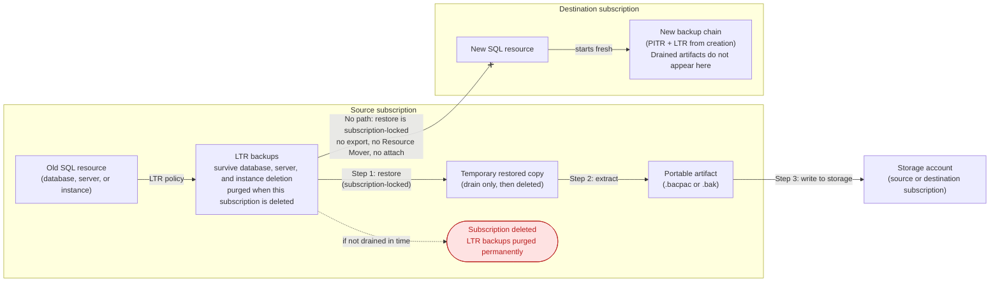
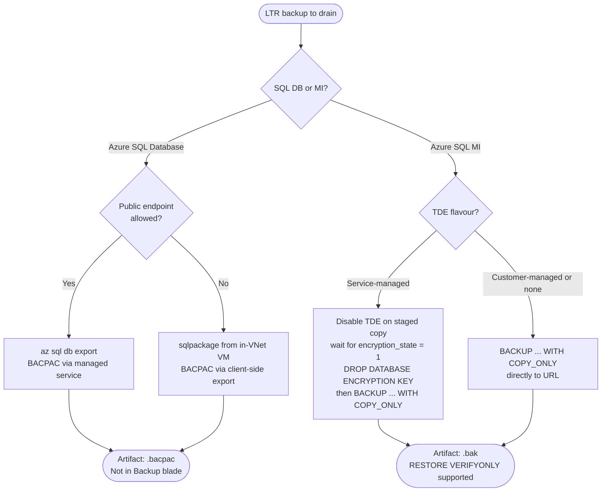
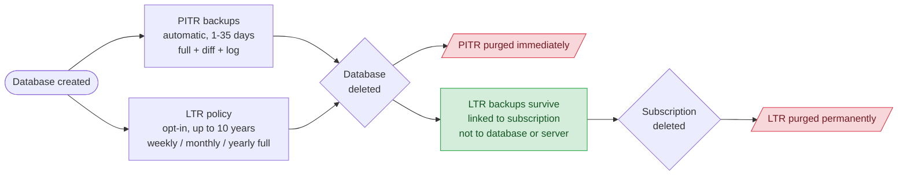

# Lab: SQL LTR backup migration

Validates the tooling in `src/powershell/sql-ltr-export/` and the assumptions it rests on,
before it is pointed at real production data ahead of a subscription deletion.

---

## The original ask

An existing **Azure SQL Database** and an existing **Azure SQL Managed Instance** live in a
source subscription. New equivalents are being stood up in a different subscription. The
source resources, and eventually the whole source subscription, will be deleted. Compliance
requires that a subset of the backup history survives that deletion. The preferred outcome
is that the retained backups show up in the **Backup blade of the new resources**, so a
restore is a normal portal operation. The acceptable fallback is that the backups land as
files in a storage account, ideally in the destination subscription.

### The answer, stated up front

**You cannot move LTR backups.** They are not a movable resource. There is no Azure
Resource Mover path, no export-to-storage path, no cross-subscription attach. The only
operation Azure exposes on an LTR backup is "restore it into a live database", and restore
is subscription-locked: you can only restore an LTR backup into a server or instance in the
**same subscription** that owns the backup.

**You cannot make old backups appear in a new resource's Backup blade.** That blade
reflects the new resource's own PITR and LTR chains, which begin at creation. There is no
import mechanism.

Therefore the only viable route is a **drain**: restore each LTR backup you must keep,
extract a portable artifact from the restored copy, write that artifact to storage, and
delete the restored copy. This drain must run **while the source subscription is still
alive**, because deleting the subscription purges the LTR backups.

The portable artifacts are proven consumable. The Managed Instance `.bak` restored into a
new database with matching row count, aggregate checksum, and file allocation. The SQL
Database `.bacpac` imported into a new database with matching row count, aggregate
checksum, and ROWS allocation; its smaller imported LOG allocation is normal after a
logical import and is not data loss.

**On the Managed Instance half the whole chain is now proven end to end.** On 2026-09-11 a
real LTR backup was restored into a new MI database and verified data intact (2500 rows and
aggregate checksum `195376932` on both sides, identical file allocations). The full drain
then ran from that LTR-restored copy: decrypt, `DROP DATABASE ENCRYPTION KEY`,
`BACKUP DATABASE ... WITH COPY_ONLY, COMPRESSION` to URL, and `RESTORE VERIFYONLY`, with the
resulting blob confirmed at 11,862,016 bytes by a Blob REST listing issued from inside the
VNet. LTR backup, restored copy, portable artifact in locked-down storage, and back again:
every link is now evidence rather than expectation.

On the SQL Database half the **restore mechanism** is proven (`az sql db ltr-backup restore`
succeeded three times out of three) but the **restore rate is not**. Those three backups
carried no payload, for lab-specific reasons explained in the Calibration results section,
so `RestoreMinPerGb` for SQL Database stays null.

Two findings from that round change how you should plan a real drain, and both are covered
in the Caveats:

- **An LTR backup's content can predate the policy that created it.** Enabling LTR does not
  capture the current state of the database; the service retroactively adopts an existing
  PITR full backup. Verify `backupTime` before you delete anything.
- **An LTR-restored database arrives TDE-encrypted**, reflecting the encryption state at
  backup time rather than the current state of the source. The decrypt step therefore
  repeats for every retained backup and never amortises to a one-off.



Source: `diagrams/00-solution-overview.mmd`

---

## Concepts and vocabulary

This section is written for a competent engineer who is not a database administrator.

### PITR: point-in-time restore backups

PITR backups are automatic and always on. You cannot disable them and they are not
separately billable beyond the included allowance. Retention is configurable from 1 to 35
days (default 7). Under the hood, Azure takes a weekly full backup, daily differential
backups, and transaction log backups every 5 to 12 minutes. This combination is what lets
you restore a database to any arbitrary second within the retention window.

**Purpose:** operational recovery. "Someone dropped a table an hour ago."

**Critical property:** PITR backups are deleted when the database is deleted. They are the
wrong tool for compliance retention.

### LTR: long-term retention backups

LTR is an opt-in policy. You configure it per database to retain specific weekly, monthly,
or yearly full backups for up to 10 years. LTR is not a continuous chain: if you restore
from an LTR backup you land at the exact instant that backup was taken, nothing in between.

**Purpose:** compliance and regulatory retention.

**Critical property: LTR has its own lifecycle, independent of the resource that produced
it.** An LTR backup survives deletion of the database, deletion of the logical server, and
deletion of the managed instance. It is purged only when the **subscription** is deleted.
This is why deleting the old database or instance is safe, but deleting the old subscription
is not.

**Second critical property: an LTR backup is a copy of a PITR full backup, not a fresh
capture.** Enabling an LTR policy does not snapshot the database at the moment you enable
it. The service adopts an existing full backup from the PITR chain, so the content of the
first LTR backup can predate the policy by up to the full-backup interval. The `backupTime`
field on the backup, not the time you set the policy, is what tells you what the backup
actually contains. This is measured behaviour in this lab; see the Caveats.

**Third critical property: an LTR backup preserves the encryption state as of backup time.**
If the database was TDE-encrypted when the adopted full backup was taken, the restored copy
comes back encrypted even if encryption has since been turned off on the source.

### What the portal's Backup blade shows

Both PITR and LTR, on separate tabs. PITR backups appear on the "Available backups" tab.
LTR backups appear on the "Long-term retention" tab. After the database is deleted, PITR
backups disappear. LTR backups remain visible and restorable as long as the subscription
exists. After the subscription is deleted, both are gone permanently.

### BACPAC

A BACPAC is a logical export: schema plus data as rows, compressed into a zip package
(`.bacpac` file). It is portable and version-tolerant, and it can be restored into Azure
SQL Database or SQL Server via an import operation.

**Important:** a BACPAC is only transactionally consistent if you export from a quiesced or
freshly restored database. Exporting from a live, write-active database can produce an
internally inconsistent snapshot. When using the drain pipeline (restore first, then
export), the restored copy receives no writes, so this is not a problem in practice.

BACPAC export can also fail outright on objects that the DacFx tooling does not support,
which is more common on SQL MI than on SQL Database.

### COPY_ONLY native backup

A COPY_ONLY backup is a real SQL Server backup file (`.bak`) that does not disturb the
differential base or the transaction log chain, making it safe to take alongside an
existing backup schedule. It is fast, byte-exact, and transactionally consistent.
Integrity can be verified years later with `RESTORE VERIFYONLY` without actually restoring
the database. `RESTORE VERIFYONLY` is useful, but it is not the same thing as a restore;
the lab now also proves that the `.bak` artifact restores into a working database.

**This is a Managed Instance capability only.** Azure SQL Database has no `BACKUP DATABASE`
statement. See the comparison table and caveats below.

### Comparison table

| | PITR | LTR | BACPAC | COPY_ONLY `.bak` |
|---|---|---|---|---|
| What it is | Continuous chain of automated backups | Retained point-in-time snapshots | Logical schema+data export | Native SQL Server backup |
| Restore granularity | Any second within window | Exact instant of the backup | Exact state at export time | Exact state at backup time |
| Portable (file you can hold) | No | No | Yes (.bacpac) | Yes (.bak) |
| Survives database deletion | No | Yes | Yes (it is a file) | Yes (it is a file) |
| Survives subscription deletion | No | No | Yes | Yes |
| Cross-subscription restore | Not directly | No (subscription-locked) | Yes, import anywhere | Yes, restore to SQL MI or SQL Server |
| Available on Azure SQL DB | Yes | Yes | Yes | No |
| Available on Azure SQL MI | Yes | Yes | Requires sqlpackage + network access | Yes |
| Integrity verifiable without restore | No | No | No | Yes (RESTORE VERIFYONLY) |
| Typical use | Operational recovery | Compliance retention | Portability, cross-platform migration | Compliance archive, high-fidelity MI drain |

---

## Questions to ask before you start

Use this section to scope your own environment before reading the procedure. Each question
identifies a constraint that changes which pipeline steps are available to you. If an answer
rules out an approach, note it before you start, not after a partial drain that has already
created temporary databases.

### Resource and artifact shape

| Question | Why it matters | What it rules in or out |
|---|---|---|
| **1. Is it Azure SQL Database or Managed Instance?** | SQL Database has no `BACKUP DATABASE` statement at all. MI does. | SQL DB: BACPAC is the only portable artifact. MI: COPY_ONLY native `.bak` is the default (supports `RESTORE VERIFYONLY`). BACPAC is also possible on MI but requires `sqlpackage` with network line-of-sight and loses the integrity verification benefit. |
| **2. Are you using TDE? If yes, which flavour: service-managed or customer-managed (BYOK / Key Vault)?** | Service-managed TDE: the key never leaves the platform, so a `.bak` produced with `COPY_ONLY` is unrestorable anywhere. TDE is on by default on MI. | Service-managed: disable TDE on every staged copy, wait until `sys.dm_database_encryption_keys` reports `encryption_state = 1`, then drop the database encryption key before backup. The DEK drop is mandatory; the unencrypted state alone is not enough. Customer-managed: `COPY_ONLY TO URL` works directly and the `.bak` stays encrypted, but the Key Vault key must be preserved for the full retention period in a vault that outlives the source subscription; lose the key and every artifact is permanently unreadable. In both cases the artifact is a `.bak` file supporting `RESTORE VERIFYONLY`. |
| **3. How large is the largest database?** | `BACKUP TO URL` on MI caps at 195 GB per stripe, 64 stripes maximum (roughly 12.5 TB total). | Up to 195 GB: single-stripe backup. Above 195 GB: striping required, use `-GbPerStripe` in the script. Above ~12.5 TB: `COPY_ONLY` is not feasible; BACPAC may be the only option, at the cost of losing `RESTORE VERIFYONLY` support. |
| **4. Does the instance have enough storage headroom for the drain?** | The drain restores each database onto the live instance before extracting the artifact. That consumes instance storage for the restored database, its log growth, and the artifact workflow's working set. | Size the MI for the largest database being drained plus operational headroom. This is a hard planning constraint, independent of throughput measurements. |
| **5. Does the in-VNet VM have a staging disk sized for the largest BACPAC?** | Client-side `sqlpackage` reads and writes local files only. It has no native Azure Blob Storage IO, so SQL Database artifacts must land on VM disk before upload and be downloaded to VM disk before import. | Add a data disk with free space for the largest single artifact, sized against the compression floor, not the expected compression case, provided each local artifact is deleted only after its upload is verified. If artifacts run in parallel or stale files accumulate after failed runs, size for peak concurrent occupancy instead. The MI `.bak` path does not need this disk because the artifact streams directly between the instance and blob storage. |

### Network and access governance

| Question | Why it matters | What it rules in or out |
|---|---|---|
| **6. Is public network access allowed on the logical server or managed instance?** | `az sql db export` is a Microsoft-managed service that connects inbound over the public endpoint. If the endpoint is off, the mechanism is unavailable, not merely unauthorised. A tenant policy can force `publicNetworkAccess` to `Disabled` and silently ignore API requests to enable it, returning success status without changing the value. | Public endpoint allowed: `az sql db export` and the standard drain script work. Public endpoint disabled: client-side `sqlpackage` from in-VNet compute over a private endpoint is the only SQL DB option. The MI path (`BACKUP TO URL`) is unaffected because it writes outbound from inside the instance and never depends on an inbound service. |
| **7. Does the storage account allow shared-key access?** | Shared-key disabled kills account keys and SAS tokens together. The trap: `az storage account keys list` still succeeds and returns a key that then fails on every data-plane operation. The failure is confusingly late and looks like a permissions error. | Shared-key allowed: SAS-based `BACKUP TO URL` works. Shared-key disabled: SAS unavailable. Use a Managed Instance managed identity credential: `CREATE CREDENTIAL ... WITH IDENTITY = 'Managed Identity'`. This is documented for Azure SQL Managed Instance and has been verified under shared-key-disabled storage. |
| **8. Is the storage account's public network access disabled?** | Even if the SQL resource can reach storage internally, a locked-down storage firewall blocks all workstation-based and managed-service writes at the data plane. | Storage public access allowed: writes go directly. Storage public access disabled: all data-plane calls must originate from inside the VNet. Requires in-VNet compute, a private endpoint on the storage account, a private DNS zone, and `Storage Blob Data Contributor` RBAC on the writing identity. A private endpoint bills at $0.01 per hour regardless of traffic; consider whether to create it only for the drain and delete it afterwards. |

### Scope, timing and cost

| Question | Why it matters | What it rules in or out |
|---|---|---|
| **9. When is the source subscription being deleted?** | This is the hard deadline. LTR backups survive database, server, and instance deletion, but are purged permanently when the subscription is deleted. There is no recovery after that point. | Build in time for a full recovery drill (restore at least one artifact end to end) before the subscription is deleted. An untested compliance archive is not a compliance archive. |
| **10. Which subset of LTR backups must you actually retain for compliance?** | Cost scales directly with count and size. Artifact storage dominates the multi-year total by roughly 50x over compute. A wide compliance scope is also a large and costly archive. | Narrowing the scope to the legally required minimum is the single largest cost lever available. Run `src/powershell/sql-ltr-export/Get-LtrExportCostEstimate.ps1` for each candidate scope before committing. |
| **11. Do you have vCore and server quota headroom in the source subscription for the temporary restore targets?** | The drain creates temporary databases in the source subscription. SQL DB logical servers are free, but General Purpose vCores and MI vCores consume regional quota. | Check `az sql server list-usages` and MI vCore quota before starting. Running out of quota mid-drain leaves orphaned temporary databases that keep billing and require manual cleanup. |
| **12. Can the Managed Instance stay running for the entire LTR retention wait (up to 7 days)?** | A stopped MI takes no automated backups at all. A skipped LTR backup is never backfilled. Stopping the instance during the wait destroys the backup you were waiting to produce. | The MI must stay running for the entire wait. The free MI offer defaults to a schedule that stops the instance outside working hours to conserve credits; that schedule is incompatible with a continuous retention wait. |

### Storage tier recommendation

These artifacts exist solely for compliance and will most likely never be read. The tier choice follows directly from a single question: how long can you wait for a file before a restore can begin?

**Default recommendation: Archive.** Rehydration can take up to 15 hours, but Archive is the lowest cost tier by a significant margin. For a file that may sit untouched for years and is accessed only if a regulator or auditor requires a restore, that wait is acceptable.

**Choose Cold instead** when retrieval within minutes is required (for example, your recovery time objective is shorter than 15 hours).

Both Archive and Cold are flat-rate at any volume. Hot is volume-banded and priced for frequent reads; it is the wrong tier for this use case. Redundancy choice (LRS versus GRS) is a separate input: GRS roughly doubles the storage cost but protects against a regional outage. For multi-year compliance archives the cost difference compounds. See `cost-model/` for the full tier and redundancy comparison.

### Decision flowchart

Walk through resource type, TDE mode, and public endpoint availability to identify the viable
pipeline for your environment.



Source: `diagrams/04-decision-tree.mmd`

---

## Caveats

Each caveat states what breaks and what to do instead.

### An LTR backup's content timestamp is not the time you set the policy

This is the most consequential planning finding in the lab, and it is easy to get wrong
because the intuitive reading is the opposite of the behaviour.

**Enabling an LTR policy does not capture the current state of the database. It
retroactively adopts an existing PITR full backup, whose content can predate the policy by
up to the full-backup interval.**

Measured three ways in the 2026-09-10 and 2026-09-11 runs:

| Observation | Policy set (UTC) | Resulting LTR `backupTime` (UTC) | Gap |
|---|---|---|---|
| SQL Database, five databases | 09:03:35 | 08:06:45 to 08:07:35 | backups are roughly an hour **earlier** than the policy |
| Managed Instance, `mitest` | 11:02:07 | 10:24:10 | backup is about 38 minutes **earlier** than the policy |

The mechanism was confirmed directly on `ltrlab552754-calib-1gb` by comparing the PITR
chain to the LTR backup: `earliestRestoreDate` was 08:07:44Z and the LTR `backupTime` was
08:07:35Z. The LTR backup is a copy of the first available full PITR backup, not a new one.

**Why this matters for the scenario in this document.** The source subscription is going to
be deleted. If an operator enables LTR expecting to capture today's data, walks away, and
then deletes the subscription, they may have archived a backup that is missing the most
recent data. Once the subscription is gone there is no way to find out: the source is
destroyed and the LTR backup is immutable.

**The rule:** read `backupTime` on every LTR backup you intend to rely on and confirm it
postdates the data you need, **before** deleting the source database, the server, the
instance, or the subscription. This is a verification step in the Recommended process, not
an optional sanity check. A compliance archive whose content predates the compliance event
it was meant to capture is worse than no archive, because it looks complete.

Two related traps follow from the same mechanism:

- **Time between enabling the policy and the backup appearing is not the same thing as the
  age of the backup's content.** A backup that appears days later can still contain data
  from the moment the policy was applied, or earlier.
- **A restored LTR backup can be perfectly healthy and completely empty.** In this lab all
  three SQL Database LTR restores reached `Online` with no errors and contained no tables at
  all, because the adopted full backup predated the payload seeding. See the standing
  verification gate in the Calibration results section.

### An LTR-restored database arrives TDE-encrypted

The encryption state of an LTR backup is the state as of backup time, not the current state
of the source database.

Proven on 2026-09-11: an LTR backup of `mitest` was restored into a new Managed Instance
database and the copy came back with service-managed TDE active, `encryption_state = 3`,
`encryptor_type = CERTIFICATE`, even though the source database had since had encryption
turned off and its DEK dropped. Turning encryption off on the source does not reach back
into backups already taken.

Two consequences for a real drain:

- **Every LTR-sourced restore arrives encrypted and must be decrypted before
  `BACKUP DATABASE ... TO URL` will succeed.** Skip it and the backup fails with Msg 41922.
  The DEK must also be dropped, or it fails with Msg 41938. Both steps are covered in the
  TDE caveat below.
- **The decrypt cost multiplies across every retained backup and never amortises to a
  one-off.** This document previously reasoned that the decrypt step is per-database; it is
  now empirically confirmed. At the measured Managed Instance decrypt rate of roughly
  0.23 min/GiB of ROWS file, a drain of N retained backups pays that cost N times, not once.
  For a wide compliance scope this is a real line item in the time budget, not a rounding
  error. Multiply the rate by the sum of the sizes of every backup you intend to drain, not
  by the size of the database.

The single small LTR-sourced drain measured here (64 MiB ROWS, decrypt 15.3 s, DEK drop
0.06 s, `BACKUP TO URL` 1.2 s) proves the sequence works. It is one observation at one very
small size and does not confirm or refine the 0.23 min/GiB slope; use the slope from the
two-point TDE calibration in the Calibration results section for planning.

### COPY_ONLY backup is Managed Instance only

Azure SQL Database has no `BACKUP DATABASE` statement at all. On SQL Database, BACPAC
is the only portable artifact you can produce. This makes the SQL Database drain path
simpler in tooling but more constrained in governance environments (see the public-endpoint
caveat below).

### BACKUP TO URL is incompatible with service-managed TDE

A database encrypted with service-managed Transparent Data Encryption (TDE) cannot be
backed up with `COPY_ONLY` to URL. The service-managed key never leaves the platform, so
the resulting `.bak` file would be unrestorable anywhere. TDE is on by default on Managed
Instance, so this blocks the native backup path unless handled.

Two options:

- **Disable TDE and drop the DEK on the staged copy** (the toolkit's default). Run
  `ALTER DATABASE ... SET ENCRYPTION OFF` on the throwaway restored copy, wait until
  `sys.dm_database_encryption_keys` reports `encryption_state = 1`, then run
  `DROP DATABASE ENCRYPTION KEY;` inside the database before taking the backup. The
  original database is never touched. This produces a plaintext `.bak`, so protect it with
  immutable blob storage and service-side encryption on the storage account.
- **Customer-managed TDE (BYOK, Azure Key Vault)**. If the instance already uses CMK TDE,
  the `.bak` stays encrypted, but you must preserve that Key Vault key for the full
  retention period, in a vault that outlives the deleted subscription. Lose the key and
  every artifact is permanently unreadable.

This trap is empirically confirmed. `BACKUP ... WITH COPY_ONLY` against a service-managed
TDE database fails with Msg 41922. Turning encryption off succeeds and the DMV reaches
`encryption_state = 1`, but the backup still fails with Msg 41938 until the database
encryption key is dropped. Seeing "unencrypted" in the DMV is therefore not sufficient.

Note also: disabling TDE on a large restored database is an IO-heavy operation and can take
hours. It needs to be in the time budget for every restored copy, not once per drain. If
you are preserving many LTR backups, the `SET ENCRYPTION OFF` wait and the DEK drop step
multiply by the number of restored databases. This is no longer a reasoned expectation: the
2026-09-11 run confirmed that an LTR-restored database arrives encrypted regardless of the
current state of the source, so the multiplication is certain rather than likely. Also note
the striping limits: 195 GB per stripe, 64 stripes maximum.

### Managed Instance does not support RESTORE WITH STATS

Many SQL Server restore examples include `WITH STATS = 10` so DBAs can watch progress.
Azure SQL Managed Instance rejects that option with Msg 41901:

```text
One or more of the options (stats, stats=) are not supported for this statement in SQL Database Managed Instance.
```

Remove `STATS`. In the 2026-09-10 artifact proof, the identical `.bak` failed before
artifact consumption with `STATS` present and restored successfully once `STATS` was
removed.

### Instance storage headroom is a hard planning constraint

The Managed Instance drain restores each LTR backup onto the live instance before it can
disable TDE, drop the DEK, and write the `.bak` artifact. That means the instance must
have storage headroom for the largest database being drained, including log growth during
the staged operations. This is a capacity requirement, not a timing-model estimate.

The lab's 32 GB instance storage ceiling actively constrained which tests could run. Do
not size a production drain from average database size alone; size it from the largest
restored copy that may exist on the instance at one time, with operational headroom.

### BACPAC export requires a reachable public endpoint

`az sql db export` is a Microsoft-managed service that connects **inbound** to the
database over its public endpoint. If public network access is disabled on the logical
server, the export service cannot reach the database, and the failure is not a permissions
error that can be granted away: the mechanism is simply unavailable.

In Jose's governed tenant, `publicNetworkAccess` is force-disabled and stays `Disabled`
after three independent attempts to enable it:

| Attempt | Result |
|---|---|
| `az sql server update --enable-public-network true` | Reported success, exit code 0, value unchanged |
| ARM `PATCH` with `publicNetworkAccess: Enabled` | Accepted, returned an operation, value unchanged |
| Fresh server created with `--enable-public-network true` | Created successfully, came back `Disabled` |

The tenant enforces this silently. Nothing errors. The API accepts the request, reports
success, and ignores it. Any script that sets this flag and then assumes it took effect
will proceed on a false premise. Full narrative evidence is in the Pre-flight results
section below.

**Workaround:** run `sqlpackage` from compute inside the virtual network, connected over a
private endpoint. This is a client-side export and is not subject to the
Microsoft-managed-service constraint. The compute, private endpoint, DNS, and sqlpackage
installation are your responsibility.

### Client-side BACPAC requires local staging disk

`sqlpackage` reads and writes local files only. It has no native Azure Blob Storage IO.
Blob-direct import and export exist only through the portal and the REST managed service,
which is the same inbound-connecting service that `publicNetworkAccess=Disabled` blocks.
The staging hop is therefore inherent to the client-side SQL Database approach, not an
implementation shortcut.

The SQL Database flow is necessarily:

1. Export: `sqlpackage` writes the `.bacpac` to VM local disk, then the file is uploaded to
   blob storage.
2. Restore: the `.bacpac` is downloaded from blob storage to VM local disk, then
   `sqlpackage` imports it.

This is a real architectural difference between the two halves of the lab:

| Path | VM role | Staging disk requirement |
|---|---|---|
| Managed Instance | Control channel only. The VM issues T-SQL, and `BACKUP TO URL` executes server-side from the instance directly to blob storage. The artifact never touches the VM. | None for the `.bak` artifact. |
| Azure SQL Database | Data path. Every byte of every BACPAC physically transits the VM local disk on export, and again on import if the artifact is ever restored. | Required. |

Size the VM data disk for the largest single artifact it will handle, provided the drain
deletes each local `.bacpac` after its upload has been verified. Use the compression floor,
not the expected case. Storage cost can be planned on measured realistic compression of
about 4.0x, but staging disk must survive the worst case because running out of disk
part-way through an export fails the job outright, potentially under a subscription
deletion deadline.

That "largest single artifact" rule assumes serial processing and successful local cleanup
after every verified upload. If the pipeline is parallelised across databases, size for the
sum of artifacts that can exist on disk at the same time. If failed uploads leave stale
files behind, those files also count against the next run. Stale staging files are a real
accumulation risk on repeated drains and can turn a safe single-artifact disk into a
part-way failure later in the run.

Worked example: a 500 GB database at the measured 4.0x realistic compression produces
roughly a 125 GB artifact. The same 500 GB database with incompressible contents, such as
encrypted blobs, media, or already-compressed data, produces roughly a 480 GB artifact at
the measured 1.04x floor. If the staging disk was sized for 125 GB, the second case fails.

Also budget the transfer time. On the SQL Database half every artifact crosses the network
twice over the archive lifetime, once during export and once during a later restore. Use a
parallel-capable transfer tool such as `azcopy`. On the Managed Instance `.bak` path this
VM-local transfer cost does not exist.

### The governance corollary: MI survives the lockdown, SQL DB does not

This is the most consequential finding in the lab. `BACKUP TO URL` on Managed Instance
writes **outbound from inside the instance** directly to blob storage. It never depends on
an inbound Microsoft-managed service. So it is unaffected by a forced-off public endpoint.

The SQL Database path, which looked simpler because it uses a managed export service,
breaks entirely in a locked-down tenant. The MI path, which looked harder because it
requires native T-SQL and storage credentials, is the robust one. It has now been proven
under the full governance model that breaks SQL Database managed export: shared-key access
disabled on storage, public network access disabled on storage, and the write reaching blob
over a private endpoint from the VNet. The approach that seemed more complex turned out to
be the one that works. It is also operationally cleaner for artifacts because the VM stays
out of the data path.

### Entra-only authentication may be mandatory

SQL authentication is denied tenant-wide by policy in Jose's environment (policy:
`SFI-ID4.2.2 SQL DB - Safe Secrets Standard`,
`AzureSQL_WithoutAzureADOnlyAuthentication_Deny`). Any logical server or managed instance
that allows SQL authentication is rejected at creation. An equivalent policy applies to
Managed Instances (`AzureSQLMI_WithoutAzureADOnlyAuthentication_Deny`).

Every tool in the drain chain must authenticate with an Entra token. The toolkit
originally assumed SQL authentication and had to be reworked. Full evidence and the
compliant pattern are in the Pre-flight results section below.

Two additional access requirements follow from Entra-only enforcement:

- **Contained database users.** Without Directory Readers assigned to the managed identity
  or service principal running the drain, `CREATE USER ... FROM EXTERNAL PROVIDER` fails.
  An Entra privileged admin must instead create the user from an explicit object ID:
  `CREATE USER [name] WITH SID = <object-id-as-bytes>, TYPE = E`. Confirm this is in place
  before starting the drain, not after the first authentication failure.
- **Preview dependency for the managed export path.** `az sql db export` under Entra-only
  auth requires a server-level user-assigned managed identity, which is a preview feature.
  Client-side `sqlpackage` does not carry this dependency. For a long-lived compliance
  process, the stability of a preview feature is a genuine planning risk; prefer
  `sqlpackage` if that risk is unacceptable.

Do not use the `SecurityControl=Ignore` escape hatch on the resource or resource group. It
suppresses a tenant security control to make a lab convenient, and the compliant path
exists.

### Shared-key access may be disabled on storage accounts

A storage account can be configured to refuse shared-key access, which kills account keys
and SAS tokens. The trap: `az storage account keys list` still succeeds and returns a key,
but that key fails on every data-plane call. The failure lands late and looks like a
permissions problem. SAS-based `BACKUP TO URL` is therefore unavailable in this
configuration.

The workaround is a managed identity credential on the Managed Instance:
`CREATE CREDENTIAL ... WITH IDENTITY = 'Managed Identity'`. This approach is now both
documented for Azure SQL Managed Instance and empirically verified in this lab. A Managed
Instance with a user-assigned managed identity wrote a native `.bak` to shared-key-disabled,
public-network-disabled storage over a private endpoint, and both `RESTORE HEADERONLY` and
`RESTORE VERIFYONLY` succeeded. The small synthetic test artifact is evidence of mechanism
only, not a compression or capacity-planning input.

### LTR backups cannot be created on demand

The timing of LTR backups is controlled by Microsoft. After enabling an LTR policy, the
first backup can take up to 7 days to appear. This dominates the lab's calendar.

Mitigation: when an LTR policy is enabled for the first time, the most recent existing
PITR full backup may be copied into long-term storage. In the 2026-09-10 lab run, no
SQL Database backup appeared within 25 minutes of enablement. On Managed Instance, a
policy was set at 2026-09-10T11:02:07Z with `P12W` weekly retention and no backup appeared
immediately. Enable the policy early and wait; do not assume same-day availability.

### A stopped Managed Instance takes no automated backups

A General Purpose Managed Instance supports stop/start, which halts compute and licence
billing while storage continues. This looks like an obvious cost lever during the 7-day
wait for an LTR backup.

**Do not use it here.** A stopped instance takes no automated backups at all. A skipped LTR
backup is never backfilled. The instance must stay running for the entire wait. This is why
the MI half of the lab costs roughly $102 for a 7-day wait rather than the small number an
earlier draft assumed.

Two operational facts follow, both measured on 2026-09-11 after tenant automation stopped
this lab's instance overnight:

- **Cold start is slow.** Going from `Stopped` to `Ready` took roughly 20.5 minutes
  (1233 seconds, polled at 60 to 90 second intervals). If an instance has been stopped,
  budget that before any drain work can begin.
- **A stopped instance reports a misleading LTR policy error.** While the instance was
  stopped, `az sql midb ltr-policy show` failed with `LongTermRetentionPolicyNotSupported`
  and the text "Database ... does not exist on server". Nothing had been lost. The same
  command returned `P12W` once the instance reached `Ready`. Do not read this error on a
  stopped instance as evidence that the LTR configuration was destroyed; start the instance
  and re-query before concluding anything.

### LTR policies cannot be enabled on serverless databases with auto-pause active

Attempting to set an LTR policy on a serverless database that has auto-pause enabled fails
immediately with error code `LtrConfigPolicyUnsupportedIfAutoPauseEnabled`. Auto-pause
must be disabled first on every affected database:

```
az sql db update -g <rg> -s <server> -n <db> --auto-pause-delay -1
```

The cost consequence is real: once auto-pause is off, the database runs at the minimum
serverless vCore level throughout the LTR wait even with zero activity. Five GP_S_Gen5
serverless databases at minimum vCores cost roughly $0.38/hour, adding approximately $64
over a 7-day wait. The "storage cost only during the wait" assumption in earlier drafts was
false. The cost table above has been corrected.

### Enabling an LTR policy does not guarantee an immediate PITR backup copy

The Microsoft documentation states that when a policy is first enabled on a database, the
most recent PITR full backup may be copied into long-term storage. In the 2026-09-10 lab
run, no LTR backup appeared within 25 minutes of first-time policy enablement (checked at
2 minutes and again at 25 minutes after enablement). This is not long enough to rule out a
later copy; the documentation says it may take up to 7 days. The optimistic reading that
a backup appears within minutes is not supported by this observation. Enable policies early
and treat the full 7-day window as the realistic wait.

The backups did eventually appear, and when they did they confirmed the copy mechanism
rather than a fresh capture: their `backupTime` values sat almost an hour **before** the
policy was set. Two separate properties are in play and should not be confused. *When* the
backup becomes visible is unpredictable and can take days. *What* the backup contains is
fixed at the `backupTime` of the adopted PITR full backup. See the content-timestamp caveat
above.

### CLI asymmetries

- `az sql midb export` does not exist. Exporting from a Managed Instance database requires
  `sqlpackage` with network line-of-sight to the instance.
- `az sql db ltr-backup delete` has no `--id` parameter, unlike its `midb` counterpart. It
  requires `-l -s -d -n` with the backup name in the form `<serverGuid>;<ticks>;<tier>`.

---

## Recommended process

**Do this before the source subscription is deleted.** Once the subscription is gone, the
LTR backups are gone with it.

If Entra-only authentication is enforced in the source subscription, each step requires
a different credential form: server creation takes `--enable-ad-only-auth`, data seeding
uses `Invoke-Sqlcmd -AccessToken`, and BACPAC export uses `--auth-type ManagedIdentity`
with a server-level user-assigned managed identity. The full pattern is documented in the
Pre-flight results section below.

### Step 0: scope the compliance requirement

Decide which LTR backups must actually be retained. Cost scales directly with count and
size. Run the cost model in `cost-model/` and the compute estimator in
`src/powershell/sql-ltr-export/Get-LtrExportCostEstimate.ps1` before committing to a
drain run. Those modelled figures cover transfer, artifact storage, and database restore
or export timing only. Add the drain VM, its staging data disk sized by the rule above,
private endpoints, and any gateway as separate line items.

If the source subscription survives (resources deleted but subscription kept empty), do
nothing: the LTR backups persist and you pay only LTR storage. The drain pipeline is only
necessary if the subscription itself is being deleted.

### Step 0b: verify what each LTR backup actually contains, before deleting anything

Enumerate the LTR backups and read the `backupTime` field on each one. Confirm it postdates
the data you are required to retain.

```powershell
az sql db ltr-backup list -l <region> -s <server> -g <rg> -o table
az sql midb ltr-backup list -l <region> --mi <instance> -g <rg> -o table
```

Do this **before** you delete the source database, the server, the instance, or the
subscription. An LTR backup's content can predate the policy that created it by up to the
full-backup interval, because the service adopts an existing PITR full backup rather than
taking a new one. Once the source is gone the backup is immutable and there is no way to
establish what it was missing.

If a `backupTime` is earlier than the data you need, the fix is to wait for a later backup,
not to re-enable the policy. Re-enabling does not force a fresh capture.

Where possible, add a content check as well as a timestamp check: restore one backup and
count rows against a known expectation. This lab restored three LTR backups that all
reported `Online` with no errors and all turned out to be empty, and only a row count
detected it.

### Step 1: drain Azure SQL Managed Instance first

If the source MI is still running, restore LTR backups directly into it. This makes the
compute cost of staging zero: you are already paying for those vCores. This is the most
important cost lever in the whole process. The VM is only a control channel for this path:
it issues T-SQL, while `BACKUP TO URL` streams the `.bak` from the instance directly to
blob storage. The artifact never lands on the VM.

For each LTR backup to preserve:
1. Restore the LTR backup to a temporary database on the instance (same subscription).
   Do not add `WITH STATS`; Managed Instance rejects that restore option, and habitual
   SQL Server examples can lead you into a false failure.
   If the instance is currently stopped, start it first and budget roughly 20 minutes of
   cold start before the first restore can be issued.
2. Count rows in the restored copy and compare against what you expect to be retaining.
   A restore that reports `Online` is not evidence that the backup carried data.
3. If the database is using service-managed TDE, disable TDE on the restored copy, wait for
   `encryption_state = 1`, then drop the database encryption key. Plan the time: this is
   IO-heavy on large databases, and the cost repeats for every restored copy. Do not skip
   the DEK drop. Assume this step is always required on an LTR-sourced restore: the restored
   copy arrives with the encryption state as of backup time, so it can come back encrypted
   even if the source has since had encryption turned off.
4. Run `BACKUP DATABASE ... WITH COPY_ONLY TO URL`, writing directly to the destination
   blob storage account. Stripe if the database exceeds 195 GB.
5. Delete the temporary database immediately.

See `src/powershell/sql-ltr-export/Export-SqlMiLtrBackups.ps1`.

This whole sequence is proven end to end on a real LTR backup as of 2026-09-11: restore,
row count and checksum verification, decrypt, DEK drop, `BACKUP TO URL` with `COPY_ONLY` and
`COMPRESSION`, `RESTORE VERIFYONLY`, and blob confirmation from inside the VNet against
storage with shared-key access disabled and public network access disabled.

### Step 2: drain Azure SQL Database

Before starting, provision a VM data disk with free space for the largest single BACPAC
artifact the VM will handle. Size that disk against the 1.04x compression floor, not the
4.0x expected case. The disk is a hard requirement because `sqlpackage` writes and reads
local files only.

For each LTR backup to preserve:
1. Restore the LTR backup to a temporary database in the source subscription. The logical
   server is free; only the temporary database incurs compute cost.
   `az sql db ltr-backup restore` is proven working: use the `id` returned by
   `az sql db ltr-backup list` verbatim, because the `;` separators and the tier suffix are
   significant and a hand-assembled identifier will not resolve.
2. Count rows in the restored database and compare against the source before exporting.
   This lab produced three restores that reported `Online` and contained no tables at all.
3. Export to BACPAC via `sqlpackage`. If public network access is disabled on the logical
   server, `az sql db export` will not work: run `sqlpackage` from compute inside the
   virtual network connected over a private endpoint. `sqlpackage` writes the `.bacpac` to
   VM local disk first.
4. Upload the `.bacpac` from VM local disk to the destination blob storage account,
   preferably with a parallel-capable tool such as `azcopy`.
5. Verify that the uploaded blob exists and has the expected size before treating the
   artifact as durable.
6. Delete the local staging copy only after the upload is verified. Do not delete it
   earlier: until the upload is known good, the local `.bacpac` is the only copy of that
   artifact.
7. Delete the temporary database.

For a later restore, reverse the artifact movement: download the `.bacpac` from blob
storage to VM local disk, then import it with `sqlpackage`. This means every SQL Database
artifact crosses the network and touches VM disk on the way out, and again on the way back
if it is ever restored.

See `src/powershell/sql-ltr-export/Export-SqlDbLtrBackups.ps1`.

### What you end up with

A storage account (ideally in the destination subscription, same region as the source to
avoid bandwidth charges) containing `.bacpac` and `.bak` files, each with a manifest row
recording which original server, database, and restore point it came from.

These files are restorable on demand. They will **not** appear in the new resource's
Backup blade. The Backup blade reflects only the new resource's own PITR and LTR chains.
This is a real loss of convenience compared to the preferred outcome; it is the only viable
alternative, and the reader should know it going in.

This is not just an export claim. The lab has now consumed one artifact from each path
back into a new database and matched row counts plus aggregate checksums against the
source. `RESTORE VERIFYONLY` remains useful for `.bak` readability checks, but a passing
`VERIFYONLY` is not the same as a restore.

Keep four operations distinct when reading the evidence in this document, because they prove
different things and all four now exist as measured events:

| Operation | What it proves | Status in this lab |
|---|---|---|
| `RESTORE VERIFYONLY` | The `.bak` backup set is readable and complete | Proven, Managed Instance |
| Artifact restore or import (`.bak` or `.bacpac`) | The portable archive file reconstitutes a working database | Proven on both halves, row counts and checksums matched |
| PITR restore | The point-in-time chain works | Measured on Managed Instance as a proxy only |
| **LTR restore** | The compliance archive itself reconstitutes a database | **Proven on Managed Instance, data intact.** Mechanism proven on SQL Database; rate unmeasured |

The Managed Instance half is now proven as a single continuous chain: LTR backup, restored
copy verified data intact, decrypted, `.bak` written to locked-down storage, and the blob
confirmed from inside the VNet.

For storage tier selection (Archive vs Cool vs Cold), bandwidth costs, and the private
endpoint variant, see `cost-model/README.md`. The Archive tier typically cuts the 7-year
storage cost by roughly 20x, at the cost of a multi-hour rehydration delay.

---

## Diagrams

No drawio or mermaid MCP tools were available during authoring. Diagrams were authored as
`.mmd` sources under `labs/sql-ltr-backup-migration/diagrams/` and validated with
`npx @mermaid-js/mermaid-cli` (exit 0 on all three). They are embedded below as fenced
blocks for native GitHub rendering.

### Backup lifecycle: where PITR and LTR diverge

The visual punchline is the database-deletion event. PITR backups die with the database;
LTR backups live on to the subscription boundary.



Source: `diagrams/01-backup-lifecycle.mmd`

### Drain pipeline: SQL Database and SQL MI side by side

Each branch ends at a file in storage. The constraints annotated on each step are the ones
that determine whether the step can run at all in a given governance environment.


Source: `diagrams/02-drain-pipeline.mmd`

### Governance constraints: what each control blocks

Workarounds: G1 (Entra-only auth) requires `--enable-ad-only-auth` at server creation, an
access token for scripts, and a user-assigned managed identity for the export service. G2
(public network access) is handled by running `sqlpackage` from in-VNet compute; the MI
path is unaffected because it writes outbound rather than accepting inbound. G3
(shared-key disabled) requires a managed identity credential for `BACKUP TO URL`; this is
verified on Managed Instance.


Source: `diagrams/03-governance-constraints.mmd`

---

**Short answer to "can this be tested in one subscription?": yes, about 90% of it.**
Only two assumptions genuinely need a second subscription, one of them is cheap to add,
and one of them must never be tested at all.

## Scenarios

| # | Scenario | Subscriptions needed |
|---|---|---|
| 1 | LTR backups survive deletion of database, server and managed instance | 1 |
| 2 | Deleted-source backups are still enumerable and restorable | 1 |
| 3 | SQL DB drain: LTR -> temp DB -> BACPAC -> blob, then artifact import with data checks | 1 |
| 4 | MI drain: TDE blocker, workaround, COPY_ONLY, `RESTORE VERIFYONLY`, then artifact restore with data checks | 1 |
| 5 | Striping path for databases above 195 GB | 1 (see trick below) |
| 6 | Artifact destination in a different subscription | **2** (storage only) |
| 7 | LTR restore is subscription-locked (negative test) | **2**, optional |
| 8 | Subscription deletion purges LTR | **Never test.** Irreversible. |

## What genuinely requires cross-subscription

Only **scenario 6**, and it is the cheap one: it needs a *storage account* in a second
subscription and nothing else. No SQL resources, no second instance. The claim being tested
is that `az sql db export` and MI's `BACKUP TO URL` authenticate to storage with a key or
SAS rather than through ARM, so the subscription boundary is irrelevant to them.

If a second subscription is genuinely unavailable, this can be approximated convincingly in
one subscription by removing every ARM path to the storage account and leaving only the SAS:

- grant the SQL server / MI managed identity **no** RBAC role on the storage account
- run the drain as a principal with **no** ARM permission on the storage account
- set the storage firewall to default-deny, allowing only trusted Azure services

If the export still succeeds under those conditions, ARM authorisation demonstrably played
no part, which is the actual mechanism in question. That is a strong proxy, not a proof.
Prefer the real second subscription; a storage account costs cents.

**Scenario 7** is a negative test of documented behaviour ("The database can be restored to
any existing server or managed instance under the same subscription as the original
database"). Worth running once if a second subscription is handy, purely to confirm the
failure is clean and early rather than a partial restore. Low value otherwise.

**Scenario 8 must not be tested.** Subscription deletion is irreversible and would destroy
the very backups under study. Take it from the documentation.

## The trick for scenario 5

Do not provision a 200 GB database to test striping. Force the code path on a small
database instead by shrinking the stripe threshold:

```powershell
.\Export-SqlMiLtrBackups.ps1 ... -GbPerStripe 1
```

A 3 GB staged database then produces a 3-way striped backup, exercising the multi-URL
`BACKUP` and `RESTORE VERIFYONLY` syntax, the stripe-count arithmetic and the manifest
`Stripes` field. Only the 195 GB boundary value itself goes untested, and that value comes
from a documented platform limit rather than from our logic.

## The scheduling constraint that dominates this lab

**LTR backups cannot be created on demand.** From the LTR documentation:

> The timing of individual LTR backups is controlled by Microsoft. You can't manually create
> an LTR backup or control the timing of the backup creation. After you configure an LTR
> policy, it might take up to seven days before the first LTR backup shows up on the list of
> available backups.

There is one mitigation, also documented: when an LTR policy is enabled **for the first
time** on a database, the most recent existing PITR full backup may be copied into
long-term storage. In the 2026-09-10 lab run, no LTR backup appeared within 25 minutes
of first-time policy enablement (checked at 2 minutes and again at 25 minutes). This does
not rule out the copy arriving later; 25 minutes is too short an observation window.
Seeding early and waiting is the only reliable approach.

When the backups did eventually arrive, their content timestamps sat almost an hour before
the policy was set, confirming that the copy is of an existing PITR full backup rather than a
fresh capture. Plan for two independent unknowns: **when** the backup becomes visible, and
**what moment in time** it contains. Check `backupTime` before relying on either.

This splits the lab into two phases separated by days, which is unusual for this repo's
labs and needs to be planned for rather than discovered:

| Phase | Activity | Elapsed |
|---|---|---|
| Seed | Create resources, load data, enable LTR policies, then **stop and wait** | Day 0 |
| Poll | `az sql db ltr-backup list` until backups appear | Day 0 to Day 7 |
| Execute | Delete sources, run both drain scripts, verify | Day N |
| Teardown | Delete everything, including LTR policies | Day N |

Do not stop the managed instance during the wait. General Purpose instances support
stop/start, which halts compute and licence billing while storage continues, but a stopped
instance takes no automated backups. A skipped LTR backup is never backfilled, so stopping
between the seed and execute phases can destroy the very backup the lab is waiting for.

## Cost of the lab

**Database half only** (scenarios 1, 2, 3, 5):

| Item | Estimate |
|---|---|
| SQL DB serverless, active compute during seed (~3 hours) | ~$1 |
| SQL DB serverless, minimum compute during 7-day LTR wait (auto-pause must be disabled) | ~$64 |
| Data storage for ~36 GB across five databases, one week | ~$1 |
| Storage, LTR and artifacts | <$1 |
| **Total** | **~$70** |

**Adding the Managed Instance** (scenario 4):

| Item | Estimate |
|---|---|
| MI, GP Gen5 4 vCore, running continuously for a 7-day wait | ~$102 |
| MI storage | ~$1 |
| **Total** | **~$110, plus 2 to 4 hours of provisioning time** |

The MI figure is not a typo and it cannot be reduced by stopping the instance between
phases. A stopped instance takes no automated backups, and a skipped LTR backup is never
backfilled, so the instance has to stay up for the whole wait. Earlier drafts of this table
assumed otherwise and understated the MI cost by roughly a factor of sixteen.

Keep test databases small, single-digit GB. The lab validates mechanics, not throughput.
Throughput numbers for the real estimate should be calibrated separately by measuring the
first production database and feeding the result back into `Get-LtrExportCostEstimate.ps1`.

## Deliberately out of scope

- Subscription deletion behaviour (scenario 8).
- Real-world LTR restore durations at scale. LTR restore itself is no longer out of scope:
  it is proven data-intact on the Managed Instance half and proven as a mechanism on the
  SQL Database half. What remains unmeasured is how restore time scales with database size,
  on either half. Artifact consumption after extraction is also proven on both paths.
- Customer-managed-key TDE. The tooling defaults to `DisableOnStagedCopy` precisely to
  avoid introducing a Key Vault key that must outlive the old subscription; testing the CMK
  path is only worthwhile if you have decided to accept that key-custody burden.

See `validation.md` for the assertion-level matrix.

## Cost model

`cost-model/` holds an Excel model of the transfer and long-term storage cost of the
artifacts this lab produces, plus a variant for reaching the storage account over a private
endpoint. See [`cost-model/README.md`](cost-model/README.md). It is the storage half of the
picture; `src/powershell/sql-ltr-export/Get-LtrExportCostEstimate.ps1` is the compute half.
Neither includes every infrastructure line item required to run the drain. Add the in-VNet
VM, the SQL Database staging data disk sized by the rule above, private endpoints, and any
gateway separately.

## How this lab deviates from the repo convention

`labs/README.md` describes the convention for this folder, and it assumes an **Azure
Networking** lab following an eight-phase lifecycle with a specific artifact set. This lab
deliberately departs from it in four ways. They are listed here so the gaps read as choices
rather than omissions.

| Convention | This lab | Why |
|---|---|---|
| Azure Networking subject matter | Azure SQL Database and Managed Instance backup retention | The question asked was a database one. The rest of the repo's tooling and structure still applied, so it was reused rather than duplicated elsewhere. |
| `design.md` with mechanism trade-offs and an F-table / M-table resiliency analysis | Absent | Those sections model failure and recovery of a running network topology. This lab has no topology and no traffic; its subject is the lifecycle of a backup artifact. The equivalent reasoning lives in the decision tree and the BACPAC vs native `.bak` comparison in `src/powershell/sql-ltr-export/README.md`. |
| `## Designs studied` section with recommended and not-recommended designs | Covered by the scenario table above and by `validation.md` | The unit of study here is an assertion to be proved or disproved, not a design to be recommended. Scenario 8 is an explicit "never do this". |
| `lessons-learned.md`, `show-output/`, `screenshots/` | Not yet created | These are execution artifacts and **this lab has never been run**. Creating them now would mean inventing evidence. They should be written during phase 3. |
| `diagrams/` | Three mermaid diagrams: backup lifecycle, drain pipeline, governance constraints | Added retroactively once the lab had enough empirical evidence to label them with real findings rather than guesses. |

One convention this lab does follow exactly: **sanitization**. No subscription IDs, tenant
IDs, server names or admin passwords appear in any committed file, and the deploy scripts
take the admin password as a `SecureString` parameter rather than embedding one.

## Lab environment

Provisioned by `deploy/Deploy-LtrLab.ps1`. Single subscription, one free logical server,
five databases, one storage account. The managed instance is opt-in because it alone
costs more than everything else combined.

| Database | Size | Data shape | Why it exists |
|---|---|---|---|
| `calib-1gb` | 1 GB | mixed | Anchors the fixed-overhead term |
| `calib-5gb` | 5 GB | mixed | Middle point; also the held-out prediction test |
| `calib-20gb` | 20 GB | mixed | Anchors the per-GB slope |
| `probe-compressible` | 5 GB | repeated bytes | Upper bound on compression ratio |
| `probe-random` | 5 GB | `CRYPT_GEN_RANDOM` | Lower bound: incompressible worst case |

**Why three sizes.** Drain time is modelled as `minutes = Fixed + (PerGb * SizeGb)`. One
size cannot separate those terms: any single measurement is explained equally well by a
large fixed cost or a steep slope. Three sizes spanning an order of magnitude let
`Measure-LtrCalibration.ps1` recover both by least squares, and the R-squared tells you
whether the linear assumption holds at all.

**Why two data shapes.** The estimator's 4.0x BACPAC compression default was an
unverified guess before the 2026-09-10 calibration run. That run validated it: mixed
realistic data (75% repetitive text, 25% random bytes) compressed at 3.98x to 4.25x
across three database sizes. The existing cost figures for the typical case do not need
revision. The planning floor, however, is **1.04x**, measured on random-byte data. Any
compliance archive sized using the 4.0x default against high-entropy data (encrypted
columns, pre-compressed blobs, binary payloads) will be 4x undersized. Use 1.04x when
the compression ratio of the actual data is unknown. A synthetic upper bound of 145.5x
was also measured; it came from a single repeated-byte seed pattern and is not a planning
value. See the Calibration results section for the full table and throughput fit.

LTR policies cannot be enabled while auto-pause is active (see the Caveats section). The
databases run at the minimum serverless vCore level during the LTR wait, not storage only.

## Pre-flight results

Phases 0 through 4 (pre-flight, seed, export, and calibrate) have been completed as of
2026-09-10. Full command output is in `show-output/`. Key calibration results are in the
Calibration results section below. A second-round artifact consumption proof has also
completed for both extracted artifact types. On 2026-09-11 the LTR backups finally appeared
and Phase 3 ran: the Managed Instance drain is now proven end to end from a real LTR backup,
and the SQL Database LTR restore mechanism is proven. Phase 5 teardown remains pending.

Quotas below were read from the lab subscription in `swedencentral` at Phase 0.

| Check | Result |
|---|---|
| `Test-LabSql.ps1` | PASS, `Seed-LabData.sql` parses as 4 batches |
| `Test-DrainHelpers.ps1` | PASS, 9 of 9 |
| Regional SQL server quota | 0 of 250 |
| Regional vCore quota, SQL DB | 0 of 500 |
| MI subnet quota | 0 of 8 |
| MI vCore quota | 0 of 960 |
| MI free offer instances | 0 of 1, available |
| MI free vCore hours currently granted | 0 |

Two prerequisites are not satisfied by a fresh clone:

1. **The `SqlServer` PowerShell module.** Phase 1 seeds data through `Invoke-Sqlcmd`.
   Install it with `Install-Module SqlServer -Scope CurrentUser`.
2. **An admin password**, supplied interactively as a `SecureString`. It is never written
   to the repo.

### Finding: the toolkit assumed SQL authentication, and that can be denied outright

The first live deployment attempt **failed**, and the failure is more useful than a success
would have been.

Creating the logical server was rejected by Azure Policy:

```
(RequestDisallowedByPolicy) Resource 'ltrlab...-sql' was disallowed by policy.
policyDefinitionName: AzureSQL_WithoutAzureADOnlyAuthentication_Deny
policyDefinitionDisplayName: SFI-ID4.2.2 SQL DB - Safe Secrets Standard
```

The governing management group denies any `Microsoft.Sql/servers` whose
`properties.administrators.azureADOnlyAuthentication` is not `True`. In other words
**SQL authentication is forbidden**, and every script here was written around an admin
username and password.

A companion policy, `AzureSQLMI_WithoutAzureADOnlyAuthentication_Deny`, applies the same
rule to Managed Instances, so this is not something the MI half escapes.

The policy does expose an escape hatch, a `SecurityControl=Ignore` tag on the resource or
resource group. **Do not use it.** It suppresses a tenant security control to make a lab
convenient, and the compliant path exists.

The compliant path, which is what this lab now uses:

| Concern | SQL auth approach | Entra-only approach |
|---|---|---|
| Server admin | `-u/-p` | `--enable-ad-only-auth` plus an external admin principal |
| Seeding | `Invoke-Sqlcmd -Credential` | `Invoke-Sqlcmd -AccessToken` |
| BACPAC export | `--auth-type SQL` | `--auth-type ManagedIdentity` |
| Storage auth | account key | `--storage-key-type ManagedIdentity` plus RBAC |

Export under Entra-only authentication requires a **user-assigned managed identity attached
at the logical server level**, granted `Storage Blob Data Contributor` on the artifact
storage account and made a database user in each database being exported. A
system-assigned identity, a database-scoped identity, or a service principal will not do,
and the feature is still in preview.

**Carry this into production planning.** If the subscription holding the LTR backups sits
under similar governance, a drain runbook built on SQL authentication will fail at the
first step, and the fallback of "just enable SQL auth temporarily" is exactly what the
policy exists to prevent.

### Finding: public network access is forced off, which breaks the export mechanism entirely

With Entra-only authentication in place the server was created successfully, and the
deployment then failed one step later:

```
(DenyPublicEndpointEnabled) Unable to create or modify firewall rules when public
network interface for the server is disabled.
```

This one is worse than it looks, and it was worth testing rather than assuming. Three
attempts to turn public access on:

| Attempt | Result |
|---|---|
| `az sql server update --enable-public-network true` | Reported success, exit code 0, value unchanged |
| ARM `PATCH` with `publicNetworkAccess: Enabled` | Accepted, returned an operation, value unchanged |
| Fresh server created with `--enable-public-network true` | Created successfully, came back `Disabled` |

The tenant forces `publicNetworkAccess: Disabled` on every logical server, **silently**.
Nothing errors. The API accepts the request, reports success, and ignores it. Any script
that sets this flag and then assumes it took effect will proceed on a false premise.

The consequence is the significant one. Azure's BACPAC import/export runs as a
**Microsoft-managed service that connects to the database over its public endpoint**. With
public network access denied, that service cannot reach the database, so `az sql db export`
cannot work in this tenant at all. The failure mode is not a permissions error that can be
granted away; the mechanism is simply unavailable.

**This invalidates the central assumption of the drain toolkit.** Both drain scripts are
built on the service-side export path.

Two compliant alternatives exist, and neither is a drop-in replacement:

| Approach | Trade-off |
|---|---|
| Import/Export via private link | Service creates managed private endpoints for the operation, which you must manually approve on both the SQL server and the storage account. Still in preview, and Azure SQL Database only. |
| `sqlpackage` on a VM inside the virtual network | Fully supported and predictable, but you now own compute, a private endpoint, DNS, and the software. This is the same self-hosted requirement the MI drain already had. |

There is an irony worth noting: the MI drain script was written to use native `BACKUP TO
URL` precisely because `az sql midb export` does not exist, and that path writes to storage
from inside the instance rather than via a Microsoft-managed service. **The MI approach is
the one that survives this governance model**, while the SQL Database approach, which
looked simpler, is the one that breaks.

### Run the SQL Database half first

The lab is worth splitting. Scenarios 1, 2, 3 and 5 need only Azure SQL Database. Note
that the serverless databases accumulate compute charges at the minimum vCore level during
the LTR wait because auto-pause must be disabled when an LTR policy is active; the
updated cost table reflects this. The SQL Database half still costs significantly less than
adding the Managed Instance.

Scenario 4 needs a Managed Instance, and it is a different proposition entirely:

- The minimum is 4 General Purpose vCores, roughly **$102 for a seven-day wait**, plus two
  to four hours simply to provision.
- **The instance can be stopped, but it must not be during the LTR wait.** General Purpose
  instances support stop and start, which suspends compute and licensing charges while
  storage and backup charges continue. That makes stopping attractive for cost control and
  actively dangerous here: a stopped instance takes no automated backups, and a skipped LTR
  backup is never backfilled, so stopping it during the wait destroys the very thing the
  wait exists to produce.
- **Check for automation that stops instances on your behalf.** During this lab a tenant
  automation stopped the instance overnight without warning. It was harmless only by luck,
  because the LTR backup had already been produced some thirteen hours earlier. Had the
  stop landed before the backup window, the wait would have silently produced nothing and
  the failure would not have been visible until someone went looking for a backup that was
  never taken. If your subscription has cost-control automation, exclude the instance for
  the duration of the wait rather than assuming a stop will be noticed.
- **The free offer does not rescue this, and is actively dangerous here.** A free instance
  is available (720 vCore hours per month for 12 months, one per subscription), but it
  defaults to a 9-to-5 weekday schedule specifically to conserve those credits. That
  schedule is exactly the stopped-instance trap above: the instance would be off for
  roughly two thirds of every week and the LTR backup would likely never be produced. Run
  it always-on and a seven-day wait consumes 672 of the 720 monthly hours, leaving almost
  no margin before the instance auto-stops and silently breaks the run. Use a paid instance
  and treat the free offer as unsuitable for this particular lab.

Since the two drain scripts share most of their logic, running the Database half first
validates the shared export assumptions at about 8 percent of the cost of doing both.
The 2026-09-10 calibration run completed this step: export throughput and BACPAC
compression are now measured, and a BACPAC artifact import has been proven with data
checks. LTR restore was subsequently run on 2026-09-11; see the LTR restore sections below.

## Calibration results

Phases 1 through 4 completed on 2026-09-10. Tooling: sqlpackage v170.4.83.3 on a
Standard_D4s_v5 VM (4 vCPU, 16 GB RAM), connecting to the logical server over a private
endpoint in the same region (swedencentral). Full output is in `show-output/`; the fitted
parameters are in `deploy/calibrated-parameters.json`.

### BACPAC compression ratios

Source sizes are allocated file size from `sys.database_files` (8 KB pages), not raw data
volume. For freshly seeded databases with no deletes, allocated size exceeded target by
1 to 8 percent. The compression ratio below is therefore allocated-size-to-artifact, which
is the correct basis for capacity planning.

| Database | Data shape | Source GB | Artifact GB | Ratio |
|---|---|---|---|---|
| `probe-compressible` | Repeated bytes (synthetic upper bound, not a planning value) | 5.08 | 0.03 | 145.5x |
| `calib-1gb` | Mixed realistic (75% text, 25% random) | 1.08 | 0.25 | 4.25x |
| `calib-5gb` | Mixed realistic | 5.08 | 1.27 | 4.00x |
| `calib-20gb` | Mixed realistic | 20.20 | 5.08 | 3.98x |
| `probe-random` | Random bytes (`CRYPT_GEN_RANDOM`), incompressible | 5.08 | 4.90 | 1.04x |

**The pre-run 4.0x default is validated for realistic mixed data.** The existing cost
figures for the typical case are accurate.

The Managed Instance native `.bak` path independently corroborates the same central case:
the 2026-09-10 MI tests compressed realistic mixed data at 4.21x for the 1 GiB ROWS file
and 4.12x for the 5 GiB ROWS file. That is a different engine and artifact format from
sqlpackage BACPAC, so the agreement raises confidence in the model's 4.0x central case.
It does not change the conservative planning floor.

**The budgeting floor is 1.04x, not 4.0x.** Plan compliance archive storage against the
floor, because data containing encrypted columns, pre-compressed blobs, or binary payloads
may compress barely at all. An archive sized on 4.0x against incompressible data will be
roughly 4x undersized, and artifact storage dominates the multi-year cost.

**The 145.5x figure is a synthetic bracket.** It came from a single repeated-byte seed
pattern (the most compressible data shape possible). No production database has this shape.
Do not use it as a planning input. The honest planning range is 1.04x to 4.25x.

Feed the floor into the estimator:
```powershell
.\Get-LtrExportCostEstimate.ps1 -BackupCount <n> -AvgDatabaseGb <gb> -BacpacCompression 1.04
```

### Export throughput

Linear fit on the three mixed-data databases:

`ExportMin = 0.36 + 0.159 * SizeGb`  (R-squared = 1.00)

| Database | Source GB | Export min | Min/GB observed |
|---|---|---|---|
| `calib-1gb` | 1.08 | 0.50 | 0.46 |
| `calib-5gb` | 5.08 | 1.20 | 0.24 |
| `calib-20gb` | 20.20 | 3.56 | 0.18 |

The default estimator assumed 1.20 min/GB. The measured rate is 0.159 min/GB, roughly 7.5x
faster. **This is environment-specific:** same region, private endpoint, 4 vCPU VM. A
public-internet or cross-region export will be slower; do not generalise this rate. The
compute term is roughly 2 percent of the multi-year total cost regardless, so the financial
impact of the difference is small.

Feed the calibrated export constants into the estimator (but not an LTR restore rate, which
remains unmeasured on this half):
```powershell
.\Get-LtrExportCostEstimate.ps1 ... -ExportFixedMin 0.36 -ExportMinPerGb 0.159 -BacpacCompression 1.04
```

### Managed Instance calibration

The 2026-09-10 MI measurements were taken on a GP_Gen5 4 vCore Managed Instance with
32 GB storage in `swedencentral`, using same-region private endpoint access.

These fits are coarse planning slopes, not validated regressions. Only two size points
were measured, so R-squared is deliberately null: a two-point fit would be tautological
and would overstate confidence.

| Term | Measurement | Status |
|---|---:|---|
| TDE decryption fixed term | 0.1914 min | MEASURED |
| TDE decryption slope | 0.2300 min/GiB | MEASURED |
| `DROP DATABASE ENCRYPTION KEY` | under 0.1 s at both sizes | MEASURED, effectively instant |
| `BACKUP TO URL` with `COPY_ONLY` and `COMPRESSION` | 0.1725 min/GiB | MEASURED |
| Native `.bak` compression on realistic mixed data | 4.21x at 1 GiB, 4.12x at 5 GiB | MEASURED |
| MI PITR restore | 55.5 s | PROXY only, not LTR |
| MI artifact restore from `.bak` | 30.5 s at roughly 1 GiB | MEASURED |
| MI LTR restore | upper bound 41.4 s at 64 MiB ROWS | MEASURED, one observation, no slope |

The decryption slope must be applied on the same basis it was fitted on: ROWS file GiB
from `sys.database_files`. If you divide by total file size including the log, the 5 GiB
test database's 8.85 GiB total footprint makes the apparent rate 7.1 s/GiB instead of
13.8 s/GiB, nearly a 2x difference. Mixing those bases is an easy way to be wrong by a
factor of two.

The 55.5 s MI restore number is a same-instance PITR restore proxy. It is explicitly not
an LTR restore measurement and must not be fed into the estimator as an LTR constant. A real
MI LTR restore has since been measured; see the LTR restore section below. It too is a single
observation and yields no slope, so both values stay out of the size model.

### Artifact consumption proof

The archive files are now proven consumable on both halves of the lab.

| Artifact path | Consumption proof | Data proof |
|---|---|---|
| Managed Instance `.bak` | `RESTORE DATABASE ... FROM URL` into a new database in 30.5 s | 130000 rows on both sides, aggregate checksum -1557385128 on both sides, 1056 MiB ROWS on both sides |
| SQL Database BACPAC | Client-side `sqlpackage` import from the in-VNet VM into a new database in 198.6 s | 131072 rows on both sides, aggregate checksum 12517530 on both sides, 1104 MiB ROWS on both sides |

The SQL Database LOG allocation differed after import: 1224 MiB on the source and 472 MiB
on the imported database. That is expected after a logical import and does not indicate
data loss.

Keep three facts separate:

1. `RESTORE VERIFYONLY` passed for the Managed Instance `.bak`, proving the backup set is
   readable and complete. This is not a restore.
2. The artifacts restored or imported into working databases with row counts and checksums
   verified against the source. This is a restore or import, and it is now proven on both
   halves.
3. LTR restore is a separate operation again, and it is now measured. See the two LTR
   restore sections below.

The BACPAC download to the VM took 347.8 seconds in this test, but do not use that as a
throughput planning figure. It reflects the single-stream download method used during the
lab, not an inherent limit of the private endpoint or storage account. A production drain
should use a parallel-capable transfer tool such as `azcopy`.

### LTR restore: Managed Instance

**Measured 2026-09-11. The chain is proven end to end, and no per-GiB rate is published.**

A real LTR backup of `mitest` (`backupTime` 2026-09-10T10:24:10Z) was restored into a new
database on the same instance and verified data intact.

| Check | Source | LTR-restored copy |
|---|---:|---:|
| Row count | 2500 | 2500 |
| Aggregate checksum | 195376932 | 195376932 |

This is a real LTR restore with data verification, distinct from `RESTORE VERIFYONLY`,
distinct from the PITR restore proxy above, and distinct from restoring the extracted `.bak`
artifact.

The full drain was then executed **from the LTR-restored copy** rather than from a live
database, which is what closes the last unproven link:

| Step | Result |
|---|---|
| Encryption state on arrival | 3 (encrypted, `encryptor_type = CERTIFICATE`) |
| `ALTER DATABASE ... SET ENCRYPTION OFF` | 15.3 s, state reached 1 |
| `DROP DATABASE ENCRYPTION KEY` | 0.06 s |
| `BACKUP DATABASE ... WITH COPY_ONLY, COMPRESSION` to URL | 1.2 s |
| `RESTORE VERIFYONLY` | passed |
| Blob confirmed from inside the VNet | 11,862,016 bytes |

The blob check was a Blob REST listing issued from `ltrlab-vm` using an IMDS token for the
user-assigned identity, against a storage account with `allowSharedKeyAccess` false and
`publicNetworkAccess` Disabled. Listing from outside the VNet fails by design, so this is a
governance-model proof as well as an existence proof.

**Timing.** The restore itself was observed once, at one size (64 MiB ROWS, 40 MiB LOG). The
destination was absent from the listing at t0+17.2 s and `Online` at t0+41.4 s under a
20 second poll interval, so true completion lies somewhere in that interval.

**Quote 41.4 seconds as a worst-case upper bound at that size and nothing else.** One
observation at one size cannot produce a slope. `LtrRestoreMinPerGb` and `LtrRestoreFixedMin`
remain null in `deploy/mi-calibrated-parameters.json`, deliberately. Do not derive a per-GiB
MI LTR restore rate from this number, and do not substitute the 55.5 s PITR proxy for it
either.

The drain timings above are likewise a single small-database observation. They prove the
sequence works; they are not calibration inputs. Use the two-point TDE decrypt slope
(0.23 min/GiB) and the `BACKUP TO URL` slope (0.1725 min/GiB) from the Managed Instance
calibration table for planning, and apply the decrypt slope **once per retained backup**,
because every LTR-sourced restore arrives encrypted.

### LTR restore: Azure SQL Database

**Measured 2026-09-11. The restore mechanism is proven. The per-GB restore rate is still
not measured, and `RestoreMinPerGb` remains null.**

`az sql db ltr-backup restore` was exercised end to end for the first time in this lab.
Three LTR backups were restored into three new `GP_Gen5_4` databases, sequentially. All
three succeeded and reached `Online` with no errors. Backup identifiers from
`az sql db ltr-backup list` were used verbatim.

**All three restored databases were empty.** Data-plane verification from `ltrlab-vm` found
zero tables in each one; `dbo.LabPayload` did not exist in any of them, against source row
counts of 131072, 655360 and 2621440 which all matched their seed values exactly. Azure
Monitor independently reported all three restored databases at 20.81 MB of data space used,
byte-identical, against sources of 1053, 5178 and 20643 MB.

**This is a lab artifact of the seeding order, not a product defect.** The three LTR backups
had adopted the first automatic PITR full backup, taken minutes after database creation and
before the payload table was seeded. The restores are faithful; the backups simply had no
data in them to preserve. Nothing here suggests LTR backups are unreliable. It is the same
content-timestamp behaviour described in the Caveats, observed from the other end.

Because all three restores moved the same near-zero payload, the observed durations carry
**no size information**. A provisional linear fit was computed before the emptiness was
discovered and has been **discarded**; it is an artifact of the defect, not a property of LTR
restore, and it is not reproduced here so that nobody mistakes it for a result.

The one timing constant this run legitimately produced:

| Constant | Value | What it is |
|---|---:|---|
| `RestoreEmptyDbFloorMin` | about 3.86 min, observed range 3.55 to 4.53 min | Wall-clock cost of an LTR restore carrying essentially no data: provisioning and control-plane orchestration only |

This is a **lower bound** for any real LTR restore. It carries no size information and must
never be used as a fixed term in a size model. The spread across the three empty restores is
itself about one minute. Durations are accurate to plus or minus 15 seconds, the poll
interval. All three targets used provisioned `GP_Gen5_4`; restore into serverless was not
measured.

**Standing verification gate, earned the hard way.** A restore can succeed, report `Online`,
produce clean sequential timings and yield a plausible-looking linear fit while carrying no
data whatsoever. Timing alone cannot detect that. **Only a row count can.** Any future
restore timing work, in this lab or in a production drain, must verify restored row counts
against the source before anything is fitted.

The three existing LTR backups can never yield a valid rate: their content predates seeding
and LTR backups are immutable. A valid measurement needs a backup whose `backupTime` is later
than seed completion. When such a backup appears is unknown; this lab has already recorded
that LTR timing here does not follow the documentation. Poll with `Watch-LtrLabBackups.ps1`
and trigger on `backupTime`, not on a predicted weekly boundary. Fit on the
`allocated_data_storage` / ROWS GiB basis so the restore slope stays composable with
`ExportMinPerGb`.

Do not borrow values between the two halves in either direction. The engines, the artifact
formats and the restore paths all differ.

## Roadmap and emerging alternatives

Scan date: 2026-09-10. Roadmap content ages quickly, so re-check the Microsoft Learn pages
before executing a real drain.

**SQL Database import/export over Private Link** is in public preview:
<https://learn.microsoft.com/en-us/azure/azure-sql/database/database-import-export-private-link>.
It addresses the `publicNetworkAccess=Disabled` blocker by having the import/export
service create service-managed private endpoints that must be manually approved. This is
for Azure SQL Database only, not Managed Instance.

**SQL Database import/export with managed identity** is also in public preview:
<https://learn.microsoft.com/en-us/azure/azure-sql/database/database-import-export-managed-identity>.
It addresses the `allowSharedKeyAccess=false` blocker by replacing storage keys and SAS
tokens with managed identity and RBAC. This is also for Azure SQL Database only, not
Managed Instance.

The key judgement is that the governed environment has both constraints at the same time:
SQL public network access disabled and storage shared-key access disabled. Neither preview
feature is sufficient alone. Together, they would in principle revive `az sql db export`
and remove the need for in-VNet compute running `sqlpackage`, but the combination is not
documented as a tested path. For a compliance drain against a hard subscription-deletion
deadline, depending on two preview features is a planning risk. The recommendation stands:
run client-side `sqlpackage` from in-VNet compute. Re-evaluate if both features reach GA
before execution.

**Managed Instance database copy and move across subscriptions** is GA:
<https://learn.microsoft.com/en-us/azure/azure-sql/managed-instance/database-copy-move-how-to>.
Keep this separate from the LTR archive problem. `az sql midb copy` and `az sql midb move`
with `--dest-sub-id` move live databases across subscriptions in the same tenant, and both
instances must be in the same Azure region. The documentation explicitly states that
database copy and move operations do not copy or move PITR backups. LTR backups stay
behind too. This can solve a live database migration, not the compliance archive.

**LTR cross-subscription restore** is still not available:
<https://learn.microsoft.com/en-us/azure/azure-sql/database/long-term-retention-overview>.
The core conclusion is unchanged: LTR backups can only be restored under the same
subscription as the original database.

**LTR immutability on Managed Instance** is not available on the same LTR overview page.
Microsoft notes that Managed Instance LTR backups cannot currently be configured as
immutable and points to copy-only backups into your own storage as the workaround. That is
independent Microsoft-side endorsement of the drain pattern this lab derived from the
governance constraints.

## Running the lab

| Phase | Script | Duration |
|---|---|---|
| 0. Pre-flight | `Test-LabSql.ps1`, `Test-DrainHelpers.ps1` | seconds |
| 1. Seed | `Deploy-LtrLab.ps1` | ~1 hour (data load) |
| 2. Wait | `Watch-LtrLabBackups.ps1` | hours to 7 days |
| 3. Execute | delete sources, then the drain scripts in `src/powershell/sql-ltr-export/` | ~2 hours |
| 4. Calibrate | `Measure-LtrCalibration.ps1` | minutes |
| 5. Teardown | `Remove-LtrLab.ps1` | minutes |

```powershell
cd labs\sql-ltr-backup-migration\deploy

# Phase 0: parse the T-SQL before spending an hour finding a typo the hard way
.\Test-LabSql.ps1
# ...and prove the instrumentation helpers parse az output correctly. They fail soft
# to blank, so a parsing bug would silently leave phase 4 with nothing to fit.
.\Test-DrainHelpers.ps1

# Phase 1
.\Deploy-LtrLab.ps1 -ResourceGroup rg-ltr-lab -Location eastus `
    -AdminUser ltrlab -AdminPassword (Read-Host -AsSecureString) -WhatIf

# Phase 2 (poll; do not proceed until backups appear)
.\Watch-LtrLabBackups.ps1 -Location eastus -Server <server>

# Phase 3: prove survival, then drain
az sql db delete -g rg-ltr-lab -s <server> -n <db> --yes
.\Watch-LtrLabBackups.ps1 -Location eastus -Server <server> -Once   # must still list

# Phase 4: the drain manifest IS the measurement run
.\Measure-LtrCalibration.ps1 -TimingCsv ..\..\..\ltr-export-manifest-*.csv

# Phase 5 (deletes the LTR backups too; the resource group alone is not enough)
.\Remove-LtrLab.ps1 -ResourceGroup rg-ltr-lab -Location eastus -Server <server>
```

**The drain scripts instrument themselves.** Each manifest row carries `SourceGb`,
`RestoreMinutes`, `ExportMinutes` and `ArtifactGb` alongside the provenance fields, so
phase 4 reads the manifest directly. There is no separate timing file to assemble by hand,
and the model is fitted against the *measured* size of each restored copy rather than the
size the seed script was asked for. Those two numbers routinely differ, and the difference
lands in the per-GB slope if you ignore it.

**Teardown is not just a resource-group delete.** LTR backups deliberately outlive their
source resources, so `Remove-LtrLab.ps1` clears the policies and deletes the backups
explicitly. Skipping it leaves them billing for the full 12-week retention.
