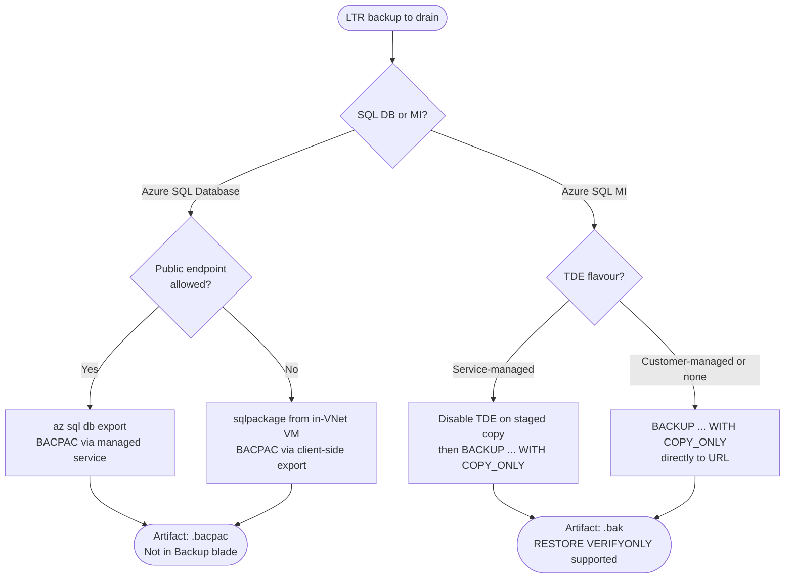
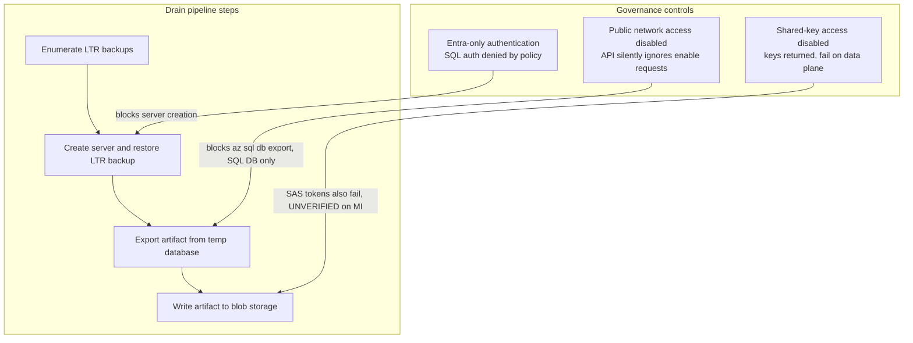

# Lab: SQL LTR backup migration

Validates the tooling in `src/powershell/sql-ltr-export/` and the assumptions it rests on,
before it is pointed at real production data ahead of a subscription deletion.

---

## The original ask

An existing **Azure SQL Database** and an existing **Azure SQL Managed Instance** live in a
source subscription. New equivalents are being stood up in a different subscription. The
source resources, and eventually the whole source subscription, will be deleted. Compliance
requires that a subset of the backup history survives that deletion. The preferred outcome
is that the retained backups show up in the **Backup blade of the new resources**, so a
restore is a normal portal operation. The acceptable fallback is that the backups land as
files in a storage account, ideally in the destination subscription.

### The answer, stated up front

**You cannot move LTR backups.** They are not a movable resource. There is no Azure
Resource Mover path, no export-to-storage path, no cross-subscription attach. The only
operation Azure exposes on an LTR backup is "restore it into a live database", and restore
is subscription-locked: you can only restore an LTR backup into a server or instance in the
**same subscription** that owns the backup.

**You cannot make old backups appear in a new resource's Backup blade.** That blade
reflects the new resource's own PITR and LTR chains, which begin at creation. There is no
import mechanism.

Therefore the only viable route is a **drain**: restore each LTR backup you must keep,
extract a portable artifact from the restored copy, write that artifact to storage, and
delete the restored copy. This drain must run **while the source subscription is still
alive**, because deleting the subscription purges the LTR backups.

---

## Concepts and vocabulary

This section is written for a competent engineer who is not a database administrator.

### PITR: point-in-time restore backups

PITR backups are automatic and always on. You cannot disable them and they are not
separately billable beyond the included allowance. Retention is configurable from 1 to 35
days (default 7). Under the hood, Azure takes a weekly full backup, daily differential
backups, and transaction log backups every 5 to 12 minutes. This combination is what lets
you restore a database to any arbitrary second within the retention window.

**Purpose:** operational recovery. "Someone dropped a table an hour ago."

**Critical property:** PITR backups are deleted when the database is deleted. They are the
wrong tool for compliance retention.

### LTR: long-term retention backups

LTR is an opt-in policy. You configure it per database to retain specific weekly, monthly,
or yearly full backups for up to 10 years. LTR is not a continuous chain: if you restore
from an LTR backup you land at the exact instant that backup was taken, nothing in between.

**Purpose:** compliance and regulatory retention.

**Critical property: LTR has its own lifecycle, independent of the resource that produced
it.** An LTR backup survives deletion of the database, deletion of the logical server, and
deletion of the managed instance. It is purged only when the **subscription** is deleted.
This is why deleting the old database or instance is safe, but deleting the old subscription
is not.

### What the portal's Backup blade shows

Both PITR and LTR, on separate tabs. PITR backups appear on the "Available backups" tab.
LTR backups appear on the "Long-term retention" tab. After the database is deleted, PITR
backups disappear. LTR backups remain visible and restorable as long as the subscription
exists. After the subscription is deleted, both are gone permanently.

### BACPAC

A BACPAC is a logical export: schema plus data as rows, compressed into a zip package
(`.bacpac` file). It is portable and version-tolerant, and it can be restored into Azure
SQL Database or SQL Server via an import operation.

**Important:** a BACPAC is only transactionally consistent if you export from a quiesced or
freshly restored database. Exporting from a live, write-active database can produce an
internally inconsistent snapshot. When using the drain pipeline (restore first, then
export), the restored copy receives no writes, so this is not a problem in practice.

BACPAC export can also fail outright on objects that the DacFx tooling does not support,
which is more common on SQL MI than on SQL Database.

### COPY_ONLY native backup

A COPY_ONLY backup is a real SQL Server backup file (`.bak`) that does not disturb the
differential base or the transaction log chain, making it safe to take alongside an
existing backup schedule. It is fast, byte-exact, and transactionally consistent.
Integrity can be verified years later with `RESTORE VERIFYONLY` without actually restoring
the database.

**This is a Managed Instance capability only.** Azure SQL Database has no `BACKUP DATABASE`
statement. See the comparison table and caveats below.

### Comparison table

| | PITR | LTR | BACPAC | COPY_ONLY `.bak` |
|---|---|---|---|---|
| What it is | Continuous chain of automated backups | Retained point-in-time snapshots | Logical schema+data export | Native SQL Server backup |
| Restore granularity | Any second within window | Exact instant of the backup | Exact state at export time | Exact state at backup time |
| Portable (file you can hold) | No | No | Yes (.bacpac) | Yes (.bak) |
| Survives database deletion | No | Yes | Yes (it is a file) | Yes (it is a file) |
| Survives subscription deletion | No | No | Yes | Yes |
| Cross-subscription restore | Not directly | No (subscription-locked) | Yes, import anywhere | Yes, restore to SQL MI or SQL Server |
| Available on Azure SQL DB | Yes | Yes | Yes | No |
| Available on Azure SQL MI | Yes | Yes | Requires sqlpackage + network access | Yes |
| Integrity verifiable without restore | No | No | No | Yes (RESTORE VERIFYONLY) |
| Typical use | Operational recovery | Compliance retention | Portability, cross-platform migration | Compliance archive, high-fidelity MI drain |

---

## Questions to ask before you start

Use this section to scope your own environment before reading the procedure. Each question
identifies a constraint that changes which pipeline steps are available to you. If an answer
rules out an approach, note it before you start, not after a partial drain that has already
created temporary databases.

### Resource and artifact shape

| Question | Why it matters | What it rules in or out |
|---|---|---|
| **1. Is it Azure SQL Database or Managed Instance?** | SQL Database has no `BACKUP DATABASE` statement at all. MI does. | SQL DB: BACPAC is the only portable artifact. MI: COPY_ONLY native `.bak` is the default (supports `RESTORE VERIFYONLY`). BACPAC is also possible on MI but requires `sqlpackage` with network line-of-sight and loses the integrity verification benefit. |
| **2. Are you using TDE? If yes, which flavour: service-managed or customer-managed (BYOK / Key Vault)?** | Service-managed TDE: the key never leaves the platform, so a `.bak` produced with `COPY_ONLY` is unrestorable anywhere. TDE is on by default on MI. | Service-managed: disable TDE on the staged copy before backup (IO-heavy on large databases; factor into the time budget), then `COPY_ONLY TO URL` produces a plaintext `.bak`. Customer-managed: `COPY_ONLY TO URL` works directly and the `.bak` stays encrypted, but the Key Vault key must be preserved for the full retention period in a vault that outlives the source subscription; lose the key and every artifact is permanently unreadable. In both cases the artifact is a `.bak` file supporting `RESTORE VERIFYONLY`. |
| **3. How large is the largest database?** | `BACKUP TO URL` on MI caps at 195 GB per stripe, 64 stripes maximum (roughly 12.5 TB total). | Up to 195 GB: single-stripe backup. Above 195 GB: striping required, use `-GbPerStripe` in the script. Above ~12.5 TB: `COPY_ONLY` is not feasible; BACPAC may be the only option, at the cost of losing `RESTORE VERIFYONLY` support. |

### Network and access governance

| Question | Why it matters | What it rules in or out |
|---|---|---|
| **4. Is public network access allowed on the logical server or managed instance?** | `az sql db export` is a Microsoft-managed service that connects inbound over the public endpoint. If the endpoint is off, the mechanism is unavailable, not merely unauthorised. A tenant policy can force `publicNetworkAccess` to `Disabled` and silently ignore API requests to enable it, returning success status without changing the value. | Public endpoint allowed: `az sql db export` and the standard drain script work. Public endpoint disabled: client-side `sqlpackage` from in-VNet compute over a private endpoint is the only SQL DB option. The MI path (`BACKUP TO URL`) is unaffected because it writes outbound from inside the instance and never depends on an inbound service. |
| **5. Does the storage account allow shared-key access?** | Shared-key disabled kills account keys and SAS tokens together. The trap: `az storage account keys list` still succeeds and returns a key that then fails on every data-plane operation. The failure is confusingly late and looks like a permissions error. | Shared-key allowed: SAS-based `BACKUP TO URL` works. Shared-key disabled: SAS unavailable. Microsoft documents `CREATE CREDENTIAL ... WITH IDENTITY = 'Managed Identity'` as the alternative for SQL Server on Azure VMs; equivalent support for `BACKUP TO URL` on Azure SQL Managed Instance is not documented in the same way. **Test in your environment before depending on it.** |
| **6. Is the storage account's public network access disabled?** | Even if the SQL resource can reach storage internally, a locked-down storage firewall blocks all workstation-based and managed-service writes at the data plane. | Storage public access allowed: writes go directly. Storage public access disabled: all data-plane calls must originate from inside the VNet. Requires in-VNet compute, a private endpoint on the storage account, a private DNS zone, and `Storage Blob Data Contributor` RBAC on the writing identity. A private endpoint bills at $0.01 per hour regardless of traffic; consider whether to create it only for the drain and delete it afterwards. |
| **7. Can the identity running the drain authenticate into the databases, and if Entra-only authentication is enforced, is a server-level user-assigned managed identity in place for the managed export path?** | If Entra-only authentication is in force (policy `AzureSQL_WithoutAzureADOnlyAuthentication_Deny`), contained database users are required. Without Directory Readers, `CREATE USER ... FROM EXTERNAL PROVIDER` fails and the user must be created from an explicit SID by a privileged admin. Additionally, `az sql db export` under Entra-only auth requires a server-level user-assigned managed identity, which is a preview feature; depending on a preview capability for a compliance-driven drain carries planning risk. Note: `az policy assignment list` does not return management-group-scoped assignments, so a clean result does not confirm the policy is absent. | Directory Readers available: `CREATE USER ... FROM EXTERNAL PROVIDER`. Not available: an Entra privileged admin must create the user from an explicit object ID (`CREATE USER [name] WITH SID = ..., TYPE = E`); confirm this before starting, not after the first authentication failure mid-drain. If using `az sql db export` under Entra-only auth: a server-level user-assigned managed identity is required (preview). Client-side `sqlpackage` does not carry this dependency and avoids the preview risk. |
| **8. Are there policy escape hatches (for example a resource tag that exempts from a deny policy), and is your organisation actually permitting you to use them?** | Escape hatches exist for legitimate exceptions, but using one to suppress a security control for operational convenience undermines the control and may create audit findings. | Confirm written approval from your security team before using any exemption mechanism. Availability of an escape hatch does not imply permission to use it. |

### Scope, timing and cost

| Question | Why it matters | What it rules in or out |
|---|---|---|
| **9. Are the LTR backups and the drain infrastructure in the same subscription?** | LTR restore is subscription-locked. The staging server or instance that receives the restore must be in the same subscription that owns the LTR backup. | Cross-subscription staging: not possible. The artifact destination (storage account) can be in any subscription; only the restore target is constrained. |
| **10. When is the source subscription being deleted?** | This is the hard deadline. LTR backups survive database, server, and instance deletion, but are purged permanently when the subscription is deleted. There is no recovery after that point. | Build in time for a full recovery drill (restore at least one artifact end to end) before the subscription is deleted. An untested compliance archive is not a compliance archive. |
| **11. Which subset of LTR backups must you actually retain for compliance?** | Cost scales directly with count and size. Artifact storage dominates the multi-year total by roughly 50x over compute. A wide compliance scope is also a large and costly archive. | Narrowing the scope to the legally required minimum is the single largest cost lever available. Run `src/powershell/sql-ltr-export/Get-LtrExportCostEstimate.ps1` for each candidate scope before committing. |
| **12. Do you have vCore and server quota headroom in the source subscription for the temporary restore targets?** | The drain creates temporary databases in the source subscription. SQL DB logical servers are free, but General Purpose vCores and MI vCores consume regional quota. | Check `az sql server list-usages` and MI vCore quota before starting. Running out of quota mid-drain leaves orphaned temporary databases that keep billing and require manual cleanup. |
| **13. Can the Managed Instance stay running for the entire LTR retention wait (up to 7 days)?** | A stopped MI takes no automated backups at all. A skipped LTR backup is never backfilled. Stopping the instance during the wait destroys the backup you were waiting to produce. | The MI must stay running for the entire wait. The free MI offer defaults to a schedule that stops the instance outside working hours to conserve credits; that schedule is incompatible with a continuous retention wait. |
| **14. Do you need the retained backups to appear in the new resource's Backup blade?** | The Backup blade reflects only the new resource's own PITR and LTR chains, which begin at that resource's creation. There is no import mechanism. | Not possible. The only output of this process is files in a storage account. Plan for the operational cost of a non-blade restore path: you need to know which file to use, provision a staging target, and execute a manual restore. |
| **15. What storage tier and redundancy do the artifacts need?** | Storage dominates the multi-year cost. Archive cuts the total by roughly 20x versus Hot, at the cost of up to 15 hours of rehydration before a restore. Only Hot is volume-banded; Cool, Cold, and Archive are flat-rate at any volume. | Hot: immediate access, highest cost. Cool or Cold: lower cost, small read penalty. Archive: lowest cost, up to 15-hour rehydration. For a compliance copy that may never be read, Archive is usually right. See `cost-model/` for the full tier and redundancy comparison. |

### Decision flowchart

Walk through resource type, TDE mode, and public endpoint availability to identify the viable
pipeline for your environment.



Source: `diagrams/04-decision-tree.mmd`

---

## Caveats

Each caveat states what breaks and what to do instead.

### COPY_ONLY backup is Managed Instance only

Azure SQL Database has no `BACKUP DATABASE` statement at all. On SQL Database, BACPAC
is the only portable artifact you can produce. This makes the SQL Database drain path
simpler in tooling but more constrained in governance environments (see the public-endpoint
caveat below).

### BACKUP TO URL is incompatible with service-managed TDE

A database encrypted with service-managed Transparent Data Encryption (TDE) cannot be
backed up with `COPY_ONLY` to URL. The service-managed key never leaves the platform, so
the resulting `.bak` file would be unrestorable anywhere. TDE is on by default on Managed
Instance, so this blocks the native backup path unless handled.

Two options:

- **Disable TDE on the staged copy** (the toolkit's default). Run `ALTER DATABASE ... SET
  ENCRYPTION OFF` on the throwaway restored copy, back it up, then discard the copy. The
  original database is never touched. This produces a plaintext `.bak`, so protect it with
  immutable blob storage and service-side encryption on the storage account.
- **Customer-managed TDE (BYOK, Azure Key Vault)**. If the instance already uses CMK TDE,
  the `.bak` stays encrypted, but you must preserve that Key Vault key for the full
  retention period, in a vault that outlives the deleted subscription. Lose the key and
  every artifact is permanently unreadable.

Note also: disabling TDE on a large restored database is an IO-heavy operation and can take
hours. It needs to be in the time budget. Also note the striping limits: 195 GB per stripe,
64 stripes maximum.

### BACPAC export requires a reachable public endpoint

`az sql db export` is a Microsoft-managed service that connects **inbound** to the
database over its public endpoint. If public network access is disabled on the logical
server, the export service cannot reach the database, and the failure is not a permissions
error that can be granted away: the mechanism is simply unavailable.

In Jose's governed tenant, `publicNetworkAccess` is force-disabled and stays `Disabled`
after three independent attempts to enable it:

| Attempt | Result |
|---|---|
| `az sql server update --enable-public-network true` | Reported success, exit code 0, value unchanged |
| ARM `PATCH` with `publicNetworkAccess: Enabled` | Accepted, returned an operation, value unchanged |
| Fresh server created with `--enable-public-network true` | Created successfully, came back `Disabled` |

The tenant enforces this silently. Nothing errors. The API accepts the request, reports
success, and ignores it. Any script that sets this flag and then assumes it took effect
will proceed on a false premise. Full narrative evidence is in the Pre-flight results
section below.

**Workaround:** run `sqlpackage` from compute inside the virtual network, connected over a
private endpoint. This is a client-side export and is not subject to the
Microsoft-managed-service constraint. The compute, private endpoint, DNS, and sqlpackage
installation are your responsibility.

### The governance corollary: MI survives the lockdown, SQL DB does not

This is the most consequential finding in the lab. `BACKUP TO URL` on Managed Instance
writes **outbound from inside the instance** directly to blob storage. It never depends on
an inbound Microsoft-managed service. So it is unaffected by a forced-off public endpoint.

The SQL Database path, which looked simpler because it uses a managed export service,
breaks entirely in a locked-down tenant. The MI path, which looked harder because it
requires native T-SQL and storage credentials, is the robust one. The approach that seemed
more complex turned out to be the one that works.

### Entra-only authentication may be mandatory

SQL authentication is denied tenant-wide by policy in Jose's environment (policy:
`SFI-ID4.2.2 SQL DB - Safe Secrets Standard`,
`AzureSQL_WithoutAzureADOnlyAuthentication_Deny`). Any logical server or managed instance
that allows SQL authentication is rejected at creation. An equivalent policy applies to
Managed Instances (`AzureSQLMI_WithoutAzureADOnlyAuthentication_Deny`).

Every tool in the drain chain must authenticate with an Entra token. The toolkit
originally assumed SQL authentication and had to be reworked. Full evidence and the
compliant pattern are in the Pre-flight results section below.

Do not use the `SecurityControl=Ignore` escape hatch on the resource or resource group. It
suppresses a tenant security control to make a lab convenient, and the compliant path
exists.

### Shared-key access may be disabled on storage accounts

A storage account can be configured to refuse shared-key access, which kills account keys
and SAS tokens. The trap: `az storage account keys list` still succeeds and returns a key,
but that key fails on every data-plane call. The failure lands late and looks like a
permissions problem. SAS-based `BACKUP TO URL` is therefore unavailable in this
configuration.

The workaround is a managed identity credential on the Managed Instance:
`CREATE CREDENTIAL ... WITH IDENTITY = 'Managed Identity'`. This approach is documented
for SQL Server on VMs. **UNVERIFIED: it is not confirmed to work for Azure SQL Managed
Instance `BACKUP TO URL`. Do not treat it as a working solution until tested.**

### LTR backups cannot be created on demand

The timing of LTR backups is controlled by Microsoft. After enabling an LTR policy, the
first backup can take up to 7 days to appear. This dominates the lab's calendar.

Mitigation: when an LTR policy is enabled for the first time, the most recent existing
PITR full backup is copied into long-term storage. Enable the policy early and wait.

### A stopped Managed Instance takes no automated backups

A General Purpose Managed Instance supports stop/start, which halts compute and licence
billing while storage continues. This looks like an obvious cost lever during the 7-day
wait for an LTR backup.

**Do not use it here.** A stopped instance takes no automated backups at all. A skipped LTR
backup is never backfilled. The instance must stay running for the entire wait. This is why
the MI half of the lab costs roughly $102 for a 7-day wait rather than the small number an
earlier draft assumed.

### CLI asymmetries

- `az sql midb export` does not exist. Exporting from a Managed Instance database requires
  `sqlpackage` with network line-of-sight to the instance.
- `az sql db ltr-backup delete` has no `--id` parameter, unlike its `midb` counterpart. It
  requires `-l -s -d -n` with the backup name in the form `<serverGuid>;<ticks>;<tier>`.

---

## Recommended process

**Do this before the source subscription is deleted.** Once the subscription is gone, the
LTR backups are gone with it.

If Entra-only authentication is enforced in the source subscription, each step requires
a different credential form: server creation takes `--enable-ad-only-auth`, data seeding
uses `Invoke-Sqlcmd -AccessToken`, and BACPAC export uses `--auth-type ManagedIdentity`
with a server-level user-assigned managed identity. The full pattern is documented in the
Pre-flight results section below.

### Step 0: scope the compliance requirement

Decide which LTR backups must actually be retained. Cost scales directly with count and
size. Run the cost model in `cost-model/` and the compute estimator in
`src/powershell/sql-ltr-export/Get-LtrExportCostEstimate.ps1` before committing to a
drain run.

If the source subscription survives (resources deleted but subscription kept empty), do
nothing: the LTR backups persist and you pay only LTR storage. The drain pipeline is only
necessary if the subscription itself is being deleted.

### Step 1: drain Azure SQL Managed Instance first

If the source MI is still running, restore LTR backups directly into it. This makes the
compute cost of staging zero: you are already paying for those vCores. This is the most
important cost lever in the whole process.

For each LTR backup to preserve:
1. Restore the LTR backup to a temporary database on the instance (same subscription).
2. If the database is using service-managed TDE, disable TDE on the restored copy. Plan
   the time: this is IO-heavy on large databases.
3. Run `BACKUP DATABASE ... WITH COPY_ONLY TO URL`, writing directly to the destination
   blob storage account. Stripe if the database exceeds 195 GB.
4. Delete the temporary database immediately.

See `src/powershell/sql-ltr-export/Export-SqlMiLtrBackups.ps1`.

### Step 2: drain Azure SQL Database

For each LTR backup to preserve:
1. Restore the LTR backup to a temporary database in the source subscription. The logical
   server is free; only the temporary database incurs compute cost.
2. Export to BACPAC via `sqlpackage`. If public network access is disabled on the logical
   server, `az sql db export` will not work: run `sqlpackage` from compute inside the
   virtual network connected over a private endpoint.
3. Write the `.bacpac` to the destination blob storage account.
4. Delete the temporary database.

See `src/powershell/sql-ltr-export/Export-SqlDbLtrBackups.ps1`.

### What you end up with

A storage account (ideally in the destination subscription, same region as the source to
avoid bandwidth charges) containing `.bacpac` and `.bak` files, each with a manifest row
recording which original server, database, and restore point it came from.

These files are restorable on demand. They will **not** appear in the new resource's
Backup blade. The Backup blade reflects only the new resource's own PITR and LTR chains.
This is a real loss of convenience compared to the preferred outcome; it is the only viable
alternative, and the reader should know it going in.

For storage tier selection (Archive vs Cool vs Cold), bandwidth costs, and the private
endpoint variant, see `cost-model/README.md`. The Archive tier typically cuts the 7-year
storage cost by roughly 20x, at the cost of a multi-hour rehydration delay.

---

## Diagrams

No drawio or mermaid MCP tools were available during authoring. Diagrams were authored as
`.mmd` sources under `labs/sql-ltr-backup-migration/diagrams/` and validated with
`npx @mermaid-js/mermaid-cli` (exit 0 on all three). They are embedded below as fenced
blocks for native GitHub rendering.

### Backup lifecycle: where PITR and LTR diverge

The visual punchline is the database-deletion event. PITR backups die with the database;
LTR backups live on to the subscription boundary.


Source: `diagrams/01-backup-lifecycle.mmd`

### Drain pipeline: SQL Database and SQL MI side by side

Each branch ends at a file in storage. The constraints annotated on each step are the ones
that determine whether the step can run at all in a given governance environment.


Source: `diagrams/02-drain-pipeline.mmd`

### Governance constraints: what each control blocks

Workarounds: G1 (Entra-only auth) requires `--enable-ad-only-auth` at server creation, an
access token for scripts, and a user-assigned managed identity for the export service. G2
(public network access) is handled by running `sqlpackage` from in-VNet compute; the MI
path is unaffected because it writes outbound rather than accepting inbound. G3
(shared-key disabled) requires a managed identity credential for `BACKUP TO URL`; this is
**UNVERIFIED** on Managed Instance.



Source: `diagrams/03-governance-constraints.mmd`

---

**Short answer to "can this be tested in one subscription?": yes, about 90% of it.**
Only two assumptions genuinely need a second subscription, one of them is cheap to add,
and one of them must never be tested at all.

## Scenarios

| # | Scenario | Subscriptions needed |
|---|---|---|
| 1 | LTR backups survive deletion of database, server and managed instance | 1 |
| 2 | Deleted-source backups are still enumerable and restorable | 1 |
| 3 | SQL DB drain: LTR -> temp DB -> BACPAC -> blob, round-tripped back | 1 |
| 4 | MI drain: TDE blocker, workaround, COPY_ONLY, `RESTORE VERIFYONLY` | 1 |
| 5 | Striping path for databases above 195 GB | 1 (see trick below) |
| 6 | Artifact destination in a different subscription | **2** (storage only) |
| 7 | LTR restore is subscription-locked (negative test) | **2**, optional |
| 8 | Subscription deletion purges LTR | **Never test.** Irreversible. |

## What genuinely requires cross-subscription

Only **scenario 6**, and it is the cheap one: it needs a *storage account* in a second
subscription and nothing else. No SQL resources, no second instance. The claim being tested
is that `az sql db export` and MI's `BACKUP TO URL` authenticate to storage with a key or
SAS rather than through ARM, so the subscription boundary is irrelevant to them.

If a second subscription is genuinely unavailable, this can be approximated convincingly in
one subscription by removing every ARM path to the storage account and leaving only the SAS:

- grant the SQL server / MI managed identity **no** RBAC role on the storage account
- run the drain as a principal with **no** ARM permission on the storage account
- set the storage firewall to default-deny, allowing only trusted Azure services

If the export still succeeds under those conditions, ARM authorisation demonstrably played
no part, which is the actual mechanism in question. That is a strong proxy, not a proof.
Prefer the real second subscription; a storage account costs cents.

**Scenario 7** is a negative test of documented behaviour ("The database can be restored to
any existing server or managed instance under the same subscription as the original
database"). Worth running once if a second subscription is handy, purely to confirm the
failure is clean and early rather than a partial restore. Low value otherwise.

**Scenario 8 must not be tested.** Subscription deletion is irreversible and would destroy
the very backups under study. Take it from the documentation.

## The trick for scenario 5

Do not provision a 200 GB database to test striping. Force the code path on a small
database instead by shrinking the stripe threshold:

```powershell
.\Export-SqlMiLtrBackups.ps1 ... -GbPerStripe 1
```

A 3 GB staged database then produces a 3-way striped backup, exercising the multi-URL
`BACKUP` and `RESTORE VERIFYONLY` syntax, the stripe-count arithmetic and the manifest
`Stripes` field. Only the 195 GB boundary value itself goes untested, and that value comes
from a documented platform limit rather than from our logic.

## The scheduling constraint that dominates this lab

**LTR backups cannot be created on demand.** From the LTR documentation:

> The timing of individual LTR backups is controlled by Microsoft. You can't manually create
> an LTR backup or control the timing of the backup creation. After you configure an LTR
> policy, it might take up to seven days before the first LTR backup shows up on the list of
> available backups.

There is one mitigation, also documented: when an LTR policy is enabled **for the first
time** on a database, the most recent existing PITR full backup is copied into long-term
storage. So seeding early and waiting is the only reliable approach.

This splits the lab into two phases separated by days, which is unusual for this repo's
labs and needs to be planned for rather than discovered:

| Phase | Activity | Elapsed |
|---|---|---|
| Seed | Create resources, load data, enable LTR policies, then **stop and wait** | Day 0 |
| Poll | `az sql db ltr-backup list` until backups appear | Day 0 to Day 7 |
| Execute | Delete sources, run both drain scripts, verify | Day N |
| Teardown | Delete everything, including LTR policies | Day N |

Do not let the managed instance idle at full price during the wait. General Purpose
instances support stop/start, which halts compute and licence billing while storage
continues, so stop it between the seed and execute phases.

## Cost of the lab

**Database half only** (scenarios 1, 2, 3, 5):

| Item | Estimate |
|---|---|
| SQL DB serverless, 60-minute auto-pause, ~3 active hours | ~$1 |
| Data storage for ~36 GB across five databases, one week | ~$1 |
| Storage, LTR and artifacts | <$1 |
| **Total** | **~$5 to $10** |

**Adding the Managed Instance** (scenario 4):

| Item | Estimate |
|---|---|
| MI, GP Gen5 4 vCore, running continuously for a 7-day wait | ~$102 |
| MI storage | ~$1 |
| **Total** | **~$110, plus 2 to 4 hours of provisioning time** |

The MI figure is not a typo and it cannot be reduced by stopping the instance between
phases. A stopped instance takes no automated backups, and a skipped LTR backup is never
backfilled, so the instance has to stay up for the whole wait. Earlier drafts of this table
assumed otherwise and understated the MI cost by roughly a factor of sixteen.

Keep test databases small, single-digit GB. The lab validates mechanics, not throughput.
Throughput numbers for the real estimate should be calibrated separately by measuring the
first production database and feeding the result back into `Get-LtrExportCostEstimate.ps1`.

## Deliberately out of scope

- Subscription deletion behaviour (scenario 8).
- Real-world restore durations. Lab databases are too small to extrapolate from.
- Customer-managed-key TDE. The tooling defaults to `DisableOnStagedCopy` precisely to
  avoid introducing a Key Vault key that must outlive the old subscription; testing the CMK
  path is only worthwhile if you have decided to accept that key-custody burden.

See `validation.md` for the assertion-level matrix.

## Cost model

`cost-model/` holds an Excel model of the transfer and long-term storage cost of the
artifacts this lab produces, plus a variant for reaching the storage account over a private
endpoint. See [`cost-model/README.md`](cost-model/README.md). It is the storage half of the
picture; `src/powershell/sql-ltr-export/Get-LtrExportCostEstimate.ps1` is the compute half.

## How this lab deviates from the repo convention

`labs/README.md` describes the convention for this folder, and it assumes an **Azure
Networking** lab following an eight-phase lifecycle with a specific artifact set. This lab
deliberately departs from it in four ways. They are listed here so the gaps read as choices
rather than omissions.

| Convention | This lab | Why |
|---|---|---|
| Azure Networking subject matter | Azure SQL Database and Managed Instance backup retention | The question asked was a database one. The rest of the repo's tooling and structure still applied, so it was reused rather than duplicated elsewhere. |
| `design.md` with mechanism trade-offs and an F-table / M-table resiliency analysis | Absent | Those sections model failure and recovery of a running network topology. This lab has no topology and no traffic; its subject is the lifecycle of a backup artifact. The equivalent reasoning lives in the decision tree and the BACPAC vs native `.bak` comparison in `src/powershell/sql-ltr-export/README.md`. |
| `## Designs studied` section with recommended and not-recommended designs | Covered by the scenario table above and by `validation.md` | The unit of study here is an assertion to be proved or disproved, not a design to be recommended. Scenario 8 is an explicit "never do this". |
| `lessons-learned.md`, `show-output/`, `screenshots/` | Not yet created | These are execution artifacts and **this lab has never been run**. Creating them now would mean inventing evidence. They should be written during phase 3. |
| `diagrams/` | Three mermaid diagrams: backup lifecycle, drain pipeline, governance constraints | Added retroactively once the lab had enough empirical evidence to label them with real findings rather than guesses. |

One convention this lab does follow exactly: **sanitization**. No subscription IDs, tenant
IDs, server names or admin passwords appear in any committed file, and the deploy scripts
take the admin password as a `SecureString` parameter rather than embedding one.

## Lab environment

Provisioned by `deploy/Deploy-LtrLab.ps1`. Single subscription, one free logical server,
five databases, one storage account. The managed instance is opt-in because it alone
costs more than everything else combined.

| Database | Size | Data shape | Why it exists |
|---|---|---|---|
| `calib-1gb` | 1 GB | mixed | Anchors the fixed-overhead term |
| `calib-5gb` | 5 GB | mixed | Middle point; also the held-out prediction test |
| `calib-20gb` | 20 GB | mixed | Anchors the per-GB slope |
| `probe-compressible` | 5 GB | repeated bytes | Upper bound on compression ratio |
| `probe-random` | 5 GB | `CRYPT_GEN_RANDOM` | Lower bound: incompressible worst case |

**Why three sizes.** Drain time is modelled as `minutes = Fixed + (PerGb * SizeGb)`. One
size cannot separate those terms: any single measurement is explained equally well by a
large fixed cost or a steep slope. Three sizes spanning an order of magnitude let
`Measure-LtrCalibration.ps1` recover both by least squares, and the R-squared tells you
whether the linear assumption holds at all.

**Why two data shapes.** The estimator assumes BACPAC compresses ~4x. That number is pure
guesswork and it multiplies the dominant cost term. A dry run of the fitter against
synthetic ground truth reported a compression range of **1.02x to 33x** between the two
probes. If your data resembles the random probe, artifact storage costs roughly four times
the default estimate. Bracketing this is worth two small databases.

The databases are serverless with a 60-minute auto-pause, so the multi-day wait for LTR
backups costs storage only.

## Pre-flight results

Phase 0 has been run. Nothing has been deployed to Azure.

Quotas below were read from the lab subscription in `swedencentral`.

| Check | Result |
|---|---|
| `Test-LabSql.ps1` | PASS, `Seed-LabData.sql` parses as 4 batches |
| `Test-DrainHelpers.ps1` | PASS, 9 of 9 |
| Regional SQL server quota | 0 of 250 |
| Regional vCore quota, SQL DB | 0 of 500 |
| MI subnet quota | 0 of 8 |
| MI vCore quota | 0 of 960 |
| MI free offer instances | 0 of 1, available |
| MI free vCore hours currently granted | 0 |

Two prerequisites are not satisfied by a fresh clone:

1. **The `SqlServer` PowerShell module.** Phase 1 seeds data through `Invoke-Sqlcmd`.
   Install it with `Install-Module SqlServer -Scope CurrentUser`.
2. **An admin password**, supplied interactively as a `SecureString`. It is never written
   to the repo.

### Finding: the toolkit assumed SQL authentication, and that can be denied outright

The first live deployment attempt **failed**, and the failure is more useful than a success
would have been.

Creating the logical server was rejected by Azure Policy:

```
(RequestDisallowedByPolicy) Resource 'ltrlab...-sql' was disallowed by policy.
policyDefinitionName: AzureSQL_WithoutAzureADOnlyAuthentication_Deny
policyDefinitionDisplayName: SFI-ID4.2.2 SQL DB - Safe Secrets Standard
```

The governing management group denies any `Microsoft.Sql/servers` whose
`properties.administrators.azureADOnlyAuthentication` is not `True`. In other words
**SQL authentication is forbidden**, and every script here was written around an admin
username and password.

A companion policy, `AzureSQLMI_WithoutAzureADOnlyAuthentication_Deny`, applies the same
rule to Managed Instances, so this is not something the MI half escapes.

The policy does expose an escape hatch, a `SecurityControl=Ignore` tag on the resource or
resource group. **Do not use it.** It suppresses a tenant security control to make a lab
convenient, and the compliant path exists.

The compliant path, which is what this lab now uses:

| Concern | SQL auth approach | Entra-only approach |
|---|---|---|
| Server admin | `-u/-p` | `--enable-ad-only-auth` plus an external admin principal |
| Seeding | `Invoke-Sqlcmd -Credential` | `Invoke-Sqlcmd -AccessToken` |
| BACPAC export | `--auth-type SQL` | `--auth-type ManagedIdentity` |
| Storage auth | account key | `--storage-key-type ManagedIdentity` plus RBAC |

Export under Entra-only authentication requires a **user-assigned managed identity attached
at the logical server level**, granted `Storage Blob Data Contributor` on the artifact
storage account and made a database user in each database being exported. A
system-assigned identity, a database-scoped identity, or a service principal will not do,
and the feature is still in preview.

**Carry this into production planning.** If the subscription holding the LTR backups sits
under similar governance, a drain runbook built on SQL authentication will fail at the
first step, and the fallback of "just enable SQL auth temporarily" is exactly what the
policy exists to prevent.

### Finding: public network access is forced off, which breaks the export mechanism entirely

With Entra-only authentication in place the server was created successfully, and the
deployment then failed one step later:

```
(DenyPublicEndpointEnabled) Unable to create or modify firewall rules when public
network interface for the server is disabled.
```

This one is worse than it looks, and it was worth testing rather than assuming. Three
attempts to turn public access on:

| Attempt | Result |
|---|---|
| `az sql server update --enable-public-network true` | Reported success, exit code 0, value unchanged |
| ARM `PATCH` with `publicNetworkAccess: Enabled` | Accepted, returned an operation, value unchanged |
| Fresh server created with `--enable-public-network true` | Created successfully, came back `Disabled` |

The tenant forces `publicNetworkAccess: Disabled` on every logical server, **silently**.
Nothing errors. The API accepts the request, reports success, and ignores it. Any script
that sets this flag and then assumes it took effect will proceed on a false premise.

The consequence is the significant one. Azure's BACPAC import/export runs as a
**Microsoft-managed service that connects to the database over its public endpoint**. With
public network access denied, that service cannot reach the database, so `az sql db export`
cannot work in this tenant at all. The failure mode is not a permissions error that can be
granted away; the mechanism is simply unavailable.

**This invalidates the central assumption of the drain toolkit.** Both drain scripts are
built on the service-side export path.

Two compliant alternatives exist, and neither is a drop-in replacement:

| Approach | Trade-off |
|---|---|
| Import/Export via private link | Service creates managed private endpoints for the operation, which you must manually approve on both the SQL server and the storage account. Still in preview, and Azure SQL Database only. |
| `sqlpackage` on a VM inside the virtual network | Fully supported and predictable, but you now own compute, a private endpoint, DNS, and the software. This is the same self-hosted requirement the MI drain already had. |

There is an irony worth noting: the MI drain script was written to use native `BACKUP TO
URL` precisely because `az sql midb export` does not exist, and that path writes to storage
from inside the instance rather than via a Microsoft-managed service. **The MI approach is
the one that survives this governance model**, while the SQL Database approach, which
looked simpler, is the one that breaks.

### Run the SQL Database half first

The lab is worth splitting. Scenarios 1, 2, 3 and 5 need only Azure SQL Database, whose
databases are serverless with a 60-minute auto-pause, so the multi-day wait costs storage
only, on the order of $5 to $10.

Scenario 4 needs a Managed Instance, and it is a different proposition entirely:

- The minimum is 4 General Purpose vCores, roughly **$102 for a seven-day wait**, plus two
  to four hours simply to provision.
- **The instance cannot be stopped to reduce that.** A stopped instance takes no automated
  backups, and a skipped LTR backup is never backfilled, so stopping it during the wait
  destroys the very thing the wait exists to produce.
- **The free offer does not rescue this, and is actively dangerous here.** A free instance
  is available (720 vCore hours per month for 12 months, one per subscription), but it
  defaults to a 9-to-5 weekday schedule specifically to conserve those credits. That
  schedule is exactly the stopped-instance trap above: the instance would be off for
  roughly two thirds of every week and the LTR backup would likely never be produced. Run
  it always-on and a seven-day wait consumes 672 of the 720 monthly hours, leaving almost
  no margin before the instance auto-stops and silently breaks the run. Use a paid instance
  and treat the free offer as unsuitable for this particular lab.

Since the two drain scripts share most of their logic, running the Database half first
falsifies the shared assumptions, above all the compression ratio, for about 8 percent of
the cost of doing both.

## Running the lab

| Phase | Script | Duration |
|---|---|---|
| 0. Pre-flight | `Test-LabSql.ps1`, `Test-DrainHelpers.ps1` | seconds |
| 1. Seed | `Deploy-LtrLab.ps1` | ~1 hour (data load) |
| 2. Wait | `Watch-LtrLabBackups.ps1` | hours to 7 days |
| 3. Execute | delete sources, then the drain scripts in `src/powershell/sql-ltr-export/` | ~2 hours |
| 4. Calibrate | `Measure-LtrCalibration.ps1` | minutes |
| 5. Teardown | `Remove-LtrLab.ps1` | minutes |

```powershell
cd labs\sql-ltr-backup-migration\deploy

# Phase 0: parse the T-SQL before spending an hour finding a typo the hard way
.\Test-LabSql.ps1
# ...and prove the instrumentation helpers parse az output correctly. They fail soft
# to blank, so a parsing bug would silently leave phase 4 with nothing to fit.
.\Test-DrainHelpers.ps1

# Phase 1
.\Deploy-LtrLab.ps1 -ResourceGroup rg-ltr-lab -Location eastus `
    -AdminUser ltrlab -AdminPassword (Read-Host -AsSecureString) -WhatIf

# Phase 2 (poll; do not proceed until backups appear)
.\Watch-LtrLabBackups.ps1 -Location eastus -Server <server>

# Phase 3: prove survival, then drain
az sql db delete -g rg-ltr-lab -s <server> -n <db> --yes
.\Watch-LtrLabBackups.ps1 -Location eastus -Server <server> -Once   # must still list

# Phase 4: the drain manifest IS the measurement run
.\Measure-LtrCalibration.ps1 -TimingCsv ..\..\..\ltr-export-manifest-*.csv

# Phase 5 (deletes the LTR backups too; the resource group alone is not enough)
.\Remove-LtrLab.ps1 -ResourceGroup rg-ltr-lab -Location eastus -Server <server>
```

**The drain scripts instrument themselves.** Each manifest row carries `SourceGb`,
`RestoreMinutes`, `ExportMinutes` and `ArtifactGb` alongside the provenance fields, so
phase 4 reads the manifest directly. There is no separate timing file to assemble by hand,
and the model is fitted against the *measured* size of each restored copy rather than the
size the seed script was asked for. Those two numbers routinely differ, and the difference
lands in the per-GB slope if you ignore it.

**Teardown is not just a resource-group delete.** LTR backups deliberately outlive their
source resources, so `Remove-LtrLab.ps1` clears the policies and deletes the backups
explicitly. Skipping it leaves them billing for the full 12-week retention.

