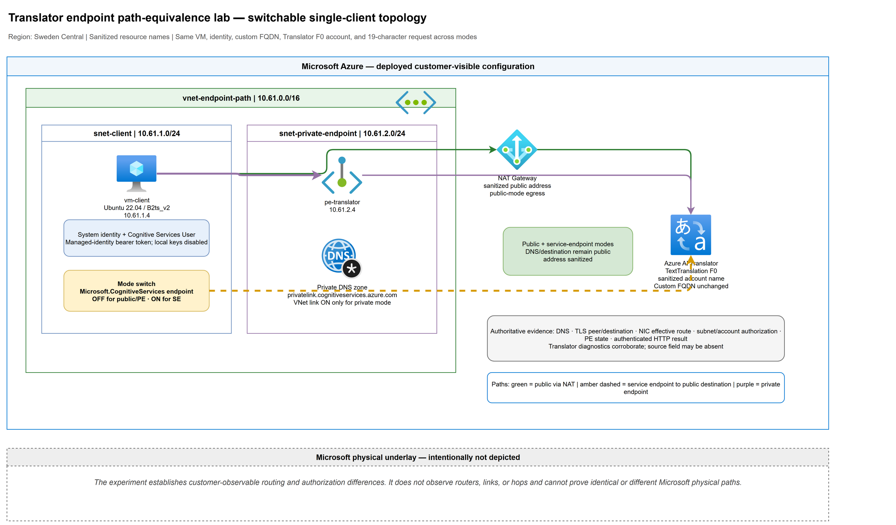
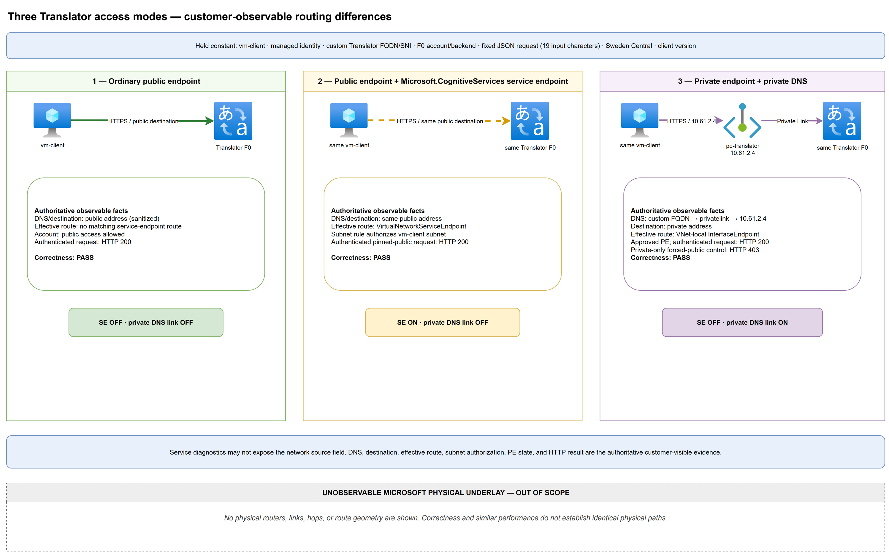
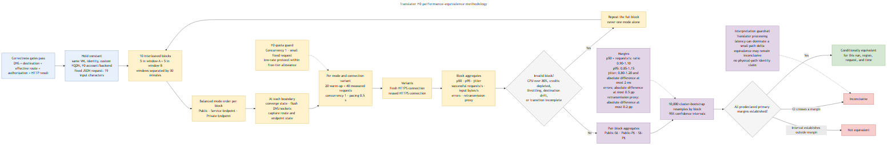
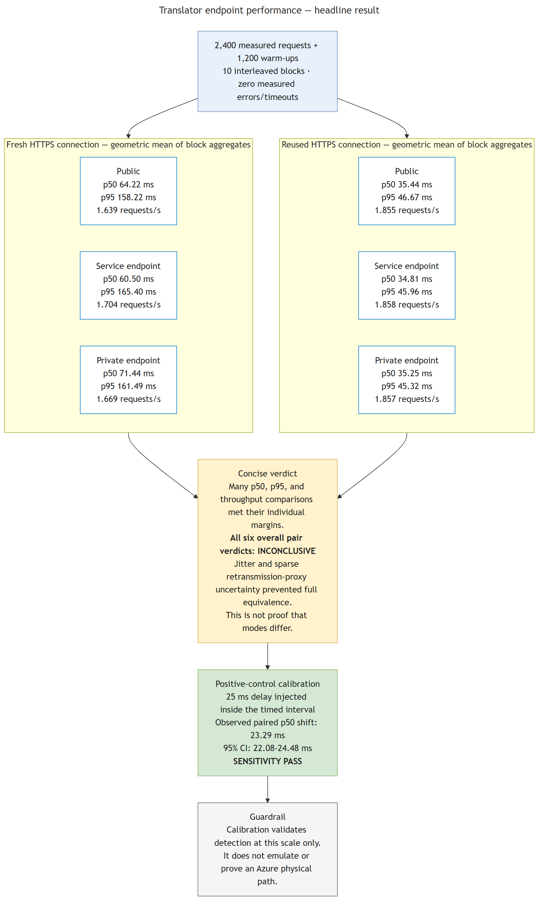

# Are Azure public, service, and private endpoints equally fast?

The practical question is not whether Azure exposes the same physical routers for public, service-endpoint, and private-endpoint access. It does not. The useful question is whether an application sees **equivalent performance** when it reaches the same Azure service through those three access modes.

In this lab, many latency and throughput comparisons met our predeclared equivalence margins. But the experiment did **not** establish overall equivalence: confidence intervals for jitter and a sparse TCP-retransmission proxy crossed their margins for every endpoint pair. That is a statistically inconclusive result—not evidence that the modes perform differently.

The strongest operational finding was elsewhere: **reusing HTTPS connections mattered much more than the endpoint mode**. Median latency clustered near 35 ms with a persistent connection, versus 60–71 ms when every request created a new TCP/TLS connection.

## What we compared

One Azure VM sent the same small, authenticated Azure AI Translator request through three sequential network states:

1. **Public endpoint:** public DNS and destination, with no matching service-endpoint route.
2. **Service endpoint:** the same public FQDN and public destination, but with a `Microsoft.CognitiveServices` service endpoint and subnet authorization.
3. **Private endpoint:** the same custom service FQDN resolving through Private DNS to the private endpoint address.

The client, identity, service account, region, request body, concurrency, pacing, and VM stayed constant. Only the endpoint state changed.

> This tests conditional application-level performance equivalence. It cannot reveal or prove equality of Microsoft's physical underlay paths.

### Why this became a Translator lab

The original design used Azure Storage. An enforced organizational policy automatically disabled public network access on Storage accounts, making the required public and service-endpoint controls impossible without bypassing governance.

Rather than request a policy exception, the lab was redesigned around Azure AI Translator F0. Translator supported the same three access states, Microsoft Entra authentication through the VM's managed identity, subnet rules, and Private Link without violating the active policy. The redesign changed the workload from bulk object transfer to a fixed 19-character translation request, so the experiment became a low-rate latency and request-throughput study—not a bandwidth test.

## Observable routes are not physical routes

The correctness phase deliberately separated what a customer can observe from what remains inside the Azure platform.

| Mode | Customer-visible observation |
|---|---|
| Public | Public DNS/destination; no matching `VirtualNetworkServiceEndpoint` route; authenticated HTTP 200 |
| Service endpoint | Public destination retained; effective route changed to `VirtualNetworkServiceEndpoint`; subnet authorization worked; HTTP 200 |
| Private endpoint | The same service FQDN resolved to `10.61.2.4`; effective route was VNet-local/`InterfaceEndpoint`; approved private endpoint; HTTP 200 |

Two negative controls strengthened that evidence:

- Removing the authorized subnet rule changed the restricted service-endpoint request from HTTP 200 to HTTP 403.
- With public access disabled, a forced-public request preserving the original FQDN, TLS SNI, Host header, body, and identity returned HTTP 403, while ordinary Private DNS access returned HTTP 200.

All five correctness scenarios—R1 through R5—passed after recovery from an Azure VM management-plane stall.

These results prove observable differences in DNS, destination, effective routing, and authorization behavior. They do **not** show which Microsoft routers, links, or internal service fabrics carried a packet. Traceroute, similar latency, or a `VirtualNetworkServiceEndpoint` route label cannot close that visibility gap.

## The measurement design

We declared the comparison rules before analyzing the data. The predeclared
randomized/interleaved design was executed as a recorded, balanced endpoint-order
schedule in the validation harness:

- ten complete, balanced endpoint-order blocks;
- endpoint modes interleaved within every block rather than measured in three long batches;
- five blocks in one time window and five after a 30-minute separation;
- recorded deterministic seeds and mode order;
- concurrency 1, fixed 19-character input, and 0.5-second pacing;
- 20 warm-up plus 40 measured requests for each mode and connection variant in each block;
- fresh and reused HTTPS connections analyzed separately;
- paired block aggregates as the statistical unit;
- 10,000 cluster-bootstrap resamples by block and 95% confidence intervals;
- block invalidation for incomplete transitions, unexpected destinations, throttling, CPU above 80%, or depleted CPU credits.

No block hit an invalidation threshold. Maximum recorded VM CPU was 14.52%, and the minimum remaining CPU-credit value was 60.61.

The main benchmark contained **2,400 measured requests and 1,200 warm-ups**, with zero measured errors and zero timeouts.

### Predeclared equivalence margins

| Metric | Margin |
|---|---|
| p50 latency | ratio 0.90–1.10 |
| p95 latency | ratio 0.85–1.15 |
| Successful-request throughput | ratio 0.90–1.10 |
| Jitter, p95−p50 | ratio 0.80–1.20 **and** absolute difference ≤2 ms |
| Error rate | absolute difference ≤0.5 percentage points |
| TCP retransmission proxy | absolute difference ≤0.2 percentage points |

An interval wholly inside a margin supported equivalence. An interval crossing a margin was **inconclusive**. “No significant difference” was never treated as proof of equivalence.

## Headline measurements

The table reports geometric means of the ten block aggregates:

| Connection | Mode | p50 ms | p95 ms | Requests/s |
|---|---|---:|---:|---:|
| Fresh | Public | 64.22 | 158.22 | 1.639 |
| Fresh | Service endpoint | 60.50 | 165.40 | 1.704 |
| Fresh | Private endpoint | 71.44 | 161.49 | 1.669 |
| Reused | Public | 35.44 | 46.67 | 1.855 |
| Reused | Service endpoint | 34.81 | 45.96 | 1.858 |
| Reused | Private endpoint | 35.25 | 45.32 | 1.857 |

The persistent-connection result is hard to miss. Reused-connection p50 latency stayed between **34.81 and 35.44 ms** across all modes; fresh-connection p50 ranged from **60.50 to 71.44 ms**. At p95, reused connections stayed between **45.32 and 46.67 ms**, while fresh connections ranged from **158.22 to 165.40 ms**.

That does not mean endpoint selection never matters. It means that, for this small request at concurrency 1, connection establishment and service-processing variability dominated the observed endpoint-mode differences.

## What passed—and what did not

Across the 18 pairwise p50, p95, and throughput tests, **14 met their equivalence margins**:

| Variant | Pair | p50 | p95 | Throughput | Overall |
|---|---|---|---|---|---|
| Fresh | Public ↔ service endpoint | Inconclusive | Equivalent | Equivalent | **Inconclusive** |
| Fresh | Public ↔ private endpoint | Inconclusive | Equivalent | Equivalent | **Inconclusive** |
| Fresh | Service ↔ private endpoint | Inconclusive | Equivalent | Equivalent | **Inconclusive** |
| Reused | Public ↔ service endpoint | Equivalent | Inconclusive | Equivalent | **Inconclusive** |
| Reused | Public ↔ private endpoint | Equivalent | Equivalent | Equivalent | **Inconclusive** |
| Reused | Service ↔ private endpoint | Equivalent | Equivalent | Equivalent | **Inconclusive** |

Every comparison also had equivalent error rates because all measured requests succeeded. However, jitter intervals and the sparse retransmission-proxy intervals crossed their stricter margins in every endpoint pair. Because the protocol required **all** primary metrics to pass, every overall verdict remained inconclusive.

The correct conclusion is:

> This experiment found equivalence in many latency and throughput dimensions, especially with reused connections, but it did not establish overall performance equivalence among public, service-endpoint, and private-endpoint access. It also did not establish a performance difference.

More samples might narrow some intervals, but that should be a new predeclared experiment—not a post-hoc attempt to turn uncertainty into a preferred answer.

## Did the harness have enough sensitivity?

We tested the measurement system with a separate positive control. The control kept the same region, VM, service backend, identity, request, endpoint state, pacing, and reused-connection client. It inserted a deterministic **25 ms client-side delay inside the measured timer**, alternating control-first and injected-first order across ten paired blocks.

The calibration collected **800 measured samples and 400 warm-ups**, with zero errors or timeouts. It observed a **23.29 ms paired p50 shift**, with a **95% bootstrap confidence interval of 22.08–24.48 ms**.

The interval's lower bound exceeded the predeclared 5 ms detection floor, and the estimate remained inside the expected 20–30 ms range. The sensitivity control therefore **passed**.

This shows that the harness could detect a known perturbation at that scale. The injected delay was not a network-path emulator and says nothing about the Azure physical underlay.

## Practical takeaways

1. **Optimize connection reuse before debating endpoint micro-latency.** In this workload, persistent HTTPS reduced latency far more than the differences observed among endpoint modes.
2. **Choose endpoint modes for security and architecture first.** Public access, service endpoints, and Private Link have materially different DNS, routing, authorization, exposure, and operational models even when application performance is close.
3. **Use equivalence statistics when the question is “close enough.”** A conventional difference test cannot prove equivalence.
4. **Keep correctness and performance evidence separate.** Similar timing does not prove identical routing, and different route labels do not automatically imply a meaningful application-performance difference.
5. **Calibrate the harness.** A positive control makes a negative or inconclusive result much more informative.

The scope remains narrow: one Translator F0 account in Sweden Central, one `Standard_B2ts_v2` client, concurrency 1, a small fixed request, and one observation window. Translator processing latency can obscure smaller network effects. The configured VNet flow log succeeded, but the intended legacy `AzureNetworkAnalytics_CL` table was absent, so flow-log querying remained a telemetry limitation.

The VM is deallocated. The lab resources have not yet been cleaned up.

## Diagrams

### Switchable single-client topology

### The three observable endpoint modes

### Performance-equivalence methodology

### Results and verdict

## Reproduce and inspect

- [Validation protocol and correctness evidence](validation.md)
- [Final results and headline tables](results.md)
- [Benchmark harness](deploy/translator_benchmark.py)
- [Validation orchestrator](deploy/run-validation.ps1)
- [Scenario-state transitions](deploy/set-scenario-state.ps1)
- [Equivalence analysis](analyze_results.py)
- [Machine-readable equivalence verdicts](raw-output/sepath-validation-20260806T133000Z/analysis/equivalence-verdicts.json)
- [Calibration analysis](analyze_calibration.py)
- [Machine-readable calibration result](raw-output/sepath-validation-20260806T133000Z/calibration/calibration-analysis.json)
- [Sanitizer](sanitize_results.py)

Published captures replace subscription and tenant identifiers, GUIDs, credentials, account and resource-group names, bearer tokens, and public addresses with stable placeholders.
