# vwan-dual-er-symmetric

> 📝 **Blog post:** _pending publication_ (Kid)

## Designs studied

### Design A: Two isolated GCP VPCs / two Cloud Routers: 📚 Baseline only

**Status:** 📚 Teaching baseline / superseded  
**Verdict:** Structurally symmetric for the original per-region model, but it hides the on-prem dual-uplink routing problem because each Cloud Router has only one MCR peer.

**What it is:** The original manifest topology used two independent GCP VPCs/subnets (`10.50.1.0/24` and `10.50.2.0/24`), each with its own Cloud Router and Partner Interconnect to the matching MCR/ER/hub. This keeps region affinity by construction rather than making a single router choose between two WAN uplinks.

**Evidence:**
- `manifest.md` §2.1-§3.4: original two-VPC/two-router symmetry model and failure-mode scenario.
- `design.md` §3.6: design comparison table: Design A has two VPCs, two CRs, one peer each, and no GCP-layer best-path decision.
- No dedicated `show-output/design-a-*` folder was captured; it was a baseline design stage, not the final deployed validation target.

**Why this verdict:** Design A avoids ECMP by avoiding the problem: each GCP Cloud Router has a single peer, so GCP never has to compare MCR1 vs MCR2 for the same Azure prefix. That makes it useful as a baseline, but weaker as a blog/lab centerpiece because it does not resemble a single on-prem DC router with two uplinks.

**Use this design when:**
- You want simplest per-region isolation and do not need to demonstrate a dual-homed on-prem router.
- Each GCP/on-prem region is intentionally independent.

**Avoid this design when:**
- The objective is to study BGP best-path selection on one on-prem router.
- You need one shared on-prem routing domain with two WAN circuits.

### Design B: Shared GCP VPC, two regional Cloud Routers: 🔴 Anti-pattern without Axis-2 prepend

**Status:** 🔴 Not recommended / asymmetric anti-pattern  
**Verdict:** Deterministic asymmetric routing caused stateful firewall drops when both GCP prefixes were advertised into both MCRs without the missing Axis-2 prepend.

**What it is:** Design B moved to one GLOBAL GCP VPC while keeping two regional Cloud Routers: `router_a` in europe-west3 and `cr_onprem_b` in europe-west4. Both routers advertised both GCP subnets into both MCRs, but VM-B's region still used the eu-w4 router/MCR2 for Azure-bound return traffic.

**Evidence:**
- `show-output/design-b-phase1-asymmetric-2026-06-15/README.md`: verdict: asymmetric routing proved.
- `show-output/design-b-phase1-asymmetric-2026-06-15/09-tcp-a-to-b-x5.txt`: spoke1→VM-B timeout.
- `show-output/design-b-phase1-asymmetric-2026-06-15/11-azfw1-kql-results.txt` and `12-azfw2-kql-results.txt`: AzFW1 allowed SYNs while AzFW2 had no state for the return path.
- `design.md` §3.6: Design B transition state: one VPC, two CRs, no GCP best-path selection per CR.

**Why this verdict:** The Design B capture shows Hub1 selected MCR1/ER1 for traffic to `10.50.2.0/24`, while VM-B returned via `cr_onprem_b`→MCR2→ER2→Hub2. The flow split across AzFW1 and AzFW2; Azure Firewall silently dropped return SYN-ACKs because the return firewall had no state.

**Use this design when:**
- You need an anti-pattern demonstration of stateful drops from cross-region return-path drift.
- You want to teach why one shared VPC plus regional routers is not enough.

**Avoid this design when:**
- Any production or lab goal requires reliable hybrid TCP connectivity.
- You cannot add a deterministic path-selection signal for the opposite direction.

### Design C baseline: Single GCP Cloud Router, dual-ER active/active, no route maps: 🔴 Anti-pattern

**Status:** 🔴 Not recommended / lab centerpiece anti-pattern  
**Verdict:** Fatal stateful drops persisted because the single Cloud Router ECMP-hashed all four Azure spoke /24s across both MCRs with equal priority.

**What it is:** Design C collapsed the GCP side to one Cloud Router (`router-vwan-symm-a`, ASN 16550 for Partner Interconnect) with two Partner Interconnect attachments: one to MCR1 ASN 65001 and one to MCR2 ASN 65002. Azure kept dual ER active/active with default routing and no vWAN route maps.

**Evidence:**
- `show-output/design-c-asymmetric-2026-06-15/README.md`: Design C asymmetric verdict.
- `show-output/design-c-asymmetric-2026-06-15/07-router-a-status.txt`: all spoke /24s learned via both MCRs at priority 0.
- `show-output/design-c-asymmetric-2026-06-15/09-tcp-spoke1-to-vmb-x5.txt` and `12-tcp-spoke3-to-vmb-x5.txt`: intermittent/total TCP timeouts.
- `design.md` §3.1-§3.6: single-CR rationale and comparison.

**Why this verdict:** The GCP control-plane capture proved that hub /23 aggregates were single-path but spoke /24s were ECMP across MCR1 and MCR2. Data-plane probes then showed the exact failure mode: some SYNs left through one Azure Firewall while return SYN-ACKs arrived at the other firewall and were silently dropped.

**Use this design when:**
- You want to reproduce the hard-to-diagnose ECMP/stateful-firewall failure for education.
- You need evidence that a single on-prem router with two equal paths is not automatically symmetric.

**Avoid this design when:**
- The design must carry production traffic through stateful firewalls.
- You cannot tolerate per-flow hash-dependent failures.

### Mech C1: Active/active per-prefix vWAN route-map prepend: ✅ Recommended (active/active)

**Status:** ✅ Symmetric against a standards-compliant on-prem router  
**Verdict:** Outbound vWAN route maps with reserved ASN `64496×3` pin each prefix's return path to its home circuit and cut firewall cross-contamination from 54 flows to 1 flow per firewall. On any CE router that honors AS-path, this is full return-path symmetry.

**What it is:** C1 kept active/active semantics and applied outbound route maps on each hub's ER connection. Hub1 prepended AS 64496 three times for Hub2 prefixes; Hub2 prepended AS 64496 three times for Hub1 prefixes. AS 64496 is from the RFC 5398 documentation range and replaced the earlier rejected AS_TRANS value 23456.

**Evidence:**
- `show-output/design-c-mechC1-symmetric-2026-06-16/14-verdict.md`: final C1 verdict.
- `show-output/design-c-mechC1-symmetric-2026-06-16/01-cr-status-full.json` and `02-cr-routes-summary.txt`: BGP best-path intent is correct (2-hop home path vs 5-hop prepended path per /24).
- `show-output/design-c-mechC1-symmetric-2026-06-16/10-azfw1-kql.txt` and `11-azfw2-kql.txt`: 54→1 contamination reduction.
- `design.md` §4.1: C1 route-map design and ASN rationale.

**Why this verdict:** Under the standard BGP best-path algorithm, AS-path length is compared before MED, and eBGP installs a single best path by default. So a standards-compliant on-prem router selects the shorter home-circuit path for each prefix and returns traffic symmetrically. The residual /24 ECMP observed in the lab is a GCP Cloud Router artifact (it ranks VPC dynamic routes by MED and ignores AS-path), out of scope here because GCP only simulates on-prem. See the simulator caveat below.

**Use this design when:**
- You want active/active operation with both circuits carrying their home-region return traffic.
- You want a minimal vWAN route-map change with no hub routing preference reprovision.

**Avoid this design when:**
- You need a single deterministic primary circuit (use C2 active/passive instead).
- Your actual on-prem peer ranks routes by MED and ignores AS-path (the GCP-like case; see C3).

### Mech C2: Active/passive MCR1 primary, MCR2 standby: ✅ Recommended (active/passive) + ✅ failover validated

**Status:** ✅ Symmetric against a standards-compliant on-prem router + ✅ validated failover  
**Verdict:** C2 made Hub1/ER1/MCR1 the deterministic primary, returns all traffic via the primary on any AS-path-honoring peer, and proved failover to MCR2 in 54.2s with restore in 45.4s.

**What it is:** C2 removed Hub1 route maps, made Hub2 the standby with a blanket outbound `64496×5` prepend for all Azure prefixes, added Hub2 inbound `64496×5` prepend for GCP prefixes, and set both vHubs to `hubRoutingPreference = ASPath`.

**Evidence:**
- `show-output/design-c-mechC2-symmetric-2026-06-16/15-verdict.md`: final C2 verdict.
- `show-output/design-c-mechC2-symmetric-2026-06-16/02-gcp-cr-bestroutes-table.txt`: MCR1 unprepended (2-hop) and MCR2 `64496×5` (7-hop) paths per /24, primary intent obvious.
- `show-output/design-c-mechC2-symmetric-2026-06-16/08-azfw-kql-cross-contamination-summary.txt`: Hub1 primary flows plus GCP-artifact standby hits.
- `show-output/design-c-mechC2-symmetric-2026-06-16/13-failover-during-primary-down.json` and `14-failover-after-primary-restored.json`: failover and restore timing.
- `design.md` §4.2 and §4.5: C2 design and deliberate primary-down validation step.

**Why this verdict:** A standards-compliant on-prem router prefers the 2-hop MCR1 path for every prefix (shorter AS-path, decided before MED) and only uses the 7-hop MCR2 path on failure. The deliberate primary-down test confirmed convergence: all deployed spoke /24s moved to MCR2-only paths in 54.2s and vm-spoke3→vm_a succeeded 5/5, restoring in 45.4s. The residual steady-state ECMP seen in the lab is, again, the GCP MED-ranking artifact, not a property of C2.

**Use this design when:**
- You want a single deterministic primary circuit with automatic standby failover.
- You want MCR1/ER1/Hub1 to be the operational primary with MCR2 as standby.

**Avoid this design when:**
- You want both circuits active for home-region return traffic (use C1).
- Your actual on-prem peer ranks routes by MED and ignores AS-path (the GCP-like case; see C3).

### Mech C3: Suppress standby /24s or use peer-side MED/priority: 📚 Edge case (peers that ignore AS-path)

**Status:** 📚 Optional, only for MED-ranking peers: proposed, not validated  
**Verdict:** C3 is not required for standard on-prem routers. It is the fallback for the narrow case where the on-prem peer ranks routes by MED and ignores AS-path the way GCP Cloud Router does, in which case AS-path prepend alone cannot stop /24 ECMP.

**What it is:** C3 would suppress the more-specific spoke /24 advertisements on the standby circuit and advertise only /23 aggregates there, or apply a peer-side route-selection signal such as MED/custom learned-route priority so standby /24s have worse priority than primary /24s. The goal is to leave the standby usable for failure while removing it from steady-state ECMP on a MED-ranking peer.

**Evidence:**
- Proposed from `show-output/design-c-mechC1-symmetric-2026-06-16/14-verdict.md` and `show-output/design-c-mechC2-symmetric-2026-06-16/15-verdict.md` recommendations.
- `design.md` §4.2 caveat: on a MED-ranking peer like GCP, full /24 determinism requires suppressing standby /24s or using a peer-side priority lever.
- No `show-output/design-c-mechC3-*` folder yet: **not deployed and not validated**.

**Why this verdict:** Against a standards-compliant peer, C1 and C2 already deliver symmetry because AS-path is decisive before MED, so C3 adds nothing. C3 only matters for peers (such as GCP Cloud Router) that derive route priority from MED and install both unequal-AS-path /24s at priority 0; there, changing the candidate set (aggregate-only standby) or the peer-side priority is the lever that actually removes the ECMP.

**Use this design when:**
- Your real on-prem peer behaves like GCP Cloud Router (ranks by MED, ignores AS-path) and you need full steady-state /24 determinism.
- You can accept aggregate-only standby advertisements or can implement a peer-side priority/MED policy.

**Avoid this design when:**
- Your on-prem peer honors AS-path (the common case): C1 or C2 already suffices.
- You need validated evidence today; this is still a proposed next step.

### Design D: Linux NVA fallback: 📚 Proposed fallback, not deployed

**Status:** 📚 Fallback option / not validated  
**Verdict:** Design D could simulate a single on-prem router if Megaport/GCP pairing is blocked, but it adds a new NVA failure domain and weakens the clean Partner Interconnect BGP story.

**What it is:** Design D keeps the Design B infrastructure and inserts a Linux NVA (BIRD/FRR) inside the GCP VPC as a logical on-prem router. VMs use the NVA as a next hop; the NVA makes forwarding decisions based on routes derived from the Cloud Routers.

**Evidence:**
- `design.md` §3.7: fallback sketch.
- No `show-output/design-d-*` folder: not deployed and not validated.

**Why this verdict:** The design preserves the teaching idea of one logical router with two uplinks, but it no longer validates the native single-Cloud-Router Partner Interconnect behavior that became the centerpiece of Design C.

**Use this design when:**
- Megaport pairing changes are blocked and a GCP-only fallback is needed.
- A logical simulation is acceptable.

**Avoid this design when:**
- The lab must prove native Cloud Router dual-uplink behavior.
- You do not want an additional NVA SPOF.

## Diagrams

- **Topology:** [Open in draw.io](diagrams/01-topology.drawio)
  _(PNG render pending: open the .drawio file in draw.io desktop/online for the interactive view)_

- **BGP control plane:** see [`diagrams/02-bgp-control-plane.mmd`](diagrams/02-bgp-control-plane.mmd) or embedded below

```mermaid
flowchart LR
    GCP["GCP VPC single-CR on-prem sim\nCloud Router ASN 16550 (Partner Interconnect)\nvm_a subnet 10.50.1.0/24 eu-w3\nvm_b/eu-w4 removed in Phase 1B"]

    MCR1["Megaport MCR1\nASN 65001\nMCR PoP: Equinix Frankfurt FR5\nER1 peering: Stockholm"]
    MCR2["Megaport MCR2\nASN 65002\nMCR PoP: Equinix Amsterdam AM1\nER2 peering: Amsterdam"]

    ERC1["ER Circuit 1\nMSEE ASN 12076\nStockholm peering"]
    ERC2["ER Circuit 2\nMSEE ASN 12076\nAmsterdam peering"]

    HubA["Hub1 swedencentral\n10.10.0.0/23\nvHub BGP ASN 65515\nSpokes: 10.11.0.0/24, 10.12.0.0/24"]
    HubB["Hub2 northeurope\n10.20.0.0/23\nvHub BGP ASN 65515\nSpokes: 10.21.0.0/24, 10.22.0.0/24"]

    GCP -- "Partner Interconnect eBGP\nASN 16550 ↔ 65001\nadvertises 10.50.1.0/24" --> MCR1
    GCP -- "Partner Interconnect eBGP\nASN 16550 ↔ 65002\nadvertises 10.50.1.0/24" --> MCR2

    MCR1 -- "VXC to ER1\neBGP 65001 ↔ 12076\nprimary clean path" --> ERC1
    MCR2 -- "VXC to ER2\neBGP 65002 ↔ 12076\nstandby de-prepended with RFC5398 ASN 64496" --> ERC2

    ERC1 -- "ER private peering\nASN 12076 ↔ vHub ASN 65515" --> HubA
    ERC2 -- "ER private peering\nASN 12076 ↔ vHub ASN 65515" --> HubB

    HubA -- "vHub-to-vHub routing intent\nprivate traffic via in-hub AzFWs" --> HubB

    classDef gcp fill:#e8f5e9,stroke:#34a853,color:#000
    classDef megaport fill:#ffe6cc,stroke:#d6b656,color:#000
    classDef msee fill:#f5f5f5,stroke:#666666,color:#000
    classDef azure fill:#dae8fc,stroke:#6c8ebf,color:#000

    class GCP gcp
    class MCR1,MCR2 megaport
    class ERC1,ERC2 msee
    class HubA,HubB azure
```

- **Data plane (symmetric paths + anti-pattern):** see [`diagrams/03-data-plane-symmetric.mmd`](diagrams/03-data-plane-symmetric.mmd)

- **Cleanup chain:** see [`diagrams/04-cleanup-chain.mmd`](diagrams/04-cleanup-chain.mmd)

### Deployed values used in diagrams

| Label | Actual deployed value |
|---|---|
| MCR1 ASN | `65001` |
| MCR2 ASN | `65002` |
| GCP Cloud Router ASN | `16550` (Partner Interconnect) |
| ER/MSEE ASN | `12076` |
| vHub BGP ASN | `65515` |
| Hub1 prefix | `10.10.0.0/23` |
| Hub2 prefix | `10.20.0.0/23` |
| Hub1 spokes | `10.11.0.0/24`, `10.12.0.0/24` |
| Hub2 spokes | `10.21.0.0/24`, `10.22.0.0/24` |
| GCP active subnet | `10.50.1.0/24` (`vm_a`, europe-west3) |
| Removed GCP subnet | `10.50.2.0/24` / `vm_b` removed in Phase 1B; single-CR on-prem sim remains in europe-west3 |
| Reserved prepend ASN | `64496` (RFC 5398 documentation ASN), not `23456` |
| MCR1 / ER1 locations | MCR1 Equinix Frankfurt FR5; ER1 Stockholm peering |
| MCR2 / ER2 locations | MCR2 Equinix Amsterdam AM1; ER2 Amsterdam peering |
